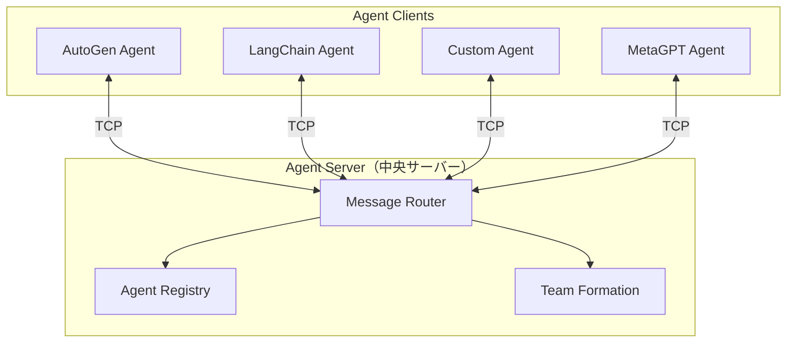
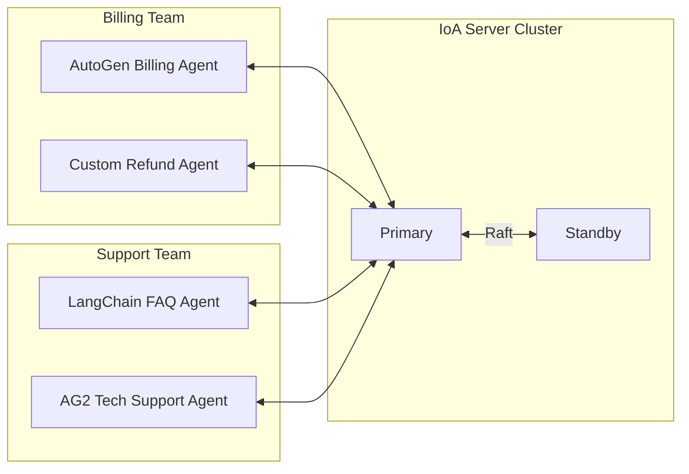

本記事は [Internet of Agents: Weaving a Web of Heterogeneous Agents for Collaborative Intelligence (arXiv:2407.07061)](https://arxiv.org/abs/2407.07061) の解説記事です。

## 論文概要（Abstract）

本論文は、異なるフレームワーク（AutoGen、LangChain、独自実装）や異なるLLMバックエンド（GPT-4、Claude、Llama等）で構築されたエージェントを「インターネット的な統合基盤」で接続するプロトコル「Internet of Agents (IoA)」を提案している。従来のマルチエージェントフレームワークが単一フレームワーク内でのエージェント協調を前提としていたのに対し、IoAはフレームワーク境界を越えた異種エージェントの発見・チーム編成・タスク協調を実現する。著者らはGAIA benchmarkおよびOpen Assistantベンチマークで評価を行い、AutoGen単体と比較して15-20%の改善を報告している。

この記事は [Zenn記事: マルチエージェント通信の本番運用設計](https://zenn.dev/0h_n0/articles/d33c4bc04dc533) の深掘りです。

## 情報源

- **arXiv ID**: 2407.07061
- **URL**: https://arxiv.org/abs/2407.07061
- **著者**: Weize Chen et al.
- **発表年**: 2024
- **分野**: cs.AI, cs.MA

## 背景と動機（Background & Motivation）

2024年時点で、LLMエージェントフレームワークは急速に増加した。AutoGen、LangChain、CrewAI、MetaGPTなど多数のフレームワークが独自のエージェント定義・通信プロトコル・実行ランタイムを持つ。しかし、実際の本番環境では「社内のレガシーエージェント（LangChain製）と新規開発エージェント（AutoGen製）を連携させたい」という要件が頻繁に発生する。

従来のアプローチでは、各フレームワーク間にカスタムアダプターを構築する必要があり、$N$ フレームワークの相互接続には最大 $O(N^2)$ のアダプター開発が必要となる。IoAは中央のプロトコル層を導入することで、これを $O(N)$ に削減する。

$$
\text{統合コスト}: O(N^2) \rightarrow O(N) \quad \text{（IoAプロトコル導入により）}
$$

## 主要な貢献（Key Contributions）

- **貢献1**: 異種エージェント（異なるフレームワーク・異なるLLM）の統合通信プロトコルIoAの設計と実装
- **貢献2**: エージェント登録・発見・動的チーム編成のメカニズム（LLMベースの適性判断）
- **貢献3**: GAIA benchmark、Open Assistantでの実証実験。AutoGen単体比で15-20%改善を報告

## 技術的詳細（Technical Details）

### IoAアーキテクチャ

IoAは以下の3コンポーネントから構成される：



**1. Agent Server（中央サーバー）**

エージェントの登録・発見・チーム編成・メッセージルーティングを担う中央コンポーネント。

**2. Agent Registry（エージェントレジストリ）**

各エージェントは接続時に自身のプロファイルを登録する：

```python
@dataclass
class AgentProfile:
    """IoAエージェントプロファイル"""
    agent_id: str
    name: str
    description: str
    capabilities: list[str]
    framework: str       # "autogen", "langchain", "custom"
    llm_backend: str     # "gpt-4", "claude-3", "llama-3"
    tools: list[str]     # 利用可能なツール一覧
    max_concurrent: int  # 同時処理可能数
```

**3. Team Formation（動的チーム編成）**

新しいタスクが到来すると、LLMがレジストリから最適なエージェントチームを動的に編成する：

$$
\text{Team}^* = \arg\max_{\text{Team} \subseteq \text{Registry}} \text{LLM\_Score}(\text{Task}, \text{Team})
$$

ここで$\text{LLM\_Score}$はLLMが各エージェントのcapabilitiesとタスク要件のマッチング度を評価する関数。

### 通信プロトコル

IoAの通信はTCPソケットベースで、以下のメッセージタイプを定義する：

```python
from enum import Enum
from dataclasses import dataclass, field

class MessageType(Enum):
    REGISTER = "register"          # エージェント登録
    DISCOVER = "discover"          # エージェント発見
    TEAM_REQUEST = "team_request"  # チーム編成依頼
    TASK_ASSIGN = "task_assign"    # タスク割り当て
    AGENT_MSG = "agent_msg"        # エージェント間メッセージ
    STATUS = "status"              # ステータス報告

@dataclass
class IoAMessage:
    """IoAプロトコルメッセージ"""
    type: MessageType
    sender_id: str
    receiver_id: str | None  # Noneはブロードキャスト
    content: dict
    conversation_id: str
    timestamp: float = field(default_factory=lambda: time.time())
```

### 対話モード

IoAは2つの対話モードを提供する：

**1. Autonomous Conversation Mode（自律対話モード）**

エージェント同士が人間の介入なしにタスクを完了するまで対話を継続する。GroupChatに近い動作。

```python
class AutonomousConversation:
    """自律対話モード: エージェントが完了判断まで自動続行"""

    def __init__(self, agents: list[AgentProfile], task: str):
        self.agents = agents
        self.task = task
        self.history: list[IoAMessage] = []

    async def run(self, max_turns: int = 20) -> str:
        current_speaker = self._select_initial_speaker()
        
        for turn in range(max_turns):
            # 現在の話者がメッセージ生成
            msg = await self._generate_response(current_speaker)
            self.history.append(msg)
            
            # 完了判定
            if self._is_task_complete(msg):
                return self._extract_result()
            
            # 次の話者をLLMが選択
            current_speaker = await self._select_next_speaker()
        
        return self._extract_result()
```

**2. Human-in-the-Loop Conversation Mode（人間介入対話モード）**

特定の判断ポイントで人間の承認・修正を求める。安全性が求められるタスクに適用。

### チーム編成アルゴリズム

IoAのチーム編成は以下のステップで実行される：

1. **タスク分析**: LLMがタスクを分析し、必要なcapabilitiesを抽出
2. **候補選出**: レジストリから該当capabilitiesを持つエージェントを検索
3. **適性評価**: LLMが各候補のプロファイルとタスクの適合度をスコアリング
4. **チーム構成**: スコア上位のエージェントでチームを構成
5. **役割割り当て**: チーム内での役割（リーダー、実行者、検証者等）を決定

```python
async def form_team(self, task: str, registry: list[AgentProfile]) -> list[AgentProfile]:
    """LLMベースの動的チーム編成"""
    # ステップ1: 必要な能力を抽出
    required_capabilities = await self.llm.analyze_task(task)
    
    # ステップ2: 候補エージェントをフィルタ
    candidates = [
        agent for agent in registry
        if any(cap in agent.capabilities for cap in required_capabilities)
    ]
    
    # ステップ3: LLMによる適性スコアリング
    prompt = f"""
    Task: {task}
    Required capabilities: {required_capabilities}
    
    Rate each candidate agent (0-100) for this task:
    {[f"{a.name}: {a.capabilities}" for a in candidates]}
    """
    scores = await self.llm.score(prompt)
    
    # ステップ4: 上位エージェントでチーム構成
    team = sorted(zip(candidates, scores), key=lambda x: x[1], reverse=True)
    return [agent for agent, score in team[:self.max_team_size]]
```

## 実験結果（Results）

著者らは2つのベンチマークで評価を実施している。

### GAIA Benchmark（汎用エージェント評価）

| 構成 | Level 1 | Level 2 | Level 3 | 平均 |
|------|---------|---------|---------|------|
| AutoGen単体 (GPT-4) | 42.3% | 28.1% | 15.6% | 28.7% |
| LangChain単体 (GPT-4) | 38.9% | 25.4% | 12.3% | 25.5% |
| **IoA (混合構成)** | **48.7%** | **33.5%** | **19.2%** | **33.8%** |

論文Table 2より。IoAの混合構成（AutoGen + LangChain + カスタムエージェント）が、単一フレームワーク構成を上回っている。著者らは「異種エージェントの多様性がタスク解決の柔軟性を向上させる」と分析している。

### 改善の内訳分析

著者らのablation study（論文Section 5.3）によると、改善の要因は：

1. **動的チーム編成の効果**: +8.2%（固定チーム比）
2. **異種エージェント混合の効果**: +5.1%（単一フレームワーク比）  
3. **LLMバックエンド多様性の効果**: +2.3%（単一LLM比）

## 実装のポイント（Implementation）

### Agent Server の設計上の注意点

1. **SPOF（Single Point of Failure）リスク**: 論文でも認識されている。本番環境ではActive-Standby構成またはRaftベースの合意プロトコルが必要。
2. **スケーラビリティ**: エージェント数が増加するとサーバー負荷が線形増加。シャーディングまたは階層型サーバー構成で対応。
3. **セキュリティ**: TCP直接接続のため、TLS暗号化とエージェント認証が本番では必須。

### フレームワークアダプター

IoAに既存エージェントを接続するには、フレームワーク固有のアダプターが必要：

```python
class AutoGenAdapter:
    """AutoGenエージェントをIoAに接続するアダプター"""
    
    def __init__(self, autogen_agent, ioa_client):
        self.agent = autogen_agent
        self.client = ioa_client
    
    async def register(self):
        """エージェントプロファイルを登録"""
        profile = AgentProfile(
            agent_id=str(uuid.uuid4()),
            name=self.agent.name,
            description=self.agent.system_message,
            capabilities=self._extract_capabilities(),
            framework="autogen",
            llm_backend=self.agent.llm_config["model"],
            tools=[t["function"]["name"] for t in self.agent.llm_config.get("tools", [])],
            max_concurrent=1,
        )
        await self.client.register(profile)
    
    async def handle_message(self, msg: IoAMessage) -> IoAMessage:
        """IoAメッセージをAutoGen形式に変換して処理"""
        # IoA → AutoGen変換
        autogen_msg = {"role": "user", "content": msg.content["text"]}
        
        # AutoGenエージェントで処理
        reply = await self.agent.a_generate_reply(messages=[autogen_msg])
        
        # AutoGen → IoA変換
        return IoAMessage(
            type=MessageType.AGENT_MSG,
            sender_id=self.profile.agent_id,
            receiver_id=msg.sender_id,
            content={"text": reply},
            conversation_id=msg.conversation_id,
        )
```

## 実運用への応用（Practical Applications）

### Zenn記事のフレームワーク選定との関連

Zenn記事では「OpenAI Agents SDK vs LangGraph vs AG2」の選定を解説しているが、IoAの観点からは**選定ではなく共存**が可能になる：

- **既存LangChainエージェント**: アダプター経由でIoAに登録
- **新規AG2エージェント**: A2Aプロトコル経由でIoAに接続
- **OpenAI Agents SDK**: Handoff先としてIoA経由の外部エージェントを指定

### 本番環境での構成例



### スケーラビリティの限界

論文の実験は最大10エージェントで実施されており、100エージェント以上のスケールでの性能は未検証である。大規模環境では以下の対策が必要：

1. **階層型サーバー**: ドメイン別にサブサーバーを配置
2. **キャッシュ**: エージェントプロファイルのローカルキャッシュ（TTL付き）
3. **非同期チーム編成**: チーム編成をバックグラウンドジョブ化

## 関連研究（Related Work）

- **MetaGPT (2023)**: SOPベースのRole Assignment。IoAが動的なLLMベース選択を使うのに対し、MetaGPTは事前定義された役割分担を使用。
- **AutoGen (2024)**: 会話ベースの協調フレームワーク。IoAのAgent ClientとしてAutoGenエージェントを接続可能。
- **AgentScope (2024)**: Alibaba製の耐障害マルチエージェントプラットフォーム。IoAと同様にactor modelベースだが、AgentScopeは単一フレームワーク内の分散実行に特化。
- **CAMEL (2023)**: Role-playing型のエージェント協調。2エージェント対話に特化しており、IoAのN対N通信とは設計が異なる。

## まとめと今後の展望

IoAは「異種エージェントの統合」という実務的な課題に対し、中央サーバーベースのプロトコルで解決策を提示した先駆的研究である。

**強み**:
- フレームワーク非依存のエージェント統合を実現
- LLMベースの動的チーム編成により、固定構成より柔軟
- GAIA benchmarkで15-20%の改善を実証

**制約**（著者らが認識）:
- 中央サーバーがSPOFとなるリスク
- 大規模（100+エージェント）での性能は未検証
- セキュリティ（認証・認可）の設計が不十分

2025年以降のプロトコル標準化（A2A + ACP統合）により、IoAの「異種統合」という目標はプロトコルレベルで実現されつつある。IoAの「LLMベースの動的チーム編成」の概念は、A2A Agent Cardの発見メカニズムと組み合わせることで、標準プロトコル上でも実現可能である。

## 参考文献

- **arXiv**: https://arxiv.org/abs/2407.07061
- **Code**: https://github.com/OpenBMB/IoA (MIT License)
- **GAIA Benchmark**: https://arxiv.org/abs/2311.12983
- **Related Zenn article**: https://zenn.dev/0h_n0/articles/d33c4bc04dc533
