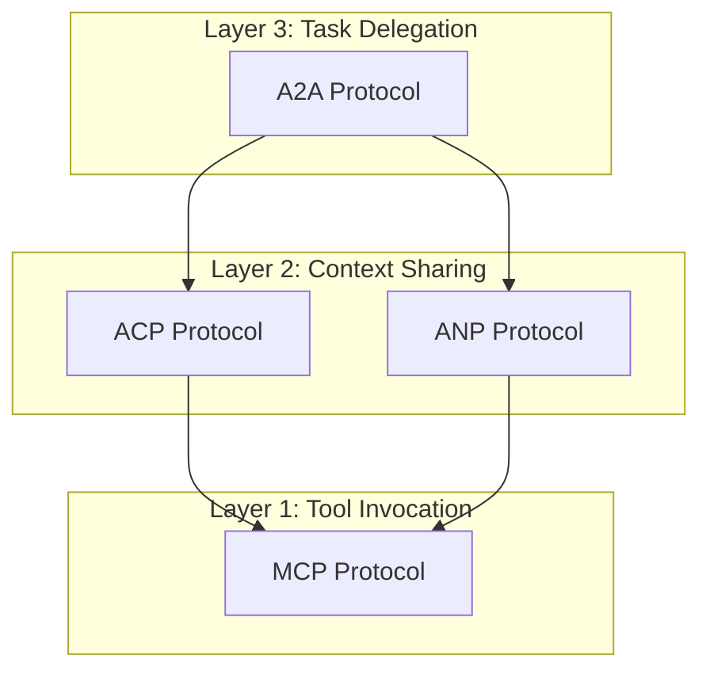

本記事は [A Survey on Agent Communication Protocols (arXiv:2505.02279)](https://arxiv.org/abs/2505.02279) の解説記事です。

## 論文概要（Abstract）

本論文は、LLMエージェント間通信のための4大プロトコル — Google A2A（Agent-to-Agent）、Anthropic MCP（Model Context Protocol）、IBM ACP（Agent Communication Protocol）、ANP（Agent Network Protocol） — を統一的に比較分類した初の包括的サーベイである。著者らは各プロトコルを「タスク委譲層」「コンテキスト共有層」「ツール呼び出し層」の3層に分けて分析し、設計目標・メッセージ形式・セキュリティ・相互運用性の軸で体系的な比較を提示している。

この記事は [Zenn記事: マルチエージェント通信の本番運用設計](https://zenn.dev/0h_n0/articles/d33c4bc04dc533) の深掘りです。

## 情報源

- **arXiv ID**: 2505.02279
- **URL**: https://arxiv.org/abs/2505.02279
- **発表年**: 2025
- **分野**: cs.AI, cs.MA

## 背景と動機（Background & Motivation）

2024年後半から2025年にかけて、LLMエージェントの実用化が急速に進む中、エージェント間通信の標準化が深刻な課題となっている。Google、Anthropic、IBM、オープンソースコミュニティがそれぞれ独自のプロトコルを発表したが、これらは設計哲学・対象レイヤー・メッセージフォーマットが異なり、相互運用性が確保されていない。

従来のマルチエージェント研究では、FIPA ACL（Foundation for Intelligent Physical Agents Agent Communication Language）やKQML（Knowledge Query and Manipulation Language）が標準として存在したが、これらはLLM以前の設計であり、自然言語ベースのメッセージ処理・非同期ストリーミング・ツール呼び出しといったLLM固有の要件に対応していない。本サーベイは、この「プロトコル乱立期」を整理し、実装者が適切なプロトコルを選定するための判断基準を提供することを目的としている。

## 主要な貢献（Key Contributions）

- **貢献1**: A2A・MCP・ACP・ANPの4プロトコルを統一的な分類軸（通信パターン、メッセージ形式、セキュリティモデル、発見メカニズム）で比較分類した初のサーベイ
- **貢献2**: エージェント通信を「タスク委譲層」「コンテキスト共有層」「ツール呼び出し層」の3層アーキテクチャとして整理し、各プロトコルがカバーする層を明確化
- **貢献3**: ユースケース別の推奨プロトコル選定マトリクスの提示と、相互運用性の未解決課題の特定

## 技術的詳細（Technical Details）

### 3層通信アーキテクチャ

著者らは、エージェント間通信を以下の3層に分離して分析している：

$$
\text{Agent Communication} = \underbrace{\text{Task Delegation}}_{\text{Layer 3}} + \underbrace{\text{Context Sharing}}_{\text{Layer 2}} + \underbrace{\text{Tool Invocation}}_{\text{Layer 1}}
$$

ここで、
- Layer 1（ツール呼び出し層）: エージェントが外部ツール・APIを呼び出す機構。MCPが主にカバー。
- Layer 2（コンテキスト共有層）: エージェント間で状態・コンテキストを共有する機構。ACP・ANPがカバー。
- Layer 3（タスク委譲層）: エージェントが他のエージェントにタスクを委譲する機構。A2Aが主にカバー。



### 4大プロトコルの比較

| 比較軸 | A2A (Google) | MCP (Anthropic) | ACP (IBM) | ANP |
|--------|-------------|-----------------|-----------|-----|
| **通信パターン** | REST + JSON-RPC | JSON-RPC (stdio/SSE) | REST (HTTP) | P2P分散 |
| **メッセージ形式** | Task/Artifact | Tool/Resource/Prompt | Multimodal Message | DID認証付きメッセージ |
| **対象層** | タスク委譲 | ツール呼び出し | エージェント間通信 | 分散P2P通信 |
| **発見メカニズム** | Agent Card (JSON) | capabilities宣言 | Agent Card | DID Document |
| **認証方式** | OAuth 2.0 | なし（トランスポート依存） | HTTP標準 | DID/Verifiable Credentials |
| **非同期対応** | SSE streaming | SSE streaming | 完全非同期 | 完全非同期 |
| **マルチモーダル** | テキスト+ファイル | テキスト+画像 | テキスト+画像+埋め込み | テキスト+任意 |

### A2A（Agent-to-Agent Protocol）

Google が2025年4月に公開したプロトコル。エージェント間のタスク委譲に特化している。

**Agent Card**: 各エージェントは `/.well-known/agent.json` にAgent Cardを公開し、自身の能力・エンドポイント・認証要件を宣言する。クライアントエージェントはこのカードを読み取って適切な委譲先を発見する。

**Task ライフサイクル**: A2Aのコア概念は「Task」であり、以下の状態遷移を持つ：

$$
\text{submitted} \rightarrow \text{working} \rightarrow \text{input-required} | \text{completed} | \text{failed} | \text{canceled}
$$

**Artifact**: タスクの成果物。テキスト・ファイル・構造化データを含む。ストリーミング配信にも対応。

### MCP（Model Context Protocol）

Anthropicが2024年11月に公開したプロトコル。エージェントと外部ツール・データソースの接続に特化している。

**3つのプリミティブ**:
1. **Tools**: エージェントが呼び出し可能な関数（副作用あり）
2. **Resources**: 読み取り専用のデータソース（ファイル、DB等）
3. **Prompts**: 再利用可能なプロンプトテンプレート

MCPはクライアント-サーバーモデルを採用し、LLMアプリケーション（ホスト）がMCPクライアントを介してMCPサーバー（ツール提供者）と通信する。著者らは、MCPは「エージェント間通信」ではなく「エージェント-ツール間通信」のプロトコルであると分類している。

### ACP（Agent Communication Protocol）

IBM Researchが2025年3月に公開したプロトコル。エージェント間の直接通信に特化している。

**RESTful設計**: HTTP上に構築され、標準的なWebツール（curl, Postman等）で即座にテスト可能。JSON-RPCを使うMCPと対照的に、RESTのシンプルさを選択している。

**非同期通信**: ACP は同期・非同期の両方を同じインターフェースでサポートする。長時間実行タスクに対しては、クライアントがポーリングまたはServer-Sent Eventsで進捗を取得する。

**マルチモーダルメッセージ**: テキスト・画像・埋め込みベクトルを1つのメッセージに含められる。

### ANP（Agent Network Protocol）

分散P2P型のプロトコル。DID（Decentralized Identifiers）に基づく認証と、Verifiable Credentialsによるエージェントの信頼性検証が特徴。中央サーバーを必要とせず、エージェントが相互に直接通信する。

## 実装のポイント（Implementation）

### プロトコル選定の判断基準

著者らが提示する選定マトリクスに基づくと：

```python
def select_protocol(use_case: dict) -> str:
    """ユースケースに基づくプロトコル選定"""
    if use_case["primary_need"] == "tool_integration":
        return "MCP"
    elif use_case["primary_need"] == "task_delegation":
        if use_case["requires_discovery"]:
            return "A2A"
        else:
            return "ACP"
    elif use_case["primary_need"] == "peer_to_peer":
        if use_case["requires_decentralized_auth"]:
            return "ANP"
        else:
            return "ACP"
    elif use_case["primary_need"] == "multimodal_communication":
        return "ACP"
    else:
        return "A2A"  # デフォルト: 最も汎用的
```

### 相互運用のアーキテクチャパターン

実際のプロダクション環境では、複数のプロトコルを組み合わせるのが一般的である：

```python
class MultiProtocolAgent:
    """複数プロトコルを統合するエージェント実装パターン"""

    def __init__(self):
        self.mcp_client = MCPClient()      # ツール呼び出し用
        self.a2a_client = A2AClient()      # タスク委譲用
        self.acp_server = ACPServer()      # 他エージェントからの受信用

    async def handle_task(self, task: Task) -> Artifact:
        # 1. MCPでツールを呼び出して情報収集
        context = await self.mcp_client.call_tool(
            "search", {"query": task.description}
        )

        # 2. 必要に応じてA2Aで専門エージェントに委譲
        if self._requires_specialist(task):
            specialist = await self.a2a_client.discover_agent(
                capability="code_review"
            )
            result = await self.a2a_client.delegate_task(
                agent=specialist, task=task, context=context
            )
            return result

        # 3. 自身で処理
        return await self._process_locally(task, context)
```

### ACP + A2A 統合の動向

著者らは、2025年8月にIBMのACPがGoogle A2Aと Linux Foundation傘下で統合されたことにも言及している。この統合により、タスク委譲（A2A）とエージェント間メッセージング（ACP）が1つのプロトコルスタックとして利用可能になる見込みである。

## 実験結果（Results）

本論文はサーベイであり、定量的なベンチマーク実験は含まれていない。ただし、著者らは各プロトコルの公式実装のパフォーマンス特性について以下の定性的比較を報告している：

| 特性 | A2A | MCP | ACP |
|------|-----|-----|-----|
| レイテンシ | 中（HTTP + JSON-RPC） | 低（stdio）/ 中（SSE） | 低-中（REST） |
| スループット | 中 | 高（ローカル接続時） | 高 |
| スケーラビリティ | 高（REST標準） | 中（接続数制限） | 高（REST標準） |
| 実装複雑度 | 中-高 | 低-中 | 低 |

## 実運用への応用（Practical Applications）

Zenn記事で解説されている3つのフレームワーク（OpenAI Agents SDK、LangGraph、AG2）との対応関係：

- **OpenAI Agents SDK（Handoffモデル）**: A2Aの「タスク委譲」と概念的に類似。Handoffは1対1の同期的委譲、A2Aは非同期・発見可能な委譲。
- **LangGraph（共有状態モデル）**: MCPの「Resource」概念と親和性が高い。共有状態をResourceとして公開し、外部エージェントからアクセス可能にできる。
- **AG2（イベント駆動モデル）**: ACPの非同期メッセージングと設計思想が一致。AG2のA2Aサポートにより、ACPとの統合も自然に実現可能。

プロトコル選定において重要なのは、「どの層の通信を標準化したいか」を明確にすることである。ツール連携の標準化にはMCP、エージェント間タスク委譲にはA2A/ACP統合プロトコル、分散環境での認証にはANPが適している。

## 関連研究（Related Work）

- **FIPA ACL (Foundation for Intelligent Physical Agents)**: 2000年代のマルチエージェント通信標準。Performative（inform, request, propose等）に基づく形式的メッセージ体系。LLM時代には自然言語ベースの通信が主流となり、形式的Performativeの必要性が低下。
- **KQML (Knowledge Query and Manipulation Language)**: FIPA ACLの前身。知識ベース間の通信に特化。現代のLLMエージェントには過度に形式的。
- **OpenAI Function Calling / Tool Use**: MCPの前身的存在。LLM単体のツール呼び出し機構だが、エージェント間通信やツール発見の標準化は含まない。

## まとめと今後の展望

本サーベイは、LLMエージェント通信プロトコルの「乱立期」を整理した重要な文献である。著者らは以下の未解決課題を指摘している：

1. **プロトコル間の相互運用性**: A2A↔MCP↔ACPを透過的に接続するゲートウェイの標準化
2. **セキュリティモデルの統一**: OAuth 2.0、DID、HTTP認証の混在に対する共通認証フレームワーク
3. **パフォーマンス標準ベンチマーク**: プロトコル間の定量比較を可能にするベンチマークスイートの整備

ACP + A2Aの統合（2025年8月発表）は、この標準化に向けた重要な一歩であるが、MCPとの統合は依然として未解決である。

## 参考文献

- **arXiv**: https://arxiv.org/abs/2505.02279
- **A2A Protocol**: https://github.com/google/a2a-protocol
- **MCP Specification**: https://modelcontextprotocol.io/
- **ACP (IBM)**: https://research.ibm.com/projects/agent-communication-protocol
- **Related Zenn article**: https://zenn.dev/0h_n0/articles/d33c4bc04dc533
