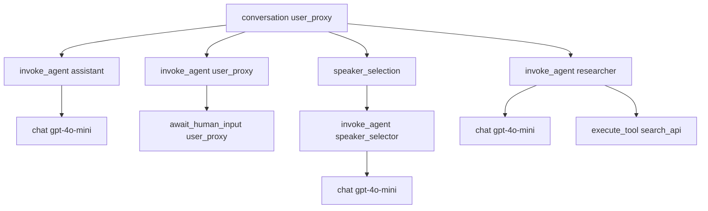

本記事は [AG2 OpenTelemetry Tracing: Full Observability for Multi-Agent Systems (AG2 Blog, 2026-02-08)](https://docs.ag2.ai/latest/docs/blog/2026/02/08/AG2-OpenTelemetry-Tracing/) の解説記事です。

## ブログ概要（Summary）

AG2（AutoGen v0.4+）の公式ブログ記事で、フレームワークに組み込まれたOpenTelemetryトレーシング機能の設計と使用法を解説している。会話・エージェントターン・LLM呼び出し・ツール実行・コード実行・話者選択のすべてが構造化スパンとして捕捉され、OpenTelemetry GenAI Semantic Conventionsに準拠した属性で修飾される。4種のinstrument関数（`instrument_agent`、`instrument_llm_wrapper`、`instrument_pattern`、`instrument_a2a_server`）による宣言的計装と、A2Aプロトコル経由のW3C Trace Context伝播による分散トレーシングが解説されている。

この記事は [Zenn記事: マルチエージェント通信の本番運���設計](https://zenn.dev/0h_n0/articles/d33c4bc04dc533) の深掘りです。

## 情報源

- **種別**: 企業テックブログ（OSSフレームワーク公式）
- **URL**: https://docs.ag2.ai/latest/docs/blog/2026/02/08/AG2-OpenTelemetry-Tracing/
- **組織**: AG2 (formerly Microsoft AutoGen)
- **発表日**: 2026-02-08

## 技術的背景（Technical Background）

マルチエージェントシステムでは、1つのリクエストが複数のエージェント間を巡回し、それぞれがLLM推論やツール呼び出しを行う。従来のログベース監視では「何が起きたか」は追えるが、「なぜ遅いのか」「どのエージェントのどのLLM呼び出しが失敗したか」の因果関係特定が困難であった。

AG2はAutoGen v0.4以降のリブランドであり、イベント駆動のアクターモデルに基づくマルチエージェントフレームワークである。各エージェントは独立したアクターとして動作し、非同期メッセージングで通信する。この非同期・並行実行の特性により、リクエストフローの追跡は従来の同期的システム以上に困難である。

OpenTelemetryの採用により、AG2は以下を実現している：
1. すべてのエージェント操作を構造化スパンとして自動捕捉
2. GenAI Semantic Conventionsに準拠した標準属性の付与
3. A2Aプロトコル経由のW3C Trace Context伝播（分散環境対応）
4. 任意のOTel互換バックエンド（Jaeger、Grafana Tempo、Datadog等）への送信

## 実装アーキテクチャ（Architecture）

### スパン階層構造

AG2のトレースは、エージェントの処理フローを反映した階層ツリーを形成する。各スパンには`ag2.span.type`属性が付与され、機能的な役割を識別する。



### ag2.span.type の分類体系

| ag2.span.type | スパン名パターン | トリガーイベント | Span Kind |
|---|---|---|---|
| `conversation` | `conversation {agent}` | `run`, `run_chat`, `initiate_chat` | INTERNAL |
| `agent` | `invoke_agent {agent}` | `generate_reply`, `a_generate_reply` | INTERNAL |
| `llm` | `chat {model}` | `OpenAIWrapper.create()` | CLIENT |
| `tool` | `execute_tool {func}` | `execute_function`, `a_execute_function` | INTERNAL |
| `code_execution` | `execute_code {agent}` | Code-execution reply handler | INTERNAL |
| `human_input` | `await_human_input {agent}` | `get_human_input`, `a_get_human_input` | INTERNAL |
| `speaker_selection` | `speaker_selection` | GroupChat話者選択 | INTERNAL |

### スパン属性（GenAI Semantic Conventions準拠）

`llm`タイプのスパンには以下の標準属性が付与される：

| 属性名 | 型 | 説明 |
|--------|-----|------|
| `gen_ai.request.model` | string | モデル名（e.g., "gpt-4o-mini"） |
| `gen_ai.provider.name` | string | プロバイダー（e.g., "openai"） |
| `gen_ai.usage.input_tokens` | int | 入力トークン数 |
| `gen_ai.usage.output_tokens` | int | 出力トークン数 |
| `gen_ai.request.temperature` | float | Temperature設定 |
| `gen_ai.response.finish_reasons` | string[] | 終了理由 |

`tool`タイプのスパンには：

| 属性名 | 型 | 説明 |
|--------|-----|------|
| `gen_ai.tool.name` | string | ツール名 |
| `gen_ai.tool.args` | string | ツール引数（JSON） |
| `gen_ai.tool.result` | string | ツール結果 |

## 4種のinstrument関数の詳細

### 1. instrument_agent()

個々の`ConversableAgent`インスタンスをパッチし、会話・エージェントターン・ツール実行・コード実行・ヒューマン入力のスパンを自動生成する。

```python
from autogen.opentelemetry import instrument_agent

# エージェント単位でインストルメント
instrument_agent(planner_agent, tracer_provider=tracer_provider)
instrument_agent(executor_agent, tracer_provider=tracer_provider)
instrument_agent(validator_agent, tracer_provider=tracer_provider)
```

カバーするスパンタイプ: `conversation`, `agent`, `tool`, `code_execution`, `human_input`

### 2. instrument_llm_wrapper()

すべてのLLM呼び出しをグローバルにインストルメントする。`OpenAIWrapper.create()`をラップし、モデル名・トークン使用量・コスト・リクエストパラメータを含む`chat {model}`スパンを生成する。

```python
from autogen.opentelemetry import instrument_llm_wrapper

# グローバルLLM計装（全エージェントに適用）
instrument_llm_wrapper(tracer_provider=tracer_provider)

# デバッグ時はメッセージ内容も記録（本番では無効推奨）
instrument_llm_wrapper(
    tracer_provider=tracer_provider,
    capture_messages=True  # PII含有リスクあり、本番非���奨
)
```

**データ保護の設計**: デフォルトではプロンプト/レスポンスの内容は記録されない。`capture_messages=True`のオプトインが必要。これはOpenTelemetry GenAI Semantic Conventionsの「Opt-in by design」原則に準拠している。

### 3. instrument_pattern()

GroupChat PatternオブジェクトをインストルメントL、パターン内の全エージェント・GroupChatManager・話者選択ロジックを一括で計装する。

```python
from autogen.opentelemetry import instrument_pattern

# GroupChatパターン全体を一括計装
team = SelectorGroupChat(
    [planner, executor, validator],
    model_client=model_client,
    termination_condition=termination,
)
instrument_pattern(team, tracer_provider=tracer_provider)
```

カバー: パターン内全エージェントの自動`instrument_agent()`適用 + `speaker_selection`スパン

### 4. instrument_a2a_server()

A2A（Agent-to-Agent）プロトコルでエージェントをリモートサービスとして公開する場合のインストルメンテーション。W3C Trace Contextミドルウェアを注入し、分散環境でのトレースID共有を実現する。

```python
from autogen.opentelemetry import instrument_a2a_server, instrument_agent
from autogen.a2a import A2aAgentServer, A2aRemoteAgent

# サーバー側（エージェントをHTTPサービスとして公開）
server = A2aAgentServer(tech_agent, url="http://localhost:18123/")
instrument_llm_wrapper(tracer_provider=tracer_provider)
instrument_a2a_server(server, tracer_provider=tracer_provider)
app = server.build()

# クライアント側（リモートエージェントを呼び出す）
remote_tech = A2aRemoteAgent("http://localhost:18123/", name="tech_agent")
instrument_agent(user_proxy, tracer_provider=tracer_provider)
instrument_agent(remote_tech, tracer_provider=tracer_provider)
```

**W3C Trace Context伝播**: AG2はA2A HTTP呼び出し時に`traceparent`ヘッダーを自動注入・抽出する。クライアント側とサーバー側のスパンが同一のtrace IDを共有し、プロセス境界を越えた因果関係の追跡が可能。

## GroupChatにおけるトレース構造の実例

SelectorGroupChatで3エージェント（researcher, writer, critic）が協調する場合のトレース：

```
conversation chat_manager                    [3.2s]
├── speaker_selection                        [0.8s]
│   └── invoke_agent speaker_selector        [0.8s]
│       └── chat gpt-4o-mini                 [0.7s]
├── invoke_agent researcher                  [1.2s]
│   ├── chat gpt-4o-mini                     [0.9s]
│   └── execute_tool web_search              [0.3s]
├── speaker_selection                        [0.6s]
│   └── invoke_agent speaker_selector        [0.6s]
│       └── chat gpt-4o-mini                 [0.5s]
└── invoke_agent writer                      [0.6s]
    └── chat gpt-4o-mini                     [0.6s]
```

このトレース構造から以下が即座に判断できる：
- 全体の3.2秒のうち、researcher（1.2s）が最大のボトルネック
- 話者選択（0.8s + 0.6s = 1.4s）がオーバーヘッドの約44%を占める
- web_searchツール（0.3s）はLLM推論（0.9s）より高速

## OTelバックエンドとの統合

### Jaeger（開発環境）

```python
from opentelemetry.exporter.otlp.proto.grpc.trace_exporter import OTLPSpanExporter
from opentelemetry.sdk.trace import TracerProvider
from opentelemetry.sdk.trace.export import BatchSpanProcessor
from opentelemetry.sdk.resources import Resource

resource = Resource.create({"service.name": "ag2-multi-agent"})
tracer_provider = TracerProvider(resource=resource)

exporter = OTLPSpanExporter(endpoint="http://localhost:4317")
tracer_provider.add_span_processor(BatchSpanProcessor(exporter))
```

### Langfuse（LLM特化オブザーバビリティ）

```python
import base64
from opentelemetry.exporter.otlp.proto.http.trace_exporter import OTLPSpanExporter

auth = base64.b64encode(f"{PUBLIC_KEY}:{SECRET_KEY}".encode()).decode()
exporter = OTLPSpanExporter(
    endpoint=f"{LANGFUSE_HOST}/api/public/otel/v1/traces",
    headers={"Authorization": f"Basic {auth}"}
)
```

### Datadog / Honeycomb / Grafana Cloud

```python
# Datadog
exporter = OTLPSpanExporter(
    endpoint="https://otel.datadoghq.com:4317",
    headers={"DD-API-KEY": "YOUR_DATADOG_API_KEY"}
)

# Honeycomb
exporter = OTLPSpanExporter(
    endpoint="https://api.honeycomb.io:443",
    headers={"x-honeycomb-team": "YOUR_API_KEY"}
)
```

## パフォーマンス最適化（Performance）

### トークン消費量のモニタリング

AG2のOpenTelemetryトレースから、エージェントあたりのトークン消費を集計できる：

$$
\text{Total Cost} = \sum_{i=1}^{N} \left( T_{\text{input},i} \times P_{\text{input}} + T_{\text{output},i} \times P_{\text{output}} \right)
$$

ここで $T_{\text{input},i}$は$i$番目のLLM呼び出しの入力トークン数、$P_{\text{input}}$は入力トークン単価。

### GroupChatの話者選択最適化

話者選択のオーバーヘッドが全体の30-50%を占める場合がある。トレースデータから選択パターンを分析し、以下の最適化を検討：

1. `RoundRobinGroupChat`（固定順序）への切り替え: 話者選択LLM呼び出しを完全に削除
2. `allowed_transitions`の制約追加: 選択空間を縮小してLLM推論を高速化
3. 話者選択モデルのダウングレード: GPT-4o → GPT-4o-miniで十分な場合が多い

## 運用での学び（Production Lessons）

### capture_messagesの使い分け

- **開発環境**: `capture_messages=True` でプロンプト内容を記録し、デバッグに活用
- **ステージング**: `capture_messages=True` だがPIIスクラビングをOTel Collectorのprocessorで適用
- **本番環境**: `capture_messages=False`（デフォルト）でPIIリスクを回避

### バッチ処理の設定

```python
from opentelemetry.sdk.trace.export import BatchSpanProcessor

processor = BatchSpanProcessor(
    exporter,
    max_queue_size=2048,         # キュー上限（デフォルト2048）
    max_export_batch_size=512,   # バッチサイズ（デフォルト512）
    export_timeout_millis=30000, # エクスポートタイムアウト
    schedule_delay_millis=5000,  # スケジュール間隔
)
```

エージェント数が10を超える場合、`max_queue_size`の引き上げを検討する。

## 学術研究との関連（Academic Connection）

AG2のOpenTelemetry実装は、OpenTelemetry GenAI SIGが策定中の「Semantic Conventions for GenAI agent and framework spans」に基づいている。2026年3月時点で「Development」ステータスだが、AG2・Datadog・Grafanaが既に実装を提供しており、事実上のデファクト標準として機能している。

仕様で定義されているスパンタイプ：
- `create_agent`: エージェント作成（AG2では未使用）
- `invoke_agent`: エージェント呼び出し（AG2の`agent`スパンに対応）
- `invoke_workflow`: ワークフロー実行（AG2の`conversation`スパンに対応）
- `execute_tool`: ツール実行（AG2の`tool`スパンに対応）

## まとめと実践への示唆

AG2のOpenTelemetry統合は「宣言的計装」のアプローチを採用し、4つの関数呼び出しだけでフルスタックの可観測性を実現している。従来の手動スパン作成やカスタムログ出力と比較して、以下の優位性がある：

1. **コード侵入度が低い**: ビジネスロジックの変更なしに計装を追加・削除可能
2. **標準準拠**: GenAI Semantic Conventionsにより、バックエンド間のポータビリティを確保
3. **分散対応**: A2Aプロトコル経由のTrace Context伝播で、プロセス境界を越えたトレーシングが可能
4. **プライバシー設計**: メッセージ内容はオプトイン方式で、デフォルトではPIIが記録されない

## 参考文献

- **Blog URL**: https://docs.ag2.ai/latest/docs/blog/2026/02/08/AG2-OpenTelemetry-Tracing/
- **AG2 Observability Docs**: https://docs.ag2.ai/latest/docs/blog/category/observability/
- **OpenTelemetry GenAI Semantic Conventions**: https://opentelemetry.io/docs/specs/semconv/gen-ai/gen-ai-agent-spans/
- **AutoGen Tracing Guide**: https://microsoft.github.io/autogen/stable//user-guide/agentchat-user-guide/tracing.html
- **Related Zenn article**: https://zenn.dev/0h_n0/articles/d33c4bc04dc533
