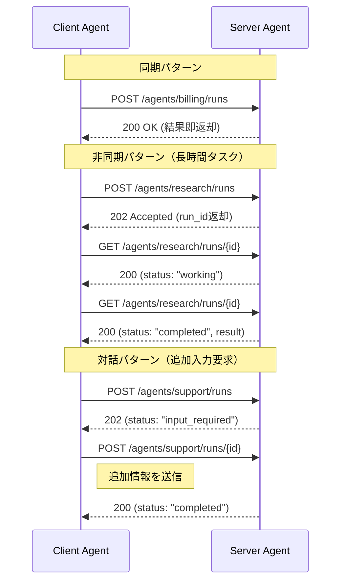

本記事は [An open-source protocol for AI agents to interact (IBM Research Blog)](https://research.ibm.com/blog/agent-communication-protocol-ai) の解説記事です。

## ブログ概要（Summary）

IBM Researchが2025年3月に公開したAgent Communication Protocol (ACP) の設計思想と実装を解説するブログ記事である。ACPは「エージェント通信のHTTP」を目指し、RESTfulアーキテクチャ上に構築された標準プロトコルである。フレームワーク・言語・ランタイムに依存しない相互運用性、同期・非同期両対応のメッセージング、マルチモーダルメッセージ（テキスト・画像・埋め込みベクトル）のサポートが特徴。BeeAIプラットフォームの通信基盤として採用され、2025年8月にはGoogle A2Aとの統合がLinux Foundation傘下で発表されている。

この記事は [Zenn記事: マルチエージェント通信の本番運用設計](https://zenn.dev/0h_n0/articles/d33c4bc04dc533) の深掘りです。

## 情報源

- **種別**: 企業テックブログ（研究部門）
- **URL**: https://research.ibm.com/blog/agent-communication-protocol-ai
- **組織**: IBM Research
- **発表日**: 2025年3月
- **プロジェクトページ**: https://research.ibm.com/projects/agent-communication-protocol

## 技術的背景（Technical Background）

2024-2025年にかけてLLMエージェントフレームワークが乱立した結果、異なるフレームワーク（LangChain、AutoGen、CrewAI等）で構築されたエージェント間の通信は、高コストなカスタムインテグレーションを必要としていた。IBM Researchはこの「エージェント間の相互運用性の欠如」を解決するため、Webの歴史に倣った標準プロトコルの策定に着手した。

HTTPがWebドキュメントのアクセスを標準化したように、ACPはエージェント間通信を標準化することを目指している。著者らはこれを「the HTTP of agent communication」と表現している。

### 既存プロトコルとの位置づけ

| プロトコル | 提供元 | 対象層 | 通信方式 |
|-----------|--------|--------|---------|
| MCP | Anthropic | エージェント-ツール間 | JSON-RPC |
| A2A | Google | エージェント-エージェント間（タスク委譲） | REST + JSON-RPC |
| **ACP** | IBM | **エージェント-エージェント間（メッセージング）** | **REST (HTTP)** |
| ANP | OSS | P2P分散エージェント間 | DID認証 |

ACPとMCPは相補的な関係にある。MCPは「エージェントが外部ツール・データにアクセスする」プロトコルであり、ACPは「エージェント同士が対話する」プロトコルである。

## 実装アーキテクチャ（Architecture）

### RESTful設計の哲学

ACPはJSON-RPCではなくREST（Representational State Transfer）を選択している。この設計判断の根拠：

1. **ツール不要のテスト**: curl、Postman、ブラウザで即座にテスト可能
2. **既存Webインフラの活用**: ロードバランサー、CDN、API Gatewayがそのまま使える
3. **HTTP標準の恩恵**: キャッシュ・認証・圧縮の標準メカニズムを自然に活用
4. **学習コスト最小化**: 新しいプロトコル規約を覚える必要がない

### エンドポイント設計

ACPのコアエンドポイント：

```
POST /agents/{agent_id}/runs       # エージェントにタスク開始を依頼
GET  /agents/{agent_id}/runs/{id}  # タスクの進捗・結果を取得
POST /agents/{agent_id}/runs/{id}  # 追加入力を送信（非同期対話）
GET  /agents                       # 利用可能エージェント一覧
GET  /agents/{agent_id}            # エージェント詳細（capabilities）
```

### メッセージフォーマット

ACPのメッセージはマルチモーダル対応で、以下のコンテンツタイプを含められる：

```python
from dataclasses import dataclass
from typing import Literal

@dataclass
class ACPMessage:
    """ACPプロトコルのメッセージ構造"""
    role: Literal["user", "assistant", "system"]
    parts: list["MessagePart"]

@dataclass
class TextPart:
    """テキストメッセージ"""
    type: Literal["text"] = "text"
    content: str = ""

@dataclass
class ImagePart:
    """画像メッセージ（Base64またはURL）"""
    type: Literal["image"] = "image"
    content: str = ""  # Base64エンコード
    media_type: str = "image/png"

@dataclass
class EmbeddingPart:
    """埋め込みベクトル"""
    type: Literal["embedding"] = "embedding"
    content: list[float] = None  # ベクトル値
    model: str = ""  # 使用した埋め込みモデル
```

### 通信パターン



### 2つのアーキテクチャパターン

**1. 階層型（Hierarchical）**

マネージャーエージェントが中央で他のエージェントを調整する：

```python
class ManagerAgent:
    """階層型: マネージャーが専門エージェントを調整"""

    def __init__(self, sub_agents: dict[str, str]):
        self.sub_agents = sub_agents  # name -> ACP endpoint

    async def handle_request(self, request: ACPMessage) -> ACPMessage:
        # タスク分類
        category = await self.classify(request)

        # 適切な専門エージェントに委譲
        endpoint = self.sub_agents[category]
        async with httpx.AsyncClient() as client:
            response = await client.post(
                f"{endpoint}/agents/{category}/runs",
                json={"messages": [request.to_dict()]}
            )
            return ACPMessage.from_dict(response.json())
```

**2. ピアツーピア型（Peer-to-Peer）**

エージェントが中央調整者なしに直接通信する：

```python
class PeerAgent:
    """P2P型: エージェントが直接通信"""

    def __init__(self, name: str, peers: dict[str, str]):
        self.name = name
        self.peers = peers  # name -> ACP endpoint

    async def collaborate(self, task: str) -> str:
        # 複数のピアに並行して問い合わせ
        results = await asyncio.gather(*[
            self._ask_peer(peer_name, task)
            for peer_name in self.peers
        ])
        # 結果を統合
        return self._synthesize(results)

    async def _ask_peer(self, peer: str, query: str) -> str:
        endpoint = self.peers[peer]
        async with httpx.AsyncClient() as client:
            resp = await client.post(
                f"{endpoint}/agents/{peer}/runs",
                json={"messages": [{"role": "user", "parts": [{"type": "text", "content": query}]}]}
            )
            return resp.json()["messages"][-1]["parts"][0]["content"]
```

## BeeAIプラットフォーム

### 概要

BeeAIは、IBM Researchが開発しLinux Foundationに寄贈したオープンソースのエージェントプラットフォームである。ACPを通信基盤として採用し、以下の機能を提供する：

- **エージェント発見（Discovery）**: 利用可能なエージェントのレジストリ
- **エージェント実行（Execution）**: ACP準拠エージェントのホスティング
- **エージェント構成（Composition）**: 複数エージェントのワークフロー構築

### BeeAI Framework

BeeAI Frameworkは、ACP準拠エージェントを構築するためのSDKで、PythonとTypeScriptの両方で提供されている：

```python
# BeeAI Framework (Python) でのACP準拠エージェント構築
from beeai import Agent, tool

@tool
def search_knowledge_base(query: str) -> str:
    """社内ナレッジベースを検索"""
    # 実装
    return results

agent = Agent(
    name="knowledge_assistant",
    description="社内情報に関する質問に回答するエージェント",
    tools=[search_knowledge_base],
)

# ACPサーバーとして起動
agent.serve(host="0.0.0.0", port=8080)
# → GET /agents, POST /agents/knowledge_assistant/runs が自動公開
```

## ACP + A2A 統合

### 2025年8月の統合発表

IBM Research（ACP）とGoogle（A2A）は、Linux Foundation AI & Data傘下で両プロトコルを統合することを発表した。この統合の背景：

- **A2Aの強み**: タスクのライフサイクル管理（submitted → working → completed）、Agent Card による発見
- **ACPの強み**: マルチモーダルメッセージ、RESTful設計のシンプルさ、非同期通信の柔軟性

統合後のプロトコルは、A2AのAgent Card + タスク管理とACPのメッセージ形式 + 非同期パターンを組み合わせた形態になると報告されている。

### 統合が意味する実装への影響

```python
# 統合後のイメージ（2025年8月時点は設計段階）
class UnifiedAgentClient:
    """ACP + A2A 統合クライアント"""

    async def discover(self, capability: str) -> list[AgentCard]:
        """A2A Agent Card による発見"""
        # /.well-known/agent.json を取得
        pass

    async def send_message(self, agent: AgentCard, message: ACPMessage) -> ACPMessage:
        """ACP メッセージ形式での通信"""
        # RESTful POST /agents/{id}/runs
        pass

    async def check_task_status(self, task_id: str) -> TaskStatus:
        """A2A タスクライフサイクル管理"""
        # GET /tasks/{task_id}
        pass
```

## パフォーマンス最適化（Performance）

### REST vs JSON-RPC のレイテンシ比較

ACPがRESTを選択した設計上のトレードオフ：

| 項目 | REST (ACP) | JSON-RPC (MCP) |
|------|-----------|----------------|
| 接続確立 | リクエストごと（HTTP/2で再利用可） | 永続接続（stdio/WebSocket） |
| オーバーヘッド | HTTPヘッダー（~500B） | 最小限（~50B） |
| ローカル通信 | 中（ネットワークスタック経由） | 低（stdioはゼロコピー） |
| リモート通信 | 低（HTTPインフラ最適化済み） | 中（WebSocket維持コスト） |
| スケーラビリティ | 高（ステートレス） | 中（接続状態管理） |

ローカル環境でのエージェント間通信（同一マシン内）ではMCPのstdio接続が低レイテンシだが、分散環境（異なるサービス間）ではACPのRESTful設計がHTTPインフラの恩恵を受けて有利になる。

## 運用での学び（Production Lessons）

### フレームワーク非依存性の実践

ACP最大の利点は、既存エージェントをラップして即座に相互運用可能にする点である：

```python
# LangChainエージェントをACP準拠にラップ
from langchain.agents import AgentExecutor
from beeai.adapters import langchain_to_acp

langchain_agent = AgentExecutor(...)
acp_agent = langchain_to_acp(langchain_agent, name="langchain_qa")
acp_agent.serve(port=8081)

# CrewAIエージェントをACP準拠にラップ
from crewai import Agent as CrewAgent
from beeai.adapters import crewai_to_acp

crew_agent = CrewAgent(...)
acp_agent = crewai_to_acp(crew_agent, name="crewai_researcher")
acp_agent.serve(port=8082)
```

これにより、LangChain製エージェントとCrewAI製エージェントが、ACPを介して標準的なHTTP通信で相互連携できる。

### エラーハンドリング

ACPはHTTPステータスコードに基づくエラー表現を採用：

| ステータス | 意味 | エージェント側の対応 |
|-----------|------|-------------------|
| 200 | 成功（同期応答） | 結果を処理 |
| 202 | 受理（非同期開始） | ポーリングまたはSSE待機 |
| 400 | リクエスト不正 | メッセージ形式を修正（リトライ不要） |
| 404 | エージェント不在 | 発見フェーズからやり直し |
| 429 | レート制限 | Retry-Afterに従い待機 |
| 500 | サーバーエラー | 指数バックオフでリトライ |
| 503 | サービス利用不可 | Circuit Breaker発動 |

Zenn記事で解説されているCircuit BreakerパターンとACPの組み合わせ：429/500/503をfailureとしてカウントし、閾値超過で回路をオープンにする。

## 学術研究との関連（Academic Connection）

ACPの設計は以下の学術的背景を持つ：

- **FIPA ACL (2002)**: エージェント通信言語の形式仕様。ACPはFIPAのPerformative概念を自然言語ベースに置き換えている
- **REST Architectural Style (Fielding, 2000)**: ACPはFieldingのREST原則（Stateless, Uniform Interface, Layered System）に準拠
- **Actor Model (Hewitt, 1973)**: AG2のアクターモデルとACPの非同期メッセージングは、同一の理論的基盤を共有

arXiv 2505.02279のサーベイでは、ACPは「Layer 2: Context Sharing」を主にカバーするプロトコルとして分類されている。

## まとめと実践への示唆

IBM ACPは「REST + マルチモーダル + 非同期」の組み合わせにより、既存のWeb技術スタックの延長線上でエージェント間通信を標準化する実用的なアプローチである。

Zenn記事で解説されている3つのフレームワークとの対応：
- **OpenAI Agents SDK**: Handoffの宛先をACP準拠サービスとして外部化可能
- **LangGraph**: ノード間通信をACP経由にすることで分散実行に対応
- **AG2**: A2A + ACP統合プロトコルをネイティブサポート予定

A2Aとの統合（2025年8月）により、タスクライフサイクル管理 + メッセージ通信が統一され、実装者は1つのプロトコルスタックで対応可能になる見込みである。

## 参考文献

- **Blog URL**: https://research.ibm.com/blog/agent-communication-protocol-ai
- **ACP Project**: https://research.ibm.com/projects/agent-communication-protocol
- **BeeAI Platform**: https://github.com/i-am-bee/beeai
- **ACP + A2A Merger (LFAI)**: https://lfaidata.foundation/communityblog/2025/08/29/acp-joins-forces-with-a2a-under-the-linux-foundations-lf-ai-data/
- **Related Zenn article**: https://zenn.dev/0h_n0/articles/d33c4bc04dc533
