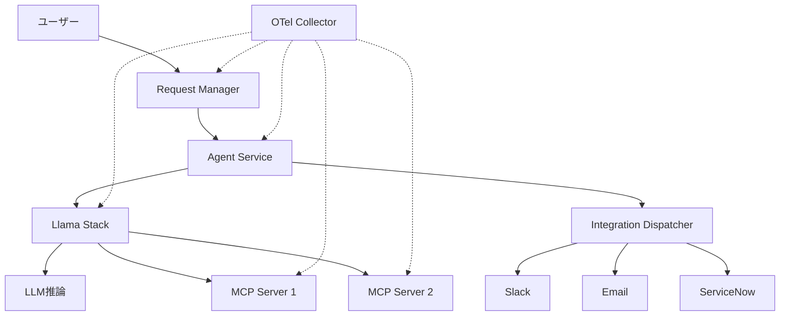

本記事は [Distributed tracing for agentic workflows with OpenTelemetry (Red Hat Developer, 2026-04-06)](https://developers.redhat.com/articles/2026/04/06/distributed-tracing-agentic-workflows-opentelemetry) の解説記事です。

## ブログ概要（Summary）

Red Hat AIチームのFabio Massimo Ercoli氏が、マルチエージェントITセルフサービスシステム（it-self-service-agent）への本番グレードの分散トレーシング導入経験を記した技術記事である。ルーティングエージェント・専門エージェント・ナレッジベース・MCP（Model Context Protocol）サーバーが相互に連携するシステムに対し、OpenTelemetry（OTel）を使用してリクエストフロー全体を可視化する実装手法が詳述されている。自動計装・手動計装・コンテキスト伝播の3つのアプローチを使い分ける判断基準と、本番環境（Red Hat OpenShift）でのデプロイ戦略が解説されている。

この記事は [Zenn記事: マルチエージェント通信の本番運用設計](https://zenn.dev/0h_n0/articles/d33c4bc04dc533) の深掘りです。

## 情報源

- **種別**: 企業テックブログ
- **URL**: https://developers.redhat.com/articles/2026/04/06/distributed-tracing-agentic-workflows-opentelemetry
- **組織**: Red Hat AI / Red Hat Developer
- **著者**: Fabio Massimo Ercoli
- **発表日**: 2026-04-06

## 技術的背景（Technical Background）

マルチエージェントシステムは、従来のマイクロサービス以上に複雑なリクエストフローを持つ。1つのユーザーリクエストが、ルーティングエージェント → 専門エージェント → LLM推論 → ツール呼び出し（MCP） → 外部サービスと、複数のサービスを跨いで処理される。障害が発生した場合、「どのエージェントの、どのLLM呼び出しで、どのツール実行が失敗したか」を特定するには、エンドツーエンドの分散トレーシングが不可欠である。

OpenTelemetryは2019年にOpenTracingとOpenCensusが統合されて誕生した可観測性フレームワークであり、ベンダー中立なテレメトリ収集の標準となっている。W3C Trace Contextによるコンテキスト伝播により、サービス境界を越えてトレースIDを維持し、リクエスト全体を1つのトレースとして可視化する。

### マルチエージェント可観測性の固有課題

従来のマイクロサービスと比較して、エージェントシステムには以下の固有課題がある：

1. **非決定的実行パス**: LLMの出力に応じてルーティング先が動的に変わる
2. **可変長のトレース深度**: ツール呼び出しの連鎖回数が実行ごとに異なる
3. **ストリーミング応答**: LLM推論のトークンストリーミング中はスパンが長時間オープン
4. **MCP外部サーバー**: 自動計装ライブラリが存在しない外部コンポーネント

## 実装アーキテクチャ（Architecture）

### it-self-service-agent のシステム構成



著者が報告するシステム構成は6つのコンポーネントから成る：

| コンポーネント | 役割 | 計装方式 |
|--------------|------|---------|
| Request Manager | 入力正規化・ルーティング | 自動計装 |
| Agent Service | AIオーケストレーション | 自動計装 |
| Integration Dispatcher | 外部サービス連携 | 自動計装 |
| Llama Stack | LLM推論・ツール管理 | 設定ベース |
| MCP Servers | Model Context Protocol統合 | 手動計装 |
| Eventing Layer | CloudEventsルーティング | 自動計装 |

### 計装戦略の使い分け

著者は3つの計装アプローチを状況に応じて使い分けている：

**1. 自動計装（Auto-Instrumentation）**

FastAPIやHTTPXなど、OpenTelemetryの計装ライブラリが存在するフレームワークに適用する。

```python
from opentelemetry.instrumentation.fastapi import FastAPIInstrumentor
from opentelemetry.instrumentation.httpx import HTTPXClientInstrumentor

# FastAPIアプリケーションの自動計装
FastAPIInstrumentor.instrument_app(app)

# HTTPXクライアントの自動計装（エージェント間通信）
HTTPXClientInstrumentor().instrument()
```

必要パッケージ（バージョン1.37.0）：
- `opentelemetry-exporter-otlp-proto-http`
- `opentelemetry-instrumentation-httpx`
- `opentelemetry-api`
- `opentelemetry-sdk`
- `opentelemetry-instrumentation-fastapi`

**2. 設定ベース計装（Configuration-based）**

Llama Stackのように、OTel対応が組み込まれているがフレームワーク固有の設定が必要なコンポーネント。

Llama Stack v0.3.x では環境変数のみで設定が完了する：
- `OTEL_SERVICE_NAME`
- `OTEL_PYTHON_LOGGING_AUTO_INSTRUMENTATION_ENABLED=true`
- `OTEL_EXPORTER_OTLP_ENDPOINT`

**3. 手動計装（Manual Instrumentation）**

MCP Serverなど、自動計装ライブラリが存在しないコンポーネントに適用する。

```python
from opentelemetry import trace, propagate, context
from opentelemetry.trace import StatusCode
from opentelemetry.sdk.trace import TracerProvider
from opentelemetry.sdk.trace.export import BatchSpanProcessor
from opentelemetry.exporter.otlp.proto.http.trace_exporter import OTLPSpanExporter
from opentelemetry.propagators.textmap import DefaultGetter
from functools import wraps
import os

# TracerProvider初期化（モジュールロード時に1回）
provider = TracerProvider()
exporter = OTLPSpanExporter(
    endpoint=os.getenv("OTEL_EXPORTER_OTLP_ENDPOINT", "http://localhost:4318")
)
provider.add_span_processor(BatchSpanProcessor(exporter))
trace.set_tracer_provider(provider)
tracer = trace.get_tracer("mcp.server")


def traced_mcp_tool(tool_name: str):
    """MCPツール呼び出しのトレーシングデコレータ"""
    def decorator(func):
        @wraps(func)
        async def wrapper(*args, headers: dict | None = None, **kwargs):
            # HTTPヘッダーからトレースコンテキストを抽出
            ctx = context.get_current()
            if headers:
                normalized = {k.lower(): v for k, v in headers.items()}
                ctx = propagate.extract(normalized, getter=DefaultGetter())

            with tracer.start_as_current_span(
                f"execute_tool {tool_name}",
                context=ctx,
                attributes={
                    "mcp.tool.name": tool_name,
                    "mcp.server.name": "it-self-service",
                },
            ) as span:
                try:
                    result = await func(*args, **kwargs)
                    span.set_status(StatusCode.OK)
                    return result
                except Exception as e:
                    span.set_status(StatusCode.ERROR)
                    span.record_exception(e)
                    raise
        return wrapper
    return decorator
```

### W3C Trace Context の伝播

サービス間でトレースIDを維持するために、W3C Trace Contextヘッダーを使用する。ヘッダーフォーマット：

```
traceparent: 00-{trace_id}-{span_id}-{sampled}
```

著者が報告する重要な制約として、Llama Stack v0.2.x/v0.3.xではMCPサーバーへのスパンコンテキスト自動伝播がサポートされていない。MCPサーバー呼び出し時には手動で`opentelemetry.propagate.inject()`によるヘッダー注入が必要である。

```python
from opentelemetry import propagate

def call_mcp_server(url: str, payload: dict) -> dict:
    """MCPサーバー呼び出し時のコンテキスト手動注入"""
    headers: dict[str, str] = {}
    propagate.inject(headers)  # traceparentヘッダーを注入
    
    response = httpx.post(url, json=payload, headers=headers)
    return response.json()
```

## パフォーマンス最適化（Performance）

### スパン構造の実測値

著者が報告するトレースの典型的な構成：

| コンポーネント | レイテンシ | 備考 |
|--------------|-----------|------|
| Request Manager (HTTP POST) | ~1ms | 入力正規化 |
| Event Service通信 | ~1ms | CloudEventsルーティング |
| Agent Service全体 | ~3.6s | オーケストレーション合計 |
| Llamastack モデルクエリ | ~8ms | モデル情報取得 |
| Vector Store操作 | ~9ms | RAG検索 |
| LLM推論（ストリーミング） | ~3s | リクエスト時間の大部分 |
| MCPツール呼び出し | ~12ms | 外部ツール実行 |

LLM推論がリクエスト時間の80%以上を占めるため、推論以外のコンポーネントへの計装オーバーヘッド（マイクロ秒オーダー）は無視できる。

### 著者が推奨するパフォーマンス指針

1. 些細な操作（変数代入、単純な条件分岐）にスパンを作成しない
2. スパン属性に使う値の計算が高コストな場合は遅延評価する
3. `BatchSpanProcessor`を使用し、スパンの非同期エクスポートを行う

## 運用での学び（Production Lessons）

### 開発環境: Jaeger All-in-One

著者はDocker Composeで以下のポート構成を推奨している：
- 16686: Jaeger UI
- 4317: OTLP gRPC受信
- 4318: OTLP HTTP受信
- 5778: サービングエンドポイント
- 9411: Zipkin互換

### 本番環境: Red Hat OpenShift Distributed Tracing

本番では Red Hat OpenShift の分散トレーシング機能（Observe > Traces）を使用する。テナント・サービス名・名前空間・ステータス・レイテンシ・カスタム属性によるフィルタリングが可能。

### MCP計装の属性設計

著者が推奨するMCP固有のスパン属性：

| 属性名 | 型 | 説明 |
|--------|-----|------|
| `mcp.tool.name` | string | 呼び出したツール名 |
| `mcp.server.name` | string | MCPサーバー識別子 |
| `mcp.tool.arg.{index}` | string | 位置引数 |
| `mcp.tool.param.{key}` | string | キーワード引数 |

これらはOpenTelemetry GenAI Semantic Conventionsの`gen_ai.tool.name`等と補完関係にある。

## 学術研究との関連（Academic Connection）

本ブログ記事の内容は、OpenTelemetry GenAI SIGが策定中の「Agent Framework Semantic Convention」と密接に関連している。特に：

- `invoke_agent`スパンタイプ: 記事中のAgent Service呼び出しに対応
- `execute_tool`スパンタイプ: MCPツール呼び出しに対応
- W3C Trace Context伝播: A2Aプロトコルの分散トレーシング仕様に対応

GenAI Semantic Conventionsは2026年時点で「Development」ステータスであり、Datadog（v1.37以降）やGrafanaが既にサポートを開始している。本記事の実装パターンは、これらの標準仕様が安定するまでの実践的なブリッジとして機能する。

## まとめと実践への示唆

Red Hatの実装経験から得られる主要な教訓：

1. **計装戦略の使い分け**: 自動計装→設定ベース→手動計装の優先順位で選択し、手動計装は最小限に抑える
2. **MCP固有の課題**: フレームワーク間のコンテキスト伝播は自動では行われない場合があり、手動注入が必要
3. **本番グレードの構成**: BatchSpanProcessor + OTLP exporter + OpenShift Distributed Tracingの組み合わせが推奨される
4. **属性設計**: GenAI Semantic Conventionsに準拠しつつ、MCP固有属性で補完する

## Production Deployment Guide

### AWS実装パターン（コスト最適化重視）

本記事の分散トレーシングアーキテクチャをAWS上で実装する場合の推奨構成：

| 規模 | 月間リクエスト | 推奨構成 | 月額コスト | 主要サービス |
|------|--------------|---------|-----------|------------|
| **Small** | ~3,000 (100/日) | Serverless | $80-200 | Lambda + X-Ray + DynamoDB |
| **Medium** | ~30,000 (1,000/日) | Hybrid | $400-1,000 | ECS Fargate + ADOT Collector + Grafana Tempo |
| **Large** | 300,000+ (10,000/日) | Container | $2,500-6,000 | EKS + ADOT + Grafana Cloud |

**Small構成の詳細** (月額$80-200):
- **Lambda**: エージェント処理、1GB RAM ($25/月)
- **AWS X-Ray**: 分散トレーシング ($15/月、100K traces)
- **DynamoDB**: スパンメタデータ保存 ($10/月)
- **CloudWatch Logs**: ログ集約 ($20/月)
- **Bedrock**: LLM推論 Claude 3.5 Haiku ($80/月)

**Medium構成の詳細** (月額$400-1,000):
- **ECS Fargate**: OTel Collector + Agent Service ($150/月)
- **ADOT (AWS Distro for OpenTelemetry)**: コレクター ($0、OSSコンポーネント)
- **Grafana Tempo on S3**: トレースストレージ ($50/月)
- **Bedrock**: Claude 3.5 Sonnet ($500/月)
- **ElastiCache Redis**: スパンバッファ ($30/月)
- **ALB**: ロードバランシング ($20/月)

**コスト試算の注意事項**:
- 上記は2026年5月時点のAWS ap-northeast-1（東京）リージョン料金に基づく概算値です
- トレーシングのストレージコストはスパン数とretention期間に強く依存します
- 最新料金は [AWS料金計算ツール](https://calculator.aws/) で確認してください

### Terraformインフラコード

**Small構成 (Serverless): Lambda + X-Ray + ADOT Layer**

```hcl
# --- ADOT Lambda Layer（OpenTelemetry計装） ---
data "aws_lambda_layer_version" "adot" {
  layer_name = "aws-otel-python-amd64-ver-1-25-0"
}

# --- Lambda関数（エージェント処理） ---
resource "aws_lambda_function" "agent_handler" {
  filename      = "agent.zip"
  function_name = "multi-agent-handler"
  role          = aws_iam_role.lambda_agent.arn
  handler       = "index.handler"
  runtime       = "python3.12"
  timeout       = 120
  memory_size   = 1024

  layers = [data.aws_lambda_layer_version.adot.arn]

  environment {
    variables = {
      AWS_LAMBDA_EXEC_WRAPPER       = "/opt/otel-instrument"
      OTEL_SERVICE_NAME             = "agent-service"
      OTEL_TRACES_EXPORTER          = "otlp"
      OTEL_EXPORTER_OTLP_ENDPOINT   = "http://localhost:4318"
      OTEL_PROPAGATORS              = "tracecontext,baggage"
    }
  }

  tracing_config {
    mode = "Active"  # X-Ray統合
  }
}

# --- IAMロール（X-Ray書き込み権限） ---
resource "aws_iam_role_policy" "xray_write" {
  role = aws_iam_role.lambda_agent.id

  policy = jsonencode({
    Version = "2012-10-17"
    Statement = [{
      Effect = "Allow"
      Action = [
        "xray:PutTraceSegments",
        "xray:PutTelemetryRecords",
        "xray:GetSamplingRules",
        "xray:GetSamplingTargets"
      ]
      Resource = "*"
    }]
  })
}

# --- CloudWatch Logs（構造化ログ） ---
resource "aws_cloudwatch_log_group" "agent" {
  name              = "/aws/lambda/multi-agent-handler"
  retention_in_days = 14
}
```

### 運用・監視設定

**CloudWatch Logs Insights クエリ**:
```sql
-- エージェント間通信のレイテンシ分析
fields @timestamp, service_name, span_name, duration_ms
| filter span_name like /invoke_agent/
| stats avg(duration_ms) as avg_latency,
        pct(duration_ms, 95) as p95,
        pct(duration_ms, 99) as p99
  by service_name, bin(5m)

-- MCP呼び出し失敗率
fields @timestamp, mcp_tool_name, status_code
| filter span_name like /execute_tool/
| stats count(*) as total,
        sum(case when status_code = "ERROR" then 1 else 0 end) as errors
  by mcp_tool_name, bin(1h)
| display mcp_tool_name, total, errors, errors * 100.0 / total as error_rate
```

**X-Ray Service Map活用**:
```python
import boto3

xray = boto3.client("xray")

# サービスグラフ取得（エージェント間依存関係の可視化）
response = xray.get_service_graph(
    StartTime=datetime.now() - timedelta(hours=1),
    EndTime=datetime.now(),
)

for service in response["Services"]:
    name = service["Name"]
    latency_p95 = service["ResponseTimeHistogram"]
    fault_rate = service.get("SummaryStatistics", {}).get("FaultStatistics", {})
    print(f"{name}: p95={latency_p95}, faults={fault_rate}")
```

### コスト最適化チェックリスト

**トレーシング固有の最適化**:
- [ ] サンプリング率設定: 全スパンではなくhead-basedサンプリング（本番は10-20%推奨）
- [ ] スパンretention期間: 開発7日、本番30日（コストと調査可能期間のバランス）
- [ ] BatchSpanProcessor使用: リアルタイム性を犠牲にバッチ送信でコスト削減
- [ ] 不要スパンのフィルタリング: OTel Collectorのprocessorで低価値スパンをドロップ

**リソース最適化**:
- [ ] ADOT Collector: Sidecarパターン（ECS）vs DaemonSetパターン（EKS）の選択
- [ ] Lambda: ADOT Layer使用で追加インフラ不要
- [ ] Grafana Tempo on S3: マネージドサービスより安価（大規模時）
- [ ] X-Ray: 小規模ではマネージドで十分（追加インフラ不要）

## 参考文献

- **Blog URL**: https://developers.redhat.com/articles/2026/04/06/distributed-tracing-agentic-workflows-opentelemetry
- **OpenTelemetry GenAI Semantic Conventions**: https://opentelemetry.io/docs/specs/semconv/gen-ai/
- **W3C Trace Context**: https://www.w3.org/TR/trace-context/
- **Related Zenn article**: https://zenn.dev/0h_n0/articles/d33c4bc04dc533
