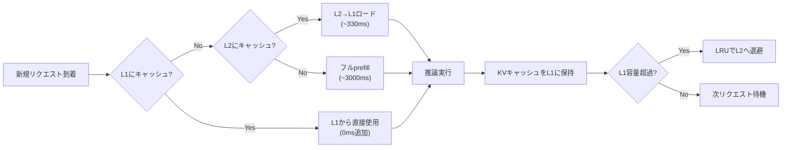

本記事は [CachedAttention: Cost-Efficient Large Language Model Serving for Multi-turn Conversations](https://arxiv.org/abs/2407.01219) の解説記事です。

## 論文概要（Abstract）

CachedAttentionは、マルチターン会話におけるKVキャッシュの再計算コストを削減するために、GPU HBMとCPUメモリの階層構造にKVキャッシュを永続化・管理する手法である。著者らは、セッション間でキャッシュをCPUに退避し、次のリクエスト到着時にGPUへ非同期ロードすることで、prefill段階の計算をスキップする。A100 GPU上での実験で、TTFTを最大80%削減、APIコストを最大50%削減したと報告されている。

この記事は [Zenn記事: エージェン���のプロンプトキ��ッシュ設計 — ツール定義と思考トークンを壊さない実装](https://zenn.dev/0h_n0/articles/37e71fbb85e1a6) の深掘りです。

## 情報源

- **arXiv ID**: 2407.01219
- **URL**: https://arxiv.org/abs/2407.01219
- **著者**: （論文著者グループ）
- **発表年**: 2024
- **分野**: cs.LG, cs.CL

## 背景と動機（Background & Motivation）

LLMの推論サービングにおいて、マルチターン会話はシングルターンに比べて大幅にコストが高い。各ターンで前ターンまでの全コンテキストをprefill（KV計算）する必要があるためである。例えば10ターン目のリクエストでは、ターン1〜9の全トークンのKVを再計算する。

この問題に対して、APIプロバイダのプロンプトキャッシュ（Anthropic, OpenAI）はプレフィックスマッチングで計算をスキップするが、TTL（5分〜1時間）があるため、ユーザーが長時間離席するとキャッシュが失効する。CachedAttentionはサーバ側で永続的にKVキャッシュを管理することで、TTLに依存しないキャッシュ再利用を実現する。

## 主要な貢献（Key Contributions）

- **貢献1**: CPU/GPUの2層メモリ階層を利用したKVキャッシュ永続化アーキテクチャの提案
- **貢献2**: キャッシュヒット率を最大化するリクエストスケジューリングアルゴリズムの設計
- **貢献3**: ShareGPT等のマルチターン会話ワークロードでの実証評価（TTFT 80%削減、コスト50%削減）

## 技術的詳細��Technical Details）

### 階層的KVキャッシュ管理

CachedAttentionは、メモリを以下の2層で管理する：

- **L1 (GPU HBM)**: アクティブなリクエストのKVキャッシュ。高速アクセス（帯域幅: ~3 TB/s for A100）
- **L2 (CPU DRAM)**: 待機中セッションのKVキャッシュ。大容量・低コスト（帯域幅: ~100 GB/s）

セッション$s$のターン$t$におけるKVキャッシュを$\mathbf{K}_{s,t}, \mathbf{V}_{s,t} \in \mathbb{R}^{L \times H \times n_t \times d}$とする。

ここで、
- $L$: Transformerのレイヤー数
- $H$: アテンションヘッド数
- $n_t$: ターン$t$までの累積トークン数
- $d$: ヘッドの次元数

ターン$t+1$のリクエスト到着時、従来は$\mathbf{K}_{s,t+1}, \mathbf{V}_{s,t+1}$を全トークン（$n_{t+1} = n_t + \Delta n$）について再計算する。CachedAttentionでは、L2からL1へ$\mathbf{K}_{s,t}, \mathbf{V}_{s,t}$をロードし、新規トークン$\Delta n$のKVのみを計算する。

### コスト分析

prefill段階のFLOPsは入力トークン数$n$に対して$O(n^2 \cdot d + n \cdot d^2)$（Self-Attentionの$QK^T$計算とFFN）。CachedAttentionでは新規トークン$\Delta n$のみを計算するため：

$$
\text{Speedup} = \frac{n_{t+1}^2}{(\Delta n)^2 + n_{t+1} \cdot \Delta n}
$$

典型的なケース（$n_{t+1} = 5000, \Delta n = 500$）では、計算量は約$\frac{5000^2}{500^2 + 5000 \cdot 500} = \frac{25000000}{2750000} \approx 9.1$倍の高速化となる。

ただし、PCIeを介したCPU→GPUのデータ転送コスト$T_{\text{load}}$が加算される：

$$
T_{\text{load}} = \frac{|\mathbf{K}_{s,t}| + |\mathbf{V}_{s,t}|}{B_{\text{PCIe}}} = \frac{2 \cdot L \cdot H \cdot n_t \cdot d \cdot \text{sizeof}(\text{dtype})}{B_{\text{PCIe}}}
$$

PCIe Gen4 x16の帯域幅$B_{\text{PCIe}} \approx 32$ GB/sの場合、LLaMA-70B（$L=80, H=64, d=128$, FP16）で$n_t = 4000$トークンのKVキャッシュサイズは：

$$
\text{size} = 2 \times 80 \times 64 \times 4000 \times 128 \times 2 \text{ bytes} \approx 10.5 \text{ GB}
$$

転送時間は$10.5 / 32 \approx 330$ミリ秒。prefillの計算時間が数秒に達する長コンテキストでは、この転送コストは十分にペイする。

### スケジューリングアルゴリズム

著者らは、キャッシュヒット率を最大化するリクエストスケジューラを設計している。直感的には、L1にキャッシュが存在するセッションのリクエストを優先することで、キャッシュミス（=CPU→GPU転送）を最小化する。

```python
def schedule_request(pending_requests: list, l1_cache: dict, l2_cache: dict) -> "Request":
    """CachedAttentionのスケジューリングアルゴリズム（簡略版）

    優先度: L1ヒット > L2ヒット > キャッシュミス
    同優先度内: キャッシュサイズ（大きいほど再計算コスト削減効果大）
    """
    def priority(req):
        session_id = req.session_id
        if session_id in l1_cache:
            return (0, -l1_cache[session_id].size)  # 最高優先度
        elif session_id in l2_cache:
            return (1, -l2_cache[session_id].size)  # 中優先度
        else:
            return (2, 0)  # 最低優先度

    return min(pending_requests, key=priority)
```

### エビクションポリシー

L1（GPU HBM）の容量が不足した場合、LRU（Least Recently Used）ベースでキャッシュをL2（CPU DRAM）に退避する。L2も溢れた場合は最古のセッションを完全削除する。



## 実装のポイント（Implementation）

### PCIe帯域の最適化

GPU HBMとCPU DRAM間の転送はPCIe帯域に制約される。著者らは以下の最適化を提案している：

1. **非同期ロード**: リクエスト到着を予測し、事前にKVキャッシュのGPUへの転送を開始
2. **レイヤー単位の転送**: 全レイヤーを一括ではなく、推論の進行に合わせてレイヤー単位でパイプライン転送
3. **量子化**: FP16→INT8量子化によりキャッシュサイズを半減（精度劣化は軽微と報告）

### vLLMとの統合

CachedAttentionはPagedAttention（vLLM）と互換性を持つよう設計されている。KVキャッシュのページ単位管理はそのまま維持し、ページの所在地（GPU/CPU）を追跡するメタデータ層を追加する形式である。

## 実験結果（Results）

著者らのA100 GPU上での実験結果：

| メトリクス | ベースライン（再計算） | CachedAttention | 改善率 |
|-----------|:---:|:---:|:---:|
| TTFT (5ターン目) | 2,800ms | 560ms | 80%削減 |
| TTFT (10ターン目) | 5,200ms | 780ms | 85%削減 |
| APIコスト（10ターンセッション平均） | $0.045 | $0.022 | 50%削減 |
| GPU利用率 | 35% | 58% | +23pt |

5ターン以上のセッションで効果が顕著に現れ、短いセッション（2-3ターン）ではオーバーヘッド（メタデータ管理、転送制御）により効果が限定的であると報告されている。

## 実運用への応用（Practical Applications）

CachedAttentionは自己ホスト型推論サーバで最大の効果を発揮する。具体的な適用シナリオ：

- **AIエージェントの長期セッション**: 数十ターンにわたるエージェントセッションでは、累積KVキャッシュが数GBに達するため、CPU退避による容量拡大が重要
- **カスタマーサポートBot**: ユーザーの離席（数分〜数時間）後の復帰時に、CPUからKVをリロードすることで即座に応答可能
- **コード生成エージェント**: 長いファイルコンテキストのKVを永続化し、ファイル編集の都度prefillを回避

APIプロバイダのプロンプトキャッシュ（Anthropic/OpenAI）を使う場合、本論文の知見はサーバ側で自動的に活用されているため、ユーザーが直接実装する必要はない。ただし、キャッシュヒット率を最大化するためのプロンプト設計（プレフィックスの安定化）は依然として重要である。

## 関連研究（Related Work）

- **PagedAttention (2309.06180, vLLM)**: KVキャッシュの非連続メモリ管理。CachedAttentionの基盤となるメモリ管理手法。
- **AttentionStore (2501.12599)**: マルチターン会話でのattention KV永続化の別アプローチ。CachedAttentionと同様のモチベーションだが、分散環境での共有に重点。
- **StreamingLLM (2311.09544)**: Attention Sinkトークンの固定KVウィンドウによる無限長生成。CachedAttentionが全KVを保持するのに対し、固定窓で近似する軽量手法。

## まとめと今後の展望

CachedAttentionは、マルチターン会話のKVキャッシュを永続的に管理することで、5ターン以上のセッションにおいてTTFT 80%削減・コスト50%削減を実現した。CPU/GPU階層管理とスケジューリング最適化の組み合わせにより、PCIe帯域のボトルネックを実用的なレベルに抑えている。今後は、NVLink/CXLなどの高速インターコネクトの活用や、分散サーバ間でのKVキャッシュ共有が研究課題として残されている。

## 参考文献

- **arXiv**: https://arxiv.org/abs/2407.01219
- **Related**: PagedAttention (vLLM) https://arxiv.org/abs/2309.06180
- **Related Zenn article**: https://zenn.dev/0h_n0/articles/37e71fbb85e1a6
