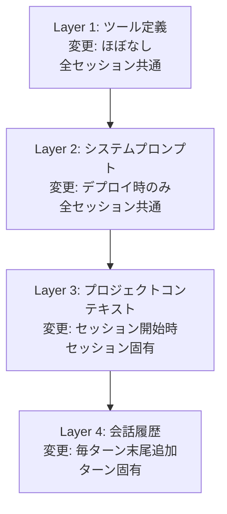

本記事は [Lessons from building Claude Code: Prompt caching is everything](https://claude.com/blog/lessons-from-building-claude-code-prompt-caching-is-everything) の解説記事です。

## ブログ概要（Summary）

Anthropicのエンジニアリングチームが公開した本記事は、Claude Code（対話型AIコーディングエージェント）の設計において、プロンプトキャッシュがいかに中核的な設計原則であるかを解説している。著者のThariq氏は「cache rules everything around me」と表現し、キャッシュヒット率をシステムのアップタイムと同等の重要度で監視する運用哲学を示している。Claude Codeでは、キャッシュヒット率90%で$100相当のセッションが$19に圧縮されるという具体的コスト効果が報告されている。

この記事は [Zenn記事: エージェントのプロンプトキャッシュ設計 — ツール定義と思考トークンを壊さない実装](https://zenn.dev/0h_n0/articles/37e71fbb85e1a6) の深掘りです。

## 情報源

- **種別**: 企業テックブログ
- **URL**: https://claude.com/blog/lessons-from-building-claude-code-prompt-caching-is-everything
- **組織**: Anthropic（Claude Codeチーム）
- **発表日**: 2026年

## 技術的背景（Technical Background）

Claude Codeは長時間稼働するエージェント製品であり、1セッションあたり数十〜数百ターンの対話を処理する。各ターンでLLM APIを呼び出すため、プレフィックスの再計算コストが累積的に増大する。プロンプトキャッシュはこの問題に対する根本的解決策であり、前回のリクエストと共通するプレフィックス部分の計算をスキップすることで、レイテンシとコストの両方を削減する。

Claude Codeチームがキャッシュを「すべてに優先する設計原則」として位置づけた背景には、以下の定量的事実がある：

- キャッシュ読み込み（cache read）のコストは通常入力の10%
- 90%のキャッシュヒット率で、セッション全体のコストが約80%削減される
- キャッシュヒット率の低下は直接的にレート制限の逼迫につながる

## 実装アーキテクチャ（Architecture）

### プロンプトの安定性レイヤー設計

Claude Codeのプロンプトは、変更頻度の低い要素から高い要素へと順序付けされている。この順序がキャッシュプレフィックスの安定性を決定する。



この設計により、Layer 1-2は全セッション・全ユーザーで共有キャッシュとなり、Layer 3はセッション単位、Layer 4は末尾追加のみで既存キャッシュを維持する。

### キャッシュを壊さない4つの設計原則

**原則1: ツール定義を会話途中で変更しない**

ツール定義はキャッシュプレフィックスの最上位に位置する。ツールの追加・削除は全キャッシュを無効化するため、Claude Codeでは以下の代替パターンを採用している：

- **Plan Mode**: 直感的にはツールセットを読み取り専用に切り替えたいが、それはキャッシュを破壊する。代わりに`EnterPlanMode`/`ExitPlanMode`というツール自体を使って状態遷移を実現
- **モデル切り替え**: Opus→Haikuへの切り替えが必要な場合、サブエージェントとして別セッションを起動（キャッシュはモデル固有のため）

```python
# ❌ 悪い例: ツールセットの動的変更
def enter_plan_mode(tools):
    return [t for t in tools if t["name"] in READ_ONLY_TOOLS]

# ✅ 良い例: ツール自体で状態を管理
TOOLS = [
    # ... 全ツール（常に固定）
    {"name": "EnterPlanMode", "description": "読み取り専用モードに入る"},
    {"name": "ExitPlanMode", "description": "通常モードに戻る"},
]
```

**原則2: システムプロンプトをメッセージ途中で変更しない**

情報更新が必要な場合、システムプロンプトを書き換えるのではなく、`system-reminder`タグとして後続メッセージに挿入する。これにより、システムプロンプトのキャッシュは維持されたまま、最新情報が反映される。

```python
# ❌ 悪い例: システムプロンプトの更新
system_prompt = base_prompt + f"\n現在の日時: {datetime.now()}"

# ✅ 良い例: メッセージ内でsystem-reminderとして注入
messages.append({
    "role": "user",
    "content": f"<system-reminder>現在の日時: {datetime.now()}</system-reminder>"
})
```

**原則3: defer_loadingで未使用ツールを軽量化**

Claude Codeでは多数のツール（数十個）が定義されているが、1ターンで使用されるのは通常2-3個である。`defer_loading: true`を設定したツールは軽量スタブとしてキャッシュされ、ToolSearchで選択された時点で完全スキーマがロードされる。

**原則4: コンパクション時にプレフィックスを共有**

コンテキストウィンドウが溢れた場合の要約（コンパクション）処理では、通常のリクエストと同一の`tools`と`system`を使用する。これにより、コンパクション用リクエスト自体もキャッシュプレフィックスを共有し、追加コストを最小化している。

## パフォーマンス最適化（Performance）

### キャッシュヒット率と経済性

Claude Codeチームが報告している具体的な数値：

| メトリクス | 値 |
|-----------|-----|
| 目標キャッシュヒット率 | 90%以上 |
| cache read単価 | 通常inputの10% |
| $100セッション→キャッシュ後 | $19 |
| ヒット率低下時のアクション | SEV（インシデント）対応 |

### コスト計算モデル

キャッシュ有効時のセッションコスト$C$は以下で近似される：

$$
C = T_{\text{total}} \cdot r_{\text{input}} \cdot (1 - h \cdot 0.9)
$$

ここで、
- $T_{\text{total}}$: セッション全体の総入力トークン数
- $r_{\text{input}}$: 入力トークンの単価
- $h$: キャッシュヒット率（0〜1）
- $0.9$: cache readの割引率（通常の10%課金 = 90%割引）

ヒット率$h = 0.9$の場合：$C = T \cdot r \cdot (1 - 0.81) = 0.19 \cdot T \cdot r$（約81%削減）

### TTL戦略

Claude Codeでは、レイヤーごとに異なるTTLを適用している：

- **ツール定義・システムプロンプト**: 1時間TTL（デプロイ間で不変、複数セッション間で共有）
- **プロジェクトコンテキスト**: 5分TTL（セッション固有、ターン間隔は通常1分以内）
- **会話履歴**: 5分TTL（自動、末尾追加でリフレッシュ）

## 運用での学び（Production Lessons）

### キャッシュブレイクをインシデントとして扱う

Claude Codeチームは、キャッシュヒット率の有意な低下をシステム障害と同等に扱う運用体制を構築している。これは以下の理由による：

1. **コスト直結**: ヒット率10%低下 = セッションコスト約2倍
2. **レート制限**: 低ヒット率 = 新規トークン処理量増 = レート制限逼迫
3. **ユーザー体験**: TTFT増加による応答遅延

### 主要な障害パターンと対策

| 障害パターン | 原因 | 対策 |
|-------------|------|------|
| デプロイ後のヒット率急落 | ツール定義の変更 | ツール定義のバージョン管理、段階的ロールアウト |
| 特定ユーザーのみヒット率低下 | プロジェクトコンテキスト過大 | コンテキスト圧縮の自動発動 |
| 全ユーザーで間欠的ミス | TTL超過（ユーザー思考時間） | 1時間TTLへの移行 |
| サブエージェント呼び出し後 | モデル切り替え | サブエージェント完了後にpre-warm |

### モニタリング実装

```python
import logging
import json
import time

logger = logging.getLogger("cache_monitor")

def log_cache_metrics(response_usage: dict, session_id: str, turn: int) -> None:
    """APIレスポンスからキャッシュメトリクスを構造化ログ出力"""
    cache_read = response_usage.get("cache_read_input_tokens", 0)
    cache_write = response_usage.get("cache_creation_input_tokens", 0)
    input_tokens = response_usage.get("input_tokens", 0)
    total = cache_read + cache_write + input_tokens

    hit_ratio = cache_read / total if total > 0 else 0.0

    logger.info(json.dumps({
        "event": "llm_cache_metrics",
        "level": "info",
        "ts": time.time(),
        "session_id": session_id,
        "turn": turn,
        "cache_read_tokens": cache_read,
        "cache_write_tokens": cache_write,
        "new_input_tokens": input_tokens,
        "hit_ratio": round(hit_ratio, 3),
        "cost_savings_pct": round(hit_ratio * 90, 1),
    }))

    # 閾値アラート
    if turn >= 3 and hit_ratio < 0.5:
        logger.warning(json.dumps({
            "event": "cache_hit_rate_low",
            "level": "warning",
            "ts": time.time(),
            "session_id": session_id,
            "turn": turn,
            "hit_ratio": round(hit_ratio, 3),
            "action": "investigate_prefix_stability",
        }))
```

## 学術研究との関連（Academic Connection）

Claude Codeの設計は、以下の学術研究と密接に関連している：

- **"Don't Break the Cache" (2601.06007)**: 本ブログの運用知見を定量的に検証した論文。Claude Codeの「Exclude Dynamic」戦略が最も効果的であることを実験で確認
- **ChunkAttention (2311.04934)**: プレフィックス共有のサーバ内部実装。Claude Codeが利用するAnthropicのサーバ側でもtrie構造によるKVキャッシュ共有が行われている可能性が高い
- **PagedAttention (2309.06180, vLLM)**: メモリの非連続管理によるフラグメンテーション解消。キャッシュの効率的格納を可能にする基盤技術

## Production Deployment Guide

### AWS実装パターン（コスト最適化重視）

Claude Codeの設計原則を自社エージェントに適用するAWS構成を示す。

| 規模 | 月間リクエスト | 推奨構成 | 月額コスト | 主要サービス |
|------|:---:|:---:|:---:|:---:|
| **Small** | ~3,000 | Serverless | $80-200 | Lambda + Bedrock + ElastiCache |
| **Medium** | ~30,000 | Hybrid | $400-1,000 | ECS Fargate + Bedrock + Redis |
| **Large** | 300,000+ | Container | $2,500-6,000 | EKS + Bedrock + Redis Cluster |

**キャッシュ設計のAWSマッピング**:
- Layer 1-2（全ユーザー共通）: ElastiCache Redis（TTL: 1時間）でプレフィックスメタデータを管理
- Layer 3（セッション固有）: DynamoDB（TTL: 5分）でセッションコンテキストを保持
- Layer 4（会話履歴）: Bedrock API側の自動キャッシュに委譲

**コスト試算の注意事項**: 上記は2026年5月時点のAWS ap-northeast-1リージョン概算値です。Bedrockのプロンプトキャッシュ料金はモデル・リクエスト量により変動します。

### Terraformインフラコード

```hcl
resource "aws_elasticache_cluster" "prefix_cache" {
  cluster_id           = "agent-prefix-cache"
  engine               = "redis"
  node_type            = "cache.t4g.micro"
  num_cache_nodes      = 1
  parameter_group_name = "default.redis7"
  port                 = 6379

  tags = {
    Purpose = "prompt-prefix-metadata"
    TTL     = "3600"
  }
}

resource "aws_lambda_function" "agent_orchestrator" {
  filename      = "orchestrator.zip"
  function_name = "cache-aware-agent"
  role          = aws_iam_role.agent_role.arn
  handler       = "main.handler"
  runtime       = "python3.12"
  timeout       = 120
  memory_size   = 2048

  environment {
    variables = {
      REDIS_ENDPOINT      = aws_elasticache_cluster.prefix_cache.cache_nodes[0].address
      BEDROCK_MODEL_ID    = "anthropic.claude-sonnet-4-6-20250514-v1:0"
      CACHE_TTL_SYSTEM    = "3600"
      CACHE_TTL_SESSION   = "300"
      ENABLE_CACHE_MONITOR = "true"
    }
  }

  vpc_config {
    subnet_ids         = module.vpc.private_subnets
    security_group_ids = [aws_security_group.lambda_sg.id]
  }
}
```

### コスト最適化チェックリスト

- [ ] プロンプト構造をレイヤー分離（ツール→システム→コンテキスト→会話）
- [ ] ツール定義を会話途中で変更しない設計
- [ ] システムプロンプト更新はmessage内system-reminderで対応
- [ ] defer_loadingで未使用ツールを軽量スタブ化
- [ ] コンパクション時に同一tools/systemを維持
- [ ] 1時間TTLをシステムプロンプトに適用（デプロイ間共有）
- [ ] キャッシュヒット率60%未満でアラート発火
- [ ] デプロイ時のツール定義差分を自動検知

## まとめと実践への示唆

Claude Codeの設計思想は「キャッシュファースト」であり、全ての機能設計がキャッシュヒット率への影響を第一に考慮して決定されている。この原則は自社エージェントにも直接適用可能であり、特にツール定義の固定化、状態遷移のツール内実装、レイヤー別TTL設定の3点が即座に導入できるプラクティスである。キャッシュヒット率をSLIとして監視し、低下をインシデントとして扱う運用体制の構築が、長期的なコスト最適化の鍵となる。

## 参考文献

- **Blog URL**: https://claude.com/blog/lessons-from-building-claude-code-prompt-caching-is-everything
- **Anthropic Prompt Caching Docs**: https://platform.claude.com/docs/en/build-with-claude/prompt-caching
- **Related Paper**: https://arxiv.org/abs/2601.06007
- **Related Zenn article**: https://zenn.dev/0h_n0/articles/37e71fbb85e1a6
