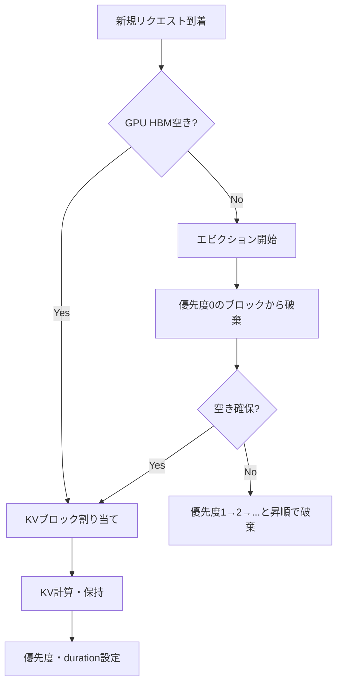

本記事は [Introducing New KV Cache Reuse Optimizations in NVIDIA TensorRT-LLM](https://developer.nvidia.com/blog/introducing-new-kv-cache-reuse-optimizations-in-nvidia-tensorrt-llm/) の解説記事です。

## ブログ概要（Summary）

NVIDIAが公開した本記事は、TensorRT-LLM推論フレームワークに新たに導入された2つのKVキャッシュ最適化機能を解説している。1つ目は優先度ベースのキャッシュエビクション（0-100のスケールでブロック保持優先度を設定）、2つ目はKVキャッシュイベント追跡API（キャッシュの作成・削除・更新をリアルタイムでストリーミング）である。NVIDIAの内部ベンチマークでは、優先度ベースエビクションによりキャッシュヒット率が約20%改善したと報告されている。

この記事は [Zenn記事: エージェントのプロンプトキャッシュ設計 — ツール定義と思考トークンを壊さない実装](https://zenn.dev/0h_n0/articles/37e71fbb85e1a6) の深掘りです。

## 情報源

- **種別**: 企業テックブログ
- **URL**: https://developer.nvidia.com/blog/introducing-new-kv-cache-reuse-optimizations-in-nvidia-tensorrt-llm/
- **組織**: NVIDIA（TensorRT-LLMチーム）
- **発表日**: 2025年

## 技術的背景（Technical Background）

LLMの推論において、KVキャッシュ（Key-Valueキャッシュ）はTransformerのSelf-Attention計算結果を保持するメモリ領域である。一度計算したトークンのKVを保持することで、以降のトークン生成時に再計算を省略できる。

しかし、GPU HBM（High Bandwidth Memory）の容量は限られており（例: A100で80GB、H100で80GB）、大規模モデルではKVキャッシュがメモリの大部分を占有する。従来のTensorRT-LLMでは、メモリ不足時にLRU（最も古く使われたもの）ベースでキャッシュを破棄していたが、以下の問題があった：

1. **システムプロンプトの意図しない破棄**: 全ユーザーが共有するシステムプロンプトのKVが、一時的なリクエストのKVより先に破棄される場合がある
2. **キャッシュ状態の不透明性**: どのKVブロックがどのGPU上に存在するかを外部から把握できない
3. **ルーティング非最適化**: ロードバランサがキャッシュ状態を考慮せず、キャッシュミスを誘発するルーティングを行う

### プロンプトキャッシュとの関連

エージェントシステムでは、ツール定義やシステムプロンプトのKVキャッシュを高優先度で保持し、一時的なtool_resultのKVを低優先度に設定することで、Zenn記事で解説されている「キャッシュフレンドリーなツール定義設計」をサーバ側から支援できる。

## 実装アーキテクチャ（Architecture）

### 優先度ベースKVキャッシュエビクション

TensorRT-LLMの新機能では、KVキャッシュブロックに0-100の優先度スケールと有効期間（duration）を設定できる。



**優先度設定の推奨パターン**:

| コンテンツタイプ | 推奨優先度 | duration | 理由 |
|:---:|:---:|:---:|:---:|
| システムプロンプト | 100 | 無制限 | 全ユーザー共有、再計算コスト大 |
| ツール定義 | 90 | 無制限 | エージェントセッション全体で固定 |
| 直近の会話コンテキスト | 50 | 5分 | ターン間で再利用される可能性が高い |
| 一時的なtool_result | 10 | 30秒 | 次ターンでのみ参照、以降は不要 |
| ワンショットリクエスト | 0 | 即時 | 再利用されない |

### API実装例

```python
import tensorrt_llm as trtllm

# 推論エンジンの設定
engine = trtllm.InferenceEngine(
    model_path="llama-3-70b-instruct",
    kv_cache_config=trtllm.KVCacheConfig(
        enable_priority_eviction=True,
        max_cache_size_gb=40,  # GPU HBMの50%をKVキャッシュに割り当て
    )
)

# システムプロンプトのKVを最高優先度で固定
system_prompt_request = engine.create_request(
    prompt=system_prompt_tokens,
    kv_cache_priority=100,      # 最高優先度
    kv_cache_duration=-1,        # 無制限保持
)

# ユーザーリクエスト（通常優先度）
user_request = engine.create_request(
    prompt=user_tokens,
    kv_cache_priority=50,
    kv_cache_duration=300,       # 5分後に優先度リセット
)

# tool_result（低優先度、短寿命）
tool_result_request = engine.create_request(
    prompt=tool_result_tokens,
    kv_cache_priority=10,
    kv_cache_duration=30,        # 30秒後に優先度リセット
)
```

### KVキャッシュイベントAPI

2つ目の機能であるイベントAPIは、KVキャッシュの状態変化をリアルタイムでストリーミングする仕組みである。

```python
# イベントバッファの設定
event_config = trtllm.KVCacheEventConfig(
    max_buffer_size=10000,  # 最大10,000イベントをバッファ
)

# イベントの非同期取得
async def monitor_kv_cache(engine):
    """KVキャッシュの状態変化をリアルタイム監視"""
    while True:
        events = await engine.get_kv_cache_events()
        for event in events:
            if event.type == "created":
                log_metric("kv_block_created", {
                    "block_id": event.block_id,
                    "token_range": event.token_range,
                    "priority": event.priority,
                })
            elif event.type == "removed":
                log_metric("kv_block_removed", {
                    "block_id": event.block_id,
                    "reason": event.reason,  # "eviction" or "explicit"
                })
            elif event.type == "updated":
                log_metric("kv_block_updated", {
                    "block_id": event.block_id,
                    "new_priority": event.new_priority,
                })
```

NVIDIAは「イベントAPIにより、KV-awareなルーティングとスケジューリングが複数エグゼキュータにまたがって実現可能になる」と述べている。これにより、ロードバランサは各GPUサーバ上のキャッシュ状態を把握し、キャッシュヒットが見込めるサーバへリクエストをルーティングできる。

## パフォーマンス最適化（Performance）

### 実測値

NVIDIAの内部ベンチマークによる報告値：

| メトリクス | 従来（LRUのみ） | 優先度エビクション | 改善率 |
|:---:|:---:|:---:|:---:|
| キャッシュヒット率 | ~65% | ~85% | +20pt |
| システムプロンプトKV保持率 | 72% | 99% | +27pt |

ただし、「結果はワークロードタイプにより異なる」と注記されている。特に、全リクエストが異なるシステムプロンプトを使用するケースでは、優先度制御の効果は限定的である。

### チューニングポイント

1. **優先度スケールの粒度**: 0-100の範囲を有効活用し、コンテンツタイプごとに明確な優先度帯を設定する
2. **duration設定**: TTL（Time To Live）として機能。マルチターン会話のターン間隔の統計値から設定
3. **イベントバッファサイズ**: 大きすぎるとメモリ消費、小さすぎるとイベント欠落。トラフィック量に応じて調整

## 運用での学び（Production Lessons）

### KV-awareルーティングの実装

イベントAPIを活用した本番環境でのルーティング戦略：

```python
class KVAwareRouter:
    """KVキャッシュ状態を考慮したリクエストルーター"""

    def __init__(self, executors: list[str]):
        self.executors = executors
        self.cache_state: dict[str, set[str]] = {e: set() for e in executors}

    def update_cache_state(self, executor_id: str, events: list) -> None:
        """イベントAPIから受信したイベントでキャッシュ状態を更新"""
        for event in events:
            if event.type == "created":
                self.cache_state[executor_id].add(event.prefix_hash)
            elif event.type == "removed":
                self.cache_state[executor_id].discard(event.prefix_hash)

    def route(self, request_prefix_hash: str) -> str:
        """キャッシュヒットが見込めるエグゼキュータを選択"""
        for executor_id, cached_prefixes in self.cache_state.items():
            if request_prefix_hash in cached_prefixes:
                return executor_id
        # キャッシュヒットなし: 最も空いているエグゼキュータへ
        return min(self.cache_state, key=lambda e: len(self.cache_state[e]))
```

### エージェントワークフローへの適用

Zenn記事で解説されている「安定性レイヤー設計」をTensorRT-LLMの優先度機能にマッピングすることで、サーバ側からもキャッシュ効率を最大化できる：

- **Layer 1（ツール定義）**: priority=100, duration=無制限 → 全セッションで共有
- **Layer 2（システムプロンプト）**: priority=90, duration=3600秒 → デプロイサイクルで更新
- **Layer 3（プロジェクトコンテキスト）**: priority=50, duration=300秒 → セッション固有
- **Layer 4（会話履歴）**: priority=30, duration=300秒 → ターン間で自動リフレッシュ

## 学術研究との関連（Academic Connection）

- **PagedAttention (vLLM, 2309.06180)**: TensorRT-LLMのページドKVキャッシュ管理の基盤。優先度エビクションはPagedAttentionのエビクションポリシーを拡張したもの
- **CachedAttention (2407.01219)**: CPU/GPUの階層管理アプローチ。TensorRT-LLMはGPU内のHBM管理に特化しているが、NVIDIA Dynamo（後続プロダクト）ではCPUオフロードも統合
- **ChunkAttention (2311.04934)**: プレフィックス共有のtrie管理。TensorRT-LLMのプレフィックスキャッシュ機能と概念的に共通

## Production Deployment Guide

### AWS実装パターン（コスト最適化重視）

TensorRT-LLMをAWS上にデプロイし、KV Cacheの優先度制御を活用する構成。

| 規模 | 推奨インスタンス | 月額コスト | GPU |
|------|:---:|:---:|:---:|
| **Small** | g5.xlarge | $535 On-Demand / ~$160 Spot | A10G 24GB |
| **Medium** | g5.2xlarge x2 | $2,000-3,500 | A10G 24GB x2 |
| **Large** | p4d.24xlarge | $10,000-15,000 | A100 80GB x8 |

**コスト試算の注意事項**: 上記は2026年5月時点のAWS ap-northeast-1リージョン料金に基づく概算値です。GPU Spot Instancesの価格は需給により大きく変動します。

### コスト最適化チェックリスト

- [ ] Spot Instances使用（g5ファミリーで最大70%削減）
- [ ] TensorRT-LLMの量子化（INT8/FP8）でメモリ効率向上
- [ ] 優先度ベースエビクションでシステムプロンプトKV保持率を99%に
- [ ] KVイベントAPIでキャッシュヒット率をリアルタイム監視
- [ ] KV-awareルーティングでクラスタ全体のキャッシュ効率最大化
- [ ] duration設定をワークロードのターン間隔統計に基づいて調整
- [ ] CloudWatchカスタムメトリクスでGPU HBM使用率を監視
- [ ] 夜間・低トラフィック帯のインスタンス台数縮退

## まとめと実践への示唆

NVIDIAのTensorRT-LLMに導入された優先度ベースKVキャッシュエビクションとイベント追跡APIは、自己ホスト型LLM推論サーバにおけるキャッシュ管理の粒度を大幅に向上させる。特にエージェントワークフローでは、ツール定義やシステムプロンプトを最高優先度で保持し、一時的なtool_resultを低優先度に設定することで、APIプロバイダのプロンプトキャッシュと同等のプレフィックス安定性をサーバ側から実現できる。キャッシュヒット率約20%改善という報告値は、大規模推論クラスタにおいて月額数千ドル規模のコスト削減に直結する。

## 参考文献

- **Blog URL**: https://developer.nvidia.com/blog/introducing-new-kv-cache-reuse-optimizations-in-nvidia-tensorrt-llm/
- **NVIDIA Dynamo**: https://developer.nvidia.com/dynamo
- **TensorRT-LLM Early Reuse**: https://developer.nvidia.com/blog/5x-faster-time-to-first-token-with-nvidia-tensorrt-llm-kv-cache-early-reuse/
- **Related Zenn article**: https://zenn.dev/0h_n0/articles/37e71fbb85e1a6
