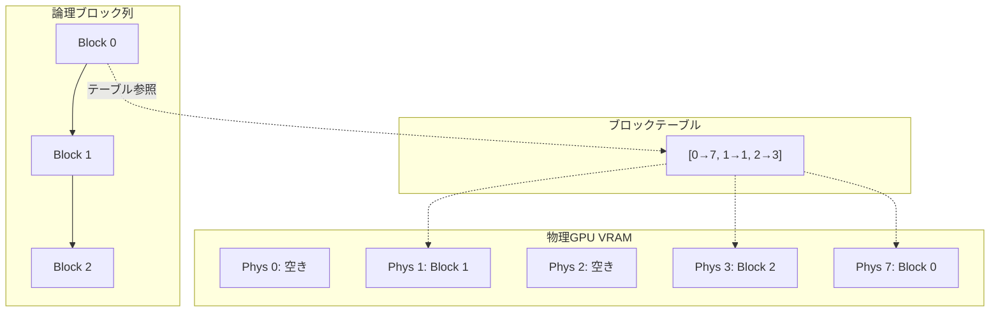

本記事は [Efficient Memory Management for Large Language Model Serving with PagedAttention](https://arxiv.org/abs/2309.06180)（SOSP 2023）の解説記事です。

## 論文概要（Abstract）

LLM推論においてGPU VRAMの60〜80%はKV（Key-Value）キャッシュに消費されるが、既存システムでは内部断片化・外部断片化・予約の過剰確保によりVRAMの最大60%が無駄になっていた。著者らはOSの仮想メモリとページングの概念をGPU KVキャッシュ管理に適用した**PagedAttention**アルゴリズムを提案し、これを実装したLLMサービングシステム**vLLM**を構築した。

この記事は [Zenn記事: Ollama v0.24×Docker Composeで構築するオンプレLLM推論基盤の実践ガイド](https://zenn.dev/0h_n0/articles/dfcfed8523c1e3) の深掘りです。

## 情報源

- **arXiv ID**: 2309.06180
- **URL**: [https://arxiv.org/abs/2309.06180](https://arxiv.org/abs/2309.06180)
- **著者**: Woosuk Kwon, Zhuohan Li, Siyuan Zhuang, et al.（UC Berkeley, Stanford University）
- **発表年**: 2023（SOSP 2023 採択）
- **分野**: cs.CL, cs.LG, cs.DC

## 背景と動機（Background & Motivation）

LLMの推論処理では、Transformerの各層がAttention計算のためにKey-Valueテンソルを保持する。たとえばLLaMA-13Bでは、1リクエストあたり最大1.7GBのKVキャッシュが必要となる。従来のシステム（FasterTransformer、Orcaなど）はリクエストごとに最大シーケンス長分のVRAMを事前確保していたため、以下の3つの無駄が生じていた。

1. **内部断片化**: 実際の生成長が最大長より短い場合、確保済みVRAMの大部分が未使用のまま残る
2. **外部断片化**: リクエスト間でVRAM領域が断片化し、連続した空き領域がなければ新リクエストを受け付けられない
3. **予約の過剰確保**: beam searchやparallel samplingで複数候補を生成する場合、各候補に独立したKVキャッシュ領域を確保していた

著者らはこの非効率がLLMサービングのスループットを制限する主要因であると指摘している。

## 主要な貢献（Key Contributions）

- **PagedAttentionアルゴリズム**: KVキャッシュを固定サイズのブロック（物理ページ）に分割し、ブロックテーブルによる間接参照で論理的に連続なKVキャッシュを非連続な物理メモリ上に配置できるようにした
- **vLLMシステム**: PagedAttentionを中核に据えたLLMサービングエンジン。OpenAI互換APIを提供し、Docker環境で即座にデプロイ可能
- **Copy-on-Write機構**: beam searchやparallel samplingにおいて、共通のプレフィックス部分のKVキャッシュを複数シーケンスで物理的に共有し、分岐時のみコピーする

## 技術的詳細（Technical Details）

### PagedAttentionのメモリ管理

従来のAttention計算では、KVキャッシュはリクエストごとに連続したGPUメモリ上に配置されていた。PagedAttentionではこの制約を撤廃し、OSのページテーブルと同様のブロックテーブルを導入する。



各ブロックは$B$トークン分のKVテンソルを格納する（論文のデフォルトでは$B = 16$）。Attentionスコアの計算式は以下のようにブロック単位に分解される。

$$
A_j = \frac{\exp(q^T K_j / \sqrt{d})}{\sum_{i=1}^{\lceil t/B \rceil} \exp(q^T K_i \mathbf{1} / \sqrt{d})} V_j
$$

ここで、
- $q$: クエリベクトル（現在のデコードステップ）
- $K_j, V_j$: $j$番目の物理ブロックに格納されたKey/Value行列（形状: $B \times d$）
- $d$: ヘッドの次元数
- $t$: 現在のシーケンス長
- $B$: ブロックサイズ（トークン数）

各ブロックのAttentionスコアは独立に計算され、最終的にブロック間でrescalingして統合される。この分解により、物理的に非連続なメモリ上のKVキャッシュに対しても正確なAttention計算が可能になる。

### ブロック単位のメモリ割り当てアルゴリズム

```python
class BlockAllocator:
    """KVキャッシュのブロック単位アロケータ（論文のアルゴリズムを簡略化）"""

    def __init__(self, num_blocks: int, block_size: int):
        self.block_size = block_size
        self.free_blocks: list[int] = list(range(num_blocks))
        self.ref_count: dict[int, int] = {}

    def allocate(self) -> int:
        """空き物理ブロックを1つ割り当てる"""
        if not self.free_blocks:
            raise MemoryError("GPU VRAM exhausted: no free blocks")
        block_id = self.free_blocks.pop()
        self.ref_count[block_id] = 1
        return block_id

    def free(self, block_id: int) -> None:
        """参照カウントを減らし、0になったら解放"""
        self.ref_count[block_id] -= 1
        if self.ref_count[block_id] == 0:
            self.free_blocks.append(block_id)
            del self.ref_count[block_id]

    def copy_on_write(self, block_id: int) -> int:
        """共有ブロックの書き込み時コピー"""
        if self.ref_count[block_id] == 1:
            return block_id
        new_block = self.allocate()
        # GPU上でブロックデータをコピー
        self.ref_count[block_id] -= 1
        return new_block
```

このアロケータにより、新しいトークンが生成されるたびに必要な分だけブロックを割り当てる「遅延割り当て」が実現される。従来の「最大長分を事前確保」する方式と比較して、VRAMの無駄を排除できる。

### KVキャッシュのスワッピング

GPU VRAMが逼迫した場合、優先度の低いリクエストのKVキャッシュをCPUメモリに退避（スワップアウト）する。GPUに空きが生じたらスワップインして推論を再開する。このスワッピングもブロック単位で行われるため、連続メモリの確保が不要である。

## 実験結果（Results）

### スループット比較

著者らはShareGPTの会話データとAlpacaデータセットを用いて評価を行っている。論文Table 3・Figure 11より、以下の結果が報告されている。

| モデル | ベースライン | vLLM | 改善倍率 |
|---|---|---|---|
| OPT-13B (ShareGPT) | FasterTransformer: 8.3 req/s | 17.6 req/s | 2.1x |
| OPT-13B (Alpaca) | FasterTransformer: 16.4 req/s | 23.7 req/s | 1.4x |
| LLaMA-13B (ShareGPT) | Orca: 5.6 req/s | 13.4 req/s | 2.4x |
| OPT-175B (ShareGPT) | FasterTransformer: 1.2 req/s | 2.7 req/s | 2.2x |

### メモリ効率

論文Figure 9より、PagedAttentionは従来システムと比較してKVキャッシュのメモリ浪費を以下のように削減したと報告されている。

- **内部断片化**: 最大ブロックサイズ分（$B$トークン分）に制限。$B=16$の場合、最悪でも16トークン分の無駄
- **外部断片化**: ゼロ（非連続配置が可能なため）
- **共有効率**: beam search（beam width=4）でKVキャッシュメモリ使用量が最大55%削減

### 同時処理能力

論文のFigure 12によると、A100-40GBでOPT-13Bを実行した場合、同時処理可能なリクエスト数が従来比で最大2〜5倍に改善された。これはVRAMの有効利用率が向上したことによる。

## 実装のポイント（Implementation）

### vLLMの導入

vLLMはPyPI経由でインストール可能であり、OpenAI互換APIサーバーとして起動できる。

```bash
pip install vllm
python -m vllm.entrypoints.openai.api_server \
  --model meta-llama/Llama-3.1-8B \
  --gpu-memory-utilization 0.9 \
  --max-model-len 4096 \
  --block-size 16
```

### Ollamaとの関係

Ollama v0.24は内部的にllama.cppの推論エンジンを使用しており、vLLMのPagedAttentionとは異なるKVキャッシュ管理を行っている。ただし、llama.cppも2024年以降にブロック単位のKVキャッシュ管理を部分的に取り入れている。Docker Compose構成でOllamaの代わりにvLLMを使う場合、以下のように置き換えが可能である。

```yaml
services:
  vllm-1:
    image: vllm/vllm-openai:latest
    deploy:
      resources:
        reservations:
          devices:
            - driver: nvidia
              device_ids: ["0"]
              capabilities: [gpu]
    environment:
      - CUDA_VISIBLE_DEVICES=0
    command: >
      --model meta-llama/Llama-3.1-8B-Instruct
      --gpu-memory-utilization 0.9
      --block-size 16
      --enable-prefix-caching
    ports:
      - "8000:8000"
```

### チューニングパラメータ

論文の実験に基づく推奨設定値を以下に示す。

| パラメータ | 推奨値 | 根拠 |
|---|---|---|
| `block-size` | 16 | 論文のデフォルト値。小さすぎるとテーブル管理オーバーヘッド増、大きすぎると内部断片化増 |
| `gpu-memory-utilization` | 0.85〜0.95 | KVキャッシュに割り当てるVRAM比率。0.9が多くのケースで最適 |
| `max-num-seqs` | 256 | 同時処理リクエスト上限。VRAM容量に依存 |
| `swap-space` | 4 (GB) | CPUスワップ領域。VRAMの50%程度を推奨 |

## 実運用への応用（Practical Applications）

Zenn記事で紹介されているDocker Compose + Nginx構成にPagedAttentionの知見を適用する場合、以下の戦略が有効である。

1. **VRAMバジェットの精密管理**: `OLLAMA_MAX_LOADED_MODELS`の設定値をPagedAttentionの知見に基づいて最適化する。具体的には、モデルの重み + KVキャッシュ（$n_\text{layers} \times 2 \times B \times d \times n_\text{seqs}$バイト）の合計がVRAM容量の90%以内に収まるように設定する
2. **プレフィックスキャッシュの活用**: システムプロンプトが固定の場合、KVキャッシュの再計算を回避できる。vLLMの`--enable-prefix-caching`フラグに相当する最適化がOllamaでは`OLLAMA_KEEP_ALIVE`設定で部分的に実現される
3. **スワッピング戦略**: GPUメモリが不足する場合、低優先度リクエストのKVキャッシュをCPUに退避する仕組みを検討する

## 関連研究（Related Work）

- **Orca**（Yu et al., 2022）: 連続バッチング（continuous batching）を導入し、リクエスト完了のたびにバッチを再構成する手法を提案した。vLLMはOrcaの連続バッチングを前提に、メモリ管理層でPagedAttentionを追加している
- **FlashAttention**（Dao et al., 2022）: Attention計算自体のGPU最適化（タイリング、カーネルフュージョン）を実現した。PagedAttentionとFlashAttentionは相補的であり、vLLMでは両方を組み合わせて使用する
- **FlexGen**（Sheng et al., 2023）: シングルGPUで大規模モデルを実行するためにCPU/ディスクオフロードを活用する手法。リアルタイム推論ではなくバッチスループット最大化が目的であり、PagedAttentionとは異なるユースケースを対象としている

## まとめと今後の展望

PagedAttentionは、LLM推論におけるGPU VRAMの利用効率を抜本的に改善する手法である。OSのページング機構という成熟した概念をGPUメモリ管理に転用することで、内部・外部断片化を排除し、同一ハードウェアでのスループットを2〜2.4倍に向上させた。

Ollamaを含むオンプレLLM推論基盤を構築する際には、KVキャッシュのメモリ管理がスループットのボトルネックになる点を理解し、`gpu-memory-utilization`やブロックサイズの設定を適切に調整することが重要である。今後はマルチノード環境でのKVキャッシュ共有や、異種GPU間でのメモリ管理統合が研究課題として残されている。

## 参考文献

- **arXiv**: [https://arxiv.org/abs/2309.06180](https://arxiv.org/abs/2309.06180)
- **Code**: [https://github.com/vllm-project/vllm](https://github.com/vllm-project/vllm)（Apache 2.0ライセンス）
- **Related Zenn article**: [https://zenn.dev/0h_n0/articles/dfcfed8523c1e3](https://zenn.dev/0h_n0/articles/dfcfed8523c1e3)
- Kwon, W., Li, Z., Zhuang, S., et al. "Efficient Memory Management for Large Language Model Serving with PagedAttention." SOSP 2023.
- Yu, G., et al. "Orca: A Distributed Serving System for Transformer-Based Generative Models." OSDI 2022.
- Dao, T., et al. "FlashAttention: Fast and Memory-Efficient Exact Attention with IO-Awareness." NeurIPS 2022.

---

:::message
本記事はAI（Claude Code）により自動生成されました。論文の内容を正確に伝えることを目的としていますが、解釈の誤りがある可能性があります。正確な情報は[原論文](https://arxiv.org/abs/2309.06180)をご確認ください。
:::
