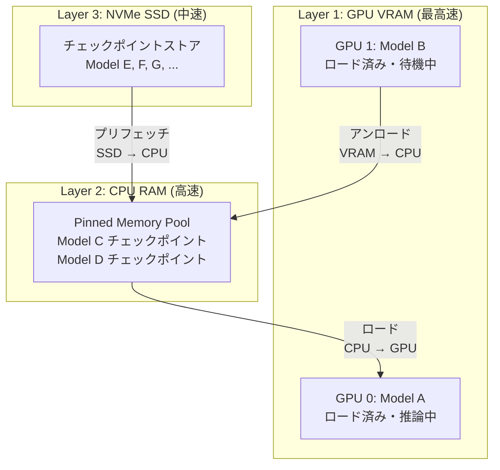

本記事は [ServerlessLLM: Low-Latency Serverless Inference for Large Language Models](https://arxiv.org/abs/2402.16363) の解説記事です。

## 論文概要（Abstract）

LLMサービングにおいて、モデルの切り替え（ロード/アンロード）はコールドスタート問題を引き起こす。LLaMA-2-70Bのチェックポイント読み込みには従来60秒以上を要し、これがスケーラビリティの障壁となっている。著者らは、GPU VRAM → CPU RAM → NVMe SSDの3層ストレージ階層を活用し、チェックポイントのローカリティを最大化する**ServerlessLLM**を提案している。LLaMA-2-70Bのロード時間をvLLM比で最大10倍高速化すると報告されている。

この記事は [Zenn記事: Ollama v0.24×Docker Composeで構築するオンプレLLM推論基盤の実践ガイド](https://zenn.dev/0h_n0/articles/dfcfed8523c1e3) の深掘りです。

## 情報源

- **arXiv ID**: 2402.16363
- **URL**: [https://arxiv.org/abs/2402.16363](https://arxiv.org/abs/2402.16363)
- **著者**: Yao Fu, Leyang Xue, Yeqi Huang, et al.（University of Edinburgh）
- **発表年**: 2024（OSDI 2024 採択）
- **分野**: cs.DC, cs.LG

## 背景と動機（Background & Motivation）

Docker Compose環境でOllamaを運用する場合、新しいモデルの初回ロードや、`OLLAMA_MAX_LOADED_MODELS`を超えたモデルの再ロードにはチェックポイントの読み込みが必要となる。このモデルロード時間がユーザー体験に直接影響する。

従来のLLMサービングシステムでのモデルロード時間（著者らの計測に基づく）:

| モデルサイズ | ストレージ | ロード時間 |
|---|---|---|
| 7B (FP16, ~14GB) | NVMe SSD | ~8秒 |
| 13B (FP16, ~26GB) | NVMe SSD | ~15秒 |
| 70B (FP16, ~140GB) | NVMe SSD | ~65秒 |
| 7B (FP16, ~14GB) | HDD | ~45秒 |

著者らはこのロード時間のボトルネックが「ストレージI/Oの非効率」にあると指摘している。具体的には、Hugging Face transformersのデフォルトのチェックポイントローダーは逐次的にファイルを読み込むため、NVMe SSDの並列読み込み帯域を十分に活用できていない。

## 主要な貢献（Key Contributions）

- **3層ストレージ階層の活用**: GPU VRAM、CPU RAM（pin memory）、NVMe SSDの3層にモデルチェックポイントを分散配置し、ロード時間を最小化する
- **チャンク化並列ローダー**: チェックポイントファイルを固定サイズチャンクに分割し、複数I/Oスレッドで並列読み込みする
- **ローカリティ優先スケジューラ**: モデルのチェックポイントが既にキャッシュされているサーバーに優先的にリクエストをルーティングする
- **ライブマイグレーション**: モデルをGPU間で推論を停止せずに移送する機構

## 技術的詳細（Technical Details）

### 3層ストレージ階層

ServerlessLLMは以下の3層にモデルデータを配置する。



各層間の転送帯域は以下のとおりである（著者らの測定値に基づく）。

| 転送パス | 帯域 | 70Bモデル転送時間 |
|---|---|---|
| GPU VRAM ↔ GPU VRAM (NVLink) | ~600 GB/s | ~0.2秒 |
| CPU RAM → GPU VRAM (PCIe 4.0 x16) | ~25 GB/s | ~5.6秒 |
| NVMe SSD → CPU RAM (直接I/O) | ~6 GB/s | ~23秒 |
| HDD → CPU RAM | ~0.2 GB/s | ~700秒 |

### チャンク化並列ローダー

従来のPyTorchチェックポイントローダーは`torch.load()`を逐次的に呼び出す。ServerlessLLMはチェックポイントファイルをチャンクに分割し、複数スレッドで並列読み込みする。

```python
import asyncio
import os
from concurrent.futures import ThreadPoolExecutor

CHUNK_SIZE = 64 * 1024 * 1024  # 64MB chunks


async def parallel_load_checkpoint(
    filepath: str,
    num_workers: int = 8,
) -> bytes:
    """チェックポイントファイルを並列チャンク読み込み

    Args:
        filepath: チェックポイントファイルパス
        num_workers: I/Oワーカースレッド数

    Returns:
        読み込まれたバイト列
    """
    file_size = os.path.getsize(filepath)
    chunks: list[tuple[int, int]] = []
    offset = 0
    while offset < file_size:
        end = min(offset + CHUNK_SIZE, file_size)
        chunks.append((offset, end))
        offset = end

    loop = asyncio.get_event_loop()
    executor = ThreadPoolExecutor(max_workers=num_workers)

    def read_chunk(start: int, end: int) -> bytes:
        with open(filepath, "rb") as f:
            f.seek(start)
            return f.read(end - start)

    tasks = [
        loop.run_in_executor(executor, read_chunk, start, end)
        for start, end in chunks
    ]
    results = await asyncio.gather(*tasks)
    return b"".join(results)
```

### ピンメモリを使ったCPU→GPU転送の高速化

通常のCPU→GPU転送ではOSのページフォルトとコピーが発生する。ServerlessLLMはPyTorchの`pin_memory()`を活用し、DMA（Direct Memory Access）による直接転送を実現する。

$$
T_{\text{load}} = \frac{S_{\text{model}}}{BW_{\text{pin}}} + T_{\text{init}}
$$

ここで、
- $S_{\text{model}}$: モデルサイズ（バイト）
- $BW_{\text{pin}}$: ピンメモリ経由の転送帯域（PCIe 4.0 x16で約25 GB/s）
- $T_{\text{init}}$: モデル初期化時間（バッファ確保、設定読み込み等）

通常メモリ経由では帯域が約8 GB/sに低下する（ページフォルトのオーバーヘッド）。ピンメモリの使用により約3倍の高速化が得られると著者らは報告している。

### ローカリティ優先スケジューラ

新規リクエストが到着した際、スケジューラは以下の優先順位でサーバーを選択する。

1. **GPU VRAM上にモデルがロード済み**: 追加ロード不要（コールドスタートゼロ）
2. **CPU RAM上にチェックポイントがキャッシュ済み**: GPU VRAMへの転送のみ必要
3. **同一ホストのNVMe上にチェックポイントが存在**: SSD→CPU→GPU の2段転送
4. **リモートホストからの転送が必要**: ネットワーク経由でチェックポイントを取得

```python
def select_server(
    model_id: str,
    servers: list[dict],
) -> dict:
    """ローカリティ優先でサーバーを選択

    Args:
        model_id: ロード対象モデルID
        servers: サーバー状態のリスト

    Returns:
        選択されたサーバー情報
    """
    # Priority 1: GPU上にロード済み
    for s in servers:
        if model_id in s["gpu_loaded_models"]:
            return s

    # Priority 2: CPU RAMにキャッシュ済み
    for s in servers:
        if model_id in s["cpu_cached_models"]:
            return s

    # Priority 3: ローカルSSDに存在
    for s in servers:
        if model_id in s["ssd_stored_models"]:
            return s

    # Priority 4: 最も負荷が低いサーバー（リモート転送必要）
    return min(servers, key=lambda s: s["load_score"])
```

## 実験結果（Results）

### モデルロード時間の比較

論文Table 2より、A100-80GB + NVMe SSD環境での結果が報告されている。

| モデル | vLLM | ServerlessLLM | 改善倍率 |
|---|---|---|---|
| OPT-6.7B | 4.2秒 | 0.8秒 | 5.3x |
| LLaMA-2-13B | 12.1秒 | 1.8秒 | 6.7x |
| OPT-30B | 28.5秒 | 3.9秒 | 7.3x |
| LLaMA-2-70B | 65.3秒 | 6.5秒 | 10.0x |

### スループットの改善

論文Figure 8より、モデル切り替えが頻繁に発生するワークロード（10モデルをランダムに要求）で以下のスループット改善が報告されている。

| システム | スループット (req/s) | P99 TTFT |
|---|---|---|
| vLLM | 2.1 | 68秒 |
| ServerlessLLM | 8.4 | 7.2秒 |

### ストレージ種別の影響

論文Figure 10より、ストレージ種別がロード性能に与える影響が報告されている。

| ストレージ | 読み取り帯域 | 70Bモデルのロード時間 |
|---|---|---|
| NVMe SSD (Gen4) | 6.8 GB/s | 6.5秒 |
| SATA SSD | 0.5 GB/s | 42秒 |
| HDD (7200rpm) | 0.15 GB/s | 180秒 |

NVMe SSDの使用が前提条件であり、HDD環境ではServerlessLLMの利点がほぼ失われる。

## 実装のポイント（Implementation）

### Ollamaへの適用

Ollama v0.24はモデルのロード/アンロードを自動管理する（`OLLAMA_KEEP_ALIVE`設定）。ServerlessLLMの知見をOllama環境に適用する場合、以下の最適化が考えられる。

**1. NVMe SSDへのモデル配置**

```bash
# Ollamaのモデルストレージ先をNVMe SSDに変更
# docker-compose.yml
volumes:
  ollama-models:
    driver: local
    driver_opts:
      type: none
      o: bind
      device: /mnt/nvme/ollama-models  # NVMe SSD上のパス
```

**2. CPU RAMのプリフェッチ**

Ollamaは`OLLAMA_KEEP_ALIVE=24h`でモデルをGPU VRAMに保持するが、VRAM不足時にアンロードされる。アンロードされたモデルのチェックポイントをLinuxのページキャッシュに保持するため、十分なCPU RAMの確保が重要である。

```bash
# カーネルのページキャッシュ設定（LinuxのVM tuning）
echo 80 > /proc/sys/vm/vfs_cache_pressure  # デフォルト100、下げるとキャッシュ保持率向上
echo 10 > /proc/sys/vm/dirty_ratio          # 書き込みバッファ制限
```

**3. Docker volumeのinode設定**

大量のモデルファイルを扱う場合、ext4ファイルシステムのinode枯渇に注意する。

### Docker Compose構成でのベストプラクティス

```yaml
services:
  ollama-1:
    image: ollama/ollama:0.24.0
    volumes:
      # NVMe SSD上の共有モデルストレージ
      - type: bind
        source: /mnt/nvme/ollama-models
        target: /root/.ollama
    environment:
      - OLLAMA_KEEP_ALIVE=24h
      - OLLAMA_MAX_LOADED_MODELS=2
      - OLLAMA_FLASH_ATTENTION=1
    deploy:
      resources:
        reservations:
          devices:
            - driver: nvidia
              device_ids: ["0"]
              capabilities: [gpu]
        limits:
          memory: 32G  # CPU RAMの制限（ページキャッシュ用に十分確保）
    shm_size: "4g"      # 共有メモリ（モデルロード時のバッファ用）
```

## 実運用への応用（Practical Applications）

1. **モデル切り替えの高速化**: 複数モデル（Code用7B、Chat用13B、翻訳用7B等）を切り替えて使う環境で、コールドスタートレイテンシを大幅に削減できる
2. **ストレージ選定**: ServerlessLLMの知見に基づき、オンプレ推論基盤ではNVMe SSD（PCIe Gen4以上）をモデルストレージに使用することを推奨する。コスト面ではNVMe 2TBが約2万円で入手可能
3. **CPU RAM設計**: モデルのプリフェッチ用として、最大モデルサイズの2倍以上のCPU RAMを確保する。70Bモデル（FP16: 140GB）を運用する場合、最低256GBのRAMが推奨される

## 関連研究（Related Work）

- **vLLM**（Kwon et al., 2023）: PagedAttentionでKVキャッシュ管理を最適化したが、モデルロード自体の高速化は対象外。ServerlessLLMはvLLMと組み合わせて使用可能
- **FlexGen**（Sheng et al., 2023）: CPU/ディスクへのオフロードでシングルGPUでの大規模モデル実行を実現した。ServerlessLLMはオフロードではなくロード時間そのものの最適化に焦点を当てている
- **AlpaServe**（Li et al., 2023）: モデルパラレリズムの動的調整でマルチテナント推論の効率を改善する手法。ServerlessLLMのローカリティスケジューラと相補的

## まとめと今後の展望

ServerlessLLMは、LLMのモデルロード時間をストレージ階層の最適活用で最大10倍高速化する手法である。3層ストレージ（GPU VRAM → CPU RAM → NVMe SSD）のローカリティを最大化することで、コールドスタート問題を実用的な水準にまで改善している。

Docker Compose環境でのOllama運用においては、NVMe SSDの使用、十分なCPU RAMの確保、`OLLAMA_KEEP_ALIVE`の適切な設定が、ServerlessLLMの知見を活かした最も実践的な最適化となる。多数のモデルを頻繁に切り替える運用では、チェックポイントのプリフェッチ戦略の導入を検討する価値がある。

## 参考文献

- **arXiv**: [https://arxiv.org/abs/2402.16363](https://arxiv.org/abs/2402.16363)
- **Code**: [https://github.com/ServerlessLLM/ServerlessLLM](https://github.com/ServerlessLLM/ServerlessLLM)（Apache 2.0ライセンス）
- **Related Zenn article**: [https://zenn.dev/0h_n0/articles/dfcfed8523c1e3](https://zenn.dev/0h_n0/articles/dfcfed8523c1e3)
- Fu, Y., Xue, L., Huang, Y., et al. "ServerlessLLM: Low-Latency Serverless Inference for Large Language Models." OSDI 2024.
- Kwon, W., et al. "Efficient Memory Management for Large Language Model Serving with PagedAttention." SOSP 2023.
- Sheng, Y., et al. "FlexGen: High-Throughput Generative Inference of Large Language Models with a Single GPU." ICML 2023.

---

:::message
本記事はAI（Claude Code）により自動生成されました。論文の内容を正確に伝えることを目的としていますが、解釈の誤りがある可能性があります。正確な情報は[原論文](https://arxiv.org/abs/2402.16363)をご確認ください。
:::
