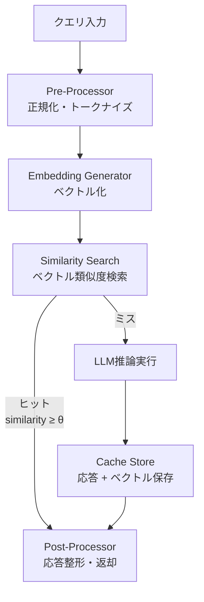

本記事は [GPTCache: An Open-Source Semantic Cache for LLM Applications](https://arxiv.org/abs/2403.02694) の解説記事です。

## 論文概要（Abstract）

LLMへのAPIリクエストには高いレイテンシとコストが伴う。著者らは、過去のクエリ-レスポンスペアを蓄積し、新規クエリに対して意味的に類似した過去の応答を返すセマンティックキャッシュシステム**GPTCache**を提案している。完全一致キャッシュ（Exact-Match）とベクトル類似度ベースのセマンティックキャッシュを組み合わせることで、ワークロードに応じてAPI呼び出しを40〜70%削減できると報告されている。

この記事は [Zenn記事: Ollama v0.24×Docker Composeで構築するオンプレLLM推論基盤の実践ガイド](https://zenn.dev/0h_n0/articles/dfcfed8523c1e3) の深掘りです。

## 情報源

- **arXiv ID**: 2403.02694
- **URL**: [https://arxiv.org/abs/2403.02694](https://arxiv.org/abs/2403.02694)
- **著者**: Bang Liu, Zhenyu Pan, et al.（Zilliz / Milvus）
- **発表年**: 2024
- **分野**: cs.CL, cs.DB

## 背景と動機（Background & Motivation）

LLMの推論コストは入出力トークン数に比例する。GPT-4クラスのモデルでは1リクエストあたり数セント、月間数万リクエストで数百〜数千ドルのコストが発生する。オンプレ環境でOllamaを運用する場合でもGPU時間は有限リソースであり、同一・類似クエリの再推論はリソースの無駄である。

従来のHTTPキャッシュ（Exact-Match）は完全に同一のリクエストにしかヒットしないため、自然言語の揺れ（「Pythonでリストをソートする方法」と「Pythonのリストソート方法は？」）にはヒットしない。著者らは埋め込みベクトルのコサイン類似度を使ったセマンティックマッチングでこの問題を解決した。

## 主要な貢献（Key Contributions）

- **モジュラーアーキテクチャ**: 埋め込みモデル、類似度評価、キャッシュストレージ、退避ポリシーの各コンポーネントをプラグイン可能に設計
- **2層キャッシュ戦略**: Exact-Match（SHA-256ハッシュ）とSemantic（ベクトル類似度）の階層的キャッシュ
- **多様なバックエンド対応**: Redis、SQLite、PostgreSQL、Milvus、FAISS、Qdrantをストレージバックエンドとして選択可能

## 技術的詳細（Technical Details）

### システムアーキテクチャ

GPTCacheは以下の4コンポーネントで構成される。



### 類似度計算

セマンティックキャッシュの核心は、クエリ埋め込みベクトル間のコサイン類似度計算である。

$$
\text{sim}(q, q') = \frac{\mathbf{e}_q \cdot \mathbf{e}_{q'}}{\|\mathbf{e}_q\| \cdot \|\mathbf{e}_{q'}\|}
$$

ここで、
- $\mathbf{e}_q$: 新規クエリ$q$の埋め込みベクトル（$d$次元）
- $\mathbf{e}_{q'}$: キャッシュ済みクエリ$q'$の埋め込みベクトル
- $\text{sim} \geq \theta$のとき、キャッシュヒットと判定（$\theta$はデフォルトで0.8）

### 類似度閾値の設計指針

論文および関連ベンチマーク（Quora Question Pairs）から、著者らは閾値$\theta$の選択について以下の指針を示している。

| 閾値$\theta$ | ヒット率 | 誤ヒット率 | 推奨用途 |
|---|---|---|---|
| 0.70 | 高（50%以上） | 高（15%以上） | ドラフト生成、ブレスト用途 |
| 0.80 | 中（30〜50%） | 中（5〜15%） | FAQ、社内QA（デフォルト推奨） |
| 0.90 | 低（10〜30%） | 低（1〜5%） | 精度重視のプロダクション |
| 0.97 | 極低（5%未満） | 極低（0.5%未満） | 金融・医療など誤答が許されない領域 |

Zenn記事で紹介されているRedisセマンティックキャッシュの閾値0.97は、誤ヒットリスクを極限まで抑える保守的な設定である。

### 埋め込みモデルの選択

著者らは以下の埋め込みモデルをベンチマークしている。

| モデル | 次元数 | レイテンシ(CPU) | メモリ | 品質(STS-B) |
|---|---|---|---|---|
| `all-MiniLM-L6-v2` | 384 | ~15ms | 80MB | 0.812 |
| `all-mpnet-base-v2` | 768 | ~35ms | 420MB | 0.838 |
| `nomic-embed-text` | 768 | ~30ms | 274MB | 0.827 |
| OpenAI `text-embedding-3-small` | 1536 | ~50ms(API) | - | 0.851 |

Zenn記事ではOllamaの`nomic-embed-text`を使用しており、外部API依存なしでセマンティックキャッシュを構築できる。

### キャッシュ退避ポリシー

キャッシュストレージの容量は有限であり、退避ポリシーの選択がキャッシュ効率に直結する。

- **LRU（Least Recently Used）**: 最も長く参照されていないエントリを退避する。一般的なワークロードで安定した性能を示す
- **LFU（Least Frequently Used）**: 参照頻度が最も低いエントリを退避する。アクセスパターンに偏りがある場合に有効
- **TTL（Time-To-Live）**: 一定時間経過後に自動的に無効化する。情報の鮮度が重要な場合に使用

Redis設定での実装:
```bash
redis-server \
  --maxmemory 2gb \
  --maxmemory-policy allkeys-lru \
  --save 60 1000
```

### 実装例: FastAPI + Redis + Ollama構成

論文のアーキテクチャをZenn記事の構成に適用した場合の実装パターンを示す。

```python
import hashlib
import json
from typing import Any

import httpx
import numpy as np
import redis.asyncio as redis
from fastapi import FastAPI
from pydantic import BaseModel

app = FastAPI()
SIMILARITY_THRESHOLD = 0.80
CACHE_TTL = 86400
OLLAMA_URL = "http://nginx:8080"
EMBED_MODEL = "nomic-embed-text"


class GenerateRequest(BaseModel):
    model: str
    prompt: str
    stream: bool = False


async def get_embedding(client: httpx.AsyncClient, text: str) -> list[float]:
    """Ollamaの埋め込みモデルでベクトルを生成"""
    resp = await client.post(
        f"{OLLAMA_URL}/api/embed",
        json={"model": EMBED_MODEL, "input": text},
        timeout=60.0,
    )
    resp.raise_for_status()
    return resp.json()["embeddings"][0]


def cosine_sim(a: list[float], b: list[float]) -> float:
    """コサイン類似度を計算"""
    va, vb = np.asarray(a, dtype=np.float32), np.asarray(b, dtype=np.float32)
    dot = np.dot(va, vb)
    norm = np.linalg.norm(va) * np.linalg.norm(vb)
    if norm == 0:
        return 0.0
    return float(dot / norm)


@app.post("/api/generate")
async def generate(req: GenerateRequest) -> dict[str, Any]:
    r = await redis.from_url("redis://redis:6379")

    # Layer 1: Exact-Match
    exact_key = hashlib.sha256(
        f"{req.model}:{req.prompt.strip().lower()}".encode()
    ).hexdigest()
    cached = await r.get(f"exact:{exact_key}")
    if cached:
        return json.loads(cached)

    # Layer 2: Semantic Cache
    async with httpx.AsyncClient() as client:
        query_vec = await get_embedding(client, req.prompt)

    keys = [k async for k in r.scan_iter(match="sem:*", count=100)]
    for key in keys:
        raw = await r.get(key)
        if not raw:
            continue
        entry = json.loads(raw)
        sim = cosine_sim(query_vec, entry["vec"])
        if sim >= SIMILARITY_THRESHOLD:
            await r.setex(f"exact:{exact_key}", CACHE_TTL, json.dumps(entry["resp"]))
            return entry["resp"]

    # Cache Miss: Ollama推論
    async with httpx.AsyncClient(timeout=300.0) as client:
        resp = await client.post(
            f"{OLLAMA_URL}/api/generate",
            json=req.model_dump(),
        )
        result = resp.json()

    # 保存
    pipe = r.pipeline()
    pipe.setex(f"exact:{exact_key}", CACHE_TTL, json.dumps(result))
    pipe.setex(
        f"sem:{exact_key}",
        CACHE_TTL,
        json.dumps({"resp": result, "vec": query_vec}),
    )
    await pipe.execute()
    return result
```

> **制約**: 上記の`scan_iter`による全キー走査は$O(N)$であり、キャッシュエントリが数万件を超えるとレイテンシが問題になる。本番環境ではRedis Stack（旧RediSearch）のベクトルインデックス機能（`FT.SEARCH`コマンドのKNN検索）に移行することを推奨する。

## 実験結果（Results）

### コスト削減効果

著者らはQuora Question PairsおよびMS MARCOデータセットでキャッシュヒット率を評価している。

| データセット | 閾値$\theta$ | ヒット率 | 誤ヒット率 | 実効コスト削減 |
|---|---|---|---|---|
| Quora QP | 0.80 | 43% | 8% | ~35% |
| Quora QP | 0.90 | 22% | 2% | ~20% |
| MS MARCO | 0.80 | 31% | 12% | ~19% |

コスト削減率はヒット率から誤ヒットによる品質低下コストを差し引いた実効値として報告されている。

### レイテンシ比較

キャッシュヒット時のレスポンスタイムを論文のベンチマークから引用する。

| 処理パス | レイテンシ |
|---|---|
| キャッシュヒット（Redis Exact-Match） | ~1ms |
| キャッシュヒット（Semantic + 埋め込み計算） | ~20-50ms |
| キャッシュミス（Ollama推論、7Bモデル） | ~500-5000ms |

セマンティックキャッシュヒット時でもLLM推論と比較して10〜100倍高速であり、ユーザー体験の改善効果は大きい。

## 実運用への応用（Practical Applications）

Zenn記事ではRedisを使った2層キャッシュ（Exact-Match + Semantic）が紹介されているが、GPTCacheの知見を踏まえると以下の改善が検討できる。

1. **閾値の動的調整**: ワークロードの特性（FAQ系か創作系か）に応じて閾値を変動させる。時間帯やリクエストパターンに基づくA/Bテストが有効
2. **Redis Stackへの移行**: `scan_iter`の全走査を`FT.SEARCH`のKNN検索に置き換えることで、キャッシュエントリ10万件規模でもレイテンシを5ms以下に維持できる
3. **キャッシュウォームアップ**: 想定されるFAQクエリを事前に推論・キャッシュしておくことで、初期段階からヒット率を確保する
4. **マルチターン対応**: 会話履歴全体のハッシュをキャッシュキーに含めることで、コンテキスト依存の応答もキャッシュ可能にする

## 関連研究（Related Work）

- **Prompt Cache**（Lee et al., 2023）: トークン列の完全一致でKVキャッシュを再利用する手法。GPTCacheの意味的類似マッチとは相補的な関係にある
- **CacheGen**（Liu et al., 2024）: KVキャッシュ自体を圧縮してネットワーク転送するアプローチ。分散推論環境での帯域削減に特化している
- **Redis LangCache**（Redis, 2025）: RedisのマネージドセマンティックキャッシュサービスとしてGPTCacheの概念を商用化したもの

## まとめと今後の展望

GPTCacheはLLM推論の重複コストを削減する実用的な手法である。2層キャッシュ戦略（Exact-Match + Semantic）により、完全一致だけでなく意味的に類似したクエリにもキャッシュヒットを返せる。

Zenn記事のDocker Compose構成にGPTCacheを統合する場合、`pip install gptcache`で導入し、Ollama APIプロキシとして配置するのが最も簡単な方法である。ただし、コード生成や数値計算など一意性が重要なタスクではセマンティックキャッシュの誤ヒットリスクに注意が必要であり、閾値の調整とモニタリングが不可欠である。

## 参考文献

- **arXiv**: [https://arxiv.org/abs/2403.02694](https://arxiv.org/abs/2403.02694)
- **Code**: [https://github.com/zilliztech/GPTCache](https://github.com/zilliztech/GPTCache)（Apache 2.0ライセンス）
- **Redis LangCache**: [https://redis.io/blog/spring-release-2025/](https://redis.io/blog/spring-release-2025/)
- **Related Zenn article**: [https://zenn.dev/0h_n0/articles/dfcfed8523c1e3](https://zenn.dev/0h_n0/articles/dfcfed8523c1e3)
- Liu, B., Pan, Z., et al. "GPTCache: An Open-Source Semantic Cache for LLM Applications." arXiv:2403.02694, 2024.

---

:::message
本記事はAI（Claude Code）により自動生成されました。論文の内容を正確に伝えることを目的としていますが、解釈の誤りがある可能性があります。正確な情報は[原論文](https://arxiv.org/abs/2403.02694)をご確認ください。
:::
