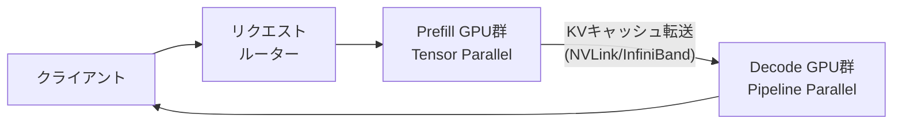

本記事は [DistServe: Disaggregating Prefill and Decoding for Goodput-optimized Large Language Model Serving](https://arxiv.org/abs/2404.09562)（OSDI 2024）の解説記事です。

## 論文概要（Abstract）

LLM推論は2つのフェーズ（prefill: プロンプト処理、decode: トークン生成）から構成されるが、両フェーズはリソース特性が根本的に異なる。著者らはこの2フェーズを物理的に別のGPU群に分離（disaggregate）し、それぞれに最適なパラレリズム戦略を適用する**DistServe**を提案している。ShareGPTワークロードにおいてLLaMA-2-70Bでvllm比最大4.48倍のgoodput改善が報告されている。

この記事は [Zenn記事: Ollama v0.24×Docker Composeで構築するオンプレLLM推論基盤の実践ガイド](https://zenn.dev/0h_n0/articles/dfcfed8523c1e3) の深掘りです。

## 情報源

- **arXiv ID**: 2404.09562
- **URL**: [https://arxiv.org/abs/2404.09562](https://arxiv.org/abs/2404.09562)
- **著者**: Yinmin Zhong, Shengyu Liu, Junda Chen, et al.（Peking University）
- **発表年**: 2024（OSDI 2024 採択）
- **分野**: cs.DC, cs.CL, cs.LG

## 背景と動機（Background & Motivation）

LLM推論の2フェーズは以下のように異なるリソースを必要とする。

| 特性 | Prefillフェーズ | Decodeフェーズ |
|---|---|---|
| 計算パターン | 入力トークン全体の並列処理 | 1トークンずつ逐次生成 |
| ボトルネック | GPU計算能力（compute-bound） | GPUメモリ帯域（memory-bound） |
| レイテンシ指標 | TTFT（Time to First Token） | TBT（Time Between Tokens） |
| 典型的な所要時間 | 数百ms〜数秒 | 数十ms/トークン × 数百トークン |

従来のシステム（vLLM、Orca等）は両フェーズを同一GPU上で実行するため、計算特性のミスマッチが生じていた。具体的には、長いプロンプトのprefill処理中にdecodeが待機させられ（head-of-line blocking）、TBTのSLO違反が発生する。

著者らは、この2フェーズを物理的に分離して異なるGPU群で実行することで、各フェーズに最適な並列化戦略を独立に適用できると主張している。

## 主要な貢献（Key Contributions）

- **Prefill/Decode分離アーキテクチャ**: 2フェーズを別GPU群に配置し、KVキャッシュをネットワーク経由で転送する設計
- **Goodput最適化**: TTFT/TBTの両SLOを同時に満たすリクエスト数（goodput）を最大化する
- **プレースメント最適化アルゴリズム**: prefill/decode GPU比率とパラレリズム設定を自動決定するプロファイリングベースのツール

## 技術的詳細（Technical Details）

### 分離アーキテクチャの全体像



### フェーズ別の最適パラレリズム

著者らは各フェーズに異なる並列化戦略を適用する。

**Prefillフェーズ**: Tensor Parallelism（TP）を使用する。入力トークン全体を並列に処理するため、GPU間の通信量は少なくて済む。TPによりprefillレイテンシはGPU数に近い比率で短縮される。

**Decodeフェーズ**: Pipeline Parallelism（PP）を使用する。1トークンずつの逐次処理では、TPのall-reduce通信がボトルネックとなる。PPではGPUをステージ（層の集合）に分割し、マイクロバッチ間でパイプラインを形成してスループットを確保する。

### KVキャッシュ転送のコスト分析

Prefill完了後、生成されたKVキャッシュをDecode GPU群に転送する必要がある。転送データ量は以下で計算される。

$$
D_{\text{KV}} = 2 \times n_{\text{layers}} \times n_{\text{heads}} \times d_{\text{head}} \times s_{\text{input}} \times \text{sizeof(dtype)}
$$

ここで、
- $n_{\text{layers}}$: Transformerの層数
- $n_{\text{heads}}$: Attentionヘッド数
- $d_{\text{head}}$: ヘッドの次元数
- $s_{\text{input}}$: 入力シーケンス長
- $\text{sizeof(dtype)}$: データ型のバイト数（FP16で2バイト）
- 係数2: Key/Valueの2テンソル分

LLaMA-2-70Bの場合、入力512トークンで$D_{\text{KV}} \approx 1.3$ GBとなる。NVLink（600 GB/s）なら約2ms、100GbE（12.5 GB/s）なら約100msの転送時間を要する。

### Goodputの定義

著者らはSLO達成率に基づくgoodputを以下のように定義している。

$$
\text{goodput} = \lambda \cdot \Pr[\text{TTFT} \leq T_1 \wedge \text{TBT} \leq T_2]
$$

ここで、
- $\lambda$: リクエスト到着率（req/s）
- $T_1$: TTFT SLO上限
- $T_2$: TBT SLO上限
- $\Pr[\cdot]$: SLO達成確率

従来のスループット指標（全リクエストの完了数/秒）とは異なり、goodputはSLO違反リクエストを除外して計算する。これにより、ユーザー体験に直結する指標で評価できる。

### プレースメント最適化

Prefill/Decode GPU群への最適な配分比率はワークロード依存である。著者らはプロファイリングベースの最適化アルゴリズムを提案している。

```python
def optimize_placement(
    total_gpus: int,
    workload_profile: dict,
    slo_ttft: float,
    slo_tbt: float,
) -> tuple[int, int]:
    """Prefill/Decode GPU配分を最適化

    Args:
        total_gpus: 利用可能なGPU総数
        workload_profile: {input_len_dist, output_len_dist, arrival_rate}
        slo_ttft: TTFT SLO上限（秒）
        slo_tbt: TBT SLO上限（秒）

    Returns:
        (prefill_gpus, decode_gpus) の最適配分
    """
    best_goodput = 0
    best_split = (1, total_gpus - 1)

    for n_prefill in range(1, total_gpus):
        n_decode = total_gpus - n_prefill
        goodput = simulate_goodput(
            n_prefill, n_decode, workload_profile, slo_ttft, slo_tbt
        )
        if goodput > best_goodput:
            best_goodput = goodput
            best_split = (n_prefill, n_decode)

    return best_split
```

論文のTable 5によると、ShareGPTワークロードではprefill:decode = 1:4が最適比率として報告されている。

## 実験結果（Results）

### Goodput比較

論文Table 3およびFigure 7より、以下の結果が報告されている（A100-80GB使用）。

| モデル | ワークロード | vLLM goodput | DistServe goodput | 改善倍率 |
|---|---|---|---|---|
| LLaMA-2-70B | ShareGPT | 2.1 req/s | 9.4 req/s | 4.48x |
| OPT-66B | ShareGPT | 3.2 req/s | 8.7 req/s | 2.72x |
| OPT-13B | ShareGPT | 15.8 req/s | 28.4 req/s | 1.80x |
| LLaMA-2-70B | LMSYS-Chat | 1.8 req/s | 6.2 req/s | 3.44x |

改善倍率はモデルサイズが大きいほど顕著であり、これはprefillのcompute-boundが大きいモデルで分離の効果が大きいことを示唆している。

### SLO達成率

TTFT SLO = 2秒、TBT SLO = 100msの条件で、論文Figure 8より以下の結果が報告されている。

| 負荷（到着率） | vLLM SLO達成率 | DistServe SLO達成率 |
|---|---|---|
| 低（2 req/s） | 95% | 99% |
| 中（5 req/s） | 72% | 96% |
| 高（10 req/s） | 31% | 89% |

高負荷時にDistServeの優位性が顕著になる。これはprefillとdecodeの干渉がなくなるためである。

## 実装のポイント（Implementation）

### Docker Compose構成への適用

Zenn記事のDocker Compose構成にDistServeの概念を部分的に適用する場合、以下のパターンが考えられる。

```yaml
services:
  # Prefill専用インスタンス（長いプロンプト処理）
  ollama-prefill:
    image: ollama/ollama:0.24.0
    environment:
      - OLLAMA_NUM_PARALLEL=2
      - OLLAMA_MAX_LOADED_MODELS=1
      - CUDA_VISIBLE_DEVICES=0
    deploy:
      resources:
        reservations:
          devices:
            - driver: nvidia
              device_ids: ["0"]
              capabilities: [gpu]

  # Decode専用インスタンス（トークン生成）
  ollama-decode:
    image: ollama/ollama:0.24.0
    environment:
      - OLLAMA_NUM_PARALLEL=8
      - OLLAMA_MAX_LOADED_MODELS=1
      - CUDA_VISIBLE_DEVICES=1
    deploy:
      resources:
        reservations:
          devices:
            - driver: nvidia
              device_ids: ["1"]
              capabilities: [gpu]
```

ただし、Ollama自体はprefill/decode分離をネイティブにサポートしていないため、完全なDistServeアーキテクチャの実現にはvLLMベースの構成が必要となる。

### ネットワーク要件

KVキャッシュ転送のレイテンシがシステム全体の性能を左右する。論文から導出される帯域要件は以下のとおりである。

| モデルサイズ | 入力長512 | 入力長2048 | 推奨帯域 |
|---|---|---|---|
| 7B | 160MB | 640MB | 10GbE以上 |
| 13B | 320MB | 1.3GB | 25GbE以上 |
| 70B | 1.3GB | 5.2GB | 100GbE / NVLink |

Docker Compose構成の場合、同一ホスト内のコンテナ間通信はDockerブリッジネットワーク経由で行われるため、物理的なネットワーク帯域は問題にならない。ただし、ホストをまたぐ場合は上記の帯域要件を考慮する必要がある。

## 実運用への応用（Practical Applications）

1. **RAGパイプラインの最適化**: RAGでは長い検索結果をプロンプトに含めるため、prefillフェーズが重い。prefill専用GPUを確保することで、他のリクエストのdecodeへの影響を排除できる
2. **SLOベースのオートスケーリング**: goodput指標をPrometheusでモニタリングし、SLO達成率が閾値を下回った場合にGPUインスタンスを追加するスケーリング戦略が考えられる
3. **コスト効率**: prefill GPU群にはcompute最適化インスタンス（A100）、decode GPU群にはメモリ帯域最適化インスタンス（A10G）を割り当てることで、コストパフォーマンスを改善できる

## 関連研究（Related Work）

- **vLLM**（Kwon et al., 2023）: PagedAttentionによるKVキャッシュ管理を実現したが、prefill/decodeは同一GPU上で実行する。DistServeはvLLMのメモリ管理にフェーズ分離を追加した位置づけ
- **Splitwise**（Patel et al., 2024）: DistServeと独立にprefill/decode分離を提案した同時期の研究。設計思想は類似するが、プレースメント最適化アルゴリズムが異なる
- **Sarathi-Serve**（Agrawal et al., 2024）: prefillをチャンクに分割し、decodeとインターリーブ実行する手法。物理分離ではなく論理分離のアプローチ

## まとめと今後の展望

DistServeは、LLM推論のprefillとdecodeフェーズを物理的に分離することで、両フェーズのリソース特性に最適化された並列化戦略を適用できるようにした。goodput指標での評価はvLLM比最大4.48倍の改善を示しており、SLO達成率が重要な本番サービスでの有用性は高い。

Docker Compose環境では完全なDistServeアーキテクチャの実現は難しいが、prefill重い／decode重いリクエストを異なるOllamaインスタンスにルーティングする簡易的な分離戦略は適用可能である。今後は異種GPU（A100/RTX混在）環境での自動プレースメント最適化が実用化の鍵となる。

## 参考文献

- **arXiv**: [https://arxiv.org/abs/2404.09562](https://arxiv.org/abs/2404.09562)
- **Related Zenn article**: [https://zenn.dev/0h_n0/articles/dfcfed8523c1e3](https://zenn.dev/0h_n0/articles/dfcfed8523c1e3)
- Zhong, Y., Liu, S., Chen, J., et al. "DistServe: Disaggregating Prefill and Decoding for Goodput-optimized Large Language Model Serving." OSDI 2024.
- Kwon, W., et al. "Efficient Memory Management for Large Language Model Serving with PagedAttention." SOSP 2023.
- Patel, P., et al. "Splitwise: Efficient generative LLM inference using phase splitting." ISCA 2024.

---

:::message
本記事はAI（Claude Code）により自動生成されました。論文の内容を正確に伝えることを目的としていますが、解釈の誤りがある可能性があります。正確な情報は[原論文](https://arxiv.org/abs/2404.09562)をご確認ください。
:::
