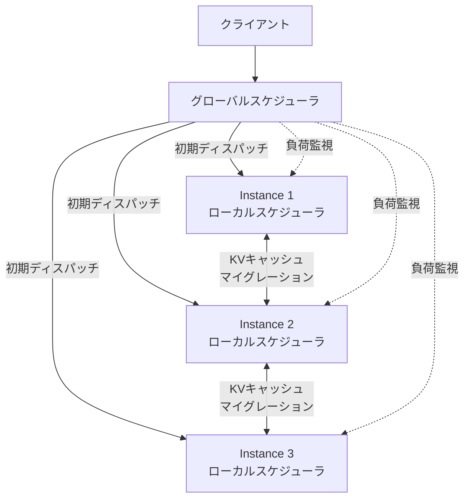

本記事は [Llumnix: Dynamic Scheduling for Large Language Model Serving](https://arxiv.org/abs/2405.03869) の解説記事です。

## 論文概要（Abstract）

LLMサービングにおいて、複数インスタンスへのリクエスト分配は従来のロードバランサ（round-robin、least-connections等）では不十分である。著者らは、リクエストをKVキャッシュごとインスタンス間でライブマイグレーションする**Llumnix**を提案している。グローバルスケジューラとインスタンスローカルスケジューラの階層構造により、負荷の偏りをリアルタイムに解消し、P99レイテンシを最大2.2倍改善すると報告されている。

この記事は [Zenn記事: Ollama v0.24×Docker Composeで構築するオンプレLLM推論基盤の実践ガイド](https://zenn.dev/0h_n0/articles/dfcfed8523c1e3) の深掘りです。

## 情報源

- **arXiv ID**: 2405.03869
- **URL**: [https://arxiv.org/abs/2405.03869](https://arxiv.org/abs/2405.03869)
- **著者**: Biao Sun, Ziming Huang, Hanyu Zhao, et al.（Alibaba Cloud）
- **発表年**: 2024
- **分野**: cs.DC, cs.LG

## 背景と動機（Background & Motivation）

Zenn記事ではNginxの`least_conn`ディレクティブでOllamaインスタンスへのロードバランシングを実現している。しかし、LLM推論には以下の特性があり、従来のHTTPロードバランサでは最適な分配ができない。

1. **リクエスト間の処理時間差が極めて大きい**: プロンプト長と生成長に依存し、数百msから数十秒まで幅がある
2. **リクエスト処理中にリソース消費が動的に変化**: デコードが進むにつれてKVキャッシュが成長し、VRAM消費が増大する
3. **リクエスト完了前にリバランスできない**: 従来システムではリクエストをインスタンスにディスパッチした後は移動できない

著者らは「リクエストの再スケジューリング（rescheduling）」、つまり処理中のリクエストをKVキャッシュごと別インスタンスに移送する機構が必要であると主張している。

## 主要な貢献（Key Contributions）

- **KVキャッシュのライブマイグレーション**: 処理中のリクエストのKVキャッシュをブロック単位で別GPUインスタンスに転送し、推論を中断せずに移送完了する
- **階層型スケジューラ**: グローバルキュー（インスタンス間分配）とローカルキュー（インスタンス内優先度制御）の2層で構成
- **3つのreschedulingポリシー**: DefragConstrained、DefragRelaxed、Loadの3つの戦略を提供

## 技術的詳細（Technical Details）

### アーキテクチャ



### グローバルスケジューラの動作

グローバルスケジューラは各インスタンスの負荷状態を監視し、以下の2つの操作を行う。

**ディスパッチ**: 新規リクエストを最適なインスタンスに振り分ける。振り分け基準はreschedulingポリシーに依存する。

**リスケジューリング**: 負荷の偏りを検知した場合、処理中のリクエストをKVキャッシュごと別インスタンスに移送する。

### 負荷指標の定義

著者らは各インスタンスの負荷を以下の指標で定量化している。

$$
L_i = \frac{M_i^{\text{used}}}{M_i^{\text{total}}} + \alpha \cdot \frac{Q_i}{Q_{\max}}
$$

ここで、
- $L_i$: インスタンス$i$の負荷スコア
- $M_i^{\text{used}} / M_i^{\text{total}}$: VRAMの使用率（KVキャッシュのブロック占有率）
- $Q_i$: インスタンス$i$のキュー内リクエスト数
- $Q_{\max}$: キューの最大長
- $\alpha$: キュー長の重み（デフォルト0.5）

### 3つのReschedulingポリシー

**DefragConstrained**: VRAMの断片化を解消するために、空きブロックが少ないインスタンスからリクエストを移送する。移送先は空きブロックが最も多いインスタンスとする。コンパクションに相当する。

**DefragRelaxed**: DefragConstrainedに加え、インスタンス間のブロック使用率を均等化する。偏りが閾値を超えた場合にのみ発動する。

**Load**: キュー長ベースでリバランスする。キュー長が平均の2倍を超えたインスタンスから、平均未満のインスタンスにリクエストを移送する。

```python
def should_reschedule(instances: list[dict]) -> list[tuple[int, int]]:
    """Loadポリシーに基づくリスケジューリング判定

    Returns:
        移送するリクエストの (src_instance, dst_instance) ペアのリスト
    """
    avg_queue = sum(i["queue_len"] for i in instances) / len(instances)
    migrations = []

    overloaded = [i for i in instances if i["queue_len"] > avg_queue * 2]
    underloaded = [i for i in instances if i["queue_len"] < avg_queue]
    underloaded.sort(key=lambda x: x["queue_len"])

    for src in overloaded:
        if not underloaded:
            break
        dst = underloaded[0]
        excess = src["queue_len"] - int(avg_queue)
        for _ in range(min(excess, 3)):  # 1回あたり最大3リクエスト移送
            migrations.append((src["id"], dst["id"]))
        underloaded.sort(key=lambda x: x["queue_len"])

    return migrations
```

### KVキャッシュのライブマイグレーション

マイグレーションはブロック単位で行われ、以下の手順で実行される。

1. **転送元**: 対象リクエストのデコードを一時停止する
2. **ブロックコピー**: KVキャッシュのブロックを転送先GPUメモリにコピーする（RDMA or CPU中継）
3. **ブロックテーブル更新**: 転送先でブロックテーブルを再構築する
4. **推論再開**: 転送先でデコードを再開する

マイグレーション中のレイテンシオーバーヘッドは以下のように見積もられる。

$$
T_{\text{mig}} = \frac{n_{\text{blocks}} \times B_{\text{block}}}{BW_{\text{network}}} + T_{\text{setup}}
$$

ここで、
- $n_{\text{blocks}}$: 移送するブロック数
- $B_{\text{block}}$: 1ブロックのデータサイズ（バイト）
- $BW_{\text{network}}$: ネットワーク帯域（バイト/秒）
- $T_{\text{setup}}$: セットアップ時間（ブロックテーブル再構築等、通常1〜5ms）

LLaMA-7Bで256トークンのKVキャッシュ（約16ブロック）を移送する場合、10GbEで約5ms、RDMA（InfiniBand HDR: 200Gb/s）で約0.2msの転送時間となる。

## 実験結果（Results）

### P99レイテンシの改善

著者らはA10G × 4〜8インスタンス構成で評価を行っている。論文Table 2より以下の結果が報告されている。

| モデル | インスタンス数 | ベースライン P99 JCT | Llumnix P99 JCT | 改善倍率 |
|---|---|---|---|---|
| LLaMA-2-7B | 4 | 12.3s | 6.8s | 1.81x |
| LLaMA-2-7B | 8 | 14.1s | 6.4s | 2.20x |
| LLaMA-2-13B | 4 | 18.7s | 10.2s | 1.83x |

インスタンス数が多いほど改善倍率が大きくなる。これはマイグレーション先の選択肢が増え、負荷均等化の自由度が高まるためである。

### マイグレーションオーバーヘッド

論文Figure 12より、マイグレーションのオーバーヘッドは以下のように報告されている。

| 転送方式 | オーバーヘッド（P50） | オーバーヘッド（P99） |
|---|---|---|
| RDMA（InfiniBand） | 0.8ms | 2.1ms |
| CPU中継（10GbE） | 12ms | 35ms |

RDMAを使用できる場合、マイグレーションのオーバーヘッドは推論レイテンシに対して無視できるレベルである。

### スループットへの影響

論文Figure 10によると、マイグレーションの発動頻度は全リクエストの3〜8%であり、スループットへの影響は2%未満にとどまると報告されている。

## 実装のポイント（Implementation）

### NginxロードバランサとLlumnixの比較

Zenn記事で使用されているNginxの`least_conn`方式とLlumnixのアプローチを比較する。

| 特性 | Nginx least_conn | Llumnix |
|---|---|---|
| 振り分けタイミング | リクエスト受信時のみ | リクエスト受信時 + 処理中の動的リバランス |
| 負荷指標 | TCP接続数 | VRAM使用率 + キュー長 |
| リクエスト移送 | 不可 | KVキャッシュごとライブマイグレーション |
| 導入コスト | 低（Nginx設定のみ） | 高（vLLM互換バックエンド必要） |
| 適用規模 | 2〜4インスタンス | 4〜16インスタンス |

### Prometheus指標の追加

Llumnixの概念をOllama + Nginx構成で部分的に実現するために、以下のPrometheusカスタム指標を追加できる。

```python
from prometheus_client import Gauge, Histogram

vram_usage = Gauge(
    "ollama_instance_vram_usage_ratio",
    "VRAM usage ratio per instance",
    ["instance_id"],
)
queue_length = Gauge(
    "ollama_instance_queue_length",
    "Request queue length per instance",
    ["instance_id"],
)
migration_duration = Histogram(
    "llm_migration_duration_seconds",
    "KV cache migration duration",
    buckets=[0.001, 0.005, 0.01, 0.05, 0.1, 0.5, 1.0],
)
```

これらの指標をGrafanaで可視化し、負荷の偏りをモニタリングすることで、手動でのリクエスト再配分のトリガーとして活用できる。

### Nginxでの動的重み付け

Llumnixの完全な実装は困難だが、NginxのUpstreamモジュールで重み付きロードバランシングを行い、定期的に重みを更新する簡易版は以下のように構成できる。

```nginx
upstream ollama_backend {
    # 動的に重み更新可能（nginx -s reload で反映）
    server ollama-1:11434 weight=5 max_fails=3 fail_timeout=30s;
    server ollama-2:11434 weight=5 max_fails=3 fail_timeout=30s;
}
```

重みの更新はPrometheusから取得したVRAM使用率に基づいてcronジョブで自動化できる。

## 実運用への応用（Practical Applications）

1. **段階的導入**: まずNginx `least_conn`で運用を開始し、インスタンス数が4台以上になった時点でLlumnixまたは類似のスマートスケジューラへの移行を検討する
2. **GPU使用率のモニタリング**: Zenn記事で紹介されているDCGM ExporterのVRAM指標をスケジューリング判定に活用する
3. **ヘテロジニアス構成**: 異なるGPU（RTX 3080 + RTX 4090等）が混在する場合、VRAM容量に応じた重み付けとKVキャッシュサイズ制限の組み合わせが有効

## 関連研究（Related Work）

- **vLLM**（Kwon et al., 2023）: PagedAttentionによりKVキャッシュのブロック管理を実現した。Llumnixはvllmのブロック管理をインスタンス間マイグレーションに拡張している
- **Orca**（Yu et al., 2022）: 連続バッチングでバッチ内のリクエスト粒度での管理を実現したが、インスタンス間のリバランス機能は持たない
- **Preble**（Srivatsa et al., 2024）: プレフィックスアウェアなルーティングでKVキャッシュの再利用率を最大化する。LlumnixのLoadポリシーとは相補的な最適化

## まとめと今後の展望

Llumnixは、LLMサービングにおけるマルチインスタンスのロードバランシング問題に対して、KVキャッシュのライブマイグレーションという手法で根本的な解決を図った。P99レイテンシの2.2倍改善は、tail latencyが問題となる本番サービスにおいて実用的な価値がある。

Docker Compose + Nginx構成でオンプレLLM推論基盤を運用する場合、インスタンス数が少ない段階では`least_conn`で十分だが、規模拡大に伴いスマートスケジューリングの必要性が増す。Llumnixの概念を段階的に取り入れることで、スケーラブルな推論基盤を構築できる。

## 参考文献

- **arXiv**: [https://arxiv.org/abs/2405.03869](https://arxiv.org/abs/2405.03869)
- **Code**: [https://github.com/AlibabaPAI/llumnix](https://github.com/AlibabaPAI/llumnix)
- **Related Zenn article**: [https://zenn.dev/0h_n0/articles/dfcfed8523c1e3](https://zenn.dev/0h_n0/articles/dfcfed8523c1e3)
- Sun, B., Huang, Z., Zhao, H., et al. "Llumnix: Dynamic Scheduling for Large Language Model Serving." arXiv:2405.03869, 2024.
- Kwon, W., et al. "Efficient Memory Management for Large Language Model Serving with PagedAttention." SOSP 2023.

---

:::message
本記事はAI（Claude Code）により自動生成されました。論文の内容を正確に伝えることを目的としていますが、解釈の誤りがある可能性があります。正確な情報は[原論文](https://arxiv.org/abs/2405.03869)をご確認ください。
:::
