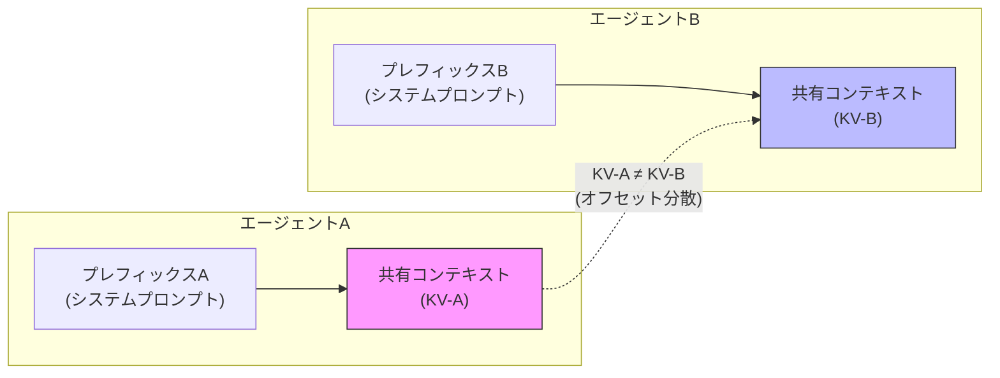
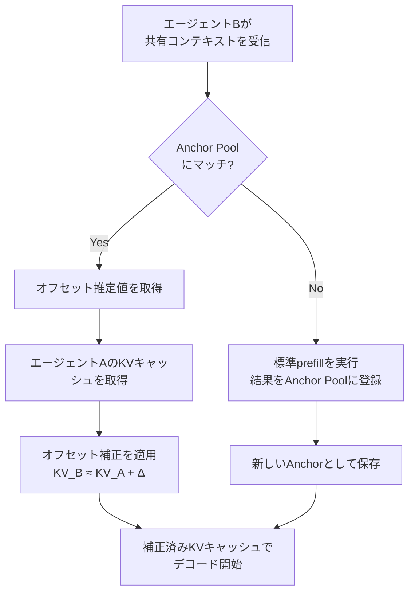

本記事は [KVCOMM: Online Cross-context KV-cache Communication for Efficient LLM-based Multi-agent Systems](https://arxiv.org/abs/2510.12872) の解説記事です。

## 論文概要（Abstract）

KVCOMMは、マルチエージェントLLMシステムにおいて、エージェント間で重複するコンテキストのKVキャッシュを効率的に共有・再利用するフレームワークである。著者らは、複数エージェントがメッセージを受け渡す際に、先行ターンを含む全コンテキストをゼロから再計算する非効率性に着目し、エージェント固有のプレフィックスが異なる場合でもKVキャッシュのオフセットを推定・補正する手法を提案している。

著者らの報告によれば、KVCOMMは多様なマルチエージェントワークロードにおいて70%以上のKVキャッシュ再利用率を達成し、5エージェント全結合構成・入力1Kトークン（プレフィックス512トークン＋出力512トークン）の条件下で、標準的なprefillパイプラインに対して最大7.8倍の高速化を実現した（Table 1, Section 5.2）。

この記事は [Zenn記事: AIエージェント×セマンティックキャッシュ：ツール呼び出しとマルチターン対話を高速化する実装設計](https://zenn.dev/0h_n0/articles/803e53d2b2b872) の深掘りです。

## 情報源

- **会議名**: NeurIPS 2025（Neural Information Processing Systems）
- **arXiv ID**: 2510.12872
- **URL**: [https://arxiv.org/abs/2510.12872](https://arxiv.org/abs/2510.12872)
- **著者**: Hancheng Ye, Zhengqi Gao, Mingyuan Ma, Qinsi Wang, Yuzhe Fu, Ming-Yu Chung, Yueqian Lin, Zhijian Liu, Jianyi Zhang, Danyang Zhuo, Yiran Chen
- **投稿日**: 2025年10月14日（改訂: 2025年11月1日）
- **ステータス**: NeurIPS 2025 採択済
- **被引用数**: 14件（Semantic Scholar, 2026年5月時点）

## カンファレンス情報

NeurIPS（Conference on Neural Information Processing Systems）は、機械学習・人工知能分野における最高峰の国際会議の1つである。毎年12月に開催され、深層学習、強化学習、最適化、確率モデルなど幅広いテーマの論文が発表される。NeurIPS 2025の採択率は公式には未公表であるが、近年のNeurIPSの採択率はおおむね25-28%で推移しており（NeurIPS 2024は約26%）、高い競争率を維持している。

KVCOMMは、マルチエージェントLLM推論の効率化というトピックでNeurIPS 2025に採択されており、LLMの推論最適化が主要な研究トレンドとして認識されていることを示している。

## 背景と動機（Background & Motivation）

### マルチエージェントLLMの計算コスト問題

マルチエージェントLLMシステムでは、複数のエージェントが連携してタスクを処理する。典型的なパイプライン構成では、エージェントAの出力がエージェントBの入力に、エージェントBの出力がエージェントCの入力になるといった形でメッセージが受け渡される。

この際、各エージェントは受信したメッセージを含む全コンテキストに対してprefill（KV計算）を最初から実行する必要がある。著者らは、この処理において先行ターンのKVキャッシュが大量に重複しているにもかかわらず、毎回ゼロから再計算されている点を問題として指摘している。

### 単一エージェントKVキャッシュの限界

単一エージェント環境では、プレフィックスが一致する場合にKVキャッシュを再利用することで計算をスキップできる。Anthropic APIのプロンプトキャッシュや、vLLMのPrefix Cachingがこの手法に該当する。しかし、マルチエージェント環境では各エージェントが固有のシステムプロンプトやツール定義を持つため、プレフィックスが異なり、直接的なKVキャッシュの再利用ができない。

### オフセット分散問題

著者らが特定した根本的な課題は、**KVキャッシュのオフセット分散**（offset variance）である。同一のテキストトークンであっても、それに先行するプレフィックスが異なれば、Transformerの位置エンコーディングやAttention計算の結果として異なるKV値が生成される。この差異がエージェント間でのKVキャッシュ直接再利用を妨げている。



上図のように、同一の共有コンテキストであっても、先行プレフィックスが異なるためKV値が一致せず、直接コピーによるキャッシュ再利用はできない。

## 主要な貢献（Key Contributions）

著者らは以下の3点を主要な貢献として挙げている：

1. **Cross-context KVキャッシュ再利用フレームワーク**: プレフィックスが異なるエージェント間でも、KVキャッシュのオフセットを推定・補正することで共有コンテキストのKV計算を省略する手法の提案
2. **Anchor Poolによるオンライン適応**: 過去に観測されたKVキャッシュのオフセット情報を蓄積・更新するAnchor Poolメカニズムにより、事前学習なしでユーザーリクエストやコンテキスト構造の変化に動的対応
3. **多様なワークロードでの実証**: RAG（検索拡張生成）、数学推論、協調コーディングの3タスクにおいて、品質劣化なしに70%以上のキャッシュ再利用率と最大7.8倍の高速化を達成

## 技術的詳細（Technical Details）

### Cross-context KVキャッシュ共有メカニズム

KVCOMMの中核となるアイデアは、異なるプレフィックス下で計算されたKVキャッシュの差異（オフセット）を推定し、既存のKVキャッシュに補正を加えることで再利用可能にするという点にある。

全体のワークフローは以下のとおりである：



具体的には、エージェント$i$がプレフィックス$p_i$を持ち、共有コンテキスト$c$を処理する場合を考える。プレフィックス$p_i$の下で計算された共有コンテキスト$c$のKVキャッシュを$\text{KV}(c \mid p_i)$と表記する。

エージェント$j$（プレフィックス$p_j$）が同じ共有コンテキスト$c$を処理する際、KVCOMMは以下の近似を行う：

$$
\text{KV}(c \mid p_j) \approx \text{KV}(c \mid p_i) + \Delta_{i \to j}
$$

ここで$\Delta_{i \to j}$はプレフィックス$p_i$から$p_j$への切り替えに伴うKVキャッシュのオフセットである。この$\Delta_{i \to j}$をAnchor Poolから推定することが、KVCOMMの核心的な技術要素である。

### Anchor Poolによるキャッシュオフセット管理

Anchor Poolは、過去に観測されたKVキャッシュのオフセット情報を蓄積するデータ構造である。各Anchorは以下の情報を保持する：

- **プレフィックスペア** $(p_i, p_j)$: どのプレフィックス間の変換か
- **オフセットベクトル** $\Delta_{i \to j}$: 観測されたKV差分
- **コンテキスト特徴**: どのようなコンテキスト構造で観測されたか
- **信頼度スコア**: 推定の精度に関する指標

著者らの手法では、Anchorの選択と更新を以下のように行う。新しいリクエストが到着した際、Anchor Poolから最も類似したプレフィックスペアのAnchorを検索する。レイヤー$l$、ヘッド$h$におけるオフセット推定は次のように表される：

$$
\hat{\Delta}_{i \to j}^{(l,h)} = \frac{1}{|\mathcal{A}|} \sum_{a \in \mathcal{A}} w_a \cdot \Delta_a^{(l,h)}
$$

ここで、$\mathcal{A}$はAnchor Poolから選択されたAnchor集合、$w_a$は各Anchorの類似度に基づく重み、$\Delta_a^{(l,h)}$はAnchor $a$に記録されたレイヤー$l$・ヘッド$h$のオフセット値である。

#### Anchor Poolの初期化と更新

Anchor Poolは以下のライフサイクルで運用される：

1. **コールドスタート**: 初期段階では、Anchor Poolが空のため標準的なprefillを実行する。この際に計算されたKVキャッシュのオフセット情報をAnchorとして登録する
2. **オンライン蓄積**: リクエストを処理するたびに新しいAnchorが追加される。著者らは、数十リクエスト程度でAnchor Poolが十分に充填され、高いキャッシュ再利用率に到達すると報告している
3. **動的適応**: ユーザーリクエストやコンテキスト構造の変化に応じて、Anchor Poolのエントリが更新・置換される

### オンライン適応メカニズム

KVCOMMの重要な特徴は、**training-free**（追加学習不要）でありながらオンラインで適応する点である。著者らは、Anchor Poolを逐次更新するオンラインアルゴリズムを採用しており、以下の利点を挙げている：

- **モデル非依存**: 任意のTransformerベースLLMに適用可能（ファインチューニング不要）
- **リクエスト適応**: 実行時のリクエストパターンに合わせてAnchorが最適化される
- **メモリ効率**: Anchor Poolのサイズは固定上限で管理され、不要なエントリはLRUベースで退避される

### プレフィックスコンテキスト下でのKVキャッシュアライメント

マルチエージェント環境では、各エージェントのプレフィックス（システムプロンプト、ツール定義等）がKVキャッシュ全体に影響を与える。KVCOMMは、この影響を以下の2段階で処理する：

**第1段階: プレフィックス分類**

エージェントのプレフィックスをカテゴリ分けし、類似したプレフィックスを持つエージェントペアではオフセットが小さいことを利用する。

**第2段階: 層別オフセット補正**

Transformerの深い層ほど、プレフィックスの影響が減衰する傾向がある。著者らはこの性質を利用して、浅い層では大きな補正を、深い層では小さな補正を適用する層別の補正戦略を採用している：

$$
\Delta_{i \to j}^{(l)} = \alpha(l) \cdot \Delta_{i \to j}^{(\text{base})}
$$

ここで$\alpha(l)$はレイヤー$l$に依存する減衰係数であり、$l$が大きくなるにつれて小さくなる。$\Delta_{i \to j}^{(\text{base})}$はAnchor Poolから取得されたベースオフセットである。

## 実装のポイント（Implementation Notes）

### Training-Freeの利点

KVCOMMが追加学習不要である点は、実運用上きわめて重要である：

1. **即座に適用可能**: 既存のLLM推論パイプラインに対して、モデルの再学習やファインチューニングなしで統合できる
2. **モデルバージョン非依存**: モデルが更新されても、Anchor Poolを再構築するだけで対応可能
3. **低リスク導入**: モデルの出力品質に影響を与えない（品質劣化なしと報告）

### 実装時の考慮事項

```python
from dataclasses import dataclass, field
import numpy as np


@dataclass
class Anchor:
    """Anchor Poolに格納するKVキャッシュオフセット情報"""
    prefix_pair: tuple[str, str]  # (source_hash, target_hash)
    offset: np.ndarray            # shape: (n_layers, n_heads, dim)
    confidence: float = 0.0
    access_count: int = 0


@dataclass
class AnchorPool:
    """KVキャッシュオフセットを管理するAnchor Pool"""
    max_size: int = 256
    anchors: list[Anchor] = field(default_factory=list)

    def lookup(self, src: str, tgt: str) -> np.ndarray | None:
        """最も類似したAnchorからオフセットを信頼度加重平均で推定"""
        candidates = [a for a in self.anchors if a.prefix_pair == (src, tgt)]
        if not candidates:
            return None
        total_w = sum(a.confidence for a in candidates)
        if total_w == 0:
            return None
        offset = sum(a.confidence * a.offset for a in candidates) / total_w
        for a in candidates:
            a.access_count += 1
        return offset

    def register(self, anchor: Anchor) -> None:
        """新しいAnchorを登録（上限超過時はLRU退避）"""
        if len(self.anchors) >= self.max_size:
            self.anchors.sort(key=lambda a: a.access_count)
            self.anchors.pop(0)
        self.anchors.append(anchor)
```

## Production Deployment Guide

### AWS実装パターン（マルチエージェント推論特化）

KVCOMMをAWS上で運用するための構成を示す。マルチエージェント推論では、複数エージェントが同一のGPUクラスタ上で動作し、KVキャッシュを共有メモリ経由で受け渡すアーキテクチャが前提となる。

| 規模 | 月間リクエスト | エージェント数 | 推奨構成 | 月額コスト | 主要サービス |
|------|:---:|:---:|:---:|:---:|:---:|
| **Small** | ~5,000 | 2-3 | 単一マルチGPU | $1,200-2,500 | EC2 g5.2xlarge + EFS |
| **Medium** | ~50,000 | 3-5 | GPUクラスタ | $5,000-12,000 | EKS + g5.12xlarge x2 |
| **Large** | 500,000+ | 5-10 | 分散推論 | $20,000-50,000 | EKS + p4d.24xlarge + ElastiCache |

**Small構成の詳細** (月額$1,200-2,500):
- **EC2 g5.2xlarge**: NVIDIA A10G 24GB, 8 vCPU, 32GB RAM ($780/月 On-Demand、Spot: ~$250/月)
- **EFS**: 50GB ($15/月) — Anchor Pool永続化およびKVキャッシュスナップショット用
- **共有メモリ**: 32GB RAMのうち約16GBをエージェント間KVキャッシュ共有バッファとして使用

**Medium構成の詳細** (月額$5,000-12,000):
- **EKS + g5.12xlarge x2**: A10G 24GB x4 per node, 48 vCPU, 192GB RAM ($3,500/月 x2 On-Demand)
- **ElastiCache (Redis)**: r6g.large ($200/月) — Anchor Poolの分散キャッシュ、ノード間共有
- **S3**: Anchor Poolのバックアップ、コールドスタート時の復元用 ($5/月)

**KVCOMMにおけるメモリ配置**:
- **GPU HBM**: モデル重み以外（約10GB）をKVキャッシュに割り当て
- **CPU DRAM**: エージェント間KVキャッシュ転送バッファ + Anchor Poolテーブル
- **EFS/S3**: Anchor Pool永続化（コールドスタート回避用）

**コスト試算の注意事項**: 上記は2026年5月時点のAWS ap-northeast-1リージョン料金に基づく概算値です。Spot Instancesの価格は需給により変動します。最新料金は[AWS料金計算ツール](https://calculator.aws/)で確認してください。

### Terraformインフラコード

**Medium構成: EKS + GPUノード + Anchor Pool共有ストレージ**

```hcl
module "eks" {
  source          = "terraform-aws-modules/eks/aws"
  version         = "~> 20.0"
  cluster_name    = "kvcomm-multi-agent"
  cluster_version = "1.30"
  vpc_id          = module.vpc.vpc_id
  subnet_ids      = module.vpc.private_subnets

  eks_managed_node_groups = {
    gpu_inference = {
      instance_types = ["g5.12xlarge"]
      min_size = 1; max_size = 4; desired_size = 2
      labels = { "workload" = "kvcomm-inference" }
    }
  }
}

resource "aws_elasticache_replication_group" "anchor_pool" {
  replication_group_id = "kvcomm-anchor-pool"
  description          = "Anchor Pool shared cache"
  node_type            = "cache.r6g.large"
  num_cache_clusters   = 2
  engine               = "redis"
  engine_version       = "7.1"
}

resource "aws_efs_file_system" "anchor_persist" {
  creation_token = "kvcomm-anchor-persist"
  encrypted      = true
}
```

### 運用・監視設定

```python
import boto3

cloudwatch = boto3.client('cloudwatch')

# KVキャッシュ再利用率の監視
cloudwatch.put_metric_alarm(
    AlarmName='kvcomm-cache-reuse-rate-low',
    ComparisonOperator='LessThanThreshold',
    EvaluationPeriods=3,
    MetricName='KVCacheReuseRate',
    Namespace='Custom/KVCOMM',
    Period=300,
    Statistic='Average',
    Threshold=0.5,
    AlarmDescription='KVキャッシュ再利用率50%未満 — Anchor Pool充填不足の可能性',
)

# TTFT（Time-to-First-Token）レイテンシ
cloudwatch.put_metric_alarm(
    AlarmName='kvcomm-ttft-high',
    ComparisonOperator='GreaterThanThreshold',
    EvaluationPeriods=3,
    MetricName='TimeToFirstToken',
    Namespace='Custom/KVCOMM',
    Period=60,
    Statistic='p99',
    Threshold=200,  # ms
    AlarmDescription='TTFT p99が200ms超 — オフセット推定未収束またはHBM圧迫の可能性',
)

# GPU HBM使用率
cloudwatch.put_metric_alarm(
    AlarmName='kvcomm-gpu-memory-high',
    ComparisonOperator='GreaterThanThreshold',
    EvaluationPeriods=2,
    MetricName='GPUMemoryUtilization',
    Namespace='Custom/KVCOMM',
    Period=60,
    Statistic='Average',
    Threshold=85,
    AlarmDescription='GPU HBM 85%超 — エージェント数制限またはKV量子化を検討',
)
```

### コスト最適化チェックリスト

- [ ] Spot Instances使用で最大70%削減（g5.12xlarge Spot: ~$1.80/h vs On-Demand: $5.67/h）
- [ ] KVキャッシュの量子化（FP16→INT8）でGPU HBM使用量を50%削減し、同時処理エージェント数を増加
- [ ] Anchor Poolのサイズ上限チューニング — プレフィックスペアの多様性に応じて64-1024の範囲で調整
- [ ] エージェントのシステムプロンプトをなるべく統一し、プレフィックスペア数を削減
- [ ] コールドスタート時はS3/EFSから前回のAnchor Poolを復元し、再利用率の立ち上がりを高速化
- [ ] CloudWatchカスタムメトリクスでKVキャッシュ再利用率・Anchor Poolヒット率・TTFTを継続監視
- [ ] 夜間・低負荷帯のノード数自動スケールダウン（EKS Cluster Autoscaler）
- [ ] Reserved Instances: 24/7稼働する本番環境ではCompute Savings Plans 1年コミットで最大72%削減
- [ ] NVLink対応インスタンス（p4d/p5）でマルチGPU間KVキャッシュ転送を高速化

## 実験結果（Results）

### 評価設定

著者らは、以下の条件で実験を実施したと報告している：

- **エージェント構成**: 2-5エージェントの全結合（fully-connected）トポロジー
- **入力規模**: 各エージェント1Kトークン（プレフィックス512トークン＋共有コンテキスト512トークン）
- **評価タスク**: RAG（検索拡張生成）、数学推論、協調コーディング

### 主要結果

| 指標 | 標準prefill | KVCOMM | 改善率 |
|------|:---:|:---:|:---:|
| **TTFT** | ~430 ms | ~55 ms | **7.8x高速化** |
| **KVキャッシュ再利用率** | 0% | 70%以上 | — |
| **出力品質** | ベースライン | 劣化なし | 0%品質低下 |

（Section 5.2, Table 1より。5エージェント全結合構成・1K入力トークンの条件）

### タスク別結果

| タスク | KVキャッシュ再利用率 | 品質への影響 |
|--------|:---:|:---:|
| **RAG（検索拡張生成）** | 70%以上 | 劣化なし |
| **数学推論** | 70%以上 | 劣化なし |
| **協調コーディング** | 70%以上 | 劣化なし |

著者らは、3タスクすべてにおいて70%以上のKVキャッシュ再利用率を品質劣化なしに達成したと報告している。特にRAGタスクでは、複数エージェントが同一の検索結果ドキュメントを処理するため、重複コンテキストの割合が高く恩恵が大きい。

### スケーラビリティ

エージェント数が増加するほど重複コンテキストの割合が増大するため、KVCOMMの高速化効果も大きくなる。著者らは、2エージェント構成では中程度の高速化、5エージェント全結合構成で最大7.8倍の高速化を報告している。

## 実運用への応用（Practical Applications）

### 応用1: RAGマルチエージェント

複数のRAGエージェントが同一の検索結果ドキュメントを異なる観点から分析する構成（例: 要約エージェント + 事実確認エージェント + 引用生成エージェント）では、検索結果部分のKVキャッシュを共有することで、prefillコストを大幅に削減できる。

### 応用2: コード生成パイプライン

協調コーディングタスクでは、設計エージェント → 実装エージェント → レビューエージェントがコードベースを共有する。各エージェントが同じコードコンテキストを処理する際に、KVCOMMによるキャッシュ共有が有効に機能する。

### 応用3: セマンティックキャッシュとの組み合わせ

Zenn記事で解説しているセマンティックキャッシュ（意味的類似性に基づくキャッシュ）とKVCOMMは補完的な関係にある：

- **セマンティックキャッシュ**: リクエストレベルで「類似した質問には同じ応答を返す」
- **KVCOMM**: 推論レベルで「同一コンテキストのKV計算を省略する」

両者を組み合わせることで、セマンティックキャッシュのミス時にもKVCOMMによる推論高速化の恩恵を受けることができる。

### 制約と限界

著者らの手法には以下の制約がある：

- **オフセット推定の精度**: Anchor Poolに十分なエントリが蓄積されるまで（コールドスタート期間）、キャッシュ再利用率は低い
- **プレフィックス多様性への感度**: エージェントのプレフィックスが極端に多様な場合、Anchor Poolのカバレッジが不足する可能性がある
- **メモリオーバーヘッド**: Anchor Pool自体がメモリを消費するため、小規模な環境ではオーバーヘッドが無視できない場合がある
- **評価範囲**: 実験は5エージェントまでの構成で評価されており、10エージェント以上の大規模構成での性能は未検証

## 関連研究（Related Work）

- **PagedAttention / vLLM (2309.06180)**: KVキャッシュの非連続メモリ管理とページングによる効率化。単一エージェント環境でのKVキャッシュ管理の基盤技術であり、KVCOMMはこの上に構築される形で、マルチエージェント環境への拡張を実現している。
- **CachedAttention (2407.01219)**: マルチターン会話でのKVキャッシュをCPU/GPU階層に永続化する手法。単一エージェントのマルチターン効率化に焦点を当てており、KVCOMMが対象とするマルチエージェント間のキャッシュ共有とは異なるスコープである。
- **StreamingLLM (2311.09544)**: Attention Sinkトークンの固定KVウィンドウによる無限長コンテキスト処理。KVキャッシュの「保持」に焦点を当てるStreamingLLMに対し、KVCOMMはキャッシュの「共有」と「転送」に注力している。
- **QKVShare (2026)**: KVCOMMが特定したオフセット分散問題に対して、量子化されたKVキャッシュハンドオフで対処する後続研究。KVCOMMのAnchor Pool方式とは異なるアプローチで同じ問題に取り組んでいる。
- **TokenDance (2026)**: 位置補正メカニズムを用いたKVキャッシュ共有の手法。KVCOMMのオフセット推定と概念的に類似するが、位置エンコーディングの補正に特化している。

## まとめと今後の展望

KVCOMMは、マルチエージェントLLM推論における重複コンテキストの再計算問題に対して、training-freeかつオンライン適応可能なKVキャッシュ共有フレームワークを提案した論文である。著者らは、Anchor Poolによるオフセット推定メカニズムにより、5エージェント全結合構成でTTFTを~430msから~55msに削減（7.8倍高速化）し、70%以上のKVキャッシュ再利用率を品質劣化なしに達成したと報告している。

NeurIPS 2025に採択されたことからも、マルチエージェントLLM推論の効率化が学術的にも産業的にも重要な研究テーマとして認識されていることがうかがえる。今後は、10エージェント以上の大規模構成での検証、異なるモデルアーキテクチャ（MoEモデル等）への適用、およびKVキャッシュ量子化との組み合わせによるさらなるメモリ効率化が研究課題として残されている。

## 参考文献

- **KVCOMM論文**: [https://arxiv.org/abs/2510.12872](https://arxiv.org/abs/2510.12872)
- **NeurIPS 2025**: [https://neurips.cc/](https://neurips.cc/)
- **PagedAttention (vLLM)**: [https://arxiv.org/abs/2309.06180](https://arxiv.org/abs/2309.06180)
- **CachedAttention**: [https://arxiv.org/abs/2407.01219](https://arxiv.org/abs/2407.01219)
- **StreamingLLM**: [https://arxiv.org/abs/2311.09544](https://arxiv.org/abs/2311.09544)
- **Related Zenn article**: [https://zenn.dev/0h_n0/articles/803e53d2b2b872](https://zenn.dev/0h_n0/articles/803e53d2b2b872)
