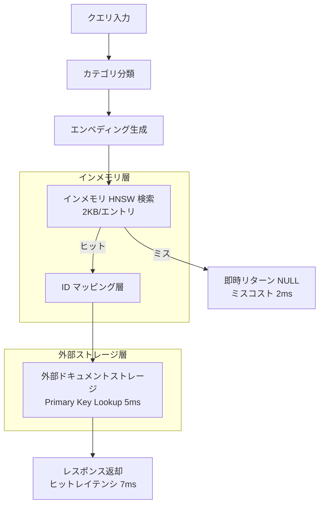
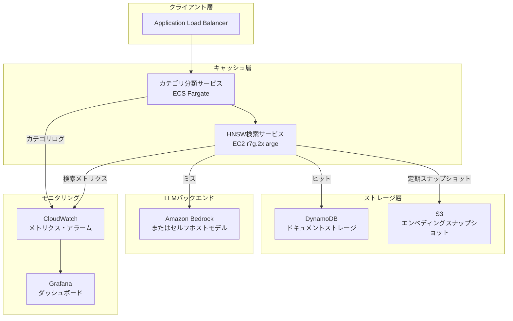

## 論文概要

本記事は [https://arxiv.org/abs/2510.26835](https://arxiv.org/abs/2510.26835) の解説記事です。

LLMサービングにおけるセマンティックキャッシュは、類似クエリの再計算を回避しレイテンシとコストを削減する手法として広く採用されているが、従来の均一キャッシュポリシー（固定閾値・固定TTL）は、異種ワークロードに対して深刻な非効率を生む。著者らは、クエリカテゴリごとに類似度閾値・TTL・メモリクォータを動的に調整する**Category-Aware Semantic Caching**フレームワークを提案している。さらに、インメモリHNSW検索と外部ドキュメントストレージを分離するハイブリッドアーキテクチャにより、ミスコストを30msから2msに削減し、低ヒット率カテゴリの損益分岐点を15-20%から3-5%へと引き下げることに成功したと報告している。

この記事は [Zenn記事: AIエージェント×セマンティックキャッシュ：ツール呼び出しとマルチターン対話を高速化する実装設計](https://zenn.dev/0h_n0/articles/803e53d2b2b872) の深掘りです。

## 情報源

- **arXiv ID**: 2510.26835
- **URL**: [https://arxiv.org/abs/2510.26835](https://arxiv.org/abs/2510.26835)
- **著者**: Chen Wang, Xunzhuo Liu, Yue Zhu, Alaa Youssef, Priya Nagpurkar, Huamin Chen
- **発表日**: 2025年10月29日
- **分野**: cs.DB, cs.AI, cs.LG
- **論文種別**: Position paper（13ページ、参考文献含む）

## 背景と動機

### 均一キャッシュポリシーの限界

LLMサービングシステムは多様なクエリタイプ（コード生成、会話、法律文書、医療相談など）を同時に処理する。著者らは、これらのクエリがエンベディング空間上で根本的に異なる分布特性を持つことを指摘している。

- **Dense空間（コード生成クエリ）**: エンベディングが密にクラスタリングされるため、固定閾値が低すぎると意味的に異なるクエリを同一と誤判定する（false positive）
- **Sparse空間（会話クエリ）**: エンベディングが疎に分布するため、固定閾値が高すぎると有効なパラフレーズを見逃す（false negative）

この問題は数値として顕著に現れる。著者らが示した本番ワークロードの特性を以下に示す（論文 Table 1より）。

| カテゴリ | トラフィック比率 | ヒット率 |
|---------|:----------:|:-----:|
| コード生成 | 35% | 55% |
| APIドキュメント | 25% | 45% |
| 会話チャット | 15% | 12% |
| 金融データ | 10% | 8% |
| 法律クエリ | 8% | 10% |
| 医療クエリ | 4% | 6% |
| 専門ドメイン | 3% | 7% |

高反復カテゴリ（コード生成・APIドキュメント）が40-55%のヒット率を達成する一方、低反復カテゴリ（金融・医療・法律）は均一ポリシーでは5-12%にとどまる。結果として**本番トラフィックの20-30%がキャッシュの恩恵を受けられない**状況が発生すると著者らは報告している。

### TTLの不一致問題

均一TTLもまた問題を引き起こす。APIドキュメントは数日間有効だが、金融データは数分で陳腐化する。固定TTLでは、前者にメモリを浪費するか、後者に陳腐データを配信するかのトレードオフを避けられない。

## 主要な貢献

著者らは以下の3つの貢献を主張している。

1. **カテゴリ別ポリシー設計**: クエリカテゴリごとに類似度閾値・TTL・メモリクォータを個別設定し、エンベディング空間の特性に最適化する枠組み
2. **ハイブリッドアーキテクチャ**: インメモリHNSW検索と外部ドキュメントストレージの分離により、ミスコスト30ms→2msを実現し、低ヒット率カテゴリを経済的に成立させる設計
3. **適応的負荷ベースポリシー**: リアルタイムの負荷状況に応じて閾値・TTLを動的に調整し、過負荷モデルへのトラフィックを9-17%削減する理論的枠組み（著者らは理論的予測値と明記しており、実証検証は今後の課題としている）

## 技術的詳細

### カテゴリ別の閾値・TTL設計

カテゴリ別ポリシーの核心は、各カテゴリのエンベディング空間特性に応じて3つのパラメータを個別に設定する点にある。

| パラメータ | Dense空間（コード等） | Sparse空間（会話等） |
|-----------|:---:|:---:|
| 類似度閾値 | 高（0.92-0.95） | 低（0.80-0.85） |
| TTL | 長（24-72時間） | 短（5-60分） |
| メモリクォータ | トラフィック比率に応じて動的割当 | 同左 |

Dense空間ではコードクエリが密にクラスタリングされるため、類似度閾値を高く設定しないとfalse positiveが多発する。一方、Sparse空間では会話のパラフレーズ（同じ意図の言い換え）を捕捉するために閾値を下げる必要がある。著者らは、閾値にはカテゴリ固有の下限を設定し、false positiveの抑制を保証すべきだと述べている（Dense空間では0.80が最低閾値として推奨されている）。

### ハイブリッドアーキテクチャ

本論文の中核的な技術革新は、検索（Search）と保存（Storage）の分離である。



#### インメモリ層の構成

- **HNSWグラフ**: 384次元エンベディング（約1.5KB/エントリ）
- **カテゴリメタデータ**: 閾値・TTL・優先度
- **合計メモリ**: 約2KB/エントリ（ドキュメント本体を含む場合の数十KBと比較して大幅に削減）
- **IDマッピング層**: HNSWインデックス位置と外部ストレージの識別子を接続

#### レイテンシ特性

著者らが報告しているレイテンシを以下に示す。

| 操作 | レイテンシ |
|------|:------:|
| ベクトルDB検索（従来方式） | 31ms（ミス率80%時の平均） |
| ハイブリッドHNSW検索 | 3.0ms（同条件） |
| ヒット時の合計レイテンシ | 7ms（HNSW 2ms + ドキュメント取得 5ms） |
| ミス時のレイテンシ | 2ms（即時リターン） |

**重要な設計判断**: HNSWで閾値を超えるマッチが見つからない場合、外部ストレージへのアクセスを行わずに**即時にNULLを返す**。この「ミス時に何もしない」設計が、ベクトルDBのミス時30msを2msに削減する鍵である。従来のベクトルDB方式では、ミスの場合でも30msのリモート検索コストが発生していた。

#### HNSW検索の最適化

著者らは、標準的なHNSW検索に対して2つの最適化を適用している。

1. **閾値ベースの早期終了**: k近傍すべてを探索する代わりに、カテゴリ閾値を超える最初のマッチが見つかった時点で探索を終了する
2. **カテゴリ閾値のトラバーサル時適用**: ポスト検索フィルタリングではなく、HNSWグラフのトラバーサル中に閾値を適用する

計算量は $O(\log n)$ であり、著者らは100万エントリで2-3ms、1000万エントリで5-8msと報告している。1000万エントリを超える場合はシャーディングを推奨している。

### 適応的負荷ベースポリシー

リアルタイムの負荷状況に応じて閾値とTTLを動的に調整する仕組みである。著者らは負荷係数 $\lambda$ を以下のように定義している。

$$
\lambda = \min\left(1,\ \frac{L_p}{L_{\text{target}}} \cdot w_L + \frac{Q}{Q_{\text{target}}} \cdot w_Q\right)
$$

ここで、$L_p$ は現在のレイテンシ、$L_{\text{target}}$ は目標レイテンシ、$Q$ は現在のキュー長、$Q_{\text{target}}$ は目標キュー長、$w_L$ と $w_Q$ はそれぞれの重みである。

この負荷係数に基づき、2つのパラメータが動的に調整される。

**閾値の緩和**:

$$
\tau(\lambda) = \tau_0 - \lambda \cdot \delta_{\max}
$$

$\tau_0$ はベース閾値、$\delta_{\max}$ は最大緩和幅である。負荷が高くなるほど閾値が下がり、より多くのクエリがキャッシュヒットするようになる。

**TTLの延長**:

$$
t(\lambda) = t_0 \cdot (1 + \lambda \cdot (\beta_{\max} - 1))
$$

$t_0$ はベースTTL、$\beta_{\max}$ は最大延長係数である。負荷が高くなるほどTTLが延長され、キャッシュの有効期間が長くなる。

著者らは、ベースヒット率40%のカテゴリで閾値を0.05緩和した場合、ヒット率が50%に上昇し、モデルトラフィックが約16.7%（= 0.10 / 0.60）削減される理論的予測を示している。ただし、閾値にはカテゴリ固有の最低値が設定されており（Dense空間では0.80）、false positiveの増大を防止する安全弁として機能する。

**TTL延長のトレードオフに関する注意**: 著者らは、TTL延長には鮮度劣化のリスクが伴うことを明示している。例として、5分TTLの株価データに対し変化率20%/分を仮定すると、TTLを15分に延長した場合の陳腐データ率は20%から60%に増加する。このため、TTL延長はデータの鮮度要件が比較的緩いカテゴリに限定すべきであると述べている。

### 損益分岐点分析

本論文の経済的分析は、ハイブリッドアーキテクチャの価値を定量的に示す重要な部分である。

#### ベクトルDB方式の損益分岐条件

キャッシュが有益となる条件は以下の不等式で表される。

$$
h > \frac{30}{T_{\text{llm}} - 5}
$$

$h$ はヒット率、$T_{\text{llm}}$ はLLM推論レイテンシ（ms）である。30msはリモートベクトルDB検索コスト、5msはキャッシュヒット時のオーバーヘッドに相当する。

- $T_{\text{llm}} = 200\text{ms}$ の場合: $h > 15.4\%$
- $T_{\text{llm}} = 500\text{ms}$ の場合: $h > 6.1\%$

#### ハイブリッド方式の損益分岐条件

ミスコストが2msに削減されると不等式は以下のように変わる。

$$
h > \frac{2}{T_{\text{llm}} - 5}
$$

- $T_{\text{llm}} = 200\text{ms}$ の場合: $h > 1.0\%$
- $T_{\text{llm}} = 500\text{ms}$ の場合: $h > 0.4\%$

これは**10-15倍の改善**であり、従来のベクトルDB方式では経済的に成立しなかった低ヒット率カテゴリ（金融8%、医療6%、法律10%など）がすべてキャッシュ可能になることを意味する。著者らは、「ミスコストはヒット率が5%でも50%でも2msのまま」と強調しており、これがハイブリッド方式の根本的な優位性であると主張している。

### 動的クォータ管理

メモリクォータは各カテゴリのトラフィック比率とヒット率に基づいて動的に割り当てられる。著者らは具体的なクォータ配分アルゴリズムの詳細は本論文では提示しておらず、カテゴリごとのメモリ割当を動的に調整する枠組みの必要性を論じている。インメモリ層のエントリサイズが約2KBと小さいため、100万エントリでも約2GBのメモリで済む点が、動的配分を実用的にしている。

## 実装のポイント

### Cache Lookupアルゴリズム

著者らが論文中で提示しているアルゴリズムの主要ステップを以下に示す。

```python
from dataclasses import dataclass
from typing import Optional


@dataclass(frozen=True)
class CategoryConfig:
    """カテゴリ別キャッシュ設定（イミュータブル）."""

    category: str
    threshold: float
    ttl_seconds: int
    allow_caching: bool
    max_quota_entries: int


@dataclass(frozen=True)
class CacheResult:
    """キャッシュ検索結果."""

    hit: bool
    document: Optional[str] = None
    latency_ms: float = 0.0


def cache_lookup(
    query: str,
    category_config: CategoryConfig,
    hnsw_index: "HNSWIndex",
    external_store: "ExternalStore",
    embedder: "Embedder",
) -> CacheResult:
    """カテゴリ別キャッシュ検索.

    論文 Algorithm 1 に基づく実装。
    1. カテゴリ設定を取得
    2. キャッシュ許可フラグを確認
    3. クエリエンベディングを生成
    4. HNSW検索（カテゴリ閾値で早期終了）
    5. ミス時は即時リターン（外部アクセスなし）
    6. ヒット時はTTL検証後に外部ストレージからドキュメント取得

    Args:
        query: 検索クエリ文字列
        category_config: カテゴリ別設定
        hnsw_index: インメモリHNSWインデックス
        external_store: 外部ドキュメントストレージ
        embedder: エンベディング生成器

    Returns:
        CacheResult: ヒット/ミスとドキュメント

    """
    # Step 1-2: コンプライアンスチェック
    if not category_config.allow_caching:
        return CacheResult(hit=False, latency_ms=0.1)

    # Step 3: エンベディング生成
    query_embedding = embedder.encode(query)

    # Step 4: HNSW検索（カテゴリ閾値で早期終了）
    match = hnsw_index.search_with_threshold(
        query_embedding,
        threshold=category_config.threshold,
        early_stop=True,  # 閾値超えの最初のマッチで終了
    )

    # Step 5: ミス時は即時リターン（外部アクセスなし = 2ms）
    if match is None:
        return CacheResult(hit=False, latency_ms=2.0)

    # Step 6: TTL検証
    if match.is_expired(category_config.ttl_seconds):
        hnsw_index.evict(match.entry_id)
        return CacheResult(hit=False, latency_ms=2.5)

    # Step 7: 外部ストレージからドキュメント取得（Primary Key Lookup = 5ms）
    document = external_store.fetch_by_id(match.document_id)
    return CacheResult(hit=True, document=document, latency_ms=7.0)
```

### スケーラビリティ指針

著者らが報告しているスケーリング特性は以下の通りである。

| エントリ数 | HNSW検索レイテンシ | 推定メモリ |
|:---------:|:----------:|:------:|
| 100万 | 2-3ms | 約2GB |
| 1000万 | 5-8ms | 約20GB |
| 1000万超 | シャーディング推奨 | - |

## Production Deployment Guide

### AWSにおけるカテゴリ別キャッシュ基盤の構成

本論文のハイブリッドアーキテクチャをAWS上に展開する場合の参考構成を示す。以下は論文の設計思想に基づく構成案であり、実際の導入時にはワークロード特性に応じた検証が必要である。

#### アーキテクチャ概要



#### コンポーネント選定

**インメモリHNSW検索**: EC2 `r7g.2xlarge`（メモリ最適化、64GB RAM）を推奨。100万エントリ（約2GB）であれば十分な余裕がある。1000万エントリ（約20GB）の場合は `r7g.4xlarge`（128GB RAM）を検討する。Graviton3プロセッサにより、Intel系と比較してコストパフォーマンスが高い。

**外部ドキュメントストレージ**: DynamoDB（オンデマンドキャパシティモード）。Primary Key Lookupに特化した設計であり、論文が想定する5msのレイテンシ要件を満たせる。DAX（DynamoDB Accelerator）を併用すれば1ms未満も可能だが、メモリコストとの兼ね合いで判断する。

**カテゴリ分類**: ECS Fargateで軽量な分類モデル（またはルールベース）を運用。クエリプレフィックスやAPI呼び出し元による分類が低レイテンシで実用的である。

#### Terraformによるインフラ定義（抜粋）

```hcl
# HNSW検索サービス用EC2
resource "aws_instance" "hnsw_search" {
  ami           = data.aws_ami.al2023_arm64.id
  instance_type = "r7g.2xlarge"

  root_block_device {
    volume_type = "gp3"
    volume_size = 100
    iops        = 3000
    throughput  = 125
  }

  tags = {
    Name        = "category-cache-hnsw"
    Environment = "production"
    Service     = "semantic-cache"
  }
}

# ドキュメントストレージ（DynamoDB）
resource "aws_dynamodb_table" "cache_documents" {
  name         = "semantic-cache-documents"
  billing_mode = "PAY_PER_REQUEST"
  hash_key     = "document_id"

  attribute {
    name = "document_id"
    type = "S"
  }

  ttl {
    attribute_name = "expires_at"
    enabled        = true
  }

  point_in_time_recovery {
    enabled = true
  }

  tags = {
    Service = "semantic-cache"
  }
}

# カテゴリ設定テーブル
resource "aws_dynamodb_table" "category_config" {
  name         = "semantic-cache-category-config"
  billing_mode = "PAY_PER_REQUEST"
  hash_key     = "category"

  attribute {
    name = "category"
    type = "S"
  }

  tags = {
    Service = "semantic-cache"
  }
}
```

#### モニタリング設計

論文の成果を本番環境で活かすには、カテゴリ別のメトリクス監視が不可欠である。

```python
import time
from dataclasses import dataclass, field


@dataclass
class CategoryMetrics:
    """カテゴリ別キャッシュメトリクス.

    CloudWatch Custom Metricsとして送信する。
    """

    category: str
    hits: int = 0
    misses: int = 0
    false_positives: int = 0
    ttl_expirations: int = 0
    avg_search_latency_ms: float = 0.0
    _latencies: list[float] = field(default_factory=list, repr=False)

    @property
    def hit_rate(self) -> float:
        """ヒット率を計算."""
        total = self.hits + self.misses
        if total == 0:
            return 0.0
        return self.hits / total

    @property
    def is_above_breakeven(self) -> bool:
        """損益分岐点（3-5%）を超えているか判定.

        ハイブリッドアーキテクチャの損益分岐点は
        T_llm=200msで約1.0%、T_llm=500msで約0.4%だが、
        運用マージンを含めて3%を基準とする。
        """
        return self.hit_rate >= 0.03

    def record_search(self, hit: bool, latency_ms: float) -> None:
        """検索結果を記録."""
        if hit:
            self.hits += 1
        else:
            self.misses += 1
        self._latencies.append(latency_ms)
        self.avg_search_latency_ms = sum(self._latencies) / len(self._latencies)

    def to_cloudwatch_dimensions(self) -> list[dict[str, str]]:
        """CloudWatch用のディメンション生成."""
        return [
            {"Name": "Category", "Value": self.category},
            {"Name": "Service", "Value": "semantic-cache"},
        ]
```

**アラーム設計のポイント**:

| メトリクス | 閾値 | アクション |
|-----------|------|----------|
| カテゴリ別ヒット率 | < 3%（損益分岐点以下） | カテゴリ設定の見直し通知 |
| 検索レイテンシp99 | > 10ms | HNSWインデックス再構築検討 |
| false positive率 | > 5% | 閾値の引き上げ |
| メモリ使用率 | > 80% | クォータ再配分 or スケールアップ |

#### コスト見積もり（2026年5月時点の参考値）

以下は100万エントリ規模でのAWSコスト概算である。実際のコストはリージョン・利用パターン・契約形態により変動する。

| コンポーネント | インスタンス/設定 | 月額概算（USD） |
|-------------|----------------|:----------:|
| HNSW検索（EC2） | r7g.2xlarge × 2（冗長構成） | $540 |
| DynamoDB | オンデマンド、100万reads/日 | $80 |
| ALB | 1台 | $25 |
| ECS Fargate（分類） | 0.5 vCPU × 1GB × 2タスク | $35 |
| CloudWatch | カスタムメトリクス20個 | $6 |
| S3（スナップショット） | 50GB + 転送 | $3 |
| **合計** | | **約$690/月** |

この$690/月のキャッシュ基盤により、LLM推論コストの削減が見込める。論文のデータに基づくと、コード生成（55%ヒット率）とAPIドキュメント（45%ヒット率）だけで全トラフィックの60%をカバーし、さらにハイブリッドアーキテクチャにより残りのロングテールカテゴリも3-5%以上のヒット率があれば経済的に成立する。

#### デプロイ前チェックリスト

- [ ] カテゴリ分類ロジックのテスト（クエリ1000件の手動分類との一致率95%以上）
- [ ] カテゴリ別閾値の初期値設定（Dense: 0.92、Sparse: 0.82を起点に調整）
- [ ] HNSWインデックスのウォームアップ手順確認
- [ ] DynamoDB TTLの設定（カテゴリ別TTLの最大値 + バッファ）
- [ ] フォールバック経路の確認（キャッシュ障害時にLLMバックエンドへ直接ルーティング）
- [ ] カテゴリ別メトリクスダッシュボードの構築
- [ ] 負荷テスト（目標: 1000 QPS、p99 < 15ms）
- [ ] false positive検出の仕組み（サンプリングによるヒット品質検証）

## 実験結果

### カテゴリ別ヒット率

著者らは、カテゴリ別ポリシーの効果を以下のように報告している。

均一ポリシーでは、高反復カテゴリ（コード生成・APIドキュメント）で40-60%のヒット率を達成する一方、低反復カテゴリ（金融・医療・法律・専門ドメイン）では5-15%にとどまる。カテゴリ別ポリシーの導入により、各カテゴリのエンベディング空間特性に最適化された閾値を適用できるようになるが、著者らはヒット率の絶対値よりも**経済的な実行可能性の変化**に重点を置いている。

### トラフィック削減

適応的負荷ベースポリシーによるトラフィック削減効果について、著者らは以下の理論的予測値を示している。

- 閾値を0.05緩和した場合: ベースヒット率に応じて**9-17%のモデルトラフィック削減**
- ベースヒット率40%のカテゴリの例: ヒット率50%への上昇で $0.10 / 0.60 \approx 16.7\%$ の削減

著者らは、これらが理論的予測であり、実証的検証（empirical validation）は今後の課題であると明記している点に注意が必要である。

### レイテンシ削減

ハイブリッドアーキテクチャによるレイテンシ改善は以下の通りである（論文より引用）。

- **ベクトルDB方式**: 平均31ms（ミス率80%時）
- **ハイブリッド方式**: 平均3.0ms（同条件）
- **改善率**: 約90%のレイテンシ削減

ヒット時のレイテンシは7ms（HNSW検索2ms + ドキュメント取得5ms）であり、ミス時は2ms（外部アクセスなし）である。

## 実運用への応用

### Zenn記事のツールベースTTLとの関連

Zenn記事「AIエージェント×セマンティックキャッシュ」で紹介されているツール呼び出しキャッシュのTTL設計は、本論文のカテゴリ別TTL設計と直接的に関連する。

Zenn記事では、エージェントのツール呼び出し（Web検索、DB検索、計算など）ごとにTTLを設定する設計パターンが紹介されている。本論文のカテゴリ別TTL設計は、この「ツール種別ごとのTTL」をより体系的に定式化したものと位置づけられる。

| Zenn記事のツール種別 | 本論文のカテゴリ | TTL設計の共通点 |
|-----------------|-------------|-------------|
| Web検索ツール | 会話・一般クエリ | 短TTL（結果が頻繁に変化） |
| DB検索ツール | APIドキュメント | 中TTL（構造化データは安定） |
| 計算ツール | コード生成 | 長TTL（決定的な結果） |

### マルチターン対話への適用

本論文のカテゴリ分類は、マルチターン対話においてターンごとにカテゴリが変化する状況にも適用可能である。例えば、最初のターンが「会話チャット」（Sparse空間、低閾値）で、2ターン目がコード生成依頼（Dense空間、高閾値）に切り替わる場合、カテゴリ別ポリシーにより各ターンに最適な閾値が自動的に適用される。

### 導入時の注意点

1. **カテゴリ分類の精度**: カテゴリ分類の誤りは閾値のミスマッチを引き起こすため、分類精度が全体の性能を律速する
2. **cold start問題**: 新規カテゴリのポリシーパラメータをどのように初期設定するかは、論文では詳細に議論されていない
3. **カテゴリ粒度のトレードオフ**: 粒度が粗すぎると均一ポリシーに近づき、細かすぎると設定の管理コストが増大する

## 関連研究

著者らが論文中で言及している関連研究を以下に示す。

- **MeanCache (2024)**: ユーザー中心のセマンティックキャッシュ。ユーザー単位のキャッシュ管理に焦点を当てており、本論文のカテゴリ単位の管理とは異なるアプローチを取る
- **KVShare (2025)**: マルチテナント環境でのKVキャッシュ再利用。LLMの内部KVキャッシュを複数のリクエスト間で共有する手法であり、本論文のセマンティックレベルのキャッシュとは補完的な関係にある
- **VaryGen (2024)**: セマンティックキャッシュのテスト入力生成。キャッシュの品質評価・テストに焦点を当てた研究であり、本論文のカテゴリ別ポリシー設計とは異なる側面からキャッシュ最適化に貢献する
- **HNSW (Malkov & Yashunin, 2020)**: 本論文のインメモリ検索層の基盤技術。近似最近傍探索グラフとして広く使われており、$O(\log n)$ の検索計算量を提供する
- **Milvus, Qdrant, Weaviate**: 本論文が「従来方式」として比較対象にしているベクトルデータベース群。リモート検索コスト30msが本論文のハイブリッドアーキテクチャの動機となっている

## 制約と限界

本論文はPosition paperであり、以下の制約がある点を明記しておく。

1. **実証実験の不足**: 著者らは理論的分析と設計原則を提示しているが、本番環境での大規模な実証実験は報告されていない。トラフィック削減率（9-17%）は理論的予測値である
2. **カテゴリ分類の詳細未記述**: カテゴリの定義方法・分類アルゴリズム・新規カテゴリの追加手順など、実装上の重要な詳細が十分に議論されていない
3. **動的クォータ管理の具体的アルゴリズム未提示**: クォータ配分の具体的なアルゴリズムは今後の研究課題とされている
4. **false positive率の定量評価**: 閾値緩和時のfalse positive増加がユーザー体験に与える影響の定量的分析が不足している

## まとめ

本論文は、LLMサービングにおける異種ワークロードのキャッシュ最適化に対して、カテゴリ別ポリシーとハイブリッドアーキテクチャという2つの軸から解決策を提示している。

技術的な核心は、**検索（インメモリHNSW）と保存（外部ストレージ）の分離**によるミスコスト削減（30ms→2ms）であり、これにより低ヒット率カテゴリの損益分岐点が15-20%から3-5%へと引き下がる。従来のベクトルDB方式では経済的に成立しなかったロングテールカテゴリ（本番トラフィックの20-30%）にキャッシュの恩恵を拡張できる可能性を示した点が、本論文の主要な貢献である。

Position paperとしての限界（実証実験の不足、カテゴリ分類の詳細未記述など）はあるものの、均一ポリシーの限界を体系的に分析し、カテゴリ認識型の設計原則を提示した点で、今後のセマンティックキャッシュ研究の方向性を示す重要な研究である。Zenn記事で紹介されているエージェントのツール呼び出しキャッシュ設計と組み合わせることで、より実践的なカテゴリ別キャッシュ戦略の構築が可能になると考えられる。

## 参考文献

- **arXiv**: [https://arxiv.org/abs/2510.26835](https://arxiv.org/abs/2510.26835)
- **MeanCache**: User-Centric Semantic Caching for LLM Web Services (2024)
- **KVShare**: Multi-tenant KV Cache Reuse (2025)
- **VaryGen**: Test Input Generation for Semantic Caches (2024)
- **HNSW**: Malkov, Y. A., & Yashunin, D. A. (2020). Efficient and Robust Approximate Nearest Neighbor Using Hierarchical Navigable Small World Graphs
- **Related Zenn article**: [https://zenn.dev/0h_n0/articles/803e53d2b2b872](https://zenn.dev/0h_n0/articles/803e53d2b2b872)
