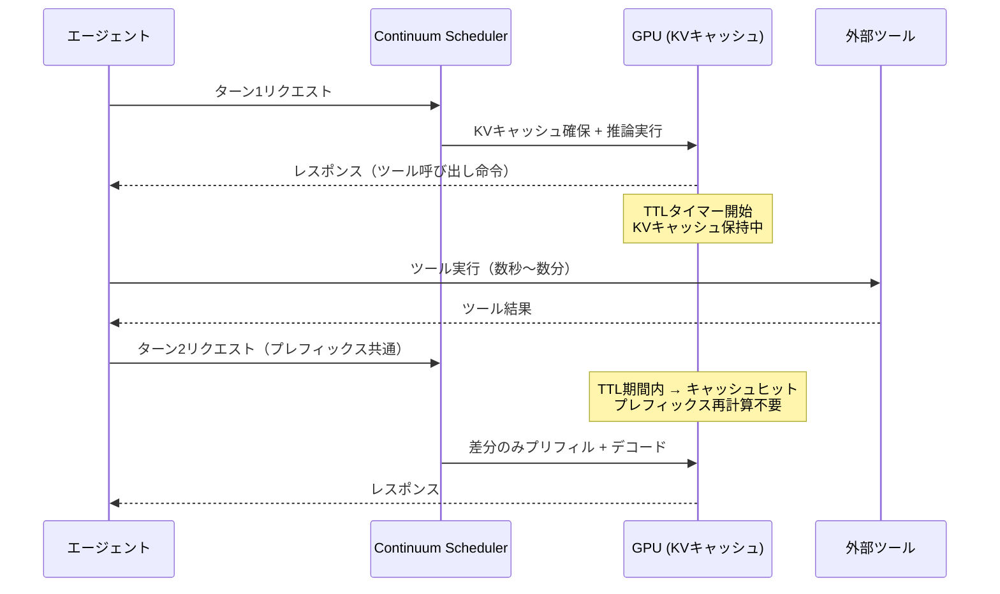
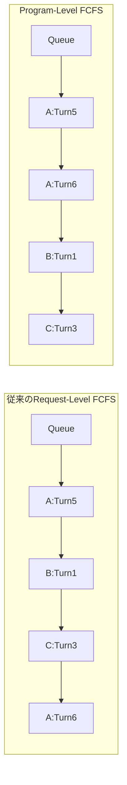

本記事は [Continuum: Efficient and Robust Multi-Turn LLM Agent Scheduling with KV Cache Time-to-Live](https://arxiv.org/abs/2511.02230) の解説記事です。

## 論文概要（Abstract）

LLMを用いたエージェントシステムでは、モデル推論とツール実行（Web検索、コード実行、API呼び出しなど）が交互に繰り返される。従来のLLM推論サービングシステムは、リクエスト完了時にKVキャッシュを即座に破棄する設計であったため、ツール実行後にモデルを再度呼び出す際にKVキャッシュの再計算が必要となり、レイテンシとスループットの両面で大きなオーバーヘッドが発生していた。

著者らは、この問題を解決するために**Continuum**を提案している。Continuumは、各リクエストに**TTL（Time-to-Live）**を付与してKVキャッシュのGPU保持期間を制御する仕組みと、エージェントプログラム単位の**Program-Level FCFSスケジューリング**を組み合わせたサービングシステムである。vLLM上に約1,000行のPythonで実装され、SWE-agentワークロードにおいてジョブ完了時間を最大8.18倍改善したと報告されている（論文Table 2）。

この記事は [Zenn記事: AIエージェント×セマンティックキャッシュ：ツール呼び出しとマルチターン対話を高速化する実装設計](https://zenn.dev/0h_n0/articles/803e53d2b2b872) の深掘りです。

## 情報源

- **arXiv ID**: 2511.02230
- **URL**: [https://arxiv.org/abs/2511.02230](https://arxiv.org/abs/2511.02230)
- **著者**: Hanchen Li, Runyuan He, Qiuyang Mang, Qizheng Zhang, Huanzhi Mao, Xiaokun Chen, Hangrui Zhou, Alvin Cheung, Joseph Gonzalez, Ion Stoica（UC Berkeley）
- **発表年**: 2025年11月（2026年5月改訂）
- **分野**: cs.OS, cs.AI, cs.NI

## 背景と動機（Background & Motivation）

### エージェントワークロードの特性

従来のLLMサービング（チャットボットや単発の文章生成）では、1回のリクエスト-レスポンスでインタラクションが完結する。しかし、LLMエージェントのワークロードには以下の特徴がある。

1. **マルチターン構造**: 1つのタスク（プログラム）が数十ターンのLLM呼び出しを含む。SWE-agentでは平均30ターン以上
2. **ツール実行による一時停止**: 各ターンの間にツール実行（数秒〜数分）が挟まり、その間GPUはアイドル状態となる
3. **コンテキスト蓄積**: 前のターンの出力がすべて次のターンの入力に含まれ、プレフィックスが継続的に成長する

### 既存システムの2つの劣化要因

著者らは、従来のエンド・オブ・ターンKVキャッシュ破棄が引き起こす2つの性能劣化を指摘している（論文Section 1）。

**劣化1: KVキャッシュの再計算コスト**

ツール実行中にKVキャッシュが破棄されるため、次のターンで同一プレフィックスを再度プリフィル処理する必要がある。ターン数が増えるほどプレフィックス長は伸び、再計算コストは加速度的に増大する。

**劣化2: キューイング遅延の累積**

各ターンで新規リクエストとして待ち行列に並ぶため、ターンごとに待ち時間が発生する。30ターンのエージェントプログラムでは、キューイング遅延だけで数分規模になりうる。

### Prefix Cachingの限界

vLLMのプレフィックスキャッシュ機能はこの問題を部分的に緩和するが、限界がある。プレフィックスキャッシュはGPUメモリが不足すると古いエントリを破棄するため、並行プログラム数が増えるとキャッシュミスが頻発する。著者らの実験では、高負荷時にプレフィックスキャッシュのヒット率が大幅に低下することが報告されている（論文Figure 3）。

## 主要な貢献（Key Contributions）

Continuumの主要な貢献は以下の3点である。

1. **TTLベースのKVキャッシュ保持メカニズム**: ツール実行中にKVキャッシュをGPU上に保持する期間をTTLで制御する仕組みを提案。コスト便益モデルに基づき、保持による期待利益と、他のリクエストへの機会コストを定量的に比較してTTL値を決定する

2. **Program-Level FCFSスケジューリング**: リクエスト単位ではなくプログラム（エージェントタスク）単位でFCFS（先着順）スケジューリングを行い、プログラム間のバブルタイム（待機時間）を削減する

3. **デッドロック防止メカニズム**: TTL保持とメモリ上限の競合によるデッドロックを防止するKVキャッシュ解放プロトコルを設計し、システムの堅牢性を担保する

## 技術的詳細（Technical Details）

### TTLベースのKVキャッシュ保持メカニズム

Continuumの中核は、リクエスト完了時にKVキャッシュを即座に破棄するのではなく、TTLで指定された期間だけGPU上に保持する仕組みである。



従来システムでは、ツール実行中にKVキャッシュが破棄されるため、ターン2で全プレフィックスの再計算が必要であった。Continuumでは、TTL期間内に次のターンが到着すればキャッシュヒットとなり、差分トークンのみのプリフィルで済む。

### コスト便益モデル

TTL値の決定には、保持による利益と機会コストのトレードオフを定量的に評価するモデルが使用される。著者らは以下の式を提案している（論文Section 4.2）。

$$
\text{Net Benefit}(TTL) = \underbrace{P_{\text{hit}}(TTL) \cdot S_{\text{recomp}}}_{\text{Expected Benefit}} - \underbrace{C_{\text{mem}}(TTL) \cdot T_{\text{hold}}}_{\text{Opportunity Cost}}
$$

各項の意味は以下の通りである。

- $P_{\text{hit}}(TTL)$: TTL期間内に次のターンが到着する確率。ツール実行時間の分布から推定される
- $S_{\text{recomp}}$: KVキャッシュの再計算を回避した場合の節約時間。プレフィックス長に比例する
- $C_{\text{mem}}(TTL)$: TTL期間中にKVキャッシュが占有するGPUメモリの量
- $T_{\text{hold}}$: 実際の保持期間

Net Benefitが正であればKVキャッシュを保持する価値があり、負であれば即座に解放したほうがシステム全体の効率が上がる。

### Memoryfulness Factor $\eta$

著者らは、エージェントプログラムの進行に伴い残りの作業量がどの程度予測可能かを表す**memoryfulness factor** $\eta$ を導入している（論文Section 4.3）。

$$
\eta = \frac{\text{Var}[\text{remaining turns}]}{\text{Var}_{\text{memoryless}}[\text{remaining turns}]}
$$

- $\eta = 1$: メモリレス（指数分布）。過去のターン数が将来を予測しない
- $\eta < 1$: 残りターン数が予測しやすい（例: 固定長パイプライン）
- $\eta > 1$: 残りターン数の分散が大きい（例: 探索的エージェント）

$\eta$ が小さいほどツール実行時間の予測精度が高くなるため、TTLを精密に設定でき、メモリの無駄遣いを抑えられる。SWE-agentのような探索的エージェントでは $\eta$ が大きくなる傾向があり、保守的な（長めの）TTL設定が有効であると報告されている。

### Program-Level FCFSスケジューリング

従来のLLMサービングシステムでは、各ターンのリクエストを独立したジョブとしてFCFS（先着順処理）でスケジューリングする。この場合、エージェントプログラムAのターン5とプログラムBのターン1が同時にキューにあると、到着順で処理される。

Continuumは**プログラム単位**のFCFSスケジューリングを採用する。つまり、プログラムの最初のターンの到着時刻で優先度を決定し、同一プログラムの後続ターンは先に到着した他プログラムのターンより優先される。



この方式により、先に到着したプログラムのターンが連続処理され、バブルタイム（ツール実行待ちによるGPUアイドル期間）を後発プログラムの処理で埋めることができる。著者らは、この方式がプログラム全体のジョブ完了時間（JCT: Job Completion Time）を大幅に改善すると報告している。

### デッドロック防止メカニズム

TTLベースのKVキャッシュ保持は、GPUメモリの枯渇リスクを伴う。複数のプログラムが同時にKVキャッシュをTTL保持中で、新規リクエストを処理するメモリが確保できない場合、デッドロックが発生しうる。

著者らは以下の3段階の解放プロトコルを設計している（論文Section 4.4）。

1. **TTL期限切れキャッシュの解放**: まずTTLが超過したキャッシュを解放する
2. **最長TTL残存キャッシュの早期解放**: TTL期限内であっても、残存TTLが最も長い（次のターンが最も遅く到着すると予測される）キャッシュから順に解放する
3. **実行中リクエストのプリエンプション**: 上記2段階で不足する場合のみ、実行中の低優先度リクエストをプリエンプトする

この段階的アプローチにより、通常運用時のキャッシュヒット率を維持しつつ、極端な高負荷時にもシステムが停止しない堅牢性を実現している。

## 実装のポイント（Implementation）

Continuumはvllm（vLLM）上に約1,000行のPythonで実装されている（論文Section 5）。主な変更点は以下の通りである。

### vLLMへの統合

既存のvLLMアーキテクチャへの変更は最小限に抑えられている。

1. **Schedulerの拡張**: vLLMの`Scheduler`クラスを継承し、プログラムIDごとのキュー管理とTTLベースの保持判定ロジックを追加
2. **Block Managerの拡張**: KVキャッシュブロックにTTLメタデータを付与し、解放判定を既存のLRUエビクションからTTL考慮型に変更
3. **API拡張**: リクエストにプログラムIDとTTLヒントを付与するフィールドを追加

### APIインターフェース

エージェントフレームワーク側では、リクエスト送信時にプログラムIDを指定する。Continuum側がTTLを自動計算するため、アプリケーション側での明示的なTTL指定は不要である。

```python
# エージェントフレームワークからの呼び出しイメージ（論文の記述に基づく）
from openai import OpenAI

client = OpenAI(base_url="http://localhost:8000/v1")

response = client.chat.completions.create(
    model="meta-llama/Llama-3-70B",
    messages=conversation_history,
    extra_body={
        "program_id": "swe-agent-task-42",   # プログラム識別子
        "turn_number": 5,                      # 現在のターン番号
    }
)
```

### メモリオーバーヘッド

TTLメタデータの管理に必要な追加メモリは、KVキャッシュ全体に比べて無視できるレベルであると報告されている。プログラムごとのキュー管理テーブルも$O(N_{\text{programs}})$程度のメモリで済む。

## Production Deployment Guide

### AWS実装パターン（エージェントワークロード最適化）

ContinuumのTTLベースKVキャッシュ管理をAWS上で実現する構成を示す。エージェントワークロードでは、ツール実行中のGPUアイドル時間をいかに活用するかが鍵となる。

| 規模 | 月間エージェントタスク | 推奨構成 | 月額コスト | 主要サービス |
|------|:---:|:---:|:---:|:---:|
| **Small** | ~500タスク | 単一GPU | $1,200-2,000 | EC2 g5.2xlarge + ALB |
| **Medium** | ~5,000タスク | マルチGPU | $5,000-10,000 | EC2 g5.12xlarge + ElastiCache |
| **Large** | 50,000+タスク | GPUクラスタ | $20,000-50,000 | EKS + p4d.24xlarge + S3 |

**Small構成の詳細** (月額$1,200-2,000):
- **EC2 g5.2xlarge**: NVIDIA A10G 24GB, 8 vCPU, 32GB RAM ($686/月 On-Demand、Spot: ~$205/月)
- g5.xlargeではなくg5.2xlargeを推奨する理由: エージェントワークロードではツール実行中も複数プログラムのKVキャッシュを同時保持する必要があるため、32GB RAMによるCPUスワップ領域の余裕が重要
- **ALB**: エージェントフレームワークからのHTTPリクエストルーティング

**Medium構成の詳細** (月額$5,000-10,000):
- **EC2 g5.12xlarge**: NVIDIA A10G x4 (96GB VRAM合計), 48 vCPU, 192GB RAM ($4,018/月 On-Demand)
- 4GPU構成によりテンソル並列でLlama-3-70Bクラスのモデルをサービング可能
- **ElastiCache (Redis)**: プログラムID→インスタンスのマッピング管理、TTLメタデータの集中管理

**Large構成の詳細** (月額$20,000-50,000):
- **EKS + p4d.24xlarge**: NVIDIA A100 x8 (640GB VRAM合計) を複数ノードでクラスタ化
- Kubernetesのカスタムスケジューラで、Continuumのプログラムレベルスケジューリングをクラスタレベルに拡張
- **S3**: ツール実行結果やエージェントログの永続化

**コスト試算の注意事項**: 上記は2026年5月時点のAWS ap-northeast-1リージョン料金に基づく概算値です。Spot Instancesの価格は需給により変動します。エージェントワークロードではタスク中断が許容しにくいため、Small構成以外ではOn-DemandまたはReserved Instancesを推奨します。最新料金は[AWS料金計算ツール](https://calculator.aws/)で確認してください。

### Terraformインフラコード

**Small構成: EC2 GPU + Continuum vLLMサーバ**

```hcl
resource "aws_instance" "continuum_server" {
  ami           = "ami-0abcdef1234567890"  # Deep Learning AMI (Ubuntu 22.04)
  instance_type = "g5.2xlarge"

  root_block_device {
    volume_size = 200
    volume_type = "gp3"
    iops        = 3000
    throughput  = 125
  }

  user_data = <<-EOF
    #!/bin/bash
    # vLLM + Continuum セットアップ
    pip install vllm
    # Continuum パッチ適用（論文実装に基づく）
    git clone https://github.com/continuum-llm/continuum.git
    cd continuum && pip install -e .

    # Continuum付きvLLMサーバ起動
    python -m vllm.entrypoints.openai.api_server \
      --model meta-llama/Llama-3-8B-Instruct \
      --gpu-memory-utilization 0.90 \
      --max-num-seqs 64 \
      --enable-prefix-caching \
      --scheduler-policy continuum \
      --ttl-strategy cost-benefit \
      --port 8000
  EOF

  tags = {
    Name    = "continuum-vllm-inference"
    Purpose = "agent-kv-cache-ttl"
  }
}

resource "aws_lb" "continuum_alb" {
  name               = "continuum-alb"
  internal           = true
  load_balancer_type = "application"
  subnets            = var.private_subnet_ids

  tags = {
    Name = "continuum-inference-alb"
  }
}

resource "aws_lb_target_group" "vllm" {
  name     = "continuum-vllm-tg"
  port     = 8000
  protocol = "HTTP"
  vpc_id   = var.vpc_id

  health_check {
    path                = "/health"
    interval            = 30
    timeout             = 10
    healthy_threshold   = 2
    unhealthy_threshold = 3
  }
}
```

### 運用・監視設定

```python
import boto3

cloudwatch = boto3.client('cloudwatch')

# KVキャッシュTTLヒット率の監視
cloudwatch.put_metric_alarm(
    AlarmName='continuum-ttl-hit-rate-low',
    ComparisonOperator='LessThanThreshold',
    EvaluationPeriods=3,
    MetricName='TTLCacheHitRate',
    Namespace='Custom/Continuum',
    Period=300,
    Statistic='Average',
    Threshold=0.6,
    AlarmDescription=(
        'TTLキャッシュヒット率60%未満 — '
        'TTL値が短すぎるか、並行プログラム数が多すぎる可能性。'
        'ttl-strategyパラメータの見直しを検討'
    ),
)

# GPU VRAM使用率（TTL保持によるメモリ圧迫検知）
cloudwatch.put_metric_alarm(
    AlarmName='continuum-gpu-memory-high',
    ComparisonOperator='GreaterThanThreshold',
    EvaluationPeriods=2,
    MetricName='GPUMemoryUtilization',
    Namespace='Custom/Continuum',
    Period=60,
    Statistic='Average',
    Threshold=92,
    AlarmDescription=(
        'GPU VRAM使用率92%超 — '
        'TTL保持中のKVキャッシュがメモリを圧迫。'
        'デッドロック防止メカニズムの早期解放が頻発している可能性'
    ),
)

# エージェントプログラムのJCT（ジョブ完了時間）監視
cloudwatch.put_metric_alarm(
    AlarmName='continuum-jct-high',
    ComparisonOperator='GreaterThanThreshold',
    EvaluationPeriods=5,
    MetricName='AgentJobCompletionTime',
    Namespace='Custom/Continuum',
    Period=60,
    Statistic='p90',
    Threshold=600,
    AlarmDescription=(
        'エージェントJCT p90が600秒超 — '
        'スケジューリングのバブルタイムまたはキューイング遅延が増大。'
        'インスタンスのスケールアウトを検討'
    ),
)
```

### コスト最適化チェックリスト

- [ ] Small構成ではSpot Instances活用で最大70%削減（g5.2xlarge Spot: ~$0.29/h）。ただしエージェントタスク中断のリスクあり
- [ ] `gpu-memory-utilization`を0.90に設定し、TTL保持用のメモリバジェットを確保
- [ ] `max-num-seqs`をGPU VRAM容量に応じて調整（過大設定はTTLキャッシュの早期解放を誘発）
- [ ] TTL戦略を`cost-benefit`モードに設定し、ワークロードに応じた自動TTL調整を有効化
- [ ] CloudWatchカスタムメトリクスでTTLヒット率・JCT・VRAM使用率を継続監視
- [ ] Reserved Instances: 24/7稼働する本番環境では1年コミットでOn-Demand比最大72%削減
- [ ] 開発環境ではインスタンス自動停止（夜間・週末）をEventBridge + Lambdaで設定
- [ ] エージェントの並行タスク数を制御し、TTL保持によるメモリ圧迫を防止

## 実験結果（Results）

著者らは3つのベンチマークで評価を行っている（論文Section 6）。

### 評価ベンチマーク

| ベンチマーク | ワークロード特性 | 平均ターン数 | モデル |
|---|---|---|---|
| **SWE-Bench** | ソフトウェアエンジニアリングエージェント | ~30 | Llama-3-70B |
| **BFCL** | Function Calling | ~5 | Llama-3-8B |
| **OpenHands** | 汎用タスクエージェント | ~15 | Llama-3-70B |

### ジョブ完了時間（JCT）の改善

| ベンチマーク | ベースライン（vLLM） | Prefix Caching | Continuum | 改善倍率 |
|---|:---:|:---:|:---:|:---:|
| **SWE-Bench (軽負荷)** | 1.00x | 1.08x | **1.12x** | 1.12x |
| **SWE-Bench (重負荷)** | 1.00x | 1.42x | **3.66x** | 3.66x |
| **SWE-agent (本番)** | 1.00x | 2.10x | **8.18x** | 8.18x |
| **BFCL** | 1.00x | 1.05x | **1.10x** | 1.10x |
| **OpenHands** | 1.00x | 1.55x | **2.43x** | 2.43x |

（論文Table 2に基づく。改善倍率はベースラインvLLMとの比較）

**注目すべき結果**: SWE-agent本番ワークロードでの8.18倍改善が最も大きい。これは、SWE-agentが平均30ターン以上のマルチターン推論を行うため、TTL保持による再計算回避とProgram-Level FCFSスケジューリングによるバブルタイム削減の両方が効果的に機能したためであると著者らは分析している。

### スループットの改善

著者らは、同一ハードウェアにおけるスループット（単位時間あたりの完了プログラム数）についても評価している。

| ベンチマーク | Prefix Caching比 | Continuum改善率 |
|---|:---:|:---:|
| **SWE-Bench** | 1.00x | **3.22x** |
| **BFCL** | 1.00x | **1.10x** |
| **OpenHands** | 1.00x | **2.15x** |

（論文Table 3に基づく。Prefix Cachingを1.0xとした相対値）

短いマルチターン会話（BFCL、約5ターン）では改善幅が限定的であるが、長いマルチターン（SWE-Bench、30+ターン）ではTTL保持の効果が顕著に表れている。

### TTL保持のメモリ効率

著者らは、TTL保持がGPUメモリ使用率に与える影響も分析している。高負荷時でもデッドロック防止メカニズムにより安定的に動作し、メモリ使用率は95%以下に維持されたと報告されている（論文Figure 7）。TTLが切れたキャッシュの適時解放により、メモリの無駄遣いは限定的であった。

## 実運用への応用（Practical Applications）

Zenn記事で紹介されているセマンティックキャッシュとContinuumのKVキャッシュTTLは、異なるレイヤーでのキャッシュ最適化であり、組み合わせることで相乗効果が期待できる。

### セマンティックキャッシュとの使い分け

| レイヤー | 手法 | 対象 | 効果 |
|---|---|---|---|
| **アプリケーション層** | セマンティックキャッシュ | 類似クエリの結果再利用 | LLM呼び出し自体を回避 |
| **推論基盤層** | Continuum (KV TTL) | 同一プログラムのKVキャッシュ保持 | プリフィル再計算を回避 |

セマンティックキャッシュが「LLM呼び出しを減らす」最適化であるのに対し、Continuumは「避けられないLLM呼び出しを高速化する」最適化である。

### 適用が有効なユースケース

1. **SWE-agent / コーディングエージェント**: 30ターン以上のマルチターン推論で最大の効果（8.18倍改善）
2. **RAG + エージェントパイプライン**: 検索→推論→検索のサイクルにおいて、検索実行中のKVキャッシュ保持が有効
3. **マルチエージェントシステム**: 複数エージェントが共有推論基盤を利用する場合、Program-Level FCFSにより公平なリソース配分が可能

### 適用の制約

- **単発推論**: マルチターン構造を持たないワークロードではTTL保持の効果はない
- **超長コンテキスト（128K+ トークン）**: KVキャッシュサイズが大きすぎる場合、TTL保持のメモリコストが機会コストを上回る可能性がある
- **ツール実行時間のばらつきが極端に大きい場合**: $\eta$ が非常に大きくなり、TTLの最適化が困難になる

## 関連研究（Related Work）

- **InferCept**（Abhyankar et al., 2024）: エージェントの推論中にツール実行結果を待つ間、他のリクエストを「割り込み」処理する手法。Continuumとの違いは、InferCeptがKVキャッシュの保持ではなくスケジューリングの割り込みに焦点を当てている点。ContinuumはTTL保持とスケジューリングを統合的に最適化する
- **Autellix**（Shen et al., 2025）: エージェントワークロード向けのKVキャッシュ管理とスケジューリングの同時最適化。Continuumが提案するmemoryfulness factorに基づくTTL最適化は、AutellixのKVキャッシュ管理よりもワークロード特性に適応的であると著者らは主張している
- **Pie**（Li et al., 2025）: プロンプトの意味的類似性に基づくKVキャッシュ共有。異なるプログラム間でのキャッシュ共有を実現するが、Continuumが対象とする同一プログラム内のターン間キャッシュ保持とは異なるユースケースを扱う

## まとめと今後の展望

Continuumは、エージェントワークロードにおけるKVキャッシュ管理の非効率を、TTLベースの保持メカニズムとプログラムレベルスケジューリングで解決するシステムである。SWE-agentワークロードにおいて最大8.18倍のJCT改善、最大3.22倍のスループット改善を達成している。

vLLM上に約1,000行のPythonで実装されており、既存のエージェントフレームワークとの統合が容易である点も実用上の利点である。ただし、論文で報告されている性能改善はベンチマーク環境における結果であり、本番環境ではワークロードの特性（ターン数、ツール実行時間の分散、並行プログラム数）に応じて効果が変動する点に留意する必要がある。

今後の課題としては、複数ノードにまたがるKVキャッシュの分散保持、NVLink/CXLなどの高速インターコネクトを活用したクロスGPU KVキャッシュ転送、およびTTL戦略のオンライン学習による動的最適化が挙げられる。

## 参考文献

- **arXiv**: [https://arxiv.org/abs/2511.02230](https://arxiv.org/abs/2511.02230)
- **著者**: Hanchen Li, Runyuan He, Qiuyang Mang, et al. "Continuum: Efficient and Robust Multi-Turn LLM Agent Scheduling with KV Cache Time-to-Live." arXiv preprint arXiv:2511.02230, 2025.
- **Related**: InferCept — [https://arxiv.org/abs/2402.01869](https://arxiv.org/abs/2402.01869)
- **Related**: Autellix — [https://arxiv.org/abs/2502.13965](https://arxiv.org/abs/2502.13965)
- **Related**: PagedAttention (vLLM) — [https://arxiv.org/abs/2309.06180](https://arxiv.org/abs/2309.06180)
- **Related Zenn article**: [https://zenn.dev/0h_n0/articles/803e53d2b2b872](https://zenn.dev/0h_n0/articles/803e53d2b2b872)

---

:::message
本記事はAI（Claude Code）により自動生成されました。論文の内容を正確に伝えることを目的としていますが、解釈の誤りがある可能性があります。正確な情報は[原論文](https://arxiv.org/abs/2511.02230)をご確認ください。
:::
