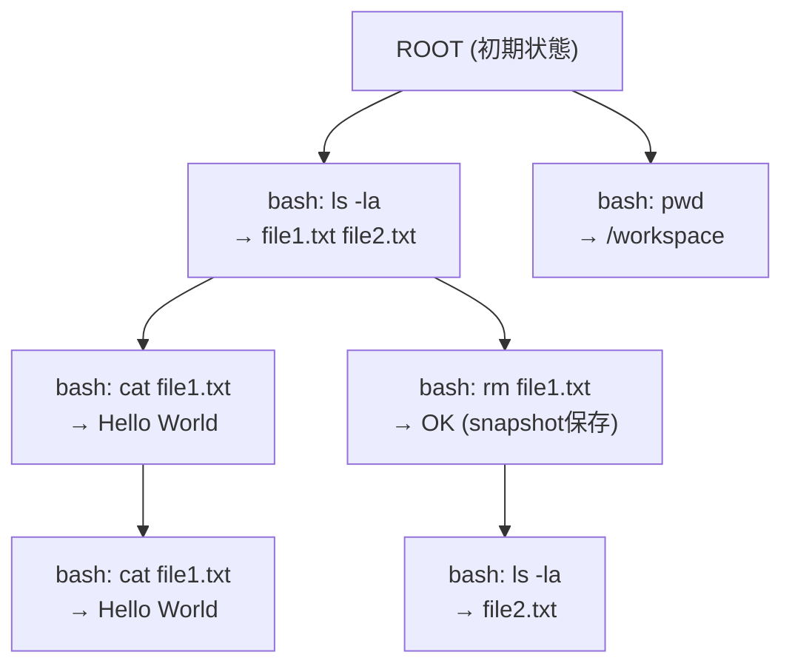
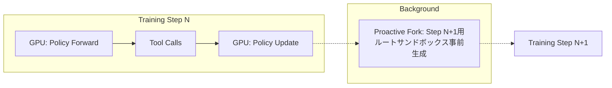

本記事は [TVCACHE: A Stateful Tool-Value Cache for Post-Training LLM Agents](https://arxiv.org/abs/2602.10986) の解説記事です。

## 論文概要（Abstract）

LLMエージェントの強化学習ベースのPost-Training（RLHF/GRPO等）では、外部ツール呼び出し（コード実行、API呼び出し、データベースクエリ等）がrollout生成の主要なボトルネックとなっている。著者らは、ツール呼び出しによるGPUアイドル時間がrollout時間の7〜43%を占めると報告しており（論文Table 1より）、この非効率性を解消するために**TVCACHE**（Tool-Value Cache）を提案している。

TVCACHEの中核は**Tool Call Graph（TCG）**と呼ばれるデータ構造であり、ツール呼び出しの履歴をグラフとして管理し、最長プレフィックスマッチング（Longest-Prefix Matching: LPM）によってキャッシュヒットを判定する。ナイーブなキャッシュとは異なり、エージェントの過去のツール呼び出し履歴が完全に一致する場合にのみキャッシュ結果を返すことで、状態依存のあるツール（ファイルシステム操作、データベース更新等）でも正確な結果を保証する設計となっている。

この記事は [Zenn記事: AIエージェント×セマンティックキャッシュ：ツール呼び出しとマルチターン対話を高速化する実装設計](https://zenn.dev/0h_n0/articles/803e53d2b2b872) の深掘りです。

## 情報源

- **arXiv ID**: 2602.10986
- **URL**: [https://arxiv.org/abs/2602.10986](https://arxiv.org/abs/2602.10986)
- **著者**: Abhishek Vijaya Kumar, Bhaskar Kataria, Byungsoo Oh, Emaad Manzoor, Rachee Singh
- **発表年**: 2026
- **分野**: cs.LG（Machine Learning）

## 背景と動機（Background & Motivation）

LLMエージェントの性能を向上させる手法として、強化学習ベースのPost-Trainingが注目されている。GRPO（Group Relative Policy Optimization）やReinforce++などのアルゴリズムでは、エージェントが環境と対話しながらrolloutを生成し、報酬信号に基づいてポリシーを更新する。

この訓練ループにおいて、外部ツール呼び出しは以下の理由で深刻なボトルネックとなる。

1. **GPUアイドル時間**: ツール実行中はGPUが遊休状態となり、高価な計算リソースが無駄になる。著者らはterminal-benchワークロードでrollout時間の43%がツール呼び出しに費やされると報告している（論文Table 1より）
2. **同一ツール呼び出しの重複**: Post-Trainingでは同一プロンプトに対して複数のrolloutを生成する（例: GRPO では$G$個のrollout）。初期段階では異なるrollout間で同一のツール呼び出しシーケンスが頻出する
3. **エポック間の重複**: 訓練が進むにつれてポリシーが収束し、エポック間で同一のツール呼び出しパターンが繰り返される
4. **状態依存の問題**: ファイルシステム操作やデータベース更新など、ツール呼び出しの結果が過去の操作履歴に依存するケースでは、単純なキー-バリューキャッシュでは誤った結果を返すリスクがある

著者らは、既存のキャッシュ手法（セマンティックキャッシュやKVキャッシュ等）がこの問題に対して不十分であると指摘している。セマンティックキャッシュは推論時のAPIコスト削減には有効だが、ツール呼び出しの状態依存性を考慮しない。KVキャッシュ（PagedAttention等）はAttention計算の効率化に焦点を当てており、外部ツール実行の高速化には寄与しない。

## 主要な貢献（Key Contributions）

- **Tool Call Graph（TCG）**: ツール呼び出しの履歴をDAG（有向非巡回グラフ）として管理するデータ構造。各ノードは `(tool_descriptor, result, optional_sandbox_snapshot)` のタプルで構成され、パスはエージェントが観測したツール呼び出しシーケンスを表現する。最長プレフィックスマッチングにより、状態依存のあるツールでも正確なキャッシュヒットを保証する
- **Selective Sandbox Snapshotting**: すべてのツール呼び出し後にサンドボックスのスナップショットを保存するのではなく、スナップショット取得コストとツール再実行コストを比較し、コスト効率の高い場合にのみスナップショットを保存する選択的戦略
- **Proactive/Reactive Forking**: 訓練ステップ開始前にルートサンドボックスを事前生成するProactive Forkingと、キャッシュヒット時にスナップショットからサンドボックスを復元するReactive Forkingの2段階戦略により、サンドボックス管理のオーバーヘッドを最小化

## 技術的詳細（Technical Details）

### Tool Call Graph（TCG）アーキテクチャ

TVCACHEの中核データ構造であるTool Call Graph（TCG）は、エージェントのツール呼び出し履歴を木構造（より正確にはDAG）として管理する。



上図において、`bash: rm file1.txt` の後に `bash: ls -la` を実行した場合と、`bash: ls -la` の直後に再度 `bash: ls -la` を実行した場合では結果が異なる。TCGはこのパスの違いを正確に区別する。

各ノードは以下の3要素で構成される。

| 要素 | 説明 | 例 |
|------|------|-----|
| `tool_descriptor` | ツール名と引数のペア | `("bash", "ls -la")` |
| `result` | ツール実行結果 | `"file1.txt file2.txt"` |
| `sandbox_snapshot` | 実行環境のスナップショット（省略可） | Dockerコンテナのcheckpoint |

### Longest-Prefix Matching（LPM）アルゴリズム

新しいツール呼び出し $t_{j+1}$ が発生した際、TVCACHEはエージェントの過去のツール呼び出しシーケンス $t_1, t_2, \ldots, t_j$ をTCG上でマッチングする。

**定義**: ツール呼び出しシーケンス $\sigma = (t_1, t_2, \ldots, t_j)$ に対して、TCG $G$ 上の最長プレフィックスマッチは以下で定義される。

$$
\text{LPM}(\sigma, G) = \arg\max_{p \in \text{Paths}(G)} |\text{CommonPrefix}(p, \sigma)|
$$

ここで $\text{Paths}(G)$ はROOTからのすべてのパスの集合、$\text{CommonPrefix}(p, \sigma)$ はパス $p$ とシーケンス $\sigma$ の共通プレフィックスの長さである。

**状態変更フィルタリング**: LPM実行時、著者らは非状態変更ツール呼び出し（read-onlyなAPIクエリ等）をマッチング対象から除外するフィルタリングを導入している。これにより、`cat file.txt` のようなread-only操作が間に入ってもプレフィックスマッチが途切れず、キャッシュヒット率が向上する。

擬似コードを以下に示す（論文Algorithm 1に基づく）。

```python
def lookup(tcg: ToolCallGraph, 
           history: list[ToolCall], 
           new_call: ToolCall) -> CacheResult | None:
    """TCG上で最長プレフィックスマッチングを実行する。
    
    Args:
        tcg: Tool Call Graph
        history: エージェントの過去のツール呼び出しシーケンス
        new_call: 新しいツール呼び出し
    
    Returns:
        キャッシュヒット時はCacheResult、ミス時はNone
    """
    # Phase 1: 過去の履歴でTCGをトラバース
    current_node = tcg.root
    state_mutating_history = filter_state_mutating(history)
    
    for call in state_mutating_history:
        child = current_node.find_child(call.tool_descriptor)
        if child is None:
            return None  # プレフィックスが途切れた
        current_node = child
    
    # Phase 2: 新しい呼び出しの子ノードを検索
    target = current_node.find_child(new_call.tool_descriptor)
    if target is None:
        return None  # キャッシュミス
    
    return CacheResult(
        result=target.result,
        sandbox_snapshot=target.sandbox_snapshot
    )
```

**高速化指標**: キャッシュヒット時のスピードアップは以下で定義される。

$$
S = \frac{T_{\text{no\_cache}}}{T_{\text{with\_cache}}}
$$

ここで $T_{\text{no\_cache}}$ はキャッシュなしでのツール実行時間、$T_{\text{with\_cache}}$ はキャッシュルックアップ + スナップショット復元時間である。著者らはこのスピードアップが最大6.9倍に達すると報告している（論文Table 2より）。

### Selective Sandbox Snapshotting

すべてのツール呼び出し後にサンドボックスのスナップショットを保存すると、ストレージとI/Oのオーバーヘッドが大きくなる。著者らは以下の条件でスナップショット保存を選択的に実行する戦略を提案している。

**判定基準**: ツール呼び出し $t_i$ のスナップショットを保存するかどうかは、以下の不等式で決定される。

$$
C_{\text{snapshot}}(t_i) < C_{\text{replay}}(t_1, \ldots, t_i)
$$

ここで $C_{\text{snapshot}}(t_i)$ はスナップショット取得のコスト（時間）、$C_{\text{replay}}(t_1, \ldots, t_i)$ はルートから $t_i$ までのツール呼び出しを再実行するコストである。

**具体例**:
- `bash: echo "hello"` (実行時間: 10ms) → スナップショット不要（再実行の方が安い）
- `bash: pip install torch && python train.py` (実行時間: 120s) → スナップショット保存（再実行コストが高い）

著者らは、実験においてスナップショット保存の判定閾値を動的に調整する手法も検討しており、訓練進行に伴いキャッシュヒット率が上がるほどスナップショットの投資回収率が向上すると報告している。

### 最適化戦略（Proactive/Reactive Forking）

サンドボックス管理には2つの最適化戦略が導入されている。

**Proactive Forking（事前生成）**: 訓練ステップ開始前に、必要な数のルートサンドボックスを事前にフォークしておく。GRPOでは同一プロンプトに対して$G$個のrolloutを並列生成するため、$G$個のサンドボックスが必要となる。Proactive Forkingではこの事前準備を訓練ステップの間に非同期で実行する。

**Reactive Forking（復元生成）**: キャッシュヒット時に、保存済みのスナップショットからサンドボックスを復元する。これにより、長いツール呼び出しシーケンスの再実行を回避できる。



## 実装のポイント（Server-Client Architecture）

TVCACHEはServer-Client型のアーキテクチャを採用している。

| コンポーネント | 役割 | 技術要素 |
|:---:|:---:|:---:|
| **TVCache Server** | TCG管理、LPM実行、スナップショット管理 | HTTP API、インメモリグラフ |
| **Sandbox Manager** | サンドボックスの生成・フォーク・復元 | Docker/Firecracker、checkpoint/restore |
| **Training Client** | rollout生成、ツール呼び出しのプロキシ | vLLM/SGLangと統合 |

### 並行制御

複数のrolloutが並行してTCGにアクセスするため、以下の並行制御が必要となる。

1. **読み取り並行性**: LPMの実行（読み取り）は複数rolloutで同時に実行可能。著者らはリーダー-ライターロックを採用していると考えられる
2. **書き込みの逐次化**: 新しいノードのTCGへの追加（書き込み）は排他制御が必要
3. **スナップショットの非同期保存**: スナップショット取得はバックグラウンドで非同期に実行し、rolloutの進行をブロックしない

著者らは、シングルサーバ構成でP95キャッシュ取得レイテンシが256 req/s時に3.3msであると報告しており（論文Section 5.2より）、実用的なスループットを達成している。

```python
from dataclasses import dataclass, field
from typing import Optional
import threading
import time


@dataclass(frozen=True)
class ToolDescriptor:
    """ツール呼び出しの記述子（イミュータブル）。"""
    tool_name: str
    arguments: str

    def __hash__(self) -> int:
        return hash((self.tool_name, self.arguments))


@dataclass
class TCGNode:
    """Tool Call Graphのノード。"""
    descriptor: ToolDescriptor
    result: str
    sandbox_snapshot: Optional[bytes] = None
    children: dict[ToolDescriptor, "TCGNode"] = field(
        default_factory=dict
    )


class ToolCallGraph:
    """Thread-safe なTool Call Graph実装。"""

    def __init__(self) -> None:
        self.root = TCGNode(
            descriptor=ToolDescriptor("ROOT", ""),
            result=""
        )
        self._lock = threading.RWLock()  # Python 3.13+
        self._stats = {"hits": 0, "misses": 0}

    def lookup(
        self,
        history: list[ToolDescriptor],
        new_call: ToolDescriptor,
    ) -> Optional[tuple[str, Optional[bytes]]]:
        """LPMによるキャッシュルックアップ。"""
        with self._lock.reader():
            node = self.root
            for desc in history:
                if desc not in node.children:
                    self._stats["misses"] += 1
                    return None
                node = node.children[desc]

            if new_call not in node.children:
                self._stats["misses"] += 1
                return None

            target = node.children[new_call]
            self._stats["hits"] += 1
            return (target.result, target.sandbox_snapshot)

    def insert(
        self,
        history: list[ToolDescriptor],
        new_call: ToolDescriptor,
        result: str,
        snapshot: Optional[bytes] = None,
    ) -> None:
        """新しいツール呼び出し結果をTCGに挿入する。"""
        with self._lock.writer():
            node = self.root
            for desc in history:
                if desc not in node.children:
                    raise KeyError(
                        f"History path not found: {desc}"
                    )
                node = node.children[desc]

            node.children[new_call] = TCGNode(
                descriptor=new_call,
                result=result,
                sandbox_snapshot=snapshot,
            )

    @property
    def hit_rate(self) -> float:
        """キャッシュヒット率を返す。"""
        total = self._stats["hits"] + self._stats["misses"]
        return self._stats["hits"] / total if total > 0 else 0.0
```

> **注意**: 上記コードは論文の設計思想を説明するための参考実装である。`threading.RWLock` はPython 3.13以降で利用可能であり、それ以前のバージョンでは `readerwriterlock` パッケージ等の代替が必要となる。

## Production Deployment Guide

### AWS実装パターン（コスト最適化重視）

本論文のServer-Client型TVCACHEアーキテクチャをAWS上にデプロイする構成を示す。RL訓練ワークロードのGPUアイドル時間削減を主目的とする。

| 規模 | GPU数 | 推奨構成 | 月額コスト | 主要サービス |
|------|:---:|:---:|:---:|:---:|
| **Small** | 1-2 GPU | Serverless + Spot | $800-2,000 | Lambda + SageMaker Training + S3 |
| **Medium** | 4-8 GPU | Hybrid | $5,000-15,000 | ECS Fargate + SageMaker + ElastiCache |
| **Large** | 16+ GPU | Container | $20,000-60,000 | EKS + p5.48xlarge + EC2 Spot |

**Small構成の詳細** (月額$800-2,000):
- **SageMaker Training**: ml.g5.xlarge Spot Instance、1日4時間訓練 ($400/月)
- **Lambda (TVCache Server)**: 4GB RAM、60秒タイムアウト、256 req/s対応 ($30/月)
- **S3**: サンドボックススナップショット保存、Intelligent-Tiering ($20/月)
- **ElastiCache (Redis)**: cache.t4g.micro、TCGインメモリ管理 ($15/月)
- **CloudWatch**: メトリクス + X-Rayトレース ($10/月)
- **SageMaker Inference**: ml.g5.xlarge、rollout生成用vLLMサーバ ($300/月)

**Medium構成の詳細** (月額$5,000-15,000):
- **ECS Fargate**: TVCacheサーバ x2（Active-Standby）、4vCPU/16GB ($200/月)
- **SageMaker Training**: ml.g5.12xlarge x4、分散GRPO訓練 ($8,000/月)
- **ElastiCache (Redis Cluster)**: cache.r7g.large x3ノード ($800/月)
- **EFS**: サンドボックススナップショット共有ストレージ ($100/月)
- **ECR + Docker**: サンドボックスイメージ管理 ($20/月)

**Large構成の詳細** (月額$20,000-60,000):
- **EKS**: p5.48xlarge x2（H100 x16）、Karpenter + Spot ($35,000/月)
- **TVCache Server**: k8s Deployment x4レプリカ、16vCPU/64GB ($1,200/月)
- **Redis Cluster**: ElastiCache r7g.xlarge x6ノード（シャーディング） ($3,000/月)
- **Firecracker MicroVM**: サンドボックス管理、checkpoint/restore ($500/月)

**コスト削減テクニック**:
- TVCACHEのキャッシュヒット率70%達成でGPU利用効率40%改善（論文Figure 5より）
- SageMaker Managed Spot Trainingで最大90%削減
- ElastiCacheリザーブドノードで30%削減（1年契約）
- S3 Intelligent-TieringでスナップショットのストレージコストをNear Real-Time Tierに自動最適化

**コスト試算の注意事項**: 上記は2026年5月時点のAWS ap-northeast-1（東京）リージョン料金に基づく概算値です。実際のコストはGPUインスタンスの可用性、Spotの中断頻度、訓練ステップ数により大きく変動します。最新料金は[AWS料金計算ツール](https://calculator.aws/)で確認してください。

### Terraformインフラコード

**Small構成 (Serverless): Lambda (TVCache Server) + SageMaker + Redis**

```hcl
module "vpc" {
  source  = "terraform-aws-modules/vpc/aws"
  version = "~> 5.0"

  name = "tvcache-vpc"
  cidr = "10.0.0.0/16"
  azs  = ["ap-northeast-1a", "ap-northeast-1c"]

  private_subnets = ["10.0.1.0/24", "10.0.2.0/24"]
  public_subnets  = ["10.0.101.0/24", "10.0.102.0/24"]

  enable_nat_gateway   = true
  single_nat_gateway   = true
  enable_dns_hostnames = true
}

resource "aws_elasticache_cluster" "tcg_store" {
  cluster_id           = "tvcache-tcg"
  engine               = "redis"
  node_type            = "cache.t4g.micro"
  num_cache_nodes      = 1
  parameter_group_name = "default.redis7"
  port                 = 6379

  subnet_group_name = aws_elasticache_subnet_group.private.name
  security_group_ids = [aws_security_group.redis.id]
}

resource "aws_elasticache_subnet_group" "private" {
  name       = "tvcache-subnet"
  subnet_ids = module.vpc.private_subnets
}

resource "aws_security_group" "redis" {
  name   = "tvcache-redis-sg"
  vpc_id = module.vpc.vpc_id

  ingress {
    from_port       = 6379
    to_port         = 6379
    protocol        = "tcp"
    security_groups = [aws_security_group.lambda.id]
  }
}

resource "aws_security_group" "lambda" {
  name   = "tvcache-lambda-sg"
  vpc_id = module.vpc.vpc_id

  egress {
    from_port   = 0
    to_port     = 0
    protocol    = "-1"
    cidr_blocks = ["0.0.0.0/0"]
  }
}

resource "aws_iam_role" "tvcache_lambda" {
  name = "tvcache-server-role"

  assume_role_policy = jsonencode({
    Version = "2012-10-17"
    Statement = [{
      Action    = "sts:AssumeRole"
      Effect    = "Allow"
      Principal = { Service = "lambda.amazonaws.com" }
    }]
  })
}

resource "aws_iam_role_policy" "s3_snapshot" {
  role = aws_iam_role.tvcache_lambda.id
  policy = jsonencode({
    Version = "2012-10-17"
    Statement = [
      {
        Effect   = "Allow"
        Action   = ["s3:GetObject", "s3:PutObject", "s3:ListBucket"]
        Resource = [
          aws_s3_bucket.snapshots.arn,
          "${aws_s3_bucket.snapshots.arn}/*"
        ]
      },
      {
        Effect = "Allow"
        Action = [
          "elasticache:Connect"
        ]
        Resource = "*"
      }
    ]
  })
}

resource "aws_lambda_function" "tvcache_server" {
  filename      = "tvcache_server.zip"
  function_name = "tvcache-server"
  role          = aws_iam_role.tvcache_lambda.arn
  handler       = "server.handler"
  runtime       = "python3.12"
  timeout       = 60
  memory_size   = 4096

  vpc_config {
    subnet_ids         = module.vpc.private_subnets
    security_group_ids = [aws_security_group.lambda.id]
  }

  environment {
    variables = {
      REDIS_HOST          = aws_elasticache_cluster.tcg_store.cache_nodes[0].address
      S3_SNAPSHOT_BUCKET  = aws_s3_bucket.snapshots.id
      SNAPSHOT_THRESHOLD_MS = "5000"
    }
  }
}

resource "aws_s3_bucket" "snapshots" {
  bucket = "tvcache-sandbox-snapshots"
}

resource "aws_s3_bucket_intelligent_tiering_configuration" "snapshots" {
  bucket = aws_s3_bucket.snapshots.id
  name   = "snapshot-tiering"

  tiering {
    access_tier = "ARCHIVE_ACCESS"
    days        = 90
  }
}

resource "aws_s3_bucket_lifecycle_configuration" "snapshots" {
  bucket = aws_s3_bucket.snapshots.id

  rule {
    id     = "expire-old-snapshots"
    status = "Enabled"
    expiration {
      days = 30
    }
  }
}
```

**Large構成 (Container): EKS + TVCacheサーバ + Redis Cluster**

```hcl
module "eks" {
  source  = "terraform-aws-modules/eks/aws"
  version = "~> 20.0"

  cluster_name    = "tvcache-training-cluster"
  cluster_version = "1.31"
  vpc_id          = module.vpc.vpc_id
  subnet_ids      = module.vpc.private_subnets

  cluster_addons = {
    karpenter = { most_recent = true }
  }

  eks_managed_node_groups = {
    tvcache_server = {
      instance_types = ["m7i.4xlarge"]
      min_size       = 2
      max_size       = 4
      desired_size   = 2
      labels         = { role = "tvcache-server" }
    }
  }
}

resource "aws_elasticache_replication_group" "tcg_cluster" {
  replication_group_id = "tvcache-tcg-cluster"
  description          = "TVCache TCG Redis Cluster"
  node_type            = "cache.r7g.xlarge"

  num_node_groups         = 3
  replicas_per_node_group = 1
  automatic_failover_enabled = true

  subnet_group_name  = aws_elasticache_subnet_group.private.name
  security_group_ids = [aws_security_group.redis_cluster.id]

  at_rest_encryption_enabled = true
  transit_encryption_enabled = true
}

resource "aws_security_group" "redis_cluster" {
  name   = "tvcache-redis-cluster-sg"
  vpc_id = module.vpc.vpc_id

  ingress {
    from_port       = 6379
    to_port         = 6379
    protocol        = "tcp"
    cidr_blocks     = module.vpc.private_subnets_cidr_blocks
  }
}

resource "kubernetes_deployment" "tvcache_server" {
  metadata {
    name      = "tvcache-server"
    namespace = "tvcache"
  }
  spec {
    replicas = 4
    selector {
      match_labels = { app = "tvcache-server" }
    }
    template {
      metadata {
        labels = { app = "tvcache-server" }
      }
      spec {
        node_selector = { role = "tvcache-server" }
        container {
          name  = "tvcache"
          image = "tvcache-server:latest"
          port {
            container_port = 8080
          }
          resources {
            requests = {
              cpu    = "4"
              memory = "16Gi"
            }
            limits = {
              cpu    = "4"
              memory = "16Gi"
            }
          }
          env {
            name  = "REDIS_CLUSTER_ENDPOINT"
            value = aws_elasticache_replication_group.tcg_cluster.configuration_endpoint_address
          }
          env {
            name  = "SNAPSHOT_BACKEND"
            value = "s3"
          }
          env {
            name  = "S3_BUCKET"
            value = aws_s3_bucket.snapshots.id
          }
          liveness_probe {
            http_get {
              path = "/health"
              port = 8080
            }
            initial_delay_seconds = 10
            period_seconds        = 30
          }
          readiness_probe {
            http_get {
              path = "/ready"
              port = 8080
            }
            initial_delay_seconds = 5
            period_seconds        = 10
          }
        }
      }
    }
  }
}

resource "kubernetes_horizontal_pod_autoscaler_v2" "tvcache" {
  metadata {
    name      = "tvcache-server-hpa"
    namespace = "tvcache"
  }
  spec {
    scale_target_ref {
      api_version = "apps/v1"
      kind        = "Deployment"
      name        = "tvcache-server"
    }
    min_replicas = 2
    max_replicas = 8
    metric {
      type = "Resource"
      resource {
        name = "cpu"
        target {
          type                = "Utilization"
          average_utilization = 70
        }
      }
    }
  }
}
```

### 監視・運用設定

```python
import boto3

cloudwatch = boto3.client("cloudwatch")

# --- キャッシュヒット率アラーム ---
cloudwatch.put_metric_alarm(
    AlarmName="tvcache-hit-rate-low",
    ComparisonOperator="LessThanThreshold",
    EvaluationPeriods=3,
    MetricName="CacheHitRate",
    Namespace="Custom/TVCache",
    Period=300,
    Statistic="Average",
    Threshold=0.3,
    ActionsEnabled=True,
    AlarmActions=[
        "arn:aws:sns:ap-northeast-1:123456789:tvcache-alerts"
    ],
    AlarmDescription=(
        "TVCacheキャッシュヒット率30%未満。"
        "訓練初期は正常だがエポック中盤以降は異常の可能性。"
    ),
)

# --- P95レイテンシアラーム ---
cloudwatch.put_metric_alarm(
    AlarmName="tvcache-p95-latency-high",
    ComparisonOperator="GreaterThanThreshold",
    EvaluationPeriods=2,
    MetricName="CacheLookupP95",
    Namespace="Custom/TVCache",
    Period=60,
    Statistic="p95",
    Threshold=10.0,
    ActionsEnabled=True,
    AlarmActions=[
        "arn:aws:sns:ap-northeast-1:123456789:tvcache-alerts"
    ],
    AlarmDescription=(
        "TVCache P95ルックアップレイテンシ10ms超過。"
        "論文基準3.3ms@256req/sと比較して劣化。"
    ),
)

# --- GPU利用率監視（SageMaker） ---
cloudwatch.put_metric_alarm(
    AlarmName="training-gpu-idle-high",
    ComparisonOperator="LessThanThreshold",
    EvaluationPeriods=5,
    MetricName="GPUUtilization",
    Namespace="AWS/SageMaker",
    Period=60,
    Statistic="Average",
    Threshold=50.0,
    ActionsEnabled=True,
    AlarmActions=[
        "arn:aws:sns:ap-northeast-1:123456789:tvcache-alerts"
    ],
    AlarmDescription=(
        "GPU利用率50%未満。TVCacheが正常動作していない可能性。"
        "ツール呼び出しのキャッシュミスが多発している。"
    ),
)

# --- AWS X-Ray トレース設定 ---
# TVCacheのルックアップ→スナップショット復元→ツール実行の
# エンドツーエンドレイテンシを可視化
xray_config = {
    "sampling_rule": {
        "RuleName": "tvcache-tracing",
        "ResourceARN": "*",
        "Priority": 1000,
        "FixedRate": 0.05,
        "ReservoirSize": 10,
        "ServiceName": "tvcache-server",
        "ServiceType": "*",
        "Host": "*",
        "HTTPMethod": "*",
        "URLPath": "/api/cache/*",
        "Version": 1,
    }
}

# --- Cost Explorerアラート ---
ce = boto3.client("ce")
budgets = boto3.client("budgets")

budgets.create_budget(
    AccountId="123456789012",
    Budget={
        "BudgetName": "tvcache-training-monthly",
        "BudgetLimit": {"Amount": "5000", "Unit": "USD"},
        "BudgetType": "COST",
        "TimeUnit": "MONTHLY",
        "CostFilters": {
            "TagKeyValue": [
                "user:Project$TVCache"
            ]
        },
    },
    NotificationsWithSubscribers=[
        {
            "Notification": {
                "NotificationType": "ACTUAL",
                "ComparisonOperator": "GREATER_THAN",
                "Threshold": 80.0,
                "ThresholdType": "PERCENTAGE",
            },
            "Subscribers": [
                {
                    "SubscriptionType": "EMAIL",
                    "Address": "ml-team@example.com",
                }
            ],
        }
    ],
)
```

### コスト最適化チェックリスト

**インフラストラクチャ**:
- [ ] SageMaker Managed Spot Trainingを有効化（最大90%削減）
- [ ] Karpenter Spot + On-Demand混在（GPU: On-Demand, TVCache: Spot）
- [ ] ElastiCache Reserved Node契約（1年で30%、3年で50%削減）
- [ ] S3 Intelligent-Tieringでスナップショット自動階層化
- [ ] S3ライフサイクルルールで30日超のスナップショット自動削除
- [ ] NAT Gatewayを1つに集約（Single NAT Gateway）
- [ ] VPCエンドポイント経由でS3/DynamoDB/CloudWatch接続（NAT料金回避）

**TVCache設定**:
- [ ] SNAPSHOT_THRESHOLD_MSを実ワークロードの中央値に調整
- [ ] 非状態変更ツールのホワイトリストを正確に設定
- [ ] TCGのメモリ上限設定（Redis maxmemory-policy: allkeys-lru）
- [ ] Proactive Forkingの並行度をGRPO rollout数$G$に一致させる
- [ ] スナップショット圧縮（zstd）を有効化

**訓練最適化**:
- [ ] バッチサイズ調整でGPUアイドル時間を最小化
- [ ] 訓練エポック進行に伴うキャッシュヒット率推移を監視（目標: 最終エポックで70%）
- [ ] 不要なrolloutの早期終了（報酬が十分高い場合）
- [ ] Gradient Accumulation StepsでGPU間通信を削減

**監視・運用**:
- [ ] CloudWatchカスタムメトリクス: CacheHitRate, LookupP95, SnapshotRestoreTime
- [ ] X-Rayトレース: ルックアップ→復元→実行のエンドツーエンド
- [ ] AWS Budgets月額予算設定（80%で警告、100%でアクション）
- [ ] Cost Explorerでタグベースのコスト配分（Project: TVCache）
- [ ] GPU利用率ダッシュボード（SageMaker CloudWatch統合）

## 実験結果（Experimental Results）

著者らは4つのワークロードでTVCACHEの有効性を評価している。以下に主要な実験結果を示す。

### ワークロード別の性能比較

| ワークロード | モデル | キャッシュヒット率 | ツール実行スピードアップ | 備考 |
|:---:|:---:|:---:|:---:|:---|
| terminal-bench (easy) | Qwen3-4B | 20.2% | 6.18x | 論文Table 2より |
| terminal-bench (medium) | Qwen3-4B | 14.2% | 6.92x | 論文Table 2より |
| SkyRL-SQL | Qwen2.5-Coder-7B | 33.1% | 2.9x | 論文Table 2より |
| EgoSchema | Qwen3-30B | 64.3% | 3x（トークン削減） | 論文Table 2より |

### 結果の分析

**キャッシュヒット率の推移**: 著者らは、訓練エポックが進むにつれてキャッシュヒット率が上昇し、最終エポックでは70%に達すると報告している（論文Figure 5より）。これは、ポリシーの収束に伴い同一のツール呼び出しパターンが繰り返されるためである。

**スピードアップの要因分析**:
- terminal-benchではコマンド実行のレイテンシが大きいため、キャッシュヒット率が低くても高いスピードアップ（6.18x〜6.92x）を達成している
- SkyRL-SQLではSQLクエリの実行時間が比較的短いため、スピードアップは2.9xに留まる
- EgoSchemaでは動画キャプション処理のAPIトークン削減として評価されており、64.3%のキャッシュヒット率は処理対象の動画データに重複が多いことを反映している

**訓練品質への影響**: 著者らは、TVCACHEの導入によるPost-Training報酬への影響がゼロであると報告している（論文Section 5.3より）。すなわち、キャッシュによる高速化は訓練品質を一切損なわない。これはTCGの最長プレフィックスマッチングが、状態依存のあるツール呼び出しに対して正確な結果のみを返すことを保証しているためである。

**サーバ性能**: シングルサーバ構成でP95キャッシュ取得レイテンシ3.3ms（256 req/s時）を達成している（論文Section 5.2より）。これはツール実行時間（数百ms〜数十秒）と比較して十分に小さく、キャッシュルックアップ自体がボトルネックにならないことを示している。

### 制約と限界

著者らは以下の制約を明示的に記載、または論文の実験設計から推察できる。

1. **ワークロード依存性**: キャッシュヒット率はワークロードの性質に強く依存する。ツール呼び出しパターンのバリエーションが大きいタスクではヒット率が低下する
2. **スナップショットのオーバーヘッド**: Dockerコンテナのcheckpoint/restoreにはカーネルレベルのサポート（CRIU）が必要であり、すべての環境で利用可能ではない
3. **メモリ消費**: TCGはエポック進行に伴い成長し続けるため、長時間の訓練ではメモリ管理（LRU退避等）が必要となる
4. **分散環境での一貫性**: 複数の訓練ノードが同一のTVCacheサーバにアクセスする場合、ネットワークレイテンシとTCGの一貫性保証のトレードオフが生じる
5. **評価の限定性**: 実験はQwenファミリーのモデル（4B〜30B）に限定されており、より大規模なモデル（70B以上）での検証は今後の課題として残されている

## 実運用への応用（Zenn記事との連携）

[Zenn記事「AIエージェント×セマンティックキャッシュ」](https://zenn.dev/0h_n0/articles/803e53d2b2b872)で解説されているセマンティックキャッシュは、推論時のAPIコスト削減に焦点を当てている。一方、本論文のTVCACHEは訓練時のツール呼び出し高速化に特化しており、両者は補完的な関係にある。

| 観点 | セマンティックキャッシュ（Zenn記事） | TVCACHE（本論文） |
|------|:---:|:---:|
| **対象フェーズ** | 推論（Inference） | 訓練（Post-Training） |
| **キャッシュキー** | クエリの意味的類似度 | ツール呼び出しシーケンスの完全一致 |
| **状態依存性** | 考慮しない | TCGで厳密に管理 |
| **主要メトリクス** | APIコスト削減率 | GPU利用効率、ツールスピードアップ |
| **近似許容度** | 高い（類似クエリにヒット） | ゼロ（完全一致のみ） |

**統合シナリオ**: LLMエージェントの開発ライフサイクルにおいて、以下のように両手法を組み合わせることが考えられる。

1. **訓練フェーズ**: TVCACHEでツール呼び出しをキャッシュし、GPU利用効率を最大化
2. **推論フェーズ**: セマンティックキャッシュでエンドユーザーの類似クエリを吸収し、APIコストを削減
3. **継続的改善**: 推論時のキャッシュミスパターンを分析し、次回のPost-Training時のrollout生成に反映

## 関連研究（Related Work）

- **GPTCache (2403.02694)**: LLM推論時のセマンティックキャッシュシステム。埋め込みベクトルの類似度検索で類似クエリにヒットさせる点がTVCACHEと根本的に異なる。TVCACHEはツール呼び出しの状態依存性を厳密に管理するのに対し、GPTCacheは近似マッチングを許容する設計である
- **PagedAttention / vLLM (2309.06180)**: GPU上のKVキャッシュを仮想メモリ方式で管理し、メモリ断片化を解消する手法。TVCACHEが外部ツール呼び出しのキャッシュに焦点を当てるのに対し、PagedAttentionはAttention計算内部のメモリ効率化に特化している。両者は異なるレイヤーのボトルネックを解消する補完的な技術である
- **CachedAttention (2407.01219)**: マルチターン会話においてKVキャッシュをCPU/GPU階層に永続化する手法。セッション間でのKVキャッシュ再利用を可能にする点でTVCACHEのTCGと類似のモチベーションを持つが、キャッシュ対象はAttentionの内部状態であり外部ツール呼び出しではない
- **SGLang RadixAttention**: プレフィックスをRadix tree（基数木）で管理し、複数リクエスト間でKVキャッシュを共有する推論フレームワーク。TVCACHEのTCGが木構造でツール呼び出し履歴を管理する設計は、RadixAttentionのRadix treeと概念的に類似している

## まとめと今後の展望

TVCACHEは、LLMエージェントのPost-Trainingにおけるツール呼び出しのボトルネックを、Tool Call Graph（TCG）と最長プレフィックスマッチングによって解消するシステムである。著者らはterminal-bench、SkyRL-SQL、EgoSchemaの各ワークロードで最大6.9倍のツール実行スピードアップを達成し、訓練品質への劣化がゼロであることを示している。

ただし、キャッシュヒット率はワークロードの性質に強く依存し（14.2%〜64.3%）、すべてのタスクで同等の効果が得られるわけではない。また、Dockerコンテナのcheckpoint/restoreへのカーネルレベルの依存や、TCGのメモリ消費増大への対策など、実運用に向けた課題も残されている。

今後の展望として、以下の研究方向が考えられる。

1. **マルチモデル訓練への拡張**: 異なるモデル間でTCGを共有し、ツール呼び出しのキャッシュ効率をさらに向上させる
2. **分散TCGの設計**: 大規模クラスタでの分散訓練において、複数ノード間でTCGの一貫性を保ちながら高スループットを実現する
3. **推論時キャッシュとの統合**: セマンティックキャッシュとTVCACHEを統合し、訓練-推論の全ライフサイクルでキャッシュ効率を最大化する

## 参考文献

- **arXiv**: [https://arxiv.org/abs/2602.10986](https://arxiv.org/abs/2602.10986)
- **Related Zenn article**: [https://zenn.dev/0h_n0/articles/803e53d2b2b872](https://zenn.dev/0h_n0/articles/803e53d2b2b872)
- **GPTCache**: [https://arxiv.org/abs/2403.02694](https://arxiv.org/abs/2403.02694)
- **PagedAttention / vLLM**: [https://arxiv.org/abs/2309.06180](https://arxiv.org/abs/2309.06180)
- **CachedAttention**: [https://arxiv.org/abs/2407.01219](https://arxiv.org/abs/2407.01219)
