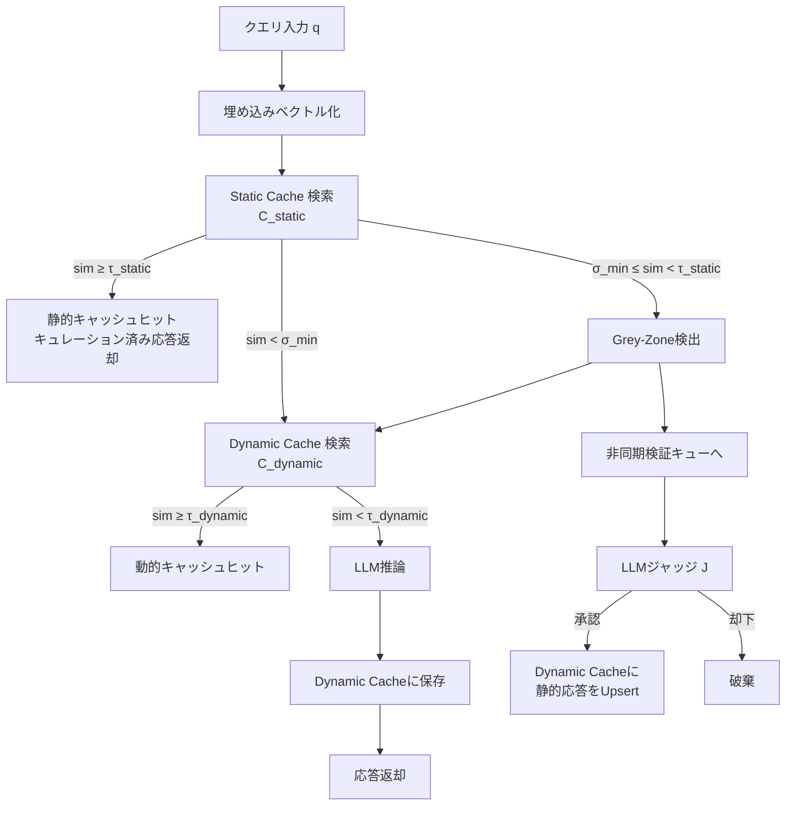

本記事は [https://arxiv.org/abs/2602.13165](https://arxiv.org/abs/2602.13165) の解説記事です。

## 論文概要（Abstract）

セマンティックキャッシュはLLM推論のコストとレイテンシを削減する有力な手法だが、固定閾値による類似度判定では「保守的すぎてヒット率が低い」か「積極的すぎて誤った応答を返す」というトレードオフが避けられない。著者らは、2層キャッシュアーキテクチャ（Static/Dynamic）とLLMジャッジによる非同期検証を組み合わせた**Krites**を提案している。Kritesは従来のGPTCacheベースラインと比較して、キュレーション済み応答の提供率（curated answer serving rate）をSemCacheLMArenaで+136.5%、SemCacheSearchQueriesで+290.3%向上させたと報告されている（論文Table 1より）。クリティカルパスへのレイテンシ影響はゼロである。

この記事は [Zenn記事: AIエージェント×セマンティックキャッシュ：ツール呼び出しとマルチターン対話を高速化する実装設計](https://zenn.dev/0h_n0/articles/803e53d2b2b872) の深掘りです。

## 情報源

- **arXiv ID**: 2602.13165
- **URL**: [https://arxiv.org/abs/2602.13165](https://arxiv.org/abs/2602.13165)
- **著者**: Asmit Kumar Singh, Haozhe Wang, Laxmi Naga Santosh Attaluri, et al.
- **発表年**: 2026（2026年2月13日投稿、同年3月12日改訂）
- **分野**: cs.IR, cs.AI

## 背景と動機（Background & Motivation）

### 固定閾値の限界

従来のセマンティックキャッシュ（GPTCache等）は、コサイン類似度が閾値$\tau$以上であればキャッシュヒット、未満であればLLMへフォールバックする単純なポリシーを採用している。この設計には根本的なジレンマがある。

**保守的閾値**（$\tau$が高い、例: 0.95）を設定した場合、意味的に同一のクエリでも微妙な表現差で閾値を下回りキャッシュミスとなる。結果としてヒット率が低く、コスト削減効果が限定される。

**積極的閾値**（$\tau$が低い、例: 0.70）を設定した場合、ヒット率は上がるが、意味的に異なるクエリに対して不適切なキャッシュ応答を返すリスクが高まる。とくにプロダクション環境では誤応答がユーザー体験を大きく損なう。

### キュレーション済み応答の価値

著者らはもう一つの課題として、**人間がレビュー・キュレーションした高品質な応答**（例: カスタマーサポートの承認済み回答テンプレート）を最大限活用したいというニーズを挙げている。LLMが毎回新たに生成する応答は品質にばらつきがあるが、キュレーション済み応答は品質が保証されている。しかし保守的な閾値設定ではこれらの応答がほとんど再利用されない。Kritesはこのトレードオフを非同期検証によって解消する設計である。

## 主要な貢献（Key Contributions）

- **2層キャッシュアーキテクチャ**: 人間がキュレーションした読み取り専用の静的キャッシュ（$C_{\text{static}}$）と、サービング中にLLM応答を蓄積する動的キャッシュ（$C_{\text{dynamic}}$）を分離し、それぞれ異なる閾値で管理する設計
- **Grey-Zone非同期検証**: 従来ならキャッシュミスとなる「閾値に近いがわずかに届かない」クエリ（Grey-Zone）を検出し、バックグラウンドでLLMジャッジが適切性を判定する仕組み。クリティカルパスのレイテンシに影響を与えない
- **キュレーション済み応答提供率の大幅向上**: SemCacheLMArenaで8.2%→19.4%（+136.5%）、SemCacheSearchQueriesで2.2%→8.6%（+290.3%）と、ベースラインを大幅に上回る再利用率を実現（論文Table 1より）

## 技術的詳細（Technical Details）

### 2層キャッシュアーキテクチャ

Kritesの核となるのは、目的の異なる2つのキャッシュ層の分離である。



**Static Cache（$C_{\text{static}}$）**:
- **読み取り専用**。人間がレビュー・承認した応答ペアを格納する
- 過去のサポートログ、FAQ応答、承認済みテンプレートなど
- サービング中に更新されない（デプロイ時に一括ロード）
- 高い閾値$\tau_{\text{static}}$で信頼性を確保

**Dynamic Cache（$C_{\text{dynamic}}$）**:
- **読み書き可能**。サービング中にLLMが生成した新規応答を蓄積する
- 静的キャッシュにない新しいクエリパターンに対応
- 閾値$\tau_{\text{dynamic}}$は静的キャッシュより低く設定可能
- Grey-Zone検証で承認された静的応答もここにUpsertされる

### Kritesポリシーの4ステップ

著者らはKritesのキャッシュルックアップポリシーを以下の4段階で定義している。

**ステップ1: On-Path（標準的なキャッシュルックアップ）**

クエリ$q$の埋め込みベクトル$\mathbf{e}_q$に対し、静的キャッシュ内の最近傍$(h_s, a_s)$とのコサイン類似度$\sigma_s$を計算する。

$$
\sigma_s = \frac{\mathbf{e}_q \cdot \mathbf{e}_{h_s}}{\|\mathbf{e}_q\| \cdot \|\mathbf{e}_{h_s}\|}
$$

ここで、
- $h_s$: 静的キャッシュ内の最近傍クエリ
- $a_s$: $h_s$に対応するキュレーション済み応答
- $\sigma_s \geq \tau_{\text{static}}$のとき、即座に$a_s$を返却する

$\sigma_s < \tau_{\text{static}}$の場合、動的キャッシュで同様に最近傍$(h_d, a_d)$を検索し、$\sigma_d \geq \tau_{\text{dynamic}}$であれば$a_d$を返却する。いずれもヒットしない場合はLLMにフォールバックし、生成された応答を動的キャッシュに保存する。

**ステップ2: Grey-Zone検出**

静的キャッシュの類似度$\sigma_s$が以下の範囲に入るケースをGrey-Zoneと呼ぶ。

$$
\sigma_{\min} \leq \sigma_s < \tau_{\text{static}}
$$

ここで、
- $\sigma_{\min}$: Grey-Zoneの下限閾値
- $\tau_{\text{static}}$: 静的キャッシュのヒット閾値
- Grey-Zone内のクエリは「閾値に近いがわずかに届かない」ため、適切な応答である可能性がある

Grey-Zoneに該当するクエリは、ユーザーへの応答は通常のパス（動的キャッシュまたはLLM）で処理しつつ、バックグラウンドで非同期検証を開始する。

**ステップ3: Off-Path LLMジャッジ**

非同期検証ワーカーがキューからタスクを取り出し、LLMジャッジ$J$を呼び出す。

$$
J(q, h_s, a_s) \in \{0, 1\}
$$

ここで、
- $q$: 入力クエリ
- $h_s$: 静的キャッシュ内の最近傍クエリ
- $a_s$: $h_s$に対応するキュレーション済み応答
- $J = 1$: $a_s$は$q$に対して意味的に適切（承認）
- $J = 0$: $a_s$は$q$に対して不適切（却下）

著者らはClaude Opus 4.5をジャッジとして使用し、人間のラベルとの一致率が99/100であったと報告している（論文Section 5.2より）。ジャッジへの入力プロンプトには、クエリ$q$、キャッシュクエリ$h_s$、応答$a_s$の3つ組が含まれ、「$a_s$が$q$の回答として意味的に適切か」を二値で判定させる。

**ステップ4: Auxiliary Overwrite（補助的上書き）**

ジャッジが承認（$J = 1$）した場合、静的キャッシュの応答$a_s$を動的キャッシュにUpsertする。

$$
C_{\text{dynamic}} \leftarrow C_{\text{dynamic}} \cup \{(q, a_s)\}
$$

これにより、次回以降同様のクエリが来た際に動的キャッシュからキュレーション済み応答が即座に返却される。静的キャッシュ自体は変更しない（読み取り専用の原則を維持）。

### 類似度閾値の数式定義

Kritesは3つの閾値パラメータを持つ。

$$
0 < \sigma_{\min} < \tau_{\text{static}} \leq 1
$$

$$
0 < \tau_{\text{dynamic}} \leq 1
$$

| パラメータ | 役割 | 典型値 |
|---|---|---|
| $\tau_{\text{static}}$ | 静的キャッシュのヒット閾値 | 0.90〜0.95 |
| $\tau_{\text{dynamic}}$ | 動的キャッシュのヒット閾値 | 0.80〜0.90 |
| $\sigma_{\min}$ | Grey-Zoneの下限 | 0.70〜0.80 |

$\sigma_{\min}$を低く設定するほどGrey-Zoneが広がり、非同期検証の対象が増える。ただしジャッジ呼び出しのコストが増大するため、$\sigma_{\min}$の選択はコスト-品質のトレードオフとなる。

### LLMジャッジの設計

ジャッジ関数$J(q, h, a)$の設計には以下の要件がある。

1. **二値出力**: 承認（1）または却下（0）のみ。確信度スコアは使用しない。これは判定の単純さと一貫性を優先するためである
2. **非同期実行**: クリティカルパスの外で動作し、ユーザー向けレイテンシに影響しない
3. **高精度**: 著者らはClaude Opus 4.5をジャッジとして評価し、人間のラベルとの一致率99%を達成したと報告している（論文Section 5.2より）。GPT-4oでも同様の高精度が得られたとされる

ジャッジのプロンプト構造は、クエリと候補応答の意味的適合性を判定する標準的な二値分類タスクとして設計されている。

### 並行性安全性（Concurrency Safety）

動的キャッシュへの書き込みは複数のワーカーから並行して発生しうる。著者らは**last-writer-wins**ポリシーを採用している。同一キーに対する複数の書き込みが競合した場合、最後に書き込まれた値が残る。この設計は以下の理由で合理的である。

- 動的キャッシュのエントリはすべてLLMが生成した応答またはジャッジが承認した応答であり、いずれも品質は担保されている
- 厳密なロックやCASを導入すると複雑性とレイテンシが増大する
- ベクトル検索インデックスの更新は最終整合性で十分である

## 実装のポイント（Implementation）

### 重複排除

Grey-Zoneの非同期検証キューに同一クエリ-候補ペアが重複投入されるのを防ぐ必要がある。著者らは$(q, h_s)$のハッシュをキーとしたブルームフィルタまたはRedis SETでの重複チェックを推奨している。高トラフィック環境では同一パターンのクエリが短期間に集中するため、この重複排除がジャッジコストの抑制に直結する。

### レート制限

LLMジャッジへのリクエストにはレート制限が必要である。非同期検証は「あれば望ましい」程度の処理であり、ジャッジが処理しきれないほどのキューが溜まった場合はドロップしても構わない。著者らはトークンバケットアルゴリズムでジャッジ呼び出しを制御する設計を示している。

### 容量管理

動的キャッシュはサービング中に無制限に成長するため、退避ポリシー（LRU等）が必要である。また、Grey-Zone経由でUpsertされるエントリは静的キャッシュ由来のキュレーション済み応答であるため、通常のLLM生成応答より退避優先度を低くする（長く保持する）設計が望ましい。

## Production Deployment Guide

Kritesの2層キャッシュアーキテクチャをAWS上で実装する際の構成指針を、トラフィック規模別に示す。以下のコスト試算は2026年5月時点のAWS ap-northeast-1（東京）リージョン料金に基づく概算値であり、実際のコストはトラフィックパターン、バースト使用量、リージョンにより変動する。最新料金は[AWS料金計算ツール](https://calculator.aws/)で確認されたい。

### AWS実装パターン（コスト最適化重視）

**Small構成（〜100 req/日）: Serverless**

| サービス | 用途 | 月額概算 |
|---|---|---|
| Lambda | キャッシュルックアップ + LLM呼び出し | $5〜15 |
| DynamoDB (On-Demand) | 動的キャッシュストレージ | $5〜10 |
| OpenSearch Serverless | ベクトル類似度検索（Static/Dynamic） | $30〜50 |
| Bedrock (Claude Haiku) | LLM推論 + ジャッジ（非同期） | $10〜30 |
| SQS | Grey-Zone非同期検証キュー | $1未満 |
| **合計** | | **$50〜110** |

LambdaがクエリをOpenSearch Serverlessで類似度検索し、ヒットしなければBedrockへフォールバックする。Grey-Zone検出時はSQSにメッセージを投入し、別のLambda関数がジャッジを非同期実行する。

**Medium構成（〜1,000 req/日）: Hybrid**

| サービス | 用途 | 月額概算 |
|---|---|---|
| ECS Fargate | キャッシュルックアップサービス | $80〜150 |
| ElastiCache (Redis) | 動的キャッシュ（低レイテンシ） | $70〜120 |
| OpenSearch | ベクトルインデックス（2ノード） | $150〜250 |
| Bedrock (Claude Sonnet) | LLM推論 + ジャッジ | $100〜250 |
| SQS + Lambda | Grey-Zone非同期検証 | $5〜15 |
| **合計** | | **$400〜790** |

ECS FargateでステートレスなAPIサーバーを運用し、ElastiCache Redisで動的キャッシュの高速読み書きを実現する。ジャッジはSQS→Lambda経由でスパイク時もスケール可能。

**Large構成（10,000+ req/日）: Container**

| サービス | 用途 | 月額概算 |
|---|---|---|
| EKS + Karpenter | APIサーバー（Spot優先） | $400〜800 |
| ElastiCache (Redis Cluster) | 動的キャッシュ（シャーディング） | $300〜500 |
| OpenSearch (3ノード) | ベクトルインデックス | $500〜900 |
| Bedrock (Batch API) | LLM推論 + ジャッジ | $600〜1,500 |
| SQS + ECS Workers | Grey-Zone非同期検証ワーカー | $200〜400 |
| **合計** | | **$2,000〜4,100** |

KarpenterがSpot Instancesを優先的にプロビジョニングし、コンピュートコストを最大90%削減する。Grey-Zoneのジャッジワーカーは専用のECSタスクとして分離し、メインのサービングパスに影響を与えない。

**コスト削減テクニック**:
- **Spot Instances**: EKSワーカーノードをSpot優先で最大90%削減
- **Reserved Instances**: ElastiCache/OpenSearchを1年コミットで最大40%削減
- **Bedrock Batch API**: 非同期ジャッジにBatch APIを適用し50%削減
- **Prompt Caching**: ジャッジプロンプトのシステム部分をキャッシュし30〜90%削減

### Terraformインフラコード

**Small構成（Serverless）**:

```hcl
# --- Krites Semantic Cache: Small構成 (Serverless) ---
# 2026年5月時点 ap-northeast-1

terraform {
  required_version = ">= 1.9"
  required_providers {
    aws = { source = "hashicorp/aws", version = "~> 5.80" }
  }
}

provider "aws" {
  region = "ap-northeast-1"
}

# DynamoDB: 動的キャッシュストレージ (On-Demand)
resource "aws_dynamodb_table" "dynamic_cache" {
  name         = "krites-dynamic-cache"
  billing_mode = "PAY_PER_REQUEST"  # コスト最適化: 低トラフィック時は On-Demand
  hash_key     = "cache_key"

  attribute {
    name = "cache_key"
    type = "S"
  }

  ttl {
    attribute_name = "expires_at"
    enabled        = true
  }

  server_side_encryption {
    enabled = true  # KMS暗号化
  }

  tags = {
    Project = "krites-cache"
    Env     = "production"
  }
}

# SQS: Grey-Zone非同期検証キュー
resource "aws_sqs_queue" "grey_zone_queue" {
  name                       = "krites-grey-zone-verification"
  visibility_timeout_seconds = 300  # ジャッジ実行タイムアウト
  message_retention_seconds  = 86400
  sqs_managed_sse_enabled    = true

  redrive_policy = jsonencode({
    deadLetterTargetArn = aws_sqs_queue.grey_zone_dlq.arn
    maxReceiveCount     = 3
  })
}

resource "aws_sqs_queue" "grey_zone_dlq" {
  name                    = "krites-grey-zone-dlq"
  sqs_managed_sse_enabled = true
}

# IAMロール: Lambda用（最小権限）
resource "aws_iam_role" "lambda_cache_role" {
  name = "krites-lambda-cache-role"
  assume_role_policy = jsonencode({
    Version = "2012-10-17"
    Statement = [{
      Action = "sts:AssumeRole"
      Effect = "Allow"
      Principal = { Service = "lambda.amazonaws.com" }
    }]
  })
}

resource "aws_iam_role_policy" "lambda_cache_policy" {
  name = "krites-lambda-cache-policy"
  role = aws_iam_role.lambda_cache_role.id
  policy = jsonencode({
    Version = "2012-10-17"
    Statement = [
      {
        Effect   = "Allow"
        Action   = ["dynamodb:GetItem", "dynamodb:PutItem", "dynamodb:UpdateItem"]
        Resource = aws_dynamodb_table.dynamic_cache.arn
      },
      {
        Effect   = "Allow"
        Action   = ["sqs:SendMessage"]
        Resource = aws_sqs_queue.grey_zone_queue.arn
      },
      {
        Effect   = "Allow"
        Action   = ["bedrock:InvokeModel"]
        Resource = "arn:aws:bedrock:ap-northeast-1::foundation-model/*"
      },
      {
        Effect   = "Allow"
        Action   = ["logs:CreateLogGroup", "logs:CreateLogStream", "logs:PutLogEvents"]
        Resource = "arn:aws:logs:*:*:*"
      }
    ]
  })
}

# Lambda: キャッシュルックアップ
resource "aws_lambda_function" "cache_lookup" {
  function_name = "krites-cache-lookup"
  runtime       = "python3.13"
  handler       = "handler.lambda_handler"
  role          = aws_iam_role.lambda_cache_role.arn
  timeout       = 30
  memory_size   = 512  # 埋め込みモデル推論用

  environment {
    variables = {
      DYNAMODB_TABLE    = aws_dynamodb_table.dynamic_cache.name
      SQS_QUEUE_URL     = aws_sqs_queue.grey_zone_queue.url
      TAU_STATIC        = "0.92"
      TAU_DYNAMIC       = "0.85"
      SIGMA_MIN         = "0.75"
    }
  }

  filename = "lambda_placeholder.zip"  # デプロイパッケージ

  tracing_config {
    mode = "Active"  # X-Ray有効化
  }
}

# CloudWatch: コスト監視アラーム
resource "aws_cloudwatch_metric_alarm" "bedrock_cost_alarm" {
  alarm_name          = "krites-bedrock-high-usage"
  comparison_operator = "GreaterThanThreshold"
  evaluation_periods  = 1
  metric_name         = "InvocationCount"
  namespace           = "AWS/Bedrock"
  period              = 3600
  statistic           = "Sum"
  threshold           = 1000  # 1時間1000回超でアラート
  alarm_description   = "Bedrock invocation spike detected"
  alarm_actions       = []    # SNS ARNを設定
}
```

**Large構成（Container）**:

```hcl
# --- Krites Semantic Cache: Large構成 (EKS + Karpenter) ---

# EKSクラスタ
module "eks" {
  source          = "terraform-aws-modules/eks/aws"
  version         = "~> 20.31"
  cluster_name    = "krites-cache-cluster"
  cluster_version = "1.32"

  vpc_id     = module.vpc.vpc_id
  subnet_ids = module.vpc.private_subnets

  # Karpenter用のIAMロール
  enable_cluster_creator_admin_permissions = true

  cluster_endpoint_public_access = false  # プライベートアクセスのみ
}

# Karpenter: Spot優先の自動スケーリング
resource "kubectl_manifest" "karpenter_nodepool" {
  yaml_body = yamlencode({
    apiVersion = "karpenter.sh/v1"
    kind       = "NodePool"
    metadata   = { name = "krites-spot-pool" }
    spec = {
      template = {
        spec = {
          requirements = [
            { key = "karpenter.sh/capacity-type", operator = "In", values = ["spot", "on-demand"] },
            { key = "node.kubernetes.io/instance-type", operator = "In",
              values = ["m7g.xlarge", "m7g.2xlarge", "m6g.xlarge", "m6g.2xlarge"] }
          ]
        }
      }
      limits   = { cpu = "128", memory = "512Gi" }
      disruption = {
        consolidationPolicy = "WhenEmptyOrUnderutilized"
        consolidateAfter    = "30s"
      }
    }
  })
}

# Secrets Manager: Bedrock設定
resource "aws_secretsmanager_secret" "bedrock_config" {
  name       = "krites/bedrock-config"
  kms_key_id = aws_kms_key.krites_key.arn
}

# AWS Budgets: 予算アラート
resource "aws_budgets_budget" "krites_monthly" {
  name         = "krites-monthly-budget"
  budget_type  = "COST"
  limit_amount = "5000"
  limit_unit   = "USD"
  time_unit    = "MONTHLY"

  notification {
    comparison_operator       = "GREATER_THAN"
    threshold                 = 80
    threshold_type            = "PERCENTAGE"
    notification_type         = "ACTUAL"
    subscriber_email_addresses = ["ops@example.com"]
  }
}
```

### 運用・監視設定

**CloudWatch Logs Insights: コスト異常検知**

```
fields @timestamp, @message
| filter @message like /bedrock_invoke/
| stats count() as invocations, sum(input_tokens) as total_input, sum(output_tokens) as total_output by bin(1h)
| sort @timestamp desc
| limit 24
```

**CloudWatch Logs Insights: レイテンシ分析**

```
fields @timestamp, duration_ms, cache_tier
| filter event = "cache_lookup"
| stats avg(duration_ms) as avg_latency,
        pct(duration_ms, 95) as p95,
        pct(duration_ms, 99) as p99,
        count() as requests
  by cache_tier
| sort cache_tier
```

**CloudWatch アラーム設定（Python）**:

```python
import boto3

cloudwatch = boto3.client("cloudwatch", region_name="ap-northeast-1")

def create_bedrock_token_alarm(sns_topic_arn: str) -> dict:
    """Bedrockトークン使用量スパイク検知アラームを作成する。

    Args:
        sns_topic_arn: 通知先SNSトピックARN

    Returns:
        CloudWatch put_metric_alarm レスポンス
    """
    return cloudwatch.put_metric_alarm(
        AlarmName="krites-bedrock-token-spike",
        MetricName="InputTokenCount",
        Namespace="AWS/Bedrock",
        Statistic="Sum",
        Period=3600,
        EvaluationPeriods=1,
        Threshold=500000,
        ComparisonOperator="GreaterThanThreshold",
        AlarmActions=[sns_topic_arn],
        AlarmDescription="1時間あたりの入力トークン数が50万を超過",
    )
```

**X-Ray トレーシング設定（Python）**:

```python
from aws_xray_sdk.core import xray_recorder, patch_all

# boto3を含む全ライブラリを自動計装
patch_all()

def trace_cache_lookup(query: str, cache_tier: str, hit: bool) -> None:
    """キャッシュルックアップのトレースアノテーションを記録する。

    Args:
        query: 入力クエリ（先頭50文字まで記録、PII除去済み前提）
        cache_tier: "static" | "dynamic" | "llm_fallback"
        hit: キャッシュヒットしたかどうか
    """
    segment = xray_recorder.current_segment()
    segment.put_annotation("cache_tier", cache_tier)
    segment.put_annotation("cache_hit", hit)
    segment.put_metadata("query_prefix", query[:50])
```

**Cost Explorer自動レポート（Python）**:

```python
import boto3
import json
from datetime import datetime, timedelta

ce = boto3.client("ce", region_name="us-east-1")
sns = boto3.client("sns", region_name="ap-northeast-1")

def daily_cost_report(sns_topic_arn: str, threshold_usd: float = 100.0) -> dict:
    """日次コストレポートを取得し、閾値超過時にSNS通知する。

    Args:
        sns_topic_arn: 通知先SNSトピックARN
        threshold_usd: 日次コスト閾値（USD）

    Returns:
        サービス別コスト辞書
    """
    today = datetime.utcnow().strftime("%Y-%m-%d")
    yesterday = (datetime.utcnow() - timedelta(days=1)).strftime("%Y-%m-%d")

    resp = ce.get_cost_and_usage(
        TimePeriod={"Start": yesterday, "End": today},
        Granularity="DAILY",
        Metrics=["UnblendedCost"],
        Filter={
            "Tags": {"Key": "Project", "Values": ["krites-cache"]}
        },
        GroupBy=[{"Type": "DIMENSION", "Key": "SERVICE"}],
    )

    costs = {}
    total = 0.0
    for group in resp["ResultsByTime"][0]["Groups"]:
        service = group["Keys"][0]
        amount = float(group["Metrics"]["UnblendedCost"]["Amount"])
        costs[service] = amount
        total += amount

    if total > threshold_usd:
        sns.publish(
            TopicArn=sns_topic_arn,
            Subject=f"[Krites] Daily cost alert: ${total:.2f}",
            Message=json.dumps(costs, indent=2),
        )

    return costs
```

### コスト最適化チェックリスト

**アーキテクチャ選択**:
- [ ] トラフィック量に応じた構成選択（〜100 req/日: Serverless、〜1,000: Hybrid、10,000+: Container）
- [ ] Grey-Zone検証ワーカーをサービングパスから分離

**リソース最適化**:
- [ ] EC2/EKSワーカーノード: Spot Instances優先（最大90%削減）
- [ ] ElastiCache/OpenSearch: Reserved Instances 1年コミット（最大40%削減）
- [ ] Savings Plans: Fargate/Lambda向けCompute Savings Plans検討
- [ ] Lambda: メモリサイズのPower Tuning（aws-lambda-power-tuning）実施
- [ ] ECS/EKS: アイドル時のスケールダウン設定（Karpenter consolidation）
- [ ] OpenSearch: UltraWarm層への古いインデックス移行

**LLMコスト削減**:
- [ ] Bedrock Batch API: Grey-Zoneジャッジをバッチ処理で50%削減
- [ ] Prompt Caching: ジャッジのシステムプロンプトをキャッシュ（30〜90%削減）
- [ ] モデル選択ロジック: 簡単なクエリにはHaiku、複雑なクエリにはSonnetを使い分け
- [ ] トークン数制限: ジャッジ入力の最大トークン数を制限（コスト上限設定）
- [ ] Grey-Zone幅の調整: $\sigma_{\min}$を上げてジャッジ対象を絞る

**監視・アラート**:
- [ ] AWS Budgets: 月額予算を設定し80%/100%で通知
- [ ] CloudWatchアラーム: Bedrockトークン使用量、Lambda実行時間
- [ ] Cost Anomaly Detection: ML検知で想定外のスパイクを自動検出
- [ ] 日次コストレポート: Cost Explorer APIで自動集計・SNS通知

**リソース管理**:
- [ ] 未使用リソース: 不要なOpenSearchインデックス、期限切れDynamoDBエントリのTTL削除
- [ ] タグ戦略: `Project=krites-cache`, `Env=production` を全リソースに付与
- [ ] ライフサイクルポリシー: 動的キャッシュのTTL設定（7〜30日）
- [ ] 開発環境: 夜間・週末のEKSノード自動停止（Karpenter disruption）
- [ ] CloudWatch Logs: ログ保持期間を90日に制限

## 実験結果（Results）

### キュレーション済み応答提供率

著者らは2つのデータセットでKritesを評価している（論文Table 1より）。

| データセット | ベースライン（GPTCache） | Krites | 改善率 |
|---|---|---|---|
| SemCacheLMArena | 8.2% | 19.4% | +136.5% |
| SemCacheSearchQueries | 2.2% | 8.6% | +290.3% |

ベースラインはGPTCacheの標準的な固定閾値ポリシーであり、Kritesと同一の$\tau_{\text{static}}$を使用している。Kritesの改善はすべてGrey-Zone検出→非同期ジャッジ→Auxiliary Overwriteのパイプラインによるものである。

### レイテンシへの影響

著者らはKritesのクリティカルパスレイテンシがベースラインと同等であると報告している。Grey-Zone検出とSQSへのメッセージ投入は数ミリ秒のオーバーヘッドであり、LLMジャッジは完全に非同期で実行されるため、ユーザー向けのレスポンスタイムに影響しない。

### LLMジャッジの精度

Claude Opus 4.5をジャッジとして使用した場合、人間のラベルとの一致率は99/100であったと報告されている（論文Section 5.2より）。この高い一致率は、ジャッジタスクが「クエリとキャッシュ応答の意味的適合性」という比較的明確な二値分類タスクであることに起因すると考えられる。

### 制約と限界

- **Grey-Zone幅への感度**: $\sigma_{\min}$の選択により改善率が大きく変動する。著者らは最適値の自動チューニング手法を今後の課題としている
- **ジャッジコスト**: 非同期とはいえLLMジャッジの呼び出しにはコストが発生する。高トラフィック環境ではジャッジコストが無視できなくなる可能性がある
- **静的キャッシュの品質依存**: Kritesの改善はキュレーション済み応答の品質に大きく依存する。静的キャッシュの内容が古い、または低品質な場合、Grey-Zone経由で不適切な応答が動的キャッシュに伝搬するリスクがある
- **評価データセットの規模**: SemCacheLMArenaとSemCacheSearchQueriesは著者らが構築したデータセットであり、他のドメインでの汎用性は検証されていない

## 実運用への応用（Practical Applications）

### Zenn記事のセマンティックルーティングとの関連

Zenn記事「AIエージェント×セマンティックキャッシュ」では、エージェントのツール呼び出し結果やマルチターン対話の中間状態をセマンティックキャッシュに格納し、類似クエリに対してLLM推論をスキップするアーキテクチャが紹介されている。

Kritesの2層アーキテクチャはこのパターンと直接的に組み合わせることができる。

- **Static Cache**: エージェントの頻出ツール呼び出しパターン（例: 「東京の天気を取得」→Weather API結果）を人間がキュレーションして静的キャッシュに格納する
- **Dynamic Cache**: サービング中に発生した新規パターンを自動蓄積する
- **Grey-Zone**: 「東京の今日の天気は？」と「東京の気温を教えて」のように類似だが閾値未満のクエリを非同期検証し、動的キャッシュへ登録する

エージェントのマルチターン対話では、同一セッション内で類似の質問が繰り返されることが多い。Kritesの非同期検証はセッション進行中にバックグラウンドで動的キャッシュを充実させ、後続のターンでヒット率を向上させる効果が期待できる。

### プロダクション適用時の考慮事項

- **コールドスタート**: 静的キャッシュが空の状態ではKritesの優位性が発揮されない。初期運用では過去のサポートログやFAQから静的キャッシュを構築する段階が必要
- **キャッシュ無効化**: LLMの知識やAPIの仕様が更新された場合、静的キャッシュのエントリが古くなる。定期的な棚卸し（例: 月次で人間がレビュー）が必要
- **マルチテナント**: テナントごとにキュレーション済み応答が異なる場合、静的キャッシュをテナント単位で分離する設計が求められる

## 関連研究（Related Work）

- **GPTCache（Bang Liu et al., 2024）**: LLM向けセマンティックキャッシュのオープンソース実装。Kritesのベースラインとして使用されている。固定閾値ポリシーのみをサポートし、Grey-Zone検出や非同期検証の仕組みは持たない
- **vCache（Bae et al., 2025）**: セマンティックキャッシュのベクトルインデックス管理に焦点を当てた研究。キャッシュの容量管理とインデックス更新の効率化を扱っているが、キュレーション済み応答の再利用率向上は対象外
- **MeanCache（Saeed et al., 2024）**: 複数のユーザークエリの意味的な平均ベクトルを計算してキャッシュキーとする手法。クエリの正規化という別のアプローチでヒット率向上を試みているが、Kritesのように人間レビュー済み応答の活用には焦点を当てていない
- **CacheBlend（Yao et al., 2024）**: KVキャッシュレベルでのプレフィックスキャッシュと選択的再計算を組み合わせたアプローチ。セマンティックキャッシュとは異なるレイヤーで動作するが、Kritesと組み合わせることで多層的なキャッシュ戦略が可能

## まとめと今後の展望

Kritesは、固定閾値のセマンティックキャッシュが抱える「保守的閾値ではヒット率が低く、積極的閾値では誤応答が増える」というトレードオフに対し、Grey-Zone非同期検証というシンプルかつ実用的な解決策を提示している。2層キャッシュアーキテクチャにより、キュレーション済み応答の価値を最大限活用しつつ、クリティカルパスのレイテンシに影響を与えない設計は、プロダクション環境での採用ハードルを下げている。

今後の展望として、著者らは$\sigma_{\min}$の自動チューニング、ジャッジコストの最適化（軽量モデルへの蒸留）、動的キャッシュのエントリ品質スコアリングを課題として挙げている。エージェントシステムにおけるツール呼び出しキャッシュへの応用は、Zenn記事で紹介されているセマンティックルーティングパターンと組み合わせることで、実用的な効果が期待できる。

## 参考文献

- **arXiv**: [https://arxiv.org/abs/2602.13165](https://arxiv.org/abs/2602.13165) — Krites: Asynchronous Verified Semantic Caching for Tiered LLM Architectures (Singh et al., 2026)
- **GPTCache**: [https://arxiv.org/abs/2403.02694](https://arxiv.org/abs/2403.02694) — An Open-Source Semantic Cache for LLM Applications (Bang Liu et al., 2024)
- **Related Zenn article**: [https://zenn.dev/0h_n0/articles/803e53d2b2b872](https://zenn.dev/0h_n0/articles/803e53d2b2b872) — AIエージェント×セマンティックキャッシュ：ツール呼び出しとマルチターン対話を高速化する実装設計
