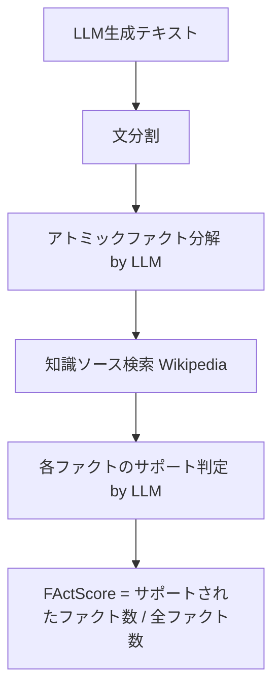

本記事は [FActScore: Fine-grained Atomic Evaluation of Factual Precision in Long Form Text Generation](https://arxiv.org/abs/2307.13528) の解説記事です。

## 論文概要（Abstract）

LLMが生成する長文テキスト（人物の伝記等）には事実と非事実が混在しており、テキスト全体を「正しい/誤り」と二値判定するのは適切ではない。著者らはFActScore（Factual precision in Atomicity Score）を提案し、生成テキストをアトミックファクト（原子的事実）に分解した上で、各ファクトが知識ソースでサポートされるかを個別に判定、サポート率を事実精度として算出する。人間アノテーションとの相関が高く（Pearsonの $r = 0.89$）、GPT-4を含む複数LLMの事実精度を体系的に評価している。EMNLP 2023で発表されている。

この記事は [Zenn記事: Graph-RAG×Neo4jで医療論文の引用グラフから根拠を段階的に検証する](https://zenn.dev/0h_n0/articles/588d477fc6bd46) の深掘りです。

## 情報源

- **arXiv ID**: 2307.13528
- **URL**: [https://arxiv.org/abs/2307.13528](https://arxiv.org/abs/2307.13528)
- **著者**: Sewon Min, Kalpesh Krishna, Xinxi Lyu et al.（University of Washington, UMass Amherst）
- **発表年**: 2023（EMNLP 2023採択）
- **分野**: cs.CL, cs.AI
- **Code**: [https://github.com/shmsw25/FActScore](https://github.com/shmsw25/FActScore)

## 背景と動機（Background & Motivation）

LLMの生成テキストの事実性（factuality）を評価する既存手法には根本的な問題がある。テキスト全体に対する二値的な正誤判定（「この文章は正しいか」）は、部分的に正しく部分的に誤りを含む長文テキストの評価に適していない。例えば、ある人物の伝記で10の事実のうち8つが正しく2つが誤りである場合、テキスト全体を「誤り」と判定するのは情報量が失われる。

既存の自動メトリクス（ROUGE、BERTScore等）は参照テキストとの類似度を測るが、事実精度を直接評価しない。FActScoreは「テキストを最小の事実単位に分解し、各単位の事実性を個別に判定する」というアプローチで、この課題に取り組んでいる。

## 主要な貢献（Key Contributions）

- **アトミックファクト分解**: LLM生成テキストを独立した検証可能な最小事実単位に分解する手法の定義と実装
- **FActScoreメトリクスの定式化**: アトミックファクトのサポート率として事実精度を定量化する数学的フレームワーク
- **自動評価パイプライン**: Wikipedia検索 + LLM判定による人間アノテーションとの高相関（$r = 0.89$）な自動評価手法
- **大規模LLMベンチマーク**: 13のLLMを体系的に評価し、モデル規模・RLHF・検索拡張の影響を分析
- **公開データセットとコード**: 人物伝記500件に対するアトミックファクトアノテーションとFActScore計算コードを公開

## 技術的詳細（Technical Details）

### パイプライン全体像



### FActScoreの定式化

生成テキスト $y$ を人物 $x$ に関する記述とする。$y$ から抽出されたアトミックファクトの集合を $A(y) = \{a_1, a_2, \ldots, a_n\}$ とすると、FActScoreは以下のように定義される:

$$
\text{FActScore}(y) = \frac{1}{|A(y)|} \sum_{i=1}^{|A(y)|} \mathbb{1}[a_i \text{ is supported by } \mathcal{K}]
$$

ここで $\mathcal{K}$ は知識ソース（本論文ではWikipedia）、$\mathbb{1}[\cdot]$ は指示関数である。

モデルレベルのFActScoreは、評価対象の全人物 $\{x_1, \ldots, x_m\}$ に対する平均として計算される:

$$
\text{FActScore}(\text{model}) = \frac{1}{m} \sum_{j=1}^{m} \text{FActScore}(y_j)
$$

### Step 1: アトミックファクト分解

著者らは「アトミックファクト」を「独立して検証可能な最小の情報単位」と定義している。

**分解例**:
- 入力文: "Barack Obama was born in Honolulu, Hawaii, and served as the 44th President of the United States."
- アトミックファクト1: "Barack Obama was born in Honolulu."
- アトミックファクト2: "Honolulu is in Hawaii."
- アトミックファクト3: "Barack Obama served as the 44th President of the United States."

分解にはInstructGPT（text-davinci-003）を使用し、few-shotプロンプティングで分解パターンを指示している。著者らの分析では、1文あたり平均約3.2個のアトミックファクトが抽出されている。

### Step 2: 知識ソース検索

各アトミックファクト $a_i$ に対して、知識ソース $\mathcal{K}$ から関連する証拠パッセージを検索する。

著者らは以下の知識ソースを実験している:
- **Wikipedia全文**: 対象人物のWikipediaページ全文をコンテキストとして使用
- **Wikipedia検索（retrieval）**: 対象人物ページからBM25で上位 $k$ パッセージを検索（$k = 5$）
- **Google検索**: リアルタイムのWeb検索結果を使用

### Step 3: サポート判定

取得したパッセージとアトミックファクトをLLMに入力し、サポートされるか（True/False）を判定する。

```python
def estimate_factscore(
    atomic_facts: list[str],
    knowledge_source: str,
    llm,
) -> float:
    """FActScoreの計算"""
    supported = 0
    for fact in atomic_facts:
        passages = retrieve(fact, knowledge_source, top_k=5)
        context = "\n".join(passages)
        is_supported = llm.judge(
            f"Is the following fact supported by the context?\n"
            f"Context: {context}\n"
            f"Fact: {fact}\n"
            f"Answer (True/False):"
        )
        if is_supported:
            supported += 1
    return supported / len(atomic_facts)
```

### 自動評価の精度

著者らは自動評価の精度を以下のように報告している（論文Table 3より）:

| 自動評価手法 | 人間アノテーションとのPearson $r$ | Cohen's $\kappa$ |
|---|---|---|
| NP overlap（ベースライン） | 0.53 | — |
| InstructGPT + retrieval | 0.83 | 0.72 |
| ChatGPT + retrieval | 0.85 | 0.75 |
| **GPT-4 + retrieval** | **0.89** | **0.78** |
| LLaMA-65B + retrieval | 0.74 | 0.62 |

GPT-4を判定モデルとした場合、人間との一致率が最も高い。著者らは、判定モデルの性能が結果に大きく影響することを注記している。

## 実装のポイント（Implementation）

**アトミックファクト分解の品質**: 分解が粗すぎると複数の事実が1つのファクトに混在し（一方が正しく他方が誤りの場合に判定が曖昧になる）、細かすぎると文脈なしでは検証不能なファクトが生成される。著者らのガイドラインでは「主語と述語を含む完全な命題」を単位としている。

**知識ソースの選択**: Wikipedia全文をコンテキストに使用すると最も高精度だが、コンテキストウィンドウの制約がある。検索ベース（$k = 5$）は実用的だが、関連パッセージが検索されない場合にfalse negativeが発生する。

**コスト考慮**: 1人物の伝記（約20文）の評価で約60-100回のLLM呼び出しが必要。大規模ベンチマーク（500人物）では数万回の呼び出しとなる。著者らはChatGPTの使用でコストを抑えつつ、精度の低下を限定的に抑えられることを示している。

**判定の閾値**: 本論文ではバイナリ判定（supported / not supported）を採用しているが、グレースケール（partially supported）の導入も議論されている。MedRAGCheckerはこの拡張を行い、Retrieval Error / Grounding Error / Hallucination Errorの3分類を導入している。

## 実験結果（Results）

著者らは13のLLMに対して、500人分の人物伝記生成タスクでFActScoreを評価している。

**主要結果（論文Table 5より）**:

| モデル | FActScore | 生成ファクト数/人物 |
|---|---|---|
| GPT-4 | 73.1% | 60.2 |
| ChatGPT | 71.6% | 48.3 |
| InstructGPT (175B) | 52.8% | 36.1 |
| LLaMA-65B | 57.2% | 42.5 |
| Vicuna-13B | 44.9% | 51.2 |
| Alpaca-7B | 32.6% | 38.7 |

**主な知見**:
- モデル規模の拡大は事実精度を向上させる（LLaMA-7B: 25.7% → 65B: 57.2%）
- RLHFは事実精度の向上に寄与する（InstructGPT vs GPT-3ベースライン）
- 検索拡張（Perplexity.ai等）は事実精度を向上させるが、生成テキストの流暢性とのトレードオフがある
- 著名でない人物ほどFActScoreが低い傾向がある（知識の分布に依存）

## 実運用への応用（Practical Applications）

FActScoreのアプローチは、Zenn記事で構築したRAGシステムの回答品質評価に直接応用可能である。

**RAG回答の事実精度監視**: GraphRAGやCG-RAGが生成した回答をアトミックファクトに分解し、各ファクトが検索されたソース文書でサポートされるかを自動判定することで、ハルシネーション率をリアルタイムに監視できる。これはMedRAGCheckerが医療ドメインで実装しているアプローチと同様である。

**Neo4j引用グラフとの統合**: 引用グラフからの回答に含まれる論文メタデータ（著者名、発表年、引用数等）の事実精度を、Neo4jに格納された構造化データと照合することで、グラフDBを知識ソースとしたFActScore計算が可能になる。

## Production Deployment Guide

### AWS実装パターン（コスト最適化重視）

**Small構成（~100 eval/日）**: Lambda + Bedrock + DynamoDB
- AWS Lambda: アトミックファクト分解・サポート判定の各ステップを個別関数化
- Amazon Bedrock（Claude 3.5 Haiku）: 判定モデル（コスト効率重視）
- DynamoDB: 評価結果キャッシュ（同一ファクトの再判定回避）
- S3: 知識ソースドキュメント格納
- 月額概算: $50-150

**Medium構成（~1,000 eval/日）**: ECS Fargate + Bedrock + OpenSearch
- ECS Fargate: バッチ評価ワーカー（並列ファクト判定）
- OpenSearch: 知識ソースの全文検索インデックス（BM25検索）
- ElastiCache Redis: ファクト分解結果・判定結果キャッシュ
- 月額概算: $300-700

**Large構成（10,000+ eval/日）**: EKS + Bedrock Batch + OpenSearch
- EKS: 評価パイプラインのオートスケーリング
- Bedrock Batch API: 大量判定リクエストを50%コスト削減
- Neptune: 評価結果のグラフ構造化（ファクト間の依存関係追跡）
- 月額概算: $1,500-4,000

### Terraformインフラコード

```hcl
module "factscore_lambda" {
  source = "./modules/lambda"

  function_name = "factscore-evaluator"
  runtime       = "python3.12"
  memory_size   = 512
  timeout       = 300
  handler       = "handler.lambda_handler"

  environment_variables = {
    BEDROCK_MODEL_ID     = "anthropic.claude-3-5-haiku-20241022-v1:0"
    DYNAMODB_TABLE       = module.dynamodb.table_name
    OPENSEARCH_ENDPOINT  = module.opensearch.endpoint
    TOP_K_PASSAGES       = "5"
  }
}

module "dynamodb" {
  source = "./modules/dynamodb"

  table_name = "factscore-cache"
  hash_key   = "fact_hash"
  range_key  = "knowledge_source"

  attributes = [
    { name = "fact_hash",        type = "S" },
    { name = "knowledge_source", type = "S" }
  ]

  ttl_attribute = "expires_at"
  billing_mode  = "PAY_PER_REQUEST"
}

resource "aws_cloudwatch_metric_alarm" "factscore_low" {
  alarm_name          = "factscore-below-threshold"
  comparison_operator = "LessThanThreshold"
  evaluation_periods  = 3
  metric_name         = "AverageFActScore"
  namespace           = "Custom/FActScore"
  period              = 3600
  statistic           = "Average"
  threshold           = 0.7
  alarm_actions       = [aws_sns_topic.alerts.arn]
}
```

### コスト最適化チェックリスト

- **アーキテクチャ選択**: 評価頻度でServerless/Container判断。バッチ評価にはBedrock Batch API活用
- **LLMコスト削減**: 判定モデルにClaude 3.5 Haiku使用（Sonnet比約1/10コスト）。DynamoDBでファクト判定結果をキャッシュし重複呼び出し削減
- **検索最適化**: OpenSearchのフィールドブースティングで関連パッセージの検索精度向上。top_k=5で精度とコストのバランスを確保
- **監視・アラート**: FActScoreの時系列モニタリング。閾値（0.7）を下回った場合にアラート発報

## 関連研究（Related Work）

- **MedRAGChecker（2502.04689）**: FActScoreのアトミックファクト分解を医療RAGに拡張し、Retrieval/Grounding/Hallucinationの3エラータイプを定義
- **SAFE（2403.18802）**: Google DeepMindによるFActScoreの改良版。検索拡張でLLMの自律的ファクトチェックを実現
- **FactCheck-GPT（2305.06058）**: ChatGPTの応答の事実性を多段階パイプラインで検証するフレームワーク

## まとめと今後の展望

FActScoreは、LLM生成テキストの事実精度をアトミックファクト単位で定量評価する手法である。テキスト全体の二値判定ではなく、個々の事実の正誤を独立に判定することで、きめ細かな品質評価が可能になる。GPT-4を判定モデルとした場合の人間アノテーションとの相関（$r = 0.89$）は、自動評価の実用性を示している。

著者らが認める制約として、アトミックファクト分解の品質が分解モデルに依存すること、知識ソースのカバレッジが評価精度の上限を決めること、バイナリ判定では部分的なサポートを捉えきれないことが挙げられている。MedRAGCheckerやSAFEなど、FActScoreを基盤とした発展的手法が続々と発表されている。

## 参考文献

- **arXiv**: [https://arxiv.org/abs/2307.13528](https://arxiv.org/abs/2307.13528)
- **Code**: [https://github.com/shmsw25/FActScore](https://github.com/shmsw25/FActScore)
- **EMNLP 2023**: Proceedings of the 2023 Conference on Empirical Methods in Natural Language Processing
- **Related Zenn article**: [https://zenn.dev/0h_n0/articles/588d477fc6bd46](https://zenn.dev/0h_n0/articles/588d477fc6bd46)

---

:::message
この記事はAI（Claude Code）により自動生成されました。内容の正確性については複数の情報源で検証していますが、実際の利用時は公式ドキュメントもご確認ください。
:::
