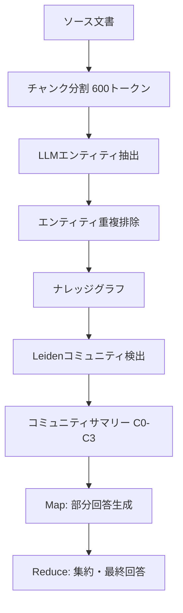

本記事は [From Local to Global: A Graph RAG Approach to Query-Focused Summarization](https://arxiv.org/abs/2404.16130) の解説記事です。

## 論文概要（Abstract）

RAGは外部知識を用いてLLMに質問回答させるが、「このデータセットの主要テーマは何か」といった文書コレクション全体の理解を要する**グローバルクエリ**には対応できない。著者らはGraphRAGを提案し、LLMでソース文書からナレッジグラフを構築し、Leidenアルゴリズムによる階層的コミュニティ検出でグラフを要約、クエリ時にMap-Reduce方式でコミュニティサマリーから部分回答を生成・集約する。Naive RAGと比較して包括性（comprehensiveness）で72-83%、多様性（diversity）で62-76%のペアワイズ比較勝率を達成している。

この記事は [Zenn記事: Graph-RAG×Neo4jで医療論文の引用グラフから根拠を段階的に検証する](https://zenn.dev/0h_n0/articles/588d477fc6bd46) の深掘りです。

## 情報源

- **arXiv ID**: 2404.16130
- **URL**: [https://arxiv.org/abs/2404.16130](https://arxiv.org/abs/2404.16130)
- **著者**: Darren Edge, Ha Thanh Trinh, Newman Cheng et al.（Microsoft）
- **発表年**: 2024（NAACL 2024採択）
- **分野**: cs.CL, cs.AI, cs.LG
- **Code**: [https://github.com/microsoft/graphrag](https://github.com/microsoft/graphrag)

## 背景と動機（Background & Motivation）

従来のRAGは「ローカルクエリ」—— 特定の事実を見つければ回答できる質問 ——に有効だが、文書コレクション全体を俯瞰する「グローバルクエリ」には対応できない。例えば「このデータセットで最も議論されているテーマは何か」「主要なエンティティ間の関係は何か」といった質問に対して、チャンク単位の検索では全体像を捉えられない。

フルコンテキスト手法（全文書をコンテキストウィンドウに投入）はコンテキスト長の制限があり、チャンクベースの検索手法はグローバルな文脈を見落とす。GraphRAGはこのギャップを、LLMによるナレッジグラフ構築と階層的コミュニティ検出による中間表現を通じて埋めることを目指している。

## 主要な貢献（Key Contributions）

- **LLMベースのエンティティ・関係抽出**: NLPベースのNER（spaCy等）と比較して、文脈を理解した暗黙的エンティティの抽出と豊かな関係記述を生成（NLPベースを有意に上回ると報告）
- **Leidenアルゴリズムによる階層的コミュニティ検出**: Louvainアルゴリズムと異なりwell-connectedなコミュニティを保証し、複数粒度（C0〜C3）の階層を生成
- **コミュニティサマリーによる中間表現**: 各コミュニティのLLM生成サマリーが効率的なグローバルクエリを実現
- **Map-Reduce方式のクエリ回答**: コミュニティサマリーから部分回答を並列生成し、helpfulnessスコアで選別・集約

## 技術的詳細（Technical Details）

### パイプライン全体像



### Step 1: テキストチャンク → エンティティ抽出

ソース文書を600トークンのオーバーラップ付きチャンクに分割し、各チャンクからLLM（GPT-4-turbo）でエンティティと関係を抽出する。

抽出される情報:
- **エンティティ**: `entity_name`（大文字化）, `entity_type`（PERSON/ORGANIZATION/GEO/EVENT等）, `entity_description`（包括的属性記述）
- **関係**: `source_entity`, `target_entity`, `relationship_description`, `relationship_strength`（1-10の整数スコア）

多段抽出アプローチを採用し、最初の抽出後に「追加エンティティがあれば抽出」する追加ラウンドを実行することで、より完全な抽出を実現している。

### Step 2: エンティティ重複排除

同一エンティティが複数チャンクに出現するため、以下のプロセスで統合する。

1. 同一エンティティの全メンションをグループ化
2. LLMが単一の包括的サマリーを生成
3. 関係も同様にサマリー化

### Step 3: Leidenアルゴリズムによるコミュニティ検出

生成されたグラフ（ノード=エンティティ、エッジ=関係）にLeidenアルゴリズムを適用する。

**Leidenの選択理由**:
- Louvainアルゴリズムは非連結コミュニティを生成しうるが、Leidenは常にwell-connectedなコミュニティを保証する
- 階層的に動作し、Level 0（最細粒度）〜Level 3（最粗粒度）の複数レベルを生成
- Resolutionパラメータ: 1.0（デフォルト）

Leidenアルゴリズムはモジュラリティ $Q$ を最大化する。モジュラリティは以下のように定義される:

$$
Q = \frac{1}{2m} \sum_{ij} \left[ A_{ij} - \frac{k_i k_j}{2m} \right] \delta(c_i, c_j)
$$

ここで $A_{ij}$ は隣接行列、$k_i$ はノード $i$ の次数、$m$ は辺の総数、$c_i$ はノード $i$ の所属コミュニティ、$\delta$ はクロネッカーデルタである。Leidenは3フェーズ（local moving → refinement → aggregation）を繰り返し、Louvainのrefinementフェーズの欠如を補完する。

著者らの実験では、約100万トークンのコーパスから約47,000エンティティ・約77,000関係が抽出され、約13,000のコミュニティサマリーが全レベルで生成されている。

### Step 4: コミュニティサマリーの生成

各コミュニティに対してLLMがレポートを生成する。レポートの構造:
- タイトル: コミュニティのキーエンティティを代表する名前
- サマリー: エグゼクティブサマリー
- IMPACT SEVERITY RATING: 0-10のスコア
- 詳細所見: 5-10のキーインサイト

上位レベルコミュニティでコンテキストウィンドウに収まらない場合は、子コミュニティのレポートを入力として使用する。

### Step 5: Map-Reduce方式のクエリ回答

**Map Phase（並列処理）**:

各コミュニティサマリー $s_i$ にクエリ $q$ を投入し、LLMが部分回答 $a_i$ とhelpfulnessスコア $h_i \in [0, 100]$ を生成する。

```python
def map_phase(query: str, summaries: list[str], llm) -> list[tuple[str, int]]:
    """各コミュニティサマリーから部分回答を並列生成"""
    results = []
    for summary in summaries:
        answer, score = llm.generate_partial_answer(query, summary)
        if score > 0:
            results.append((answer, score))
    return sorted(results, key=lambda x: x[1], reverse=True)
```

**Reduce Phase**:

1. helpfulnessスコア $h_i$ で降順ソート
2. コンテキストウィンドウが満杯になるまで上位の部分回答を追加
3. LLMがこれらの部分回答を統合して最終回答を生成

```python
def reduce_phase(
    query: str,
    ranked_answers: list[tuple[str, int]],
    llm,
    max_tokens: int = 4096,
) -> str:
    """上位の部分回答を集約して最終回答を生成"""
    context_parts = []
    token_count = 0
    for answer, score in ranked_answers:
        tokens = count_tokens(answer)
        if token_count + tokens > max_tokens:
            break
        context_parts.append(answer)
        token_count += tokens
    return llm.synthesize(query, context_parts)
```

このMap-Reduce設計により、コミュニティ数に比例したLLM呼び出しが発生するが、Map Phaseは完全並列化が可能であり、スループットはバッチサイズで制御できる。

### Local Search vs. Global Search

GraphRAGは2つのクエリモードを提供する。

| モード | 対象クエリ | 使用する情報 |
|---|---|---|
| **Global Search** | 「主なテーマは？」等の俯瞰的質問 | コミュニティサマリー階層 |
| **Local Search** | 「Xとは何か？」等の具体的質問 | KGのエンティティ+テキストチャンク |

## 実装のポイント（Implementation）

**チャンクサイズの選択**: 著者らは600トークンを推奨している。小さすぎるとLLM呼び出し回数が増加しコストが上昇、大きすぎるとLLMが情報を圧縮しエンティティを見逃す。

**コミュニティレベルの選択**: C1またはC2が包括性・多様性・効率のバランスが最良と報告されている。C0は最も詳細だがクエリ時のLLM呼び出し数が多く高コスト、C3は要約度が高すぎて詳細が失われる。

**インデックス構築コスト**: 約100万トークンのコーパスで数十万回のLLM呼び出し（GPT-4-turbo）が必要。一回限りのコストだが、大規模コーパスでは費用が大きくなる。コストはクエリ数で按分される。

**動的コーパスの制約**: 静的コーパス向けの設計であり、頻繁に更新されるコーパスでは再インデックスが必要。差分更新の仕組みは論文では提案されていない。

## 実験結果（Results）

著者らは2つの約100万トークン規模のデータセット（Podcast Transcripts、News Articles）で評価を行っている。

**評価軸（GPT-4をジャッジとしたペアワイズ比較）**:
1. Comprehensiveness（包括性）: 質問の関連側面をすべてカバーしているか
2. Diversity（多様性）: 多様な視点を提示しているか
3. Empowerment（理解支援）: 読者の理解を助けるか
4. Directness（直接性）: 質問に直接答えているか

**GraphRAG vs. Naive RAG（論文Figure/Tableより）**:
- Comprehensiveness: GraphRAGが約72-83%のペアワイズ比較で勝利
- Diversity: GraphRAGが約62-76%のペアワイズ比較で勝利
- 両データセットで一貫した優位性

**GraphRAG vs. Global Summarization**:
- Comprehensiveness: GraphRAG（C0・C1レベル）が競合的または優位
- Diversity: GraphRAGが約57-70%で勝利
- Directness: Global Summarizationが優る場合あり

**LLMベース vs. NLPベースのグラフ構築**: LLMベースの抽出が有意に優れる。NLPツール（spaCy等）は標準NERカテゴリ以外のエンティティを見逃し、LLMは文脈を理解した暗黙的エンティティの抽出と豊かな関係記述が可能。

## 実運用への応用（Practical Applications）

GraphRAGのアーキテクチャは、Zenn記事で構築したNeo4j引用グラフと直接的に組み合わせ可能である。

**GraphRAGのコミュニティ検出 + Neo4jの引用グラフ**: 論文の引用関係グラフにLeidenアルゴリズムを適用すれば、研究トピックごとのコミュニティが自動的に検出され、「この分野の主要な研究クラスタは何か」というグローバルクエリに応答可能になる。Neo4jのGDS（Graph Data Science）ライブラリにはLeidenアルゴリズムが組み込まれており、Cypherから直接呼び出せる。

**注意すべきトレードオフ**:
- インデックス構築コストが高い（100万トークンコーパスで数十万LLMコール）
- 静的コーパス前提のため、新着論文の追加には再構築が必要
- Global Searchは包括的だが、具体的な事実検索にはLocal Searchが適切

## Production Deployment Guide

GraphRAGをプロダクション環境にデプロイする際のAWS構成パターンを示す。

### AWS実装パターン（コスト最適化重視）

**Small構成（~100 req/日）**: Lambda + Bedrock + Neptune Serverless
- AWS Lambda: インデックス構築ジョブ・クエリハンドラ（メモリ1024MB、タイムアウト900s）
- Amazon Bedrock（Claude 3.5 Sonnet）: エンティティ抽出・サマリー生成・クエリ回答
- Amazon Neptune Serverless: ナレッジグラフ格納（Gremlin/openCypher対応）
- S3: ソース文書・チャンクキャッシュ格納
- 月額概算: $100-300（Bedrockトークン使用量に依存）

**Medium構成（~1,000 req/日）**: ECS Fargate + Bedrock + Neptune
- ECS Fargate: Map Phase並列ワーカー（タスク数=コミュニティサマリー数/バッチサイズ）
- Neptune プロビジョンド: db.r6g.large（安定したグラフクエリ性能）
- ElastiCache Redis: コミュニティサマリーキャッシュ（TTL=インデックス再構築間隔）
- 月額概算: $500-1,200

**Large構成（10,000+ req/日）**: EKS + Karpenter + Neptune + Bedrock Batch
- EKS + Karpenter: Spot優先のワーカーノード自動スケーリング
- Bedrock Batch API: インデックス構築時の大量LLM呼び出しを50%コスト削減
- Neptune db.r6g.xlarge: 数十万ノード規模のグラフに対応
- CloudFront: クエリ結果キャッシュ（同一クエリの繰り返しを吸収）
- 月額概算: $3,000-8,000

### Terraformインフラコード

**Small構成 (Serverless)**:

```hcl
module "graphrag_lambda" {
  source = "./modules/lambda"

  function_name = "graphrag-query-handler"
  runtime       = "python3.12"
  memory_size   = 1024
  timeout       = 900
  handler       = "handler.lambda_handler"

  environment_variables = {
    NEPTUNE_ENDPOINT   = module.neptune.cluster_endpoint
    BEDROCK_MODEL_ID   = "anthropic.claude-3-5-sonnet-20241022-v2:0"
    S3_BUCKET          = module.s3.bucket_name
    COMMUNITY_LEVEL    = "2"
  }
}

module "neptune" {
  source = "./modules/neptune-serverless"

  cluster_identifier = "graphrag-kg"
  min_capacity       = 1.0
  max_capacity       = 8.0

  vpc_id             = module.vpc.vpc_id
  subnet_ids         = module.vpc.private_subnet_ids
  security_group_ids = [module.sg.neptune_sg_id]
}

resource "aws_iam_role_policy" "bedrock_invoke" {
  name = "graphrag-bedrock-invoke"
  role = module.graphrag_lambda.role_id

  policy = jsonencode({
    Version = "2012-10-17"
    Statement = [{
      Effect   = "Allow"
      Action   = ["bedrock:InvokeModel", "bedrock:InvokeModelWithResponseStream"]
      Resource = "arn:aws:bedrock:ap-northeast-1::foundation-model/anthropic.*"
    }]
  })
}
```

**Large構成 (Container)**:

```hcl
module "eks" {
  source  = "terraform-aws-modules/eks/aws"
  version = "~> 20.0"

  cluster_name    = "graphrag-production"
  cluster_version = "1.31"

  vpc_id     = module.vpc.vpc_id
  subnet_ids = module.vpc.private_subnet_ids

  eks_managed_node_groups = {
    workers = {
      capacity_type  = "SPOT"
      instance_types = ["m6i.xlarge", "m6a.xlarge", "m5.xlarge"]
      min_size       = 2
      max_size       = 20
      desired_size   = 3
    }
  }
}

resource "aws_budgets_budget" "graphrag_monthly" {
  name         = "graphrag-monthly-budget"
  budget_type  = "COST"
  limit_amount = "8000"
  limit_unit   = "USD"
  time_unit    = "MONTHLY"

  notification {
    comparison_operator       = "GREATER_THAN"
    threshold                 = 80
    threshold_type            = "PERCENTAGE"
    notification_type         = "ACTUAL"
    subscriber_sns_topic_arns = [aws_sns_topic.cost_alerts.arn]
  }
}
```

### 運用・監視設定

**CloudWatch Logs Insights — Bedrockトークン使用量分析**:

```
fields @timestamp, @message
| filter @message like /bedrock/
| stats sum(input_tokens) as total_input, sum(output_tokens) as total_output,
        count(*) as api_calls by bin(1h)
| sort @timestamp desc
```

**GraphRAG固有のメトリクス監視**:
- インデックス構築時間: コーパスサイズに対する線形性を監視（異常な超線形増加は抽出プロンプトの問題を示唆）
- コミュニティサマリーのhelpfulnessスコア分布: スコア0の部分回答が多い場合、コミュニティレベルの選択を見直す
- Map Phase並列度: Fargate/EKSワーカー数とLLMレートリミットのバランス

**X-Ray トレーシング設定**:

```python
from aws_xray_sdk.core import xray_recorder, patch_all

patch_all()

@xray_recorder.capture("graphrag_query")
def handle_query(query: str, community_level: int = 2):
    xray_recorder.current_subsegment().put_annotation("community_level", community_level)
    xray_recorder.current_subsegment().put_metadata("query", query)
    # Map-Reduce実行
```

### コスト最適化チェックリスト

- **アーキテクチャ選択**: クエリ頻度でServerless/Container/Hybridを判断。バッチインデックス構築にはBedrock Batch APIを使用
- **リソース最適化**: Map Phase並列ワーカーにSpot Instancesを使用（中断時はリトライで対応可能）。Neptune Serverlessで非ピーク時のコストを自動削減
- **LLMコスト削減**: Prompt Cachingでエンティティ抽出プロンプトのシステム部分をキャッシュ（30-90%削減）。コミュニティレベルC1-C2を選択しMap Phase呼び出し数を抑制
- **監視・アラート**: AWS Budgetsで月額上限を設定。Cost Anomaly Detectionでインデックス再構築時の異常コストを検知

## 関連研究（Related Work）

- **MedGraphRAG（2408.04187）**: GraphRAGを医療ドメインに特化し、Entity/Concept階層とプライバシー保護を追加した発展形
- **CG-RAG（2501.15067）**: エンティティ-関係グラフではなく引用グラフを直接使用するアプローチ。GraphRAGとは相補的
- **HippoRAG（2408.08921）**: 海馬の索引理論に着想を得たRAG。グラフ構造を神経科学的モデルで設計

## まとめと今後の展望

GraphRAGは、LLMによるナレッジグラフ構築とLeidenアルゴリズムの階層的コミュニティ検出を組み合わせ、従来のRAGでは不可能だったグローバルクエリへの回答を実現した。MicrosoftがOSSとして公開しており（github.com/microsoft/graphrag）、実装の参照が容易である。

著者らが認める制約として、高いインデックス構築コスト、LLMベースのエンティティ重複排除の不完全性、動的コーパスへの対応困難がある。今後はインデックス構築の効率化、マルチモーダル対応、動的コーパスへの差分更新が研究課題とされている。

## 参考文献

- **arXiv**: [https://arxiv.org/abs/2404.16130](https://arxiv.org/abs/2404.16130)
- **Code**: [https://github.com/microsoft/graphrag](https://github.com/microsoft/graphrag)
- **NAACL 2024**: Proceedings of the 2024 Conference of the North American Chapter of the Association for Computational Linguistics
- **Related Zenn article**: [https://zenn.dev/0h_n0/articles/588d477fc6bd46](https://zenn.dev/0h_n0/articles/588d477fc6bd46)

---

:::message
この記事はAI（Claude Code）により自動生成されました。内容の正確性については複数の情報源で検証していますが、実際の利用時は公式ドキュメントもご確認ください。
:::
