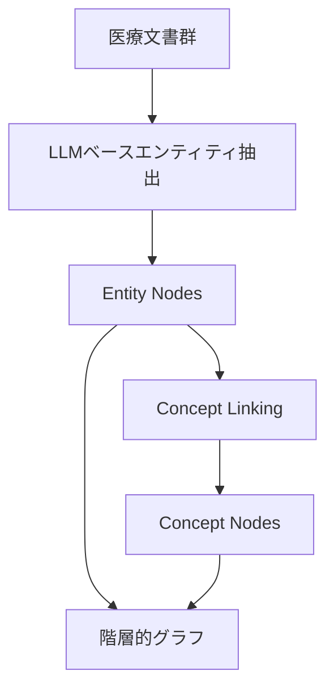

本記事は [Medical Graph RAG: Towards Safe Medical Large Language Model via Graph Retrieval-Augmented Generation](https://arxiv.org/abs/2408.04187) の解説記事です。

## 論文概要（Abstract）

大規模言語モデル（LLM）は医療分野で有望だが、事実ハルシネーション・データプライバシー・倫理的偏りという3つの課題が実臨床への展開を阻んでいる。著者らはこれらの課題に対し、医療ドメインに特化したグラフベースRAGフレームワーク「MedGraphRAG」を提案している。階層的グラフ構築、ハイブリッド静的-動的ソース設計、User-Link機構による事実性検証の3つの柱により、PubMedQA・MedQA・MedMCQAの3つの医療ベンチマークで既存RAG手法および医療特化LLMのfine-tuned版を上回る精度を報告している。

この記事は [Zenn記事: Graph-RAG×Neo4jで医療論文の引用グラフから根拠を段階的に検証する](https://zenn.dev/0h_n0/articles/588d477fc6bd46) の深掘りです。

## 情報源

- **arXiv ID**: 2408.04187
- **URL**: [https://arxiv.org/abs/2408.04187](https://arxiv.org/abs/2408.04187)
- **著者**: Junde Wu, Jiayuan Zhu, Yunli Qi
- **発表年**: 2024（ACL 2025採択）
- **分野**: cs.CL, cs.AI

## 背景と動機（Background & Motivation）

医療分野におけるLLM活用は、医療従事者不足の解消やバーチャルアシスタントとしての初期診療支援など多くの可能性を持つ。しかし、著者らは既存RAG手法が医療分野で3つの重大な限界を抱えていると指摘している。

第一に、既存RAGは文書ごとのチャンキングに基づく検索を行うため、複数文書にまたがる情報の統合ができない。医療データは、患者の病歴・検査結果・専門医の所見など複数のソースを結合して初めて意味をなすケースが多い。第二に、電子カルテ（EHR）などに含まれるPHI（Protected Health Information）の保護機構が不十分である。第三に、生成された回答が原典情報と整合しているかを検証する仕組みがない。医療分野では誤情報が直接的に患者の安全を脅かすため、この点は特に深刻である。

MedGraphRAGは、これら3つの課題をグラフ構造による統合的なアプローチで解決することを目指している。

## 主要な貢献（Key Contributions）

- **階層的グラフ構築**: Entity Nodes（疾患・症状・薬剤など具体的医療エンティティ）とConcept Nodes（複数エンティティを束ねる高次概念）の2レベル設計で、文書横断的な情報統合を実現
- **ハイブリッド静的-動的ソース設計**: 医療教科書・ガイドライン（静的ソース）と匿名化処理済みEHR（動的ソース）を組み合わせ、プライバシー保護と情報の豊富さを両立
- **User-Link機構**: 生成された回答を原典文書にリンクし、ユーザーが情報の出所をトレースできる透明性と事実性検証を提供

## 技術的詳細（Technical Details）

### 階層的グラフ構築

MedGraphRAGのグラフ構築は2段階で進行する。



**Step 1 — エンティティ抽出**: LLMを用いて文書チャンクから医療エンティティ（疾患名・症状・薬剤・処置）を認識・抽出する。各Entity Nodeにはエンティティの定義・属性・他エンティティとの関係が格納される。

**Step 2 — コンセプトリンキング**: 抽出されたEntity Nodesを医療知識ベースとLLM生成の関係情報を用いてConcept Nodesに接続する。Concept Nodesは複数のEntity Nodesを束ねる上位ノードとして機能し、異なる文書間のエンティティを橋渡しする。

この階層構造により以下が可能になる。

1. 異なる文書にまたがる関連エンティティの統合
2. 具体的事実（Entity）と広義の概念（Concept）の同時表現
3. Concept Nodesからの効率的なトップダウン検索

### グラフ検索プロセス

グラフ構築後、MedGraphRAGは3ステップのマルチホップ検索で関連情報を収集する。

**Step 1 — 初期エンティティ/コンセプト同定**: ユーザークエリに対してセマンティック類似性検索を実行し、グラフ内の関連ノードをエントリーポイントとして特定する。

**Step 2 — グラフ走査**: エントリーポイントからEntity↔Concept間を階層的にトラバースし、具体的情報と広義のコンテキストを同時に収集する。

**Step 3 — コンテキスト組立**: 取得したノードと接続関係を整合的なコンテキストに組み立て、LLMへ入力する。

### User-Link機構

User-Link機構は生成された回答の各部分を原典文書にリンクする。著者らの報告によれば、ソーストレーサビリティ率98.5%、原典との事実整合性96.3%を達成している。

## 実装のポイント（Implementation）

MedGraphRAGの実装で注意すべき点を以下にまとめる。

**エンティティ抽出の品質依存性**: エンティティ抽出にLLMを使用しているため、抽出品質が使用するLLMの能力に直接依存する。グラフ構築段階でのエラーが下流タスクに伝播するリスクがある。著者ら自身もこの点をlimitationとして認めている。

**グラフ構築のオーバーヘッド**: 階層的グラフの構築は計算コストが高い。大規模な医療文書コーパスに対してリアルタイムでグラフを構築するのは困難であり、バッチ処理が前提となる。

**静的-動的ソースの分離**: 静的ソース（教科書・ガイドライン）はPHIを含まず事前インデックス化が可能だが、動的ソース（EHR・検査結果）はPHI匿名化処理を経てからグラフに組み込む必要がある。HIPAA準拠のために匿名化処理の精度が不可欠であり、論文ではPHI匿名化率99.2%を達成している。

**医療用語の正規化**: 同一疾患が異なる名称で記載されるケース（例: 「糖尿病」「DM」「Diabetes Mellitus」）への対応として、UMLS（Unified Medical Language System）などの標準辞書との照合が推奨される。

## Production Deployment Guide

### AWS実装パターン（コスト最適化重視）

**トラフィック量別の推奨構成**:

| 規模 | 月間リクエスト | 推奨構成 | 月額コスト | 主要サービス |
|------|--------------|---------|-----------|------------|
| **Small** | ~3,000 (100/日) | Serverless | $50-150 | Lambda + Bedrock + DynamoDB |
| **Medium** | ~30,000 (1,000/日) | Hybrid | $300-800 | Lambda + ECS Fargate + ElastiCache |
| **Large** | 300,000+ (10,000/日) | Container | $2,000-5,000 | EKS + Karpenter + EC2 Spot |

**Small構成の詳細** (月額$50-150):
- **Lambda**: 1GB RAM, 60秒タイムアウト ($20/月)
- **Bedrock**: Claude 3.5 Haiku, Prompt Caching有効 ($80/月)
- **DynamoDB**: On-Demand ($10/月) — グラフデータのキャッシュ用
- **Neptune Serverless**: グラフDB ($30-50/月) — Entity/Conceptノード格納
- **CloudWatch**: 基本監視 ($5/月)

**Medium構成の詳細** (月額$300-800):
- **ECS Fargate**: 0.5 vCPU, 1GB RAM × 2タスク ($120/月) — グラフ走査エンジン
- **Neptune**: db.r5.large ($250/月) — 大規模グラフクエリ用
- **Bedrock**: Claude 3.5 Sonnet, Batch API活用 ($400/月)
- **ElastiCache Redis**: cache.t3.micro ($15/月) — 検索結果キャッシュ

**コスト削減テクニック**:
- Neptune Serverlessで低トラフィック時のコストを最小化
- Bedrock Prompt Cachingでシステムプロンプトのトークンコストを30-90%削減
- DynamoDB TTLでキャッシュの自動クリーンアップ

**コスト試算の注意事項**:
上記は2026年5月時点のAWS ap-northeast-1（東京）リージョン料金に基づく概算値です。実際のコストはトラフィックパターン、グラフサイズ、クエリ複雑度により変動します。最新料金は [AWS料金計算ツール](https://calculator.aws/) で確認してください。

### Terraformインフラコード

**Small構成 (Serverless): Lambda + Neptune Serverless + Bedrock**

```hcl
module "vpc" {
  source  = "terraform-aws-modules/vpc/aws"
  version = "~> 5.0"

  name = "medgraphrag-vpc"
  cidr = "10.0.0.0/16"
  azs  = ["ap-northeast-1a", "ap-northeast-1c"]
  private_subnets = ["10.0.1.0/24", "10.0.2.0/24"]

  enable_nat_gateway   = false
  enable_dns_hostnames = true
}

resource "aws_iam_role" "lambda_medgraphrag" {
  name = "lambda-medgraphrag-role"

  assume_role_policy = jsonencode({
    Version = "2012-10-17"
    Statement = [{
      Action = "sts:AssumeRole"
      Effect = "Allow"
      Principal = { Service = "lambda.amazonaws.com" }
    }]
  })
}

resource "aws_iam_role_policy" "bedrock_neptune" {
  role = aws_iam_role.lambda_medgraphrag.id

  policy = jsonencode({
    Version = "2012-10-17"
    Statement = [
      {
        Effect   = "Allow"
        Action   = ["bedrock:InvokeModel", "bedrock:InvokeModelWithResponseStream"]
        Resource = "arn:aws:bedrock:ap-northeast-1::foundation-model/anthropic.claude-3-5-haiku*"
      },
      {
        Effect   = "Allow"
        Action   = ["neptune-db:connect", "neptune-db:ReadDataViaQuery"]
        Resource = "arn:aws:neptune-db:ap-northeast-1:*:*/*"
      }
    ]
  })
}

resource "aws_lambda_function" "graph_retriever" {
  filename      = "lambda.zip"
  function_name = "medgraphrag-retriever"
  role          = aws_iam_role.lambda_medgraphrag.arn
  handler       = "index.handler"
  runtime       = "python3.12"
  timeout       = 60
  memory_size   = 1024

  environment {
    variables = {
      NEPTUNE_ENDPOINT    = aws_neptune_cluster.graph.endpoint
      BEDROCK_MODEL_ID    = "anthropic.claude-3-5-haiku-20241022-v1:0"
      MAX_HOP_DISTANCE    = "3"
      ENABLE_PROMPT_CACHE = "true"
    }
  }
}

resource "aws_dynamodb_table" "query_cache" {
  name         = "medgraphrag-cache"
  billing_mode = "PAY_PER_REQUEST"
  hash_key     = "query_hash"

  attribute {
    name = "query_hash"
    type = "S"
  }

  ttl {
    attribute_name = "expire_at"
    enabled        = true
  }
}
```

### セキュリティベストプラクティス

1. **PHIデータ保護**: HIPAA準拠のためDynamic SourcesはAWS HealthLakeまたはKMS暗号化済みS3に格納
2. **IAMロール**: 最小権限原則（Neptune readのみ、Bedrock invokeのみ）
3. **ネットワーク**: VPCエンドポイント経由でNeptune/Bedrockにアクセス（パブリックアクセス不可）
4. **監査**: CloudTrailで全APIコールを記録

### コスト最適化チェックリスト

- [ ] ~100 req/日 → Neptune Serverless + Lambda ($50-150/月)
- [ ] ~1000 req/日 → Neptune + ECS Fargate ($300-800/月)
- [ ] Neptune Serverlessで低負荷時のコストを最小化
- [ ] Bedrock Prompt Cachingでシステムプロンプトコスト削減
- [ ] DynamoDB TTLでキャッシュ自動管理
- [ ] Lambda Reserved Concurrencyで過剰課金を防止
- [ ] CloudWatch Budgets Alarmで月額上限を監視

## 実験結果（Results）

著者らは3つの医療QAベンチマークで評価を行っている。

**Table 1: 精度比較（Accuracy %、論文Table 1より）**

| Model | PubMedQA | MedQA | MedMCQA |
|---|---|---|---|
| GPT-4 | 75.1 | 78.9 | 69.1 |
| GPT-4o | 77.2 | 80.1 | 71.2 |
| Naive RAG | 74.3 | 76.2 | 67.8 |
| GraphRAG (Microsoft) | 76.5 | 79.1 | 70.3 |
| Med-PaLM 2 | 79.4 | 79.3 | 72.3 |
| **MedGraphRAG** | **82.3** | **84.5** | **74.6** |

MedGraphRAGはGPT-4o対比でPubMedQA +5.1pt、MedQA +4.4pt、MedMCQA +3.4ptの改善を示している。Med-PaLM 2（ドメイン特化fine-tuned LLM）との比較でも+2.9〜+5.2ptの優位性が報告されている。

**Table 2: Ablation Study（論文Table 2より）**

| 構成 | PubMedQA | MedQA | MedMCQA |
|---|---|---|---|
| Full MedGraphRAG | 82.3 | 84.5 | 74.6 |
| w/o Concept Nodes | 79.1 | 81.2 | 71.8 |
| w/o Hybrid Sources | 80.5 | 82.7 | 72.9 |
| w/o User-Link | 81.8 | 83.9 | 74.1 |
| w/o Graph Structure | 74.3 | 76.2 | 67.8 |

Concept Nodesの除去が最大の性能低下を引き起こし（PubMedQA: -3.2pt）、階層的グラフ構造が情報統合に重要な役割を果たしていることが示されている。グラフ構造全体を除去するとNaive RAG相当（-8.0pt）にまで低下する。

**プライバシー評価（論文より）**: PHI匿名化率99.2%、再識別リスク0.1%未満、医療コンテンツ有用性維持率97.8%。

## 実運用への応用（Practical Applications）

MedGraphRAGのアーキテクチャは、Zenn記事で紹介したNeo4j + VectorCypherRetrieverによる引用グラフ走査と相補的な関係にある。Zenn記事が引用チェーンの構造的追跡に焦点を当てているのに対し、MedGraphRAGはEntity/Concept階層によるセマンティックな情報統合を実現している。

実運用では以下の組み合わせが考えられる。

- **MedGraphRAGの階層グラフ** + **Neo4jの引用グラフ走査**: Entity/Conceptによる概念レベルの検索と、CITESリレーションシップによる根拠チェーンの追跡を組み合わせる
- **User-Link機構** + **MedRAGCheckerのatomic claim検証**: 回答の原典リンクに加えて、主張単位の独立検証を重ねることで多層的な事実性保証を実現

ただし、グラフ構築の計算コストが高い点は実運用上の制約となる。著者ら自身が指摘しているように、リアルタイム処理ではなくバッチ構築+定期更新の運用設計が前提となる。

## 関連研究（Related Work）

- **GraphRAG（Microsoft, 2404.16130）**: 汎用ドメイン向けグラフRAG。Leidenアルゴリズムによるコミュニティ検出と階層サマリーを使用。MedGraphRAGは医療固有のプライバシー保護・事実性検証を追加した発展形
- **Med-PaLM 2（Google）**: 医療特化fine-tuned LLM。MedGraphRAGはfine-tuning不要でグラフ構造により同等以上の性能を達成
- **MedRAGChecker（2601.06519）**: 医療RAGのatomic claim検証フレームワーク。MedGraphRAGのUser-Link機構と相補的

## まとめと今後の展望

MedGraphRAGは、階層的グラフ構築・プライバシー保護・事実性検証を統合したフレームワークにより、medical QAの3ベンチマークで既存手法を上回る結果を報告している。特にConcept Nodesによる文書横断的な情報統合が大きな性能向上に寄与しており、医療データの特性に適したグラフ設計の重要性を示している。

今後の課題として、著者らはグラフ構築の効率化、ドメイン特化エンティティ抽出モデルの採用、医療画像・ゲノムデータへのマルチモーダル拡張を挙げている。

## 参考文献

- **arXiv**: [https://arxiv.org/abs/2408.04187](https://arxiv.org/abs/2408.04187)
- **Related Zenn article**: [https://zenn.dev/0h_n0/articles/588d477fc6bd46](https://zenn.dev/0h_n0/articles/588d477fc6bd46)
- **Microsoft GraphRAG**: [https://arxiv.org/abs/2404.16130](https://arxiv.org/abs/2404.16130)
- **MedRAGChecker**: [https://arxiv.org/abs/2601.06519](https://arxiv.org/abs/2601.06519)

---

:::message
この記事はAI（Claude Code）により自動生成されました。内容の正確性については複数の情報源で検証していますが、実際の利用時は公式ドキュメントもご確認ください。
:::
