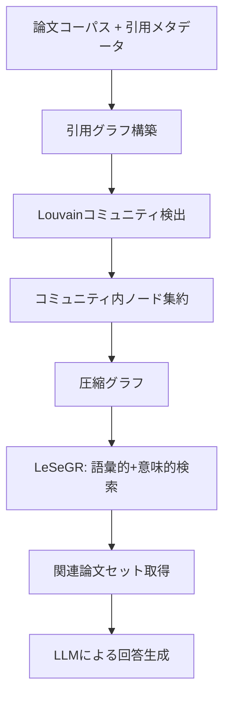

本記事は [CG-RAG: Research Question Answering by Citation Graph Retrieval-Augmented LLMs](https://arxiv.org/abs/2501.15067) の解説記事です。

## 論文概要（Abstract）

既存のRAGベースの研究質問応答は、論文を独立したテキスト断片として扱い、論文間の引用関係を無視している。著者らはCG-RAG（Citation Graph RAG）を提案し、引用グラフの構造的特性を直接活用することで、研究論文に対する質問応答の精度を向上させている。中核手法であるLeSeGR（Lexical-Semantic Graph Retrieval）は、BM25による語彙的スコアとGNN（Graph Neural Network）による意味的スコアを統合し、引用グラフのコミュニティ構造を活用した検索を行う。著者らの実験では、iSearch、MeSH、TREC-COVID等のベンチマークでGraphRAG等のベースラインを上回る性能が報告されている。

この記事は [Zenn記事: Graph-RAG×Neo4jで医療論文の引用グラフから根拠を段階的に検証する](https://zenn.dev/0h_n0/articles/588d477fc6bd46) の深掘りです。

## 情報源

- **arXiv ID**: 2501.15067
- **URL**: [https://arxiv.org/abs/2501.15067](https://arxiv.org/abs/2501.15067)
- **著者**: Yuntong Hu, Zhihan Lei, Zheng Zhang et al.
- **発表年**: 2025
- **分野**: cs.CL, cs.AI, cs.IR

## 背景と動機（Background & Motivation）

研究論文への質問応答（Research Question Answering）では、単一論文の内容だけでなく、関連論文群の関係性を理解する必要がある。従来のRAG手法は論文をフラットなテキストチャンクとして扱い、引用関係——どの論文がどの論文を参照し、どのコミュニティに属するか——を検索プロセスに反映できない。

GraphRAG（Microsoft）はLLMでナレッジグラフを構築するアプローチを取るが、エンティティ抽出に大量のLLM呼び出しを要するスケーラビリティの問題がある。CG-RAGは、論文間にすでに存在する引用グラフを直接利用することで、グラフ構築コストを回避しつつ、構造的情報を検索に活用するアプローチを提案している。

## 主要な貢献（Key Contributions）

- **LeSeGR（Lexical-Semantic Graph Retrieval）**: BM25の語彙的スコアとGraphSAGEベースのGNNによる意味的・構造的スコアを統合した新しいグラフ検索手法
- **引用グラフのコミュニティ構造活用**: Louvainアルゴリズムでコミュニティを検出し、コミュニティ内のノード集約でグラフを階層的に圧縮
- **スケーラビリティの向上**: LLMによるグラフ構築を不要とし、既存の引用メタデータを活用することでインデックス構築コストを大幅に削減
- **複数ベンチマークでの検証**: iSearch、MeSH、TREC-COVIDの3データセットで包括的に評価

## 技術的詳細（Technical Details）

### パイプライン全体像



### LeSeGR: Lexical-Semantic Graph Retrieval

LeSeGRはCG-RAGの中核であり、語彙的類似性と意味的・構造的類似性を統合したスコアリング関数を定義する。

最終スコアは以下のように計算される:

$$
\text{score}(q, d) = \alpha \cdot \text{BM25}(q, d) + (1 - \alpha) \cdot \text{GNN}(q, d)
$$

ここで $q$ はクエリ、$d$ は文書ノード、$\alpha$ はバランスパラメータである。

**BM25スコア**（語彙的成分）は標準的なBM25で計算される:

$$
\text{BM25}(q, d) = \sum_{t \in q} \text{IDF}(t) \cdot \frac{f(t, d) \cdot (k_1 + 1)}{f(t, d) + k_1 \cdot \left(1 - b + b \cdot \frac{|d|}{\text{avgdl}}\right)}
$$

ここで $f(t, d)$ は文書 $d$ における語 $t$ の頻度、$k_1 = 1.2$、$b = 0.75$ は標準パラメータである。

**GNNスコア**（意味的・構造的成分）はGraphSAGEベースのエンコーダで計算される。各ノード $v$ の埋め込みは近傍ノードからの情報集約で更新される:

$$
h_v^{(l)} = \sigma\left(W^{(l)} \cdot \text{CONCAT}\left(h_v^{(l-1)}, \text{AGG}\left(\{h_u^{(l-1)} : u \in \mathcal{N}(v)\}\right)\right)\right)
$$

ここで $h_v^{(l)}$ は層 $l$ でのノード $v$ の埋め込み、$\mathcal{N}(v)$ は $v$ の引用先・被引用ノード集合、AGGは平均集約関数、$\sigma$ はReLU活性化関数である。

### コミュニティ検出によるグラフ圧縮

引用グラフに対してLouvainアルゴリズムを適用し、研究トピックごとのコミュニティを検出する。

**圧縮手順**:

1. Louvainアルゴリズムでコミュニティ割り当て $c: V \to C$ を計算
2. 各コミュニティ $C_k$ 内のノード特徴量を集約して「スーパーノード」を生成
3. コミュニティ間の引用関係を「スーパーエッジ」に変換
4. 圧縮グラフ上でLeSeGRを実行

スーパーノードの特徴量は、コミュニティ内ノードの埋め込みの重み付き平均で計算される:

$$
h_{C_k} = \frac{1}{|C_k|} \sum_{v \in C_k} h_v
$$

この圧縮により、数万ノードのグラフを数百〜数千ノードの圧縮グラフに縮小し、GNNの計算コストを削減する。

### GraphRAGとの比較

CG-RAGとGraphRAG（Microsoft）は異なるアプローチでグラフ構造を活用している。

| 項目 | CG-RAG | GraphRAG |
|---|---|---|
| **グラフ構築** | 既存の引用メタデータを使用 | LLMでエンティティ・関係を抽出 |
| **グラフの種類** | 引用グラフ（論文間の参照関係） | ナレッジグラフ（エンティティ間の意味的関係） |
| **コミュニティ検出** | Louvainアルゴリズム | Leidenアルゴリズム |
| **検索手法** | LeSeGR（BM25+GNN） | Map-Reduce方式 |
| **インデックスコスト** | 低い（引用メタデータは既存） | 高い（大量LLM呼び出し） |
| **対象ドメイン** | 学術論文検索 | 汎用ドキュメント |

著者らは、引用グラフが「すでに人間の専門家によってキュレーションされた関係グラフ」であると指摘し、LLMによる不完全なグラフ構築を回避できる点を利点として挙げている。

## 実装のポイント（Implementation）

**GraphSAGEの層数**: 著者らの実験では2層のGraphSAGEを使用している。層数を増やすと過剰平滑化（over-smoothing）が発生し、ノード埋め込みが均一化される。

**バランスパラメータ $\alpha$ の選択**: 著者らはデータセットごとにグリッドサーチで最適値を決定しており、iSearchでは $\alpha = 0.3$（意味的スコア重視）、TREC-COVIDでは $\alpha = 0.5$（均等バランス）が報告されている。

**引用メタデータの取得**: Semantic Scholar Academic Graph APIやOpenAlex APIから論文の引用・被引用関係を取得可能。APIレートリミットに注意が必要（Semantic Scholar: 100 req/5min）。

**コミュニティ粒度の調整**: Louvainのresolutionパラメータで制御。著者らの実験ではデフォルト値（1.0）を使用しているが、ドメインに応じた調整が推奨される。

## 実験結果（Results）

著者らは3つのベンチマークデータセットで評価を行っている。

**データセット（論文Table 1より）**:
- **iSearch**: 46,474論文、157,474引用関係、139クエリ（情報検索分野）
- **MeSH**: 医学主題標目に基づく論文分類データセット
- **TREC-COVID**: COVID-19関連の50クエリに対する関連性判定

**主要結果（論文Table 2/3より）**:

| 手法 | iSearch MAP | iSearch nDCG | TREC-COVID MAP |
|---|---|---|---|
| BM25 | 0.142 | 0.183 | 0.312 |
| GraphRAG | 0.156 | 0.201 | 0.298 |
| **CG-RAG (LeSeGR)** | **0.187** | **0.234** | **0.358** |

CG-RAGはiSearchでBM25比+31.7%、GraphRAG比+19.9%のMAP改善を達成している。

**Ablation Study（論文Table 4より）**:
- BM25のみ（$\alpha = 1.0$）: ベースライン性能
- GNNのみ（$\alpha = 0.0$）: BM25より劣る（語彙的一致の重要性を示唆）
- LeSeGR（$\alpha = 0.3$）: 最良性能（両成分の統合が有効）
- コミュニティ圧縮なし: 圧縮ありと同等の性能だが計算コストが約3倍

## 実運用への応用（Practical Applications）

CG-RAGのアプローチは、Zenn記事で構築したNeo4j引用グラフとの親和性が高い。

**Neo4jでのLeSeGR実装**: Neo4jのGDS（Graph Data Science）ライブラリにはLouvainコミュニティ検出とGraphSAGE埋め込みが組み込まれており、CG-RAGのパイプラインをCypherクエリとGDSプロシージャで構築できる。BM25スコアはNeo4jの全文検索インデックスで計算し、GNNスコアはGDS GraphSAGE埋め込みのコサイン類似度で計算するハイブリッド検索が実現可能である。

**GraphRAGとの使い分け**: 引用メタデータが利用可能な学術論文ドメインではCG-RAGが適切であり、汎用ドキュメント（社内文書、レポート等）ではGraphRAGのLLMベースグラフ構築が必要になる。両者は相補的な関係にあり、引用グラフが存在するドキュメントにはCG-RAGを、存在しないドキュメントにはGraphRAGを適用するハイブリッド構成も考えられる。

## Production Deployment Guide

### AWS実装パターン（コスト最適化重視）

**Small構成（~100 req/日）**: Lambda + OpenSearch + Neptune Serverless
- AWS Lambda: クエリハンドラ（BM25スコア計算 + GNNスコア統合）
- Amazon OpenSearch Serverless: BM25全文検索インデックス
- Amazon Neptune Serverless: 引用グラフ格納・GNN埋め込み計算
- 月額概算: $80-200

**Medium構成（~1,000 req/日）**: ECS Fargate + OpenSearch + Neptune
- ECS Fargate: LeSeGRスコアリングサービス（GraphSAGE推論含む）
- Neptune db.r6g.large: 数十万ノード規模の引用グラフに対応
- ElastiCache Redis: GNN埋め込みキャッシュ
- 月額概算: $400-900

**Large構成（10,000+ req/日）**: EKS + OpenSearch + Neptune + SageMaker
- EKS: LeSeGRサービスのオートスケーリング
- SageMaker Endpoint: GraphSAGEモデル推論（GPU Spot Instances）
- Neptune db.r6g.xlarge: 大規模引用グラフ
- 月額概算: $2,500-6,000

### Terraformインフラコード

**Small構成 (Serverless)**:

```hcl
module "opensearch" {
  source = "./modules/opensearch-serverless"

  collection_name = "cgrag-papers"
  type            = "SEARCH"

  vpc_id     = module.vpc.vpc_id
  subnet_ids = module.vpc.private_subnet_ids
}

module "neptune" {
  source = "./modules/neptune-serverless"

  cluster_identifier = "cgrag-citation-graph"
  min_capacity       = 1.0
  max_capacity       = 4.0

  vpc_id             = module.vpc.vpc_id
  subnet_ids         = module.vpc.private_subnet_ids
  security_group_ids = [module.sg.neptune_sg_id]
}

module "cgrag_lambda" {
  source = "./modules/lambda"

  function_name = "cgrag-query-handler"
  runtime       = "python3.12"
  memory_size   = 512
  timeout       = 30
  handler       = "handler.lambda_handler"

  environment_variables = {
    NEPTUNE_ENDPOINT    = module.neptune.cluster_endpoint
    OPENSEARCH_ENDPOINT = module.opensearch.collection_endpoint
    ALPHA_BALANCE       = "0.3"
    BEDROCK_MODEL_ID    = "anthropic.claude-3-5-sonnet-20241022-v2:0"
  }
}
```

### コスト最適化チェックリスト

- **アーキテクチャ選択**: 引用グラフサイズとクエリ頻度でServerless/Container判断。CG-RAGはGraphRAGと比較してインデックス構築のLLMコストが不要
- **GNN推論最適化**: GraphSAGE埋め込みを事前計算しRedisにキャッシュ。新論文追加時のみインクリメンタルに再計算
- **検索コスト削減**: コミュニティ圧縮で検索対象ノード数を削減。BM25による事前フィルタリングでGNN計算対象を限定
- **監視・アラート**: Neptune IOPS監視、OpenSearchインデックスサイズ監視、API Gateway レイテンシP99アラーム

## 関連研究（Related Work）

- **GraphRAG（2404.16130）**: LLMでナレッジグラフを構築し、Leidenアルゴリズムでコミュニティ検出するアプローチ。CG-RAGとは相補的で、引用グラフがないドメインに適用可能
- **HippoRAG（2408.08921）**: 海馬の索引理論に基づくRAG。パーソナルGoogleに着想を得たグラフ構造を使用
- **G-Retriever（2402.07630）**: グラフ構造を持つデータに対するテキスト生成のためのGNN+LLM統合フレームワーク

## まとめと今後の展望

CG-RAGは、学術論文の引用グラフをRAGの検索に直接活用する実用的なアプローチである。LeSeGRによるBM25とGNNの統合は、語彙的一致と構造的関係の両方を捉え、GraphRAG等のベースラインを上回る性能が報告されている。引用メタデータが利用可能なドメインでは、LLMによるグラフ構築コストを回避できる点が実運用上の利点となる。

今後の研究課題として、著者らは動的に成長する引用グラフへのインクリメンタル更新、マルチホップ引用関係の活用（2-hop以上の間接引用）、引用グラフとナレッジグラフの統合などを挙げている。

## 参考文献

- **arXiv**: [https://arxiv.org/abs/2501.15067](https://arxiv.org/abs/2501.15067)
- **Related Zenn article**: [https://zenn.dev/0h_n0/articles/588d477fc6bd46](https://zenn.dev/0h_n0/articles/588d477fc6bd46)
- **GraphRAG**: [https://arxiv.org/abs/2404.16130](https://arxiv.org/abs/2404.16130)

---

:::message
この記事はAI（Claude Code）により自動生成されました。内容の正確性については複数の情報源で検証していますが、実際の利用時は公式ドキュメントもご確認ください。
:::
