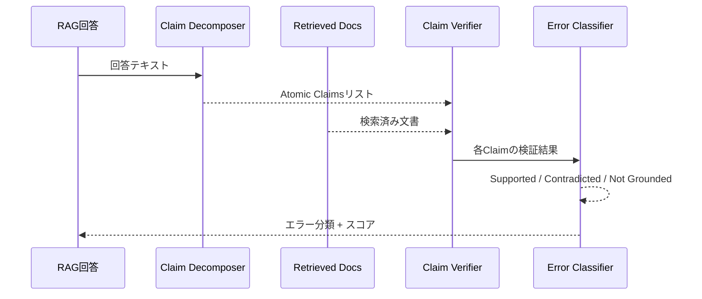

本記事は [MedRAGChecker: Evaluating and Improving Retrieval-Augmented Generation Systems for Medical Question Answering](https://arxiv.org/abs/2601.06519) の解説記事です。

## 論文概要（Abstract）

医療QAにおけるRAGシステムは回答の一部に根拠不足な主張を含むことがあるが、従来の評価手法は回答全体の正誤判定にとどまり、誤りの原因を特定できなかった。著者らはMedRAGCheckerを提案し、RAG回答を「atomic claim（原子的主張）」に分解して個別に検証するパイプラインにより、誤りの根本原因が検索失敗なのか生成失敗なのかを精密に診断可能にしている。MedQA・PubMedQA・MedMCQA・BioASQの4ベンチマークで複数のRAGシステムを評価し、検索品質が主要なボトルネックであることを示している。

この記事は [Zenn記事: Graph-RAG×Neo4jで医療論文の引用グラフから根拠を段階的に検証する](https://zenn.dev/0h_n0/articles/588d477fc6bd46) の深掘りです。

## 情報源

- **arXiv ID**: 2601.06519
- **URL**: [https://arxiv.org/abs/2601.06519](https://arxiv.org/abs/2601.06519)
- **発表年**: 2026年1月
- **分野**: cs.CL, cs.AI

## 背景と動機（Background & Motivation）

GPT-4やMed-PaLM 2のような高性能LLMであっても、医療質問応答においてエビデンスに裏付けられない助言を生成するリスクがある。RAGは外部知識ベースからの検索によりこのリスクを軽減するが、RAG自体の出力品質を系統的に評価するフレームワークは不足していた。

従来のRAG評価はExact MatchやF1といった粗粒度の指標に依存しており、「なぜ回答が間違ったのか」を診断できなかった。検索コンポーネントが適切な文書を取得できなかったのか（Retrieval Error）、取得した文書を正しく参照しなかったのか（Grounding Error）、それとも根拠なく情報を生成したのか（Hallucination）、これらを区別することが改善の第一歩となる。

MedRAGCheckerはこの診断ギャップを埋めるために設計された。回答をatomic claim単位に分解し、各claimを独立に検証することで、エラーの種類と原因を特定する。

## 主要な貢献（Key Contributions）

- **Atomic Claim分解パイプライン**: LLMを用いて医療回答を分割不可能な単位の主張に分解し、各claimを独立に検証する体系的手法
- **3分類エラータクソノミー**: Retrieval Error（検索エラー）/ Grounding Error（根拠付けエラー）/ Hallucination（幻覚）の3カテゴリへの分類
- **Claim-Levelスコアリング**: Precision（生成claimのうち支持されたものの割合）、Recall（参照回答claimのカバー率）、F1スコアによる総合評価
- **診断的フィードバックループ**: どのclaimが失敗したかを特定し、ターゲットを絞った改善サイクルを実現

## 技術的詳細（Technical Details）

### Atomic Claim分解の手順

MedRAGCheckerのパイプラインは4段階で構成される。

**Step 1 — 回答の分解（Decomposition）**

LLMに対して医療回答を原子的主張に分解するよう指示する。各claimは一つの医学的事実・主張のみを含む必要がある。

分解の具体例:
- 入力: 「メトホルミンは2型糖尿病の第一選択薬であり、体重増加を引き起こさない」
- 分解結果:
  - Claim 1: 「メトホルミンは2型糖尿病の治療薬である」
  - Claim 2: 「メトホルミンは第一選択薬である」
  - Claim 3: 「メトホルミンは体重増加を引き起こさない」

**Step 2 — Claimの検証（Verification）**

各atomic claimを検索済み文書と照合し、3カテゴリに分類する。

- **Supported（支持）**: 検索文書にclaimを裏付けるエビデンスが存在する
- **Contradicted（矛盾）**: 検索文書の内容がclaimと矛盾する
- **Not Grounded（根拠なし）**: 検索文書にclaimに関連する情報が見つからない

**Step 3 — エラー帰属（Error Attribution）**

Not Groundedと判定されたclaimについて、原因を切り分ける。

- 検索コーパスにclaimを支持する文書が存在するのに取得できなかった → **Retrieval Error**
- 検索コーパスにclaim関連の文書が存在しない → 判定保留
- claimが事実として誤っている → **Hallucination**

**Step 4 — スコアリング**

$$
\text{Claim Precision} = \frac{|\text{Supported Claims}|}{|\text{Total Generated Claims}|}
$$

$$
\text{Claim Recall} = \frac{|\text{Covered Reference Claims}|}{|\text{Total Reference Claims}|}
$$

$$
\text{Claim F1} = \frac{2 \times \text{Precision} \times \text{Recall}}{\text{Precision} + \text{Recall}}
$$

### エラータイプの分布

著者らの分析によれば、エラータイプの平均的な分布は以下のようになっている。

| エラータイプ | 平均割合 | 説明 |
|---|---|---|
| Retrieval Error | ~40% | 関連文書を取得できない |
| Hallucination | ~35% | 証拠なしに事実を生成 |
| Grounding Error | ~25% | 取得文書を適切に参照しない |

この結果は、医療RAGシステムの改善において**検索品質の向上が最優先課題**であることを示唆している。

### 検索品質改善後のパラドックス

著者らは興味深い現象を報告している。Advanced RAG（再ランキング・ハイブリッド検索等）を適用して検索品質を改善すると、Retrieval Errorは31%に低下するが、Grounding Errorの比率が47%に増加する。検索で正しい文書を取得できても、生成モデルがその文書を適切に参照しないケースが顕在化するためである。

このパラドックスは、検索と生成の両方を同時に改善する必要があることを示している。

## 実装のポイント（Implementation）

**Claim分解の品質依存性**: atomic claim分解自体にLLMを使用するため、分解品質がLLMの能力に依存する。医療用語の理解が不十分なモデルでは、専門的な主張を適切に分解できないリスクがある。few-shot examplesで医療ドメインに適応させることが推奨される。

**計算コストの増加**: claimごとに検証ステップを実行するため、エンドツーエンドの評価コストが高い。1クエリあたりの検証回数は1 + N回（Nはclaim数）になり、回答が長くなるほどコストが増加する。

**検索コーパスの鮮度管理**: 医学知識は継続的に更新されるため、検索コーパスが古いとSupported/Contradictedの判定自体が誤る。特に診療ガイドラインの改訂に追従する仕組みが実運用では不可欠となる。

**モデル別の幻覚率**: 著者らの報告によれば、GPT-4は約15%の幻覚率に対し、Llama2-7Bは約45%、Mistral-7Bは約30%である。小規模モデルほど医療ドメインでの幻覚が深刻であることが示されている。

## Production Deployment Guide

### AWS実装パターン（コスト最適化重視）

MedRAGCheckerの検証パイプラインをAWSで運用する場合のアーキテクチャ構成を示す。

**トラフィック量別の推奨構成**:

| 規模 | 月間リクエスト | 推奨構成 | 月額コスト | 主要サービス |
|------|--------------|---------|-----------|------------|
| **Small** | ~3,000 (100/日) | Serverless | $80-200 | Lambda + Bedrock + OpenSearch Serverless |
| **Medium** | ~30,000 (1,000/日) | Hybrid | $400-1,000 | ECS Fargate + Bedrock + OpenSearch |
| **Large** | 300,000+ (10,000/日) | Container | $2,500-6,000 | EKS + Karpenter + OpenSearch |

**Small構成の詳細** (月額$80-200):
- **Lambda**: claim分解・検証の各ステップを個別関数化（1GB RAM, 120秒タイムアウト）
- **Bedrock**: Claude 3.5 Haiku（claim分解）+ Claude 3.5 Sonnet（検証判定）
- **OpenSearch Serverless**: 医療文献検索用（BM25 + kNN検索対応）
- **Step Functions**: 分解→検索→検証→スコアリングのワークフロー管理

**コスト削減テクニック**:
- Claim分解にはHaikuモデル（$0.25/MTok）を使用し、最終検証のみSonnetを使用
- OpenSearch Serverlessで低トラフィック時のコストを最小化
- Step Functionsの並列状態で複数claimを同時検証しレイテンシ削減

**コスト試算の注意事項**:
上記は2026年5月時点のAWS ap-northeast-1（東京）リージョン料金に基づく概算値です。Claim数に応じてBedrock呼び出し回数が線形増加するため、回答あたりのclaim数（平均10-15）がコストの主要因となります。

### セキュリティベストプラクティス

1. **医療データ保護**: OpenSearchに格納する医療文献のPHIマスキングを事前処理で実施
2. **IAM最小権限**: Lambda関数ごとにBedrock invokeとOpenSearch readのみを許可
3. **監査**: CloudTrailで全Bedrock API呼び出しを記録し、入出力ログのKMS暗号化を有効化
4. **ネットワーク**: VPCエンドポイント経由アクセス、パブリックサブネット不使用

### コスト最適化チェックリスト

- [ ] Claim分解にHaikuモデルを使用（Sonnet比で約10分の1のコスト）
- [ ] バッチ検証でBedrock Batch APIを活用（50%割引）
- [ ] OpenSearch Serverlessでアイドル時コストを最小化
- [ ] Step Functions Express Workflowで短時間ワークフローのコスト削減
- [ ] CloudWatch Budgetsで月額上限監視

## 実験結果（Results）

著者らは4つの医療QAベンチマーク（MedQA, MedMCQA, PubMedQA, BioASQ）で複数のRAGシステムを評価している。

**Table 1: RAGシステムの総合評価（論文より）**

| System | Retrieval Recall@10 | Claim Precision | Claim Recall | Claim F1 |
|---|---|---|---|---|
| Naive RAG + GPT-4 | 0.68 | 0.72 | 0.61 | 0.66 |
| HyDE RAG + GPT-4 | 0.74 | 0.75 | 0.65 | 0.70 |
| Advanced RAG + GPT-4 | 0.79 | 0.78 | 0.69 | 0.73 |
| Naive RAG + Llama2 | 0.68 | 0.51 | 0.43 | 0.47 |

Advanced RAG + GPT-4がClaim F1で0.73と最高値を示すが、それでも27%のclaimが不十分なエビデンスで生成されている。

**改善効果**: Claimレベルフィードバックを用いた再生成でClaim F1が平均+8〜12pt向上、検索クエリ拡張でRetrieval Recall@10が+15〜20pt向上している。

**Exact Match vs. Claim F1の乖離**: 従来のExact Match評価とClaim F1の相関係数は約0.45（低〜中程度）であり、従来指標では見えなかった部分的正解を定量化できることが示されている。

## 実運用への応用（Practical Applications）

MedRAGCheckerのatomic claim分解アプローチは、Zenn記事で実装した引用グラフベースのEvidence Scorerと直接的に相補関係にある。

Zenn記事の`EvidenceScorer`クラスは、各claimに対して引用グラフ上の1ホップ/2ホップ/3ホップでの根拠パスの存在を確認するが、MedRAGCheckerの3分類タクソノミーを組み合わせることで、以下の拡張が考えられる。

1. **Supportedだがhop距離が遠い**: 間接的な根拠のみ存在。追加の直接エビデンスが必要
2. **Not Groundedかつ引用グラフに候補がない**: Retrieval Errorの可能性。検索クエリの拡張を試行
3. **Contradicted**: 引用グラフ上の反証パスをユーザーに明示し、主張の修正を促す

ただし、計算コストの増加は実運用上の制約となる。Zenn記事のパイプラインにMedRAGCheckerを組み込む場合、非同期検証（回答を先に返してからバックグラウンドで検証）が現実的な設計パターンとなる。

## 関連研究（Related Work）

- **FActScore（EMNLP 2023, 2307.13528）**: LLM出力をatomic factに分解してWikipediaで検証する汎用フレームワーク。MedRAGCheckerはこれを医療RAGの診断に特化・拡張し、エラー3分類タクソノミーを追加
- **RAGAS（2310.01558）**: RAG評価の標準フレームワーク。faithfulness・relevance・context precisionを自動スコアリングするが、医療ドメイン特化のエラー分類は提供しない
- **MedGraphRAG（2408.04187）**: 医療特化グラフRAGシステム。MedRAGCheckerはそのような医療RAGシステムの出力品質を評価するツールとして位置づけられる

## まとめと今後の展望

MedRAGCheckerは、医療RAGの出力を原子的主張単位で検証する初の体系的フレームワークとして、検索エラーが主要ボトルネック（約40%）であることを定量的に示した。Grounding Error（約25%）の存在は、検索改善だけでは不十分であることも同時に示唆しており、検索と生成の両面での最適化が不可欠である。

著者らは今後の課題として、多言語医療テキストへの展開、専門家レベルの検証が必要な主張の扱い、医学知識の更新への追従を挙げている。

## 参考文献

- **arXiv**: [https://arxiv.org/abs/2601.06519](https://arxiv.org/abs/2601.06519)
- **FActScore**: [https://arxiv.org/abs/2307.13528](https://arxiv.org/abs/2307.13528)
- **RAGAS**: [https://arxiv.org/abs/2310.01558](https://arxiv.org/abs/2310.01558)
- **Related Zenn article**: [https://zenn.dev/0h_n0/articles/588d477fc6bd46](https://zenn.dev/0h_n0/articles/588d477fc6bd46)

---

:::message
この記事はAI（Claude Code）により自動生成されました。内容の正確性については複数の情報源で検証していますが、実際の利用時は公式ドキュメントもご確認ください。
:::
