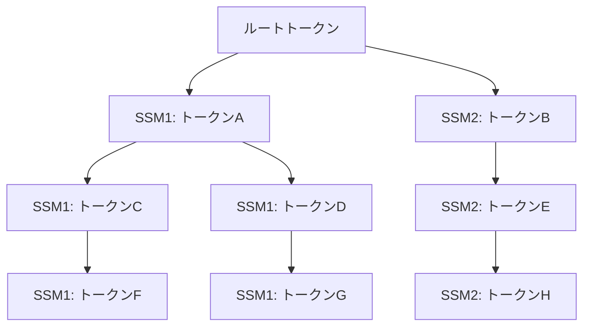

# 論文解説: SpecInfer - 投機的推論とトークンツリー検証によるLLMサービング高速化

## 論文概要

**SpecInfer: Accelerating Generative Large Language Model Serving with Tree-based Speculative Inference and Verification** (arXiv:2305.09781, ASPLOS 2024) は、LLMサービングにおける推論レイテンシを大幅に削減するシステムを提案した論文である。著者らは、複数の小型投機モデル（SSM: Small Speculative Model）が生成したトークン候補を **トークンツリー** として構造化し、LLMが1回のフォワードパスで木構造全体を並列検証する手法を提案している。分散推論で1.5-2.8倍、オフローディングベース推論で2.6-3.5倍の高速化を、出力品質を保ったまま達成したと報告されている。

本記事は [arXiv:2305.09781](https://arxiv.org/abs/2305.09781) の解説記事です。

この記事は [Zenn記事: vLLM投機的デコーディング×PagedAttentionでLLM推論レイテンシを削減する](https://zenn.dev/0h_n0/articles/17b7c9dee74e06) の深掘りです。

---

## 情報源

| 項目 | 内容 |
|------|------|
| arXiv ID | [2305.09781](https://arxiv.org/abs/2305.09781) |
| タイトル | SpecInfer: Accelerating Generative Large Language Model Serving with Tree-based Speculative Inference and Verification |
| 著者 | Xupeng Miao, Gabriele Oliaro, Zhihao Zhang, Xinhao Cheng, Zeyu Wang, Zhengxin Zhang, Rae Ying Yee Wong, Alan Zhu, Lijie Yang, Xiaoxiang Shi, Chunan Shi, Zhuoming Chen, Daiyaan Arfeen, Reyna Abhyankar, Zhihao Jia |
| 発表年 | 2023年（初版）、ASPLOS 2024 採録 |
| 分野 | cs.CL, cs.DC, cs.LG |
| GitHub | [FlexFlow/FlexFlow](https://github.com/flexflow/FlexFlow/) |

---

## 背景と動機

### LLM推論のボトルネック

大規模言語モデル（LLM）の推論は、自己回帰的にトークンを1つずつ生成するため、本質的に逐次的な処理となる。各ステップでモデル全体のフォワードパスが必要であり、モデルサイズが数十〜数百億パラメータに達する現在、推論レイテンシはサービング品質の主要なボトルネックとなっている。

### 従来の投機的デコーディングの限界

投機的デコーディング（Speculative Decoding）は、小型のドラフトモデルで複数トークンを事前に予測し、大型モデルで一括検証することでレイテンシを削減する手法である。しかし、従来手法には以下の制約があると論文では指摘されている:

1. **単一シーケンス予測**: ドラフトモデルが1本のシーケンスのみ生成するため、予測が外れるとすべてのトークンが無駄になる
2. **指数的な受理率低下**: シーケンスが長くなるほど、全トークンが正しい確率が指数的に低下する
3. **単一ドラフトモデル**: 1つのドラフトモデルの能力に依存し、多様な予測パターンをカバーできない

これらの制約を解決するため、SpecInferはトークンツリーによる多分岐予測と複数ドラフトモデルの統合を提案している。

---

## 主要な貢献

論文の主要な貢献は以下の4点である:

1. **トークンツリーベースの投機的推論**: 投機的に生成するトークン候補を木構造として組織化し、1回のLLMフォワードパスで複数候補パスを並列に検証する手法を提案
2. **複数ドラフトモデルの統合**: 複数の小型SSMをブースティングベースで適応的にファインチューニングし、その出力をマージしたトークンツリーを構築する仕組みを設計
3. **トポロジー対応因果マスクによるTree Attention**: 木構造のトポロジーに基づく因果マスクを導入し、従来のKVキャッシュ再利用と整合する効率的なアテンション計算を実現
4. **検証率の大幅改善**: Top-5候補のトークンツリーによって検証成功率を52-57%から96-97%へ改善（論文Table 1より）

---

## 技術的詳細

### トークンツリー構造の仕組み

SpecInferにおけるトークンツリーは、各ノードが1つのトークンに対応し、ルートから各ノードへのパスが1つの候補シーケンスを表す木構造である。

ツリーの各ノード $u$ に対して、ルートから $u$ までのパス上の全トークンを連結したシーケンスを $S_u$ と定義する。ノード $u$ のアテンション計算は以下の通りである:

$$
\text{Attention}(Q_u, K_{S_u}, V_{S_u}) = \text{softmax}\left(\frac{Q_u \cdot K_{S_u}^T}{\sqrt{d_k}}\right) V_{S_u}
$$

ここで:
- $Q_u$: ノード $u$ のクエリベクトル
- $K_{S_u}, V_{S_u}$: シーケンス $S_u$ 上の全トークンのキー・バリューベクトル
- $d_k$: キーの次元数

従来のシーケンスベースの投機的デコーディングでは1本のパスのみ検証するが、SpecInferではトークンツリー全体を **トポロジー対応因果マスク** を用いて1回のフォワードパスで処理する。このマスクは、各ノード $u$ がその祖先ノードのみにアテンションを向けるよう制約し、木構造の因果性を保証する。

### マルチドラフトモデルアプローチ

SpecInferは、LLMの100-1000分の1程度の小型モデル（SSM）を複数用いる。ツリー構築には2つの戦略がある:

1. **展開ベース（Expansion）**: 1つのSSMが各ステップでTop-k個のトークンを生成し、木の深さ方向に展開する。展開構成は $\langle k_1, k_2, \ldots, k_n \rangle$ で指定される（例: $\langle 1,1,3,1,1,1,1,1 \rangle$）
2. **マージベース（Merge）**: 複数のSSMをブースティングで適応的にファインチューニングし、各SSMの出力を1つのトークンツリーにマージする



### ツリー検証アルゴリズム

SpecInferでは、**貪欲検証（Greedy Verification）** と **確率的検証（Stochastic Verification）** の2種類のアルゴリズムが提案されている。

確率的検証では、Multi-Step Speculative Sampling（MSS）を用いて、LLMの出力分布を厳密に再現する。子ノード $x$ の受理確率は以下で決定される:

$$
P_{\text{accept}}(x) = \min\left(1, \frac{P(x \mid \text{context}, \Theta_{\text{LLM}})}{P(x \mid \text{context}, \Theta_{\text{SSM}})}\right)
$$

ここで:
- $P(x \mid \text{context}, \Theta_{\text{LLM}})$: LLMによるトークン $x$ の生成確率
- $P(x \mid \text{context}, \Theta_{\text{SSM}})$: SSMによるトークン $x$ の生成確率

棄却された場合、残差分布から再サンプリングを行う:

$$
P_{\text{residual}}(x) = \text{norm}\left(\max\left(0, P(x \mid \Theta_{\text{LLM}}) - P(x \mid \Theta_{\text{SSM}})\right)\right)
$$

この手法により、LLMの出力分布と完全に同一の分布からのサンプリングが保証される。

以下に検証アルゴリズムの簡略化した実装を示す:

```python
from dataclasses import dataclass, field
import numpy as np


@dataclass
class TreeNode:
    """トークンツリーのノードを表現するデータクラス。

    Attributes:
        token_id: トークンのID
        ssm_prob: SSMによる生成確率
        children: 子ノードのリスト
    """

    token_id: int
    ssm_prob: float
    children: list["TreeNode"] = field(default_factory=list)


def verify_stochastic(
    node: TreeNode,
    llm_probs: dict[int, float],
    context: list[int],
) -> list[int]:
    """確率的検証によりトークンツリーを検証し、受理されたトークン列を返す。

    Multi-Step Speculative Sampling (MSS) に基づき、
    LLMの出力分布を厳密に再現しながらツリーを走査する。

    Args:
        node: 検証対象のツリーノード
        llm_probs: LLMによる各トークンの生成確率（トークンID -> 確率）
        context: 現在までの確定トークン列

    Returns:
        受理されたトークンIDのリスト
    """
    accepted_tokens: list[int] = []

    for child in node.children:
        token_id = child.token_id
        p_llm = llm_probs.get(token_id, 0.0)
        p_ssm = child.ssm_prob

        # 受理確率の計算: min(1, p_llm / p_ssm)
        if p_ssm > 0:
            acceptance_ratio = min(1.0, p_llm / p_ssm)
        else:
            acceptance_ratio = 1.0 if p_llm > 0 else 0.0

        r = np.random.uniform(0, 1)
        if r <= acceptance_ratio:
            # トークンを受理し、子ノードの検証に再帰的に進む
            accepted_tokens.append(token_id)
            child_accepted = verify_stochastic(
                child,
                llm_probs,  # 次ステップのLLM確率（実際は再計算が必要）
                context + [token_id],
            )
            accepted_tokens.extend(child_accepted)
            return accepted_tokens

    # 全子ノードが棄却された場合、残差分布からサンプリング
    residual = {
        tid: max(0.0, llm_probs.get(tid, 0.0) - node.ssm_prob)
        for tid in llm_probs
    }
    total = sum(residual.values())
    if total > 0:
        residual = {tid: p / total for tid, p in residual.items()}
        sampled = np.random.choice(
            list(residual.keys()), p=list(residual.values())
        )
        accepted_tokens.append(int(sampled))

    return accepted_tokens
```

---

## 実装のポイント

### Tree Attention のカーネル融合

SpecInferの実装上の重要なポイントは、トークンツリー全体のアテンション計算を単一のGPUカーネルで実行する点である。論文では以下の最適化が述べられている:

1. **トポロジー対応因果マスク**: 木構造の祖先関係に基づくマスク行列を事前計算し、通常の因果マスクの代わりに使用する。これにより、異なるパス上のノード間の不正なアテンションを防止する
2. **深さ優先走査によるKVキャッシュ再利用**: ツリーを深さ優先で走査することで、既存のKVキャッシュとの整合性を保ちながらキャッシュミスを最小化する
3. **半精度（FP16）演算**: 全計算をFP16で実行し、メモリ帯域とスループットを最適化する

### SSMのブースティング学習

複数のSSMをブースティング的に学習させる際、各SSMは先行するSSMが苦手とするトークン系列に重点を置いて学習される。これにより、個々のSSMの予測多様性が確保され、マージ後のトークンツリーがLLMの出力分布を広くカバーできるようになると著者らは述べている。

---

## Production Deployment Guide

### AWS実装パターン

SpecInferの本番環境デプロイに向けたAWS構成を、規模別に整理する。以下のコスト試算は **2026年5月時点のAWS料金に基づく概算** であり、リージョン・使用パターンにより変動する。

| 構成 | ユースケース | インスタンス | 月額概算 |
|------|-------------|-------------|---------|
| Small | PoC・少量推論 | g5.xlarge × 1 | $800-1,200 |
| Medium | 中規模サービス | g5.12xlarge × 1 | $4,500-6,000 |
| Large | 大規模本番 | EKS + g5.12xlarge × 4 | $18,000-25,000 |

### Small構成: SageMaker + Lambda + DynamoDB

PoC段階での最小構成。SageMaker Endpointでカスタムモデルをホストし、Lambda経由でAPI化する。

```hcl
# small_specinfer.tf - SpecInfer PoC構成

resource "aws_dynamodb_table" "inference_cache" {
  name         = "specinfer-inference-cache"
  billing_mode = "PAY_PER_REQUEST"
  hash_key     = "request_id"
  range_key    = "created_at"

  attribute {
    name = "request_id"
    type = "S"
  }
  attribute {
    name = "created_at"
    type = "S"
  }
  ttl {
    attribute_name = "ttl"
    enabled        = true
  }
}

resource "aws_sagemaker_endpoint_configuration" "specinfer" {
  name = "specinfer-endpoint-config"
  production_variants {
    variant_name           = "primary"
    model_name             = aws_sagemaker_model.specinfer.name
    initial_instance_count = 1
    instance_type          = "ml.g5.xlarge"
  }
}

resource "aws_lambda_function" "inference_handler" {
  function_name = "specinfer-inference-handler"
  runtime       = "python3.12"
  handler       = "handler.lambda_handler"
  timeout       = 120
  memory_size   = 512
  filename      = "lambda_package.zip"
  role          = var.lambda_role_arn

  environment {
    variables = {
      SAGEMAKER_ENDPOINT = aws_sagemaker_endpoint.specinfer.name
      DYNAMODB_TABLE     = aws_dynamodb_table.inference_cache.name
    }
  }
}
```

### Large構成: EKS + Karpenter + Spot

大規模本番環境ではEKSクラスタ上でSpecInferをデプロイし、Karpenterによるオートスケーリングとスポットインスタンスでコスト効率を高める。

```hcl
# large_specinfer.tf - SpecInfer 本番構成

module "eks" {
  source  = "terraform-aws-modules/eks/aws"
  version = "~> 20.0"

  cluster_name    = "specinfer-cluster"
  cluster_version = "1.30"
  vpc_id          = var.vpc_id
  subnet_ids      = var.private_subnet_ids

  eks_managed_node_groups = {
    system = {
      instance_types = ["m6i.large"]
      min_size       = 2
      max_size       = 4
      desired_size   = 2
    }
  }
}

resource "helm_release" "karpenter" {
  name       = "karpenter"
  repository = "oci://public.ecr.aws/karpenter"
  chart      = "karpenter"
  version    = "1.1.0"
  namespace  = "kube-system"

  set {
    name  = "settings.clusterName"
    value = module.eks.cluster_name
  }
}
```

Karpenter NodePool でGPUノードのSpot/On-Demand混在とオートスケーリングを構成する:

```yaml
# karpenter-nodepool.yaml
apiVersion: karpenter.sh/v1
kind: NodePool
metadata:
  name: gpu-specinfer
spec:
  template:
    spec:
      requirements:
        - key: "node.kubernetes.io/instance-type"
          operator: In
          values: ["g5.12xlarge", "g5.48xlarge"]
        - key: "karpenter.sh/capacity-type"
          operator: In
          values: ["spot", "on-demand"]
      nodeClassRef:
        group: karpenter.k8s.aws
        kind: EC2NodeClass
        name: gpu-nodes
  limits:
    nvidia.com/gpu: "16"
  disruption:
    consolidationPolicy: WhenEmptyOrUnderutilized
    consolidateAfter: 60s
```

### セキュリティベストプラクティス

1. **IAMロールの最小権限**: SageMaker/EKSワーカーノードに付与するIAMロールは、必要なS3バケット・ECRリポジトリへのアクセスのみに制限する
2. **ネットワーク分離**: 推論エンドポイントはプライベートサブネットに配置し、VPCエンドポイント経由でのみアクセス可能にする
3. **モデルアーティファクトの暗号化**: S3上のモデルファイルはAWS KMSによるSSE-KMSを適用する
4. **入力検証**: プロンプトインジェクション対策として、入力テキストの長さ制限・フィルタリングを実施する
5. **監査ログ**: CloudTrailでAPIコール、VPCフローログでネットワーク通信を記録する
6. **シークレット管理**: モデルAPIキー等はAWS Secrets Managerで管理し、環境変数への平文埋め込みを禁止する

### 運用・監視設定

| カテゴリ | 監視項目 |
|---------|---------|
| CloudWatch メトリクス | 推論レイテンシ(p50/p95/p99)、トークンスループット(tokens/sec)、ツリー検証成功率、GPUメモリ使用率 |
| CloudWatch アラーム | p99 > 5000msで通知、メモリ使用率 > 90%で通知 |
| X-Ray トレース | API Gateway→Lambda→SageMaker間のレイテンシ分解、SSM推論→LLM検証のステップ別計測 |
| Cost Explorer | Project=specinferタグでフィルタ、月額予算80%到達で通知 |

### コスト最適化チェックリスト

1. **Spotインスタンスの活用**: オンデマンド比60-70%のコスト削減
2. **Karpenterによる自動スケーリング**: アイドルリソースの最小化
3. **混合インスタンス戦略**: g5.12xlarge/g5.48xlarge混在でSpot枯渇リスク分散
4. **推論バッチング**: 複数リクエストのバッチ化でGPU利用効率向上
5. **モデル量子化**: INT8/INT4量子化で必要GPU数を削減
6. **SSMモデルの軽量化**: SSMパラメータ数の最小化でオーバーヘッド削減
7. **KVキャッシュ管理**: PagedAttention等でメモリ断片化防止
8. **Savings Plans**: ベースライン負荷分を確保（オンデマンド比30-40%削減）
9. **リージョン選定**: GPU Spot可用性の高いリージョン選択
10. **EBS最適化**: gp3ボリューム使用でio1/io2比コスト削減
11. **ログ保持期間**: CloudWatchログを30-90日に制限、長期はS3 Glacier
12. **VPCエンドポイント**: S3/ECR/SageMaker用でNAT Gateway料金削減
13. **コンテナイメージ最適化**: マルチステージビルドでサイズ削減
14. **推論結果キャッシュ**: DynamoDB/ElastiCacheで重複推論回避
15. **ツリー深さ最適化**: 受理率とSSMオーバーヘッドのトレードオフ調整
16. **オフピークスケールダウン**: 夜間・休日のノード数最小化
17. **データ転送最小化**: 同一AZ内通信優先
18. **GPU Sharing (MIG)**: 1GPUで複数SSM同時実行
19. **Cost Anomaly Detection**: 予期しないコスト増加の早期検知
20. **タグ付け徹底**: Project/Environment/Ownerタグでコスト配分可視化
21. **Graviton併用**: CPU処理にGravitonで20-30%コスト削減
22. **S3 Intelligent-Tiering**: モデルアーティファクトのアクセス頻度に応じた最適化

---

## 実験結果

### 評価環境

論文では、2台のAWS g5.12xlargeインスタンス（各4基のNVIDIA A10 24GB GPU、48 CPUコア、192GB DRAM、100Gbpsイーサネット）を使用して評価を行っている（論文Section 6より）。

### スループット・レイテンシ

著者らは以下の高速化を報告している（論文Figure 7より）:

- **分散推論**: 1.5-2.8倍のレイテンシ削減（LLaMA-7B, OPT-13B, OPT-30B, LLaMA-65Bで評価）
- **オフローディングベース推論**: 2.6-3.5倍の高速化
- **平均受理トークン数**: 1ステップあたり約4トークンを受理

### 検証成功率の改善

トークンツリーによる検証成功率の改善は論文Table 1に詳述されている:

| 検証方式 | Top-1 | Top-5 |
|---------|-------|-------|
| Greedy  | 68-70% | 84-89% |
| Stochastic | 52-57% | 96-97% |

Top-5のトークンツリーを用いた確率的検証では、96-97%の成功率を達成しており、これはシーケンスベースの手法（Top-1で52-57%）と比較して大幅な改善である。

### 既存システムとの比較

vLLM、HuggingFace TGI、FasterTransformerとの比較において、SpecInferのインクリメンタルデコーディング（投機的推論なし）の性能がこれらと同等であることを確認した上で、投機的推論による追加の高速化を実証している（論文Section 6.2より）。

---

## 実運用への応用

### vLLMとの関連

SpecInferの提案するトークンツリーベースの検証手法は、vLLMのPagedAttentionとの統合が有望な方向性である。vLLMはKVキャッシュの効率的なメモリ管理を提供し、SpecInferはトークン生成の並列化を提供するため、両者は相補的な関係にある。

実際に、vLLMプロジェクトでは投機的デコーディングのサポートが進んでおり、SpecInferのTree Attention手法がPagedAttentionのブロック単位メモリ管理と組み合わされることで、さらなるスループット向上が期待される。

### 適用場面

SpecInferが有効なユースケースとして、以下が挙げられる:

- **リアルタイムチャットボット**: レイテンシが重要な対話型アプリケーション
- **コード補完**: 予測精度の高いドメインでSSMの受理率が高くなりやすい
- **バッチ推論**: 大量の推論リクエストを処理する際のスループット向上
- **エッジ推論**: オフローディングベース推論で3.5倍の高速化が得られるため、GPUリソースが限られた環境で有効

---

## 関連研究

1. **Speculative Decoding** (Leviathan et al., 2023; Chen et al., 2023): 単一ドラフトモデルによる投機的デコーディングの原型。SpecInferはこれをトークンツリーに拡張した
2. **Medusa** (Cai et al., 2024): LLM自体に複数のデコーディングヘッドを追加し、並列トークン予測を行う手法。SSMを用いないため追加モデルが不要だが、ベースモデルの改変が必要
3. **EAGLE** (Li et al., 2024): 特徴量レベルの自己回帰で次トークンを予測する手法。SpecInferと同様にツリー構造を活用するが、ドラフトモデルの設計アプローチが異なる
4. **vLLM** (Kwon et al., 2023): PagedAttentionによる効率的なKVキャッシュ管理。SpecInferのTree AttentionとPagedAttentionの統合は自然な拡張方向である

---

## まとめと今後の展望

SpecInferは、トークンツリーベースの投機的推論と検証により、LLMサービングのレイテンシを大幅に削減する手法である。複数SSMの統合、トポロジー対応因果マスク、確率的検証アルゴリズムの3つの技術的貢献により、出力品質を保ったまま1.5-3.5倍の高速化を達成したと報告されている。

今後の展望として、以下の方向性が考えられる:

- **PagedAttentionとの統合**: vLLMのメモリ管理とSpecInferのツリー検証を組み合わせた統合フレームワーク
- **適応的ツリー構造**: リクエストの特性に応じてツリーの深さ・幅を動的に調整する手法
- **大規模バッチ処理への最適化**: 高バッチサイズ環境での性能改善（論文では高バッチサイズでの効果逓減が報告されている）

---

## 参考文献

- [arXiv:2305.09781 - SpecInfer](https://arxiv.org/abs/2305.09781)
- [FlexFlow/FlexFlow - GitHub](https://github.com/flexflow/FlexFlow/)
- [Zenn記事: vLLM投機的デコーディング×PagedAttentionでLLM推論レイテンシを削減する](https://zenn.dev/0h_n0/articles/17b7c9dee74e06)
