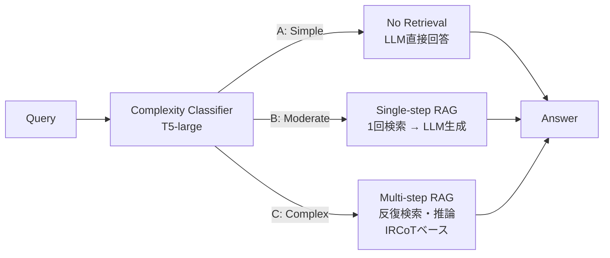

## 論文概要

本記事は、Jeongらが2023年に発表し NAACL 2024 に採択された論文 **"Adaptive-RAG: Learning to Adapt Retrieval-Augmented Large Language Models through Question Complexity"** (arXiv: 2310.11511) の解説記事です。

Retrieval-Augmented Generation (RAG) は LLM のパラメトリック知識の限界を補う手法として広く使われているが、クエリの複雑度に関わらず一律の検索戦略を適用するという問題がある。たとえば「日本の首都は？」のような単純なfactoidクエリに対してmulti-hop検索を実行するのは計算資源の浪費であり、逆に複数の推論ステップを要するクエリに対して単発検索で済ませると回答精度が低下する。Adaptive-RAGは、T5-largeベースの小型分類器でクエリの複雑度を3段階に分類し、最適な検索戦略を動的に選択するフレームワークである。著者らは、6つのQAベンチマークにおいて平均EM 41.1を達成し、既存手法を上回る精度と効率の両立を報告している。

この記事は [Zenn記事: BM25×ベクトル検索のクエリルーティング実装：動的重み調整でRAG検索精度を改善する](https://zenn.dev/0h_n0/articles/fa2dc30d90873c) の深掘りです。

## 情報源

- **arXiv ID**: 2310.11511
- **URL**: <https://arxiv.org/abs/2310.11511>
- **著者**: Soyeong Jeong, Jinheon Baek, Sukmin Cho, Sung Ju Hwang, Jong C. Park
- **発表年**: 2023年（NAACL 2024採択）
- **分野**: cs.CL, cs.AI
- **コード**: <https://github.com/starsuzi/Adaptive-RAG>

## 背景と動機

RAGは外部知識ソースからの検索結果をLLMの生成プロセスに組み込むことで、ハルシネーションの低減や最新情報への対応を可能にする。しかし、既存のRAGシステムは「すべてのクエリに同じ検索戦略を適用する」という one-size-fits-all のアプローチを取っている。

現実のクエリには多様な複雑度が存在する。

- **単純なfactoidクエリ**: 「GPT-4の開発元は？」のように、LLMのパラメトリック知識だけで正確に回答できるもの。わざわざ外部検索を実行するとレイテンシが増大し、検索ノイズにより精度が低下するリスクすらある。
- **中程度の複雑度**: 「PopQAに収録されている低頻度エンティティの正式名称は？」のように、LLMの知識では不確実だが1回の検索で回答に必要な情報が得られるもの。
- **高複雑度のmulti-hopクエリ**: 「AがBの出身地で、Bの市長はCだが、Cの所属政党は？」のように、複数のドキュメントを段階的に検索・推論する必要があるもの。

著者らは、この複雑度の違いに応じて検索戦略を動的に切り替えることで、精度と効率の両立が可能であると主張している。既存研究であるSelf-RAGやFLAREも適応的な検索を試みているが、Self-RAGはLLM自体に検索の要否を判断させるため推論コストが高く、FLAREは生成中のconfidenceに基づく後付けの検索であり事前の戦略選択とは異なる。Adaptive-RAGは、軽量な分類器で事前にクエリ複雑度を判定し、3段階の戦略から最適なものを選択する点で新規性がある。

## 主要な貢献

著者らは以下の3つの貢献を報告している。

1. **クエリ複雑度に基づく適応的検索フレームワークの提案**: No Retrieval / Single-step RAG / Multi-step RAG の3戦略を動的に選択するAdaptive-RAGを提案。クエリ複雑度を事前に判定することで、不要な検索を回避しつつ複雑なクエリには十分な検索・推論を実行する。

2. **自動ラベル生成によるclassifier訓練**: 各戦略の正解・不正解パターンからクエリ複雑度ラベルを自動生成し、人手アノテーション不要でT5-large分類器を訓練する手法を提案。

3. **6つのQAベンチマークでの包括的評価**: 単純クエリ（NQ, TriviaQA, PopQA）と複雑クエリ（MuSiQue, HotpotQA, 2WikiMultiHopQA）の両方で既存手法を上回る精度を達成し、検索回数の削減による効率向上も実証。

## 技術的詳細

### 3戦略の設計

Adaptive-RAGは以下の3つの検索戦略を定義している。



**Strategy A (No Retrieval)**: LLMのパラメトリック知識のみで直接回答する。外部検索を実行しないため、レイテンシは最小となる。LLMが高い確信度で回答できる単純なfactoidクエリに適用される。

**Strategy B (Single-step RAG)**: クエリに対して1回の検索を実行し、取得したドキュメントをコンテキストとしてLLMに与えて回答を生成する。標準的なRAGパイプラインに相当する。

**Strategy C (Multi-step RAG)**: IRCoT (Interleaving Retrieval with Chain-of-Thought) ベースの反復検索・推論を実行する。Chain-of-Thought (CoT) の各ステップで追加検索を行い、段階的に情報を収集して最終回答を導出する。

### 分類器の訓練

Adaptive-RAGの核心は、クエリの複雑度を判定する分類器 $f_\phi$ にある。入力クエリ $q$ に対して、分類器は3クラスの確率分布を出力する。

$$
f_\phi(q) = \text{softmax}(\mathbf{W} \cdot \text{T5-Encoder}(q) + \mathbf{b})
$$

ここで、
- $f_\phi$: T5-largeベースの分類器（パラメータ $\phi$）
- $q$: 入力クエリ（自然言語テキスト）
- $\mathbf{W} \in \mathbb{R}^{3 \times d}$: 線形分類層の重み行列（$d$はT5の隠れ次元数）
- $\mathbf{b} \in \mathbb{R}^{3}$: バイアスベクトル
- 出力: $[p_A, p_B, p_C]$（各戦略の選択確率）

推論時には、最も確率の高い戦略が選択される。

$$
s^* = \arg\max_{s \in \{A, B, C\}} f_\phi(q)_s
$$

### ラベル自動生成の仕組み

分類器の訓練に必要なラベルを人手で付与するのはコストが高い。著者らは、各戦略の「正解・不正解パターン」からラベルを自動生成する手法を提案している。

具体的には、訓練データセットの各クエリ $q_i$ に対して3つの戦略をすべて実行し、その正解率パターンからラベルを割り当てる。

$$
\text{label}(q_i) =
\begin{cases}
A & \text{if Strategy A correctly answers } q_i \\
B & \text{if only Strategy B correctly answers } q_i \\
C & \text{otherwise}
\end{cases}
$$

より正確には、以下の優先順位でラベルが決定される。

1. **ラベルA**: LLM単独（No Retrieval）で正解を出せたクエリ。検索不要で回答できるため、最も効率的な戦略で十分と判断する。
2. **ラベルB**: LLM単独では不正解だが、Single-step RAGで正解できたクエリ。1回の検索で十分な情報が得られるケース。
3. **ラベルC**: 上記いずれでも正解できなかったクエリ。Multi-step RAGが必要と推定する（実際にMulti-step RAGが正解するかは問わない）。

このラベリング方式は「最も軽量な戦略で正解できるならそれを選ぶ」という貪欲な方針に基づいている。分類器はこのラベルを教師として標準的なクロスエントロピー損失で訓練される。

$$
\mathcal{L}(\phi) = -\frac{1}{N}\sum_{i=1}^{N} \log f_\phi(q_i)_{y_i}
$$

ここで、$N$ は訓練クエリ数、$y_i \in \{A, B, C\}$ は自動生成されたラベルである。

## 実装のポイント

### T5-large classifierの実装例

以下はHuggingFace Transformersを用いたAdaptive-RAG分類器の実装例である。

```python
from enum import IntEnum

import torch
from transformers import T5EncoderModel, T5Tokenizer


class QueryComplexity(IntEnum):
    """クエリ複雑度の3段階分類"""
    NO_RETRIEVAL = 0      # Strategy A
    SINGLE_STEP = 1       # Strategy B
    MULTI_STEP = 2        # Strategy C


class AdaptiveRAGClassifier(torch.nn.Module):
    """T5-largeベースのクエリ複雑度分類器

    Args:
        model_name: HuggingFace T5モデル名
        num_classes: 分類クラス数（デフォルト3）
        dropout_rate: ドロップアウト率
    """

    def __init__(
        self,
        model_name: str = "t5-large",
        num_classes: int = 3,
        dropout_rate: float = 0.1,
    ) -> None:
        super().__init__()
        self.encoder = T5EncoderModel.from_pretrained(model_name)
        hidden_size = self.encoder.config.d_model  # T5-large: 1024
        self.dropout = torch.nn.Dropout(dropout_rate)
        self.classifier = torch.nn.Linear(hidden_size, num_classes)

    def forward(self, input_ids: torch.Tensor, attention_mask: torch.Tensor) -> torch.Tensor:
        """クエリの複雑度を分類する

        Args:
            input_ids: トークンID (batch_size, seq_len)
            attention_mask: アテンションマスク (batch_size, seq_len)

        Returns:
            logits: 各クラスのlogit (batch_size, num_classes)
        """
        encoder_output = self.encoder(
            input_ids=input_ids,
            attention_mask=attention_mask,
        )
        # [CLS]トークンに相当する先頭トークンの隠れ状態を使用
        hidden_state = encoder_output.last_hidden_state[:, 0, :]
        hidden_state = self.dropout(hidden_state)
        logits = self.classifier(hidden_state)
        return logits

    def predict(self, query: str, tokenizer: T5Tokenizer, device: str = "cpu") -> QueryComplexity:
        """単一クエリの複雑度を予測する

        Args:
            query: 入力クエリ文字列
            tokenizer: T5トークナイザ
            device: 推論デバイス

        Returns:
            予測された複雑度クラス
        """
        self.eval()
        inputs = tokenizer(
            query,
            return_tensors="pt",
            max_length=512,
            truncation=True,
            padding=True,
        ).to(device)
        with torch.no_grad():
            logits = self.forward(inputs["input_ids"], inputs["attention_mask"])
            pred = torch.argmax(logits, dim=-1).item()
        return QueryComplexity(pred)
```

### ラベル生成パイプライン

訓練ラベルを自動生成するパイプラインの概要は以下の通りである。

```python
from dataclasses import dataclass


@dataclass
class LabeledQuery:
    """ラベル付きクエリ"""
    query: str
    gold_answer: str
    label: int  # 0=A, 1=B, 2=C


def generate_labels(
    queries: list[dict[str, str]],
    llm_fn,
    rag_single_fn,
) -> list[LabeledQuery]:
    """各クエリに対して3戦略を実行し、自動ラベルを生成する

    Args:
        queries: クエリとゴールドアンサーのリスト
        llm_fn: LLM直接回答関数 (query) -> answer
        rag_single_fn: Single-step RAG関数 (query) -> answer

    Returns:
        ラベル付きクエリのリスト
    """
    labeled: list[LabeledQuery] = []
    for item in queries:
        query = item["question"]
        gold = item["answer"]

        # Strategy A: LLM直接回答
        answer_a = llm_fn(query)
        if _is_correct(answer_a, gold):
            labeled.append(LabeledQuery(query=query, gold_answer=gold, label=0))
            continue

        # Strategy B: Single-step RAG
        answer_b = rag_single_fn(query)
        if _is_correct(answer_b, gold):
            labeled.append(LabeledQuery(query=query, gold_answer=gold, label=1))
            continue

        # Strategy C: Multi-step RAGが必要と推定
        labeled.append(LabeledQuery(query=query, gold_answer=gold, label=2))

    return labeled


def _is_correct(prediction: str, gold: str) -> bool:
    """Exact Match判定（正規化後に比較）"""
    return prediction.strip().lower() == gold.strip().lower()
```

実装上の注意点として、著者らはExact Match (EM) を正解判定に使用しているが、実際のラベル生成ではトークンレベルのF1スコアやnormalized answerの部分一致なども検討しうる。ラベルの品質が分類器の性能を直接左右するため、正解判定関数の設計は重要である。

## 実験結果

### Exact Match (EM) 比較

著者らは、単純クエリ向けデータセット（NQ, TriviaQA, PopQA）と複雑クエリ向けデータセット（MuSiQue, HotpotQA, 2WikiMultiHopQA）の計6つのベンチマークで評価を行っている（論文Table 2より）。

| Method | NQ | TriviaQA | PopQA | MuSiQue | HotpotQA | 2WikiMH | Avg |
|---|---|---|---|---|---|---|---|
| No Retrieval | 26.4 | 55.3 | 14.2 | 6.8 | 29.7 | 23.5 | 26.0 |
| Single-step RAG | 35.1 | 55.8 | 38.4 | 14.3 | 34.5 | 30.2 | 34.7 |
| Multi-step RAG (IRCoT) | 30.5 | 49.2 | 32.1 | 19.8 | 42.6 | 44.2 | 36.4 |
| Self-RAG | 36.4 | 54.9 | 32.7 | 16.5 | 38.2 | 35.8 | 35.8 |
| **Adaptive-RAG** | **38.5** | **57.6** | **39.7** | **21.3** | **43.8** | **45.6** | **41.1** |

Adaptive-RAGは全データセットの平均EMで41.1を達成し、次点のMulti-step RAG（36.4）を4.7ポイント上回っている。特に注目すべきは、単純クエリ向けデータセット（NQ, TriviaQA, PopQA）ではSingle-step RAGやNo Retrievalを上回り、複雑クエリ向けデータセット（MuSiQue, HotpotQA, 2WikiMH）ではMulti-step RAGと同等以上の精度を達成している点である。つまり、Adaptive-RAGはクエリの種類に関わらず安定した高性能を発揮していると著者らは報告している。

### F1スコア比較

F1スコアでも同様の傾向が見られる（論文Table 2より）。

| Method | Avg F1 |
|---|---|
| Multi-step RAG (IRCoT) | 46.1 |
| Self-RAG | 45.3 |
| **Adaptive-RAG** | **51.2** |

Adaptive-RAGは平均F1で51.2を達成し、Multi-step RAG（46.1）を5.1ポイント、Self-RAG（45.3）を5.9ポイント上回っている。

### 効率性の比較

Adaptive-RAGの重要な利点は効率性にある。著者らは、1クエリあたりの平均検索回数を報告している。

| Method | 平均検索回数 |
|---|---|
| IRCoT (Multi-step) | 3.8 |
| **Adaptive-RAG** | **1.3** |

Adaptive-RAGは平均1.3回の検索で済んでおり、IRCoTの3.8回と比較して約66%の検索コスト削減を達成している。これは、単純なクエリにはNo RetrievalやSingle-step RAGを適用することで、不要なmulti-hop検索を回避しているためである。

### 分類器の精度

T5-large分類器のクエリ複雑度分類精度は以下の通りである（論文Table 3より）。

| Dataset | Classifier Accuracy |
|---|---|
| PopQA | 76.2% |
| TriviaQA | 74.1% |
| NQ | 71.5% |
| HotpotQA | 69.8% |
| 2WikiMH | 68.4% |
| MuSiQue | 65.4% |
| **Average** | **70.9%** |

平均精度は70.9%であり、特にPopQA（76.2%）で高い精度を示している。一方でMuSiQue（65.4%）は最も低い精度となっている。MuSiQueはmulti-hopの推論が複雑で、クエリの表層的な特徴だけでは複雑度を判定しにくいことが原因と考えられる。

### Oracle上限との比較

著者らは、各クエリに対して「正解を出せる最良の戦略」を常に選択するOracle classifierの性能も報告している。Oracle classifierの平均EMは45.2であり、Adaptive-RAGの41.1との差は4.1ポイントである。この差は分類器の誤分類に起因しており、分類器の精度改善によりさらなる性能向上の余地があることを示唆している。

### ルーティング分布

データセットごとのクエリルーティング分布は、クエリの特性を反映した興味深い結果を示している。

| Dataset | Strategy A (No Retrieval) | Strategy B (Single-step) | Strategy C (Multi-step) |
|---|---|---|---|
| TriviaQA | 65% | 30% | 5% |
| PopQA | 20% | 72% | 8% |
| MuSiQue | 5% | 25% | 70% |

TriviaQAでは65%のクエリがStrategy A（No Retrieval）にルーティングされている。これはTriviaQAのクエリの多くがLLMのパラメトリック知識で回答可能な一般常識的問題であることと一致する。対照的に、MuSiQueでは70%がStrategy C（Multi-step RAG）にルーティングされており、複雑なmulti-hop推論が必要なデータセットの特性を適切に捉えている。PopQAでは72%がStrategy B（Single-step RAG）にルーティングされており、低頻度エンティティに関するクエリが多いため1回の検索で補完できるケースが大半であることを反映している。

## 実運用への応用

### Zenn記事のQueryRouterとの関連

関連するZenn記事「[BM25×ベクトル検索のクエリルーティング実装：動的重み調整でRAG検索精度を改善する](https://zenn.dev/0h_n0/articles/fa2dc30d90873c)」では、BM25とベクトル検索の動的重み調整によるQueryRouterが実装されている。Adaptive-RAGの「検索戦略の動的選択」というコンセプトは、このQueryRouterの考え方を上位レベルに拡張したものと位置づけられる。

具体的には、以下のように組み合わせることが考えられる。

1. **第1段階（Adaptive-RAG層）**: クエリ複雑度を判定し、No Retrieval / Single-step / Multi-step を選択
2. **第2段階（QueryRouter層）**: Single-stepまたはMulti-stepが選択された場合、BM25とベクトル検索の重みを動的に調整

この2段階ルーティングにより、「そもそも検索するか」と「どう検索するか」の両方を最適化できる。

### プロダクション適用時の考慮事項

**レイテンシ**: T5-large分類器の推論はGPU使用時に数ミリ秒程度であり、全体のレイテンシへの影響は軽微である。一方、Strategy Cが選択された場合のmulti-hop検索は数秒を要するため、クエリ複雑度による適応的なタイムアウト設計が必要となる。

**分類器の更新**: 分類器の訓練にはドメイン固有のクエリデータが必要である。プロダクション環境では、ユーザークエリのログからラベルを自動生成し、定期的に分類器を再訓練するパイプラインが望ましい。

**フォールバック戦略**: 分類器の精度は約70%であり、誤分類が発生する。単純クエリをMulti-stepに誤分類した場合はレイテンシ増大、複雑クエリをNo Retrievalに誤分類した場合は回答品質低下となる。後者のリスクが大きいため、confidenceが低い場合はSingle-step RAG以上にフォールバックする設計が推奨される。

**コスト効率**: 著者らの実験では、Adaptive-RAGは平均1.3回の検索で済んでおり、IRCoTの3.8回と比較して大幅なコスト削減となる。API課金型の検索サービスやLLM APIを使用している場合、この差はランニングコストに直結する。

## 関連研究

- **Self-RAG** (Asai et al., 2023): LLM自体に検索の要否を判断させる手法。特殊トークン（retrieval token）を生成中に挿入し、検索が必要と判断した場合に検索を実行する。Adaptive-RAGとの違いは、Self-RAGがLLM内部で判断するのに対し、Adaptive-RAGは外部の軽量分類器で判断する点にある。Self-RAGはLLMのfine-tuningが必要であり、分類器の差し替えが容易なAdaptive-RAGと比較して柔軟性に劣る。

- **FLARE** (Jiang et al., 2023): Forward-Looking Active REtrievalの略。LLMの生成中にconfidenceが低下した時点で追加検索を実行する手法。生成後（reactive）に検索を判断する点がAdaptive-RAGの事前（proactive）判断とは異なる。

- **RAGRouter-Bench** (2024): 複数のRAG戦略間のルーティングを評価するためのベンチマークスイート。Adaptive-RAGの提案以降、ルーティングの評価基盤として活用されている。クエリ複雑度の定義やルーティング精度の測定方法を標準化する取り組みである。

## まとめと今後の展望

Adaptive-RAGは、クエリ複雑度に応じた適応的検索戦略選択という明快なアイデアにより、精度と効率の両立を実現している。平均EM 41.1は既存手法を大幅に上回り、平均検索回数1.3はIRCoTの3.8から約66%の削減を達成している。分類器の精度（平均70.9%）にはOracle上限（EM 45.2）との比較で改善余地があり、分類器の高精度化が今後の主要な研究方向である。

実務への示唆として、Adaptive-RAGの「検索戦略の動的選択」は、プロダクションRAGシステムにおけるコスト最適化の有力なアプローチである。特に、APIコスト課金型の環境では、不要な検索の回避による直接的なコスト削減が期待できる。Zenn記事のQueryRouterとの組み合わせにより、「検索するか否か」と「どう検索するか」の2段階最適化が可能となる。

今後の展望として、著者らは分類器の改善（より大規模なモデルやmulti-task学習）、ドメイン適応（特定分野のクエリへの対応）、戦略の細粒度化（3段階以上の分類）を研究方向として挙げている。また、LLMの進化に伴いパラメトリック知識の範囲が拡大するため、Strategy Aの適用範囲が広がる可能性があり、分類器の定期的な再訓練が重要となる。

## 参考文献

- **arXiv**: <https://arxiv.org/abs/2310.11511>
- **Code**: <https://github.com/starsuzi/Adaptive-RAG>
- **Related Zenn article**: <https://zenn.dev/0h_n0/articles/fa2dc30d90873c>
- Asai, A. et al. (2023). Self-RAG: Learning to Retrieve, Generate, and Critique through Self-Reflection. arXiv:2310.11511.
- Jiang, Z. et al. (2023). Active Retrieval Augmented Generation. EMNLP 2023.
- Trivedi, H. et al. (2023). Interleaving Retrieval with Chain-of-Thought Reasoning for Knowledge-Intensive Multi-Step Questions. ACL 2023.
