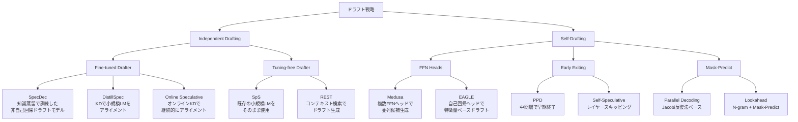

## 論文概要（Abstract）

本記事は [Unlocking Efficiency in Large Language Model Inference: A Comprehensive Survey of Speculative Decoding](https://arxiv.org/abs/2401.07851) の解説記事です。

大規模言語モデル（LLM）の自己回帰デコーディングに起因する高い推論レイテンシを軽減するため、投機的デコーディング（Speculative Decoding）が新たなデコーディングパラダイムとして注目されている。著者らは投機的デコーディングの形式的定義を与え、ドラフト戦略と検証方式の2軸で手法を体系的に分類し、統一的なベンチマーク環境（Spec-Bench）での比較評価を提供している。本サーベイはACL 2024 Findings（Long Paper）に採択されたものである。

この記事は [Zenn記事: vLLM投機的デコーディング×PagedAttentionでLLM推論レイテンシを削減する](https://zenn.dev/0h_n0/articles/17b7c9dee74e06) の深掘りです。

## 情報源

- **arXiv ID**: 2401.07851
- **URL**: [https://arxiv.org/abs/2401.07851](https://arxiv.org/abs/2401.07851)
- **著者**: Heming Xia, Zhe Yang, Qingxiu Dong, Peiyi Wang, Yongqi Li, Tao Ge, Tianyu Liu, Wenjie Li, Zhifang Sui
- **発表年**: 2024年1月（v1）、2024年6月（v3）
- **分野**: cs.CL（計算言語学）
- **採択**: ACL 2024 Findings（Long Paper）

## 背景と動機（Background & Motivation）

LLMの推論は自己回帰デコーディング（autoregressive decoding）に基づいており、各ステップで1トークンずつ逐次生成する。この方式では、GPUの計算能力が十分に活用されず、メモリ帯域幅がボトルネックとなる「メモリバウンド」な状態に陥る。例えば、LLaMA-2 70Bモデルで1トークンを生成するために約140GBのパラメータをメモリから読み出す必要があるが、実際の演算量は微小であり、GPUの演算器は大半の時間アイドル状態となる。

投機的デコーディングは、この非効率性を根本的に解決するアプローチである。軽量なドラフトモデルで複数の候補トークンを効率的に先読み生成し、ターゲットLLMで並列に検証することで、1回のフォワードパスで複数トークンを確定できる。重要な点として、適切な検証アルゴリズムを用いれば、出力分布はターゲットLLMと完全に一致する（ロスレス）ことが数学的に保証されている。

2022年にLeviathan et al.とChen et al.が独立に提案して以降、この分野は急速に発展しており、ドラフト手法・検証方式・適用領域の各面で多数の研究が発表されている。著者らはこの急成長する分野を体系的に整理し、統一的なベンチマークで公平に比較するためにサーベイを執筆した。

## 主要な貢献（Key Contributions）

- **形式的定義**: 投機的デコーディングを「Draft-then-Verify パラダイム」として統一的に定式化し、既存手法を包括的に位置づけるフレームワークを提供
- **体系的分類**: ドラフト戦略（Independent Drafting / Self-Drafting）と検証方式（Greedy / Speculative Sampling / Token Tree Verification）の2軸による分類体系を構築
- **Spec-Bench**: 6つのサブタスク（会話、翻訳、要約、QA、推論、RAG）に各80インスタンスを含む統一ベンチマークで、主要手法を公平に比較評価
- **課題と展望の整理**: バッチ推論への対応、ドラフト精度と効率のトレードオフ、他の高速化手法との統合など、今後の研究課題を体系的に整理

## 投機的デコーディングの基本原理（Formal Definition）

著者らは投機的デコーディングを以下の3フェーズで定式化している。

### ドラフトフェーズ

軽量なドラフトモデル $M_p$ を用いて、現在のコンテキスト $x_{\leq t}$ から $K$ 個の候補トークンを効率的に生成する。

$$
p_1, p_2, \ldots, p_K = \text{Draft}(x_{\leq t}, M_p)
$$

$$
\tilde{x}_i \sim p_i, \quad i = 1, 2, \ldots, K
$$

ここで $p_i$ はドラフトモデルが予測する $i$ 番目のトークンの確率分布、$\tilde{x}_i$ はその分布からサンプリングされた候補トークンである。

### 検証フェーズ

ターゲットLLM $M_q$ を用いて、$K$ 個の候補トークンを並列に検証する。

$$
q_i = M_q(x \mid x_{\leq t}, \tilde{x}_{<i}), \quad i = 1, 2, \ldots, K+1
$$

ここで $q_i$ はターゲットモデルが計算する $i$ 番目の位置での確率分布である。$K+1$ 個の分布を計算するのは、最後に棄却された位置で正しいトークンをサンプリングするためである。

### 受理・棄却フェーズ（Speculative Sampling）

各候補トークン $\tilde{x}_i$ に対し、以下の確率で受理・棄却を判定する。

$$
\tilde{x}_i \text{ is accepted if } r < \min\left(1, \frac{q_i(\tilde{x}_i)}{p_i(\tilde{x}_i)}\right), \quad r \sim U[0, 1]
$$

棄却された場合、修正分布からトークンをサンプリングする。

$$
x_{t+c} \sim \text{norm}\left(\max(0, q_c - p_c)\right)
$$

ここで $c$ は最初に棄却された位置のインデックス、$\text{norm}(\cdot)$ は正規化関数である。この受理・棄却メカニズムにより、最終的な出力分布がターゲットLLM $M_q$ の分布と完全に一致することが数学的に保証される。

## 手法の分類体系（Taxonomy）

著者らはサーベイ Section 5-6 において、投機的デコーディングの手法を **ドラフト戦略** と **検証方式** の2つの軸で体系的に分類している。

### ドラフト戦略による分類



**Independent Drafting** は、ターゲットLLMとは別のドラフトモデルを用いる方式である。サーベイでは、知識蒸留（KD）でターゲットモデルにアライメントしたFine-tuned Drafter と、既存の小規模モデルをそのまま利用するTuning-free Drafter に細分類している。前者は高い受理率が期待できるが、ドラフトモデルの訓練コストが発生する。後者はターゲットモデルとの分布の乖離が大きい場合に受理率が低下する課題がある。

**Self-Drafting** は、ターゲットLLM自身の内部構造を活用してドラフトを生成する方式である。追加のモデルを必要としないため、メモリオーバーヘッドが小さいという利点がある。FFN Heads方式（Medusa, EAGLE）は小規模な追加ヘッドを訓練して複数候補を並列生成し、Early Exiting方式（PPD, Self-Speculative）はターゲットモデルの中間層出力を利用する。Mask-Predict方式（Lookahead, Parallel Decoding）はJacobi反復法に基づく並列デコーディングを実現する。

### 検証方式による分類

著者らはサーベイ Section 6 において、検証方式を以下の3カテゴリに分類している。

| 検証方式 | ロスレス保証 | 特徴 | 代表手法 |
|---------|-----------|------|---------|
| Greedy検証 | あり（貪欲時）| 単純な一致判定 | SpecDec, SpS |
| Speculative Sampling | あり | 確率的受理で分布一致を保証 | SpS, DistillSpec |
| Token Tree検証 | あり | ツリー構造で候補を並列検証 | SpecInfer, Medusa, EAGLE |

**Greedy検証** は、ドラフトトークンがターゲットモデルの貪欲選択と一致するかを単純に判定する。実装が容易だが、サンプリングデコーディングには直接適用できない。

**Speculative Sampling** は、前述の確率的受理・棄却メカニズムにより、任意のサンプリング設定でロスレスな出力を保証する。温度パラメータやtop-p/top-kなどのサンプリング戦略にも対応可能である。

**Token Tree検証** は、複数の候補系列をツリー構造に統合し、ツリーアテンションマスクを用いて1回のフォワードパスで並列に検証する。著者らによれば、SpecInfer がブーストチューニングされた複数のドラフトモデルからツリーを構築し、Medusa がFFNヘッドからの複数候補をカルテシアン積でツリー化し、EAGLE が自己回帰ヘッドからの候補をツリー展開する。ツリー検証は受理トークン数の期待値を増加させるが、アテンション計算のオーバーヘッドが生じる。

## 主要手法の詳細比較（Spec-Bench Results）

著者らはSpec-Benchを構築し、RTX 3090 GPU上でVicuna-7Bをターゲットモデルとして主要手法を統一条件で比較している。以下はサーベイ Figure 5 およびTable（Greedy設定、バッチサイズ1）に基づく結果である。

### 性能比較表

| 手法 | 分類 | スピードアップ | Token Tree | 追加パラメータ |
|-----|------|-------------|-----------|-------------|
| EAGLE | Self-Drafting (FFN Head) | 1.8x - 2.4x | あり | 自己回帰ヘッド（軽量） |
| SpS | Independent (Tuning-free) | 1.9x - 2.5x | なし | 小規模LM全体 |
| SpecInfer | Independent (Fine-tuned) | 2.0x - 2.4x | あり | ブーストチューニング済LM |
| Medusa | Self-Drafting (FFN Head) | 2.2x - 2.3x | あり | 複数FFNヘッド |
| SpecDec | Independent (Fine-tuned) | 3.9x - 5.1x | なし | 非自己回帰ドラフトモデル |
| Lookahead | Self-Drafting (Mask-Predict) | 1.5x - 2.3x | なし | なし |
| REST | Independent (Tuning-free) | 1.6x - 1.8x | あり | 検索データストア |
| Self-Speculative | Self-Drafting (Early Exit) | 1.4x - 1.7x | あり | なし |

サーベイ Figure 6 によれば、サンプリング温度を上げるとスピードアップ率は全手法で低下する傾向がある。これは温度が高いほどドラフトモデルとターゲットモデルの分布の乖離が大きくなり、受理率が下がるためである。著者らは「EAGLEが様々な温度設定において1.7x-2.1xのスピードアップを一貫して達成し、他手法を上回る」と報告している。

### 手法選択の指針

サーベイの分析結果に基づき、各手法の推奨シナリオを以下に整理する。

```python
from dataclasses import dataclass
from enum import Enum


class DraftStrategy(Enum):
    """ドラフト戦略の分類."""

    INDEPENDENT_FINETUNED = "independent_finetuned"
    INDEPENDENT_TUNING_FREE = "independent_tuning_free"
    SELF_DRAFTING_FFN = "self_drafting_ffn"
    SELF_DRAFTING_EARLY_EXIT = "self_drafting_early_exit"
    SELF_DRAFTING_MASK_PREDICT = "self_drafting_mask_predict"


@dataclass(frozen=True)
class SpecDecodingMethod:
    """投機的デコーディング手法のメタデータ.

    サーベイ (Xia et al., 2024) の分類体系に基づき、
    各手法の特性を構造化して保持する。

    Attributes:
        name: 手法名
        strategy: ドラフト戦略の分類
        speedup_range: Spec-Bench上での貪欲デコーディング時のスピードアップ範囲
        requires_training: ドラフトモデルの追加訓練が必要か
        supports_tree: Token Tree検証をサポートするか
    """

    name: str
    strategy: DraftStrategy
    speedup_range: tuple[float, float]
    requires_training: bool
    supports_tree: bool


def recommend_method(
    memory_budget_gb: float,
    training_allowed: bool,
    sampling_temperature: float,
) -> str:
    """サーベイの分析に基づき、条件に適した手法を推奨する.

    Args:
        memory_budget_gb: 追加で利用可能なGPUメモリ（GB）
        training_allowed: ドラフトモデルの追加訓練が可能か
        sampling_temperature: サンプリング温度（0.0 = greedy）

    Returns:
        推奨手法名と理由を含む文字列
    """
    if memory_budget_gb < 1.0:
        # メモリ制約が厳しい場合: 追加パラメータなしの手法
        return (
            "Lookahead / Self-Speculative: "
            "追加パラメータ不要だがスピードアップは1.4x-2.3x（サーベイ Figure 5）"
        )

    if training_allowed and sampling_temperature < 0.3:
        # 訓練可能かつ低温度: EAGLE が最適
        return (
            "EAGLE: 温度0付近で最大2.4xのスピードアップ、"
            "高温度でも安定した性能（サーベイ Figure 6）"
        )

    if not training_allowed:
        # 訓練不可: 既存モデルをそのまま利用
        return (
            "SpS (Speculative Sampling): "
            "既存の小規模LMを利用、1.9x-2.5xのスピードアップ（サーベイ Figure 5）"
        )

    return (
        "Medusa: 複数FFNヘッドの訓練で2.2x-2.3xのスピードアップ、"
        "Token Tree検証で受理率を向上（サーベイ Figure 5）"
    )
```

## vLLMでの実装状況

サーベイの分析対象となった手法の多くは、vLLMフレームワークで実装が進んでいる。Zenn記事「[vLLM投機的デコーディング×PagedAttentionでLLM推論レイテンシを削減する](https://zenn.dev/0h_n0/articles/17b7c9dee74e06)」で解説されているように、vLLMは投機的デコーディングをPagedAttentionと統合し、実運用レベルでの利用を可能にしている。

サーベイで取り上げられた手法のうち、vLLMが対応している主な方式は以下の通りである。

| 手法分類 | vLLMでの対応 | 設定方法 |
|---------|-----------|---------|
| Independent Drafting (SpS) | `speculative_model` パラメータで小規模ドラフトモデルを指定 | `--speculative-model <model>` |
| Self-Drafting (EAGLE) | EAGLE / EAGLE-2 のサポートが追加済み | `--speculative-model <eagle-model>` |
| Self-Drafting (Medusa) | Medusaヘッドのサポートが追加済み | `--speculative-model <medusa-model>` |
| Token Tree検証 | ツリーベースの検証に対応 | `--num-speculative-tokens <N>` |

著者らが本サーベイで指摘しているように、バッチ推論環境での投機的デコーディングの効率的な実装は依然として課題であり、vLLMにおいてもcontinuous batchingとの統合が継続的に改善されている。

## 課題と今後の研究方向（Challenges & Future Directions）

サーベイ Section 7 において、著者らは以下の主要課題を整理している。

### ドラフト精度と効率のトレードオフ

ドラフトモデルを大規模にすればターゲットモデルとの分布の一致度が向上し受理率は上がるが、ドラフト生成自体の計算コストが増大する。著者らはこのトレードオフの最適点を見つけることが「投機的デコーディングの核心的課題」であると述べている。行動アライメント（behavior alignment）により、小規模モデルでも高い受理率を達成する方向性が有望とされている。

### バッチ推論への対応

バッチ内の各サンプルでドラフトの受理長が異なるため、バッチ全体のレイテンシは最も遅いサンプルに律速される。著者らによれば、EAGLEとSpSのみがバッチ推論の実装を提供しており、continuous batching技術との統合が今後の重要課題である。

### 他の高速化手法との統合

投機的デコーディングはモデルの内部構造を変更しないため、量子化やFlash-Attentionなどの他の高速化手法と原理的に併用可能である。著者らは、contrastive decodingとの組み合わせや、画像生成・音声合成などマルチモーダル領域への拡張を今後の研究方向として挙げている。

### 投機長の動的決定

固定の投機長 $K$ は全てのコンテキストで最適とは限らない。簡単な継続パターン（例: 定型表現）では長い投機が有効だが、創造的な生成では短い投機が効率的である。著者らはコンテキストに応じた動的な投機長の決定メカニズムの開発が重要と指摘している。

## 関連研究（Related Work）

投機的デコーディング以外にも、LLM推論の高速化には多くのアプローチが存在する。

- **量子化（Quantization）**: モデルパラメータをFP16からINT8/INT4に変換し、メモリ帯域幅の使用を削減する手法（GPTQ, AWQ, SqueezeLLM等）。投機的デコーディングと直交する手法であり併用可能
- **KVキャッシュ圧縮**: Attention計算のキーバリューキャッシュを圧縮し、メモリ使用量を削減する手法（PagedAttention, GQA, MQA等）
- **早期終了（Early Exiting）**: 入力の難易度に応じてTransformerの途中層で推論を打ち切る手法。投機的デコーディングのSelf-Drafting方式と関連が深い
- **非自己回帰生成（Non-Autoregressive Generation）**: 複数トークンを一度に並列生成する手法。投機的デコーディングのMask-Predict方式の基盤となっている

著者らはサーベイの中で、これらの手法と投機的デコーディングの統合が今後の重要な研究テーマであると強調している。

## まとめ

本サーベイは、投機的デコーディングの分野を「ドラフト戦略」と「検証方式」の2軸で体系的に整理し、Spec-Benchによる統一条件での比較評価を提供した点に大きな価値がある。Greedy設定ではEAGLEが安定して高いスピードアップを達成し、温度変化にも頑健であることが示された。一方で、バッチ推論への対応やドラフト精度と効率のトレードオフなど、実運用に向けた課題も明確に整理されている。

vLLMを含むサービングフレームワークでの実装が進む中、本サーベイの分類体系は手法選択の指針として実用的である。投機的デコーディングは量子化やKVキャッシュ圧縮と併用可能であり、LLM推論高速化のツールキットにおいて中核的な位置を占めることが期待される。

## 参考文献

1. Xia, H., Yang, Z., Dong, Q., Wang, P., Li, Y., Ge, T., Liu, T., Li, W., & Sui, Z. (2024). Unlocking Efficiency in Large Language Model Inference: A Comprehensive Survey of Speculative Decoding. *ACL 2024 Findings*. [arXiv:2401.07851](https://arxiv.org/abs/2401.07851)
2. Leviathan, Y., Kalman, M., & Matias, Y. (2023). Fast Inference from Transformers via Speculative Decoding. *ICML 2023*. [arXiv:2211.17192](https://arxiv.org/abs/2211.17192)
3. Chen, C., Borgeaud, S., Irving, G., Lespiau, J.-B., Sifre, L., & Jumper, J. (2023). Accelerating Large Language Model Decoding with Speculative Sampling. [arXiv:2302.01318](https://arxiv.org/abs/2302.01318)
4. Li, Y., Cai, T., Zhang, Y., Chen, D., & Narasimhan, K. (2024). EAGLE: Speculative Sampling Requires Rethinking Feature Uncertainty. *ICML 2024*. [arXiv:2401.15077](https://arxiv.org/abs/2401.15077)
5. Cai, T., Li, Y., Geng, Z., Peng, H., & Dao, T. (2024). Medusa: Simple LLM Inference Acceleration Framework with Multiple Decoding Heads. *ICML 2024*. [arXiv:2401.10774](https://arxiv.org/abs/2401.10774)
6. Miao, X., Oliaro, G., Zhang, Z., Cheng, X., Wang, Z., Wong, R. Y. Y., ... & Jia, Z. (2024). SpecInfer: Accelerating Generative Large Language Model Serving with Tree-based Speculative Inference and Verification. *ASPLOS 2024*. [arXiv:2305.09781](https://arxiv.org/abs/2305.09781)
7. Fu, Y., Bailis, P., Stoica, I., & Zhang, H. (2024). Break the Sequential Dependency of LLM Inference Using Lookahead Decoding. [arXiv:2402.02057](https://arxiv.org/abs/2402.02057)
8. Xia, H., Ge, T., Wang, P., Chen, S., Wei, F., & Sui, Z. (2023). Speculative Decoding: Exploiting Speculative Execution for Accelerating Seq2Seq Generation. *EMNLP 2023*. [arXiv:2203.16487](https://arxiv.org/abs/2203.16487)
