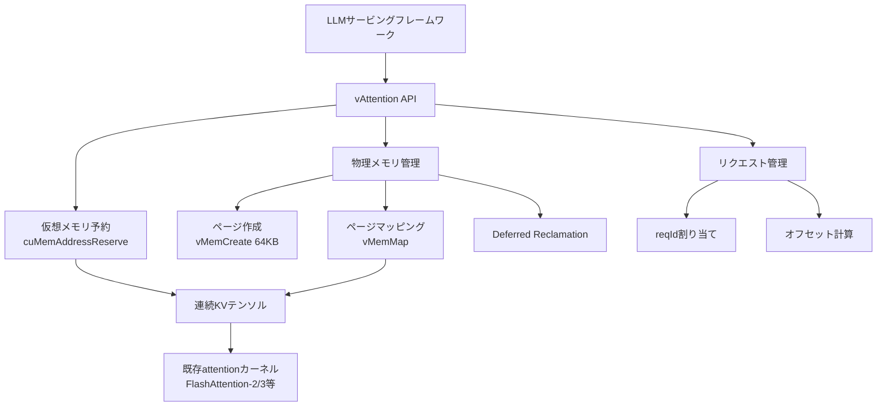
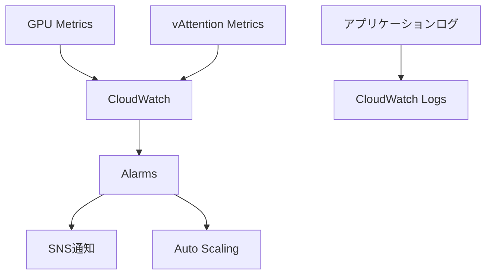

本記事は [vAttention: Dynamic Memory Management for Serving LLMs without PagedAttention](https://arxiv.org/abs/2405.04437) の解説記事です。

## 論文概要

LLMサービングにおけるKVキャッシュのメモリ管理は、スループットとレイテンシの両面で重要な課題である。現在広く使われているPagedAttentionは、KVキャッシュを固定サイズのブロックに分割し、非連続な仮想メモリ上に配置することでGPUメモリの断片化を軽減する。しかし、この方式はattentionカーネルの書き換えを必要とし、新しい最適化カーネルの導入を遅らせる要因となっている。著者らは、CUDA Virtual Memory Management（VMM）APIを活用してvAttentionを提案している。vAttentionは仮想メモリの連続性を保ちながら物理メモリの断片化を解消し、PagedAttention対応のFlashAttention-2と比較して最大1.23倍のスループット向上を達成したと報告している。本論文はASPLOS 2025で発表されている。

この記事は [Zenn記事: vLLM投機的デコーディング×PagedAttentionでLLM推論レイテンシを削減する](https://zenn.dev/0h_n0/articles/17b7c9dee74e06) の深掘りです。

## 情報源

- **arXiv ID**: 2405.04437
- **URL**: [https://arxiv.org/abs/2405.04437](https://arxiv.org/abs/2405.04437)
- **著者**: Ramya Prabhu, Ajay Nayak, Jayashree Mohan, Ramachandran Ramjee, Ashish Panwar (Microsoft Research)
- **発表**: 2024年5月（ASPLOS 2025採択）
- **分野**: cs.LG（機械学習）、cs.OS（オペレーティングシステム）

## 背景と動機

LLMサービングでは、autoregressiveな生成のたびにKVキャッシュが増大する。リクエストごとの出力長が事前に不明なため、最大長分のメモリを事前確保すると大量の無駄が生じる。この問題を解決するために、vLLMが導入したPagedAttentionはKVキャッシュをページ単位で動的に割り当てる方式を採用した。

しかし、PagedAttentionには以下の3つの問題がある。

**1. カスタムカーネルの必要性**: KVキャッシュが非連続な仮想メモリ上に配置されるため、既存のattentionカーネル（FlashAttention等）をそのまま使えず、ブロックテーブルを参照する専用カーネルへの書き換えが必要となる。FlashAttention-3のような新しい最適化カーネルが登場しても、PagedAttention対応版の開発が追いつかず、本番環境での性能改善が遅れる。

**2. OSレベルの機能の冗長な再実装**: PagedAttentionは本質的にOSの仮想メモリ管理（demand paging）をユーザ空間で再実装している。ブロックテーブルの管理、物理ページの割り当て・解放など、OS内部のページテーブルと同等の機構をフレームワーク側で維持する必要があり、複雑性の増大を招く。

**3. 性能オーバーヘッド**: PagedAttention対応カーネルは、非対応版と比較してGPUレベルで7-13%多い命令を実行する。著者らによれば、FlashAttention-2のprefillカーネルではPagedAttention対応により最大37%の性能低下が生じる。CPU側でもブロックテーブルの準備がvLLMのdecodeイテレーションで約30%のレイテンシ（後に10%に改善）を占めると報告されている。

## 主要な貢献

著者らが報告しているvAttentionの主要な貢献は以下の通りである。

1. **カーネル非依存のメモリ管理**: CUDA VMM APIを活用し、KVキャッシュの仮想メモリ連続性を保つことで、既存のattentionカーネルを一切変更せずにメモリ効率化を実現している
2. **3つの最適化手法**: メモリ割り当てとGPU計算のオーバーラップ、deferred reclamation、細粒度ページサイズの3手法により、動的メモリ管理のオーバーヘッドを実用レベルまで削減している
3. **幅広いカーネルへの即座の対応**: FlashAttention-3のようなPagedAttention未対応の新カーネルを、修正なしでLLMサービングに組み込めることを実証している
4. **包括的な性能評価**: 複数モデル（Yi-6B、Llama-3-8B、Yi-34B）、複数GPU（A100、H100）上でオフラインスループットとオンラインレイテンシの両面を評価している

## 技術的詳細

### CUDA Virtual Memory Management APIの活用

vAttentionの核心は、CUDAが提供するVirtual Memory Management（VMM）APIを用いて、仮想メモリと物理メモリの割り当てを分離する点にある。通常の`cudaMalloc`は仮想アドレスと物理メモリを同時に確保するが、VMM APIでは以下の2ステップに分離できる。

1. **仮想アドレスの予約**（`cuMemAddressReserve`）: 連続した仮想アドレス空間を確保するが、物理メモリは消費しない
2. **物理メモリの割り当てとマッピング**（`cuMemCreate` + `cuMemMap`）: 必要になった時点で物理ページを確保し、予約済みの仮想アドレスにマッピングする

この分離により、KVキャッシュは仮想メモリ上で連続した1つのテンソルとして扱える。物理メモリはトークン生成の進行に応じてインクリメンタルに確保される。attentionカーネルから見ると通常の連続テンソルと区別がつかないため、カーネルの変更は一切不要となる。

### 仮想メモリの事前予約

vAttentionでは、起動時にKVキャッシュ用の巨大な仮想アドレス空間を事前予約する。各KVバッファのサイズは以下で計算される。

$$
S_{\text{buffer}} = B \times L \times H \times D \times P
$$

ここで $B$ はバッチサイズ、$L$ は最大コンテキスト長、$H$ はattentionヘッド数、$D$ はヘッド次元、$P$ はデータ型のバイト数である。Transformerモデルには $2N$ 個のKVバッファが必要となる（$N$ はレイヤー数、KとVそれぞれに1バッファ）。

著者らの実験では、Yi-34B（TP-2）において1バッファあたり約100GB、合計約12TBの仮想アドレス空間を予約している。64bit CUDAプロセスでは1プロセスあたり256TBの仮想アドレス空間が利用可能であるため、この予約は実用上問題ないと報告されている。

### リクエスト単位のKVキャッシュインデキシング

各リクエストには一意の識別子 `reqId`（範囲: $0$ から $B-1$）が割り当てられる。リクエストのKVキャッシュは、仮想テンソル内のオフセット $\text{reqId} \times S$ から始まるサブテンソルとしてアクセスされる。ここで $S = L \times H \times D \times P$ はリクエストあたりの最大KVキャッシュサイズである。

```python
from dataclasses import dataclass


@dataclass
class VAttentionConfig:
    """vAttentionの設定パラメータ。"""

    num_layers: int
    max_batch_size: int
    max_context_len: int
    num_kv_heads: int
    head_dim: int
    dtype_bytes: int = 2  # fp16/bf16

    @property
    def per_request_size(self) -> int:
        """1リクエストあたりの最大KVキャッシュサイズ（バイト）。"""
        return self.max_context_len * self.num_kv_heads * self.head_dim * self.dtype_bytes

    @property
    def total_virtual_memory(self) -> int:
        """全KVバッファの合計仮想メモリサイズ（バイト）。K,V各レイヤー分。"""
        return 2 * self.num_layers * self.max_batch_size * self.per_request_size

    def get_kv_offset(self, req_id: int) -> int:
        """指定リクエストのKVキャッシュ開始オフセット（バイト）を返す。

        Args:
            req_id: リクエスト識別子（0からmax_batch_size-1）

        Returns:
            仮想テンソル内のバイトオフセット
        """
        if not 0 <= req_id < self.max_batch_size:
            raise ValueError(f"req_id must be in [0, {self.max_batch_size}), got {req_id}")
        return req_id * self.per_request_size
```

### Demand Paging vs Pre-allocation

vAttentionはdecodeフェーズとprefillフェーズで異なるメモリ割り当て戦略を採用している。

**Decodeフェーズ — メモリ割り当てと計算のオーバーラップ**

decodeフェーズでは1イテレーションあたり1トークンが生成されるため、メモリ需要が予測可能である。vAttentionはバックグラウンドスレッドを用いて、次のイテレーションで必要となる物理ページを事前に確保する。decodeイテレーションのレイテンシは10-100msであるのに対し、CUDA VMM APIの呼び出しレイテンシは5ms程度であるため、メモリ割り当てを計算と完全にオーバーラップさせることができる。

**Prefillフェーズ — Deferred Reclamation + Eager Allocation**

prefillフェーズでは入力トークン列全体のKVキャッシュを一度に確保する必要があり、割り当て量が大きい。vAttentionでは以下の2つの最適化を組み合わせている。

- **Deferred Reclamation**: リクエスト完了時に物理ページを即座に解放せず、マッピングを維持したままにする。新しいリクエストが同じ`reqId`スロットに割り当てられた場合、既存のマッピングを再利用できるため、割り当てレイテンシを大幅に削減できる
- **Eager Allocation**: 次に到着するリクエストのために、空きスロットに対して事前に物理ページをマッピングしておく

### 細粒度ページサイズ

CUDA VMM APIの標準ページサイズは2MBであり、これはKVキャッシュの割り当て単位としては粗すぎる。著者らはNVIDIAのオープンソース統合メモリドライバを修正し、64KB、128KB、256KBの細粒度ページサイズをサポートするカスタムAPIを実装している。

| 操作 | 標準（2MB） | カスタム（64KB） |
|------|------------|----------------|
| ページ作成 | 29 μs | 1.7 μs |
| ページマッピング | 2 μs | 8 μs |

論文Table 1より、ページ作成は64KBの方が17倍高速だが、マッピングは4倍遅い。ただし、deferred reclamationによりマッピング操作の頻度自体が大幅に削減されるため、総合的には64KBページが有利であると報告されている。

細粒度ページの効果として、ブロックサイズ（1ページに格納できるトークン数）が大幅に削減される。

| モデル | 2MBページ | 64KBページ |
|--------|----------|-----------|
| Yi-6B | 2048トークン | 64トークン |
| Llama-3-8B | 1024トークン | 32トークン |

論文中の評価では、64KBページを使用した場合でもTLBスラッシングの証拠は観測されなかったと報告されている。

## 実装のポイント

vAttentionのAPIサーフェスは4つの関数に集約されている。

```python
from typing import Protocol


class VAttentionAPI(Protocol):
    """vAttentionの公開APIインターフェース。"""

    def init(self, num_layers: int, max_batch: int, max_context_len: int,
             num_kv_heads: int, head_dim: int, page_size_kb: int = 64) -> None:
        """仮想メモリバッファを事前予約して初期化する。"""
        ...

    def alloc_reqid(self) -> int:
        """空きリクエストスロットを割り当て、reqIdを返す。"""
        ...

    def step(self, cache_seq_lens: list[int]) -> None:
        """各リクエストのコンテキスト長に応じて物理ページを確保する。"""
        ...

    def free_reqid(self, req_id: int) -> None:
        """リクエストスロットを解放する（物理ページはdeferred reclamation）。"""
        ...
```

vAttentionのアーキテクチャ全体を以下に示す。



フレームワーク統合の観点では、vAttentionは既存のattentionカーネルのコードを一切変更しない。KVキャッシュが仮想メモリ上で連続しているため、カーネルは通常のテンソルと同様にアクセスできる。これにより、FlashAttention-3のようなPagedAttention未対応のカーネルも即座に利用可能となる。

メモリ割り当て帯域に関しても、著者らは64KBページで7.59 GB/s（TP-1）、15.18 GB/s（TP-2）を達成しており、decodeフェーズの最大メモリ割り当てレート750 MB/sの10倍以上であると報告している。

## Production Deployment Guide

### AWS実装パターン

vAttentionを活用したLLMサービングシステムをAWSに展開する場合の構成パターンを示す。以下の構成表は2026年5月時点のAWS料金に基づく概算であり、実際の料金はリージョン・利用量・契約条件により変動する。

| 構成 | GPU | 月間コスト概算 | 想定ユースケース |
|------|-----|---------------|----------------|
| Small | g5.xlarge×1 (A10G) | $800-1,200 | 開発・検証環境、7Bモデル |
| Medium | p4d.24xlarge×1 (A100×8) | $12,000-15,000 | 34Bモデル、中規模プロダクション |
| Large | EKS + p5.48xlarge×N (H100×8) | $40,000-80,000+ | 70B+モデル、大規模サービング |

#### Small構成: SageMaker Endpoint

開発・検証用途でvAttention対応vLLMコンテナを実行する構成。

```hcl
# Small構成: SageMaker Endpoint（vAttention検証用）

terraform {
  required_version = ">= 1.5"
  required_providers {
    aws = {
      source  = "hashicorp/aws"
      version = "~> 5.0"
    }
  }
}

resource "aws_sagemaker_endpoint_configuration" "vattention" {
  name = "vattention-endpoint-config"

  production_variants {
    variant_name           = "primary"
    model_name             = aws_sagemaker_model.vattention.name
    instance_type          = "ml.g5.xlarge"
    initial_instance_count = 1
  }
}
```

#### Large構成: EKS + Karpenter + Spot

大規模プロダクション向けのKubernetes構成。Karpenterによるオートスケーリングとスポットインスタンスを活用する。

```hcl
# Large構成: EKS + Karpenter + Spot GPU

resource "kubectl_manifest" "gpu_nodepool" {
  yaml_body = <<-YAML
    apiVersion: karpenter.sh/v1
    kind: NodePool
    metadata:
      name: gpu-serving
    spec:
      template:
        spec:
          nodeClassRef:
            group: karpenter.k8s.aws
            kind: EC2NodeClass
            name: gpu-nodes
          requirements:
            - key: "node.kubernetes.io/instance-type"
              operator: In
              values: ["p4d.24xlarge", "p5.48xlarge"]
            - key: "karpenter.sh/capacity-type"
              operator: In
              values: ["spot", "on-demand"]
      limits:
        nvidia.com/gpu: "32"
      disruption:
        consolidationPolicy: WhenEmptyOrUnderutilized
        consolidateAfter: 60s
  YAML
}
```

### セキュリティベストプラクティス

- **ネットワーク分離**: VPC Private Subnet内にGPUノードを配置し、NATゲートウェイ経由でのみ外部通信を許可する
- **IAMロール最小権限**: SageMakerエンドポイントのIAMロールにはS3モデルバケットへの読み取り権限のみ付与する
- **暗号化**: EBSボリュームのAES-256暗号化を有効化し、KMSカスタマーマネージドキーを使用する
- **シークレット管理**: モデルアクセスキー等はAWS Secrets Managerに保存する

### 運用・監視設定



| メトリクス | 閾値 | アクション |
|-----------|------|----------|
| GPU Memory Utilization | > 90% | ノード追加 |
| 物理ページ使用率 | > 85% | deferred reclamation強制実行 |
| Prefill Latency P99 | > 5s | バッチサイズ調整 |
| Decode TTFT P99 | > 200ms | スケールアウト |
| リクエストキュー長 | > 100 | Karpenterスケール |
| TLBミス率 | > 5% | ページサイズ見直し |

### コスト最適化チェックリスト

1. スポットインスタンスの活用（p4d/p5のスポット割引は最大60-70%）
2. Savings Plansの適用（1年/3年コミット、On-Demand比最大40%削減）
3. GPU使用率の監視とライトサイジング
4. 推論バッチサイズの最適化（GPU使用率80%以上を目標）
5. KVキャッシュのページサイズチューニング（64KB vs 128KB vs 256KB）
6. deferred reclamationのタイムアウト調整（メモリ圧迫時は短縮）
7. モデル量子化の検討（INT8/FP8によるメモリ削減）
8. Tensor Parallelism度の最適化（通信オーバーヘッドとのバランス）
9. Prefix cachingの活用（共通プレフィックスのKVキャッシュ再利用）
10. 不要なログ・メトリクス送信の削減（CloudWatchコスト抑制）
11. EBSボリュームタイプの最適化（gp3 vs io2のIOPS要件に応じた選択）
12. NATゲートウェイのトラフィック最適化（VPCエンドポイント活用）
13. ECRイメージのライフサイクルポリシー設定（不要イメージの自動削除）
14. CloudWatch Logsの保持期間設定（30日以上は不要なケースが多い）
15. Reserved Capacityの事前確保（GPU不足リスクの軽減）
16. マルチリージョン展開の検討（レイテンシ最適化とDR）
17. 推論リクエストのキャッシュ層導入（同一プロンプトの再計算回避）
18. オフピーク時のスケールダウン自動化
19. コンテナイメージサイズの削減（pull時間短縮、ECRストレージ削減）
20. AWS Cost Explorerのアラート設定（予算超過の早期検知）
21. Gravitonインスタンスの活用（CPUワーカーノードのコスト削減）

## 実験結果

### Prefill性能

著者らは長コンテキスト（192Kトークン）でのprefill性能を評価している。論文の実験結果より、FA2_vAttention（vAttention + FlashAttention-2）はFA2_Paged（PagedAttention対応FlashAttention-2）と比較して以下のスループット向上を達成している。

| モデル | FA2_vAttention / FA2_Paged |
|--------|--------------------------|
| Yi-6B | 1.24倍 |
| Llama-3-8B | 1.26倍 |
| Yi-34B | 1.24倍 |

FlashInferカーネルでも同様の傾向が報告されており、Yi-6Bで1.25倍、Llama-3-8Bで1.36倍のスループット向上が確認されている。長コンテキストではattention計算がprefill時間の大部分を占めるため、カーネル効率の差が直接的にスループットに反映される。

### Decode性能

decodeフェーズではFA2_vAttentionの性能はFA2_Pagedと同等であると報告されている。decodeカーネルはメモリバウンドであり、PagedAttentionカーネルの追加命令オーバーヘッドが計算レイテンシに隠蔽されるためである。ただし、vLLMのpaged kernelはFlashAttention-2と比較して最大2.8倍遅いと著者らは指摘している。

### エンドツーエンドのオフラインスループット

arXiv-Summarizationワークロード（427件の長コンテキストリクエスト、64K-192Kトークン）を用いた評価では、FA2_vAttentionはFA2_Pagedに対してYi-6Bで1.18倍、Llama-3-8Bで1.15倍、Yi-34Bで1.13倍のスループット向上が報告されている。スループット向上の度合いは、prefillとdecodeのトークン比率やコンテキスト長に相関すると著者らは分析している。

### オンラインサービングレイテンシ

可変QPSでのオンラインサービング評価では、FA2_vAttentionはFA2_Pagedに対して中央値レイテンシを最大42%削減したと報告されている（Yi-6B、QPS 0.25の条件下）。この改善の主因はprefillの高速化によるキューイング遅延の削減であると著者らは分析している。

### FlashAttention-3のポータビリティ

FlashAttention-3（Hopper GPUに最適化されたカーネル）はPagedAttention非対応の状態で公開された。vAttentionを使用することでカーネルの修正なしにFA3をLLMサービングに統合でき、PagedAttention対応のFA2と比較して1.26-1.5倍のスループット向上を達成したと報告されている。これはvAttentionのカーネル非依存という設計の実用的な価値を示すものである。

## 実運用への応用

vAttentionの設計はvLLMを含む既存のLLMサービングフレームワークとの統合を意識している。著者らはvLLMへの統合を実証しており、既存のPagedAttention管理ロジックをvAttentionのAPIに置き換えることで、フレームワーク側のコード複雑性を大幅に削減できることを示している。

今後のKVキャッシュ管理の方向性として、以下の展開が考えられる。

- **新カーネルへの即座の対応**: FlashAttention-3の例が示すように、vAttentionはカーネル開発とメモリ管理を完全に分離する。今後登場する新しいattentionカーネル（FlashAttention-4等）もKVキャッシュの連続性さえ前提とすれば即座に利用できる
- **マルチテナント環境での応用**: 仮想メモリと物理メモリの分離は、GPUの時分割共有（MPS/MIG）環境でのKVキャッシュ管理にも有効と考えられる
- **ハードウェアレベルでのサポート**: 著者らが指摘するように、GPUハードウェア側でより細粒度なページサイズをネイティブにサポートすれば、カスタムドライバ修正が不要となる

## 関連研究

- **PagedAttention**（Kwon et al., 2023）: vLLMの基盤技術。KVキャッシュをページ単位で管理し、メモリ断片化を軽減する。vAttentionが解決しようとする問題の出発点
- **FlexGen**（Sheng et al., 2023）: CPU-GPUメモリ階層を活用したオフロード手法。スループット重視のオフライン推論に焦点を当てている
- **SnapKV**（Li et al., 2024）: KVキャッシュの圧縮手法。重要なトークンのKVのみを保持することでメモリ使用量を削減する。vAttentionとは直交する最適化
- **FlashAttention-2/3**（Dao, 2023; Shah et al., 2024）: GPU上でのattention計算の高速化カーネル。vAttentionはこれらのカーネルを変更せずに利用できる点が特長

## まとめと今後の展望

vAttentionは、CUDA VMM APIを活用してKVキャッシュの仮想メモリ連続性を保ちつつ物理メモリの動的管理を実現する手法である。PagedAttentionが抱えるカスタムカーネルの必要性、冗長なメモリ管理機構、性能オーバーヘッドという3つの課題に対して、OS級の仮想メモリ抽象化をGPU上に持ち込むという設計方針で解決を図っている。

今後の展望として、GPUハードウェアのページサイズ粒度の改善、異種GPU環境でのKVキャッシュマイグレーション、および次世代attentionカーネルとのさらなる統合が期待される。LLMサービングの効率化は推論コスト削減に直結するため、vAttentionのようなシステムレベルの最適化は実用上の重要性が高い。

## 参考文献

1. Prabhu, R., Nayak, A., Mohan, J., Ramjee, R., & Panwar, A. (2024). vAttention: Dynamic Memory Management for Serving LLMs without PagedAttention. arXiv:2405.04437. ASPLOS 2025.
2. Kwon, W., Li, Z., Zhuang, S., et al. (2023). Efficient Memory Management for Large Language Model Serving with PagedAttention. SOSP 2023.
3. Dao, T. (2023). FlashAttention-2: Faster Attention with Better Parallelism and Work Partitioning. arXiv:2307.08691.
4. Shah, J., Bikshandi, G., Zhang, Y., et al. (2024). FlashAttention-3: Fast and Accurate Attention with Asynchrony and Low-precision. arXiv:2407.08691.
5. Sheng, Y., Zheng, L., Yuan, B., et al. (2023). FlexGen: High-Throughput Generative Inference of Large Language Models with a Single GPU. ICML 2023.
6. Li, Y., Huang, Y., Chen, B., et al. (2024). SnapKV: LLM Knows What You are Looking for Before Generation. arXiv:2404.14469.
