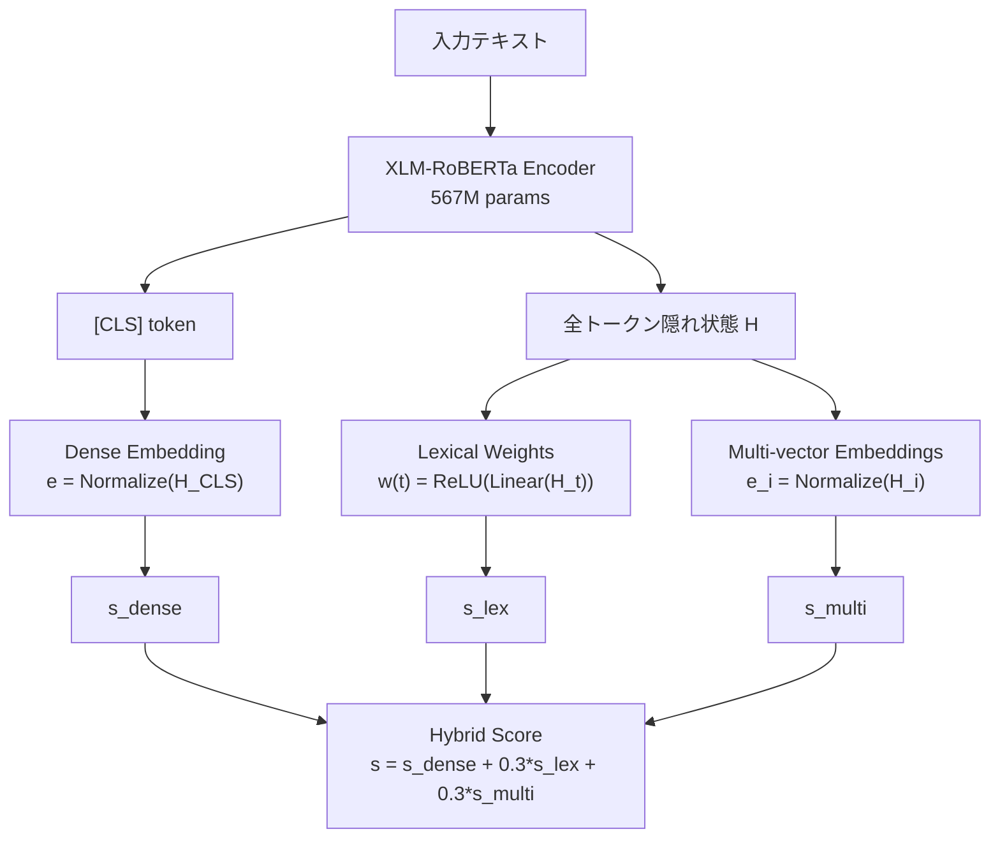
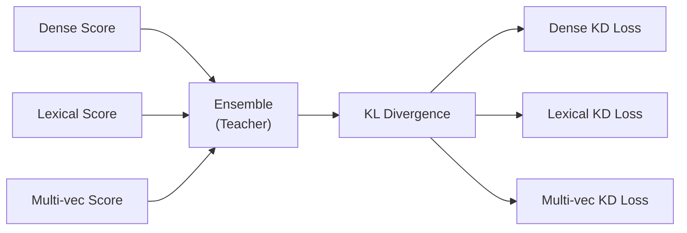

## 論文概要

本記事は、BAAI（Beijing Academy of Artificial Intelligence）が2024年6月に発表した論文「BGE M3-Embedding: Multi-Lingual, Multi-Functionality, Multi-Granularity Text Embeddings Through Self-Knowledge Distillation」（arXiv: 2406.07541）の解説記事です。

BGE M3-Embeddingは、テキスト埋め込みモデルにおける3つの主要課題――多言語対応、複数検索機能の統合、長文コンテキストへの対応――を単一モデルで同時に解決する手法を提案しています。著者らは、Dense retrieval、Lexical matching（SPLADE類似）、Multi-vector retrieval（ColBERT類似）の3機能を1つのモデルに統合し、Self-Knowledge Distillationによって各機能が相互に教師として学習することで、従来手法を大幅に上回る検索精度を達成したと報告しています。

本記事の関連Zenn記事: [BM25×ベクトル検索のクエリルーティング実装：動的重み調整でRAG検索精度を改善する](https://zenn.dev/0h_n0/articles/fa2dc30d90873c)

## 情報源

| 項目 | 内容 |
|------|------|
| arXiv ID | [2406.07541](https://arxiv.org/abs/2406.07541) |
| 著者 | Jianlv Chen, Shitao Xiao, Peitian Zhang, Kun Luo, Defu Lian, Zheng Liu |
| 所属 | BAAI (Beijing Academy of Artificial Intelligence) |
| 発表時期 | 2024年6月 |
| ライセンス | Apache 2.0 |
| GitHub | [FlagOpen/FlagEmbedding](https://github.com/FlagOpen/FlagEmbedding) |
| HuggingFace | [BAAI/bge-m3](https://huggingface.co/BAAI/bge-m3) |

## 背景と動機

既存のテキスト埋め込みモデルには、以下の3つの限界が存在していました。

### 1. 言語の壁

従来の高性能埋め込みモデル（E5-large-v2、BGE-large-EN-v1.5など）は主に英語に特化しており、多言語での検索精度が大幅に低下する問題がありました。mContrieverのような多言語対応モデルも存在しましたが、英語特化モデルと比較して精度面で劣る傾向がありました。

### 2. 検索機能の分断

Dense retrieval（ベクトル検索）、Sparse retrieval（BM25/SPLADE等の語彙ベース検索）、Multi-vector retrieval（ColBERT等のトークン間類似度ベース検索）は、それぞれ異なるモデルとして独立に開発されてきました。ハイブリッド検索を実現するには複数のモデルを個別に管理・運用する必要があり、計算コストとシステム複雑性が増大していました。

### 3. コンテキスト長の制限

多くの埋め込みモデルは最大512トークンに制限されており、長文ドキュメント（論文、法的文書、技術マニュアルなど）の検索では情報の切り捨てが発生し、検索精度が大きく損なわれていました。

BGE M3-Embeddingは、これら3つの限界を「Multi-Lingual」「Multi-Functionality」「Multi-Granularity」の3つのMとして定式化し、単一モデルで同時に解決することを目指しています。

## 主要な貢献

著者らは以下の4つの貢献を主張しています。

1. **統合アーキテクチャ**: Dense、Lexical、Multi-vectorの3検索機能を単一のXLM-RoBERTaベースモデル（567Mパラメータ）に統合
2. **Self-Knowledge Distillation**: 3機能のアンサンブルスコアを教師信号として各機能を相互に蒸留する新規訓練手法
3. **多言語・長文対応**: 100以上の言語をサポートし、コンテキスト長を512トークンから8192トークンに拡張
4. **大規模学習データ**: 約5Bトークン、100言語以上をカバーする訓練データの構築

## 技術的詳細

### ベースアーキテクチャ

BGE M3-EmbeddingはXLM-RoBERTa（567Mパラメータ）をバックボーンとして使用しています。入力テキストをTransformerエンコーダに通し、得られた隠れ状態から3種類の検索表現を同時に生成します。



### 3つの検索機能

#### Dense Retrieval

文全体を1つのベクトルに圧縮する最も基本的な検索手法です。`[CLS]`トークンの隠れ状態をL2正規化して埋め込みベクトルとします。

$$
e_q = \text{Normalize}(\text{Encoder}(q)_{[\text{CLS}]})
$$

$$
s_{\text{dense}} = e_q^T \cdot e_d
$$

ここで $$e_q$$、$$e_d$$ はそれぞれクエリとドキュメントの埋め込みベクトルです。Dense Retrievalは計算効率が高く、近似最近傍探索（ANN）との組み合わせが容易という利点があります。

#### Lexical Retrieval（SPLADE類似）

各トークンに対してスカラーの重みを学習し、クエリとドキュメント間で共有されるトークンの重みの積和としてスコアを計算します。

$$
w(t, d) = \text{ReLU}(\text{Linear}(H_t))
$$

$$
s_{\text{lex}} = \sum_{t \in q \cap d} w(t, q) \cdot w(t, d)
$$

ここで $$H_t$$ はトークン $$t$$ の隠れ状態、$$\text{Linear}$$ は1層の全結合層です。ReLU活性化により非負の重みが保証され、重要でないトークンの重みは0に近づきます。この手法はBM25のようなexact matchingの利点を保持しつつ、文脈に応じた重みの動的調整が可能です。

#### Multi-vector Retrieval（ColBERT類似）

各トークンの埋め込みを保持し、MaxSim演算によりクエリとドキュメント間の細粒度なトークンレベルのマッチングを実現します。

$$
s_{\text{multi}} = \frac{1}{|q|} \sum_{i} \max_{j} \, e_q^i \cdot e_d^j
$$

ここで $$e_q^i$$ はクエリの $$i$$ 番目のトークン埋め込み、$$e_d^j$$ はドキュメントの $$j$$ 番目のトークン埋め込みです。クエリの各トークンに対して最も類似度が高いドキュメントトークンとのスコアを取り、平均化します。

#### ハイブリッドスコア

3つのスコアを線形結合してハイブリッドスコアを算出します。

$$
s_{\text{hybrid}} = s_{\text{dense}} + \lambda_1 \cdot s_{\text{lex}} + \lambda_2 \cdot s_{\text{multi}}
$$

著者らは $$\lambda_1 = \lambda_2 = 0.3$$ を推奨値として報告しています。

### Self-Knowledge Distillation

BGE M3の訓練における核心的な技術がSelf-Knowledge Distillationです。3つの検索機能が互いに教師として機能し、アンサンブルスコアから各機能への知識蒸留を行います。

#### 訓練損失の構成

各検索機能に対してContrastive Loss（InfoNCE）を計算し、加えて蒸留損失を加算します。

$$
L_{\text{total}} = L_{\text{dense}} + L_{\text{lex}} + L_{\text{multi}} + \alpha \cdot L_{\text{KD}}
$$

蒸留損失 $$L_{\text{KD}}$$ はKLダイバージェンスに基づきます。教師信号は3機能のアンサンブルスコアから生成され、各機能の出力確率分布がこの教師分布に近づくように学習されます。



この手法により、Dense Retrievalが苦手とするexact matchingの知識をLexical機能から学び、逆にLexical機能がセマンティックな類似性をDense機能から学ぶことで、各機能の精度が相互に向上します。

### Multi-Granularity: コンテキスト長の拡張

著者らはXLM-RoBERTaの位置埋め込みを512トークンから8192トークンに拡張しています。具体的には、RoPE（Rotary Position Embedding）を適用し、長文データでの追加学習を実施しています。これにより、論文全文や長い技術文書も切り捨てなしで埋め込みが可能になります。

## 実装のポイント

### FlagEmbeddingを用いた基本的な使用例

```python
from FlagEmbedding import BGEM3FlagModel

model = BGEM3FlagModel("BAAI/bge-m3", use_fp16=True)

queries = ["ハイブリッド検索とは何か？"]
documents = [
    "ハイブリッド検索はベクトル検索と全文検索を組み合わせた手法です。",
    "深層学習は多層ニューラルネットワークを使用する機械学習の一分野です。",
]

# Dense + Lexical + Multi-vector を同時に計算
query_output = model.encode(
    queries,
    return_dense=True,
    return_sparse=True,
    return_colbert_vecs=True,
)
doc_output = model.encode(
    documents,
    return_dense=True,
    return_sparse=True,
    return_colbert_vecs=True,
)
```

### ハイブリッドスコアの計算

```python
import numpy as np
from typing import Any


def compute_hybrid_score(
    query_output: dict[str, Any],
    doc_output: dict[str, Any],
    query_idx: int = 0,
    doc_idx: int = 0,
    lambda_1: float = 0.3,
    lambda_2: float = 0.3,
) -> float:
    """3機能のスコアを線形結合してハイブリッドスコアを算出する.

    Args:
        query_output: model.encode()の出力（クエリ側）
        doc_output: model.encode()の出力（ドキュメント側）
        query_idx: クエリのインデックス
        doc_idx: ドキュメントのインデックス
        lambda_1: Lexicalスコアの重み（デフォルト: 0.3）
        lambda_2: Multi-vectorスコアの重み（デフォルト: 0.3）

    Returns:
        ハイブリッドスコア（float）
    """
    # Dense score
    q_dense = query_output["dense_vecs"][query_idx]
    d_dense = doc_output["dense_vecs"][doc_idx]
    s_dense = float(np.dot(q_dense, d_dense))

    # Lexical score
    q_sparse = query_output["lexical_weights"][query_idx]
    d_sparse = doc_output["lexical_weights"][doc_idx]
    s_lex = sum(
        q_sparse.get(token, 0.0) * d_sparse.get(token, 0.0)
        for token in set(q_sparse.keys()) & set(d_sparse.keys())
    )

    # Multi-vector score (MaxSim)
    q_colbert = query_output["colbert_vecs"][query_idx]
    d_colbert = doc_output["colbert_vecs"][doc_idx]
    sim_matrix = np.dot(q_colbert, d_colbert.T)
    s_multi = float(np.mean(np.max(sim_matrix, axis=1)))

    return s_dense + lambda_1 * s_lex + lambda_2 * s_multi
```

### 推奨ハイパーパラメータ

著者らが報告している推奨設定は以下の通りです。

| パラメータ | 推奨値 | 備考 |
|-----------|--------|------|
| $$\lambda_1$$（Lexical重み） | 0.3 | データセットに応じて0.2-0.4で調整 |
| $$\lambda_2$$（Multi-vector重み） | 0.3 | データセットに応じて0.2-0.4で調整 |
| 最大トークン長 | 8192 | 短文のみなら512で十分 |
| FP16推論 | 有効 | メモリ削減・速度向上 |
| バッチサイズ | 256-512 | GPU RAMに応じて調整 |

## 実験結果

### MIRACL（多言語情報検索）

MIRACL NDCG@10（14言語平均）での比較結果です。

| モデル | NDCG@10 |
|--------|---------|
| BM25 | 35.5 |
| mContriever | 39.8 |
| BGE-M3 (Dense) | 71.1 |
| BGE-M3 (Lexical) | 70.3 |
| BGE-M3 (Multi-vector) | 72.2 |
| **BGE-M3 (Hybrid)** | **73.5** |

著者らはBGE M3のHybrid検索がBM25に対して+38.0ポイント、mContrieverに対して+33.7ポイントの大幅な改善を達成したと報告しています。単機能のDense Retrievalのみでも71.1と極めて高い性能を示しており、3機能の統合による追加的な改善（Dense: 71.1 → Hybrid: 73.5, +2.4）も確認されています。

### BEIR（英語ベンチマーク）

BEIR NDCG@10（14データセット平均）での比較結果です。

| モデル | NDCG@10 |
|--------|---------|
| BM25 | 43.0 |
| Contriever | 45.6 |
| E5-large-v2 | 52.9 |
| BGE-large-EN-v1.5 | 54.9 |
| **BGE-M3** | **56.4** |

英語に特化したモデル（BGE-large-EN-v1.5）をも上回る結果であり、多言語対応のための汎化が英語性能を犠牲にしていないことが確認されています。

### MKQA（多言語QA検索）

MKQA Hits@100（10言語平均）での比較結果です。

| モデル | Hits@100 |
|--------|----------|
| mE5-large | 61.4 |
| **BGE-M3** | **73.7** |

BGE M3はmE5-largeに対して+12.3ポイントの改善を達成しています。

### Ablation Study

#### Self-Knowledge Distillationの効果

| 設定 | MIRACL Dense NDCG@10 |
|------|---------------------|
| KDなし | 68.4 |
| **KDあり** | **71.1** |
| 改善幅 | **+2.7** |

Self-Knowledge Distillationにより、Dense Retrieval単体でも+2.7ポイントの改善が得られています。これは蒸留を通じてLexicalやMulti-vectorの知識がDense表現に転移していることを示唆しています。

#### コンテキスト長拡張の効果

| 最大トークン長 | Long Doc NDCG@10 |
|---------------|------------------|
| 512トークン | 31.2 |
| **8192トークン** | **61.7** |
| 改善幅 | **+30.5** |

長文ドキュメント検索において、8192トークンへの拡張は512トークンと比較して+30.5ポイントという劇的な改善をもたらしています。これは長文の意味的内容を切り捨てなしで捉えられることの重要性を示しています。

### 計算コスト

| 検索モード | メモリ使用量 | スループット |
|-----------|-------------|------------|
| Dense | 2.5 GB | ~1000 sent/s |
| Multi-vector | 4.5 GB | ~300 sent/s |
| Hybrid (全機能) | 6 GB | ~200 sent/s |

Dense単体は高効率ですが、Hybrid利用時はメモリとスループットのトレードオフがあります。実運用ではDenseで候補を絞り込み（第1段階）、Multi-vectorやHybridで再ランキング（第2段階）するカスケード戦略が有効です。

## 実運用への応用

### Zenn記事のハイブリッド検索との関連

関連Zenn記事「[BM25×ベクトル検索のクエリルーティング実装：動的重み調整でRAG検索精度を改善する](https://zenn.dev/0h_n0/articles/fa2dc30d90873c)」では、BM25とベクトル検索の動的重み調整によるハイブリッド検索が議論されています。

BGE M3-Embeddingはこのアプローチの自然な進化系と位置付けられます。従来のハイブリッド検索では別々のモデル（BM25 + Dense Embedding）を管理する必要がありましたが、BGE M3では1モデルで3機能を提供するため、以下の利点があります。

- **運用の簡素化**: 単一モデルのデプロイ・更新で3機能が利用可能
- **表現空間の統一**: 同一エンコーダから生成されるため、スコアの正規化が容易
- **Self-KD効果**: 各機能が相互に補完し合うため、個別モデルのアンサンブルより高精度

### 日本語検索での性能

BGE M3はMIRACLベンチマークの日本語（JA）サブセットで以下の性能を達成しています。

| 検索モード | NDCG@10 |
|-----------|---------|
| Dense | 73.6 |
| Hybrid | 75.9 |

日本語においても高い検索精度を実現しており、日本語RAGシステムへの適用が実用的であることが確認されています。

### RAGシステムへの統合

BGE M3をRAGパイプラインに統合する場合、以下の構成が推奨されます。

1. **インデックス構築**: Dense埋め込み + Lexical重みを事前計算してインデックスに格納
2. **検索（第1段階）**: Dense Retrievalで候補を広く取得（top-100）
3. **再ランキング（第2段階）**: Hybrid Score（Dense + Lexical + Multi-vector）で精密ランキング
4. **生成**: 上位k件をLLMのコンテキストに投入

この2段階構成により、Dense単体の高スループット（~1000 sent/s）と、Hybrid検索の高精度を両立できます。

## 関連研究

### SPLADE

SPLADEはBERTの語彙分布を活用したSparse Retrievalモデルです。BGE M3のLexical機能はSPLADEに類似した設計ですが、独立モデルではなく統合アーキテクチャの一部として学習される点が異なります。

### ColBERT

ColBERTはトークンレベルのlate interactionによるMulti-vector Retrievalを提案しました。BGE M3のMulti-vector機能はColBERTのMaxSim演算を踏襲していますが、Dense・Lexical機能との共同学習とSelf-KDにより単体のColBERTを上回る性能を達成しています。

### E5シリーズ

Microsoftが開発したE5（EmbEddings from bidirEctional Encoder rEpresentations）は、大規模テキストペアでの事前学習による高品質な埋め込みを提供します。BGE M3はE5-large-v2をBEIRベンチマークで上回る結果を示しています（52.9 → 56.4, +3.5ポイント）。

### BGE-large-EN-v1.5

BGE M3の前身モデルであるBGE-large-EN-v1.5は英語特化のDense Retrievalモデルです。BGE M3は多言語対応と多機能統合を追加しつつ、英語性能でもBGE-large-EN-v1.5を上回っています（54.9 → 56.4, +1.5ポイント）。

## まとめと今後の展望

BGE M3-Embeddingは、テキスト埋め込みにおける「多言語」「多機能」「多粒度」の3つの課題を単一モデルで同時に解決した画期的な研究です。Self-Knowledge Distillationという新規訓練手法により、Dense、Lexical、Multi-vectorの3機能が相互に知識を共有し、各機能の精度を底上げしています。

特筆すべき点として以下が挙げられます。

- MIRACL（多言語）でBM25比+38.0ポイントの改善
- BEIR（英語）で英語特化モデルを上回る56.4のNDCG@10
- 8192トークンへの拡張で長文検索精度が31.2 → 61.7に劇的改善
- 日本語検索でもNDCG@10 = 75.9（Hybrid）と実用的な精度

今後の展望として、著者らはモデルのさらなる軽量化（量子化・蒸留による小型モデルの提供）、検索と生成の統一的な訓練フレームワーク、そしてマルチモーダル（テキスト+画像）への拡張の可能性を示唆しています。RAGシステムの構築において、BGE M3は多言語対応と高精度を両立する実用的な選択肢として、今後の広い採用が期待されます。
