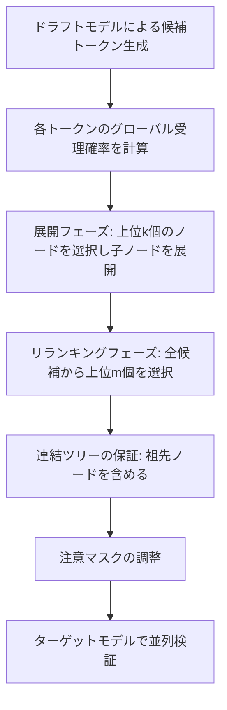

本記事は [EAGLE-2: Faster Inference of Language Models with Dynamic Draft Trees](https://arxiv.org/abs/2406.16858) の解説記事です。

## 論文概要（Abstract）

LLMの推論は自己回帰デコーディングの逐次的性質により計算コストが高く、投機的サンプリング（speculative sampling）がその有効な解決策として注目されている。著者らは、EAGLE-1の静的ドラフトツリーがドラフトトークンの受理率をツリー上の位置のみに依存すると暗黙に仮定している点を指摘し、実際には受理率が文脈にも依存することを発見した。この知見に基づき、EAGLE-2では文脈依存の動的ドラフトツリーを導入している。EAGLE-1のドラフトモデルが十分にキャリブレーション（calibration）されている——すなわち信頼度スコアが実際の受理率を小さな誤差で近似する——という性質を活用し、3系列のLLMと6タスクでの評価において3.05x〜4.26xの高速化比を達成し、EAGLE-1比で20〜40%の追加高速化が報告されている。

この記事は [Zenn記事: vLLM投機的デコーディング×PagedAttentionでLLM推論レイテンシを削減する](https://zenn.dev/0h_n0/articles/17b7c9dee74e06) の深掘りです。

## 情報源

- **arXiv ID**: 2406.16858
- **URL**: [https://arxiv.org/abs/2406.16858](https://arxiv.org/abs/2406.16858)
- **著者**: Yuhui Li, Fangyun Wei, Chao Zhang, Hongyang Zhang
- **発表年**: 2024
- **分野**: cs.CL, cs.LG

## 背景と動機（Background & Motivation）

自己回帰型LLMの推論では、トークンを1つずつ生成するため、モデルの計算能力に対してメモリ帯域幅がボトルネックとなる。投機的デコーディング（speculative decoding）は、軽量なドラフトモデルで複数のトークン候補を一括生成し、ターゲットモデル（本体LLM）で並列に検証することで、この問題を緩和する手法である。

EAGLE-1は特徴レベルでの自己回帰により高精度なドラフトモデルを構築し、投機的デコーディングの性能を大幅に向上させた。しかし、EAGLE-1を含む多くの手法は**静的なドラフトツリー**を使用している。静的ツリーでは、事前に固定された木構造に基づいてドラフトトークンを配置するため、すべての入力に対して同一の展開パターンを適用する。

著者らは、ドラフトトークンの受理率がツリー上の位置だけでなく**入力文脈にも強く依存する**ことを実験的に確認した。たとえば、同じツリー位置でも、コード生成タスクでは構文的に制約されたトークンの受理率が高くなる一方、自由記述タスクでは受理率が低下する。この観察から、文脈に応じてツリー構造を動的に調整することで、限られたドラフトトークン数をより効率的に配分できるという着想に至っている。

## 主要な貢献（Key Contributions）

- **文脈依存の動的ドラフトツリー**: 入力ごとにドラフトツリーの形状を適応的に変更し、受理確率の高いパスを優先的に展開する手法を提案
- **ドラフトモデルのキャリブレーション特性の活用**: EAGLE-1のドラフトモデルの信頼度スコアが実際の受理確率と高い相関を持つことを発見し、追加の学習なしで受理確率を推定する手法を実現
- **再学習不要な設計**: EAGLE-1のドラフトモデルの重みをそのまま再利用でき、追加の学習コストが不要
- **ロスレス高速化**: 生成テキストの分布を変更しないため、出力品質を維持したまま高速化を実現（EAGLE-1と同様に棄却サンプリングに基づく）

## 技術的詳細（Technical Details）

### ドラフトモデルのキャリブレーション

EAGLE-2の動的ツリー構築の前提となるのが、ドラフトモデルの**キャリブレーション特性**である。キャリブレーションとは、モデルが出力する確率（信頼度スコア）が実際の正解率と一致する度合いを指す。

著者らはEAGLE-1のドラフトモデルについて、信頼度スコア $c_i$（ドラフトモデルがトークン $t_i$ に割り当てる確率の最大値）と実際の受理率の間に高い相関があることを実験的に示している。これにより、ドラフトモデルの出力確率を受理確率の近似として使用可能となり、追加のLLMフォワードパスなしで各トークンの受理見込みを推定できる。

### 動的ドラフトツリーの構築アルゴリズム

動的ドラフトツリーの構築は、**展開（Expansion）フェーズ**と**リランキング（Reranking）フェーズ**の2段階で行われる。



**展開フェーズ**では、各ドラフトトークンに対して**グローバル受理確率** $V_i$ を計算する。$V_i$ はルートからトークン $t_i$ までのパス上にある全トークンの信頼度スコアの積として定義される:

$$
V_i = \prod_{t_j \in \text{Path}(\text{root}, t_i)} c_j
$$

ここで $c_j$ はドラフトモデルがトークン $t_j$ に割り当てた信頼度スコア（出力確率分布における最大値）である。$V_i$ は「ルートからトークン $t_i$ に至るパス全体が受理される確率」を近似する。

各深さにおいて、$V_i$ が上位 $k$ 個のノードを選択して子ノードを展開する。ここで $k$ はハイパーパラメータであり、著者らの実験では $k = 10$ が使用されている。

**リランキングフェーズ**では、展開フェーズで生成された全候補トークンの中から、$V_i$ の降順で上位 $m$ 個を選択して最終的なドラフトツリーを構成する。ここで $m$ は1回の検証ステップで使用するドラフトトークンの総数である。著者らの実験では、7B/8Bモデルで $m = 60$、13Bモデルで $m = 50$、70Bモデルで $m = 48$ が使用されている。

重要な制約として、選択されたトークン集合が**連結ツリー**を形成する必要がある。すなわち、あるトークンが選択された場合、そのルートまでの全祖先トークンも選択に含まれなければならない。著者らはこの制約を、選択されたトークンの祖先を追加することで保証している。

### 注意マスクの調整

動的ドラフトツリーでは、各トークンが自身の祖先ノードのみを参照できるように注意マスク（attention mask）を調整する。これにより、異なるブランチのトークンが互いに情報を共有することを防ぎ、独立した検証を可能にしている。

### EAGLE-1との差分

EAGLE-1からEAGLE-2への変更は**ツリー構造の決定方法のみ**であり、ドラフトモデル自体の構造や重みは変更されない。EAGLE-1では事前に固定されたツリーテンプレート（オフライン最適化で決定）を使用するのに対し、EAGLE-2ではドラフトモデルの推論時に得られる信頼度スコアを用いてツリーを動的に構築する。ドラフトモデルの推論は元々必要な計算であるため、動的ツリー構築のオーバーヘッドはソート操作（$O(n \log n)$ で $n$ は候補トークン数）のみとなり、実用上無視できる。

### Pythonによる動的ドラフトツリー構築の概念実装

```python
from dataclasses import dataclass, field
import heapq


@dataclass
class DraftNode:
    """動的ドラフトツリーのノードを表現するデータクラス。

    Attributes:
        token_id: トークンの語彙ID
        confidence: ドラフトモデルが出力した信頼度スコア（0〜1）
        global_acceptance_prob: ルートからこのノードまでの受理確率の積
        depth: ツリー上の深さ（ルート=0）
        parent: 親ノードへの参照
        children: 子ノードのリスト
    """
    token_id: int
    confidence: float
    global_acceptance_prob: float
    depth: int
    parent: "DraftNode | None" = None
    children: list["DraftNode"] = field(default_factory=list)


def build_dynamic_draft_tree(
    draft_model_outputs: list[list[tuple[int, float]]],
    max_draft_tokens: int = 60,
    top_k_expand: int = 10,
    max_depth: int = 6,
) -> list[DraftNode]:
    """文脈依存の動的ドラフトツリーを構築する。

    EAGLE-2の動的ツリー構築アルゴリズムの概念実装。
    各深さでグローバル受理確率の上位k個のノードを展開し、
    最終的に上位m個のトークンで連結ツリーを構成する。

    Args:
        draft_model_outputs: 各深さでのドラフトモデル出力。
            各要素は (token_id, confidence_score) のタプルのリスト。
        max_draft_tokens: 最終ドラフトツリーに含めるトークン数（m）。
        top_k_expand: 各深さで展開するノード数（k）。
        max_depth: ツリーの最大深さ。

    Returns:
        連結ツリーを構成するDraftNodeのリスト。
    """
    root = DraftNode(
        token_id=-1, confidence=1.0,
        global_acceptance_prob=1.0, depth=0,
    )
    all_nodes: list[DraftNode] = []

    # 展開フェーズ: 各深さで上位kノードを展開
    current_layer: list[DraftNode] = [root]
    for depth in range(1, max_depth + 1):
        if depth - 1 >= len(draft_model_outputs):
            break

        # 現在のレイヤーからグローバル受理確率の上位kノードを選択
        sorted_parents = sorted(
            current_layer,
            key=lambda n: n.global_acceptance_prob,
            reverse=True,
        )[:top_k_expand]

        next_layer: list[DraftNode] = []
        for parent_node in sorted_parents:
            for token_id, conf in draft_model_outputs[depth - 1]:
                child = DraftNode(
                    token_id=token_id,
                    confidence=conf,
                    global_acceptance_prob=parent_node.global_acceptance_prob * conf,
                    depth=depth,
                    parent=parent_node,
                )
                parent_node.children.append(child)
                next_layer.append(child)
                all_nodes.append(child)

        current_layer = next_layer

    # リランキングフェーズ: グローバル受理確率の上位m個を選択
    selected = heapq.nlargest(
        max_draft_tokens,
        all_nodes,
        key=lambda n: n.global_acceptance_prob,
    )

    # 連結ツリーの保証: 選択ノードの祖先を追加
    selected_set: set[int] = {id(n) for n in selected}
    for node in list(selected):
        ancestor = node.parent
        while ancestor is not None and ancestor is not root:
            if id(ancestor) not in selected_set:
                selected.append(ancestor)
                selected_set.add(id(ancestor))
            ancestor = ancestor.parent

    return selected
```

## 実装のポイント（Implementation）

EAGLE-2はvLLMにおいてサポートされている。vLLMでEAGLEベースの投機的デコーディングを有効化する場合、以下のような設定が可能である。

```python
from vllm import LLM, SamplingParams


def create_eagle_engine(
    base_model: str = "meta-llama/Meta-Llama-3-8B-Instruct",
    draft_model: str = "yuhuili/EAGLE-LLaMA3-Instruct-8B",
    num_speculative_tokens: int = 60,
) -> LLM:
    """EAGLE-2対応のvLLMエンジンを構築する。

    Args:
        base_model: ベースモデル（ターゲットモデル）のHuggingFace ID。
        draft_model: EAGLEドラフトモデルのHuggingFace ID。
        num_speculative_tokens: 1ステップで生成するドラフトトークン数。
            7B/8Bモデルでは60、70Bモデルでは48が推奨される。

    Returns:
        投機的デコーディングが有効化されたLLMインスタンス。
    """
    llm = LLM(
        model=base_model,
        speculative_model=draft_model,
        num_speculative_tokens=num_speculative_tokens,
        speculative_draft_tensor_parallel_size=1,
        tensor_parallel_size=1,
        gpu_memory_utilization=0.9,
    )
    return llm
```

ドラフトトークン数は、GPU VRAMとレイテンシのトレードオフに応じて調整する。著者らの実験設定では、7B/8Bモデルで60トークン、13Bモデルで50トークン、70Bモデルで48トークンが使用されている。ツリーの最大深さは全モデルで6、展開ノード数は10に設定されている。

## Production Deployment Guide

### AWS実装パターン

以下は2026年5月時点の料金に基づく概算である。実際の費用はリージョン・利用量・リザーブド契約の有無により変動する。

| 構成 | ユースケース | 主要コンポーネント | 月額概算 |
|---|---|---|---|
| **Small** | プロトタイプ・PoC（~100 req/日） | Lambda + Bedrock + DynamoDB | $150-400 |
| **Medium** | 社内ツール（~1,000 req/日） | ECS Fargate + GPU + S3 | $2,000-5,000 |
| **Large** | プロダクション（10,000+ req/日） | EKS + Karpenter + Spot GPU | $8,000-20,000 |

### Small構成: Lambda + Bedrock + DynamoDB

API GatewayでリクエストをLambdaに転送し、Bedrockの投機的デコーディング対応モデルを呼び出す構成。キャッシュとメタデータ管理にDynamoDBを使用する。自前でGPUを管理しないため運用負荷が低い。

```hcl
# Small構成: サーバーレスEAGLE-2推論パイプライン
module "api_gateway" {
  source = "./modules/api-gateway"

  name        = "eagle2-inference-api"
  description = "EAGLE-2 speculative decoding inference endpoint"

  cors_configuration = {
    allow_origins = ["https://app.example.com"]
    allow_methods = ["POST", "OPTIONS"]
    allow_headers = ["Content-Type", "Authorization"]
  }
}

module "inference_lambda" {
  source = "./modules/lambda"

  function_name = "eagle2-inference-handler"
  runtime       = "python3.12"
  memory_size   = 1024
  timeout       = 60
  handler       = "handler.lambda_handler"

  environment_variables = {
    BEDROCK_MODEL_ID    = "meta.llama3-8b-instruct-v1:0"
    DYNAMODB_TABLE_NAME = module.dynamodb.table_name
    MAX_TOKENS          = "2048"
  }
}

module "dynamodb" {
  source = "./modules/dynamodb"

  table_name   = "eagle2-inference-cache"
  billing_mode = "PAY_PER_REQUEST"
  hash_key     = "request_hash"
  range_key    = "created_at"

  ttl = {
    attribute_name = "ttl"
    enabled        = true
  }
}
```

### Large構成: EKS + Karpenter + Spot GPU

自前GPUクラスタでEAGLE-2を直接実行する構成。EKS上にvLLMをデプロイし、Karpenterによるオートスケーリングとg5/g6 Spotインスタンス（オンデマンド比60-70%割引）でコストを最適化する。vLLMの起動引数に `--speculative-model` と `--num-speculative-tokens 60` を指定してEAGLE-2を有効化する。HPAはGPU使用率70%とキュー深度10をトリガーとし、2-16レプリカでスケーリングする。

### セキュリティベストプラクティス

- **ネットワーク分離**: 推論エンドポイントはプライベートサブネットに配置し、API Gateway / ALB経由でのみアクセスを許可
- **IAM最小権限**: Lambda / ECSタスクロールにはBedrock InvokeModel、DynamoDB PutItem/GetItem等の必要最小限の権限のみ付与
- **モデルアクセス制御**: HuggingFaceモデルはS3にプライベートコピーを保持し、ECRイメージにバンドルしない
- **入力バリデーション**: プロンプトインジェクション対策として入力長制限（8192トークン）と禁止パターンフィルタを適用
- **暗号化**: S3バケットのSSE-KMS暗号化、DynamoDBのCMK暗号化、EKS Secrets のKMS暗号化を有効化
- **監査ログ**: CloudTrail + API Gateway アクセスログを有効化し、S3に90日間保持

### 運用・監視設定

- **レイテンシ監視**: P50/P95/P99レスポンスタイムをCloudWatchメトリクスで追跡。P99が目標値（例: 5秒）を超えた場合にアラート
- **GPU使用率**: NVIDIA DCGMエクスポーターでGPU使用率・メモリ使用率をPrometheusに送信
- **スループット**: トークン/秒（tokens/sec）をカスタムメトリクスとして記録し、投機的デコーディングの受理率（acceptance rate）も合わせて監視
- **ヘルスチェック**: vLLMの `/health` エンドポイントに対するALBヘルスチェック（10秒間隔、3回連続失敗でunhealthy）
- **ログ集約**: Fluent Bitでコンテナログを収集し、CloudWatch Logs Insightsで分析。エラー率の急増時にPagerDutyへ通知
- **スケーリングイベント**: Karpenterのノード追加/削除、HPAのレプリカ数変更をSlack通知

### コスト最適化チェックリスト

1. **Spotインスタンス活用**: g5/g6 Spotはオンデマンド比60-70%割引。Karpenter Consolidationで未使用ノード自動回収
2. **モデル量子化**: AWQ/GPTQ量子化でVRAM削減→小型GPUインスタンスで運用可能
3. **バッチ推論**: リアルタイム性不要ならSageMaker Batch Transformでコスト削減
4. **リザーブドインスタンス/Savings Plans**: 安定負荷にRI（30-40%割引）またはCompute Savings Plans適用
5. **時間帯別スケーリング**: 最小レプリカ数を夜間縮小（Karpenter/HPAスケジュール）
6. **キャッシュ戦略**: DynamoDB/ElastiCacheで同一プロンプト応答をキャッシュ
7. **モデルルーティング**: タスク難易度に応じて8B（高速）/70B（高精度）を振り分け
8. **Continuous Batching + Prefix Caching**: vLLMの標準機能でGPU利用効率向上
9. **ドラフトトークン数の動的調整**: 高負荷時はnum_speculative_tokensを削減しスループット優先
10. **NAT Gateway回避**: VPCエンドポイント（S3、DynamoDB、Bedrock）でデータ転送コスト削減
11. **GPU Memory Utilization**: 0.90-0.95に設定しOOM回避とVRAM最大活用を両立
12. **コンテナイメージ軽量化**: マルチステージビルドでpull時間とECRストレージを削減
13. **不要リソース自動削除**: AWS Nuke/Janitorで開発環境を定期クリーンアップ
14. **Cost Anomaly Detection**: 想定外の費用増加を早期検知
15. **タグ戦略**: プロジェクト・環境タグでCost Explorer分析粒度を確保
16. **S3 Intelligent-Tiering**: モデルアーティファクトのアクセス頻度に応じて自動階層化
17. **ログ保持期間最適化**: 詳細ログ7日、集約ログ90日で設定
18. **クロスAZ通信最小化**: 同一AZ内通信を優先しデータ転送料金を削減
19. **推論リクエスト優先度付け**: 高優先度→オンデマンド、低優先度→Spotのキューイング設計
20. **セキュリティスキャン自動化**: ECRイメージスキャンとIAM Access Analyzerの定期実行

## 実験結果（Results）

著者らは3系列のLLM（Vicuna、LLaMA-2-Chat、LLaMA-3-Instruct）と6タスク（MT-bench、HumanEval、GSM8K、Alpaca、CNN/DM、Natural Questions）で評価を行っている。

**MT-benchでの主要結果（論文Table/Figure より）**:

| モデル | EAGLE-1 | EAGLE-2 | 改善率 |
|---|---|---|---|
| Vicuna 7B (temp=0) | 2.90x | 3.62x | +25% |
| Vicuna 13B (temp=0) | 3.07x | 4.26x | +39% |
| LLaMA2-Chat 7B (temp=0) | 2.78x | 3.43x | +23% |
| LLaMA2-Chat 13B (temp=0) | 3.03x | 4.21x | +39% |

**タスク別の結果（Vicuna 13B, temp=0, 論文実験結果より）**:

| タスク | EAGLE-1 | EAGLE-2 | 改善率 |
|---|---|---|---|
| MT-bench | 3.07x | 4.26x | +39% |
| HumanEval | 3.58x | 4.96x | +39% |
| GSM8K | 3.08x | 4.22x | +37% |
| Alpaca | 3.03x | 4.25x | +40% |
| CNN/DM | 2.49x | 3.40x | +36% |
| Natural Questions | 2.42x | 3.13x | +29% |

HumanEvalやGSM8Kのような構造化されたタスクでは改善率が大きい。これは、コードや数式のように次トークンの予測が容易な文脈では、動的ツリーが高確率パスにドラフトトークンを集中させることで効率が向上するためと考えられる。

**Ablation Study（Vicuna 7B, MT-bench, temp=0, 論文実験結果より）**:

| 構成 | 高速化比 | 平均受理トークン数（τ） |
|---|---|---|
| グローバル受理確率なし + リランキングなし | 2.81x | 3.92 |
| グローバル受理確率なし（信頼度のみ） | 3.21x | 4.39 |
| リランキングなし | 3.48x | 4.86 |
| **EAGLE-2（完全版）** | **3.62x** | **4.98** |

グローバル受理確率によるノード選択とリランキングの両方が性能に寄与していることが確認されている。

## 実運用への応用（Practical Applications）

EAGLE-2は、Zenn記事で紹介したvLLMの投機的デコーディング機能と組み合わせて利用できる。vLLMはEAGLEファミリーのドラフトモデルをネイティブにサポートしており、`--speculative-model`オプションでEAGLEドラフトモデルを指定するだけで動的ツリー構築が有効化される。

チャットボットやコード補完のようなレイテンシが重要なアプリケーションでは、EAGLE-2による3〜4倍の高速化は応答時間を数秒から1秒以下に短縮する効果がある。特にコード生成タスク（HumanEval: 4.96x）では動的ツリーの恩恵が大きく、IDE統合型のコード補完ツールでの活用が有望である。

バッチ推論のシナリオでは、EAGLE-2のスループット向上は直接的なコスト削減につながる。同一のGPUリソースで3〜4倍の推論量を処理できるため、大規模なデータ処理パイプラインでのGPUコストを60〜75%削減できる可能性がある。

一方で、EAGLE-2はドラフトモデルの追加メモリが必要であり（ベースモデルの約5〜10%のVRAM）、メモリに制約のある環境では注意が必要である。

## 関連研究（Related Work）

- **EAGLE-1（2401.15077）**: 特徴レベルの自己回帰によるドラフトモデル。EAGLE-2のベースとなる手法であり、静的ドラフトツリーを使用
- **EAGLE-3（2503.01840）**: EAGLE-2をさらに発展させ、ドラフトモデルの学習効率を改善した後続研究
- **Medusa（2401.10774）**: ベースモデルに複数のデコーディングヘッドを追加し、並列にトークン候補を生成する手法。ドラフトモデル不要だが、追加ヘッドの学習が必要
- **Lookahead Decoding**: Jacobi反復に基づく並列デコーディング手法。学習不要だが高速化比はEAGLE系列に劣る
- **Standard Speculative Sampling**: 独立した小型言語モデルをドラフトモデルとして使用する古典的アプローチ。MT-benchでの高速化比は約1.93xと、EAGLE-2の4.26xに対して大きく劣る

## まとめと今後の展望

EAGLE-2は、EAGLE-1のドラフトモデルのキャリブレーション特性を活用し、文脈依存の動的ドラフトツリーを導入することで、追加の学習コストなしに20〜40%の高速化改善を達成している。ドラフトモデルの再学習が不要で、既存のEAGLE-1環境にドロップイン置換可能な点が実用上の大きな利点である。

今後の研究方向として、EAGLE-3への発展（ドラフトモデル学習の効率化）、より大規模なモデル（100B以上）への適用、マルチモーダルLLMへの拡張などが考えられる。動的ツリー構築の考え方は投機的デコーディング全般に応用可能であり、ドラフトモデルのキャリブレーションがその基盤技術となる。

## 参考文献

- **arXiv**: [https://arxiv.org/abs/2406.16858](https://arxiv.org/abs/2406.16858)
- **Related Zenn article**: [https://zenn.dev/0h_n0/articles/17b7c9dee74e06](https://zenn.dev/0h_n0/articles/17b7c9dee74e06)
- **EAGLE-1**: [https://arxiv.org/abs/2401.15077](https://arxiv.org/abs/2401.15077)
- **EAGLE-3**: [https://arxiv.org/abs/2503.01840](https://arxiv.org/abs/2503.01840)
- **Medusa**: [https://arxiv.org/abs/2401.10774](https://arxiv.org/abs/2401.10774)

---

:::message
この記事はAI（Claude Code）により自動生成されました。内容の正確性については複数の情報源で検証していますが、実際の利用時は公式ドキュメントもご確認ください。
:::
