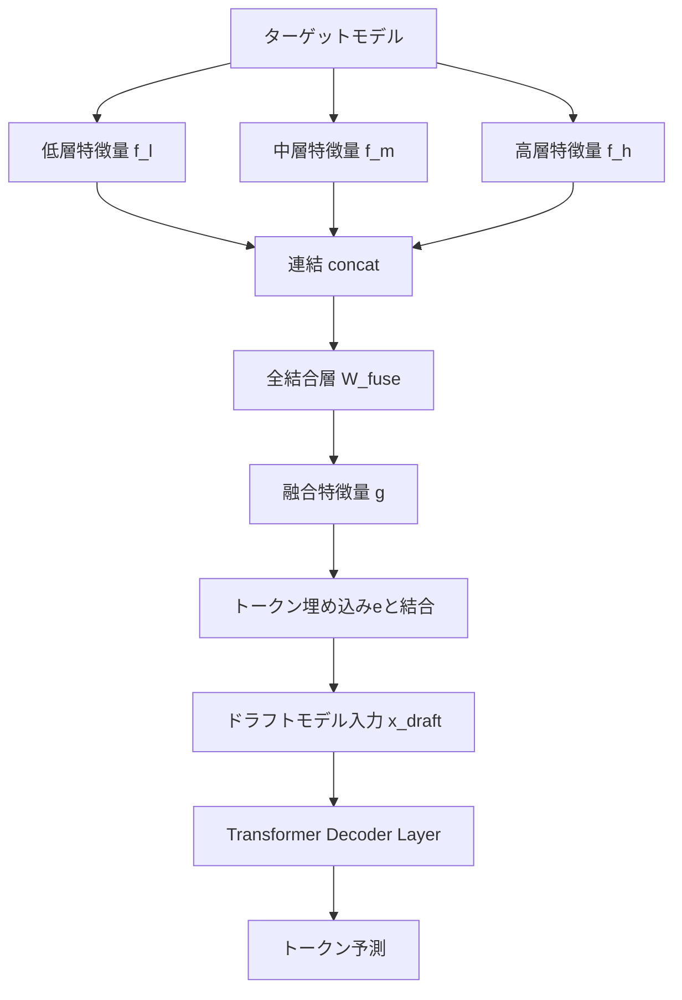

## 論文概要（Abstract）

EAGLE-3は、LLMの投機的デコーディング（Speculative Decoding）を高速化するための手法であり、従来のEAGLE/EAGLE-2が抱えていた特徴量予測の制約を解消する。著者らは、トップ層の特徴量のみに依存する従来手法に代わり、複数層の特徴量を融合する**Multi-Layer Feature Fusion**と、訓練時にテスト時の挙動をシミュレートする**Training-Time Test**技法を導入した。これにより、ドラフトモデルの予測精度が向上し、訓練データのスケールアップによる恩恵を受けられるようになった。実験では最大6.5倍の高速化を達成し、EAGLE-2に対して約1.4倍の追加高速化を実現している。

本記事は [arXiv:2503.01840](https://arxiv.org/abs/2503.01840) の解説記事です。

この記事は [Zenn記事: vLLM投機的デコーディング×PagedAttentionでLLM推論レイテンシを削減する](https://zenn.dev/0h_n0/articles/17b7c9dee74e06) の深掘りです。

## 情報源

- **arXiv ID**: 2503.01840
- **URL**: [arXiv:2503.01840](https://arxiv.org/abs/2503.01840)
- **著者**: Yuhui Li, Fangyun Wei, Chao Zhang, Hongyang Zhang
- **発表年**: 2025年3月（v1）、2025年4月改訂（v3）
- **分野**: Computer Science（cs.CL / cs.LG）

## 背景と動機（Background）

### EAGLEシリーズの進化と限界

LLMの自己回帰的な推論は逐次的にトークンを生成するため、計算リソースに対して低い利用効率となる。投機的デコーディングはドラフトモデルで複数のトークン候補を並列生成し、ターゲットモデルで一括検証することでこの問題を緩和する手法である。

EAGLEはターゲットモデルのトップ層特徴量を再利用して特徴量レベルの自己回帰を行い、バニラな投機的デコーディングを上回る性能を達成した。EAGLE-2ではツリー構造のドラフトと動的なツリー選択を導入し、さらなる改善を実現した。

しかし、著者らは訓練データをスケールアップしてもEAGLEの性能向上が限定的であることを発見した。この原因として、以下の2点を特定している：

1. **特徴量予測の制約**: EAGLEはトークン予測と特徴量予測の2つの損失関数で訓練されるが、特徴量予測損失がドラフトモデルの表現力を制限している
2. **エラー蓄積**: 予測された特徴量を次ステップの入力として使用する際、予測誤差が累積し、後続トークンの受理率が低下する

### なぜTraining-Time Testが必要か

従来のEAGLEでは訓練時にグラウンドトゥルースの特徴量を入力として使用するが、推論時には自身が予測した特徴量を使用する。この訓練と推論の分布の不一致（train-test mismatch）が、特にマルチステップの生成において深刻なエラー蓄積を引き起こす。EAGLE-3のTraining-Time Test技法はこの不一致を解消するために設計されている。

## 主要な貢献（Key Contributions）

1. **特徴量予測の廃止と直接トークン予測への移行**: 特徴量予測損失を除去し、ドラフトモデルの自由度を向上させた
2. **Multi-Layer Feature Fusion**: トップ層のみではなく、低層・中層・高層の特徴量を融合することで、より豊かな情報をドラフトモデルに供給する
3. **Training-Time Test技法**: 訓練時にドラフトモデル自身の予測出力をフィードバックすることで、train-test mismatchを解消する
4. **データスケーリングの恩恵**: 上記の改善により、訓練データ量の増加に比例した性能向上が可能になった

## 技術的詳細（Technical Details）

### Multi-Layer Feature Fusionの仕組み

EAGLEではターゲットモデルのトップ層特徴量のみを使用していたが、EAGLE-3では低層・中層・高層から特徴量を抽出し融合する。具体的には、ターゲットモデルの $$N$$ 層のうち、低層 $$l$$（例: 第8層）、中層 $$m$$（例: 第16層）、高層 $$h$$（例: 第32層）の隠れ状態を取得する。

各層の隠れ状態ベクトル $$\mathbf{f}_l, \mathbf{f}_m, \mathbf{f}_h \in \mathbb{R}^{d}$$ を連結し、全結合層で元の次元に圧縮する：

$$
\mathbf{g} = W_{\text{fuse}} \cdot [\mathbf{f}_l \| \mathbf{f}_m \| \mathbf{f}_h] + \mathbf{b}_{\text{fuse}}
$$

ここで $$W_{\text{fuse}} \in \mathbb{R}^{d \times 3d}$$ は融合重み行列、$$[\cdot \| \cdot]$$ は連結操作、$$\mathbf{g} \in \mathbb{R}^{d}$$ は融合後の特徴量ベクトルである。

融合された特徴量 $$\mathbf{g}$$ はトークン埋め込み $$\mathbf{e}$$ と結合され、ドラフトモデルの入力となる：

$$
\mathbf{x}_{\text{draft}} = W_{\text{proj}} \cdot [\mathbf{g} \| \mathbf{e}] + \mathbf{b}_{\text{proj}}
$$



### Training-Time Test技法の原理

Training-Time Testの核心は、訓練中にテスト時と同様のマルチステップ生成をシミュレートすることである。

従来のEAGLEの訓練では、各ステップでグラウンドトゥルースの特徴量を入力として使用する：

$$
\hat{t}_{i+1} = \text{DraftModel}(\mathbf{f}_{i}^{\text{GT}}, e_{i})
$$

ここで $$\mathbf{f}_{i}^{\text{GT}}$$ はグラウンドトゥルースの特徴量、$$e_{i}$$ はトークン埋め込み、$$\hat{t}_{i+1}$$ は予測トークンである。

EAGLE-3では、訓練中に「テストステップ」を挿入する。テストステップでは、ドラフトモデル自身の予測出力をフィードバックして次ステップの入力とする：

$$
\hat{t}_{i+1} = \text{DraftModel}(\mathbf{g}_{i}, e_{i})
$$

$$
\hat{t}_{i+2} = \text{DraftModel}(\mathbf{g}_{i+1}^{\text{pred}}, \hat{e}_{i+1})
$$

ここで $$\mathbf{g}_{i+1}^{\text{pred}}$$ はドラフトモデルが生成した特徴量から計算された融合特徴量、$$\hat{e}_{i+1}$$ は予測トークン $$\hat{t}_{i+1}$$ の埋め込みである。

この自己フィードバックループにより、ドラフトモデルは自身の予測誤差に対してロバストになるよう訓練される。

```python
import torch
import torch.nn as nn


class MultiLayerFeatureFusion(nn.Module):
    """複数層の隠れ状態を融合するモジュール。

    低層・中層・高層の特徴量を連結し、全結合層で元の次元に圧縮する。
    """

    def __init__(self, hidden_dim: int) -> None:
        """初期化。

        Args:
            hidden_dim: 各層の隠れ状態の次元数
        """
        super().__init__()
        self.fusion_layer = nn.Linear(hidden_dim * 3, hidden_dim)

    def forward(
        self,
        f_low: torch.Tensor,
        f_mid: torch.Tensor,
        f_high: torch.Tensor,
    ) -> torch.Tensor:
        """特徴量融合を実行。

        Args:
            f_low: 低層特徴量 (batch_size, seq_len, hidden_dim)
            f_mid: 中層特徴量 (batch_size, seq_len, hidden_dim)
            f_high: 高層特徴量 (batch_size, seq_len, hidden_dim)

        Returns:
            融合後の特徴量 (batch_size, seq_len, hidden_dim)
        """
        concatenated = torch.cat([f_low, f_mid, f_high], dim=-1)
        return self.fusion_layer(concatenated)
```

### ドラフトモデルアーキテクチャの変更点

EAGLE-3のドラフトモデルのコアは、EAGLEと同様に単一のTransformer Decoderレイヤーである。主な変更点は以下の通りである：

1. **入力**: トップ層特徴量のみ → Multi-Layer融合特徴量
2. **損失関数**: トークン予測損失 + 特徴量予測損失 → トークン予測損失のみ
3. **Self-Attention**: Training-Time Testステップ用に修正された注意マスクを使用
4. **ツリー深度**: EAGLE-2の深度6 → EAGLE-3の深度8

### Tree Acceptance Rate $$\tau$$ の定義

ツリー受理率 $$\tau$$ は、1回のドラフト生成・検証サイクルで受理されるトークンの平均数として定義される：

$$
\tau = \frac{1}{M} \sum_{j=1}^{M} n_{\text{accepted}}^{(j)}
$$

ここで $$M$$ は検証サイクルの総数、$$n_{\text{accepted}}^{(j)}$$ は $$j$$ 番目のサイクルで受理されたトークン数である。$$\tau$$ が大きいほど、ドラフトモデルの品質が高く、1サイクルあたりのスループットが向上する。

## 実装のポイント

### 訓練設定

著者らは以下の設定で訓練を行っている（論文Section 4.1より）：

- **オプティマイザ**: AdamW（$$\beta_1 = 0.9, \beta_2 = 0.95$$）
- **学習率**: $$5 \times 10^{-5}$$
- **勾配クリッピング**: 0.5
- **訓練データ**: ShareGPT（約68Kエントリ）+ UltraChat-200K（約464Kエントリ）
- **推論モデル向け追加データ**: OpenThoughts-114k-math

### SGLangでの利用

論文ではSGLang v0.4.4での評価が報告されている。SGLangフレームワークでEAGLE-3を使用する場合、投機的デコーディングの設定をモデルロード時に指定する。

```python
import sglang as sgl


def setup_eagle3_engine(
    target_model: str,
    draft_model: str,
    num_speculative_tokens: int = 64,
    tree_depth: int = 8,
) -> sgl.Engine:
    """SGLangでEAGLE-3推論エンジンを構成する。

    Args:
        target_model: ターゲットモデルのパスまたはHuggingFace ID
        draft_model: EAGLE-3ドラフトモデルのパス
        num_speculative_tokens: 投機的に生成するトークン数
        tree_depth: ドラフトツリーの深度（EAGLE-3デフォルト: 8）

    Returns:
        構成済みのSGLangエンジン
    """
    engine = sgl.Engine(
        model_path=target_model,
        speculative_model_path=draft_model,
        speculative_algorithm="eagle3",
        speculative_num_draft_tokens=num_speculative_tokens,
        speculative_eagle_topk=10,
        speculative_num_steps=tree_depth,
    )
    return engine
```

vLLMやTensorRT-LLMでもEAGLE-3のサポートが進んでおり、Zenn記事で解説されているvLLMの投機的デコーディング設定と組み合わせて利用できる。vLLMでは`--speculative-config`オプションでドラフトモデルを指定する形式となる。

## Production Deployment Guide

### AWS実装パターン

EAGLE-3をプロダクション環境にデプロイする際のAWS構成を、規模別に整理する。以下のコスト試算は2026年5月時点のAWS料金に基づく概算であり、実際の料金はリージョン・利用状況により変動する。

| 構成 | ユースケース | GPU | 月間コスト概算 | スループット |
|------|------------|-----|-------------|-------------|
| Small | PoC・社内ツール | g5.xlarge x1 | $800-1,200 | ~10 req/s |
| Medium | B2Bサービス | g5.12xlarge x2 | $8,000-12,000 | ~100 req/s |
| Large | マルチテナントSaaS | p4d.24xlarge x4 | $40,000-60,000 | ~500 req/s |

### Small構成: SageMaker Endpoint

SageMakerエンドポイントでEAGLE-3対応モデルをホストする構成である。

```hcl
# Terraform: Small構成 - SageMaker Endpoint
resource "aws_sagemaker_model" "eagle3" {
  name               = "eagle3-draft-model"
  execution_role_arn = aws_iam_role.sagemaker_role.arn

  primary_container {
    image          = "763104351884.dkr.ecr.us-east-1.amazonaws.com/djl-inference:0.31.0-lmi13.0.0-cu124"
    model_data_url = var.model_s3_uri
    environment = {
      OPTION_MODEL_ID          = "meta-llama/Llama-3.1-8B-Instruct"
      OPTION_SPECULATIVE_MODEL = "yuhuili/EAGLE3-LLaMA3.1-Instruct-8B"
      OPTION_TENSOR_PARALLEL   = "1"
      OPTION_MAX_MODEL_LEN     = "4096"
    }
  }
}

resource "aws_sagemaker_endpoint_configuration" "eagle3" {
  name = "eagle3-endpoint-config"

  production_variants {
    variant_name           = "primary"
    model_name             = aws_sagemaker_model.eagle3.name
    instance_type          = "ml.g5.xlarge"
    initial_instance_count = 1
  }
}

resource "aws_sagemaker_endpoint" "eagle3" {
  name                 = "eagle3-endpoint"
  endpoint_config_name = aws_sagemaker_endpoint_configuration.eagle3.name
}
```

### Large構成: EKS + Karpenter + Spot

EKSクラスタ上でKarpenterによるGPUノードの自動スケーリングとSpotインスタンスを活用する構成である。

```hcl
# Terraform: Large構成 - EKS + Karpenter + Spot
resource "aws_eks_cluster" "eagle3" {
  name     = "eagle3-inference-cluster"
  role_arn = aws_iam_role.eks_cluster.arn
  version  = "1.31"

  vpc_config {
    subnet_ids              = var.private_subnet_ids
    endpoint_private_access = true
    endpoint_public_access  = false
  }

  encryption_config {
    provider { key_arn = aws_kms_key.eks.arn }
    resources = ["secrets"]
  }
}

# Karpenter NodePool for GPU Spot instances
resource "kubectl_manifest" "karpenter_nodepool" {
  yaml_body = yamlencode({
    apiVersion = "karpenter.sh/v1"
    kind       = "NodePool"
    metadata   = { name = "gpu-spot" }
    spec = {
      template = {
        spec = {
          requirements = [
            { key = "node.kubernetes.io/instance-type", operator = "In", values = ["p4d.24xlarge", "p4de.24xlarge"] },
            { key = "karpenter.sh/capacity-type", operator = "In", values = ["spot", "on-demand"] },
          ]
          nodeClassRef = { name = "gpu-nodes" }
        }
      }
      limits     = { cpu = "384", "nvidia.com/gpu" = "32" }
      disruption = { consolidationPolicy = "WhenEmptyOrUnderutilized", consolidateAfter = "60s" }
    }
  })
}
```

### セキュリティベストプラクティス

1. **ネットワーク分離**: VPCプライベートサブネットにGPUノードを配置し、パブリックアクセスを遮断する
2. **IAM最小権限**: モデルアーティファクトへのS3読み取りとCloudWatch書き込みのみ許可する
3. **暗号化**: EKS Secrets（KMS）、S3バケット（SSE-KMS）、転送時TLS 1.3を適用する
4. **入力検証**: プロンプトインジェクション対策として、リクエスト最大長制限とサニタイズを実装する
5. **監査ログ**: CloudTrail + VPC Flow Logsで全APIコールとネットワーク通信を記録する

### 運用・監視設定

EAGLE-3推論サーバーの監視では、以下のメトリクスをCloudWatchに送信する：

- **TokensPerSecond**: 生成トークン/秒（スループット指標）
- **AcceptanceRate**: ドラフトツリー受理率 $$\tau$$（ドラフト品質指標）
- **DraftLatencyMs / VerifyLatencyMs**: ドラフト生成・検証レイテンシ
- **E2ELatencyMs**: エンドツーエンドレイテンシ（P99で500ms以下を閾値とする）
- **GPUMemoryUsedMB**: VRAM使用量（OOM防止）
- **QueueDepth**: リクエストキュー長（スケーリング判断指標）

### コスト最適化チェックリスト

**インフラストラクチャ**:
1. Spotインスタンスの活用（On-Demand比60-70%コスト削減）
2. Karpenterによるノード自動統合（未使用ノードの60秒以内回収）
3. SageMaker Serverless Inferenceの検討（低トラフィック時間帯）
4. Reserved Instances / Savings Plansの適用（1年/3年コミット）
5. リージョン選択の最適化（GPU料金はリージョンにより最大30%差）

**モデル最適化**:
6. ドラフトモデルの量子化（INT8/INT4）によるVRAM削減
7. ターゲットモデルのAWQ/GPTQ量子化との組み合わせ
8. バッチサイズの最適化（スループットとレイテンシのトレードオフ）
9. KVキャッシュのPagedAttention設定チューニング
10. 最大シーケンス長の適切な設定（過大なVRAM確保の防止）

**運用効率**:
11. オートスケーリングポリシーの最適化（GPU使用率 + キュー長ベース）
12. ヘルスチェック間隔の適切な設定（過剰なオーバーヘッド防止）
13. ログレベルの本番環境向け調整（WARNレベル以上のみ）
14. メトリクス収集間隔の適正化（10秒間隔推奨）
15. 不要なデバッグエンドポイントの無効化

**データ転送**:
16. 同一AZ内でのGPUノードとストレージの配置
17. VPCエンドポイントによるS3/ECRアクセス（NAT Gateway料金削減）
18. レスポンス圧縮（gzip）の有効化
19. CloudFrontによるAPIレスポンスキャッシュ（繰り返しクエリ）
20. 不要なCloudWatchメトリクスの削除（カスタムメトリクス課金対策）

**セキュリティ・コンプライアンス**:
21. CloudTrailログのS3 Glacier自動アーカイブ設定
22. VPC Flow LogsのサンプリングレートによるCloudWatch Logs Ingestion費削減
23. AWS Budgetsによるコストアラート設定（予算の80%/100%で通知）

## 実験結果（Experimental Results）

### バッチサイズ1での高速化

著者らは、チャットモデルと推論モデルの両方で評価を実施している。以下の結果は論文Table 1（Temperature=0）より引用したものである。

| モデル | EAGLE-2 | EAGLE-3 | 改善率 |
|--------|---------|---------|--------|
| Vicuna 13B | 4.22x | 5.51x | +30.6% |
| LLaMA-3.1-Instruct 8B | 3.23x | 4.44x | +37.5% |
| LLaMA-3.3-Instruct 70B | 2.85x | 4.12x | +44.6% |
| DeepSeek-R1-Distill-LLaMA 8B | 3.26x | 4.16x | +27.6% |

著者らは、EAGLE-3が全てのモデル・タスクにおいてEAGLE-2を上回ると報告している。特にLLaMA-3.3-Instruct 70Bでは44.6%の改善が見られ、大規模モデルほどMulti-Layer Feature Fusionの効果が顕著であることを示唆している。

### SGLangフレームワークでのスループット

論文Table 3（H100, MT-Bench）より、SGLangフレームワークでのスループット評価結果を示す：

| バッチサイズ | EAGLE | EAGLE-3 |
|-------------|-------|---------|
| 1 | 1.0x（ベースライン） | ~2.5x |
| 64 | 0.99x | 1.38x |

著者らは、バッチサイズ64でもEAGLE-3が38%のスループット改善を達成したと報告している。従来のEAGLEはバッチサイズ増加に伴いオーバーヘッドで高速化効果が減少していたが、EAGLE-3ではバッチ処理環境でも有効である。

### データスケーリングの効果

著者らによると、EAGLEではShareGPT（68K）にUltraChat-200K（464K）を追加しても受理率の改善が限定的であったのに対し、EAGLE-3ではデータ追加に比例して受理率が向上した。特徴量予測制約の除去により、ドラフトモデルの学習容量が解放されたことを示している。

## 実運用への応用

### vLLMとの組み合わせ

Zenn記事で解説されているvLLMのPagedAttentionとEAGLE-3を組み合わせることで、メモリ効率とデコーディング速度の両方を最適化できる。PagedAttentionによるKVキャッシュの効率的な管理は、EAGLE-3のツリー構造ドラフトが生成する多数のKVキャッシュエントリの管理に有効である。

### 推論モデルへの適用

DeepSeek-R1のような長い思考チェーンを生成する推論モデルでは、生成トークン数が数千に達することがある。EAGLE-3は各サイクルでより多くのトークンを受理するため、このような長文生成タスクで特に高い高速化効果を発揮する。論文のDeepSeek-R1-Distill-LLaMA 8Bでの結果（4.16x高速化）は、推論モデルへの適用可能性を実証している。

実運用への導入では、まず既存のvLLM/SGLang環境にEAGLE-3ドラフトモデルを追加して受理率とレイテンシを計測し、ツリー深度・投機トークン数・バッチサイズを調整した上で、カナリアデプロイメントで段階的にトラフィックを移行することが推奨される。

## 関連研究（Related Work）

**Medusa**（Cai et al., 2024）は複数の独立したヘッドでドラフトトークンを並列生成するが、トークン間の依存関係を考慮しないため受理率に限界がある。**SpecInfer**（Miao et al., 2024）はツリーベースの投機的推論で複数ドラフトモデルのカバレッジ向上を図っている。EAGLEシリーズは特徴量レベル自己回帰という独自路線で、**EAGLE**がトップ層特徴量再利用を、**EAGLE-2**が動的ツリー選択を導入した。EAGLE-3はMulti-Layer Feature FusionとTraining-Time Testにより表現力とデータスケーラビリティを同時に改善している。

## まとめと今後の展望

EAGLE-3は、特徴量予測制約の除去・Multi-Layer Feature Fusion・Training-Time Testの3つの改良により、最大6.5倍の高速化とEAGLE-2比約1.4倍の改善を達成した。ドラフトモデルは単一Transformerレイヤーのまま維持されており、層数・パラメータ数のスケーリングによるさらなる改善の余地がある。SGLangでのバッチサイズ64における38%スループット改善は大規模サービング環境での実用性を示しており、vLLM等での最適化実装の進展が期待される。

## 参考文献

- Li, Y., Wei, F., Zhang, C., & Zhang, H. (2025). EAGLE-3: Scaling up Inference Acceleration of LLMs via Training-Time Test. arXiv:2503.01840.
- Li, Y., Wei, F., Zhang, C., & Zhang, H. (2024). EAGLE: Speculative Sampling Requires Rethinking Feature Uncertainty. ICML 2024.
- Li, Y., Wei, F., Zhang, C., & Zhang, H. (2024). EAGLE-2: Faster Inference of Language Models with Dynamic Draft Trees. EMNLP 2024.
- Cai, T., Li, Y., Geng, Z., Peng, H., Lee, J.D., Chen, D., & Dao, T. (2024). Medusa: Simple LLM Inference Acceleration Framework with Multiple Decoding Heads. ICML 2024.
- Miao, X., Oliaro, G., Zhang, Z., Cheng, X., Wang, Z., Wong, R.Y.Y., Zhu, A., Yang, L., Shi, X., Shi, C., Chen, Z., Arfeen, D., Abhyankar, R., & Jia, Z. (2024). SpecInfer: Accelerating Large Language Model Serving with Tree-based Speculative Inference and Verification. ASPLOS 2024.
- Hu, Y., Wang, K., Zhang, X., Zhang, F., Li, C., Chen, H., & Zhang, J. (2024). SAM-Decoding: Speculative Decoding via Suffix Automaton. arXiv:2411.10666.
- Leviathan, Y., Kalman, M., & Matias, Y. (2023). Fast Inference from Transformers via Speculative Decoding. ICML 2023.
- Chen, C., Borgeaud, S., Irving, G., Lespiau, J.-B., Sifre, L., & Jumper, J. (2023). Accelerating Large Language Model Decoding with Speculative Sampling. arXiv:2302.01318.
