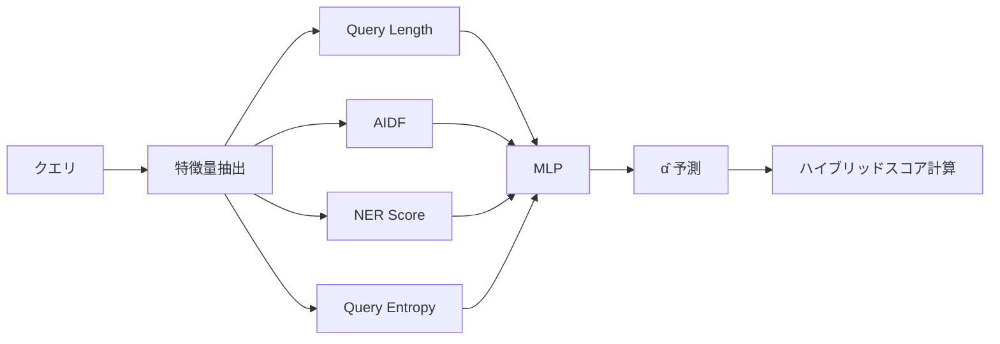

本記事は [DAT: Dynamic Alpha Tuning for Hybrid Retrieval in Retrieval-Augmented Generation](https://arxiv.org/abs/2503.23013) の解説記事です。

## 論文概要

ハイブリッド検索（dense検索とsparse検索の統合）は、Retrieval-Augmented Generation（RAG）パイプラインにおいて広く採用されている手法である。従来のハイブリッド検索では、denseスコアとsparseスコアの補間重み（alpha）を固定値で設定する。しかし、クエリの特性は多様であり、固定alphaではクエリごとの最適な検索戦略を捉えきれない。著者らは、クエリごとに動的にalphaを調整するDAT（Dynamic Alpha Tuning）を提案している。DATでは、特徴量ベースの分類器（FBC）とBERTベースの分類器（SBC）の2種類のアプローチを用い、BEIR全13データセットでnDCG@10の平均55.2を達成したと報告している。

この記事は [Zenn記事: BM25×ベクトル検索のクエリルーティング実装：動的重み調整でRAG検索精度を改善する](https://zenn.dev/0h_n0/articles/fa2dc30d90873c) の深掘りです。

## 情報源

- **arXiv ID**: 2503.23013
- **URL**: [https://arxiv.org/abs/2503.23013](https://arxiv.org/abs/2503.23013)
- **著者**: Hsin-Ling Hsu, Jengnan Tzeng
- **発表**: 2025年3月
- **分野**: cs.IR（情報検索）

## 背景と動機

RAGパイプラインにおいて、検索の質は生成結果の品質を直接左右する。検索手法は大きく2種類に分類される。BM25に代表されるsparse検索は、用語の正確な一致に強いが意味的な類似性を捉えにくい。一方、dense検索（DRAGON+、Contriever等）は意味的な類似性を捉えるが、固有名詞や専門用語の完全一致が必要な場面では精度が落ちることがある。

この2つの相補的な特性を活かすため、ハイブリッド検索が広く使われている。ハイブリッド検索のスコアは通常、以下のように計算される。

$$
S_{\text{hybrid}} = \alpha \cdot S_{\text{dense}} + (1 - \alpha) \cdot S_{\text{sparse}}
$$

ここで $\alpha$ はdense検索とsparse検索の重みを制御する補間パラメータである。

従来の実装では、この $\alpha$ を検証セット上でグリッドサーチして固定値（例: 0.5や0.7）を設定する。しかし、著者らはクエリの種類によって最適な $\alpha$ が大きく異なることを指摘している。例えば、「What is the capital of France?」のような事実検索クエリではsparse検索（BM25）が有効であり $\alpha$ を低くすべきだが、「climate change mitigation strategies」のような概念的クエリではdense検索が有効であり $\alpha$ を高くすべきである。固定alphaはこうしたクエリ間の差異を無視するため、検索精度の天井を生むという課題がある。

## 主要な貢献

著者らが報告しているDATの主要な貢献は以下の通りである。

1. **クエリ適応型の動的alpha調整**: クエリごとに最適なalphaを予測するフレームワークを提案。固定alphaの限界を克服するアプローチを示している
2. **2種類の分類器の設計と比較**: 軽量な特徴量ベース分類器（FBC）と高精度なBERT分類器（SBC）を提案し、精度とレイテンシのトレードオフを明示している
3. **包括的な評価**: BEIR全13データセットでの検索精度評価に加え、RAG QA精度の評価も実施。DAT-SBCが全13データセットで最高性能を達成したと報告している
4. **実用的なレイテンシ分析**: FBCの追加レイテンシが+1msと極めて小さく、SBCでも+48msに収まることを示している

## 技術的詳細

### Alpha離散化

DATの核心は、連続値の $\alpha \in [0, 1]$ を離散的なカテゴリに変換し、分類問題として扱う点にある。著者らは $K=5$ のカテゴリを採用している。

$$
\alpha \in \{0.0, 0.25, 0.5, 0.75, 1.0\}
$$

各訓練クエリ $q_i$ に対して、最適なalphaラベルは以下のように決定される。

$$
\alpha^*_i = \arg\max_{\alpha \in \{0.0, 0.25, 0.5, 0.75, 1.0\}} \text{nDCG@10}(q_i, \alpha)
$$

ここで $\text{nDCG@10}(q_i, \alpha)$ は、クエリ $q_i$ に対してalphaを $\alpha$ に設定したハイブリッド検索の上位10件における正規化割引累積利得である。この離散化により、alpha選択を5クラス分類問題に帰着させている。

著者らのablation studyでは、$K=5$（alpha間隔0.25）が $K=3$（間隔0.5）や $K=10$（間隔約0.11）よりも良好な結果を示したと報告されている。$K=10$ に増やしても性能向上は見られず、分類の難易度が上がることで逆効果になる可能性が示唆されている。

### スコアの正規化

denseスコアとsparseスコアはスケールが異なるため、統合前にmin-max正規化が施される。

$$
S_{\text{norm}} = \frac{S - S_{\min}}{S_{\max} - S_{\min}}
$$

ここで $S_{\min}$ と $S_{\max}$ は、当該クエリに対する検索結果セット内でのスコアの最小値と最大値である。この正規化は各検索手法のスコア分布を $[0, 1]$ に揃え、alphaによる重み付けを意味のあるものにするために不可欠な前処理である。

### FBC（Feature-based Classifier）

FBCは、クエリから抽出した4つの手作り特徴量を入力とするMLPベースの分類器である。

#### 4つの特徴量

**1. Query Length（クエリ長）**

クエリに含まれるトークン数。短いクエリ（1-3語）は固有名詞検索が多くsparse検索が有利な傾向があり、長いクエリは文脈情報が豊富でdense検索が有利になりやすい。

**2. Average IDF（平均逆文書頻度）**

$$
\text{AIDF}(q) = \frac{1}{|q|} \sum_{t \in q} \text{IDF}(t)
$$

ここで $|q|$ はクエリのトークン数、$\text{IDF}(t)$ はトークン $t$ の逆文書頻度である。AIDFが高いクエリは稀少な専門用語を含んでおり、BM25（sparse検索）のような用語一致ベースの手法が有利になる。著者らのablation studyでは、AIDFが最も重要な単一特徴量であったと報告されている。

**3. NER Score（固有表現スコア）**

クエリ中の固有表現（人名、地名、組織名等）の割合。固有表現が多いクエリは正確な文字列一致が重要であるため、sparse検索の優位性を示唆する。

**4. Query Entropy（クエリエントロピー）**

クエリ中のトークンの情報エントロピー。エントロピーが高いクエリは多様なトピックにまたがっており、semantic matchingが有効なdense検索が有利になる可能性がある。

#### MLPアーキテクチャ

FBCのネットワーク構成は以下の通りである。

- **入力層**: 4次元（上記4特徴量）
- **隠れ層**: 2層、ReLU活性化関数
- **正則化**: Dropout（率0.3）
- **出力層**: Softmax、5クラス（$K=5$ のalphaカテゴリに対応）



### SBC（Semantic-based Classifier）

SBCは、BERT-base-uncasedをfine-tuningした分類器である。クエリテキストをそのままBERTに入力し、`[CLS]`トークンの出力表現をLinear層でalphaカテゴリに分類する。

#### 訓練設定

- **ベースモデル**: BERT-base-uncased（110Mパラメータ）
- **最適化**: Adam、学習率 $2 \times 10^{-5}$
- **バッチサイズ**: 32
- **エポック数**: 10
- **出力**: 5クラス分類（$K=5$ のalphaカテゴリ）

SBCはクエリの意味的な表現を直接学習するため、FBCの手作り特徴量では捉えきれない複雑なパターンを捕捉できる。一方で、BERT推論のオーバーヘッドが加わるため、レイテンシが増加するというトレードオフがある。

著者らのablation studyでは、BERT-base（110M）がBERT-large（340M）やDistilBERT（66M）と比較して、精度とレイテンシのバランスが最良であったと報告されている。

### 予測alphaによるハイブリッドスコア計算

分類器が予測したalphaカテゴリ $\hat{\alpha}$ を用いて、最終的なハイブリッドスコアを計算する。

$$
S_{\text{hybrid}} = \hat{\alpha} \cdot S_{\text{dense}}^{\text{norm}} + (1 - \hat{\alpha}) \cdot S_{\text{sparse}}^{\text{norm}}
$$

ここで $S_{\text{dense}}^{\text{norm}}$ と $S_{\text{sparse}}^{\text{norm}}$ はそれぞれmin-max正規化済みのdenseスコアとsparseスコアである。

## 実装のポイント

### FBCの実装例

以下はFBC分類器のPython実装例である。論文の設計に基づくものであり、実際の著者らの実装とは異なる可能性がある点に留意されたい。

```python
import math
from collections import Counter
from dataclasses import dataclass

import torch
import torch.nn as nn


@dataclass
class QueryFeatures:
    """クエリから抽出した4特徴量"""
    query_length: float
    avg_idf: float
    ner_score: float
    query_entropy: float

    def to_tensor(self) -> torch.Tensor:
        """特徴量をテンソルに変換"""
        return torch.tensor([
            self.query_length,
            self.avg_idf,
            self.ner_score,
            self.query_entropy,
        ], dtype=torch.float32)


def compute_avg_idf(
    tokens: list[str],
    idf_dict: dict[str, float],
    default_idf: float = 10.0,
) -> float:
    """平均IDFを計算

    Args:
        tokens: クエリトークンのリスト
        idf_dict: トークンからIDF値への辞書
        default_idf: 未知トークンのデフォルトIDF値

    Returns:
        平均IDF値
    """
    if not tokens:
        return 0.0
    idf_sum = sum(idf_dict.get(t, default_idf) for t in tokens)
    return idf_sum / len(tokens)


def compute_query_entropy(tokens: list[str]) -> float:
    """クエリトークンの情報エントロピーを計算

    Args:
        tokens: クエリトークンのリスト

    Returns:
        エントロピー値（ビット単位）
    """
    if not tokens:
        return 0.0
    counts = Counter(tokens)
    total = len(tokens)
    entropy = 0.0
    for count in counts.values():
        p = count / total
        if p > 0:
            entropy -= p * math.log2(p)
    return entropy


class FeatureBasedClassifier(nn.Module):
    """FBC: 4特徴量からalphaカテゴリを予測するMLP

    Args:
        hidden_dim: 隠れ層の次元数
        n_classes: alphaカテゴリ数（デフォルト: 5）
        dropout: ドロップアウト率（デフォルト: 0.3）
    """
    def __init__(
        self,
        hidden_dim: int = 64,
        n_classes: int = 5,
        dropout: float = 0.3,
    ):
        super().__init__()
        self.net = nn.Sequential(
            nn.Linear(4, hidden_dim),
            nn.ReLU(),
            nn.Dropout(dropout),
            nn.Linear(hidden_dim, hidden_dim),
            nn.ReLU(),
            nn.Dropout(dropout),
            nn.Linear(hidden_dim, n_classes),
        )
        self.alpha_values = [0.0, 0.25, 0.5, 0.75, 1.0]

    def forward(self, x: torch.Tensor) -> torch.Tensor:
        """分類ロジットを返す

        Args:
            x: 特徴量テンソル (batch_size, 4)

        Returns:
            ロジット (batch_size, n_classes)
        """
        return self.net(x)

    def predict_alpha(self, x: torch.Tensor) -> float:
        """予測alphaを返す

        Args:
            x: 特徴量テンソル (1, 4)

        Returns:
            予測されたalpha値
        """
        self.eval()
        with torch.no_grad():
            logits = self.forward(x)
            idx = torch.argmax(logits, dim=-1).item()
        return self.alpha_values[idx]
```

### SBCの訓練コード

以下はSBC訓練のPyTorch実装例である。

```python
import torch
import torch.nn as nn
from torch.utils.data import DataLoader, Dataset
from transformers import BertModel, BertTokenizer


class AlphaDataset(Dataset):
    """alpha分類用データセット

    Args:
        queries: クエリ文字列のリスト
        labels: alphaカテゴリラベル (0-4) のリスト
        tokenizer: BERTトークナイザ
        max_length: 最大トークン長
    """
    def __init__(
        self,
        queries: list[str],
        labels: list[int],
        tokenizer: BertTokenizer,
        max_length: int = 64,
    ):
        self.queries = queries
        self.labels = labels
        self.tokenizer = tokenizer
        self.max_length = max_length

    def __len__(self) -> int:
        return len(self.queries)

    def __getitem__(self, idx: int) -> dict[str, torch.Tensor]:
        encoding = self.tokenizer(
            self.queries[idx],
            max_length=self.max_length,
            padding="max_length",
            truncation=True,
            return_tensors="pt",
        )
        return {
            "input_ids": encoding["input_ids"].squeeze(0),
            "attention_mask": encoding["attention_mask"].squeeze(0),
            "label": torch.tensor(self.labels[idx], dtype=torch.long),
        }


class SemanticBasedClassifier(nn.Module):
    """SBC: BERTベースのalpha分類器

    Args:
        n_classes: alphaカテゴリ数（デフォルト: 5）
        model_name: BERTモデル名
    """
    def __init__(
        self,
        n_classes: int = 5,
        model_name: str = "bert-base-uncased",
    ):
        super().__init__()
        self.bert = BertModel.from_pretrained(model_name)
        self.classifier = nn.Linear(self.bert.config.hidden_size, n_classes)
        self.alpha_values = [0.0, 0.25, 0.5, 0.75, 1.0]

    def forward(
        self,
        input_ids: torch.Tensor,
        attention_mask: torch.Tensor,
    ) -> torch.Tensor:
        """[CLS]表現から分類ロジットを計算

        Args:
            input_ids: トークンID (batch_size, seq_len)
            attention_mask: アテンションマスク (batch_size, seq_len)

        Returns:
            ロジット (batch_size, n_classes)
        """
        outputs = self.bert(
            input_ids=input_ids,
            attention_mask=attention_mask,
        )
        cls_output = outputs.last_hidden_state[:, 0, :]  # [CLS]トークン
        logits = self.classifier(cls_output)
        return logits


def train_sbc(
    model: SemanticBasedClassifier,
    train_loader: DataLoader,
    n_epochs: int = 10,
    lr: float = 2e-5,
    device: str = "cuda",
) -> SemanticBasedClassifier:
    """SBCを訓練する

    Args:
        model: SBCモデル
        train_loader: 訓練データローダ
        n_epochs: エポック数
        lr: 学習率
        device: デバイス

    Returns:
        訓練済みモデル
    """
    model = model.to(device)
    optimizer = torch.optim.Adam(model.parameters(), lr=lr)
    criterion = nn.CrossEntropyLoss()

    for epoch in range(n_epochs):
        model.train()
        total_loss = 0.0
        for batch in train_loader:
            input_ids = batch["input_ids"].to(device)
            attention_mask = batch["attention_mask"].to(device)
            labels = batch["label"].to(device)

            logits = model(input_ids, attention_mask)
            loss = criterion(logits, labels)

            optimizer.zero_grad()
            loss.backward()
            optimizer.step()
            total_loss += loss.item()

        avg_loss = total_loss / len(train_loader)
        print(f"Epoch {epoch + 1}/{n_epochs}, Loss: {avg_loss:.4f}")

    return model
```

### 実装上の注意点

- **IDF辞書の構築**: FBCのAIDF計算には、対象コーパスのIDF辞書が必要である。Elasticsearchのterm statisticsや、scikit-learnの`TfidfVectorizer`から取得できる
- **NERモデルの選択**: NER Scoreの計算にはNERモデルが必要である。spaCyやHugging Face Transformersのtoken classificationモデルが利用可能
- **ラベル生成のコスト**: 訓練データのalphaラベル生成には、各クエリについて5通りのalphaでnDCG@10を計算する必要がある。relevance labels（正解ラベル）が必要であり、既存のIR評価データセット（BEIR等）を活用するか、LLM-as-a-Judgeで生成する手法が考えられる
- **スコア正規化の範囲**: min-max正規化は検索結果セット単位（クエリ単位）で行う。全クエリのグローバルな統計ではない点に注意が必要である

## 実験結果

### BEIR nDCG@10 比較

著者らはBEIR（Benchmarking Information Retrieval）の13データセットで評価を実施している。以下は論文の実験結果に基づく平均nDCG@10のまとめである。

| 手法 | 平均 nDCG@10 |
|------|-------------|
| BM25 | 43.2 |
| DRAGON+ | 50.3 |
| Fixed Alpha (0.5) | 52.1 |
| Fixed Alpha (Best) | 53.4 |
| RRF (Reciprocal Rank Fusion) | 52.8 |
| **DAT-FBC** | **54.1** |
| **DAT-SBC** | **55.2** |

著者らの報告によると、DAT-SBCは固定alphaの最良値（53.4）に対して+1.8ポイント、RRF（52.8）に対して+2.4ポイントの改善を達成している。また、DAT-SBCは全13データセットにおいて最高性能を記録したとされている。

DAT-FBCも固定alpha（Best）を上回る54.1を達成しており、手作り特徴量のみでも動的alpha調整の有効性が確認されている。

### RAG QA精度

著者らは、検索結果をGPT-3.5-turboに入力してQAタスクの精度も評価している（Top-5文書を使用）。

| 手法 | QA精度 |
|------|--------|
| BM25 | 45.6 |
| DRAGON+ | 54.1 |
| Fixed Alpha | 56.4 |
| RRF | 55.5 |
| **DAT-FBC** | **57.8** |
| **DAT-SBC** | **59.8** |

DAT-SBCは固定alpha（56.4）に対して+3.4ポイントの改善を達成したと報告されている。検索精度の改善がRAG全体の生成品質に寄与することを示す結果である。

### レイテンシ比較

alpha予測に要する追加レイテンシの比較は以下の通りである。

| 手法 | 追加レイテンシ |
|------|--------------|
| DAT-FBC | +1 ms |
| DAT-SBC | +48 ms |
| HyDE（参考） | +283 ms |

FBCはMLP推論のみであるため+1msとほぼ無視できるレベルである。SBCはBERT推論が必要だが、HyDE（Hypothetical Document Embeddings、LLMによる仮説文書生成を要する手法）と比較すると約1/6のレイテンシに収まっている。

### Ablation Study

著者らが報告しているablation結果の要点は以下の通りである。

- **Kの値**: $K=5$ が最適。$K=10$ に増やしても性能向上は見られず、分類難易度の上昇が悪影響を与えると考えられている
- **特徴量の重要度**: AIDFが最も重要な単一特徴量。AIDFのみでも固定alphaを上回る性能が得られたとされている。これはクエリ中の稀少語の有無がsparse/dense検索の得手不得手に直結するためと解釈できる
- **BERTモデルサイズ**: BERT-base（110M）が精度とレイテンシのバランスで最良。BERT-large（340M）は精度向上が限定的な一方でレイテンシが大幅に増加し、DistilBERT（66M）は精度低下が無視できなかったと報告されている
- **訓練データ量**: 約5000クエリで性能が飽和。それ以上データを増やしても大きな改善は見られなかったとされている。これはalpha分類タスクの複雑度が比較的低いことを示唆している

## 実運用への応用

### Zenn記事のQueryRouterとの関連

関連するZenn記事「[BM25×ベクトル検索のクエリルーティング実装：動的重み調整でRAG検索精度を改善する](https://zenn.dev/0h_n0/articles/fa2dc30d90873c)」では、クエリの特性に応じてBM25とベクトル検索の重みを動的に調整するQueryRouterの実装が解説されている。DATはこのQueryRouterの学術的な裏付けとなる研究であり、特にFBCの4特徴量（Query Length、AIDF、NER Score、Query Entropy）は、QueryRouterの判定ロジックに直接組み込むことが可能である。

### FBC vs SBCの選択基準

実運用でDAT-FBCとDAT-SBCのどちらを選択すべきかは、以下の基準で判断できる。

**DAT-FBCが適するケース**:
- レイテンシ要件が厳しい場合（P99 < 50ms等）
- GPUリソースが限られる場合
- 検索リクエスト量が多い場合（高QPS環境）
- FBCの+1msは、既存パイプラインにほぼ影響を与えない

**DAT-SBCが適するケース**:
- 精度を最優先する場合（nDCG@10で+1.1の差は無視できない）
- GPU推論基盤が既にある場合（BERTの推論サーバがデプロイ済み等）
- バッチ処理でリアルタイム性を要求しない場合

### 導入時の考慮事項

- **ラベル生成**: DATの訓練にはrelevance labels（関連性ラベル）が必要である。自社ドメインのデータセットでは、ユーザーのクリックログやLLM-as-a-Judgeでの疑似ラベル生成が現実的な選択肢となる
- **ドメインシフト**: 著者らもlimitationsとして指摘している通り、BEIRで訓練したモデルをそのまま特定ドメイン（医療、法律等）に適用した場合、性能劣化の可能性がある。ドメイン固有のデータでfine-tuningすることが推奨される
- **alphaの連続化**: 本論文ではalphaを5段階に離散化しているが、回帰モデルで連続的なalphaを予測するアプローチも検討に値する。ただし、著者らは離散化の方が訓練の安定性が高いと述べている

## 関連研究

- **Reciprocal Rank Fusion (RRF)**: dense検索とsparse検索の結果をランクベースで統合する手法。スコアの正規化が不要という利点があるが、著者らの実験ではDATに劣る性能（52.8 vs 55.2）が報告されている
- **HyDE (Hypothetical Document Embeddings)**: LLMを用いてクエリから仮説文書を生成し、それをdense検索のクエリとして使用する手法。精度向上が期待できるがLLM推論のレイテンシ（+283ms）が大きい
- **DRAGON+**: meta-learnedなdual encoderによるdense検索モデル。DATではdense検索コンポーネントとしてDRAGON+を採用しており、BM25との相補性が確認されている
- **Learned Sparse Retrieval (SPLADE等)**: 学習可能なsparse表現を用いる手法。DATの枠組みではBM25の代わりにSPLADEを使用することも可能であり、今後の拡張方向として興味深い

## 制約と限界

著者らが論文中で指摘している制約は以下の通りである。

1. **離散化の粗さ**: alphaを5段階に離散化しているため、最適なalphaが0.3や0.6のような中間値の場合に精度が制限される可能性がある
2. **ラベル生成コスト**: 訓練データの最適alphaラベルを生成するためにrelevance labelsが必要であり、新規ドメインへの適用にはアノテーションコストが発生する
3. **ドメインシフト**: BEIRデータセットで訓練されたモデルが特定ドメインでどの程度汎化するかは未検証
4. **SBCのレイテンシ**: +48msはFBCに比べて大きく、リアルタイム性が求められるアプリケーションではボトルネックになり得る

## まとめと今後の展望

DATは、ハイブリッド検索における固定alpha問題に対して、クエリ適応型の動的alpha調整という実用的な解決策を提示した研究である。特にFBCの+1msという追加レイテンシで固定alphaを上回る精度を達成した点は、実運用への導入障壁を大幅に下げる成果といえる。

今後の研究方向としては、alphaの連続値予測（回帰アプローチ）、ドメイン適応の検証、dense/sparseそれぞれのリトリーバの更新（ColBERT v2やSPLADE等）との組み合わせ、さらにはdense/sparseの2種類を超えた多モーダル検索（コード検索、画像検索等）への拡張が考えられる。また、ラベル生成にLLM-as-a-Judgeを活用することで、アノテーションコストを低減する方向も実用上重要なテーマである。

## 参考文献

- **arXiv**: [https://arxiv.org/abs/2503.23013](https://arxiv.org/abs/2503.23013)
- **Related Zenn article**: [https://zenn.dev/0h_n0/articles/fa2dc30d90873c](https://zenn.dev/0h_n0/articles/fa2dc30d90873c)
