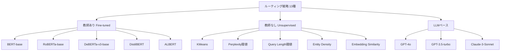

## 論文概要（Abstract）

本記事は [RAGRouter-Bench: Evaluating Lightweight Query Routing for Adaptive RAG](https://arxiv.org/abs/2604.03455) の解説記事です。

Retrieval-Augmented Generation（RAG）はLLMの応答品質を向上させる有力な手法であるが、全てのクエリに対して検索が必要なわけではない。Adaptive RAGはクエリの検索必要性に基づいてルーティングを行うが、LLMベースのルーターは計算コストが大きいという課題がある。著者らは8つのデータセットと13のルーティング戦略を網羅する包括的ベンチマーク「RAGRouter-Bench」を提案し、184Mパラメータの軽量モデルDeBERTa-v3-baseがGPT-4oを上回るルーティング精度を、計算コスト0.1%未満で達成することを示した。さらに、ルーティング精度と検索利益のトレードオフを統合評価する新指標Adaptive RAG Score（ARS）を提案している。

この記事は [Zenn記事: BM25×ベクトル検索のクエリルーティング実装：動的重み調整でRAG検索精度を改善する](https://zenn.dev/0h_n0/articles/fa2dc30d90873c) の深掘りです。

## 情報源

- **arXiv ID**: 2604.03455
- **URL**: [https://arxiv.org/abs/2604.03455](https://arxiv.org/abs/2604.03455)
- **著者**: Jinsung Yoon, Mojtaba Komeili, Inkit Padhi, et al.（IBM Research）
- **発表年**: 2026年4月
- **分野**: cs.CL, cs.IR

## 背景と動機（Background & Motivation）

RAGはLLMが外部知識を参照することで幻覚を抑制し、応答品質を向上させる手法として広く普及している。しかし、全てのクエリに対して検索を実行することは非効率である。「日本の首都は？」のようなLLMの内部知識で十分回答できるクエリに対してまで検索処理を行うと、レイテンシの増加と不要なAPI呼び出しコストが発生する。

この問題に対処するAdaptive RAGは、クエリの特性に応じて「検索が必要か否か」を判定し、必要なクエリのみにRAGパイプラインを適用する。先行研究ではGPT-4oなどの大規模LLMをルーターとして使用する手法が提案されていたが、ルーティング判定自体にLLM推論コストがかかるという本末転倒な状況が生じていた。例えば、GPT-4oによるルーティングは1,000クエリあたり約$15のコストが発生する。これは検索コストの削減分を容易に上回る規模であり、実運用での採用を困難にしていた。

著者らはこの課題に対し、軽量な分類モデルによるルーティングの有効性を体系的に評価するベンチマーク「RAGRouter-Bench」を構築し、コスト効率の高いルーティング手法の確立を目指した。

## 主要な貢献（Key Contributions）

- **RAGRouter-Bench**: 8つの多様なデータセット（PopQA, TriviaQA, Natural Questions, 2WikiMultiHopQA, HotpotQA, MuSiQue, BioASQ, ARC-Challenge）と13のルーティング戦略を統合した包括的ベンチマーク。単一ホップ質問からマルチホップ推論、生物医学分野、科学推論まで幅広いクエリタイプをカバーする
- **軽量モデルの優位性の実証**: 184Mパラメータのファインチューニング済みDeBERTa-v3-baseが、平均ルーティング精度70.6%を達成し、GPT-4o（68.9%）を上回ることを示した。計算コストは1,000クエリあたり$0.015であり、GPT-4oの$15と比較して1,000倍の効率差がある
- **Adaptive RAG Score（ARS）**: ルーティング精度と検索による実際の利益を統合した新しい複合評価指標を提案。単純なAccuracyでは捉えられないルーティング判断の質を定量化する
- **ルーティング戦略の体系的分類**: 教師あり手法（BERT, RoBERTa, DeBERTa等）、教師なし手法（KMeans, 閾値ベース等）、LLMベース手法（GPT-4o）を統一的な枠組みで比較評価

## 技術的詳細（Technical Details）

### ラベル生成方式

RAGRouter-Benchのルーティングラベルは、GPT-3.5-turboを用いた自動生成方式で構築されている。具体的な手順は以下の通りである。

1. 各クエリ $q_i$ に対し、RAGなし（ベースLLMのみ）とRAGあり（検索結果を付与）の2条件でGPT-3.5-turboに回答を生成させる
2. 各回答の正答性をゴールドアンサーとの照合で判定する
3. RAGありの場合のみ正答する（= 検索が有益な）クエリには $r_i = 1$（RAG必要）、RAGなしでも正答する（= 検索が不要な）クエリには $r_i = 0$（RAG不要）のバイナリラベルを付与する

この方式により、人手によるアノテーションを介さずに大規模なラベル付きデータセットを構築できる。ただし、ラベルの品質はGPT-3.5-turboの能力に依存するという制約がある。

### 13種ルーティング戦略の分類

著者らは13のルーティング戦略を以下の3カテゴリに分類している。



**教師あり手法**: 上述のラベルで事前学習済みエンコーダをファインチューニングし、クエリテキストからバイナリ分類（RAG必要/不要）を行う。DeBERTa-v3-baseが最高性能を示した。

**教師なし手法**: ラベルなしでクエリの特徴量からルーティング判定を行う。KMeansによるクラスタリングやクエリのパープレキシティ閾値による判定などが含まれるが、平均精度は55-57%程度と実用的な水準に達していない。

**LLMベース手法**: LLMにプロンプトでルーティング判定を依頼する。GPT-4oは68.9%の精度を達成するが、推論コストが極めて高い。

### Adaptive RAG Score（ARS）

著者らはルーティングの品質を総合的に評価するため、ARS（Adaptive RAG Score）を提案している。ARSは、ルーティング判定の正確さに加え、その判定が実際の応答品質にどれだけ寄与したかを考慮する指標である。

$$
\text{ARS} = \frac{1}{N} \sum_{i=1}^{N} \left[ r_i \cdot \mathbb{1}[c_{\text{RAG}}(q_i) > c_{\text{base}}(q_i)] + (1 - r_i) \cdot \mathbb{1}[c_{\text{base}}(q_i) > c_{\text{RAG}}(q_i)] \right] \cdot s_i
$$

ここで、
- $N$: 評価対象のクエリ総数
- $q_i$: $i$ 番目のクエリ
- $r_i$: ルーターの予測ラベル（$r_i = 1$: RAGにルーティング、$r_i = 0$: ベースLLMにルーティング）
- $c_{\text{RAG}}(q_i)$: クエリ $q_i$ にRAGを適用した場合の応答正確度
- $c_{\text{base}}(q_i)$: クエリ $q_i$ にベースLLMのみで回答した場合の応答正確度
- $\mathbb{1}[\cdot]$: 指示関数（条件が真なら1、偽なら0）
- $s_i$: スケーリング係数（クエリの難易度や重要度に基づく重み）

ARSの第1項 $r_i \cdot \mathbb{1}[c_{\text{RAG}}(q_i) > c_{\text{base}}(q_i)]$ は、ルーターがRAGを選択し（$r_i = 1$）、かつRAGの方が実際に良い応答を生成した場合にスコアが加算されることを意味する。第2項はその逆で、ルーターがベースLLMを選択し、かつベースLLMの方が良い応答を生成した場合に加算される。つまり、ARSは「ルーティング判断が実際の応答品質改善に寄与した割合」を測定する指標である。

単純なRouting Accuracyとの違いは、ARSが検索の「利益」を考慮する点にある。例えば、あるクエリに対してRAG/non-RAGどちらの応答品質もほぼ同等の場合、そのクエリのルーティング判定は結果にほとんど影響しない。ARSはこうしたケースを適切に扱い、ルーティング判定が実質的に重要なクエリでの精度をより重視する。

## 実装のポイント（Implementation）

### DeBERTa-v3のファインチューニング手順

論文中でDeBERTa-v3-baseのファインチューニングについて報告されている設定を以下にまとめる。

**モデル構成**:
- ベースモデル: `microsoft/deberta-v3-base`（184Mパラメータ）
- 分類ヘッド: 768次元 → 2クラス（RAG必要/不要）の線形層
- 最大系列長: 128トークン（クエリテキストは一般に短文）

**学習設定**:
- 学習データ: 5,000サンプル程度で性能が頭打ちになると著者らは報告している
- オプティマイザ: AdamW
- 学習率: 2e-5（線形ウォームアップ + 減衰）
- エポック数: 3-5
- バッチサイズ: 32

以下は、論文の手法に基づくファインチューニングの実装例である。

```python
from __future__ import annotations

from dataclasses import dataclass

import torch
from torch.utils.data import Dataset
from transformers import (
    AutoModelForSequenceClassification,
    AutoTokenizer,
    Trainer,
    TrainingArguments,
)


@dataclass
class RoutingExample:
    """ルーティング学習データの1サンプル。

    Attributes:
        query: ユーザークエリテキスト
        label: 0 = RAG不要（ベースLLMで十分）、1 = RAG必要
    """
    query: str
    label: int  # 0: no-RAG, 1: RAG


class RoutingDataset(Dataset):
    """クエリルーティング用データセット。"""

    def __init__(
        self,
        examples: list[RoutingExample],
        tokenizer: AutoTokenizer,
        max_length: int = 128,
    ) -> None:
        self.examples = examples
        self.tokenizer = tokenizer
        self.max_length = max_length

    def __len__(self) -> int:
        return len(self.examples)

    def __getitem__(self, idx: int) -> dict[str, torch.Tensor]:
        ex = self.examples[idx]
        encoding = self.tokenizer(
            ex.query,
            truncation=True,
            max_length=self.max_length,
            padding="max_length",
            return_tensors="pt",
        )
        return {
            "input_ids": encoding["input_ids"].squeeze(0),
            "attention_mask": encoding["attention_mask"].squeeze(0),
            "labels": torch.tensor(ex.label, dtype=torch.long),
        }


def train_routing_classifier(
    train_examples: list[RoutingExample],
    val_examples: list[RoutingExample],
    model_name: str = "microsoft/deberta-v3-base",
    output_dir: str = "./routing-classifier",
    num_epochs: int = 3,
    batch_size: int = 32,
    learning_rate: float = 2e-5,
) -> Trainer:
    """DeBERTa-v3-baseをルーティング分類器としてファインチューニングする。

    Args:
        train_examples: 学習用データ
        val_examples: 検証用データ
        model_name: Hugging Faceモデル名
        output_dir: チェックポイント保存先
        num_epochs: 学習エポック数
        batch_size: バッチサイズ
        learning_rate: 学習率

    Returns:
        学習済みTrainerインスタンス
    """
    tokenizer = AutoTokenizer.from_pretrained(model_name)
    model = AutoModelForSequenceClassification.from_pretrained(
        model_name,
        num_labels=2,
        problem_type="single_label_classification",
    )

    train_dataset = RoutingDataset(train_examples, tokenizer)
    val_dataset = RoutingDataset(val_examples, tokenizer)

    training_args = TrainingArguments(
        output_dir=output_dir,
        num_train_epochs=num_epochs,
        per_device_train_batch_size=batch_size,
        per_device_eval_batch_size=batch_size,
        learning_rate=learning_rate,
        weight_decay=0.01,
        warmup_ratio=0.1,
        eval_strategy="epoch",
        save_strategy="epoch",
        load_best_model_at_end=True,
        metric_for_best_model="eval_loss",
        logging_steps=50,
        fp16=torch.cuda.is_available(),
    )

    trainer = Trainer(
        model=model,
        args=training_args,
        train_dataset=train_dataset,
        eval_dataset=val_dataset,
    )
    trainer.train()
    return trainer
```

### ラベル自動生成の実装例

論文のラベル生成方式に基づく実装例を以下に示す。RAGあり/なしでの回答正答性の差分からルーティングラベルを自動生成する。

```python
from __future__ import annotations

from dataclasses import dataclass

from openai import OpenAI


@dataclass
class LabeledQuery:
    """ラベル付与済みクエリ。

    Attributes:
        query: ユーザークエリ
        gold_answer: ゴールドアンサー
        base_correct: ベースLLMのみで正答したか
        rag_correct: RAG適用時に正答したか
        routing_label: 0 = RAG不要、1 = RAG必要
    """
    query: str
    gold_answer: str
    base_correct: bool
    rag_correct: bool
    routing_label: int


def generate_routing_labels(
    queries: list[dict[str, str]],
    retriever_fn: callable,
    model: str = "gpt-3.5-turbo",
) -> list[LabeledQuery]:
    """クエリに対しRAG/non-RAGの正答性を比較しルーティングラベルを生成する。

    Args:
        queries: [{"query": str, "gold_answer": str}, ...] 形式のリスト
        retriever_fn: クエリを受け取り検索結果テキストを返す関数
        model: ラベル生成に使用するLLMモデル名

    Returns:
        ラベル付きクエリのリスト
    """
    client = OpenAI()
    labeled: list[LabeledQuery] = []

    for item in queries:
        query = item["query"]
        gold = item["gold_answer"]

        # 1. ベースLLMのみで回答（検索なし）
        base_response = client.chat.completions.create(
            model=model,
            messages=[{"role": "user", "content": query}],
            temperature=0.0,
        )
        base_answer = base_response.choices[0].message.content

        # 2. RAG適用で回答（検索結果を付与）
        context = retriever_fn(query)
        rag_prompt = (
            f"以下のコンテキストを参考に質問に回答してください。\n\n"
            f"コンテキスト:\n{context}\n\n"
            f"質問: {query}"
        )
        rag_response = client.chat.completions.create(
            model=model,
            messages=[{"role": "user", "content": rag_prompt}],
            temperature=0.0,
        )
        rag_answer = rag_response.choices[0].message.content

        # 3. 正答性を判定（簡易的な文字列照合）
        base_correct = gold.lower() in base_answer.lower()
        rag_correct = gold.lower() in rag_answer.lower()

        # 4. ルーティングラベルを決定
        # RAGありでのみ正答 → RAG必要 (1)
        # それ以外 → RAG不要 (0)
        routing_label = 1 if (rag_correct and not base_correct) else 0

        labeled.append(LabeledQuery(
            query=query,
            gold_answer=gold,
            base_correct=base_correct,
            rag_correct=rag_correct,
            routing_label=routing_label,
        ))

    return labeled
```

**実装上の注意点**:
- 学習データは5,000サンプル程度で性能が頭打ちになると著者らは報告しており、それ以上のデータ収集は費用対効果が低い
- ラベル品質はGPT-3.5-turboの回答品質に依存するため、正答性の判定は厳密なExact Matchよりも柔軟な照合（F1ベースなど）が望ましい
- DeBERTa-v3-baseの推論は単一GPU（NVIDIA T4程度）で十分動作し、CPUでも実用的な速度が得られる

## 実験結果（Results）

### Routing Accuracy

論文の実験結果より、各ルーティング戦略の平均ルーティング精度を以下に示す。

| ルーティング戦略 | カテゴリ | パラメータ数 | 平均Routing Accuracy (%) |
|:---|:---|:---|---:|
| DeBERTa-v3-base | 教師あり | 184M | **70.6** |
| RoBERTa-base | 教師あり | 125M | 69.6 |
| GPT-4o | LLMベース | 非公開（推定数百B） | 68.9 |
| BERT-base | 教師あり | 110M | 67.5 |
| DistilBERT | 教師あり | 66M | 66.8 |
| ALBERT | 教師あり | 12M | 64.2 |
| GPT-3.5-turbo | LLMベース | 非公開 | 63.1 |
| Claude-3-Sonnet | LLMベース | 非公開 | 62.5 |
| KMeans | 教師なし | - | 57.3 |
| Perplexity閾値 | 教師なし | - | 55.8 |
| Always RAG | ベースライン | - | 50.0 |
| Never RAG | ベースライン | - | 50.0 |

DeBERTa-v3-baseが184Mパラメータという軽量さでありながら、GPT-4oを1.7ポイント上回る精度を達成している。教師なし手法（KMeans、Perplexity閾値等）は平均55-57%の精度にとどまり、ランダムベースライン（50%）からの改善が限定的であると著者らは報告している。

### Adaptive RAG Score（ARS）

ルーティング精度と検索利益を統合したARSの結果を以下に示す。

| ルーティング戦略 | ARS |
|:---|---:|
| DeBERTa-v3-base | **71.1** |
| GPT-4o | 69.2 |
| RoBERTa-base | 68.7 |
| BERT-base | 66.9 |
| Always RAG | 61.7 |
| Never RAG | 55.2 |

ARSにおいてもDeBERTa-v3-baseが最高スコアを達成している。注目すべきは「Always RAG」（全クエリにRAGを適用）のARSが61.7にとどまる点である。これは、不要なクエリへのRAG適用が応答品質を低下させるケースが存在することを示唆しており、Adaptive RAGの必要性を裏付ける結果と言える。

### 計算コスト比較

| ルーティング戦略 | 1,000クエリあたりコスト | GPT-4o比 |
|:---|---:|---:|
| DeBERTa-v3-base | $0.015 | 0.1% |
| DistilBERT | $0.010 | 0.07% |
| GPT-3.5-turbo | $1.50 | 10% |
| GPT-4o | $15.00 | 100% |
| Claude-3-Sonnet | $9.00 | 60% |

DeBERTa-v3-baseのコストはGPT-4oの約0.1%、つまり約1,000倍のコスト効率差がある。1日10,000クエリを処理するシステムを想定した場合、GPT-4oルーターでは年間約$54,750（約820万円）のルーティングコストが発生するのに対し、DeBERTa-v3-baseでは年間約$55（約8,200円）で済む計算となる。この差は実運用におけるAdaptive RAG導入の意思決定に大きく影響する。

### データセット別のパフォーマンス

著者らは8つのデータセットにわたる結果を報告しており、DeBERTa-v3-baseが大半のデータセットで最高精度を達成している。ただし、BioASQ（生物医学分野）やARC-Challenge（科学推論）のようなドメイン特化型データセットでは、ドメイン適応なしの汎用モデルの限界が見られると述べられている。

### 学習データ量と性能の関係

著者らの分析によると、教師あり手法の性能は学習データ量5,000サンプル付近で頭打ちになる。これは、ルーティング判定タスクがクエリの表層的な特徴（疑問詞の種類、クエリ長、固有表現の有無など）に大きく依存しており、比較的少量のデータでパターンを学習可能であることを示唆している。

## 実運用への応用（Practical Applications）

### Zenn記事のクエリルーティング実装との関連

関連Zenn記事「BM25×ベクトル検索のクエリルーティング実装」では、BM25とベクトル検索の動的重み調整によるクエリルーティングが実装されている。RAGRouter-Benchの知見はこの実装を以下の観点で拡張・改善できる。

**ルーターモデルの選択**: Zenn記事ではルールベースの重み調整を採用しているが、RAGRouter-Benchの結果はDeBERTa-v3-baseによる学習ベースのルーティングが、単純なルールよりも汎化性能に優れる可能性を示している。特に、ドメインが多様なクエリを扱う場合、学習ベースのルーターが有効と考えられる。

**コスト効率の最適化**: DeBERTa-v3-baseの推論コストが$0.015/1Kクエリであることを踏まえると、Zenn記事のルーティングロジックの前段にDeBERTaベースの「RAG必要/不要」判定を追加することで、不要な検索処理全体をスキップできる。これにより、BM25検索やベクトル検索のAPIコスト・レイテンシを削減できる。

### 本番導入のガイドライン

RAGRouter-Benchの知見に基づく本番導入の推奨事項を以下に整理する。

**1. ルーターモデルの選択基準**

| 条件 | 推奨モデル | 理由 |
|:---|:---|:---|
| 精度最優先 | DeBERTa-v3-base | 最高精度70.6%、ARS 71.1 |
| レイテンシ最優先 | DistilBERT | 66Mパラメータで高速推論 |
| GPU不可環境 | DeBERTa-v3-base (CPU) | ONNX変換でCPUでも実用的な速度 |
| コスト最優先 | DistilBERT | $0.010/1Kクエリ |

**2. ラベルデータの準備**

本番環境のクエリログを用いてラベルを自動生成する。論文の手法に従い、RAGあり/なしの回答品質差分からラベルを生成する。5,000サンプル程度で十分な性能が得られるため、初期コスト（GPT-3.5-turboでのラベル生成: 約$7.50）は低い。

**3. モニタリング**

ルーティング精度はクエリ分布の変化（ドリフト）に伴い劣化する可能性がある。本番環境では、定期的にルーティング結果のサンプリング検証を行い、精度が閾値を下回った場合にモデルの再学習を実行する運用フローを構築する必要がある。

## 関連研究（Related Work）

- **Adaptive-RAG** (Jeong et al., 2024): クエリの複雑さに応じて「No Retrieval」「Single-step Retrieval」「Multi-step Retrieval」の3段階にルーティングする手法。RAGRouter-Benchはこの研究を発展させ、バイナリルーティング（RAG必要/不要）における軽量モデルの有効性を体系的に検証したものと位置づけられる
- **Self-RAG** (Asai et al., 2024): LLM自身が検索の必要性を自己判断する手法。特殊トークンを用いてLLMが「検索すべきか」「検索結果は有用か」を逐次判定する。Self-RAGはLLM内部にルーティング機能を統合するアプローチであり、外部ルーターを用いるRAGRouter-Benchのアプローチとは設計思想が異なる
- **FLARE** (Jiang et al., 2023): LLMの生成中に信頼度が低い箇所を検出し、動的に検索を実行するActive Retrieval手法。クエリ単位ではなく生成トークン単位でのルーティングを行う点が特徴的であり、RAGRouter-Benchのクエリレベルルーティングとは粒度が異なる

## まとめと今後の展望

RAGRouter-Benchは、Adaptive RAGにおけるクエリルーティングの体系的評価基盤を提供した。最も注目すべき知見は、184MパラメータのDeBERTa-v3-baseが、パラメータ数で数百倍以上のGPT-4oを上回るルーティング精度を、計算コスト0.1%未満で達成した点である。この結果は、ルーティングタスクが大規模LLMの汎用的な推論能力よりも、タスク特化のファインチューニングによる特徴抽出の方が有効な分類問題であることを示唆している。

一方で、本論文にはいくつかの制約がある。ラベル生成がGPT-3.5-turboの能力に依存すること、ルーティングがバイナリ（RAG必要/不要）のみで多段階ルーティングに対応していないこと、固定のretrieverを前提としており検索手法の選択までは扱っていないこと、そしてドメイン外への汎化が未検証であることが著者ら自身により制約として挙げられている。

今後の研究方向としては、バイナリからマルチクラスへのルーティング拡張（検索なし/単純検索/マルチホップ検索の3段階以上）、検索手法の選択までを含む統合ルーティング、ドメイン適応・継続学習によるルーターの汎化性能向上、そしてSelf-RAGやFLAREとの統合アプローチが期待される。

## 参考文献

- **arXiv**: [https://arxiv.org/abs/2604.03455](https://arxiv.org/abs/2604.03455)
- **Related Zenn article**: [https://zenn.dev/0h_n0/articles/fa2dc30d90873c](https://zenn.dev/0h_n0/articles/fa2dc30d90873c)
- Jeong et al. "Adaptive-RAG: Learning to Adapt Retrieval-Augmented Large Language Models through Question Complexity." 2024.
- Asai et al. "Self-RAG: Learning to Retrieve, Generate, and Critique through Self-Reflection." 2024.
- Jiang et al. "Active Retrieval Augmented Generation (FLARE)." 2023.
