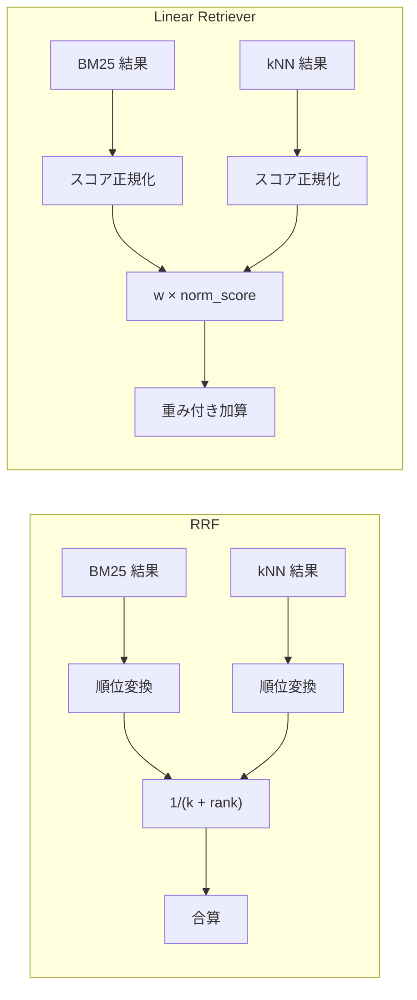
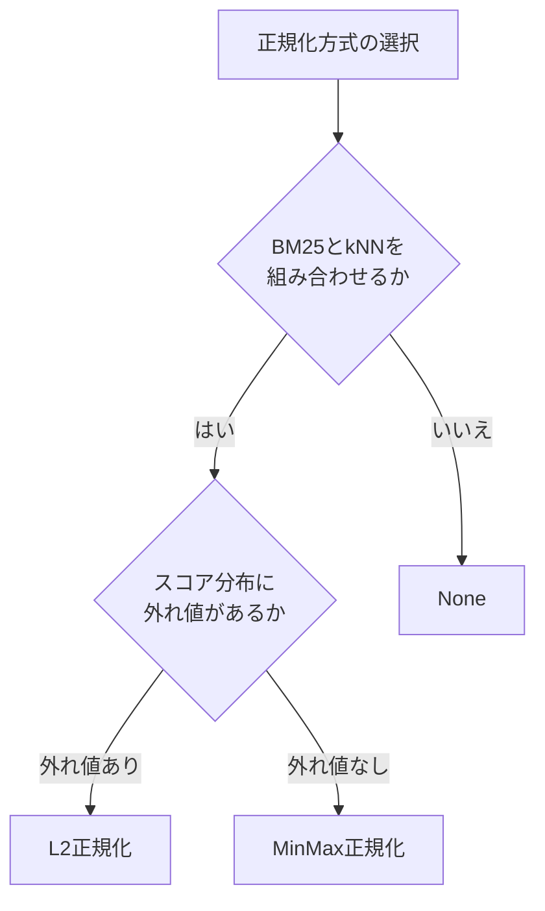

本記事は [Elasticsearch Labs: Linear Retriever for Hybrid Search](https://www.elastic.co/search-labs/blog/linear-retriever-hybrid-search) の解説記事です。

## ブログ概要（Summary）

Elastic社は、Elasticsearch 8.18および9.0以降で利用可能な新しいハイブリッド検索手法「Linear Retriever」を発表しました。従来のReciprocal Rank Fusion（RRF）が順位情報のみを使用してスコア差を無視するのに対し、Linear Retrieverは各検索手法の実スコアを正規化した上で重み付き線形和を計算します。これにより、BM25とベクトル検索のスコア差が最終ランキングに直接反映され、重みの調整による精度チューニングが容易になるとElastic社は述べています。

この記事は [Zenn記事: BM25×ベクトル検索のクエリルーティング実装：動的重み調整でRAG検索精度を改善する](https://zenn.dev/0h_n0/articles/fa2dc30d90873c) の深掘りです。

## 情報源

- **種別**: 企業テックブログ
- **URL**: [https://www.elastic.co/search-labs/blog/linear-retriever-hybrid-search](https://www.elastic.co/search-labs/blog/linear-retriever-hybrid-search)
- **組織**: Elasticsearch Labs（Elastic社）
- **著者**: Panagiotis Bailis
- **発表日**: 2025年5月28日

## 技術的背景（Technical Background）

ハイブリッド検索は、語彙ベースの検索（BM25）と意味ベースの検索（ベクトル検索/kNN）を組み合わせることで、単一手法では達成できない検索精度を実現する手法です。しかし、BM25とkNNのスコアを単純に合算することには根本的な問題があります。

### スコアスケール不一致問題

BM25のスコアは理論上上限がなく、ドキュメントの長さや単語頻度に応じて0.5から100以上まで大きく変動します。一方、kNNのコサイン類似度は$[0, 1]$の範囲に収まります。この非対称性のため、正規化なしの単純加算では一方のスコアが他方を圧倒してしまいます。

### RRFの限界

この問題に対する既存の解決策がReciprocal Rank Fusion（RRF）です。RRFは各検索手法の順位のみを使用し、スコアの絶対値を無視します。

$$
\text{score}_{\text{RRF}}(d) = \sum_{i=1}^{n} \frac{1}{k + \text{rank}_i(d)}
$$

ここで、
- $d$: 対象ドキュメント
- $n$: 検索手法の数
- $\text{rank}_i(d)$: 検索手法$i$におけるドキュメント$d$の順位
- $k$: 定数（通常60）

RRFは「スコア差がどれだけあっても、1位と2位の差は常に同じ」という性質を持ちます。これはスコアスケール不一致問題を回避できる反面、重要な情報を捨てています。例えば、BM25で1位のドキュメントのスコアが100、2位が0.5の場合、両者の「実質的な差」はRRFでは考慮されません。

## 実装アーキテクチャ（Architecture）

### Linear Retrieverの仕組み

Linear Retrieverは、各検索手法のスコアを正規化した上で、重み付き線形和で最終スコアを算出します。

$$
\text{score}_{\text{linear}}(d) = \sum_{i=1}^{n} w_i \times \text{normalize}(\text{score}_i(d))
$$

ここで、
- $w_i$: 検索手法$i$の重み（ユーザが指定）
- $\text{normalize}(\cdot)$: スコア正規化関数
- $\text{score}_i(d)$: 検索手法$i$におけるドキュメント$d$の生スコア

例えば、BM25の重みを0.7、kNNの重みを0.3に設定した場合、最終スコアは以下のように計算されます。

$$
\text{score}(d) = 0.7 \times \text{norm}(\text{BM25}(d)) + 0.3 \times \text{norm}(\text{kNN}(d))
$$

### RRFとLinear Retrieverの数式比較



両者の本質的な違いを具体例で示します。以下の3ドキュメントがあるとします。

| ドキュメント | kNN スコア | BM25 スコア |
|:---:|:---:|:---:|
| Doc A | 0.350 | 0.5 |
| Doc B | 0.349 | 100.0 |
| Doc C | 0.347 | 50.0 |

kNNスコアはほぼ同等ですが、BM25スコアには大きな差があります。

**RRFの場合**:

RRFは順位のみを使うため、kNNの1位(A)とBM25の1位(B)が拮抗します。BM25で100点のDoc Bと0.5点のDoc Aの差がランキングに十分反映されない可能性があります。

**Linear Retrieverの場合（MinMax正規化、BM25重み=0.7、kNN重み=0.3）**:

MinMax正規化後:

| ドキュメント | kNN正規化 | BM25正規化 |
|:---:|:---:|:---:|
| Doc A | 1.0 | 0.0 |
| Doc B | 0.67 | 1.0 |
| Doc C | 0.0 | 0.497 |

最終スコア:

| ドキュメント | 計算式 | 最終スコア |
|:---:|:---:|:---:|
| Doc B | $0.3 \times 0.67 + 0.7 \times 1.0$ | **0.901** |
| Doc C | $0.3 \times 0.0 + 0.7 \times 0.497$ | **0.348** |
| Doc A | $0.3 \times 1.0 + 0.7 \times 0.0$ | **0.300** |

Elastic社は、BM25スコアの大きな差（100 vs 0.5）がLinear Retrieverでは適切に反映され、Doc Bが明確に1位になると説明しています。RRFではこの情報が失われます。

### スコア正規化方式

Linear Retrieverでは3種類の正規化方式が利用可能です。

#### MinMax正規化

$$
\text{norm}(s) = \frac{s - s_{\min}}{s_{\max} - s_{\min}}
$$

ここで、$s_{\min}$と$s_{\max}$は現在のバッチ（`rank_window_size`内）のスコアの最小値と最大値です。全スコアが$[0, 1]$の範囲に収まり、直感的に理解しやすい正規化方式です。

#### L2正規化

$$
\text{norm}(s) = \frac{s}{\sqrt{\sum_{j=1}^{m} s_j^2}}
$$

ここで、$m$はバッチ内のドキュメント数です。スコアベクトル全体のL2ノルムで除算します。外れ値の影響を受けにくい特性がありますが、結果が$[0, 1]$に収まる保証はありません。

#### 正規化なし（None）

正規化を行わず、生スコアをそのまま使用します。BM25とkNNのスケール差がそのまま残るため、一方の検索手法が他方を圧倒するリスクがあります。Elastic社は、特別な理由がない限りMinMax正規化の使用を推奨しています。

| 正規化方式 | スコア範囲 | 特徴 | 推奨ケース |
|:---:|:---:|:---|:---|
| MinMax | $[0, 1]$ | 直感的、バッチ依存 | 一般的なハイブリッド検索 |
| L2 | $[0, \infty)$ | 外れ値耐性 | スコア分布が歪んでいる場合 |
| None | 元のスケール | スケール差が残る | 同一スケールの検索手法同士 |

## パフォーマンス最適化（Performance）

### rank_window_sizeの設定

`rank_window_size`は、各検索手法から取得する候補数の上限です。この値が正規化の品質に直接影響します。

**MinMax正規化との関係**:

MinMax正規化は$s_{\min}$と$s_{\max}$をバッチ内から算出するため、`rank_window_size`が小さすぎると以下の問題が生じます。

- $s_{\min}$と$s_{\max}$が真のスコア分布を代表しない
- 正規化結果がバッチごとに不安定になる
- 同じクエリでも`rank_window_size`の変更でランキングが変動する

```python
# rank_window_size が小さすぎる場合の不安定性の例
# window_size=5: min=80, max=100 → norm(90) = (90-80)/(100-80) = 0.5
# window_size=50: min=10, max=100 → norm(90) = (90-10)/(100-10) = 0.89
# 同じスコア90でも正規化結果が大きく異なる
```

Elastic社の設定例では`rank_window_size: 100`が使用されており、50から100件の範囲が安定した正規化のために適切と考えられます。

### 正規化方式の選択指針

正規化方式の選択は、検索要件とデータ特性に依存します。



### チューニング手順

Linear Retrieverの重み最適化は、以下の手順で行います。

1. **評価データの準備**: 約40件のクエリとその正解ドキュメントペアを用意する
2. **ベースライン測定**: 等重み（0.5/0.5）でnDCG@10を測定する
3. **グリッドサーチ**: BM25重みを0.0から1.0まで0.1刻みで変化させ、kNN重みを$1.0 - w_{\text{BM25}}$に設定してnDCG@10を測定する
4. **最適重みの選定**: nDCG@10が最大となる重みペアを採用する

```python
from elasticsearch import Elasticsearch
from typing import Any

def evaluate_linear_weights(
    es: Elasticsearch,
    index: str,
    queries: list[dict[str, Any]],
    bm25_weight: float,
    knn_weight: float,
    rank_window_size: int = 100,
) -> float:
    """Linear Retrieverの重みペアに対するnDCG@10を算出する。

    Args:
        es: Elasticsearchクライアント
        index: 対象インデックス名
        queries: クエリと正解ドキュメントのリスト
        bm25_weight: BM25の重み
        knn_weight: kNNの重み
        rank_window_size: 各検索手法の候補数上限

    Returns:
        nDCG@10スコア
    """
    total_ndcg = 0.0

    for query_data in queries:
        query_text = query_data["query"]
        query_vector = query_data["query_vector"]
        relevant_docs = set(query_data["relevant_doc_ids"])

        body = {
            "retriever": {
                "linear": {
                    "retrievers": [
                        {
                            "retriever": {
                                "standard": {
                                    "query": {
                                        "match": {"content": query_text}
                                    }
                                }
                            },
                            "weight": bm25_weight,
                        },
                        {
                            "retriever": {
                                "knn": {
                                    "field": "embedding",
                                    "query_vector": query_vector,
                                    "k": rank_window_size,
                                    "num_candidates": rank_window_size * 2,
                                }
                            },
                            "weight": knn_weight,
                        },
                    ],
                    "rank_window_size": rank_window_size,
                }
            },
            "size": 10,
        }

        result = es.search(index=index, body=body)
        hits = result["hits"]["hits"]

        # nDCG@10の計算
        dcg = 0.0
        for rank, hit in enumerate(hits):
            if hit["_id"] in relevant_docs:
                dcg += 1.0 / _log2(rank + 2)  # rank+2 because rank is 0-indexed

        # Ideal DCG
        idcg = sum(1.0 / _log2(i + 2) for i in range(min(len(relevant_docs), 10)))
        ndcg = dcg / idcg if idcg > 0 else 0.0
        total_ndcg += ndcg

    return total_ndcg / len(queries)


def _log2(x: float) -> float:
    """log2を計算する。"""
    import math
    return math.log2(x)


def grid_search_weights(
    es: Elasticsearch,
    index: str,
    queries: list[dict[str, Any]],
    step: float = 0.1,
) -> tuple[float, float, float]:
    """BM25とkNNの最適重みをグリッドサーチで探索する。

    Args:
        es: Elasticsearchクライアント
        index: 対象インデックス名
        queries: 評価用クエリリスト
        step: 重みの刻み幅

    Returns:
        (最適BM25重み, 最適kNN重み, 最高nDCG@10)のタプル
    """
    best_ndcg = 0.0
    best_bm25_w = 0.5
    best_knn_w = 0.5

    bm25_w = 0.0
    while bm25_w <= 1.0 + 1e-9:
        knn_w = 1.0 - bm25_w
        ndcg = evaluate_linear_weights(es, index, queries, bm25_w, knn_w)
        if ndcg > best_ndcg:
            best_ndcg = ndcg
            best_bm25_w = bm25_w
            best_knn_w = knn_w
        bm25_w += step

    return best_bm25_w, best_knn_w, best_ndcg
```

Elastic社は、約40件のアノテーション付きクエリがあればLinear Retrieverの重みを効果的に最適化できると述べています。

## 運用での学び（Production Lessons）

### MinMax正規化の不安定性

MinMax正規化は実運用で以下のハマりポイントがあります。

**バッチ依存性**: `rank_window_size`内のスコア分布が$s_{\min}$と$s_{\max}$を決定するため、候補ドキュメント群の構成が変わるとスコアが変動します。新しいドキュメントをインデックスに追加した場合、同じクエリでも正規化結果が変わる可能性があります。

**最小値と最大値の衝突**: 全ドキュメントのBM25スコアが同一（例: 全て完全一致）の場合、$s_{\max} - s_{\min} = 0$となり、ゼロ除算が発生します。Elasticsearchの実装ではこのケースをハンドリングしていますが、正規化スコアが全て同値になるため実質的にkNNのみの検索になります。

**対策**:

```python
def safe_minmax_normalize(scores: list[float]) -> list[float]:
    """MinMax正規化のエッジケースを考慮した実装。

    Args:
        scores: 正規化対象のスコアリスト

    Returns:
        正規化されたスコアのリスト
    """
    if not scores:
        return []

    s_min = min(scores)
    s_max = max(scores)
    range_val = s_max - s_min

    if range_val < 1e-10:
        # 全スコアが同一の場合、均等に扱う
        return [1.0 / len(scores)] * len(scores)

    return [(s - s_min) / range_val for s in scores]
```

### フォールバック設計

Linear Retrieverの重みチューニングが不十分な初期段階では、RRFへのフォールバックを用意しておくことが実践的です。

```python
from elasticsearch import Elasticsearch
from typing import Any

def hybrid_search_with_fallback(
    es: Elasticsearch,
    index: str,
    query_text: str,
    query_vector: list[float],
    bm25_weight: float = 0.7,
    knn_weight: float = 0.3,
    use_linear: bool = True,
    rank_window_size: int = 100,
) -> dict[str, Any]:
    """Linear RetrieverとRRFのフォールバック付きハイブリッド検索。

    Args:
        es: Elasticsearchクライアント
        index: 対象インデックス名
        query_text: テキストクエリ
        query_vector: クエリベクトル
        bm25_weight: BM25の重み（Linear使用時）
        knn_weight: kNNの重み（Linear使用時）
        use_linear: Trueの場合Linear Retriever、FalseでRRF
        rank_window_size: 候補数上限

    Returns:
        検索結果
    """
    if use_linear:
        retriever = {
            "linear": {
                "retrievers": [
                    {
                        "retriever": {
                            "standard": {
                                "query": {"match": {"content": query_text}}
                            }
                        },
                        "weight": bm25_weight,
                    },
                    {
                        "retriever": {
                            "knn": {
                                "field": "embedding",
                                "query_vector": query_vector,
                                "k": rank_window_size,
                                "num_candidates": rank_window_size * 2,
                            }
                        },
                        "weight": knn_weight,
                    },
                ],
                "rank_window_size": rank_window_size,
            }
        }
    else:
        retriever = {
            "rrf": {
                "retrievers": [
                    {
                        "standard": {
                            "query": {"match": {"content": query_text}}
                        }
                    },
                    {
                        "knn": {
                            "field": "embedding",
                            "query_vector": query_vector,
                            "k": rank_window_size,
                            "num_candidates": rank_window_size * 2,
                        }
                    },
                ],
                "rank_window_size": rank_window_size,
            }
        }

    return es.search(index=index, body={"retriever": retriever, "size": 10})
```

### RRFとLinear Retrieverの使い分け

| 観点 | RRF | Linear Retriever |
|:---|:---|:---|
| **導入の容易さ** | 高い（パラメータ不要） | 中程度（重み調整が必要） |
| **精度チューニング** | 困難（$k$のみ） | 容易（重みで直接制御） |
| **アノテーションデータ** | 不要 | 約40クエリ推奨 |
| **スコア差の考慮** | なし（順位のみ） | あり（実スコア反映） |
| **クエリルーティングとの相性** | 低い | 高い（重みが直接反映） |
| **推奨ケース** | PoC・MVPフェーズ | 精度重視の本番環境 |

Elastic社は、ラベルデータがない初期段階ではRRFが「plug-and-play」として有効であり、評価データが揃った段階でLinear Retrieverに移行することを推奨しています。

## 学術研究との関連（Academic Connection）

### スコア融合に関する先行研究

ハイブリッド検索におけるスコア融合は、情報検索分野で長年研究されてきたテーマです。

**CombSUM / CombMNZ**: 複数検索エンジンのスコアを合算する古典的手法であり、Linear Retrieverの重み付き線形和はCombSUMの拡張と位置づけられます。Fox & Shaw (1994)が提案したCombMNZは、複数の検索手法で共通してヒットしたドキュメントにボーナスを与える点でLinear Retrieverと異なります。

**Learning to Rank (LtR)**: 教師あり学習で最適な重みを学習する手法群があります。Linear Retrieverのグリッドサーチは最も単純なLtRアプローチと見なせますが、特徴量がスコア2次元に限定されるため、勾配ブースティング等のLtRモデルほどの表現力はありません。

**RAGRouterとの関連**: 関連するZenn記事で解説しているクエリルーティングでは、クエリの種類に応じてBM25とベクトル検索の重みを動的に変更します。Linear Retrieverの重みパラメータはこの動的重み調整と直接対応しており、クエリごとに異なるLinear Retriever設定を適用するアーキテクチャが考えられます。

**DAT (Document-Aware Training)**: ドキュメントの特性に応じて検索手法の重みを動的に調整する研究もあり、Linear Retrieverの静的重みを超えた発展方向として注目されます。

## Elasticsearch設定コード例

### Linear Retriever DSL

Elasticsearchに対してLinear Retrieverを使用するDSLクエリの全体像を示します。

```json
{
  "retriever": {
    "linear": {
      "retrievers": [
        {
          "retriever": {
            "standard": {
              "query": {
                "match": {
                  "content": "RAG検索 ハイブリッド"
                }
              }
            }
          },
          "weight": 0.7
        },
        {
          "retriever": {
            "knn": {
              "field": "embedding",
              "query_vector": [0.12, -0.34, 0.56],
              "k": 100,
              "num_candidates": 200
            }
          },
          "weight": 0.3
        }
      ],
      "rank_window_size": 100
    }
  },
  "size": 10,
  "_source": ["title", "content", "url"]
}
```

各パラメータの意味は以下の通りです。

- `retrievers[].weight`: 各検索手法の重み。合計が1.0である必要はないが、解釈のしやすさから合計1.0を推奨する
- `rank_window_size`: 各検索手法から取得する候補数の上限。この候補群に対して正規化・重み付けが適用される
- `k`: kNN検索で最終的に返す近傍数
- `num_candidates`: kNN検索で近似最近傍探索が内部的に探索する候補数。$k$より大きい値を設定する

### Python elasticsearch-py実装

実際のアプリケーションでLinear Retrieverを使用する完全な実装例を示します。

```python
from elasticsearch import Elasticsearch
from typing import Any

# SentenceTransformerによるエンベディング生成
# pip install sentence-transformers elasticsearch
from sentence_transformers import SentenceTransformer


class LinearRetrieverClient:
    """Linear Retrieverを使用したハイブリッド検索クライアント。

    Attributes:
        es: Elasticsearchクライアント
        model: エンベディングモデル
        index_name: 対象インデックス名
    """

    def __init__(
        self,
        es_url: str,
        index_name: str,
        model_name: str = "intfloat/multilingual-e5-large",
    ) -> None:
        self.es = Elasticsearch(es_url)
        self.model = SentenceTransformer(model_name)
        self.index_name = index_name

    def create_index(self) -> None:
        """ハイブリッド検索用インデックスを作成する。"""
        mappings = {
            "mappings": {
                "properties": {
                    "title": {"type": "text", "analyzer": "kuromoji"},
                    "content": {"type": "text", "analyzer": "kuromoji"},
                    "embedding": {
                        "type": "dense_vector",
                        "dims": 1024,
                        "index": True,
                        "similarity": "cosine",
                    },
                    "url": {"type": "keyword"},
                    "created_at": {"type": "date"},
                }
            },
            "settings": {
                "analysis": {
                    "analyzer": {
                        "kuromoji": {
                            "type": "custom",
                            "tokenizer": "kuromoji_tokenizer",
                            "filter": [
                                "kuromoji_baseform",
                                "kuromoji_part_of_speech",
                                "cjk_width",
                                "lowercase",
                            ],
                        }
                    }
                }
            },
        }
        self.es.indices.create(index=self.index_name, body=mappings)

    def search(
        self,
        query: str,
        bm25_weight: float = 0.7,
        knn_weight: float = 0.3,
        rank_window_size: int = 100,
        size: int = 10,
    ) -> list[dict[str, Any]]:
        """Linear Retrieverによるハイブリッド検索を実行する。

        Args:
            query: 検索クエリ文字列
            bm25_weight: BM25スコアの重み
            knn_weight: kNNスコアの重み
            rank_window_size: 各検索手法の候補数上限
            size: 返却件数

        Returns:
            検索結果のリスト
        """
        query_vector = self.model.encode(f"query: {query}").tolist()

        body = {
            "retriever": {
                "linear": {
                    "retrievers": [
                        {
                            "retriever": {
                                "standard": {
                                    "query": {
                                        "match": {"content": query}
                                    }
                                }
                            },
                            "weight": bm25_weight,
                        },
                        {
                            "retriever": {
                                "knn": {
                                    "field": "embedding",
                                    "query_vector": query_vector,
                                    "k": rank_window_size,
                                    "num_candidates": rank_window_size * 2,
                                }
                            },
                            "weight": knn_weight,
                        },
                    ],
                    "rank_window_size": rank_window_size,
                }
            },
            "size": size,
            "_source": ["title", "content", "url"],
        }

        result = self.es.search(index=self.index_name, body=body)

        return [
            {
                "id": hit["_id"],
                "score": hit["_score"],
                "title": hit["_source"].get("title", ""),
                "content": hit["_source"].get("content", "")[:200],
                "url": hit["_source"].get("url", ""),
            }
            for hit in result["hits"]["hits"]
        ]


# 使用例
if __name__ == "__main__":
    client = LinearRetrieverClient(
        es_url="http://localhost:9200",
        index_name="articles",
    )

    # BM25重視の検索（キーワードマッチ重視）
    results_keyword = client.search(
        query="Elasticsearch ハイブリッド検索",
        bm25_weight=0.8,
        knn_weight=0.2,
    )

    # 意味検索重視の検索
    results_semantic = client.search(
        query="文書の類似度を測る方法",
        bm25_weight=0.3,
        knn_weight=0.7,
    )
```

### クエリルーティングとの統合

関連するZenn記事で解説されているクエリルーティングと組み合わせることで、クエリの種類に応じた動的な重み調整が可能になります。

```python
from dataclasses import dataclass


@dataclass(frozen=True)
class QueryWeights:
    """クエリルーティングで決定された重みペア。

    Attributes:
        bm25: BM25の重み
        knn: kNNの重み
    """
    bm25: float
    knn: float


def route_query(query: str) -> QueryWeights:
    """クエリの種類に応じて最適な重みペアを返す。

    固有名詞や技術用語を含むクエリはBM25重視、
    抽象的な概念クエリはkNN重視とする。

    Args:
        query: ユーザの検索クエリ

    Returns:
        BM25とkNNの重みペア
    """
    # 簡易的な分類ロジック（本番ではMLモデルを使用）
    keyword_indicators = [
        '"',       # フレーズ検索
        "エラー",   # エラーメッセージ検索
        "version", # バージョン指定
    ]

    is_keyword_query = any(
        indicator in query for indicator in keyword_indicators
    )

    if is_keyword_query:
        return QueryWeights(bm25=0.8, knn=0.2)
    return QueryWeights(bm25=0.4, knn=0.6)


def search_with_routing(
    client: LinearRetrieverClient,
    query: str,
) -> list[dict[str, Any]]:
    """クエリルーティング付きハイブリッド検索。

    Args:
        client: LinearRetrieverClient
        query: 検索クエリ

    Returns:
        検索結果のリスト
    """
    weights = route_query(query)
    return client.search(
        query=query,
        bm25_weight=weights.bm25,
        knn_weight=weights.knn,
    )
```

Linear Retrieverでは重みが最終スコアに直接反映されるため、クエリルーティングで決定した重みの意図がそのまま検索結果に表れます。RRFでは順位ベースの融合であるため、重みを変えても期待通りの効果が得られにくいという制約があります。

## まとめと実践への示唆

Elastic社が発表したLinear Retrieverは、ハイブリッド検索におけるスコア融合の制御性を向上させる手法です。以下に要点を整理します。

**Linear Retrieverの利点**:
- 各検索手法の実スコアを保持したまま重み付き線形和を計算するため、スコア差がランキングに反映される
- 重みパラメータにより、BM25とベクトル検索の寄与度を直感的に制御できる
- クエリルーティングとの組み合わせが容易で、クエリ種別ごとの動的重み調整が可能

**制約と注意点**:
- MinMax正規化は`rank_window_size`内のスコア分布に依存するため、候補数が少ないと正規化が不安定になる
- 最適な重みを決定するには約40件のアノテーション付き評価データが必要
- Elasticsearch 8.18以降が必要であり、それ以前のバージョンでは利用できない

**実践的な導入指針**:
1. 初期フェーズではRRFで迅速にハイブリッド検索を立ち上げる
2. 評価データが蓄積された段階でLinear Retrieverに移行する
3. `rank_window_size`は50以上（推奨100）を設定し、MinMax正規化の安定性を確保する
4. クエリルーティングと組み合わせる場合はLinear Retrieverを選択する

## 参考文献

- **Blog URL**: [https://www.elastic.co/search-labs/blog/linear-retriever-hybrid-search](https://www.elastic.co/search-labs/blog/linear-retriever-hybrid-search)
- **Elasticsearch Retrievers Documentation**: [https://www.elastic.co/guide/en/elasticsearch/reference/current/retrievers.html](https://www.elastic.co/guide/en/elasticsearch/reference/current/retrievers.html)
- **Related Zenn article**: [https://zenn.dev/0h_n0/articles/fa2dc30d90873c](https://zenn.dev/0h_n0/articles/fa2dc30d90873c)
- Fox, E. A., & Shaw, J. A. (1994). Combination of multiple searches. *Proceedings of the 2nd Text REtrieval Conference (TREC-2)*.
