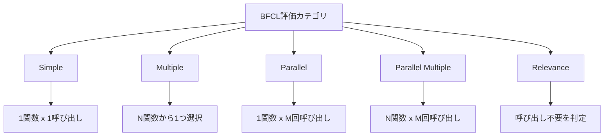
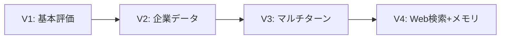

本記事は [BFCL論文](https://proceedings.mlr.press/v267/patil25a.html) の解説記事です。

## 論文概要（Abstract）

Berkeley Function Calling Leaderboard（BFCL）は、LLMのFunction Calling能力を包括的に評価するためのベンチマークである。著者らは、2000以上の質問-関数-回答ペアを用意し、Python・Java・JavaScript・REST APIの4言語にわたる評価を行っている。評価手法としてAbstract Syntax Tree（AST）ベースのマッチングを採用し、関数を実行せずに構造的な正しさを検証できる点が特徴である。BFCLはV1からV4まで進化を続け、単一ターンの関数呼び出しからマルチターン・エージェント的評価までをカバーする標準ベンチマークとなっている。

この記事は [Zenn記事: Function Calling品質評価入門：BFCL×DeepEval×Langfuseで精度とコストを守る](https://zenn.dev/0h_n0/articles/a6f8423493047e) の深掘りです。

## 情報源

- **会議名**: ICML 2025（42nd International Conference on Machine Learning）
- **URL**: [https://proceedings.mlr.press/v267/patil25a.html](https://proceedings.mlr.press/v267/patil25a.html)
- **著者**: Shishir G. Patil, Huanzhi Mao, Fanjia Yan, Charlie Cheng-Jie Ji, Vishnu Suresh, Ion Stoica, Joseph E. Gonzalez（UC Berkeley）
- **掲載**: PMLR 267:48371-48392
- **コード**: [https://github.com/ShishirPatil/gorilla/tree/main/berkeley-function-call-leaderboard](https://github.com/ShishirPatil/gorilla/tree/main/berkeley-function-call-leaderboard)
- **OpenReview**: [https://openreview.net/forum?id=2GmDdhBdDk](https://openreview.net/forum?id=2GmDdhBdDk)

## カンファレンス情報

**ICMLについて**: ICMLは機械学習分野の最高峰国際会議の1つであり、NeurIPS・ICLRと並ぶトップカンファレンスである。採択率は例年25%前後で推移しており、厳しい査読プロセスを経た論文のみが発表される。BFCLはベンチマーク論文としてICML 2025に採択されており、LLMのツール呼び出し評価という実用的かつ重要な課題に取り組んでいる。

## 背景と動機（Background & Motivation）

近年、LLMの実用化においてFunction Calling（ツール呼び出し）は不可欠な機能となっている。APIの呼び出し、データベースクエリの構築、外部サービスとの連携など、LLMが構造化された関数呼び出しを正確に生成する能力はエージェントシステムの基盤となる。

しかし著者らは、既存の評価手法に以下の問題があると指摘している。第一に、単純なexact matchでは関数の引数順序やデフォルト値の違いに対応できない。第二に、実際に関数を実行する評価手法はスケーラビリティに欠け、数千の関数を対象としたベンチマークには不向きである。第三に、「並列呼び出し」「複数関数からの選択」「不要な呼び出しの抑制」など、実運用で求められる多様なシナリオをカバーする評価基盤が存在しなかった。

これらの課題に対し、BFCLはASTベースの評価手法を導入することで、関数を実行せずとも構造的な正しさを検証する仕組みを提案している。

## 主要な貢献（Key Contributions）

- **貢献1**: 2000以上の質問-関数-回答ペアからなるFunction Calling評価データセットの構築。Python・Java・JavaScript・REST APIの4言語を横断的にカバーする
- **貢献2**: AST（抽象構文木）ベースの評価手法の提案。LLM出力を構文木に変換し、期待出力との構造的一致を検証する。関数実行なしでスケーラブルな評価が可能
- **貢献3**: 5つの評価カテゴリ（Simple, Multiple, Parallel, Parallel Multiple, Relevance）による多角的な評価フレームワークの設計
- **貢献4**: V2（企業提供データ）、V3（マルチターン・マルチステップ）、V4（Web検索・メモリ）への段階的拡張によるベンチマークの進化

## 技術的詳細（Technical Details）

### 評価カテゴリの設計

BFCLは、Function Callingの難易度と性質に基づき5つのカテゴリを定義している。



各カテゴリの詳細は以下の通りである。

**Simple**: 1つの関数定義が与えられ、1回の呼び出しを生成するタスク。最も基本的なFunction Calling能力を測定する。

**Multiple**: 複数の関数定義が候補として提示され、ユーザーの意図に合致する1つの関数を選択して呼び出すタスク。関数の選択能力を評価する。

**Parallel**: 1つの関数定義に対し、異なる引数で複数回の呼び出しを生成するタスク。例えば「東京と大阪の天気を取得する」場合、同一の`get_weather`関数を異なる引数で2回呼び出す必要がある。

**Parallel Multiple**: 複数の関数定義から適切な関数を選択し、かつそれぞれを複数回呼び出すタスク。最も複雑なカテゴリであり、選択と並列呼び出しの両方が要求される。

**Relevance**: 提供された関数ではユーザーの要求を満たせない場合に、「関数呼び出しは不要」と判定するタスク。不必要な呼び出しを抑制する能力を評価する。これは実運用において特に重要であり、不正確な関数呼び出しによる副作用を防ぐ。

### AST評価手法

BFCLの中核をなすAST（Abstract Syntax Tree）評価手法について解説する。

従来のFunction Calling評価では、LLMの出力文字列を期待出力と直接比較するexact matchが用いられていた。しかし、この手法では以下の問題が生じる。

```python
# 以下の2つは意味的に等価だがexact matchでは不一致
# 出力A
get_weather(city="Tokyo", unit="celsius")
# 出力B
get_weather(unit="celsius", city="Tokyo")
```

AST評価手法では、LLM出力を構文木に変換し、木構造レベルでの比較を行う。具体的には以下の手順を取る。

**ステップ1: パース** — LLMが生成した関数呼び出し文字列を各言語のパーサでASTに変換する。

**ステップ2: 正規化** — 引数の順序正規化、デフォルト値の補完、型変換（例: `"42"` → `42`）を行う。

**ステップ3: 構造マッチング** — 正規化されたASTと期待出力のASTを比較し、関数名、引数名、引数値の一致を検証する。

この手法を形式的に記述すると、LLMの出力を$\hat{y}$、期待出力を$y^*$として、AST変換関数を$\text{AST}(\cdot)$、正規化関数を$\mathcal{N}(\cdot)$とすると、評価関数は以下のようになる。

$$
\text{Match}(\hat{y}, y^*) = \mathbb{1}\left[\mathcal{N}(\text{AST}(\hat{y})) \equiv \mathcal{N}(\text{AST}(y^*))\right]
$$

ここで、
- $\hat{y}$: LLMが生成した関数呼び出し文字列
- $y^*$: 期待される正解の関数呼び出し
- $\text{AST}(\cdot)$: 文字列を抽象構文木に変換する関数
- $\mathcal{N}(\cdot)$: ASTを正規化する関数（引数順序、デフォルト値、型の統一）
- $\equiv$: 構造的等価性（structural equivalence）
- $\mathbb{1}[\cdot]$: 指示関数

### アルゴリズム: AST評価の実装

以下はAST評価の概念的な実装例である。

```python
import ast
from typing import Any


def normalize_call(call_node: ast.Call) -> dict[str, Any]:
    """AST Callノードを正規化された辞書に変換する

    Args:
        call_node: Pythonのast.Callノード

    Returns:
        関数名と引数の正規化辞書
    """
    func_name = ast.dump(call_node.func)
    args: dict[str, Any] = {}

    # キーワード引数を抽出
    for kw in call_node.keywords:
        args[kw.arg] = ast.literal_eval(kw.value)

    # 位置引数をインデックスで管理
    for i, arg in enumerate(call_node.args):
        args[f"__pos_{i}"] = ast.literal_eval(arg)

    return {"func": func_name, "args": args}


def ast_match(
    prediction: str,
    expected: str,
    default_values: dict[str, Any] | None = None,
) -> bool:
    """AST評価: 予測と期待出力の構造的一致を検証

    Args:
        prediction: LLMが生成した関数呼び出し文字列
        expected: 期待される関数呼び出し文字列
        default_values: 省略可能なデフォルト引数の辞書

    Returns:
        構造的に一致する場合True
    """
    default_values = default_values or {}

    try:
        pred_tree = ast.parse(prediction, mode="eval")
        exp_tree = ast.parse(expected, mode="eval")
    except SyntaxError:
        return False

    pred_call = normalize_call(pred_tree.body)
    exp_call = normalize_call(exp_tree.body)

    # 関数名の一致を確認
    if pred_call["func"] != exp_call["func"]:
        return False

    # デフォルト値を補完して引数を比較
    pred_args = {**default_values, **pred_call["args"]}
    exp_args = {**default_values, **exp_call["args"]}

    return pred_args == exp_args
```

### バージョン進化: V1からV4へ

BFCLはバージョンアップを重ね、評価の対象範囲を拡大している。



**V1**（初期版）: 上記5カテゴリ（Simple, Multiple, Parallel, Parallel Multiple, Relevance）による基本評価。2000以上の質問-関数-回答ペアを含む。

**V2**: 企業から提供された実際のAPI定義データを追加。学術的に作成されたデータでは捉えきれない、実運用環境特有の複雑さ（深くネストしたJSON、長大なAPI説明文など）をカバーする。

**V3**: マルチターン・マルチステップ評価を導入。1回の関数呼び出しで完結しないタスク（前の呼び出し結果を次の呼び出しの引数に使う、など）を評価対象とした。これにより、エージェント的な逐次推論能力の測定が可能になった。

**V4**: Web検索カテゴリとメモリカテゴリを追加。Web検索では「検索結果を踏まえて次の関数を呼ぶ」シナリオ、メモリでは「過去の会話コンテキストを保持した上で関数を選択する」シナリオを評価する。著者らは「メモリ、動的な意思決定、長期的推論は依然として未解決の課題である」と報告している。

## 査読者の評価（Peer Review Insights）

OpenReviewの査読記録によると、査読者からは以下の点が評価されている。

- BFCLがFunction Calling評価のde factoスタンダードとなっている実績と、継続的なメンテナンス
- ASTベースの評価手法が実行ベースの評価と比較してスケーラブルである点
- 多言語対応（Python, Java, JavaScript, REST API）の実用性

一方で、V3・V4のマルチターン評価において、ターン間の依存関係の複雑さをどこまでカバーしているかについて追加の分析が求められていた。

## 実装のポイント

BFCLの評価フレームワークを実際に利用・拡張する際の注意点を述べる。

**AST変換の言語対応**: Pythonの`ast`モジュールはPythonコードのパースには適しているが、Java・JavaScript・REST APIの関数呼び出しには各言語専用のパーサが必要となる。BFCLのリポジトリでは言語別のハンドラが実装されている。

**型の柔軟な比較**: LLMが`"42"`（文字列）を出力した場合と`42`（整数）を出力した場合の両方を正解とすべきかは、評価の方針に依存する。BFCLでは型変換ルールを定義し、合理的な範囲での型不一致を許容している。

**並列呼び出しの順序**: Parallel/Parallel Multipleカテゴリでは、複数の関数呼び出しの順序が結果に影響しない場合がある。BFCLでは順序非依存な集合ベースの比較を行い、呼び出し順序の違いによる偽陰性を防いでいる。

**Relevanceカテゴリのハンドリング**: 関数呼び出しが不要な場合、LLMが空の出力やテキスト応答を返すことが期待される。LLMが不必要な関数を「念のため」呼び出してしまう傾向はovercalling問題と呼ばれ、Relevanceカテゴリはこの問題を明示的に測定する。

## Production Deployment Guide

BFCLの評価パイプラインは、LLMベースのアプリケーションにおけるFunction Calling品質の継続的モニタリングに応用できる。ここでは、BFCL評価パイプラインをAWS上でプロダクション運用する構成を解説する。

### AWS実装パターン（コスト最適化重視）

**トラフィック量別の推奨構成**:

| 構成 | 想定規模 | AWSサービス | 月額コスト概算 |
|------|---------|-------------|---------------|
| Small | ~100評価/日 | Lambda + Bedrock + DynamoDB | $50-150 |
| Medium | ~1000評価/日 | ECS Fargate + Bedrock + RDS | $300-800 |
| Large | 10000+評価/日 | EKS + Spot + Bedrock Batch | $2,000-5,000 |

**Small構成（~100評価/日）**: Lambda関数でBFCL評価ロジックを実行し、Bedrockで対象LLMのFunction Calling出力を取得する。評価結果はDynamoDBに格納し、CloudWatchで異常検知する。月額$50-150。Lambda ($5-10) + Bedrock ($30-100, モデル依存) + DynamoDB ($5-20) + CloudWatch ($5-10)。

**Medium構成（~1000評価/日）**: ECS Fargateで評価ワーカーを常時稼働させ、SQSキューで評価リクエストを管理する。RDS PostgreSQLで結果を永続化し、Grafanaダッシュボードで可視化する。月額$300-800。ECS Fargate ($100-250) + Bedrock ($150-400) + RDS ($50-100) + SQS/CloudWatch ($10-30)。

**Large構成（10000+評価/日）**: EKS上でKarpenterによるSpot Instances自動スケーリングを活用し、Bedrock Batch APIで評価リクエストをバッチ処理する。月額$2,000-5,000。EKS ($300-500) + Spot Instances ($500-1,500) + Bedrock Batch ($800-2,000, 50%割引) + RDS/S3/監視 ($200-500)。

**コスト削減テクニック**: Spot Instancesで最大90%削減、Bedrock Batch APIで50%削減、Prompt Cachingでトークンコスト30-90%削減、Reserved Instances（1年コミット）で最大72%削減。

> **注**: コスト試算は2026年5月時点のAWS ap-northeast-1（東京）リージョン料金に基づく概算値。実際のコストはトラフィックパターン、使用モデル、バースト使用量により変動する。最新料金はAWS料金計算ツールで確認を推奨。

### Terraformインフラコード

**Small構成（Serverless）**:

```hcl
# BFCL評価パイプライン - Small構成 (Lambda + Bedrock + DynamoDB)
terraform {
  required_version = ">= 1.9"
  required_providers {
    aws = { source = "hashicorp/aws", version = "~> 5.50" }
  }
}

provider "aws" { region = "ap-northeast-1" }

# IAMロール（最小権限）
resource "aws_iam_role" "bfcl_evaluator" {
  name = "bfcl-evaluator-role"
  assume_role_policy = jsonencode({
    Version = "2012-10-17"
    Statement = [{
      Action = "sts:AssumeRole"
      Effect = "Allow"
      Principal = { Service = "lambda.amazonaws.com" }
    }]
  })
}

resource "aws_iam_role_policy" "bfcl_policy" {
  name = "bfcl-evaluator-policy"
  role = aws_iam_role.bfcl_evaluator.id
  policy = jsonencode({
    Version = "2012-10-17"
    Statement = [
      {
        Effect   = "Allow"
        Action   = ["bedrock:InvokeModel"]
        Resource = "arn:aws:bedrock:ap-northeast-1::foundation-model/*"
      },
      {
        Effect   = "Allow"
        Action   = ["dynamodb:PutItem", "dynamodb:Query", "dynamodb:GetItem"]
        Resource = aws_dynamodb_table.bfcl_results.arn
      },
      {
        Effect   = "Allow"
        Action   = ["logs:CreateLogGroup", "logs:CreateLogStream", "logs:PutLogEvents"]
        Resource = "arn:aws:logs:ap-northeast-1:*:*"
      }
    ]
  })
}

# DynamoDB（On-Demand、KMS暗号化）
resource "aws_dynamodb_table" "bfcl_results" {
  name         = "bfcl-evaluation-results"
  billing_mode = "PAY_PER_REQUEST"
  hash_key     = "evaluation_id"
  range_key    = "timestamp"

  attribute { name = "evaluation_id"; type = "S" }
  attribute { name = "timestamp";     type = "S" }

  server_side_encryption { enabled = true }
  point_in_time_recovery { enabled = true }

  tags = { Project = "bfcl-evaluation", CostCenter = "ml-eval" }
}

# Lambda関数
resource "aws_lambda_function" "bfcl_evaluator" {
  function_name = "bfcl-ast-evaluator"
  runtime       = "python3.12"
  handler       = "handler.evaluate"
  role          = aws_iam_role.bfcl_evaluator.arn
  timeout       = 300
  memory_size   = 1024
  filename      = "lambda_package.zip"

  environment {
    variables = {
      DYNAMODB_TABLE = aws_dynamodb_table.bfcl_results.name
      LOG_LEVEL      = "INFO"
    }
  }

  tracing_config { mode = "Active" }  # X-Ray有効化
}
```

**Large構成（Container）**:

```hcl
# BFCL評価パイプライン - Large構成 (EKS + Karpenter + Spot)
module "eks" {
  source          = "terraform-aws-modules/eks/aws"
  version         = "~> 20.0"
  cluster_name    = "bfcl-eval-cluster"
  cluster_version = "1.31"
  vpc_id          = module.vpc.vpc_id
  subnet_ids      = module.vpc.private_subnets

  # コントロールプレーンのみ（ノードはKarpenterで管理）
  cluster_endpoint_public_access = false
  enable_irsa                    = true
}

# Karpenter Provisioner（Spot優先で最大90%コスト削減）
resource "kubectl_manifest" "karpenter_nodepool" {
  yaml_body = yamlencode({
    apiVersion = "karpenter.sh/v1"
    kind       = "NodePool"
    metadata   = { name = "bfcl-eval-pool" }
    spec = {
      template = {
        spec = {
          requirements = [
            { key = "karpenter.sh/capacity-type", operator = "In", values = ["spot", "on-demand"] },
            { key = "node.kubernetes.io/instance-type", operator = "In",
              values = ["m6i.xlarge", "m6a.xlarge", "m5.xlarge"] }
          ]
        }
      }
      limits   = { cpu = "100", memory = "400Gi" }
      disruption = { consolidationPolicy = "WhenEmptyOrUnderutilized" }
    }
  })
}

# Secrets Manager（Bedrock設定）
resource "aws_secretsmanager_secret" "bedrock_config" {
  name       = "bfcl/bedrock-config"
  kms_key_id = aws_kms_key.bfcl.arn
}

# AWS Budgets（予算アラート）
resource "aws_budgets_budget" "bfcl_monthly" {
  name         = "bfcl-monthly-budget"
  budget_type  = "COST"
  limit_amount = "5000"
  limit_unit   = "USD"
  time_unit    = "MONTHLY"

  notification {
    comparison_operator       = "GREATER_THAN"
    threshold                 = 80
    threshold_type            = "PERCENTAGE"
    notification_type         = "ACTUAL"
    subscriber_email_addresses = ["alert@example.com"]
  }
}
```

### 運用・監視設定

**CloudWatch Logs Insightsクエリ**（評価パイプラインの異常検知）:

```
# 1時間あたりの評価失敗率
fields @timestamp, @message
| filter event = "evaluation_complete"
| stats count(*) as total,
        sum(case when status = "FAIL" then 1 else 0 end) as failures,
        avg(duration_ms) as avg_latency
| by bin(1h)
| filter failures / total > 0.1
```

```
# AST解析エラーの集計（パーサの問題検知）
fields @timestamp, error_type, model_name
| filter event = "ast_parse_error"
| stats count(*) as error_count by model_name, error_type
| sort error_count desc
| limit 20
```

**CloudWatchアラーム設定**:

```python
import boto3

cloudwatch = boto3.client("cloudwatch", region_name="ap-northeast-1")

def create_bfcl_alarms() -> None:
    """BFCL評価パイプライン用のCloudWatchアラームを作成"""
    # Bedrock トークン使用量スパイク検知
    cloudwatch.put_metric_alarm(
        AlarmName="bfcl-bedrock-token-spike",
        MetricName="InputTokenCount",
        Namespace="AWS/Bedrock",
        Statistic="Sum",
        Period=3600,
        EvaluationPeriods=1,
        Threshold=1000000,
        ComparisonOperator="GreaterThanThreshold",
        AlarmActions=["arn:aws:sns:ap-northeast-1:ACCOUNT:bfcl-alerts"],
    )
    # Lambda実行時間異常検知
    cloudwatch.put_metric_alarm(
        AlarmName="bfcl-lambda-duration-anomaly",
        MetricName="Duration",
        Namespace="AWS/Lambda",
        Dimensions=[{"Name": "FunctionName", "Value": "bfcl-ast-evaluator"}],
        Statistic="p99",
        Period=300,
        EvaluationPeriods=3,
        Threshold=250000,
        ComparisonOperator="GreaterThanThreshold",
        AlarmActions=["arn:aws:sns:ap-northeast-1:ACCOUNT:bfcl-alerts"],
    )
```

**X-Rayトレーシング設定**:

```python
from aws_xray_sdk.core import xray_recorder, patch_all

patch_all()  # boto3の自動計装

@xray_recorder.capture("bfcl_ast_evaluation")
def evaluate_function_call(prediction: str, expected: str) -> dict:
    """X-Rayトレース付きのBFCL評価"""
    subsegment = xray_recorder.current_subsegment()
    subsegment.put_annotation("category", "simple")
    subsegment.put_metadata("prediction_length", len(prediction))
    result = ast_match(prediction, expected)
    subsegment.put_annotation("match_result", result)
    return {"match": result}
```

**Cost Explorer自動レポート**:

```python
import boto3
from datetime import datetime, timedelta

ce = boto3.client("ce", region_name="ap-northeast-1")
sns = boto3.client("sns", region_name="ap-northeast-1")

def daily_cost_report() -> None:
    """日次コストレポートを取得し、閾値超過時にSNS通知"""
    end = datetime.utcnow().strftime("%Y-%m-%d")
    start = (datetime.utcnow() - timedelta(days=1)).strftime("%Y-%m-%d")

    response = ce.get_cost_and_usage(
        TimePeriod={"Start": start, "End": end},
        Granularity="DAILY",
        Metrics=["UnblendedCost"],
        Filter={"Tags": {"Key": "Project", "Values": ["bfcl-evaluation"]}},
        GroupBy=[{"Type": "DIMENSION", "Key": "SERVICE"}],
    )

    total = sum(
        float(g["Metrics"]["UnblendedCost"]["Amount"])
        for r in response["ResultsByTime"]
        for g in r["Groups"]
    )

    if total > 100:
        sns.publish(
            TopicArn="arn:aws:sns:ap-northeast-1:ACCOUNT:bfcl-cost-alert",
            Subject=f"BFCL Cost Alert: ${total:.2f}/day",
            Message=f"Daily cost exceeded $100 threshold: ${total:.2f}",
        )
```

### コスト最適化チェックリスト

**アーキテクチャ選択**:
- [ ] トラフィック量に応じた構成を選択（~100/日: Serverless、~1000/日: Hybrid、10000+/日: Container）
- [ ] バッチ評価とリアルタイム評価のワークロード特性を分析

**リソース最適化**:
- [ ] EC2/EKS: Spot Instances優先（最大90%削減）
- [ ] Reserved Instances: 安定ワークロードに1年コミット（最大72%削減）
- [ ] Savings Plans: Compute Savings Plans検討
- [ ] Lambda: メモリサイズをPower Tuningで最適化（1024MB推奨）
- [ ] ECS/EKS: Karpenterでアイドル時自動スケールダウン

**LLMコスト削減**:
- [ ] Bedrock Batch APIで非リアルタイム評価を50%削減
- [ ] Prompt Caching有効化（関数定義のキャッシュで30-90%削減）
- [ ] モデル選択ロジック: Simple評価にはHaiku、複雑な評価にはSonnetを動的選択
- [ ] トークン数制限: 関数定義の冗長な説明を要約してトークン消費を削減
- [ ] バッチサイズ最適化: 並列評価のバッチサイズを調整

**監視・アラート**:
- [ ] AWS Budgets: 月次予算上限を設定（80%で警告、100%で通知）
- [ ] CloudWatch Alarms: Bedrockトークン使用量、Lambda実行時間
- [ ] Cost Anomaly Detection有効化
- [ ] 日次コストレポートをSNS/Slackに自動送信

**リソース管理**:
- [ ] 未使用リソースの定期削除（古いLambdaバージョン、未使用ECRイメージ）
- [ ] タグ戦略: `Project=bfcl-evaluation`タグを全リソースに付与
- [ ] DynamoDB TTLで古い評価結果を自動削除
- [ ] 開発環境は夜間・休日に自動停止（EventBridge Scheduler）
- [ ] S3ライフサイクルポリシー: 90日後にGlacierへ移行

## 実験結果（Results）

著者らは、BFCLを用いて主要なLLMのFunction Calling能力を評価した結果を報告している。

**カテゴリ別の傾向**: Simple（単一関数・単一呼び出し）カテゴリでは多くのモデルが高い正解率を達成しているのに対し、Parallel MultipleやRelevanceカテゴリでは性能が大きく低下する傾向が確認されている。特にRelevanceカテゴリでは、「呼び出しが不要」と正しく判断できないモデルが散見される。

**マルチターン評価（V3以降）**: V3で導入されたマルチターン・マルチステップ評価では、単一ターンの評価結果と比較して大幅に性能が低下するモデルが報告されている。著者らは「メモリ、動的な意思決定、長期的推論は依然として未解決の課題である」と述べている。

**企業データ（V2）の影響**: V2で追加された企業提供データは、学術的に作成されたデータよりも関数定義が複雑であり、多くのモデルでスコアの低下が観測されている。これは実運用のAPIが学術的なベンチマークより複雑であることを示唆している。

**多言語対応**: Python以外の言語（Java, JavaScript, REST API）での評価結果では、モデルによってはPythonと比較して顕著な性能差が見られる。これはLLMの学習データにおけるPythonの偏りを反映していると著者らは分析している。

## 実運用への応用（Practical Applications）

BFCLの評価手法は、LLMベースのアプリケーションにおけるFunction Calling品質の管理に直接応用できる。

**CI/CDパイプラインへの統合**: モデルのバージョンアップやプロンプト変更時に、BFCLスタイルの評価をCI/CDに組み込むことで、Function Callingのリグレッションを自動検知できる。関連Zenn記事で解説されているDeepEval・Langfuseとの統合により、精度・コスト・レイテンシの三軸で品質を監視する体制が構築可能である。

**カスタム評価セットの構築**: BFCLの評価カテゴリ分類（Simple, Multiple, Parallel等）をテンプレートとして、自社APIに特化した評価セットを作成できる。特にRelevanceカテゴリは、不要なAPI呼び出しによるコスト増加や副作用を防ぐために重要である。

**モデル選択の判断基準**: BFCLのリーダーボードスコアを参照することで、自社のユースケースに最適なモデルを選定できる。例えば、並列呼び出しが頻繁なシナリオではParallel Multipleのスコアを、安全性が重要なシナリオではRelevanceのスコアを重視するといった使い分けが可能である。

**コスト効率の最適化**: BFCLの評価結果を踏まえ、タスクの複雑さに応じてモデルを動的に切り替える（Simple評価には軽量モデル、Parallel Multipleには高性能モデル）戦略を実装できる。

## 関連研究（Related Work）

- **Gorilla**: 同じUC Berkeleyのチームが開発した、LLMにAPIドキュメントを検索・参照させるフレームワーク。BFCLはGorillaプロジェクトの一部として開発された
- **ToolBench**: Qinらが構築した16000以上のAPIを含むツール呼び出しベンチマーク。BFCLとの違いは、ToolBenchが実行ベースの評価を採用している点にある
- **API-Bank**: Liらが提案したAPI呼び出し評価フレームワーク。BFCLがASTベースの静的評価を採用するのに対し、API-Bankは実行結果の正しさで評価する
- **TaskBench**: Shenらによるタスク自動化ベンチマーク。Function Callingに特化したBFCLとは異なり、複数ツールの連携によるタスク完遂能力を評価する

## まとめと今後の展望

BFCLは、LLMのFunction Calling能力を5つの評価カテゴリとASTベースの評価手法によって包括的に測定する標準ベンチマークである。関数を実行せずに構造的な正しさを検証するAST評価は、スケーラビリティと再現性の面で大きな利点がある。

V1からV4への進化は、単一ターンの基本評価からマルチターン・エージェント的評価へとLLM評価の要求が高度化していることを反映している。著者らが指摘する通り、メモリや動的意思決定は現在のLLMにとって依然として大きな課題であり、今後のモデル改良とベンチマーク拡張の両面から進展が期待される。

実務的には、BFCLの評価カテゴリ分類とAST評価手法を自社のFunction Calling品質管理に取り入れることで、モデル選定・リグレッション検知・コスト最適化を体系的に行える。

## 参考文献

- **Conference URL**: [https://proceedings.mlr.press/v267/patil25a.html](https://proceedings.mlr.press/v267/patil25a.html)
- **OpenReview**: [https://openreview.net/forum?id=2GmDdhBdDk](https://openreview.net/forum?id=2GmDdhBdDk)
- **Code**: [https://github.com/ShishirPatil/gorilla/tree/main/berkeley-function-call-leaderboard](https://github.com/ShishirPatil/gorilla/tree/main/berkeley-function-call-leaderboard)
- **BFCL Leaderboard**: [https://gorilla.cs.berkeley.edu/leaderboard.html](https://gorilla.cs.berkeley.edu/leaderboard.html)
- **Related Zenn article**: [https://zenn.dev/0h_n0/articles/a6f8423493047e](https://zenn.dev/0h_n0/articles/a6f8423493047e)
