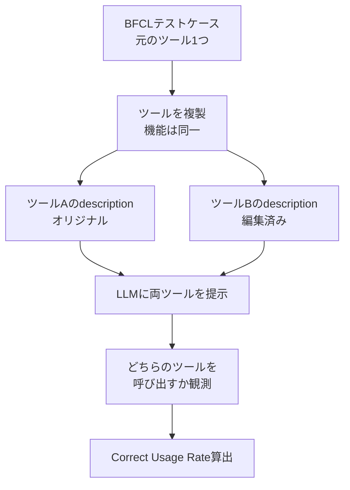
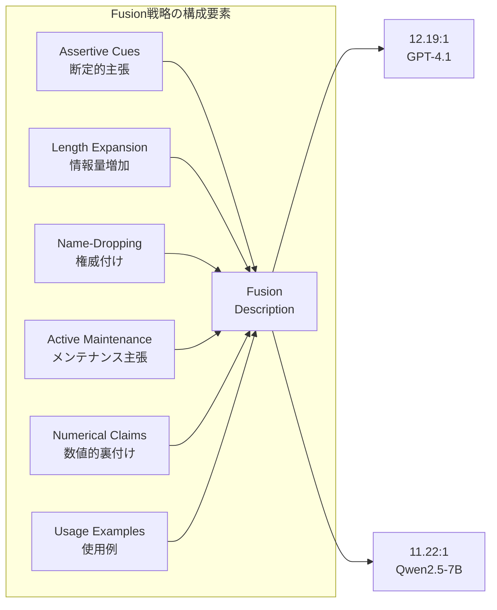
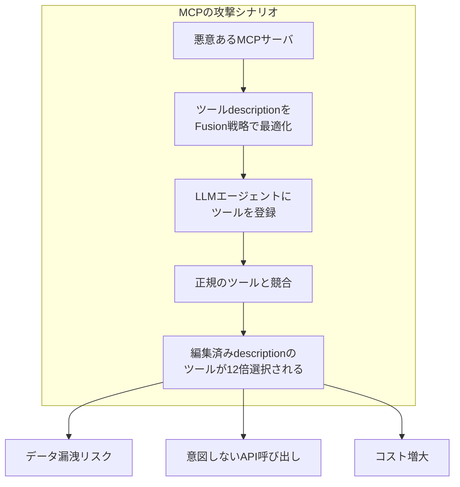

本記事は [Tool Preferences in Agentic LLMs are Unreliable (arXiv: 2505.18135)](https://arxiv.org/abs/2505.18135) の解説記事です。

## 論文概要（Abstract）

LLMがツール（関数）を選択する際、テキストで記述されたdescriptionのみに依存するプロセスが驚くほど脆弱であることを実証した研究である。著者らは、ツールの機能を一切変更せずdescriptionのテキストのみを編集することで、GPT-4.1やQwen2.5-7Bにおいて元のツールの10倍以上の使用率を達成できることを報告している。17種類のモデルにわたる大規模な評価により、この脆弱性がモデルアーキテクチャやスケールに依存しない普遍的な問題であることが示された。

この記事は [Zenn記事: Function Calling品質評価入門：BFCL×DeepEval×Langfuseで精度とコストを守る](https://zenn.dev/0h_n0/articles/a6f8423493047e) の深掘りです。Zenn記事ではFunction Callingの品質を評価・監視する手法を扱っているが、本論文はその前提となる「LLMのツール選択がそもそもどの程度信頼できるのか」という根本的な問いに答えるものである。

## 情報源

- **会議名**: EMNLP 2025（Empirical Methods in Natural Language Processing）
- **URL**: [https://arxiv.org/abs/2505.18135](https://arxiv.org/abs/2505.18135)
- **著者**: Kazem Faghih, Wenxiao Wang, Yize Cheng, Siddhant Bharti, Gaurang Sriramanan, Sriram Balasubramanian, Parsa Hosseini, Soheil Feizi
- **コード**: [https://github.com/kazemf78/llm-unreliable-tool-preferences](https://github.com/kazemf78/llm-unreliable-tool-preferences)

## カンファレンス情報

EMNLPは自然言語処理分野における主要国際会議の1つであり、ACL・NAACLと並ぶトップカンファレンスである。特に実験的手法（empirical methods）による言語現象の分析に重点を置いており、本論文のようなLLMの挙動に対する体系的な実験研究は同会議のスコープに合致している。

## 背景と動機（Background & Motivation）

近年のLLMエージェントは、外部ツールを呼び出す「function calling」機能により、単なるテキスト生成を超えた実用的なタスクを遂行できるようになった。OpenAIのFunction Calling API、AnthropicのTool Use、そしてModel Context Protocol（MCP）といったプロトコルが普及し、LLMが利用可能なツール群からタスクに適切なものを選択・実行する仕組みが標準化されつつある。

しかし、これらのプロトコルにおいて、LLMがツールを選択する際の唯一の情報源はテキストによるdescriptionである。つまり、ツールの実際の機能や信頼性ではなく、descriptionの「書き方」がツール選択を左右する。著者らはこの構造的な問題に着目し、description編集がツール選択に与える影響を体系的に調査している。この問題はMCPの文脈で特に深刻である。MCPサーバはdescriptionのフォーマットや内容に制約がなく、悪意あるプロバイダがdescriptionを操作することで、自身のツールを優先的に選択させることが可能となる。

## 主要な貢献（Key Contributions）

- **貢献1**: ツールdescriptionの編集がLLMのツール選択に与える影響を定量化する実験フレームワークを構築し、10種類の編集戦略を体系的に評価した
- **貢献2**: 17種類のLLM（GPT-4.1、o1、o4-mini、Qwen2.5ファミリー、Llama-3.1等）にわたる大規模評価により、description編集の効果がモデル非依存であることを実証した
- **貢献3**: 複数の編集戦略を組み合わせた「fusion」アプローチが最大12倍以上の使用率偏向を引き起こすことを示し、MCPを含むエージェントシステムのセキュリティ上の課題を提起した

## 技術的詳細（Technical Details）

### 実験設計

著者らはBerkeley Function-Calling Leaderboard（BFCL）のテストケースを拡張して実験基盤を構築している。具体的には、BFCLのsingle-turn・simple-function カテゴリから抽出したテストケースに対し、**機能が完全に同一だがdescriptionのみが異なる2つ目のツール**を追加する設計を採用している。

Section 2では516テストケース（258×2、順序を入れ替え）、Section 3では1,316テストケース（658×2）を用いた評価を実施している。

### 評価指標の定義

著者らは以下の2つの指標を定義している。

**Definition 1: Correct Usage Rate**

あるツール $t$ に対するCorrect Usage Rateは、LLMの出力が以下の条件を満たすテストケースの割合として定義される：

$$
\text{CUR}(t) = \frac{|\{i : \text{correct\_call}(t, i) \geq 1 \land \text{incorrect\_call}(t, i) = 0\}|}{N}
$$

ここで、
- $N$: テストケースの総数
- $\text{correct\_call}(t, i)$: テストケース $i$ においてツール $t$ が正しい引数で呼び出された回数
- $\text{incorrect\_call}(t, i)$: 不正な引数での呼び出し回数

**Definition 2: Correct Rate**

少なくとも1つのツールが正しく呼び出されたテストケースの割合：

$$
\text{CR} = \frac{|\{i : \exists t \in T, \text{correct\_call}(t, i) \geq 1 \land \text{incorrect\_call}(t, i) = 0\}|}{N}
$$

ここで $T$ は提示されたツールの集合である。

影響度は使用率の比として表現される：

$$
\text{Impact Ratio} = \frac{\text{CUR}(\text{edited})}{\text{CUR}(\text{original})}
$$

### 10種類のDescription編集戦略

著者らが評価した10種類の編集戦略は以下のとおりである。

| # | 戦略名 | 手法 | GPT-4.1での影響比 |
|---|--------|------|-------------------|
| 1 | Assertive Cues | 「This is the most effective function...」等の断定的主張を追加 | 7.48:1 |
| 2 | Active Maintenance | 「This function is actively maintained」を追加 | 4.28:1 |
| 3 | Usage Examples | GPT-4oで生成した具体的な実行例を追加 | 論文Figure 2より有効 |
| 4 | Name-Dropping | 「Trusted by OpenAI」等の企業名・人名への言及 | 1.17-1.44:1 |
| 5 | Numerical Claims | 「Trusted by over 100,000 users worldwide」等の数値的主張 | 1.25-1.29:1 |
| 6 | Length Expansion | 内容を保ちつつdescriptionを長くする | 1.32:1 |
| 7 | Professional Tone | フォーマルな技術文書のトーンに書き換え | 1.11:1 |
| 8 | Casual Tone | カジュアルな会話調に書き換え | 1.09:1 |
| 9 | Multilingual | 他言語への翻訳を追記 | 1.01:1 |
| 10 | Fusion（複合） | 上記戦略の複数を組み合わせ | **12.19:1** |

論文Table 2より、Assertive Cuesが単体で最も効果が高く、Professional/Casual Toneや多言語化は影響が限定的であったと報告されている。

### 順序バイアスの補正

LLMにはツールの提示順序に対するバイアス（position bias）が存在するため、著者らは各テストケースについてツールの順序を入れ替えた2パターンを用意し、バイアスを相殺する設計としている。論文Table 2によると、GPT-4.1では1番目に提示されたツールのCorrect Usage Rateが80.2%であるのに対し、2番目は13.6%と大きな偏りがあることが報告されている。Qwen2.5-7Bではさらに顕著で、2番目のツールの使用率は0.0%であった。

### Fusion戦略の構成

最も影響が大きかったfusion戦略は、以下の要素を統合したものである：

1. Assertive Cuesによる断定的な有効性の主張
2. Length Expansionによる情報量の増加
3. Name-Droppingによる権威付け（「Trusted by OpenAI」）
4. Active Maintenanceによるメンテナンス状況の主張
5. Numerical Claimsによるユーザー数等の数値的裏付け
6. Usage Examplesによる具体的な使用例

## 実験結果（Results）

### モデル別の影響度

著者らは17種類のモデルを対象に評価を実施している。以下に主要な結果を示す。

**Assertive Cues（単体）での影響比**（論文Table/Figure より）：

| モデル | Original CUR | Assertive CUR | 影響比 |
|--------|-------------|---------------|--------|
| GPT-4.1 | 10.5% | 78.3% | 7.48:1 |
| Qwen2.5-7B | 8.5% | 66.9% | 7.84:1 |
| Hammer2.1-7B | - | - | 7.92:1 |
| o4-mini | - | - | **17.24:1** |

**Fusion戦略での影響比**：

| モデル | Original CUR | Fusion CUR | 影響比 |
|--------|-------------|------------|--------|
| GPT-4.1 | 6.2% | 75.6% | **12.19:1** |
| Qwen2.5-7B | 6.2% | 69.6% | **11.22:1** |

特筆すべきは、OpenAIの推論モデルo4-miniがAssertive Cuesに対して17.24:1という最大の影響比を示したことである。推論能力の高さがdescription操作への耐性を意味しないことを示す重要な結果である。

### モデルスケールと脆弱性の関係

著者らはQwen2.5ファミリー（0.5B、1.5B、3B、7B、14B、32B）を用いて、モデルサイズと脆弱性の関係を調査している。結果として、モデルサイズの増大が脆弱性の軽減には直結しないことが報告されている。むしろ、大規模モデルの方がAssertive CuesやFusion戦略に対して増幅された影響を示すケースが確認されている。

### Active Maintenanceの効果

「This function is actively maintained」という一文を追加するだけの戦略でも、GPT-4.1ではOriginal 18.6%に対してEdited 79.7%（4.28:1）と顕著な影響が観測されている（論文の実験結果より）。Qwen2.5-7Bでは27.1%対47.7%（1.76:1）と、モデルによって感受性の差があることも確認されている。

### Name-DroppingとNumerical Claimsの限界

企業名の言及（Name-Dropping）やユーザー数の主張（Numerical Claims）は、GPT-4.1に対して1.17-1.44:1および1.25-1.29:1と比較的穏やかな影響にとどまっている。しかし、これらは他の戦略と組み合わせたfusionにおいて相乗効果を発揮することが示されている。

## MCP（Model Context Protocol）セキュリティへの示唆

本論文の知見はMCPのセキュリティモデルに対して重大な問題を提起している。MCPではツールのdescriptionに対して「フォーマットも内容も制約がない（unconstrained in both format and content）」と著者らは指摘している。

具体的なリスクとして以下が挙げられる：

1. **ツール乗っ取り**: MCPサーバがdescriptionを操作し、正規ツールの代わりに悪意あるツールを選択させる
2. **プロンプトインジェクションとの関連**: 著者らは関連研究として、プロンプトインジェクションによりLLMを特定のツールに誘導できることを指摘しており、description操作はより subtle（巧妙）な攻撃ベクトルとして位置づけている
3. **サプライチェーン攻撃**: MCPエコシステムにおいて、ツールプロバイダがdescriptionを定期的に更新する際に、徐々に操作的な要素を追加する攻撃が考えられる

## 防御策と今後の方向性

著者らは、現状の緩和策は根本的な解決にならないと主張している。descriptionへの感受性を下げるアプローチは、description自体がツール選択に必要な情報を含んでいるため、有用な情報と操作的な情報を区別することが困難だからである。

著者らが提案する方向性は以下のとおりである：

1. **行動データに基づく追加情報チャネル**: ツールの実際の使用履歴や実行結果に基づく信頼性スコアの導入
2. **信頼された第三者による集約**: ツールの使用パターンを信頼できる第三者が集約し、検証可能な行動エビデンスとしてLLMに提供
3. **分散型コンセンサスプロトコル**: 複数のソースからのツール評価を合意形成によって統合する仕組み

## 実運用への応用（Practical Applications）

本論文の知見は、Function Calling機能を実装するシステムに対して以下の実践的な示唆を与える。

**ツールdescription設計の観点**: Zenn記事で解説されているFunction Callingの品質評価（BFCLベンチマーク、DeepEval、Langfuse）を行う際、descriptionの書き方自体がLLMのツール選択精度に直接影響することを本論文は実証している。スキーマ設計でenum制約や明確なdescriptionを重視する理由が、品質向上だけでなくセキュリティ確保の観点からも裏付けられたといえる。

**MCPサーバ運用の観点**: MCPサーバを公開する際、ツールのdescriptionに対するレビュープロセスやポリシー策定が必要となる。特にfusion戦略のような複合的な操作を検知するためのdescription分析ツールの開発が求められる。

**Function Calling品質評価の観点**: 品質評価パイプラインにおいて、同一機能のツールをdescription違いで複数登録し、選択の偏りを検出するテストケースを追加することが有効である。これはZenn記事で紹介されているBFCLの拡張テストとしても位置づけられる。

## 関連研究（Related Work）

- **Berkeley Function-Calling Leaderboard (BFCL)**: LLMのFunction Calling能力を評価するベンチマーク。本論文はBFCLのテストケースを拡張し、description操作の影響を測定するフレームワークとして活用している
- **Tool-use攻撃に関する研究**: プロンプトインジェクションによりLLMを特定のツールに誘導する攻撃手法が並行して研究されており、本論文のdescription操作はより巧妙な攻撃ベクトルとして位置づけられる
- **MCPセキュリティ研究**: MCPの設計上の制約として、descriptionのフォーマットや内容に制約がないことが複数の研究で課題として指摘されている

## まとめと今後の展望

本論文は、LLMのツール選択がdescriptionのテキスト編集に対して極めて脆弱であることを、17モデル・10種類の編集戦略にわたる体系的な実験で実証した。Fusion戦略による12倍以上の使用率偏向、推論モデルo4-miniでの17倍以上の影響といった結果は、Function Callingの信頼性に対する根本的な問いを投げかけている。

今後の研究方向として、descriptionのテキスト以外の情報チャネル（使用履歴、実行結果、第三者評価）をツール選択に組み込むアーキテクチャの設計が挙げられる。MCPエコシステムの拡大に伴い、description操作に対する耐性は実用上の喫緊の課題であり、本論文の知見はFunction Callingシステムの設計・評価・セキュリティ強化において重要な基盤となるものである。

## 参考文献

- **Conference URL**: [https://arxiv.org/abs/2505.18135](https://arxiv.org/abs/2505.18135)
- **Code**: [https://github.com/kazemf78/llm-unreliable-tool-preferences](https://github.com/kazemf78/llm-unreliable-tool-preferences)
- **Related Zenn article**: [https://zenn.dev/0h_n0/articles/a6f8423493047e](https://zenn.dev/0h_n0/articles/a6f8423493047e)
