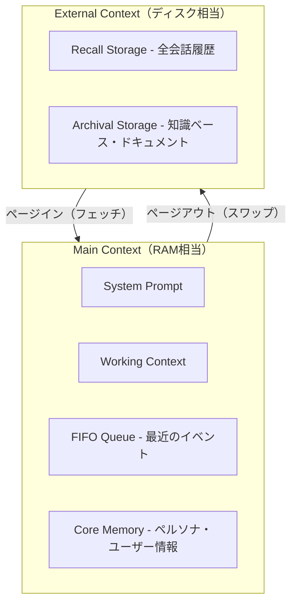
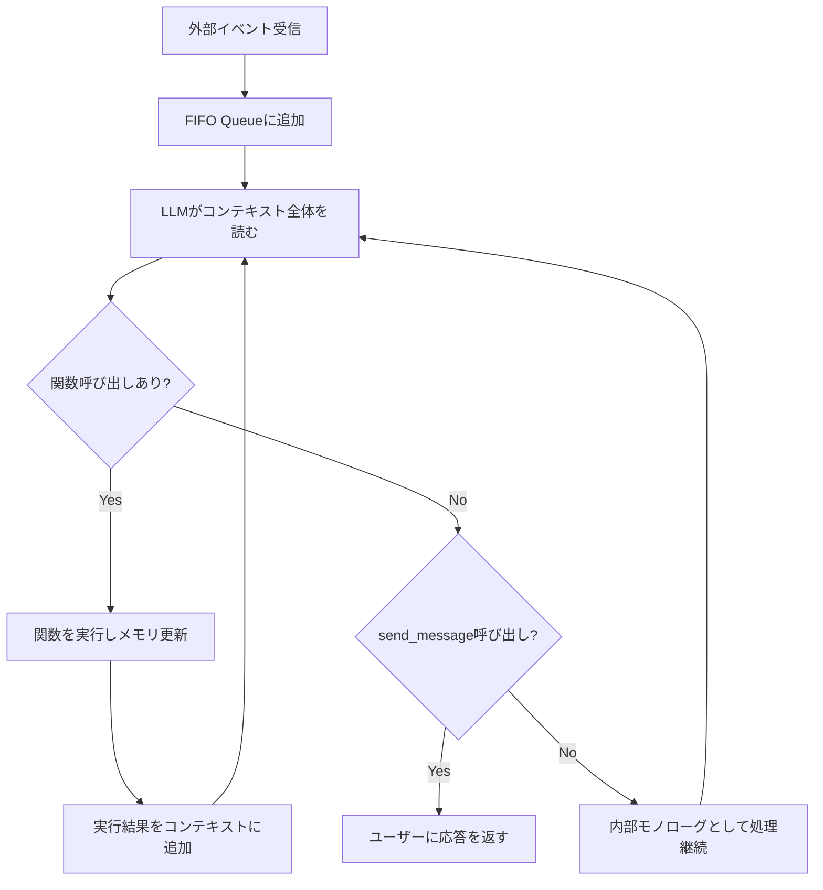

本記事は [MemGPT: Towards LLMs as Operating Systems (arXiv: 2310.08560)](https://arxiv.org/abs/2310.08560) の解説記事です。

## 論文概要（Abstract）

MemGPTは、従来のオペレーティングシステム（OS）における仮想メモリとページングの概念をLLMのコンテキスト管理に応用した研究である。LLMの固定長コンテキストウィンドウを「メインメモリ（RAM）」、外部ストレージを「ディスク」と見なし、LLM自身が関数呼び出しを通じてメモリの読み書き・ページング処理を自律的に制御する。UC Berkeleyの Packer らが2023年10月に発表し、長文書解析と持続会話エージェントの両タスクで固定コンテキスト手法を上回る性能を示した。

この記事は [Zenn記事: Bedrock AgentCoreメモリ障害復旧設計](https://zenn.dev/0h_n0/articles/523ab73e5561db) の深掘りです。Zenn記事で設計したBlobMessageチェックポイントとDynamoDB補完ストアの理論的基盤として、MemGPTのメモリ階層設計を詳しく掘り下げる。

## 情報源

- **arXiv ID**: 2310.08560
- **URL**: [https://arxiv.org/abs/2310.08560](https://arxiv.org/abs/2310.08560)
- **著者**: Charles Packer, Vivian Fang, Shishir G. Patil, Kevin Lin, Sarah Wooders, Joseph E. Gonzalez
- **発表年**: 2023
- **分野**: cs.AI, cs.LG

## 背景と動機（Background & Motivation）

LLMは固定長のコンテキストウィンドウという構造的な制約を持つ。GPT-4の場合は128Kトークン、Claude 3.5 Sonnetでは200Kトークンが上限である。この制約は2つの問題を引き起こす。第一に、コンテキスト長を超える長文書の処理が不可能になる。第二に、複数セッションにまたがる対話で過去の文脈が失われる。

従来のアプローチは、入力をコンテキストに収まるように切り詰める（truncation）か、検索拡張生成（RAG）で部分的に情報を取得する方法が主流であった。しかしこれらは「何を残し、何を捨てるか」の判断をシステム側に委ねており、LLMの推論能力を活かしきれていない。Packer らはこの問題に対し、OSの仮想メモリ管理をアナロジーとする新しいアプローチを提案した。

## 主要な貢献（Key Contributions）

- **貢献1**: LLMをOSとしてアナロジーする設計パラダイムの確立。コンテキストウィンドウをRAM、外部ストレージをディスクとして扱い、ページングの概念をLLMに導入した
- **貢献2**: LLM自身がメモリ管理関数を制御する自律的メモリ管理メカニズムの実装。`core_memory_append`、`memory_search`等の関数呼び出しでLLMが自らメモリを読み書きする
- **貢献3**: 長文書解析（Multi-Document QA）と持続会話エージェント（Multi-Session Chat）の2タスクでの実証評価。GPT-4、GPT-3.5-turbo、Mistral-7Bなど複数モデルで検証

## 技術的詳細（Technical Details）

### メモリ階層アーキテクチャ

MemGPTのコアは、OSの記憶階層をLLMのコンテキスト管理に適用した2層構造である。



**Main Context（メインコンテキスト）** はLLMのコンテキストウィンドウ内に存在するアクティブメモリであり、以下の4つのサブコンポーネントで構成される。

- **System Prompt**: エージェントの役割・指示を定義する不変領域
- **Working Context**: 現在の推論に必要な動的情報を保持。ユーザーメッセージやLLMの思考過程が含まれる
- **FIFO Queue**: 最近のイベント履歴をFirst-In, First-Outで管理。コンテキスト圧迫時に古いイベントから削除される
- **Core Memory**: ペルソナ情報やユーザーの基本属性など、セッション間で維持すべき重要情報を保持

**External Context（外部コンテキスト）** はコンテキストウィンドウの外部に存在するストレージである。

- **Recall Storage**: 過去の全会話履歴を格納。意味的検索（ベクトル検索）と時系列検索の両方に対応
- **Archival Storage**: 大規模なドキュメントや知識ベースを格納。ベクトルDB（Chroma等）で検索可能

### メモリ管理関数（Function Calls）

Packer らの設計上の重要な判断として、メモリ管理をLLM自身の関数呼び出しとして実装している。LLMは以下の関数を自律的に選択・実行する。

```python
def core_memory_append(field: str, content: str) -> str:
    """Core Memoryの指定フィールドに情報を追記する

    Args:
        field: 対象フィールド名（例: "human", "persona"）
        content: 追記する情報

    Returns:
        更新後のCore Memory状態
    """
    ...

def core_memory_replace(field: str, old: str, new: str) -> str:
    """Core Memoryの情報を更新する（古い内容を新しい内容で置換）"""
    ...

def recall_memory_search(query: str, page: int = 0) -> list[dict]:
    """Recall Storageから過去の会話を意味的に検索する

    Args:
        query: 検索クエリ（自然言語）
        page: ページ番号（大量の結果をページネーションで取得）

    Returns:
        マッチした過去のイベントのリスト
    """
    ...

def archival_memory_insert(content: str) -> str:
    """Archival Storageに情報を永続保存する"""
    ...

def archival_memory_search(query: str, page: int = 0) -> list[dict]:
    """Archival Storageから知識ベースを検索する"""
    ...

def send_message(message: str) -> str:
    """ユーザーへメッセージを送信する（最終出力）"""
    ...
```

### イベント駆動型処理ループ

MemGPTはイベント駆動型のメインループを持つ。各ステップの処理フローは以下の通りである。



著者らはこのループを「内部モノローグ（inner monologue）」と呼んでいる。LLMがユーザーに応答する前に、複数回のメモリ操作を実行できる点が特徴的である。たとえば、ユーザーの質問を受けてRecall Storageを検索し、関連情報をコンテキストに読み込み、その情報を踏まえて初めて`send_message`で応答する、というフローが可能になる。

### ページングメカニズム

コンテキストウィンドウが満杯に近づくと、MemGPTは以下のページング処理を実行する。

1. FIFO Queueの古いイベントをRecall Storageにスワップアウト（永続化）
2. 必要に応じてArchival Storageから関連情報をスワップイン（コンテキストに読み込み）
3. Core Memoryの情報を要約・圧縮して容量を確保

論文によると、このスワップ判断はLLM自身が行う。コンテキスト残量の通知をシステムプロンプトに含め、LLMが適切なタイミングでメモリ関数を呼び出す設計である。

## 実装のポイント（Implementation）

### 外部ストレージの選択

論文の実装ではRecall StorageにSQLiteベースの全文検索、Archival StorageにChroma（ベクトルDB）を使用している。しかし、著者らの設計はストレージバックエンドに依存しない抽象化がなされており、DynamoDBのようなKey-Valueストアへの置換が容易である。

現在のLetta（MemGPTの後継プロジェクト）では、PostgreSQL、SQLite、Chroma等の複数バックエンドをプラグインとして選択できる。

### コンテキスト管理のチューニング

論文中で著者らが指摘するハマりポイントとして、以下がある。

- **FIFO Queueのサイズ設定**: 小さすぎると直近の文脈が失われ、大きすぎるとCore Memory・Working Context領域を圧迫する
- **ページアウトのタイミング**: LLMがコンテキスト満杯を検知するまでにラグがあり、最後の数ターンの情報が切り捨てられるリスクがある
- **関数呼び出しの連鎖深度**: 内部モノローグが深くなるとレイテンシが増大するため、最大呼び出し回数の制限が必要

### Zenn記事のBlobMessageとの対応

Zenn記事で設計したAgentCore MemoryのBlobMessageチェックポイントは、MemGPTのCore Memoryに相当する。BlobMessageはバイナリデータを対話イベントと同じタイムラインに保存する仕組みであり、MemGPTのCore Memory書き込み（`core_memory_append`）に対応する操作である。DynamoDB補完ストアはArchival Storageに該当し、セッション間で永続する知識ベースとして機能する。

## Production Deployment Guide

### AWS実装パターン（コスト最適化重視）

MemGPTアーキテクチャをAWS上で実装する場合のトラフィック量別推奨構成を以下に示す。

| 規模 | 月間リクエスト | 推奨構成 | 月額コスト | 主要サービス |
|------|--------------|---------|-----------|------------|
| **Small** | ~3,000 (100/日) | Serverless | $50-150 | Lambda + Bedrock + DynamoDB |
| **Medium** | ~30,000 (1,000/日) | Hybrid | $300-800 | Lambda + ECS Fargate + ElastiCache |
| **Large** | 300,000+ (10,000/日) | Container | $2,000-5,000 | EKS + Karpenter + EC2 Spot |

**Small構成の詳細（月額$50-150）**:
- **Lambda**: 1GB RAM, 60秒タイムアウト（内部モノローグの複数ステップに対応）。月額約$20
- **Bedrock**: Claude 3.5 Haiku、Prompt Caching有効。月額約$80
- **DynamoDB**: On-Demand（Recall Storage + Core Memory永続化）。月額約$10
- **S3**: Archival Storage用。月額約$5

**コスト削減テクニック**:
- Bedrock Prompt Cachingを有効化し、System PromptとCore Memoryのキャッシュで30-90%のトークンコスト削減
- DynamoDB TTLで古いRecall Storageイベントを自動削除（30日）
- Lambda Provisioned Concurrencyは不要（Serverlessのスケールで十分）

**コスト試算の注意事項**: 上記は2026年5月時点のAWS ap-northeast-1（東京）リージョン料金に基づく概算値です。MemGPTの内部モノローグにより1リクエストあたり複数回のLLM呼び出しが発生するため、Bedrockのトークンコストが支配的になります。最新料金は [AWS料金計算ツール](https://calculator.aws/) で確認してください。

### Terraformインフラコード

**Small構成（Serverless）: Lambda + Bedrock + DynamoDB**

```hcl
module "vpc" {
  source  = "terraform-aws-modules/vpc/aws"
  version = "~> 5.0"

  name = "memgpt-vpc"
  cidr = "10.0.0.0/16"
  azs  = ["ap-northeast-1a", "ap-northeast-1c"]
  private_subnets = ["10.0.1.0/24", "10.0.2.0/24"]

  enable_nat_gateway   = false
  enable_dns_hostnames = true
}

resource "aws_iam_role" "lambda_memgpt" {
  name = "lambda-memgpt-role"

  assume_role_policy = jsonencode({
    Version = "2012-10-17"
    Statement = [{
      Action    = "sts:AssumeRole"
      Effect    = "Allow"
      Principal = { Service = "lambda.amazonaws.com" }
    }]
  })
}

resource "aws_iam_role_policy" "bedrock_invoke" {
  role = aws_iam_role.lambda_memgpt.id

  policy = jsonencode({
    Version = "2012-10-17"
    Statement = [{
      Effect   = "Allow"
      Action   = ["bedrock:InvokeModel", "bedrock:InvokeModelWithResponseStream"]
      Resource = "arn:aws:bedrock:ap-northeast-1::foundation-model/anthropic.claude-3-5-haiku*"
    }]
  })
}

resource "aws_lambda_function" "memgpt_handler" {
  filename      = "lambda.zip"
  function_name = "memgpt-handler"
  role          = aws_iam_role.lambda_memgpt.arn
  handler       = "index.handler"
  runtime       = "python3.12"
  timeout       = 120
  memory_size   = 1024

  environment {
    variables = {
      BEDROCK_MODEL_ID    = "anthropic.claude-3-5-haiku-20241022-v1:0"
      DYNAMODB_TABLE      = aws_dynamodb_table.recall_storage.name
      ENABLE_PROMPT_CACHE = "true"
    }
  }
}

resource "aws_dynamodb_table" "recall_storage" {
  name         = "memgpt-recall-storage"
  billing_mode = "PAY_PER_REQUEST"
  hash_key     = "session_id"
  range_key    = "event_id"

  attribute {
    name = "session_id"
    type = "S"
  }

  attribute {
    name = "event_id"
    type = "S"
  }

  ttl {
    attribute_name = "expire_at"
    enabled        = true
  }
}

resource "aws_cloudwatch_metric_alarm" "lambda_duration" {
  alarm_name          = "memgpt-lambda-duration"
  comparison_operator = "GreaterThanThreshold"
  evaluation_periods  = 1
  metric_name         = "Duration"
  namespace           = "AWS/Lambda"
  period              = 3600
  statistic           = "Average"
  threshold           = 60000
  alarm_description   = "MemGPT Lambda平均実行時間が60秒超過（内部モノローグの深さを確認）"

  dimensions = {
    FunctionName = aws_lambda_function.memgpt_handler.function_name
  }
}
```

### セキュリティベストプラクティス

- **IAMロール**: Bedrockの`InvokeModel`とDynamoDBの`GetItem`/`PutItem`/`Query`のみに制限
- **ネットワーク**: Lambda VPC配置、パブリックアクセス不可
- **暗号化**: DynamoDB KMS暗号化有効、S3バケットポリシーでSSL必須
- **シークレット**: 環境変数にはモデルID等の非機密情報のみ。APIキー等はSecrets Manager経由

### 運用・監視設定

**CloudWatch Logs Insights クエリ**:

```sql
fields @timestamp, function_calls_count, total_tokens
| stats avg(function_calls_count) as avg_calls, max(function_calls_count) as max_calls by bin(1h)
| filter avg_calls > 5
```

**コスト最適化チェックリスト**:
- [ ] Bedrock Prompt Caching有効化（System Prompt + Core Memoryで30-90%削減）
- [ ] DynamoDB TTL設定（Recall Storageの古いイベントを30日で自動削除）
- [ ] Lambda timeout適切化（内部モノローグ深度に応じて60-120秒）
- [ ] CloudWatch アラーム設定（関数呼び出し回数の異常検知）
- [ ] Bedrock Batch API活用（非リアルタイムのArchival Storage更新に50%割引適用）

## 実験結果（Results）

### Multi-Document QA（長文書解析）

著者らはMulti-hop QA系タスクで評価を行っている（論文Section 5）。複数ドキュメントにまたがる質問応答において、GPT-4ベースのMemGPTは固定コンテキスト手法（先頭/末尾トランケーション）を上回るExact Match精度を達成したと報告している。特に答えが複数ドキュメントにまたがるmulti-hop reasoningで改善が顕著であった。

### Multi-Session Chat（持続会話）

MSC（Multi-Session Chat）データセットを用いた評価では、MemGPTは複数セッションにわたるユーザー情報の記憶・活用において、固定コンテキストエージェントより高い会話品質を示したと著者らは報告している。GPT-4ベースの評価に加え、人間評価者からも好意的な評価を受けたとされる。

### 制約と限界

著者ら自身が認めている制約は以下の通りである。

- **レイテンシ増大**: 内部モノローグによる複数回のLLM呼び出しで応答速度が低下する
- **モデル依存性**: 関数呼び出し能力が必要であり、小規模モデルでは制御が不安定になる傾向がある
- **コンテキスト管理の誤り**: LLMが重要な情報を誤ってページアウトするリスクが存在する
- **推論コスト**: 1リクエストあたり複数回のLLM推論が必要なため、単純なLLM呼び出しよりコストが高い

## 実運用への応用（Practical Applications）

MemGPTのメモリ階層設計は、Zenn記事で扱ったAgentCore Memoryのアーキテクチャに直接対応する。具体的には以下の対応関係がある。

| MemGPTの概念 | AgentCore Memoryの対応機能 |
|---|---|
| Core Memory | Short-term Memory（ConversationalMessage） |
| Recall Storage | Short-term Memory（BlobMessage） |
| Archival Storage | Long-term Memory（Namespace階層） |
| `core_memory_replace` | `add_turns` でのBlobMessage更新 |
| `archival_memory_search` | `search_long_term_memories` |

ヘルプデスクAIの文脈では、チケット対応中のコンテキスト（問題分類結果、対応ステータス）をCore Memory相当のBlobMessageに保存し、過去の解決事例をArchival Storage相当のLong-term Memoryに蓄積するという設計が、MemGPTの理論的フレームワークに合致する。

## 関連研究（Related Work）

- **ReAct** (Yao et al., 2023): LLMが思考と行動を交互に実行するフレームワーク。MemGPTの内部モノローグはReActの拡張と位置付けられる
- **Generative Agents** (Park et al., 2023): ストリーム・要約・リフレクションの3層メモリを持つシミュレーションエージェント。MemGPTとは異なり、メモリ管理をルールベースで実装している
- **Toolformer** (Schick et al., 2023): ツール使用を学習するLLM。MemGPTのメモリ関数呼び出しはToolformerの応用と見ることができる

## まとめと今後の展望

MemGPTは「LLMをOSとして扱う」という明快なアナロジーにより、コンテキストウィンドウの制約を克服する設計パターンを確立した。外部ストレージとの階層的メモリ管理という考え方は、AgentCore MemoryのShort-term/Long-term分離やDynamoDB補完ストアの設計根拠となっている。

MemGPTは現在Letta（`github.com/letta-ai/letta`）としてリブランディングされ、REST APIベースのプロダクションフレームワークに進化している。外部ストレージバックエンドのプラグイン化や、マルチエージェント対応が進行中である。

## 参考文献

- **arXiv**: [https://arxiv.org/abs/2310.08560](https://arxiv.org/abs/2310.08560)
- **Code**: [https://github.com/letta-ai/letta](https://github.com/letta-ai/letta)（旧 cpacker/MemGPT、Apache 2.0）
- **Related Zenn article**: [https://zenn.dev/0h_n0/articles/523ab73e5561db](https://zenn.dev/0h_n0/articles/523ab73e5561db)
