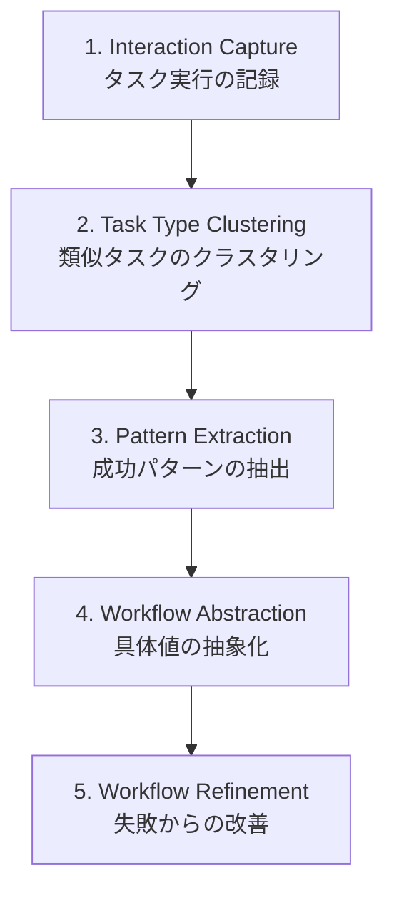
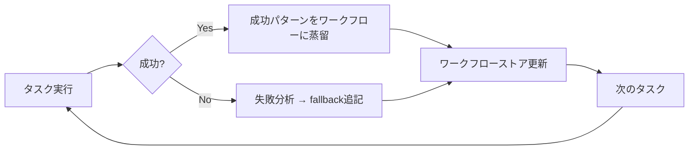

本記事は [Agent Workflow Memory (arXiv: 2409.02077)](https://arxiv.org/abs/2409.02077) の解説記事です。

## 論文概要（Abstract）

Agent Workflow Memory（AWM）は、エージェントの過去のタスク実行から再利用可能な「ワークフロー」を自動的にマイニング・格納・検索するシステムである。ワークフローとは、特定のタスクタイプを解決するための行動シーケンスを構造化・抽象化した記憶単位であり、個々のアクションではなく手順全体を記憶する。Zheng らがCarnegie Mellon Universityから2024年9月に発表し、Mind2Web（オフライン）で24.6%、WebArena（オンライン）で51.1%のタスク成功率を達成し、それぞれ従来最良手法から+14.9%、+8.9%の改善を報告している。

この記事は [Zenn記事: Bedrock AgentCoreメモリ障害復旧設計](https://zenn.dev/0h_n0/articles/523ab73e5561db) の深掘りです。Zenn記事のBlobMessageチェックポイントは「情報の記憶」を永続化するが、AWMは「行動手順の記憶」を永続化する。ヘルプデスクAIが「チケット対応手順」を学習・蓄積するパターンとして、AWMの設計を掘り下げる。

## 情報源

- **arXiv ID**: 2409.02077
- **URL**: [https://arxiv.org/abs/2409.02077](https://arxiv.org/abs/2409.02077)
- **著者**: Zora Zheng, Zijian Wang, Xiang Deng, Jiangnan Xu, Meng Hu, Sohee Yang, Louis-Philippe Morency, Daniel Fried, Graham Neubig
- **発表年**: 2024
- **分野**: cs.AI, cs.CL, cs.LG

## 背景と動機（Background & Motivation）

LLMベースのエージェントは、タスク実行時のコンテキストが短期間に限られ、過去の経験から学習する能力が制限されている。ReAct（Yao et al., 2023）は思考と行動を交互に実行するが、各タスクが独立して処理されるため、類似タスクでの経験が活かされない。Reflexion（Shinn et al., 2023）は失敗からの言語的フィードバックで自己改善を試みるが、成功パターンの構造的な蓄積はしない。

AWMの着想は「熟練したヘルプデスクオペレータは、類似の問い合わせに対して過去の対応手順を参照し、効率的に処理する」という実務的な観察に基づいている。個々の知識（事実）ではなく、手順（ワークフロー）を記憶単位とすることで、タスク解決の再現性と効率を向上させる。

## 主要な貢献（Key Contributions）

- **貢献1**: 「ワークフロー」という新しい記憶単位の定義。個々のアクションではなく、タスク解決のための行動シーケンスを構造化・抽象化した再利用可能な単位
- **貢献2**: ワークフローの自動マイニング機構。LLMを使用して過去のインタラクションから成功・失敗を問わず学習し、ワークフローを抽出・構造化
- **貢献3**: Offline（Mind2Web: +14.9%）とOnline（WebArena: +8.9%）の両設定での有効性実証
- **貢献4**: タスク・ウェブサイト・ドメインを跨いだ汎化能力の実証

## 技術的詳細（Technical Details）

### ワークフローのデータモデル

AWMにおけるワークフローは以下の構造で定義される。

```python
from dataclasses import dataclass


@dataclass
class WorkflowStep:
    action_type: str   # click / type / scroll / navigate
    target: str        # 操作対象の意味的記述
    condition: str     # このステップの実行条件（オプション）
    fallback: str      # 失敗時の代替手順（オプション）


@dataclass
class Workflow:
    name: str                       # "パスワードリセット対応"
    description: str                # 解決するタスクタイプの説明
    trigger_conditions: str         # 適用される条件
    steps: list[WorkflowStep]       # 構造化された行動ステップ
    source_tasks: list[str]         # 抽出元タスクの参照
```

MemGPTのCore MemoryやMemoryOSのLong-term Storageが「情報（facts/preferences）」を記憶するのに対し、AWMは「手順（procedures）」を記憶する。認知科学の用語では、前者が「宣言的記憶」、後者が「手続き的記憶」に対応する。

### ワークフローマイニングパイプライン

AWMのマイニングは以下の5段階パイプラインで実行される。



**Stage 1: Interaction Capture** — エージェントの各タスク実行を記録する。入力タスクの記述、実行した行動列、成功/失敗の結果を保存する。

**Stage 2: Task Type Clustering** — LLMを使用して記録されたタスクをクラスタリングし、同種の問題を識別する。たとえば「メールのパスワードリセット」と「VPNのパスワードリセット」は同じクラスタにグルーピングされる。

**Stage 3: Pattern Extraction** — 各クラスタ内の成功した行動列からLLMが共通パターンを抽出し、ワークフローの「ひな型」を生成する。

**Stage 4: Workflow Abstraction** — 具体的な値（例: "iPhone 13を検索"）を抽象化（例: "商品名で検索"）し、再利用可能な形式に変換する。

**Stage 5: Workflow Refinement** — 失敗した実行の情報を反映し、`condition`（実行条件）や`fallback`（代替手順）を追記してワークフローをロバストにする。

### Offline vs Online の2設定

AWMは2つの動作モードを持つ。

**Offline Mode（Mind2Web）**: 事前に正解行動列が与えられたデモデータからワークフローをマイニングする。新しいタスクの実行時にこのワークフローを検索・適用する。

**Online Mode（WebArena）**: 実際のブラウザ環境でエージェントがリアルタイムにタスクを実行し、成功・失敗から逐次ワークフローを更新・蓄積する。以下の自己改善ループが動作する。



### ワークフロー検索と注入

新しいタスクが与えられた際のフローは以下の通りである。

1. **Embedding-based Retrieval**: タスク記述をベクトル化し、ワークフローストアから意味的に類似するワークフローをtop-k検索
2. **Workflow Selection**: LLMが最適なワークフローを選択（または複数を組み合わせる）
3. **Workflow-Guided Execution**: 選択されたワークフローをプロンプトのコンテキストとして注入し、エージェントの行動をガイド
4. **Adaptive Execution**: ワークフローはガイドラインとして機能し、環境に応じて柔軟に適応する

## 実装のポイント（Implementation）

### ヘルプデスクAIへの応用

AWMのワークフロー記憶は、ヘルプデスクAIの「チケット対応手順」の学習に直接適用できる。

```python
helpdesk_workflow_example = Workflow(
    name="VPNアクセス障害の対応手順",
    description="VPN接続ができないユーザーへの段階的トラブルシューティング",
    trigger_conditions="ユーザーがVPN接続の問題を報告",
    steps=[
        WorkflowStep(
            action_type="diagnose",
            target="VPN接続状態の確認",
            condition="ユーザーがVPN問題を報告した場合",
            fallback="ネットワーク全般のトラブルシューティングに移行",
        ),
        WorkflowStep(
            action_type="instruct",
            target="VPNクライアントの再起動を指示",
            condition="VPNクライアントが応答しない場合",
            fallback="VPNクライアントの再インストールを提案",
        ),
        WorkflowStep(
            action_type="escalate",
            target="ネットワークチームにエスカレーション",
            condition="クライアント側の操作で解決しない場合",
            fallback=None,
        ),
    ],
    source_tasks=["TICKET-001", "TICKET-042", "TICKET-187"],
)
```

### BlobMessageチェックポイントとの統合

Zenn記事のBlobMessageチェックポイントが「現在の対応状態」を保存するのに対し、AWMワークフローは「対応手順テンプレート」を保存する。両者を組み合わせることで、以下の復旧フローが実現できる。

1. **障害発生**: セッションがStopped状態に遷移
2. **チェックポイント復元**: BlobMessageから`HelpdeskCheckpoint`を復元（現在のチケットコンテキスト）
3. **ワークフロー検索**: 復元されたチケットの`issue_category`からAWMワークフローを検索
4. **復旧プロンプト生成**: チェックポイント（状態）+ ワークフロー（手順）を組み合わせたリカバリプロンプトを構築
5. **対話継続**: ユーザーに自然な形で対応を再開

### ワークフローの陳腐化対策

著者らが指摘するワークフローの陳腐化（環境変化によりワークフローが無効化されるリスク）に対し、以下の対策が考えられる。

- **バージョニング**: 各ワークフローにタイムスタンプとバージョン番号を付与
- **有効期限**: 一定期間使用されないワークフローを自動アーカイブ
- **実行結果フィードバック**: ワークフロー適用後の成功/失敗をトラッキングし、失敗率が閾値を超えたワークフローを無効化

## 実験結果（Results）

### Mind2Web（Offline評価）

論文Section 5の実験結果によると、AWMはMind2Webベンチマーク（Webナビゲーションの大規模評価データセット）で24.6%のtask success rateを達成し、従来最良手法から+14.9%（絶対値）の改善を報告している。

著者らの分析によると、改善は以下のサブカテゴリで一貫して観察されている。
- **Cross-task**: 未学習のタスクタイプへの転移
- **Cross-website**: 未学習のウェブサイトへの転移
- **Cross-domain**: 異なるドメイン間（ショッピング→情報検索など）への転移

### WebArena（Online評価）

WebArena（動的なブラウザ環境での実タスク実行）において、AWMは51.1%のtask success rateを達成し、従来最良手法から+8.9%の改善を報告している（論文Table 2より）。

著者らはタスク数が増えるにつれて成功率が向上する傾向を確認しており、自己改善ループの有効性を示唆している。

### ワークフロー再利用の分析

論文の分析によると、有意な割合のタスクでワークフローが再利用され、再利用されたタスクでの成功率がワークフローなしの場合を一貫して上回ったと報告されている。

### 制約と限界

著者ら自身が認めている制約は以下の通りである。

- **初期ワークフロー品質への依存**: 初期の失敗が多いとワークフローの質が低下する
- **ワークフローの陳腐化**: UI変更等の環境変化に対する自動更新メカニズムが未整備
- **計算コスト**: ワークフローのマイニング（LLM呼び出し）に追加コストが発生
- **ストレージ管理**: ワークフローの際限ない蓄積による検索精度低下リスク
- **ドメイン制約**: 評価がWebナビゲーションに限定されており、他ドメインへの適用は未検証

## 実運用への応用（Practical Applications）

AWMのワークフロー記憶は、AgentCore Memoryの3種類のメモリ戦略に対して「第4の戦略」として位置づけられる。

| メモリ戦略 | 記憶の種類 | AgentCoreの対応 |
|---|---|---|
| Semantic Strategy | 事実・知識 | Long-term Memory |
| Summary Strategy | 対話要約 | Long-term Memory |
| User Preferences Strategy | ユーザー嗜好 | Long-term Memory |
| **AWM（手続き記憶）** | **対応手順** | **カスタム戦略 or DynamoDB** |

ヘルプデスクAIでは、AWMワークフローをDynamoDB上のテーブルとして実装し、チケットの`issue_category`をパーティションキーとして検索する設計が考えられる。成功した対応のワークフローは自動的にストアに蓄積され、類似のチケットが来た際にコンテキストとして注入される。

## 関連研究（Related Work）

- **ReAct** (Yao et al., 2023): 思考と行動の交互実行。AWMの基盤フレームワーク
- **Reflexion** (Shinn et al., 2023): 失敗からの言語的フィードバック。AWMはReflexionの「教訓」をより構造化されたワークフローとして蓄積
- **ExpeL** (Zhao et al., 2024): 過去の経験から教訓を抽出。AWMは個別の教訓ではなく行動シーケンス全体を記憶する点で異なる

## まとめと今後の展望

AWMは「情報の記憶」と「手順の記憶」を区別し、後者を構造化された再利用可能な形式で蓄積する新しいアプローチを提案した。WebArenaでの51.1%のtask success rateと自己改善の傾向は、ワークフロー記憶の実用的価値を示唆している。

Zenn記事のヘルプデスクAI設計において、BlobMessageチェックポイント（対応状態の永続化）とAWMワークフロー（対応手順の蓄積）を組み合わせることで、障害復旧時に「どこまで進んでいたか」と「どう進めるべきか」の両方を復元できる。これは単なる状態復旧を超えた、インテリジェントな対話継続を実現する設計である。

## 参考文献

- **arXiv**: [https://arxiv.org/abs/2409.02077](https://arxiv.org/abs/2409.02077)
- **Code**: [https://github.com/zorazrw/agent-workflow-memory](https://github.com/zorazrw/agent-workflow-memory)
- **Related Papers**: [ReAct (arXiv: 2210.03629)](https://arxiv.org/abs/2210.03629), [Reflexion (arXiv: 2303.11366)](https://arxiv.org/abs/2303.11366)
- **Related Zenn article**: [https://zenn.dev/0h_n0/articles/523ab73e5561db](https://zenn.dev/0h_n0/articles/523ab73e5561db)
