本記事は [Less is More: Optimizing Function Calling for LLM Execution on Edge Devices (arXiv: 2411.15399)](https://arxiv.org/abs/2411.15399) の解説記事です。

## 論文概要（Abstract）

エッジデバイス上でのLLMエージェント展開において、Function Calling（関数呼び出し）の性能がボトルネックとなっている。著者らは「Less-is-More」と呼ぶファインチューニング不要の動的ツール選択手法を提案し、LLMに提示するツール数を制限することでFunction Callingの成功率が向上し、実行時間が最大70%、消費電力が最大40%削減されることを実証している。この手法はMPNetによる埋め込みとFAISSによるk-NN検索を組み合わせた3段階の検索レベルで構成され、タスクの複雑さに応じて適切なツールセットを動的に選択する。

この記事は [Zenn記事: Function Calling品質評価入門](https://zenn.dev/0h_n0/articles/a6f8423493047e) の深掘りです。Zenn記事ではFunction Callingのトークンオーバーヘッド問題を扱っているが、本論文はその根本原因「ツール数の多さ」に対する解決策を提示し、ツール数削減がコスト削減と精度向上を同時に実現することを実験的に裏付けている。

## 情報源

- **arXiv ID**: 2411.15399
- **URL**: [https://arxiv.org/abs/2411.15399](https://arxiv.org/abs/2411.15399)
- **著者**: Varatheepan Paramanayakam, Andreas Karatzas, Iraklis Anagnostopoulos, Dimitrios Stamoulis
- **発表年**: 2024（DATE 2025 accepted）
- **分野**: cs.PF, cs.DC, cs.LG

## 背景と動機（Background & Motivation）

LLMをエージェントとして活用する際、外部ツールを呼び出すFunction Callingは不可欠な機能である。しかし、クラウドベースの大規模モデルとは異なり、エッジデバイス上の小型LLM（8Bパラメータ以下）では、以下の課題が顕在化する。

第一に、量子化による性能劣化の問題がある。論文Table Iによれば、Llama3.1-8bをq4_0量子化した場合、BFCLベンチマークでの成功率はフル精度の63.04%から20.43%まで低下する。エッジデバイスではメモリ制約から量子化が必須であり、この劣化は避けられない。

第二に、コンテキストウィンドウの制約がある。多数のツール定義をプロンプトに含めるとトークン数が膨大になり、限られたコンテキストウィンドウを圧迫する。論文Table IIでは、46ツールを16Kコンテキストで提示した場合にFunction Callingが失敗するケースが報告されている。

第三に、実行時間と消費電力の問題がある。エッジデバイスではGPUメモリやCPU性能が限られるため、不要なツール定義の処理がリソースの浪費に直結する。

従来のアプローチ（ToolLLMのツリー探索やGorillaの類似度検索）はクラウド環境を前提としており、エッジデバイスの制約下では動作しないか十分な改善が得られなかった。

## 主要な貢献（Key Contributions）

- **貢献1**: ファインチューニング不要の動的ツール選択手法「Less-is-More」の提案。既存モデルをそのまま使用でき、MPNet埋め込み+FAISSによる3段階検索で適切なツールサブセットを選択する
- **貢献2**: ツール数の削減がFunction Calling性能を向上させるという反直感的な知見の実験的実証。6つのオープンソースLLM（Hermes2-Pro-8b, Llama3.1-8b, Mistral-8b, Phi3-8b, Qwen2-1.5b, Qwen2-7b）と複数の量子化バリアントで検証
- **貢献3**: NVIDIA AGX Orin上での実機評価により、実行時間最大70%削減・消費電力最大40%削減を達成。BFCLとGeoEngineの2つのベンチマークで包括的に評価

## 技術的詳細（Technical Details）

### アーキテクチャ：3段階検索レベル

Less-is-Moreのコアは、ツール定義を潜在空間に埋め込み、ユーザクエリに最も関連するツールのみをLLMに提示する仕組みである。オフライン構築フェーズとランタイム選択フェーズの2段階で動作する。

```mermaid
flowchart TD
    subgraph Offline["オフライン構築フェーズ"]
        T["ツール定義"] --> E1["MPNet埋め込み<br/>768次元"]
        E1 --> L1["Level 1: 個別ツール空間 T̃"]
        
        Q["サンプルクエリ"] --> GPT["GPT-4で<br/>類似クエリ生成"]
        GPT --> AUG["拡張クエリ集合"]
        AUG --> E2["MPNet埋め込み"]
        E2 --> AC["凝集型クラスタリング"]
        AC --> L2["Level 2: ツールクラスタ空間 Ã"]
    end
    
    subgraph Runtime["ランタイム選択フェーズ"]
        UQ["ユーザクエリ"] --> REC["LLM Tool Recommender<br/>理想的なツール記述を生成"]
        REC --> EMB["MPNet埋め込み → Ẽ"]
        EMB --> KNN["FAISS k-NN検索"]
        KNN --> S1["Level 1 類似度スコア"]
        KNN --> S2["Level 2 類似度スコア"]
        S1 --> CMP["スコア比較"]
        S2 --> CMP
        CMP --> SEL{"最高スコア<br/>> 0.5?"}
        SEL -->|Yes| FILTER["選択Levelの<br/>ツールサブセット"]
        SEL -->|No| L3["Level 3: 全ツール提示"]
        FILTER --> FC["LLM Function Calling"]
        L3 --> FC
        FC --> RES{"成功?"}
        RES -->|Yes| OUT["結果出力"]
        RES -->|No| FALL["フォールバック:<br/>Level 3で再試行"]
    end
```



**Level 1 — 個別ツール検索**: 全ツール定義をMPNetで768次元ベクトルに変換し、潜在空間$\tilde{\mathcal{T}}$を構築する。単一ツールで完結するシンプルなクエリに対して高速に対応する。

**Level 2 — ツールクラスタ検索**: BFCLとGeoEngineのカテゴリごとに10クエリをサンプリングし、GPT-4（Turbo 0125）で文脈的に類似したタスクを生成する。これらの拡張クエリとツール定義を統合して拡張潜在空間$\tilde{\mathcal{A}}$を構築し、凝集型クラスタリング（Agglomerative Clustering）でツール間の協調関係を捉える。複数ツールの逐次呼び出しが必要な複雑なクエリに対応する。

**Level 3 — 全ツール提示**: 従来通り全APIをLLMに提示するフォールバックレベル。信頼度が閾値を下回る場合に使用する。

### ランタイム選択アルゴリズム

ランタイムでは、以下の手順でツールセットを動的に決定する。

1. ユーザクエリを受け取ったLLM（Tool Recommender）が、実際のツール定義にアクセスせずに「理想的なツール」の記述を生成する
2. 生成された記述をMPNetで768次元ベクトル$\tilde{\mathcal{E}}$に変換する
3. FAISSによるk-NN検索で$\tilde{\mathcal{T}}$と$\tilde{\mathcal{A}}$のそれぞれからtop-kのツールを取得する
4. 各レベルのtop-k類似度スコアの平均を比較し、最も高いレベルを選択する
5. 両レベルのスコアが閾値0.5を下回る場合はLevel 3にフォールバックする

著者らは$k=3$と$k=5$の設定で評価を行い、ベンチマークの特性によって最適なkが異なることを報告している。BFCLでは単一関数呼び出しが中心のためLevel 1が優先され、GeoEngineでは逐次的な関数呼び出しが必要なためLevel 2が優先される傾向がある。

### アルゴリズム

```python
from dataclasses import dataclass
from typing import Any

import faiss
import numpy as np


@dataclass
class SearchResult:
    """ツール検索結果"""
    level: int
    tools: list[dict[str, Any]]
    confidence: float


class LessIsMoreSelector:
    """Less-is-More動的ツール選択

    MPNet埋め込み + FAISS k-NN検索による3段階ツールフィルタリング。

    Args:
        embedder: MPNet埋め込みモデル (768次元)
        tool_index: Level 1用FAISSインデックス (個別ツール空間)
        cluster_index: Level 2用FAISSインデックス (クラスタ空間)
        all_tools: 全ツール定義のリスト
        confidence_threshold: フォールバック閾値 (論文では0.5)
    """

    def __init__(self, embedder: Any, tool_index: faiss.Index,
                 cluster_index: faiss.Index, all_tools: list[dict[str, Any]],
                 confidence_threshold: float = 0.5) -> None:
        self.embedder = embedder
        self.tool_index = tool_index
        self.cluster_index = cluster_index
        self.all_tools = all_tools
        self.threshold = confidence_threshold

    def select_tools(self, query: str, llm_recommendation: str,
                     k: int = 3) -> SearchResult:
        """クエリに基づき最適なツールサブセットを選択する"""
        # Step 1: LLM推薦記述を768次元ベクトルに変換
        query_vec = np.array(
            [self.embedder.encode(llm_recommendation)], dtype=np.float32
        )

        # Step 2-3: Level 1/2 それぞれでk-NN検索
        l1_dist, l1_idx = self.tool_index.search(query_vec, k)
        l2_dist, l2_idx = self.cluster_index.search(query_vec, k)
        l1_score = float(np.mean(1.0 / (1.0 + l1_dist[0])))
        l2_score = float(np.mean(1.0 / (1.0 + l2_dist[0])))

        # Step 4: 信頼度閾値チェック → Level 3フォールバック
        if l1_score < self.threshold and l2_score < self.threshold:
            return SearchResult(3, self.all_tools, max(l1_score, l2_score))

        # Step 5: 最高スコアのレベルを選択
        if l1_score >= l2_score:
            return SearchResult(1, [self.all_tools[i] for i in l1_idx[0]], l1_score)
        return SearchResult(2, [self.all_tools[i] for i in l2_idx[0]], l2_score)
```

## 実装のポイント（Implementation）

**MPNet埋め込みの選択理由**: 著者らは768次元の事前学習済みMPNetを採用している。この選択はFAISSとの親和性が高く、エッジデバイス上でも推論コストが低い点が利点である。ただし、ツール定義のドメイン固有語彙（API名やパラメータ名）に対する埋め込み品質には注意が必要であり、ドメインに応じたファインチューニングの余地がある。

**オフライン構築の工夫**: Level 2のクラスタ構築では、GPT-4でカテゴリごとに10クエリを拡張生成し、凝集型クラスタリングで協調関係を捉えている。このオフライン処理は一度だけ実行すればよく、ランタイムコストに影響しない。著者らはROUGEスコアで生成クエリの品質を検証している。

**量子化との組み合わせ**: 論文Table Iより、Llama3.1-8bのq4_K_M量子化（混合精度）が精度とメモリ効率のバランスに優れることが示されている。q4_0では成功率が20.43%まで低下するが、q4_K_Mでは39.57%を維持する。Less-is-Moreと量子化の組み合わせにより、エッジデバイスでの実用的な性能を達成している。

**コンテキストウィンドウの削減**: ツール数を削減することで、コンテキストウィンドウを16Kから8Kに縮小しても性能を維持できる。論文Table IIでは、46ツール/16Kで失敗するケースが19ツール/8Kで成功に転じ、実行時間が43%削減、消費電力が19%削減されている。

**フォールバック設計**: 信頼度閾値0.5を下回る場合やFunction Calling失敗時のLevel 3フォールバックは、実運用上重要な堅牢性を提供している。

## 実験結果（Results）

### BFCLベンチマーク（論文Figure 2）

BFCLは51関数・230クエリの単一関数呼び出し中心のベンチマークである。6モデルでの主要な結果を以下に示す。

| モデル | 成功率 | ツール精度 | 実行時間削減 | 消費電力削減 |
|--------|--------|-----------|-------------|-------------|
| Hermes2-Pro-8b | ~71% | 89% | 最大80% | 45% |
| Llama3.1-8b | 44.2% | 93.8% | 72% | 30% |
| Mistral-8b | - | - | 77% | 18% |
| Phi3-8b | 55% | 78% | 55% | 20% |
| Qwen2-1.5b | ~40% | 76% | 48% | 20% |
| Qwen2-7b | 68% | 87% | 最大70% | 27% |

論文Figure 2より、全モデルで実行時間と消費電力の削減が確認されている。特にHermes2-Pro-8bは成功率・ツール精度・リソース削減のすべてで優れた結果を示している。一方、Mistral-8bは実行時間の大幅な削減（77%）を達成しつつも、成功率とツール精度の改善は見られなかった。

### GeoEngineベンチマーク（論文Figure 3）

GeoEngineは46関数・230クエリの逐次関数呼び出しを含む、より複雑なベンチマークである。

| モデル | 成功率 | ツール精度 | 実行時間削減 | 消費電力削減 |
|--------|--------|-----------|-------------|-------------|
| Hermes2-Pro-8b | 63% | 64% | 15% | 6% |
| Llama3.1-8b | 56% | 56% | 最大40% | ~12% |
| Mistral-8b | 46% | 47% | -10%（増加） | 9% |
| Qwen2-7b | 35% | 類似 | 21% | ~13% |

GeoEngineではBFCLほどの劇的な改善は見られないが、これは逐次的な関数呼び出しの依存関係がLevel 2のクラスタベース検索でも完全には捉えきれないためと著者らは分析している。Phi3-8bとQwen2-1.5bはベースラインの成功率が10%未満であったため、信頼性の問題から評価対象外とされている。

### 量子化の影響（論文Table I）

Llama3.1-8bの量子化バリアント別成功率を以下に示す。

| ベンチマーク | フル精度 | q4_0 | q4_1 | q4_K_M | q8_0 |
|-------------|---------|------|------|--------|------|
| BFCL | 63.04% | 20.43% | 34.35% | 39.57% | 44.35% |
| GeoEngine | 63.91% | 43.04% | 59.57% | 56.96% | 53.04% |

論文Table Iより、量子化の影響はベンチマークによって異なることが分かる。BFCLではq8_0でもフル精度から約19ポイント低下するが、GeoEngineではq4_1が59.57%とフル精度に近い性能を維持している。

### コンテキストウィンドウとツール数の相互作用（論文Table II）

Llama3.1-8b（q4_K_M量子化）での結果を以下に示す。

| コンテキスト | ツール数 | 成功 | 実行時間 | 消費電力 |
|-------------|---------|------|---------|---------|
| 16K | 46 | 失敗 | 30秒 | 27W |
| 16K | 19 | 成功 | 20秒 | 26W |
| 8K | 19 | 成功 | 17秒 | 22W |

論文Table IIより、46ツール全提示では失敗するタスクが、19ツールに絞ることで成功に転じている。さらにコンテキストウィンドウを8Kに縮小しても成功を維持し、実行時間43%削減・消費電力19%削減を達成している。この結果は「ツールが少ない方がLLMの推論精度が向上する」という本論文の中核的主張を裏付けている。

## Production Deployment Guide

本論文の手法はエッジデバイスでのFunction Calling最適化を扱っており、明確な実装パターンが存在する。以下にAWS上での展開パターンを示す。

### AWS実装パターン（コスト最適化重視）

| 構成 | トラフィック | アーキテクチャ | 月額コスト（概算） |
|------|------------|--------------|------------------|
| Small | ~100 req/日 | Lambda + Bedrock + DynamoDB | $50-150 |
| Medium | ~1,000 req/日 | ECS Fargate + ElastiCache + Bedrock | $300-800 |
| Large | 10,000+ req/日 | EKS + Spot Instances + SageMaker Endpoint | $2,000-5,000 |

**Small構成**: Lambda関数がTool RecommenderプロンプトをBedrock（Claude 3.5 Haiku等）に送信し、FAISSインデックスはDynamoDBに格納する。月額内訳: Lambda $5-10、Bedrock $30-100、DynamoDB $5-15、CloudWatch $5-10。

**Medium構成**: ECS FargateでFAISSインデックスをメモリ常駐させ、ElastiCacheでクエリ-ツールマッピングをキャッシュする。月額内訳: ECS Fargate $80-200、Bedrock $150-400、ElastiCache $50-100、その他 $20-100。

**Large構成**: EKS + Karpenter + Spot Instancesでスケールアウトし、SageMaker Endpointで量子化LLM（q4_K_M）を直接ホストしてBedrock従量課金を回避する。月額内訳: EKS $500-1,000、Spot $300-800、SageMaker $800-2,000、その他 $400-1,200。

**コスト削減テクニック**: Spot Instancesで最大90%削減、Reserved Instancesで最大72%削減、Bedrock Batch APIで50%削減、Prompt Cachingでツール定義部分を30-90%削減（本論文のツール削減と組み合わせると効果的）。

> **注意**: 上記は2026年5月時点のAWS ap-northeast-1料金に基づく概算値。最新料金は[AWS料金計算ツール](https://calculator.aws/)で確認を推奨する。

### Terraformインフラコード

**Small構成（Serverless: Lambda + Bedrock + DynamoDB）**:

```hcl
resource "aws_dynamodb_table" "tool_index" {
  name         = "less-is-more-tool-index"
  billing_mode = "PAY_PER_REQUEST"
  hash_key     = "tool_id"
  attribute { name = "tool_id"; type = "S" }
  server_side_encryption { enabled = true }
}

resource "aws_lambda_function" "tool_selector" {
  function_name = "less-is-more-selector"
  role          = aws_iam_role.tool_selector_lambda.arn
  handler       = "handler.lambda_handler"
  runtime       = "python3.12"
  timeout       = 60
  memory_size   = 512  # FAISSインデックスをメモリに展開
  environment {
    variables = {
      TOOL_INDEX_TABLE     = aws_dynamodb_table.tool_index.name
      BEDROCK_MODEL_ID     = "anthropic.claude-3-5-haiku-20241022-v1:0"
      CONFIDENCE_THRESHOLD = "0.5"
    }
  }
}
```

**Large構成（EKS + Karpenter + Spot）**:

```hcl
module "eks" {
  source          = "terraform-aws-modules/eks/aws"
  version         = "~> 20.31"
  cluster_name    = "less-is-more-cluster"
  cluster_version = "1.31"
  cluster_endpoint_public_access = false
}

resource "kubectl_manifest" "karpenter_nodepool" {
  yaml_body = yamlencode({
    apiVersion = "karpenter.sh/v1", kind = "NodePool"
    metadata   = { name = "tool-selector-pool" }
    spec = {
      template = { spec = { requirements = [
        { key = "karpenter.sh/capacity-type", operator = "In",
          values = ["spot", "on-demand"] },
        { key = "node.kubernetes.io/instance-type", operator = "In",
          values = ["g5.xlarge", "g5.2xlarge"] }
      ] } }
      disruption = { consolidationPolicy = "WhenEmptyOrUnderutilized",
                     consolidateAfter = "30s" }
    }
  })
}
```

### 運用・監視設定

**CloudWatch Logs Insightsクエリ**:

```
fields @timestamp, search_level, duration_ms, tool_count
| filter @message like /tool_selection/
| stats avg(duration_ms) as avg_latency, p95(duration_ms) as p95_latency,
        count(*) as request_count by search_level
| sort search_level asc
```

**Bedrockトークン監視（Python）**:

```python
import boto3


def create_bedrock_token_alarm(cloudwatch: boto3.client, sns_topic_arn: str) -> None:
    """Bedrockトークン使用量スパイク検知アラームを作成する"""
    cloudwatch.put_metric_alarm(
        AlarmName="less-is-more-bedrock-token-spike",
        MetricName="InputTokenCount", Namespace="AWS/Bedrock",
        Statistic="Sum", Period=3600, EvaluationPeriods=1,
        Threshold=100000, ComparisonOperator="GreaterThanThreshold",
        AlarmActions=[sns_topic_arn],
    )
```

X-Rayによるトレーシングでは、`aws_xray_sdk`の`patch_all()`でboto3を自動計装し、ツール選択レベルや信頼度スコアをアノテーションとして記録することで、フォールバック頻度の可視化が可能となる。

### コスト最適化チェックリスト

**アーキテクチャ選択**:
- [ ] トラフィック量に応じた構成選択（Serverless / Hybrid / Container）
- [ ] Less-is-Moreでコンテキストウィンドウを8Kに縮小しトークンコスト削減

**リソース最適化**:
- [ ] EC2/EKS: Spot Instances優先（最大90%削減）
- [ ] Reserved Instances: SageMaker向け1年コミット（最大72%削減）
- [ ] Savings Plans: Compute Savings Plansの検討
- [ ] Lambda: メモリサイズ最適化（FAISSサイズに合わせて512MB-1GB）
- [ ] ECS/EKS: Karpenterでアイドル時30秒後スケールダウン

**LLMコスト削減**:
- [ ] Bedrock Batch API: 非リアルタイム処理で50%削減
- [ ] Prompt Caching: ツール定義部分のキャッシュ
- [ ] モデル選択ロジック: 簡易クエリにHaiku、複雑クエリにSonnet
- [ ] トークン数制限: 8Kコンテキストウィンドウ上限の強制

**監視・アラート**:
- [ ] AWS Budgets: 月額予算の80%到達で通知
- [ ] CloudWatchアラーム: Bedrockトークン使用量・Lambda実行時間
- [ ] Cost Anomaly Detection: 自動異常検知の有効化
- [ ] 日次コストレポート: Cost Explorer APIで自動取得

**リソース管理**:
- [ ] 未使用リソース削除: 月次棚卸し
- [ ] タグ戦略: `Project=less-is-more` で全リソース追跡
- [ ] 開発環境夜間停止: EKSノードの夜間・休日スケールダウン
- [ ] FAISSインデックス更新: 不要ツール定義の定期クリーンアップ

## 実運用への応用（Practical Applications）

本論文の知見は、エッジデバイスに限らず、Function Callingを活用するLLMシステム全般に適用可能である。

**トークンコスト削減**: Zenn記事で指摘されているFunction Callingのトークンオーバーヘッド問題に対し、本論文は「ツール数を制限すること自体がコスト削減策になる」ことを実証している。100以上のツールを登録したAPIゲートウェイにおいて、クエリごとに関連ツールのみを選択すれば、プロンプトに含めるツール定義のトークン数を大幅に削減できる。

**精度向上との両立**: 直感的にはツール選択肢が多い方が柔軟に対応できると考えがちだが、本論文はツール数削減がFunction Callingの成功率も向上させることを示している。これはZenn記事のBFCL評価フレームワークにおける「精度」と「コスト」のトレードオフに対する有効な解決策となる。

**段階的導入**: フォールバック機構により既存システムを壊さず段階的に導入できる。Level 3をデフォルトとし、信頼度の高いクエリから徐々にLevel 1/2へ移行する。

**マルチモデル戦略**: Tool Recommenderに軽量モデル（Haiku等）、Function Callingに高精度モデル（Sonnet等）を使い分けてコストと精度を最適化できる。

## 関連研究（Related Work）

- **Gorilla（参考文献[1]）**: 類似度ベースのツール識別。Level 1相当のみで逐次呼び出しの依存関係を捉えられず、GeoEngineでの改善が限定的
- **TinyAgent（参考文献[10]）**: Transformerベースの分類器によるツール選択。ファインチューニングが必要
- **ToolLLM（参考文献[29]）**: ツリーベースのツール最小化。AGX Orinではメモリに収まらず評価対象外
- **Octopus（参考文献[30]）**: トークンマスキングによるファインチューニング手法
- **Edge-LLM（参考文献[23]）**: 適応的レイヤー投票によるエッジ推論最適化。ツール選択ではなくモデル推論の効率化に焦点

## まとめと今後の展望

本論文は「LLMに提示するツール数を減らすことでFunction Callingの性能が向上する」という反直感的だが実践的に重要な知見を、NVIDIA AGX Orin上での包括的な実験で実証した。ファインチューニング不要のMPNet埋め込み+FAISS検索による3段階の動的ツール選択は、実行時間最大70%削減・消費電力最大40%削減を達成している。

今後の研究方向として、100以上のツールセットへのスケーラビリティ検証、埋め込みモデルの汎化性能向上、Tool Recommender自体の軽量化が示唆されている。Zenn記事のBFCL評価フレームワークに本論文のツール選択最適化を組み合わせることで、コストと精度を同時に改善するパイプラインの構築が期待できる。

## 参考文献

- **arXiv**: [https://arxiv.org/abs/2411.15399](https://arxiv.org/abs/2411.15399)
- **BFCL Benchmark**: [Berkeley Function-Calling Leaderboard](https://gorilla.cs.berkeley.edu/leaderboard.html)
- **Related Zenn article**: [https://zenn.dev/0h_n0/articles/a6f8423493047e](https://zenn.dev/0h_n0/articles/a6f8423493047e)
