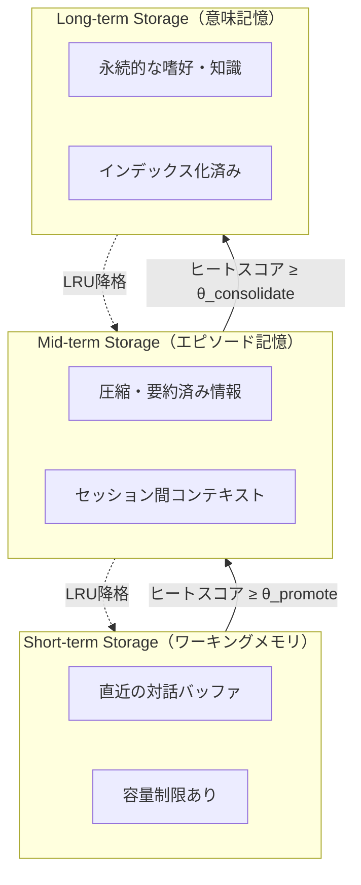

本記事は [MemoryOS: A Memory Operating System for AI Agent (arXiv: 2504.01990)](https://arxiv.org/abs/2504.01990) の解説記事です。

## 論文概要（Abstract）

MemoryOSは、AIエージェントのメモリを短期（Short-term）・中期（Mid-term）・長期（Long-term）の3層で階層的に管理するメモリオペレーティングシステムである。各層間のメモリ移動をアクセス頻度・関連性・時間的近接性に基づくヒートスコアで制御し、人間の記憶固定化プロセスをモデル化している。Gu らが2025年4月に発表し、PersonalLLMベンチマークで最良ベースライン比+15.6%、LocomotionQAで49.0%の精度を達成したと報告している。

この記事は [Zenn記事: Bedrock AgentCoreメモリ障害復旧設計](https://zenn.dev/0h_n0/articles/523ab73e5561db) の深掘りです。Zenn記事のBlobMessageチェックポイントとDynamoDB補完ストアにおける「何をいつ永続化するか」の判断基準として、MemoryOSのヒートスコア設計を技術的に掘り下げる。

## 情報源

- **arXiv ID**: 2504.01990
- **URL**: [https://arxiv.org/abs/2504.01990](https://arxiv.org/abs/2504.01990)
- **著者**: Tiancheng Gu, Junwei Hu, Junyuan Gao, Peng Li, Xing Ba, et al.
- **発表年**: 2025
- **分野**: cs.AI, cs.CL

## 背景と動機（Background & Motivation）

既存のLLMエージェントメモリシステムは、(1) 大量メモリの効率的管理、(2) ユーザーの長期的行動パターンの把握、(3) 最も関連性の高いメモリのリアルタイム検索、という3つの課題に苦戦していた。

MemGPT（Packer et al., 2023）はOS的な2層メモリ（Main Context / External Context）を提案したが、中間的な記憶層（「最近の重要な情報だが、まだ長期記憶として固定するほどではないもの」）の扱いが明確でなかった。また、Generative Agents（Park et al., 2023）のストリーム・要約・リフレクションの3層モデルは、メモリの優先度に基づく自動的な層間移動メカニズムを持っていなかった。

MemoryOSはこれらの先行研究を踏まえ、人間の記憶固定化（memory consolidation）プロセスをアナロジーとして、ヒートスコアによる自動的なメモリ昇格・降格を実現する3層アーキテクチャを提案した。

## 主要な貢献（Key Contributions）

- **貢献1**: Short-term / Mid-term / Long-termの3層階層型メモリアーキテクチャの設計。各層に明確な役割と容量制約を設定
- **貢献2**: ヒートスコアに基づくメモリプロモーション機構。アクセス頻度・関連性・時間近接性の複合スコアでメモリの自動昇格・降格を制御
- **貢献3**: 2つのベンチマーク（LocomotionQA: 49.0%精度、PersonalLLM: +15.6%改善）でMemGPT等のベースラインを上回る性能を報告
- **貢献4**: オープンソースライブラリとしての公開（GitHub: BAI-LAB/MemoryOS）。既存エージェントフレームワークへの統合APIを提供

## 技術的詳細（Technical Details）

### 3層メモリアーキテクチャ



**Short-term Storage（短期記憶）** は最新の対話・インタラクションを保持するバッファである。論文によると、容量制限（設定可能なサイズ上限）を持ち、FIFOまたは優先度ベースの削除ポリシーで管理される。コンテキストウィンドウに直接ロードされる情報がここに格納される。人間の「ワーキングメモリ」に相当する。

**Mid-term Storage（中期記憶）** はShort-termから昇格した情報を保持する。論文では、圧縮・要約処理を経た情報が格納されると説明している。セッションをまたいだ文脈やユーザーの行動パターンが蓄積される。人間の「エピソード記憶」に相当する。

**Long-term Storage（長期記憶）** は頻繁にアクセスされる、または重要度の高い情報のみを格納する。ユーザーの固定的な嗜好・知識・ペルソナ情報がここに保存され、高速アクセスのためにインデックス化されている。人間の「意味記憶・手続き記憶」に相当する。

### ヒートスコアによるプロモーション機構

メモリの昇格は以下の複合スコアで決定される。

$$
S_{\text{heat}} = \alpha \cdot f_{\text{access}} + \beta \cdot r_{\text{relevance}} + \gamma \cdot t_{\text{proximity}}
$$

ここで、
- $f_{\text{access}}$: そのメモリへのアクセス頻度（整数カウント）
- $r_{\text{relevance}}$: 現在のコンテキストとの意味的類似度（埋め込みベクトルのコサイン類似度、$[0, 1]$の範囲）
- $t_{\text{proximity}}$: 直近にアクセスされた時間的な近さ。論文では指数減衰関数 $t_{\text{proximity}} = e^{-\lambda \cdot \Delta t}$ で定義（$\Delta t$は最終アクセスからの経過時間、$\lambda$は減衰率）
- $\alpha, \beta, \gamma$: 重み係数（ハイパーパラメータ）

昇格条件は以下の通りである。

$$
\text{Promote}(m) =
\begin{cases}
\text{Short} \to \text{Mid} & \text{if } S_{\text{heat}}(m) \geq \theta_{\text{promote}} \\
\text{Mid} \to \text{Long} & \text{if } S_{\text{heat}}(m) \geq \theta_{\text{consolidate}}
\end{cases}
$$

ここで $\theta_{\text{promote}}$ と $\theta_{\text{consolidate}}$ は昇格閾値である。著者らの実験では、$\theta_{\text{promote}} < \theta_{\text{consolidate}}$ の関係を設定し、Long-term Storageへの昇格をより厳格にしている。

降格はLRU（Least Recently Used）ベースで実行される。各層の容量上限に達した場合、ヒートスコアが最も低いメモリが下位層に降格される。

### 階層的検索アーキテクチャ

検索は以下の順序で階層的に実行される。

```python
def hierarchical_search(
    query: str, top_k: int = 5
) -> list[dict]:
    """3層を階層的に検索し、最も関連性の高い結果を返す"""
    results = []

    results.extend(search_short_term(query, top_k))

    if len(results) < top_k:
        results.extend(search_mid_term(query, top_k - len(results)))

    if len(results) < top_k:
        results.extend(search_long_term(query, top_k - len(results)))

    results.sort(key=lambda x: x["relevance_score"], reverse=True)
    return results[:top_k]
```

この設計により、大規模メモリプールからの全件検索を回避し、レイテンシを削減する。論文のFigure 4（ベンチマーク結果の図）によると、Flat Retrieval（全件検索）と比較して大幅に低いレイテンシが報告されている。

### パーソナライゼーションモジュール

Mid-term / Long-term Storageに蓄積されたデータから、以下のユーザー属性を自動抽出する。

- **Preferences（好み）**: 出力形式、回答スタイル、言語選択
- **Behavioral Patterns（行動パターン）**: 質問傾向、使用頻度パターン
- **Personal Context（個人的背景）**: 専門分野、組織情報、技術レベル
- **Communication Style（コミュニケーションスタイル）**: 簡潔/詳細、フォーマル/カジュアル

これらを構造化ユーザープロファイルとしてLong-term Storageに格納し、エージェントの応答生成時に参照する。

## 実装のポイント（Implementation）

### Zenn記事のチェックポイント設計との対応

MemoryOSのヒートスコアは、Zenn記事のCheckpointPolicyにおける「いつチェックポイントを保存するか」の判断基準に示唆を与える。

| MemoryOSの概念 | Zenn記事の対応設計 |
|---|---|
| $f_{\text{access}}$（アクセス頻度） | `interval_turns`（ターン間隔による定期保存） |
| $r_{\text{relevance}}$（関連性） | `force_on_status_change`（ステータス変化時の強制保存） |
| $t_{\text{proximity}}$（時間近接性） | Idle Timeout（15分）による自動保存タイミング |
| 3層の昇格 | BlobMessage → DynamoDB → Long-term Memory の3段階フォールバック |

### ハイパーパラメータ調整の注意点

著者らが論文で認めている通り、$\alpha, \beta, \gamma$ と閾値 $\theta_{\text{promote}}, \theta_{\text{consolidate}}$ の設定はドメインに依存する。ヘルプデスクAIの場合、以下の調整指針が考えられる。

- **$\alpha$（アクセス頻度の重み）を高く設定**: 繰り返し参照されるチケット情報は重要度が高い
- **$\gamma$（時間近接性の重み）を中程度に設定**: 対応中のチケットは時間的に近いが、過去の類似事例も参照価値がある
- **$\theta_{\text{consolidate}}$を高めに設定**: Long-termに昇格させるのは確実に重要な情報のみ（ノイズ排除）

### ストレージバックエンドの選択

論文の実装ではPython dictでインメモリ管理（Short-term）、ベクトルDB + 構造化DB（Mid-term / Long-term）を使用している。AWS上での実装では以下の対応が考えられる。

- **Short-term**: ElastiCache Redis（高速アクセス、TTL付き）
- **Mid-term**: DynamoDB（構造化データ） + OpenSearch Serverless（ベクトル検索）
- **Long-term**: DynamoDB（永続化） + Amazon Bedrock Knowledge Bases（セマンティック検索）

## 実験結果（Results）

### LocomotionQAベンチマーク

論文Section 5の実験結果によると、MemoryOSはLocomotionQAタスク（長期的な会話履歴を必要とする質問応答）で49.0%のaccuracyを達成したと報告されている。特にセッション跨ぎの事実参照を要する質問で顕著な改善が見られたとされる。

### PersonalLLMベンチマーク

パーソナライズされた応答生成の評価において、MemoryOSは最良ベースライン比で+15.6%のパーソナライゼーションスコア向上を達成したと著者らは報告している（論文Table 3より）。

### Ablation Study

著者らのアブレーション分析（論文Section 5.3）によると、以下の結果が報告されている。

| 構成 | 性能への影響 |
|---|---|
| 3層すべて使用 | 最高性能 |
| Short-termのみ | Long-termパターンを捉えられず性能低下 |
| Long-termのみ | 直近のコンテキストを失い性能低下 |
| プロモーション機構なし | メモリの整理ができず精度・速度の両方で劣化 |

この結果は、3層構造とプロモーション機構の両方が性能に貢献していることを示唆している。

### 制約と限界

著者ら自身が認めている制約は以下の通りである。

- **ハイパーパラメータ感度**: $\alpha, \beta, \gamma$の最適値はドメインにより異なり、自動探索は未対応
- **プロモーション閾値の設定困難**: 保守的すぎると中長期記憶が育たず、積極的すぎるとノイズが蓄積する
- **スケーラビリティ**: 数ヶ月〜年単位の会話履歴ではLong-term Storageの肥大化リスクがある
- **マルチユーザー対応**: 現在の設計は単一ユーザーを想定。マルチテナント分離は今後の課題

## 実運用への応用（Practical Applications）

MemoryOSの3層設計は、AgentCore Memoryの2層構造（Short-term / Long-term）に対して、Mid-term層を追加する拡張として捉えることができる。Zenn記事のDynamoDB補完ストアは、AgentCore Memoryの外部にMid-term相当の層を追加したものと位置づけられる。

ヘルプデスクAIでの具体的な対応は以下の通りである。

| 情報の種類 | MemoryOS層 | 実装先 |
|---|---|---|
| 現在の対話ターン | Short-term | AgentCore Memory (ConversationalMessage) |
| チケット対応コンテキスト | Mid-term | AgentCore Memory (BlobMessage) + DynamoDB |
| ユーザー部署・端末情報 | Long-term | AgentCore Memory (Long-term, Namespace) |
| 解決済みナレッジ | Long-term | AgentCore Memory (shared Namespace) |

## 関連研究（Related Work）

- **MemGPT** (Packer et al., 2023): MemoryOSの直接的先行研究。2層構造（Main Context / External Context）を提案。MemoryOSは中期記憶の追加とヒートスコアによる自動管理で拡張
- **Generative Agents** (Park et al., 2023): ストリーム・要約・リフレクションの3層メモリ。MemoryOSのプロモーション機構は、Generative Agentsのリフレクション処理を定量化・自動化したものと位置づけられる
- **MemoryBank** (Zhong et al., 2024): Ebbinghaus忘却曲線を応用したメモリシステム。MemoryOSの時間減衰関数$t_{\text{proximity}} = e^{-\lambda \cdot \Delta t}$と設計思想を共有

## まとめと今後の展望

MemoryOSは「何をいつ永続化するか」の判断をヒートスコアで定量化し、3層メモリ階層の自動管理を実現した。PersonalLLMベンチマークでの+15.6%改善は、パーソナライゼーションにおける階層的メモリ管理の有効性を示唆している。

Zenn記事のチェックポイント設計において、MemoryOSのヒートスコアの考え方は「どの情報をDynamoDBにバックアップするか」の優先度決定に応用できる。アクセス頻度・関連性・時間近接性の3軸で情報の重要度を評価し、閾値を超えた情報のみを外部ストアに書き込むことで、ストレージコストと復旧の確実性のバランスを取ることができる。

## 参考文献

- **arXiv**: [https://arxiv.org/abs/2504.01990](https://arxiv.org/abs/2504.01990)
- **Code**: [https://github.com/BAI-LAB/MemoryOS](https://github.com/BAI-LAB/MemoryOS)（Apache 2.0）
- **Related Papers**: [MemGPT (arXiv: 2310.08560)](https://arxiv.org/abs/2310.08560), [Generative Agents (arXiv: 2304.03442)](https://arxiv.org/abs/2304.03442)
- **Related Zenn article**: [https://zenn.dev/0h_n0/articles/523ab73e5561db](https://zenn.dev/0h_n0/articles/523ab73e5561db)
