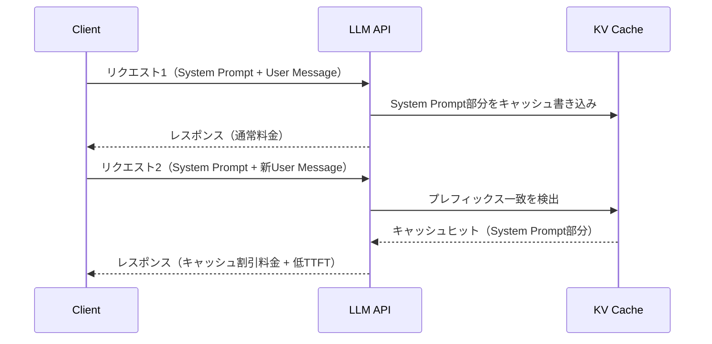
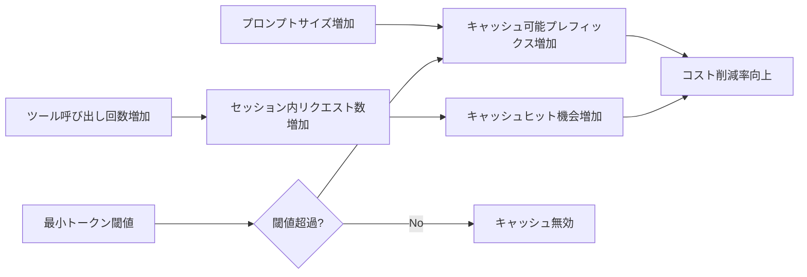

## 論文概要（Abstract）

本記事は [Don't Break the Cache (arXiv: 2601.06007)](https://arxiv.org/abs/2601.06007) の解説記事です。

LLMプロバイダーが提供するプロンプトキャッシュ機能は、APIコストとレイテンシの削減に有効であるが、マルチターンのエージェントワークフローにおける効果は十分に検証されていなかった。著者らは、OpenAI・Anthropic・Googleの3大プロバイダーを対象に、3種類のキャッシュ戦略を500以上のエージェントセッションで評価し、APIコストを41-80%、TTFT（Time To First Token）を最大31%改善できることを実証している。特筆すべきは、ナイーブな全コンテキストキャッシュが逆にレイテンシを悪化させうるという知見であり、戦略的なキャッシュブロック制御の重要性を示している。

この記事は [Zenn記事: Function Calling品質評価入門：BFCL×DeepEval×Langfuseで精度とコストを守る](https://zenn.dev/0h_n0/articles/a6f8423493047e) の深掘りです。

## 情報源

- **arXiv ID**: 2601.06007
- **URL**: [https://arxiv.org/abs/2601.06007](https://arxiv.org/abs/2601.06007)
- **著者**: Elias Lumer, Faheem Nizar, Akshaya Jangiti et al.
- **発表年**: 2026年1月
- **分野**: Computation and Language (cs.CL)

## 背景と動機（Background & Motivation）

### エージェントワークフローのコスト問題

Function Callingを多用するエージェントタスクでは、ツール定義・システムプロンプト・会話履歴・ツール実行結果が蓄積され、リクエストあたりの入力トークン数が急激に膨張する。Zenn記事でも触れられているように、Function Callingの品質評価においてコスト管理は重要な課題であり、1セッションで数万トークンの入力を繰り返すエージェントでは、キャッシュ戦略がコスト効率を大きく左右する。

### 従来の課題

LLMプロバイダー各社はプロンプトキャッシュ機能を提供しているが、以下の問題が未解明であった：

1. **マルチターン環境での実効性**: 単発リクエストでの効果は知られているが、ツール呼び出しを含む長時間セッションでの定量的評価が不足していた
2. **戦略間の優劣**: 全コンテキストキャッシュ、システムプロンプトのみキャッシュ、動的コンテンツ除外キャッシュのどれが最適かが不明であった
3. **プロバイダー間の差異**: 各社の実装差異（最小トークン閾値、キャッシュ書き込み料金体系等）が実務にどう影響するかが整理されていなかった

## 主要な貢献（Key Contributions）

- **貢献1**: 3大プロバイダー（OpenAI, Anthropic, Google）を横断した、エージェントタスクにおけるプロンプトキャッシュの初の包括的ベンチマーク
- **貢献2**: 3種類のキャッシュ戦略（Full Context / System Prompt Only / Exclude Tool Results）の定量比較と、戦略的キャッシュ制御がナイーブキャッシュを上回ることの実証
- **貢献3**: プロンプトサイズ（500-50,000トークン）およびツール呼び出し回数（3-50回）に対するアブレーション研究

## 技術的詳細（Technical Details）

### プロンプトキャッシュの仕組み

プロンプトキャッシュは、LLM APIへのリクエスト間で共通するプレフィックス部分を再利用する機構である。各プロバイダーは入力トークン列の先頭から一致するブロックを検出し、一致部分のKV（Key-Value）キャッシュを再計算なしに利用する。



### 3つのキャッシュ戦略

著者らは以下の3戦略を定義し、比較評価を行っている。

#### 戦略1: No Cache（ベースライン）

システムプロンプトの先頭にユニークな識別子を付与し、プレフィックス一致を意図的に阻止する。全リクエストで完全な再計算が行われる。

#### 戦略2: Full Context Caching（ナイーブキャッシュ）

プロバイダーのキャッシュ機構を無制限に有効化する。動的なツール呼び出し結果やセッション固有のコンテンツもキャッシュ対象に含まれる。

#### 戦略3: System Prompt Only Caching

静的なシステムプロンプト直後にキャッシュ境界を設け、システムプロンプト部分のみをキャッシュする。動的な会話コンテンツは常に再計算される。

#### 戦略4: Exclude Tool Results

Full Contextに近いが、動的なツール実行結果をキャッシュ対象から明示的に除外する。ツール定義や会話構造はキャッシュされるが、実行結果は除外される。

### プロバイダー別の最小キャッシュブロックサイズ

キャッシュが有効になるための最小トークン数はプロバイダーにより異なる（論文Table参照）：

| プロバイダー | モデル | 最小トークン数 |
|:------------|:-------|:-------------|
| OpenAI | GPT-4o, GPT-5.2 | 1,024 |
| Anthropic | Claude Sonnet 4.5 | 1,024 |
| Google | Gemini 2.5 Pro | 4,096 |

Googleの最小閾値が4,096トークンと他社の4倍であるため、小規模なシステムプロンプトではキャッシュが有効にならない場合がある。

### 料金体系の違い

各プロバイダーのトークン料金は以下の通りである（論文記載の2026年1月時点の値）：

| プロバイダー | モデル | 入力（$/1Mトークン） | 出力（$/1Mトークン） | キャッシュ読取（$/1Mトークン） | キャッシュ書込（$/1Mトークン） |
|:------------|:-------|:-------------------|:-------------------|:--------------------------|:--------------------------|
| OpenAI | GPT-4o | $2.50 | $10.00 | $1.25 | なし |
| OpenAI | GPT-5.2 | $1.75 | $14.00 | $0.175 | なし |
| Anthropic | Claude Sonnet 4.5 | $3.00 | $15.00 | $0.30 | $3.75 |
| Google | Gemini 2.5 Pro | $1.25 | $10.00 | $0.125 | なし |

Anthropicのみキャッシュ書き込みに追加料金（入力の1.25倍）が発生する点が特徴的である。OpenAIとGoogleはキャッシュ書き込みに追加料金を課さない。

### コスト削減の数理モデル

エージェントセッション全体のコスト削減率は、キャッシュヒット率とトークン料金体系に依存する。セッション内の$N$回のAPIリクエストに対し、各リクエスト$i$の入力トークン数を$T_i$、キャッシュヒットトークン数を$C_i$とすると：

$$
\text{Cost}_{\text{no\_cache}} = \sum_{i=1}^{N} T_i \cdot p_{\text{input}}
$$

$$
\text{Cost}_{\text{cached}} = \sum_{i=1}^{N} \left[ (T_i - C_i) \cdot p_{\text{input}} + C_i \cdot p_{\text{cache\_read}} + W_i \cdot p_{\text{cache\_write}} \right]
$$

ここで：
- $T_i$: リクエスト$i$の総入力トークン数
- $C_i$: リクエスト$i$でキャッシュから読み取られたトークン数
- $W_i$: リクエスト$i$でキャッシュに書き込まれたトークン数
- $p_{\text{input}}$: 通常の入力トークン単価
- $p_{\text{cache\_read}}$: キャッシュ読取トークン単価
- $p_{\text{cache\_write}}$: キャッシュ書込トークン単価（Anthropicのみ非ゼロ）

コスト削減率は以下で定義される：

$$
\text{Reduction} = 1 - \frac{\text{Cost}_{\text{cached}}}{\text{Cost}_{\text{no\_cache}}}
$$

### DeepResearch Benchの構成

評価にはDeepResearch Benchが使用されている。これはマルチターンのエージェントベンチマークであり、エージェントが自律的にWeb検索ツールを呼び出しながら複雑なリサーチクエスチョンに回答する。主な仕様は以下の通り：

- **セッション数**: 500以上
- **システムプロンプトサイズ**: 10,000トークン
- **評価モデル**: GPT-4o, GPT-5.2, Claude Sonnet 4.5, Gemini 2.5 Pro
- **各条件**: モデルごとに40の独立セッション

## 実験結果（Results）

### モデル別・戦略別の結果

著者らが報告している主要な実験結果を以下に示す：

| モデル | キャッシュ戦略 | コスト削減率 | TTFT改善率 |
|:------|:------------|:-----------|:----------|
| GPT-5.2 | Full Context | 79.3% | 9.5% |
| GPT-5.2 | System Prompt Only | 81.4% | 10.5% |
| GPT-5.2 | Exclude Tool Results | 79.6% | 13.0% |
| Claude Sonnet 4.5 | Full Context | 77.8% | 21.8% |
| Claude Sonnet 4.5 | System Prompt Only | 78.5% | 22.9% |
| Claude Sonnet 4.5 | Exclude Tool Results | 78.1% | 20.9% |
| Gemini 2.5 Pro | Full Context | 38.3% | 6.0% |
| Gemini 2.5 Pro | System Prompt Only | 41.4% | 6.1% |
| Gemini 2.5 Pro | Exclude Tool Results | 27.8% | **-2.9%** |
| GPT-4o | Full Context | 47.8% | **-8.8%** |
| GPT-4o | System Prompt Only | 45.9% | 30.9% |
| GPT-4o | Exclude Tool Results | 46.8% | 28.1% |

### 重要な発見事項

**1. ナイーブキャッシュのレイテンシ逆転現象**

GPT-4oにおいてFull Context Cachingを使用した場合、TTFTが8.8%悪化している。著者らはこの原因を「動的なツール呼び出し結果をキャッシュに書き込むオーバーヘッドが、再利用されないコンテンツに対して発生するため」と分析している。つまり、キャッシュ書き込みのコストが、キャッシュヒットによる恩恵を上回るケースが存在する。

同様にGemini 2.5 ProのExclude Tool Results戦略でもTTFTが2.9%悪化しており、戦略とモデルの組み合わせによって効果が大きく異なることが確認されている。

**2. System Prompt Only戦略の安定性**

System Prompt Only戦略は、全モデルにおいてコスト削減とTTFT改善の両方で安定した成果を示している。特にGPT-4oでは、Full Contextの-8.8%に対してSystem Prompt Onlyでは+30.9%と、劇的な差が生じている。

**3. プロバイダー間の格差**

OpenAI（GPT-5.2）とAnthropic（Claude Sonnet 4.5）が77-81%のコスト削減を達成しているのに対し、Google（Gemini 2.5 Pro）は27-41%にとどまっている。この差は主に最小キャッシュブロックサイズ（4,096トークン）の制約と、キャッシュヒット率の違いに起因すると著者らは分析している。

### アブレーション研究

著者らはプロンプトサイズ（500-50,000トークン）とツール呼び出し回数（3-50回）を変化させたアブレーション研究を実施している。

**プロンプトサイズの影響**: プロバイダーの最小閾値を超えた時点からコスト削減効果が線形に増加する。プロンプトサイズが大きいほど、キャッシュされるプレフィックスの割合が増え、削減効果が高まる。

**ツール呼び出し回数の影響**: ツール呼び出し回数が増えるほど、セッション内のリクエスト数が増加し、キャッシュヒットの恩恵を受ける機会が増える。3回の呼び出しでも効果は確認されるが、50回では効果がさらに顕著になる。



## 実装のポイント（Implementation）

### キャッシュ境界の制御

最も重要な実装上の知見は、**動的コンテンツの配置位置**である。システムプロンプト内に動的な値（タイムスタンプ、ユーザーID等）を含める場合、それらをプロンプトの末尾に配置することで、先頭からの安定したプレフィックスを最大化できる。

```python
# 悪い例: 動的値がプレフィックスを破壊
system_prompt = f"""
Current time: {datetime.now()}  # ← これがキャッシュを無効化
You are a research assistant...
[残り9,900トークンのインストラクション]
"""

# 良い例: 静的コンテンツをプレフィックスに配置
system_prompt = f"""
You are a research assistant...
[9,900トークンのインストラクション]
---
Current time: {datetime.now()}  # ← 末尾なのでプレフィックスは維持
"""
```

### ツール定義の安定化

Function Callingのツール定義は、リクエスト間で変更しないことが望ましい。動的な機能が必要な場合、著者らは従来のFunction Calling定義を変更するのではなく、コード生成による動的機能実現を推奨している。

```python
from openai import OpenAI

client = OpenAI()

# 推奨: ツール定義は固定、動的処理はコード生成で対応
STATIC_TOOLS: list[dict] = [
    {
        "type": "function",
        "function": {
            "name": "execute_code",
            "description": "Execute generated Python code",
            "parameters": {
                "type": "object",
                "properties": {
                    "code": {"type": "string", "description": "Python code to execute"}
                },
                "required": ["code"]
            }
        }
    },
    {
        "type": "function",
        "function": {
            "name": "web_search",
            "description": "Search the web for information",
            "parameters": {
                "type": "object",
                "properties": {
                    "query": {"type": "string", "description": "Search query"}
                },
                "required": ["query"]
            }
        }
    }
]

# ツール定義を固定することでキャッシュプレフィックスが安定
response = client.chat.completions.create(
    model="gpt-4o",
    messages=messages,
    tools=STATIC_TOOLS,  # 毎回同一の定義
)
```

### コンテキスト剪定時の注意

長時間セッションでは会話履歴が膨張するため、コンテキスト剪定（要約や古いメッセージの削除）を行うことがある。しかし、キャッシュされたプレフィックスの途中を変更すると、キャッシュが完全に無効化される。著者らは、剪定を行う場合はキャッシュ境界より後のコンテンツのみを対象にすることを推奨している。

## Production Deployment Guide

プロンプトキャッシュは直接デプロイ可能な最適化手法であり、コード変更のみで効果を得られる。以下にAWS環境でのエージェントシステム構築パターンを示す。

### AWS実装パターン（コスト最適化重視）

プロンプトキャッシュを活用したエージェントシステムのAWS構成を、トラフィック量別に示す。

| 構成 | トラフィック | 主要サービス | 月額概算 |
|:-----|:-----------|:-----------|:---------|
| Small | ~100セッション/日 | Lambda + Bedrock | $80-200 |
| Medium | ~1,000セッション/日 | ECS Fargate + Bedrock | $500-1,200 |
| Large | 10,000+セッション/日 | EKS + Bedrock + ElastiCache | $3,000-8,000 |

**Small構成の内訳**（~100セッション/日）:
- Lambda実行: $5-15/月（256MB, 平均30秒/セッション）
- Bedrock Claude Sonnet: $50-150/月（キャッシュ適用後、セッションあたり~10K入力トークン）
- DynamoDB: $5-10/月（セッション状態管理、On-Demand）
- CloudWatch: $5-10/月

**コスト削減テクニック**:
- **Prompt Caching有効化**: 本論文の知見により41-80%削減（最重要）
- **Bedrock Batch API**: 非リアルタイム処理で50%削減
- **Spot Instances活用**: EKS構成で最大90%削減
- **Reserved Capacity**: Bedrock Provisioned Throughputで長期コミットにより削減

**注意**: 上記コスト試算は2026年5月時点のAWS ap-northeast-1（東京）リージョンの概算値であり、実際のコストはトラフィックパターン、セッション長、モデル選択により変動する。最新料金は[AWS料金計算ツール](https://calculator.aws/)で確認を推奨する。

### Terraformインフラコード

#### Small構成（Serverless: Lambda + Bedrock）

```hcl
# --- Provider & Variables ---
terraform {
  required_version = ">= 1.9"
  required_providers {
    aws = { source = "hashicorp/aws", version = "~> 5.80" }
  }
}

variable "project" { default = "agent-cache" }
variable "environment" { default = "prod" }

# --- IAM Role (最小権限) ---
resource "aws_iam_role" "lambda_agent" {
  name = "${var.project}-lambda-${var.environment}"
  assume_role_policy = jsonencode({
    Version = "2012-10-17"
    Statement = [{
      Action = "sts:AssumeRole"
      Effect = "Allow"
      Principal = { Service = "lambda.amazonaws.com" }
    }]
  })
}

resource "aws_iam_role_policy" "bedrock_invoke" {
  name = "bedrock-invoke"
  role = aws_iam_role.lambda_agent.id
  policy = jsonencode({
    Version = "2012-10-17"
    Statement = [{
      Effect   = "Allow"
      Action   = ["bedrock:InvokeModel", "bedrock:InvokeModelWithResponseStream"]
      Resource = "arn:aws:bedrock:ap-northeast-1::foundation-model/anthropic.claude-sonnet-4-5*"
    }]
  })
}

# --- DynamoDB (セッション状態, On-Demand) ---
resource "aws_dynamodb_table" "sessions" {
  name         = "${var.project}-sessions"
  billing_mode = "PAY_PER_REQUEST"  # コスト最適化: On-Demand
  hash_key     = "session_id"

  attribute {
    name = "session_id"
    type = "S"
  }

  ttl {
    attribute_name = "expires_at"
    enabled        = true  # 古いセッションを自動削除
  }

  server_side_encryption { enabled = true }  # KMS暗号化
}

# --- Lambda Function ---
resource "aws_lambda_function" "agent" {
  function_name = "${var.project}-agent"
  runtime       = "python3.13"
  handler       = "handler.main"
  role          = aws_iam_role.lambda_agent.arn
  memory_size   = 256
  timeout       = 120  # エージェントセッションは長時間

  environment {
    variables = {
      DYNAMODB_TABLE = aws_dynamodb_table.sessions.name
      # システムプロンプトを固定化しキャッシュ効率を最大化
      CACHE_STRATEGY = "system_prompt_only"
    }
  }
}

# --- CloudWatch Alarm (コスト監視) ---
resource "aws_cloudwatch_metric_alarm" "lambda_cost" {
  alarm_name          = "${var.project}-high-invocations"
  comparison_operator = "GreaterThanThreshold"
  evaluation_periods  = 1
  metric_name         = "Invocations"
  namespace           = "AWS/Lambda"
  period              = 3600
  statistic           = "Sum"
  threshold           = 500  # 1時間500回超でアラート
  alarm_description   = "Agent Lambda invocations spike"
  dimensions = {
    FunctionName = aws_lambda_function.agent.function_name
  }
}
```

#### Large構成（Container: EKS + Karpenter + Spot）

```hcl
# --- EKS Cluster ---
module "eks" {
  source          = "terraform-aws-modules/eks/aws"
  version         = "~> 20.31"
  cluster_name    = "${var.project}-eks"
  cluster_version = "1.32"

  vpc_id     = module.vpc.vpc_id
  subnet_ids = module.vpc.private_subnets

  # コスト最適化: マネージドノードグループ不使用、Karpenterで管理
  cluster_endpoint_public_access = false  # セキュリティ: プライベートのみ
}

# --- Karpenter Provisioner (Spot優先) ---
resource "kubectl_manifest" "karpenter_nodepool" {
  yaml_body = yamlencode({
    apiVersion = "karpenter.sh/v1"
    kind       = "NodePool"
    metadata   = { name = "agent-workers" }
    spec = {
      template = {
        spec = {
          requirements = [
            { key = "karpenter.sh/capacity-type", operator = "In", values = ["spot", "on-demand"] },
            { key = "node.kubernetes.io/instance-type", operator = "In",
              values = ["m7i.xlarge", "m7a.xlarge", "m6i.xlarge", "c7i.xlarge"] }
          ]
        }
      }
      limits   = { cpu = "100", memory = "400Gi" }
      disruption = {
        consolidationPolicy = "WhenEmptyOrUnderutilized"
        consolidateAfter    = "30s"  # アイドル時の迅速なスケールダウン
      }
    }
  })
}

# --- AWS Budgets (予算アラート) ---
resource "aws_budgets_budget" "monthly" {
  name         = "${var.project}-monthly"
  budget_type  = "COST"
  limit_amount = "5000"
  limit_unit   = "USD"
  time_unit    = "MONTHLY"

  notification {
    comparison_operator       = "GREATER_THAN"
    threshold                 = 80
    threshold_type            = "PERCENTAGE"
    notification_type         = "FORECASTED"
    subscriber_email_addresses = ["ops-team@example.com"]
  }
}
```

### 運用・監視設定

#### CloudWatch Logs Insights クエリ

```
# Bedrockトークン使用量の時系列分析（コスト異常検知）
fields @timestamp, inputTokens, outputTokens, cacheReadTokens, cacheWriteTokens
| filter @message like /bedrock/
| stats sum(inputTokens) as totalInput,
        sum(cacheReadTokens) as totalCacheRead,
        (sum(cacheReadTokens) / sum(inputTokens)) * 100 as cacheHitRate
  by bin(1h)
| sort @timestamp desc
```

```
# TTFT P95/P99 レイテンシ分析
fields @timestamp, ttft_ms, model, cache_strategy
| filter ispresent(ttft_ms)
| stats percentile(ttft_ms, 95) as p95,
        percentile(ttft_ms, 99) as p99,
        avg(ttft_ms) as mean
  by model, cache_strategy
```

#### X-Ray トレーシング設定

```python
from aws_xray_sdk.core import xray_recorder, patch_all
import boto3

# boto3自動計装
patch_all()

@xray_recorder.capture("agent_session")
def run_agent_session(session_id: str, query: str) -> dict:
    """エージェントセッションのトレーシング

    Args:
        session_id: セッション識別子
        query: ユーザークエリ

    Returns:
        エージェントの最終レスポンス
    """
    subsegment = xray_recorder.current_subsegment()
    subsegment.put_annotation("session_id", session_id)
    subsegment.put_annotation("cache_strategy", "system_prompt_only")

    # Bedrock呼び出し（自動トレース）
    client = boto3.client("bedrock-runtime", region_name="ap-northeast-1")
    response = client.invoke_model(
        modelId="anthropic.claude-sonnet-4-5-20260514-v1:0",
        body=build_request_body(query),
    )

    subsegment.put_metadata("input_tokens", response["usage"]["inputTokens"])
    subsegment.put_metadata("cache_read_tokens", response["usage"].get("cacheReadInputTokens", 0))
    return response
```

#### Cost Explorer 日次レポート

```python
import boto3
from datetime import date, timedelta

def get_daily_cost_report() -> dict:
    """Bedrock/Lambda日次コストレポートを取得

    Returns:
        サービス別コスト辞書
    """
    ce = boto3.client("ce", region_name="us-east-1")
    today = date.today()
    yesterday = today - timedelta(days=1)

    response = ce.get_cost_and_usage(
        TimePeriod={"Start": str(yesterday), "End": str(today)},
        Granularity="DAILY",
        Metrics=["UnblendedCost"],
        Filter={
            "Dimensions": {
                "Key": "SERVICE",
                "Values": ["Amazon Bedrock", "AWS Lambda", "Amazon EKS"]
            }
        },
        GroupBy=[{"Type": "DIMENSION", "Key": "SERVICE"}],
    )

    costs: dict[str, float] = {}
    for group in response["ResultsByTime"][0]["Groups"]:
        service = group["Keys"][0]
        amount = float(group["Metrics"]["UnblendedCost"]["Amount"])
        costs[service] = amount

    total = sum(costs.values())
    if total > 100.0:
        # SNS通知: $100/日超過
        sns = boto3.client("sns", region_name="ap-northeast-1")
        sns.publish(
            TopicArn="arn:aws:sns:ap-northeast-1:123456789012:cost-alert",
            Subject=f"Daily cost alert: ${total:.2f}",
            Message=f"Bedrock agent costs exceeded $100/day.\nBreakdown: {costs}",
        )
    return costs
```

### コスト最適化チェックリスト

**アーキテクチャ選択**:
- [ ] トラフィック量に応じた構成選択（Serverless / Hybrid / Container）
- [ ] キャッシュ戦略はSystem Prompt Onlyをデフォルトに設定

**リソース最適化**:
- [ ] EC2/EKS: Spot Instances優先（Karpenter設定で最大90%削減）
- [ ] Reserved Instances: 安定ワークロードに1年コミット（最大72%削減）
- [ ] Savings Plans: Compute Savings Plansの検討
- [ ] Lambda: メモリサイズをPower Tuningで最適化
- [ ] ECS/EKS: アイドル時の自動スケールダウン（Karpenter consolidation）

**LLMコスト削減**:
- [ ] Prompt Caching有効化（本論文の知見: 41-80%削減）
- [ ] システムプロンプトの動的値を末尾に配置（キャッシュヒット率最大化）
- [ ] ツール定義の固定化（リクエスト間で変更しない）
- [ ] Bedrock Batch API使用（非リアルタイム処理で50%削減）
- [ ] トークン数制限（max_tokens設定）
- [ ] モデル選択ロジック（タスク複雑度に応じてHaiku/Sonnet/Opus切替）

**監視・アラート**:
- [ ] AWS Budgets: 月額予算アラート設定
- [ ] CloudWatch: キャッシュヒット率の監視ダッシュボード
- [ ] Cost Anomaly Detection: 異常コスト自動検知
- [ ] 日次コストレポート: Cost Explorer自動集計+SNS通知
- [ ] TTFT監視: キャッシュ戦略変更後のレイテンシ回帰検知

**リソース管理**:
- [ ] 未使用リソース削除: DynamoDB TTLによるセッション自動削除
- [ ] タグ戦略: プロジェクト・環境・コスト配分タグの統一
- [ ] ライフサイクルポリシー: CloudWatch Logsの保持期間設定
- [ ] 開発環境: 夜間・週末の自動停止スケジュール

## 実運用への応用（Practical Applications）

### Function Calling品質評価との連携

Zenn記事で扱われているBFCL・DeepEval・Langfuseによる品質評価パイプラインにおいて、プロンプトキャッシュは以下の点で直接的に関連する：

1. **評価実行コストの削減**: 同一のシステムプロンプトとツール定義で大量のテストケースを実行する品質評価では、キャッシュヒット率が高くなり、評価コストを大幅に削減できる
2. **A/Bテストの効率化**: プロンプト変更のA/Bテストでは、変更箇所をプロンプト末尾に配置することで、共通プレフィックスのキャッシュを最大限活用できる
3. **CI/CDパイプラインへの統合**: 継続的な品質評価をCI/CDに組み込む際、キャッシュ戦略の適用でランニングコストを抑制できる

### プロバイダー選択の指針

本論文の結果から、ユースケースに応じたプロバイダー選択の指針が導出される：

- **コスト最優先**: GPT-5.2（79.6%削減）またはClaude Sonnet 4.5（78.5%削減）
- **レイテンシ最優先**: GPT-4o + System Prompt Only（30.9%改善）
- **バランス型**: Claude Sonnet 4.5 + System Prompt Only（コスト78.5%削減 + TTFT 22.9%改善）

## 関連研究（Related Work）

- **Efficient Transformers Survey (Tay et al., 2022)**: Transformerの効率化手法を包括的にサーベイした研究。KVキャッシュの再利用はアテンション計算の効率化の一手法として位置づけられ、本論文はこれをAPI利用者の視点から評価している
- **PagedAttention / vLLM (Kwon et al., 2023)**: 推論サーバー側でのKVキャッシュのメモリ管理を効率化する手法。本論文が扱うプロバイダー側のキャッシュ機構の基盤技術に相当する
- **SGLang RadixAttention (Zheng et al., 2024)**: プレフィックス共有による推論効率化フレームワーク。サーバーサイドの実装に対し、本論文はクライアントサイドの戦略最適化に焦点を当てている

## まとめと今後の展望

本論文は、LLMエージェントタスクにおけるプロンプトキャッシュの効果を3大プロバイダーで初めて体系的に評価し、以下の知見を提供している：

1. **戦略的キャッシュ制御の重要性**: ナイーブな全コンテキストキャッシュは逆効果になりうるため、System Prompt Onlyまたは動的コンテンツ除外戦略を採用すべきである
2. **コスト削減の実効性**: 適切な戦略により41-80%のコスト削減が達成可能であり、エージェントシステムの運用コストに大きなインパクトを与える
3. **プロバイダー選択への示唆**: 最小キャッシュブロックサイズや料金体系の違いにより、同一戦略でもプロバイダーごとに効果が大きく異なる

今後の研究方向として、マルチエージェント環境でのキャッシュ共有、動的ツール定義のキャッシュフレンドリーな設計パターン、およびキャッシュ効率を考慮した自動プロンプト最適化が挙げられる。

## 参考文献

- **arXiv**: [https://arxiv.org/abs/2601.06007](https://arxiv.org/abs/2601.06007)
- **Related Zenn article**: [https://zenn.dev/0h_n0/articles/a6f8423493047e](https://zenn.dev/0h_n0/articles/a6f8423493047e)
