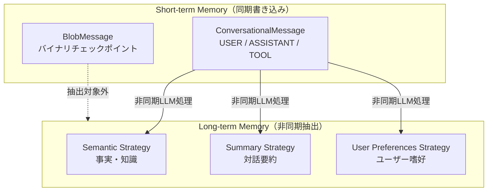

本記事は [Amazon Bedrock AgentCore Memory: Building context-aware agents (AWS Machine Learning Blog)](https://aws.amazon.com/blogs/machine-learning/amazon-bedrock-agentcore-memory-building-context-aware-agents/) の解説記事です。

## ブログ概要（Summary）

AWS Machine Learning Blogが公開したこの記事は、Amazon Bedrock AgentCore Memoryの設計思想と実装パターンを解説するものである。AgentCore Memoryは短期メモリ（Short-term Memory）と長期メモリ（Long-term Memory）の2層で構成され、短期メモリが生の対話イベントを同期的に記録する一方、長期メモリは非同期処理でインサイト・嗜好・事実を抽出し永続化する。BlobMessage、Namespace階層設計、3種類の組み込みメモリ戦略（Semantic/Summary/User Preferences）が中心的なトピックである。

この記事は [Zenn記事: Bedrock AgentCoreメモリ障害復旧設計](https://zenn.dev/0h_n0/articles/523ab73e5561db) の深掘りです。Zenn記事のチェックポイント設計とメモリ統合パターンの公式リファレンスとして本ブログの技術詳細を解説する。

## 情報源

- **種別**: 企業テックブログ（AWS Machine Learning Blog）
- **URL**: [https://aws.amazon.com/blogs/machine-learning/amazon-bedrock-agentcore-memory-building-context-aware-agents/](https://aws.amazon.com/blogs/machine-learning/amazon-bedrock-agentcore-memory-building-context-aware-agents/)
- **組織**: Amazon Web Services
- **発表日**: 2025年

## 技術的背景（Technical Background）

AIエージェントが実用的な価値を提供するためには、対話間で文脈を維持し、ユーザーの嗜好を学習する「記憶」機能が不可欠である。従来のステートレスなLLM呼び出しでは、各リクエストが独立して処理されるため、ユーザーが過去に伝えた情報を再度説明する必要があった。

AgentCore Memoryはこの課題に対し、マネージドサービスとしてのメモリ基盤を提供する。エージェント開発者はメモリの永続化・検索・セキュリティを自前で実装する必要がなく、API呼び出しで短期・長期の記憶を統合できる。MemGPT（Packer et al., 2023）が提案した「LLMをOSとして扱うメモリ階層」の概念を、AWSマネージドサービスとして製品化したものと位置づけられる。

## 実装アーキテクチャ（Architecture）

### 2層メモリ構造

AgentCore Memoryのアーキテクチャは以下の2層で構成される。



### Short-term Memory

Short-term Memoryは生の対話イベントを不変（immutable）なイベントとして保存する。書き込みは同期処理であり、`add_turns`メソッド呼び出し直後にイベントが永続化される。

ブログによると、Short-term Memoryは2種類のイベントペイロードをサポートする。

**ConversationalMessage**: テキストベースの対話メッセージ。ロール（USER/ASSISTANT/TOOL）とテキスト内容を持つ。Long-term Memoryの抽出対象となる。

**BlobMessage**: バイナリデータを格納するイベント。ブログでは「checkpoints or agent state」の保存用途として記述されている。Long-term Memoryの抽出対象外であり、チェックポイントデータがセマンティックメモリに混入しない設計になっている。

### セッション識別子の3層構造

AgentCore Memoryのセッションは3つの識別子で管理される。

| 識別子 | スコープ | 用途 |
|---|---|---|
| `memoryId` | メモリリソース全体 | メモリインスタンスの一意識別子（自動生成） |
| `actorId` | ユーザーまたはエージェント | エンティティレベルの分離 |
| `sessionId` | 対話セッション | 関連イベントのグルーピング |

ブログではこの3層構造を「hierarchical structure」と呼び、精密なコンテキスト検索を可能にすると説明している。Zenn記事のヘルプデスクAIでは、`actorId`にユーザーIDを、`sessionId`にチケットIDを対応させることで、チケット単位のコンテキスト管理が実現できる。

### Long-term Memory と メモリ戦略

Long-term Memoryは非同期処理によって、Short-term Memoryの対話イベントからインサイトを抽出・永続化する。ブログでは3種類の組み込み戦略が紹介されている。

**Semantic Strategy**: 対話中に言及された事実や知識を抽出して保存する。たとえば「ユーザーは東京オフィスに勤務している」という情報を自動的に構造化する。

**Summary Strategy**: 対話の要約を生成・更新する。長い対話セッションの主要ポイントと決定事項を簡潔にまとめる。

**User Preferences Strategy**: ユーザーの好み、選択傾向、スタイルを抽出する。たとえば「JSON形式での出力を好む」「簡潔な回答を求める」といった情報を蓄積する。

ブログによると、すべての戦略はデフォルトでPII（個人識別情報）をフィルタリングする。また、カスタム戦略としてドメイン固有のLLMプロンプトを設定し、独自の抽出ロジックを定義できる。

### Namespace設計

Namespaceはファイルシステムのパスに似た階層構造でメモリを整理する仕組みである。ブログでは動的プレースホルダー（`{actorId}`、`{sessionId}`、`{strategyId}`）をサポートすると説明している。

```python
namespace_examples = {
    "/helpdesk/{actorId}/facts/": "ユーザー個別の事実（部署、端末情報）",
    "/helpdesk/{actorId}/preferences/": "ユーザー個別の嗜好（連絡手段、対応時間帯）",
    "/helpdesk/{actorId}/{sessionId}/summaries/": "セッション別の対話要約",
    "/helpdesk/shared/solutions/": "全エージェント共有のナレッジ",
}
```

Zenn記事でも指摘されている通り、Namespaceは**必ず `/` で始まり `/` で終わる**必要がある。末尾スラッシュを忘れると`ValidationException`が発生し、エラーメッセージからは原因が特定しにくいという注意点がある。

## Production Deployment Guide

### AWS実装パターン（コスト最適化重視）

AgentCore Memoryを本番環境で運用する場合のトラフィック量別推奨構成を以下に示す。

| 規模 | 月間リクエスト | 推奨構成 | 月額コスト | 主要サービス |
|------|--------------|---------|-----------|------------|
| **Small** | ~3,000 (100/日) | Serverless | $50-150 | Lambda + AgentCore Memory + Bedrock |
| **Medium** | ~30,000 (1,000/日) | Hybrid | $300-800 | ECS Fargate + AgentCore Memory + ElastiCache |
| **Large** | 300,000+ (10,000/日) | Container | $2,000-5,000 | EKS + AgentCore Memory + DynamoDB補完 |

**Small構成の詳細（月額$50-150）**:
- **Lambda**: 1GB RAM、60秒タイムアウト。月額約$20
- **AgentCore Memory**: マネージドサービス料金。Short-term/Long-term Memoryの書き込み・読み取りAPI呼び出しに応じた従量課金
- **Bedrock**: Claude 3.5 HaikuでLong-term Memory抽出処理。月額約$60-80
- **API Gateway**: REST API。月額約$5

**コスト削減テクニック**:
- Long-term Memory抽出は非同期処理のため、Bedrock Batch API（50%割引）の活用を検討
- `eventExpiryDuration`を設定してShort-term Memoryの古いイベントを自動期限切れに
- カスタム戦略のLLMプロンプトを最小化し、抽出処理のトークンコストを削減

**コスト試算の注意事項**: 上記は2026年5月時点のAWS ap-northeast-1（東京）リージョン料金に基づく概算値です。AgentCore Memoryのマネージドサービス料金はプレビュー期間中の価格であり、GA時に変更される可能性があります。最新料金は [AWS料金計算ツール](https://calculator.aws/) で確認してください。

### Terraformインフラコード

**Small構成（Serverless）: Lambda + AgentCore Memory**

```hcl
resource "aws_iam_role" "lambda_agentcore" {
  name = "lambda-agentcore-memory-role"

  assume_role_policy = jsonencode({
    Version = "2012-10-17"
    Statement = [{
      Action    = "sts:AssumeRole"
      Effect    = "Allow"
      Principal = { Service = "lambda.amazonaws.com" }
    }]
  })
}

resource "aws_iam_role_policy" "agentcore_memory" {
  role = aws_iam_role.lambda_agentcore.id

  policy = jsonencode({
    Version = "2012-10-17"
    Statement = [
      {
        Effect = "Allow"
        Action = [
          "bedrock-agentcore:CreateMemory",
          "bedrock-agentcore:GetMemory",
          "bedrock-agentcore:CreateSession",
          "bedrock-agentcore:AddTurns",
          "bedrock-agentcore:ListEvents",
          "bedrock-agentcore:SearchLongTermMemories"
        ]
        Resource = "arn:aws:bedrock-agentcore:ap-northeast-1:*:memory/*"
      },
      {
        Effect   = "Allow"
        Action   = ["bedrock:InvokeModel"]
        Resource = "arn:aws:bedrock:ap-northeast-1::foundation-model/anthropic.claude-3-5-haiku*"
      }
    ]
  })
}

resource "aws_lambda_function" "agentcore_handler" {
  filename      = "lambda.zip"
  function_name = "agentcore-memory-handler"
  role          = aws_iam_role.lambda_agentcore.arn
  handler       = "index.handler"
  runtime       = "python3.12"
  timeout       = 60
  memory_size   = 1024

  environment {
    variables = {
      MEMORY_ID       = "mem-helpdesk-prod-001"
      BEDROCK_MODEL   = "anthropic.claude-3-5-haiku-20241022-v1:0"
      AWS_REGION_NAME = "ap-northeast-1"
    }
  }
}

resource "aws_cloudwatch_metric_alarm" "memory_latency" {
  alarm_name          = "agentcore-memory-latency"
  comparison_operator = "GreaterThanThreshold"
  evaluation_periods  = 2
  metric_name         = "Duration"
  namespace           = "AWS/Lambda"
  period              = 300
  statistic           = "p99"
  threshold           = 30000
  alarm_description   = "AgentCore Memory操作のp99レイテンシが30秒超過"

  dimensions = {
    FunctionName = aws_lambda_function.agentcore_handler.function_name
  }
}
```

### セキュリティベストプラクティス

ブログでは以下のセキュリティ機能が説明されている。

- **暗号化**: データは保存時（at rest）と転送時（in transit）の両方で暗号化される。オプションでカスタマーマネージドKMSキーを指定可能
- **IAMアクセス制御**: 最小権限の原則に基づき、memoryId単位でのリソースレベル権限設定が可能
- **PII保護**: すべてのメモリ戦略がデフォルトでPIIをフィルタリング
- **ガードレール**: プロンプトインジェクションとメモリポイズニングに対する防御機構が組み込まれている

### 運用・監視設定

**CloudWatch Logs Insights クエリ**:

```sql
-- Short-term Memory書き込みレイテンシの監視
fields @timestamp, operation, duration_ms
| filter operation = "add_turns"
| stats avg(duration_ms) as avg_latency, pct(duration_ms, 99) as p99_latency by bin(5m)

-- Long-term Memory抽出ジョブの成功率
fields @timestamp, strategy_id, extraction_status
| filter operation = "memory_extraction"
| stats count(*) as total, sum(extraction_status = "SUCCESS") as success by strategy_id
| display strategy_id, success * 100.0 / total as success_rate_pct
```

### コスト最適化チェックリスト

- [ ] `eventExpiryDuration`設定でShort-term Memoryの自動期限切れを有効化（推奨: 30日）
- [ ] カスタム戦略のLLMプロンプト最小化（トークンコスト削減）
- [ ] Long-term Memory検索の`top_k`と`relevance_score`を適切に設定（不要な検索結果の排除）
- [ ] Namespace設計でアクセスパターンに合わせた階層化（検索スコープの最小化）
- [ ] BlobMessageのサイズ監視（大きすぎるチェックポイントはDynamoDB補完ストアに分離）

## パフォーマンス最適化（Performance）

### Short-term Memoryの書き込み特性

ブログではShort-term Memoryの書き込みが同期処理であると明記されている。これはチェックポイントの即座永続化を保証する一方、レスポンスレイテンシへの影響を意味する。Zenn記事のCheckpointPolicyで「3ターンごと」のバッチ書き込みを採用しているのは、この特性を考慮した設計判断である。

### Long-term Memory抽出の非同期性

Long-term Memoryの抽出は非同期処理であり、即時反映されない。ブログではこの特性を明確に述べている。Zenn記事でShort-term Memoryの直近ターンを補完として使用する設計は、この非同期性に対する適切な回避策である。

## 運用での学び（Production Lessons）

### BlobMessageの活用パターン

ブログが明示するBlobMessageの設計意図は「チェックポイントまたはエージェント状態の保存」である。Long-term Memory抽出の対象外であるという特性は、チェックポイントデータがセマンティックメモリを汚染しないことを保証する。Zenn記事のHelpdeskCheckpointデータモデルは、この設計意図に正確に合致している。

### Branching（分岐イベント）

ブログではBranched Event Creationとして、`rootEventId`を指定して対話履歴を分岐させる機能が紹介されている。これはヘルプデスクでのエスカレーション時に、元の対話コンテキストを維持しつつ別の対話ブランチを開始する場合に有用である。

### メモリ戦略の選択ガイド

| ユースケース | 推奨戦略 | 理由 |
|---|---|---|
| ヘルプデスク対応 | Semantic + Summary | チケットの事実情報と対話の経緯の両方が必要 |
| カスタマーサポート | User Preferences + Semantic | ユーザーの好みと過去の問い合わせ事実が重要 |
| 技術コンサルティング | Semantic + カスタム | 技術的な事実と独自の知識抽出ロジックが必要 |

## 学術研究との関連（Academic Connection）

AgentCore Memoryの2層メモリ構造は、MemGPT（Packer et al., 2023）のMain Context / External Contextの概念を製品化したものと位置づけられる。Short-term MemoryはMemGPTのCore Memory + FIFO Queueに対応し、Long-term MemoryはArchival Storageに対応する。

MemoryOS（Gu et al., 2025）が提案する3層構造（Short/Mid/Long-term）との違いとして、AgentCore Memoryは中期記憶を明示的に分離していない点がある。代わりにNamespace階層とメモリ戦略の組み合わせで同等の機能を実現している。

CoALA（Cognitive Architectures for Language Agents, 2023）が定義するエージェントのメモリ分類（作業記憶・エピソード記憶・意味記憶・手続き記憶）では、Short-term MemoryのConversationalMessageがエピソード記憶に、Long-term MemoryのSemantic Strategyが意味記憶に対応する。

## まとめと実践への示唆

AgentCore Memoryは、LLMエージェントのメモリ管理をマネージドサービスとして提供することで、開発者がメモリの永続化・検索・セキュリティを自前で実装する負担を大幅に削減する。BlobMessageによるチェックポイント保存とNamespace階層設計は、Zenn記事のヘルプデスクAI設計の中核をなす機能である。

本番運用では、Short-term Memoryの同期書き込み特性とLong-term Memoryの非同期抽出特性を理解した上で、適切なチェックポイントタイミングとフォールバック設計を行うことが重要である。

## 参考文献

- **Blog URL**: [https://aws.amazon.com/blogs/machine-learning/amazon-bedrock-agentcore-memory-building-context-aware-agents/](https://aws.amazon.com/blogs/machine-learning/amazon-bedrock-agentcore-memory-building-context-aware-agents/)
- **AWS Documentation**: [https://docs.aws.amazon.com/bedrock-agentcore/latest/devguide/memory.html](https://docs.aws.amazon.com/bedrock-agentcore/latest/devguide/memory.html)
- **Related Papers**: [MemGPT (arXiv: 2310.08560)](https://arxiv.org/abs/2310.08560), [MemoryOS (arXiv: 2504.01990)](https://arxiv.org/abs/2504.01990)
- **Related Zenn article**: [https://zenn.dev/0h_n0/articles/523ab73e5561db](https://zenn.dev/0h_n0/articles/523ab73e5561db)
