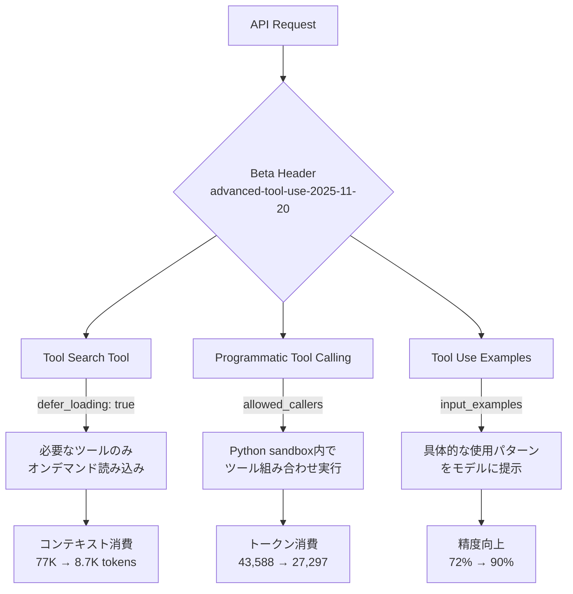
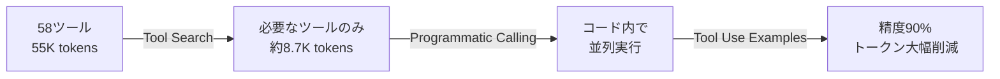

## ブログ概要（Summary）

本記事は [Anthropic Engineering Blog: Introducing advanced tool use](https://www.anthropic.com/engineering/advanced-tool-use) の解説記事です。

Anthropicは2025年11月24日、Claude向けの高度なツール呼び出し機能として3つのベータ機能を発表した。(1) **Tool Search Tool**はツール定義のオンデマンド読み込みによりコンテキストウィンドウの消費を約85%削減する。(2) **Programmatic Tool Calling**はClaudeがPythonコードを生成してツールを組み合わせ実行することで、ループ・条件分岐・並列呼び出しを可能にし、トークン使用量を37%削減する。(3) **Tool Use Examples**はツール定義に具体的な入力例を付与することで、複雑なパラメータ処理の精度を72%から90%に向上させる。これら3機能はいずれもベータヘッダ `betas=["advanced-tool-use-2025-11-20"]` を指定して利用する。

この記事は [Zenn記事: Function Calling品質評価入門：BFCL×DeepEval×Langfuseで精度とコストを守る](https://zenn.dev/0h_n0/articles/a6f8423493047e) の深掘りです。Zenn記事ではFunction Callingの品質評価フレームワークを扱っているが、本記事ではAnthropicが提供するツール呼び出しの精度・効率改善機能そのものに焦点を当てる。

## 情報源

- **種別**: 企業テックブログ
- **URL**: [https://www.anthropic.com/engineering/advanced-tool-use](https://www.anthropic.com/engineering/advanced-tool-use)
- **組織**: Anthropic Engineering
- **著者**: Bin Wu（共著: Adam Jones, Artur Renault, Henry Tay, Jake Noble, Noah Picard, Sam Jiang）
- **発表日**: 2025年11月24日

## 技術的背景（Technical Background）

### ツール呼び出しにおけるトークン消費問題

LLMベースのエージェントが実用化される中で、ツール（Function Calling）の数が増加するにつれてコンテキストウィンドウの圧迫が深刻な問題となっている。ブログの報告によると、GitHub（35ツール、約26Kトークン）、Slack（11ツール、約21Kトークン）、Sentry（5ツール、約3Kトークン）、Grafana（5ツール、約3Kトークン）、Splunk（2ツール、約2Kトークン）の5サーバ構成だけで、ツール定義に約55Kトークンを消費する。Jira単体でも約17Kトークン、ある社内事例では134Kトークンがツール定義だけで消費されていたとされる。

この問題は単にコストの増加だけでなく、モデルの精度低下にも直結する。コンテキストウィンドウの大部分をツール定義が占めることで、ユーザーの入力やタスクの文脈を処理する余地が減り、適切なツール選択や引数生成の精度が下がる。Anthropicはこの課題に対して、ツール定義の遅延読み込み（Tool Search）、ツール呼び出しの効率化（Programmatic Tool Calling）、ツール使用パターンの明示（Tool Use Examples）という3つのアプローチを提示している。

### 学術研究との関連

ツール呼び出しの効率化は、LLMエージェント研究における重要なテーマである。ReAct（Reasoning + Acting）フレームワークでは、モデルが推論と行動を交互に繰り返すことでツールを活用するが、各ステップでの推論・行動のサイクルがトークンを消費する。Anthropicの Programmatic Tool Callingは、このサイクルを1回のコード生成で複数のツール呼び出しに圧縮する点で、ReActの逐次実行の非効率性を解決するアプローチといえる。

## 実装アーキテクチャ（Architecture）

### 全体像

3つの機能は独立して利用できるが、組み合わせることで相乗効果を発揮する。以下に全体のアーキテクチャを示す。



### 共通のAPI構成

3機能すべてを有効化するには、以下のベータヘッダを指定する。

```python
import anthropic

client = anthropic.Anthropic()

response = client.beta.messages.create(
    betas=["advanced-tool-use-2025-11-20"],
    model="claude-sonnet-4-5-20250929",
    max_tokens=4096,
    tools=[
        {"type": "tool_search_tool_regex_20251119", "name": "tool_search_tool_regex"},
        {"type": "code_execution_20250825", "name": "code_execution"},
        # ユーザー定義ツール（defer_loading, allowed_callers, input_examples付き）
    ],
    messages=[{"role": "user", "content": "..."}]
)
```

## 機能1: Tool Search Tool

### 概要と動作原理

Tool Search Toolは、大量のツール定義をすべてコンテキストに読み込むのではなく、Claudeが必要なツールをオンデマンドで発見・読み込む仕組みである。ツール定義に `defer_loading: true` を指定すると、そのツールの完全なスキーマ（`input_schema`）はコンテキストに含まれず、名前と説明文のみが保持される。Claudeがタスク遂行に必要だと判断した時点で初めて完全なスキーマが読み込まれる。

### トークン消費の削減効果

ブログの報告によると、従来の全ツール読み込み方式では作業開始前に約77Kトークンを消費していたのに対し、Tool Search Toolを使用すると約8.7Kトークンに削減される（約85%削減）。また、従来方式では191,300トークンの処理容量のうち多くがツール定義に消費されるが、Tool Searchではこの消費を大幅に抑制できる。

### 精度改善

コンテキスト圧迫の解消により、ツール選択精度も向上する。ブログの報告によると、Opus 4では49%から74%に、Opus 4.5では79.5%から88.1%に改善された。

### 実装方法

個別ツールに `defer_loading: true` を指定する方法と、MCPサーバ単位で一括設定する方法がある。

```json
{
  "tools": [
    {
      "type": "tool_search_tool_regex_20251119",
      "name": "tool_search_tool_regex"
    },
    {
      "name": "github.createPullRequest",
      "description": "Create a pull request",
      "input_schema": {
        "type": "object",
        "properties": {
          "title": {"type": "string"},
          "body": {"type": "string"},
          "base": {"type": "string"},
          "head": {"type": "string"}
        },
        "required": ["title", "base", "head"]
      },
      "defer_loading": true
    }
  ]
}
```

MCPサーバ単位で設定する場合は、`default_config` でデフォルトを `defer_loading: true` に設定しつつ、頻繁に使うツールのみ `defer_loading: false` で即時読み込みにできる。

```json
{
  "type": "mcp_toolset",
  "mcp_server_name": "google-drive",
  "default_config": {"defer_loading": true},
  "configs": {
    "search_files": {
      "defer_loading": false
    }
  }
}
```

この設計により、Prompt Cachingとの互換性も維持される。遅延読み込み対象のツール定義はキャッシュ可能な範囲に含まれるため、繰り返しのリクエストでキャッシュヒット率を保てる。

### ツール検索の内部メカニズム

Tool Search Toolの型名 `tool_search_tool_regex_20251119` が示すとおり、ツール発見には正規表現ベースのマッチングが用いられている。Claudeはタスクに基づいてツール名や説明文を検索するための正規表現パターンを生成し、マッチしたツールのスキーマを読み込む。これは全文検索やembeddingベースの検索と比較して、低レイテンシで決定論的な結果を返す利点がある。

## 機能2: Programmatic Tool Calling

### 概要と動作原理

Programmatic Tool Callingは、Claudeがサンドボックス環境内でPythonコードを生成・実行し、そのコード内から複数のツールを組み合わせて呼び出す機能である。従来のFunction Callingでは、1回のレスポンスで1つ（またはparallel tool useで複数）のツールを呼び出し、結果を受け取って次のツール呼び出しを判断するという逐次的なループが必要だった。

Programmatic Tool Callingではこのループをコード内に閉じ込めることで、以下を実現する。

- **ループ処理**: for/whileでの繰り返しツール呼び出し
- **条件分岐**: if/elseによる結果に基づく分岐
- **並列実行**: `asyncio.gather` による複数ツールの同時呼び出し
- **データ変換**: 中間結果のフィルタリング・集約

### トークン削減効果

ブログの報告によると、平均トークン使用量は43,588トークンから27,297トークンへと37%削減された。これは、従来の逐次的な推論→行動サイクルで発生していた中間的な思考トークンや、ツール結果の再解釈に必要なトークンが不要になったためである。

### 精度改善

- 内部知識検索ベンチマーク: 25.6%から28.5%に向上
- GIA（General Intelligence Assessment）ベンチマーク: 46.5%から51.2%に向上

### 実装方法

`code_execution` ツールをツールリストに追加し、プログラマティック呼び出しの対象とするツールには `allowed_callers` パラメータを指定する。

```json
{
  "tools": [
    {
      "type": "code_execution_20250825",
      "name": "code_execution"
    },
    {
      "name": "get_team_members",
      "description": "Get all members of a department",
      "input_schema": {
        "type": "object",
        "properties": {
          "department": {"type": "string"}
        },
        "required": ["department"]
      },
      "allowed_callers": ["code_execution_20250825"]
    }
  ]
}
```

`allowed_callers` はセキュリティ上の制御も兼ねている。このパラメータを指定したツールは、コード実行環境からのみ呼び出し可能となり、Claudeが直接（トップレベルの tool_use として）呼び出すことはできない。

### 具体例: 予算超過検出

以下はブログで紹介されている、チームメンバーの四半期予算超過を検出する例である。

```python
# Claudeが生成するコード（サンドボックス内で実行）
import asyncio
import json

# 1. チームメンバー一覧を取得
team = await get_team_members("engineering")

# 2. ユニークなレベルごとの予算を並列取得
levels = list(set(m["level"] for m in team))
budget_results = await asyncio.gather(*[
    get_budget_by_level(level) for level in levels
])
budgets = {level: budget for level, budget in zip(levels, budget_results)}

# 3. 全メンバーの経費を並列取得
expenses = await asyncio.gather(*[
    get_expenses(m["id"], "Q3") for m in team
])

# 4. 予算超過メンバーを抽出
exceeded = []
for member, exp in zip(team, expenses):
    budget = budgets[member["level"]]
    total = sum(e["amount"] for e in exp)
    if total > budget["travel_limit"]:
        exceeded.append({
            "name": member["name"],
            "spent": total,
            "limit": budget["travel_limit"]
        })

print(json.dumps(exceeded))
```

このコードでは3種類のツール（`get_team_members`、`get_budget_by_level`、`get_expenses`）を組み合わせ、`asyncio.gather` による並列呼び出しで効率化している。従来方式では、メンバー取得 → 各メンバーの経費取得（N回の逐次呼び出し）→ 予算取得 → 比較という多数のラウンドトリップが必要だったが、Programmatic Tool Callingでは1回のコード生成で完結する。

### ツール呼び出しの通信プロトコル

コード実行環境からのツール呼び出しは、APIレスポンス内に `caller` フィールド付きの `tool_use` ブロックとして返される。

```json
{
  "type": "tool_use",
  "id": "toolu_xyz",
  "name": "get_expenses",
  "input": {"user_id": "emp_123", "quarter": "Q3"},
  "caller": {
    "type": "code_execution_20250825",
    "tool_id": "srvtoolu_abc"
  }
}
```

ツール結果は `code_execution_tool_result` 型で返す。

```json
{
  "type": "code_execution_tool_result",
  "tool_use_id": "srvtoolu_abc",
  "content": {
    "stdout": "[{\"name\": \"Alice\", \"spent\": 12500, \"limit\": 10000}]"
  }
}
```

この設計により、クライアント側はコード実行環境からの呼び出しと通常の呼び出しを区別でき、適切な結果の返却が可能である。

## 機能3: Tool Use Examples

### 概要と動作原理

Tool Use Examplesは、ツール定義に `input_examples` フィールドを追加することで、Claudeにツールの具体的な使い方を示す機能である。JSONスキーマだけでは伝わりにくい「どのような値をどのフィールドに入れるべきか」を、実例で明示できる。

### 精度改善

ブログの報告によると、複雑なパラメータ処理の精度が72%から90%に向上した。特にネストされたオブジェクト、列挙型の値選択、オプショナルフィールドの使い分けなどで効果が大きい。

### 実装方法

```json
{
  "name": "create_ticket",
  "input_schema": {
    "type": "object",
    "properties": {
      "title": {"type": "string"},
      "priority": {"type": "string", "enum": ["low", "medium", "high", "critical"]},
      "labels": {"type": "array", "items": {"type": "string"}},
      "reporter": {
        "type": "object",
        "properties": {
          "id": {"type": "string"},
          "name": {"type": "string"},
          "contact": {
            "type": "object",
            "properties": {
              "email": {"type": "string"},
              "phone": {"type": "string"}
            }
          }
        }
      },
      "due_date": {"type": "string"},
      "escalation": {
        "type": "object",
        "properties": {
          "level": {"type": "integer"},
          "notify_manager": {"type": "boolean"},
          "sla_hours": {"type": "integer"}
        }
      }
    },
    "required": ["title"]
  },
  "input_examples": [
    {
      "title": "Login page returns 500 error",
      "priority": "critical",
      "labels": ["bug", "authentication", "production"],
      "reporter": {
        "id": "USR-12345",
        "name": "Jane Smith",
        "contact": {
          "email": "jane@acme.com",
          "phone": "+1-555-0123"
        }
      },
      "due_date": "2024-11-06",
      "escalation": {
        "level": 2,
        "notify_manager": true,
        "sla_hours": 4
      }
    },
    {
      "title": "Add dark mode support",
      "labels": ["feature-request", "ui"],
      "reporter": {
        "id": "USR-67890",
        "name": "Alex Chen"
      }
    },
    {
      "title": "Update API documentation"
    }
  ]
}
```

ここでのポイントは、3つの例が段階的に複雑さを変えている点である。1つ目はすべてのフィールドを使用した完全な例、2つ目は一部のフィールドを省略した中間的な例、3つ目は必須フィールドのみの最小限の例である。この段階的な例示により、Claudeはオプショナルフィールドの使い分けを学習できる。

### Few-shot Learningとの関係

Tool Use Examplesは、プロンプトエンジニアリングにおけるFew-shot Learningと同じ原理に基づいている。LLMは抽象的なスキーマ定義よりも具体的な入出力例から使用パターンを推論する方が精度が高い。ただし、Tool Use Examplesはシステムプロンプト内のfew-shot例とは異なり、ツール定義に構造化された形で組み込まれるため、Prompt Cachingの恩恵を受けやすく、例の管理も容易である。

## パフォーマンス最適化（Performance）

### トークン消費の比較

以下にブログで報告されている各機能のトークン消費改善をまとめる。

| 機能 | 指標 | Before | After | 改善率 |
|------|------|--------|-------|--------|
| Tool Search | コンテキスト消費 | ~77K tokens | ~8.7K tokens | 約85%削減 |
| Programmatic Calling | 平均トークン使用量 | 43,588 tokens | 27,297 tokens | 37%削減 |
| Tool Use Examples | 複雑パラメータ精度 | 72% | 90% | +18pt |

### モデル別の精度改善（Tool Search）

| モデル | Before | After | 改善幅 |
|--------|--------|-------|--------|
| Opus 4 | 49% | 74% | +25pt |
| Opus 4.5 | 79.5% | 88.1% | +8.6pt |

### Programmatic Tool Callingの精度改善

| ベンチマーク | Before | After | 改善幅 |
|-------------|--------|-------|--------|
| 内部知識検索 | 25.6% | 28.5% | +2.9pt |
| GIA | 46.5% | 51.2% | +4.7pt |

### 3機能の組み合わせ効果

3機能は独立して使用可能だが、組み合わせることで効果が増幅される。例えば、Tool Searchでツール定義のトークン消費を削減した上で、Programmatic Tool Callingで推論サイクルのトークンを削減し、Tool Use Examplesで精度を底上げするという構成が考えられる。



## 運用での学び（Production Lessons）

### Claude for Excelの事例

ブログによると、Claude for ExcelはProgrammatic Tool Callingを本番環境で活用している。スプレッドシートの数千行を操作する場合、従来方式では各行の操作ごとにツール呼び出しのラウンドトリップが発生し、コンテキストウィンドウが急速に消費されていた。Programmatic Tool Callingにより、ループ処理をコード内に閉じ込めることで、コンテキストオーバーフローを回避しつつ大量行の処理を実現している。

### 段階的な導入戦略

ブログの内容から導出される段階的な導入アプローチは以下のとおりである。

1. **Phase 1: Tool Use Examples導入** - 既存ツール定義に `input_examples` を追加するだけで精度向上が得られる。既存のAPI呼び出しコードの変更が不要なため、最もリスクが低い。

2. **Phase 2: Tool Search Tool導入** - ツール数が多い環境で `defer_loading: true` を設定する。MCP Server単位での一括設定が効率的である。

3. **Phase 3: Programmatic Tool Calling導入** - 複数ツールの組み合わせが必要なワークフローで `code_execution` と `allowed_callers` を導入する。サンドボックス環境でのコード実行となるため、セキュリティモデルの検討が必要。

### 監視すべき指標

- **トークン使用量**: API応答の `usage` フィールドで `input_tokens` と `output_tokens` を監視する
- **ツール呼び出し回数**: Programmatic Tool Callingでは1回のAPI呼び出しで複数のツール結果が返されるため、従来とは異なるカウント方法が必要
- **ツール検索のヒット率**: Tool Search Toolが適切なツールを発見できているかの監視

## 学術研究との関連（Academic Connection）

### ReActフレームワークとの比較

ReAct（Yao et al., 2022）はLLMに推論（Thought）と行動（Action）を交互に行わせるフレームワークである。Programmatic Tool Callingは、ReActの推論-行動サイクルを1回のコード生成に圧縮するアプローチと位置付けられる。ReActでは各ステップで思考トークンが発生するが、Programmatic Tool Callingではコード内のコメントや変数名がその役割を担うため、トークン効率が高い。

### Toolformerとの関連

Toolformer（Schick et al., 2023）はLLMが自律的にツール呼び出しを学習する手法であるが、Tool Use Examplesはこの学習をインコンテキストで行うアプローチと解釈できる。学習済みモデルの重みを変更せず、推論時に例を提示するだけで精度が向上する点で、Prompt Engineeringの延長線上にある。

### Berkeley Function Calling Leaderboard（BFCL）

Zenn記事で取り上げられているBFCLは、Function Callingの品質評価ベンチマークである。Anthropicのブログで報告されている精度指標とBFCLのスコアは直接比較できないが、Tool Use Examplesによる精度改善（72% → 90%）は、BFCLが評価する「複雑なパラメータ処理」と同じ課題領域を対象としている。

## Production Deployment Guide

本ブログはClaude APIの新機能を扱っており、実装アーキテクチャが明確に記載されているため、AWSでのプロダクション環境構築ガイドを示す。

### AWS実装パターン（コスト最適化重視）

Advanced Tool Use APIを活用したエージェントシステムのAWS構成を、トラフィック量別に示す。コスト試算は2026年5月時点のap-northeast-1（東京）リージョン概算値であり、実際のコストはトラフィックパターンやバースト使用量により変動する。

| 構成 | トラフィック | 主要サービス | 月額概算 |
|------|-------------|-------------|----------|
| Small | ~100 req/日 | Lambda + Bedrock | $50-150 |
| Medium | ~1,000 req/日 | ECS Fargate + Bedrock | $300-800 |
| Large | 10,000+ req/日 | EKS + Spot + Bedrock | $2,000-5,000 |

**Small構成の内訳**: Lambda（$5-15）+ Bedrock Claude API（$30-100、トークン量依存）+ DynamoDB On-Demand（$5-15）+ CloudWatch（$5-10）+ API Gateway（$5-10）

**Medium構成の内訳**: ECS Fargate 2タスク（$80-150）+ Bedrock Claude API（$150-500）+ ElastiCache Redis（$30-60）+ ALB（$20-30）+ DynamoDB（$20-60）

**Large構成の内訳**: EKS コントロールプレーン（$73）+ EC2 Spot Instances（$300-800）+ Bedrock Claude API（$1,000-3,000）+ ElastiCache（$100-200）+ その他（$200-500）

**コスト削減テクニック**:
- Spot Instances活用: On-Demand比で最大90%削減
- Bedrock Prompt Caching: Tool Search Toolの `defer_loading` ツール定義はキャッシュ可能。繰り返しリクエストで30-90%のトークンコスト削減
- Reserved Instances（1年コミット）: 最大72%削減
- Programmatic Tool Callingによるトークン削減: 37%のトークン節約がそのままBedrock API費用の削減に直結

### Terraformインフラコード

**Small構成（Serverless）**:

```hcl
# Small構成: Lambda + Bedrock + DynamoDB
# Advanced Tool Use APIエージェント用

terraform {
  required_version = ">= 1.8"
  required_providers {
    aws = { source = "hashicorp/aws", version = "~> 5.80" }
  }
}

provider "aws" {
  region = "ap-northeast-1"
}

# IAMロール（最小権限: Bedrock InvokeModel + DynamoDB CRUD）
resource "aws_iam_role" "agent_lambda" {
  name = "advanced-tool-use-agent-lambda"
  assume_role_policy = jsonencode({
    Version = "2012-10-17"
    Statement = [{
      Action = "sts:AssumeRole"
      Effect = "Allow"
      Principal = { Service = "lambda.amazonaws.com" }
    }]
  })
}

resource "aws_iam_role_policy" "bedrock_invoke" {
  name = "bedrock-invoke"
  role = aws_iam_role.agent_lambda.id
  policy = jsonencode({
    Version = "2012-10-17"
    Statement = [{
      Effect   = "Allow"
      Action   = ["bedrock:InvokeModel", "bedrock:InvokeModelWithResponseStream"]
      Resource = "arn:aws:bedrock:ap-northeast-1::foundation-model/anthropic.*"
    }]
  })
}

# DynamoDB（会話履歴・ツール結果キャッシュ）
resource "aws_dynamodb_table" "tool_cache" {
  name         = "advanced-tool-use-cache"
  billing_mode = "PAY_PER_REQUEST"  # コスト最適化: On-Demand
  hash_key     = "session_id"
  range_key    = "tool_call_id"

  attribute {
    name = "session_id"
    type = "S"
  }
  attribute {
    name = "tool_call_id"
    type = "S"
  }

  server_side_encryption { enabled = true }  # KMS暗号化
  ttl { attribute_name = "expires_at", enabled = true }
}

# Lambda関数
resource "aws_lambda_function" "agent" {
  function_name = "advanced-tool-use-agent"
  runtime       = "python3.12"
  handler       = "handler.lambda_handler"
  role          = aws_iam_role.agent_lambda.arn
  timeout       = 300  # Programmatic Tool Callingは複数ツール呼び出しのため長めに設定
  memory_size   = 512

  environment {
    variables = {
      DYNAMODB_TABLE = aws_dynamodb_table.tool_cache.name
      BEDROCK_MODEL  = "anthropic.claude-sonnet-4-5-20250929-v1:0"
      BETA_FEATURES  = "advanced-tool-use-2025-11-20"
    }
  }

  tracing_config { mode = "Active" }  # X-Ray有効化
}

# CloudWatchアラーム（コスト監視）
resource "aws_cloudwatch_metric_alarm" "lambda_duration" {
  alarm_name          = "agent-lambda-high-duration"
  comparison_operator = "GreaterThanThreshold"
  evaluation_periods  = 3
  metric_name         = "Duration"
  namespace           = "AWS/Lambda"
  period              = 300
  statistic           = "Average"
  threshold           = 60000  # 60秒超過で警告
  dimensions = { FunctionName = aws_lambda_function.agent.function_name }
}
```

**Large構成（Container）**:

```hcl
# Large構成: EKS + Karpenter + Spot Instances

module "eks" {
  source          = "terraform-aws-modules/eks/aws"
  version         = "~> 20.31"
  cluster_name    = "advanced-tool-use-cluster"
  cluster_version = "1.31"

  vpc_id     = module.vpc.vpc_id
  subnet_ids = module.vpc.private_subnets

  # コスト最適化: マネージドノードグループ不使用、Karpenterで管理
  cluster_endpoint_public_access = false  # セキュリティ: プライベートアクセスのみ
}

# Karpenter Provisioner（Spot優先）
resource "kubectl_manifest" "karpenter_nodepool" {
  yaml_body = yamlencode({
    apiVersion = "karpenter.sh/v1"
    kind       = "NodePool"
    metadata   = { name = "tool-use-agents" }
    spec = {
      template = {
        spec = {
          requirements = [
            { key = "karpenter.sh/capacity-type", operator = "In", values = ["spot", "on-demand"] },
            { key = "node.kubernetes.io/instance-type", operator = "In",
              values = ["m7i.xlarge", "m7i.2xlarge", "m6i.xlarge", "m6i.2xlarge"] }
          ]
        }
      }
      limits   = { cpu = "100", memory = "400Gi" }
      disruption = { consolidationPolicy = "WhenEmptyOrUnderutilized" }
    }
  })
}

# AWS Budgets（月額予算アラート）
resource "aws_budgets_budget" "monthly" {
  name         = "advanced-tool-use-monthly"
  budget_type  = "COST"
  limit_amount = "5000"
  limit_unit   = "USD"
  time_unit    = "MONTHLY"

  notification {
    comparison_operator       = "GREATER_THAN"
    threshold                 = 80  # 80%到達で通知
    threshold_type            = "PERCENTAGE"
    notification_type         = "ACTUAL"
    subscriber_email_addresses = ["ops-team@example.com"]
  }
}
```

### 運用・監視設定

**CloudWatch Logs Insights クエリ**（Bedrockトークン使用量の異常検知）:

```
fields @timestamp, @message
| filter @message like /input_tokens/
| stats sum(input_tokens) as total_input, sum(output_tokens) as total_output by bin(1h)
| sort @timestamp desc
```

**CloudWatch アラーム設定（Python）**:

```python
import boto3

cloudwatch = boto3.client("cloudwatch", region_name="ap-northeast-1")

def create_bedrock_token_alarm() -> None:
    """Bedrockトークン使用量スパイク検知アラーム"""
    cloudwatch.put_metric_alarm(
        AlarmName="bedrock-token-spike",
        MetricName="InputTokenCount",
        Namespace="AWS/Bedrock",
        Statistic="Sum",
        Period=3600,
        EvaluationPeriods=1,
        Threshold=500000,  # 1時間あたり50万トークン超過で警告
        ComparisonOperator="GreaterThanThreshold",
        AlarmActions=["arn:aws:sns:ap-northeast-1:123456789012:ops-alerts"],
    )
```

**X-Ray トレーシング設定（Python）**:

```python
from aws_xray_sdk.core import xray_recorder, patch_all

patch_all()  # boto3自動計装

@xray_recorder.capture("tool_use_agent")
def handle_tool_use(session_id: str, user_message: str) -> dict:
    """Advanced Tool Useエージェントのトレーシング"""
    subsegment = xray_recorder.current_subsegment()
    subsegment.put_annotation("session_id", session_id)
    subsegment.put_metadata("beta_features", "advanced-tool-use-2025-11-20")
    # ... Bedrock呼び出し処理
    return result
```

**Cost Explorer自動レポート（Python）**:

```python
import boto3
from datetime import date, timedelta

ce = boto3.client("ce", region_name="us-east-1")
sns = boto3.client("sns", region_name="ap-northeast-1")

def daily_cost_report() -> None:
    """日次コストレポート取得・通知"""
    today = date.today()
    yesterday = today - timedelta(days=1)

    response = ce.get_cost_and_usage(
        TimePeriod={"Start": str(yesterday), "End": str(today)},
        Granularity="DAILY",
        Metrics=["UnblendedCost"],
        GroupBy=[{"Type": "DIMENSION", "Key": "SERVICE"}],
    )

    total = sum(
        float(g["Metrics"]["UnblendedCost"]["Amount"])
        for g in response["ResultsByTime"][0]["Groups"]
    )

    if total > 100:  # $100/日超過で通知
        sns.publish(
            TopicArn="arn:aws:sns:ap-northeast-1:123456789012:cost-alerts",
            Subject=f"Daily cost alert: ${total:.2f}",
            Message=f"Bedrock + Lambda cost exceeded $100/day: ${total:.2f}",
        )
```

### コスト最適化チェックリスト

**アーキテクチャ選択**:
- [ ] トラフィック量に応じた構成選定（~100 req/日: Serverless、~1000: Hybrid、10000+: Container）
- [ ] マイクロサービス分割の適切性確認

**リソース最適化**:
- [ ] EC2/EKS: Spot Instances優先（On-Demand比90%削減）
- [ ] Reserved Instances: 1年コミットで最大72%削減
- [ ] Savings Plans: コンピューティング使用量コミットの検討
- [ ] Lambda: メモリサイズ最適化（Power Tuningツール活用）
- [ ] ECS/EKS: アイドル時のスケールダウン設定（Karpenter consolidation）

**LLMコスト削減**:
- [ ] Bedrock Prompt Caching有効化（defer_loadingツール定義のキャッシュ）
- [ ] Programmatic Tool Calling導入（トークン37%削減）
- [ ] Tool Search Tool導入（コンテキスト85%削減）
- [ ] モデル選択ロジック（簡単なタスクはHaiku、複雑なタスクはSonnet/Opus）
- [ ] max_tokensの適切な制限

**監視・アラート**:
- [ ] AWS Budgets: 月額予算アラート設定
- [ ] CloudWatch: トークン使用量・レイテンシアラーム
- [ ] Cost Anomaly Detection: 異常コスト検知の有効化
- [ ] 日次コストレポート: SNS通知連携

**リソース管理**:
- [ ] 未使用リソースの定期削除（Lambda旧バージョン、未使用ECRイメージ）
- [ ] タグ戦略: `project`, `environment`, `cost-center` タグ必須
- [ ] DynamoDBのTTL設定（セッションデータの自動削除）
- [ ] 開発環境の夜間・週末停止
- [ ] CloudTrail/Config有効化（監査・コンプライアンス）

## まとめと実践への示唆

Anthropicが発表したAdvanced Tool Useの3機能は、LLMエージェントのツール呼び出しにおけるトークン効率と精度の両面を改善する。Tool Search Toolによるコンテキスト消費の85%削減は、大量のツールを扱うエージェントシステムにおいて特にインパクトが大きい。Programmatic Tool Callingは従来の逐次的なツール呼び出しパターンを根本的に変え、コード内でのループ・並列処理を可能にした。Tool Use Examplesは導入の手軽さと精度改善効果（+18pt）のバランスに優れている。

実務的には、まずTool Use Examplesから導入し、ツール数が増えた段階でTool Search Toolを追加、複雑なマルチツールワークフローにProgrammatic Tool Callingを適用するという段階的なアプローチが推奨される。Zenn記事で扱われているBFCLやDeepEvalによる品質評価と組み合わせることで、これらの機能導入前後の精度・コスト変化を定量的に評価できる。

## 参考文献

- **Blog URL**: [https://www.anthropic.com/engineering/advanced-tool-use](https://www.anthropic.com/engineering/advanced-tool-use)
- **Tool Search Tool Documentation**: [https://docs.anthropic.com/en/docs/build-with-claude/tool-use/tool-search](https://docs.anthropic.com/en/docs/build-with-claude/tool-use/tool-search)
- **Programmatic Tool Calling Documentation**: [https://docs.anthropic.com/en/docs/build-with-claude/tool-use/programmatic-tool-calling](https://docs.anthropic.com/en/docs/build-with-claude/tool-use/programmatic-tool-calling)
- **ReAct**: Yao, S. et al. (2022). "ReAct: Synergizing Reasoning and Acting in Language Models." arXiv:2210.03629
- **Toolformer**: Schick, T. et al. (2023). "Toolformer: Language Models Can Teach Themselves to Use Tools." arXiv:2302.04761
- **Related Zenn article**: [https://zenn.dev/0h_n0/articles/a6f8423493047e](https://zenn.dev/0h_n0/articles/a6f8423493047e)
