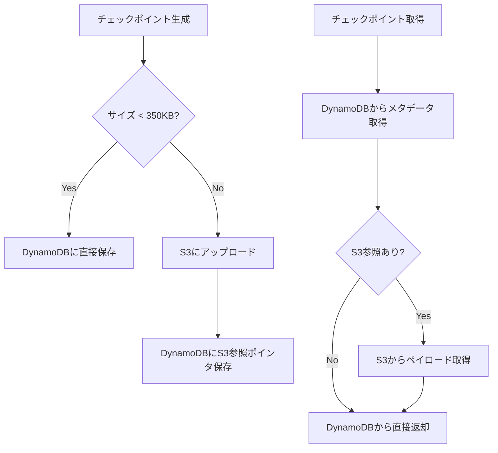

本記事は [Build durable AI agents with LangGraph and Amazon DynamoDB (AWS Database Blog)](https://aws.amazon.com/blogs/database/build-durable-ai-agents-with-langgraph-and-amazon-dynamodb/) の解説記事です。

## ブログ概要（Summary）

AWS Database Blogが2026年1月に公開したこの記事は、LangGraphエージェントの状態永続化にDynamoDBを使用する`DynamoDBSaver`チェックポインターの設計と実装を解説するものである。小さいチェックポイント（350KB未満）はDynamoDBに直接保存し、大きいチェックポイント（350KB以上）はS3にオフロードする2段階ルーティング、TTLによる自動期限切れ、圧縮によるストレージコスト削減が主要な設計要素として説明されている。フォールトトレランス、time-travel debugging、human-in-the-loop ワークフローの3つのユースケースが具体的なコード例とともに紹介されている。

この記事は [Zenn記事: Bedrock AgentCoreメモリ障害復旧設計](https://zenn.dev/0h_n0/articles/523ab73e5561db) の深掘りです。Zenn記事のDynamoDB補完ストア設計の参照実装として、LangGraphのチェックポイント永続化パターンを詳しく掘り下げる。

## 情報源

- **種別**: 企業テックブログ（AWS Database Blog）
- **URL**: [https://aws.amazon.com/blogs/database/build-durable-ai-agents-with-langgraph-and-amazon-dynamodb/](https://aws.amazon.com/blogs/database/build-durable-ai-agents-with-langgraph-and-amazon-dynamodb/)
- **組織**: Amazon Web Services
- **発表日**: 2026年1月

## 技術的背景（Technical Background）

LangGraphはLangChainが提供するエージェントワークフローフレームワークであり、ステートマシンとしてエージェントの実行を管理する。各ノード（処理ステップ）の実行後に状態スナップショット（チェックポイント）を保存することで、障害発生時に最後の成功ステップから再開できる。

開発フェーズでは`InMemorySaver`（揮発性の辞書型ストレージ）が使用されるが、本番環境ではプロセス再起動でチェックポイントが失われる。ブログはこの課題に対し、DynamoDBをバックエンドとする`DynamoDBSaver`を提案している。DynamoDBの単一桁ミリ秒レイテンシ、自動スケーリング、サーバーレスアーキテクチャがエージェントのチェックポイント保存に適していると説明されている。

Zenn記事のDynamoDB補完ストアはAgentCore Memoryの外部に位置するチェックポイントバックアップであるが、LangGraphのDynamoDBSaverはフレームワーク標準のチェックポインターとしてDynamoDBを使用する。両者は設計思想（DynamoDBによるエージェント状態永続化）を共有しており、実装パターンの相互参照が有用である。

## 実装アーキテクチャ（Architecture）

### DynamoDBSaverのペイロードルーティング

ブログが詳しく解説するDynamoDBSaverの中核設計は、チェックポイントサイズに基づく2段階ルーティングである。



**350KBの閾値の理由**: DynamoDBのアイテムサイズ上限は400KBである。350KBの閾値はメタデータ分のマージンを確保しつつ、ほとんどのチェックポイントをDynamoDBに直接保存できるように設計されている。

### DynamoDBテーブルスキーマ

ブログで指定されているテーブル設計は以下の通りである。

| 属性名 | 型 | 役割 |
|---|---|---|
| `PK` | String (Partition Key) | スレッド識別子 |
| `SK` | String (Sort Key) | チェックポイント識別子 |
| `ttl` | Number | TTL属性（自動期限切れ用のUnixタイムスタンプ） |

Single Table Design（単一テーブル設計）が採用されており、PK/SKの組み合わせでスレッド内の複数チェックポイントを時系列順に管理する。

### チェックポイントのデータモデル

ブログによると、各チェックポイント（StateSnapshot）は以下の情報を含む。

- **config**: スレッドID、チェックポイントIDなどのメタデータ
- **state channel values**: グラフの現在の状態変数
- **next nodes**: 次に実行すべきノードのリスト
- **task information**: エラー情報、中断データ

この構造により、任意のチェックポイントから実行を再開できる。

### フォールトトレランスの実現

ブログでは、チェックポイントがLangGraphの各「super-step」（ノード実行の完了単位）で自動的に作成されると説明している。


per-task writesにより、同一super-step内の成功したノードの書き込みはすでに永続化されているため、障害からの再開時に再実行する必要がない。

### Time-travel Debugging

ブログが紹介するtime-travel debugging機能は、過去の任意のチェックポイントに「巻き戻す」ことを可能にする。

```python
from langgraph.graph import StateGraph, END, START
from langgraph_checkpoint_aws import DynamoDBSaver
from typing import TypedDict, Annotated
import operator


class State(TypedDict):
    foo: str
    bar: Annotated[list[str], operator.add]


checkpointer = DynamoDBSaver(
    table_name="agent-checkpoints",
    region_name="ap-northeast-1",
    ttl_seconds=86400 * 30,
    enable_checkpoint_compression=True,
    s3_offload_config={"bucket_name": "agent-checkpoint-bucket"},
)

graph = workflow.compile(checkpointer=checkpointer)

config = {"configurable": {"thread_id": "helpdesk-ticket-001"}}

latest = graph.get_state(config)

checkpoint_id = latest.config["configurable"]["checkpoint_id"]
historical_config = {
    "configurable": {
        "thread_id": "helpdesk-ticket-001",
        "checkpoint_id": checkpoint_id,
    }
}
historical_state = graph.get_state(historical_config)
```

この機能はZenn記事のBlobMessageチェックポイントの`restore_latest_checkpoint`に対応する。DynamoDBSaverは全チェックポイントを保持するため、最新だけでなく任意の時点への巻き戻しが可能である。

### Human-in-the-Loop ワークフロー

ブログでは、エージェントの実行を特定のノードで一時停止し、人間のレビュー後に再開するパターンが紹介されている。チェックポイントがDynamoDBに永続化されているため、レビューに数時間〜数日かかっても状態が失われない。

ヘルプデスクAIの文脈では、エスカレーション判断時に人間のオペレータがコンテキストを確認してから対応を継続するワークフローに対応する。

## Production Deployment Guide

### AWS実装パターン（コスト最適化重視）

DynamoDBSaverを本番環境で運用する場合のトラフィック量別推奨構成を以下に示す。

| 規模 | 月間リクエスト | 推奨構成 | 月額コスト | 主要サービス |
|------|--------------|---------|-----------|------------|
| **Small** | ~3,000 (100/日) | Serverless | $30-80 | Lambda + DynamoDB On-Demand + S3 |
| **Medium** | ~30,000 (1,000/日) | Hybrid | $200-500 | ECS Fargate + DynamoDB Provisioned + S3 |
| **Large** | 300,000+ (10,000/日) | Container | $1,000-3,000 | EKS + DynamoDB + S3 + DAX |

**Small構成の詳細（月額$30-80）**:
- **DynamoDB On-Demand**: チェックポイント読み書き。月額約$10-20
- **S3**: 大規模チェックポイントのオフロード先。月額約$5
- **Lambda**: チェックポインター実行環境。月額約$15-50
- **TTL設定**: 30日で古いチェックポイントを自動削除（コスト削減）

**コスト削減テクニック**:
- `enable_checkpoint_compression=True`でシリアライズ前に圧縮し、DynamoDB WCU消費とS3ストレージを同時削減
- TTLで30日以上前のチェックポイントを自動削除
- S3 Intelligent-Tieringでアクセス頻度に応じたストレージクラス自動遷移

**コスト試算の注意事項**: 上記は2026年5月時点のAWS ap-northeast-1（東京）リージョン料金に基づく概算値です。チェックポイントのサイズと頻度によりDynamoDBのWCU/RCU消費が変動します。最新料金は [AWS料金計算ツール](https://calculator.aws/) で確認してください。

### Terraformインフラコード

**Small構成（Serverless）: DynamoDB + S3**

```hcl
resource "aws_dynamodb_table" "checkpoint_store" {
  name         = "agent-checkpoints"
  billing_mode = "PAY_PER_REQUEST"
  hash_key     = "PK"
  range_key    = "SK"

  attribute {
    name = "PK"
    type = "S"
  }

  attribute {
    name = "SK"
    type = "S"
  }

  ttl {
    attribute_name = "ttl"
    enabled        = true
  }

  server_side_encryption {
    enabled = true
  }

  point_in_time_recovery {
    enabled = true
  }
}

resource "aws_s3_bucket" "checkpoint_overflow" {
  bucket = "agent-checkpoint-overflow-${data.aws_caller_identity.current.account_id}"
}

resource "aws_s3_bucket_server_side_encryption_configuration" "checkpoint" {
  bucket = aws_s3_bucket.checkpoint_overflow.id

  rule {
    apply_server_side_encryption_by_default {
      sse_algorithm = "aws:kms"
    }
  }
}

resource "aws_s3_bucket_public_access_block" "checkpoint" {
  bucket = aws_s3_bucket.checkpoint_overflow.id

  block_public_acls       = true
  block_public_policy     = true
  ignore_public_acls      = true
  restrict_public_buckets = true
}

resource "aws_s3_bucket_lifecycle_configuration" "checkpoint" {
  bucket = aws_s3_bucket.checkpoint_overflow.id

  rule {
    id     = "expire-old-checkpoints"
    status = "Enabled"

    expiration {
      days = 30
    }

    transition {
      days          = 7
      storage_class = "INTELLIGENT_TIERING"
    }
  }
}

resource "aws_cloudwatch_metric_alarm" "ddb_throttle" {
  alarm_name          = "checkpoint-ddb-throttle"
  comparison_operator = "GreaterThanThreshold"
  evaluation_periods  = 1
  metric_name         = "ThrottledRequests"
  namespace           = "AWS/DynamoDB"
  period              = 300
  statistic           = "Sum"
  threshold           = 10
  alarm_description   = "チェックポイントDynamoDBテーブルでスロットリング発生"

  dimensions = {
    TableName = aws_dynamodb_table.checkpoint_store.name
  }
}
```

### セキュリティベストプラクティス

- **DynamoDB暗号化**: サーバーサイド暗号化（SSE）をKMSキーで有効化
- **S3暗号化**: `aws:kms`によるサーバーサイド暗号化
- **パブリックアクセスブロック**: S3バケットの全パブリックアクセスをブロック
- **IAMポリシー**: DynamoDBの`GetItem`/`PutItem`/`Query`/`BatchGetItem`/`BatchWriteItem`とS3の`PutObject`/`GetObject`/`DeleteObject`のみに制限
- **Point-in-time Recovery**: DynamoDBのPITR有効化で誤削除からの復旧を保証

### 運用・監視設定

**CloudWatch Logs Insights クエリ**:

```sql
-- チェックポイントサイズの分布（S3オフロード閾値の妥当性確認）
fields @timestamp, checkpoint_size_bytes
| stats count(*) as total,
  sum(checkpoint_size_bytes < 358400) as under_350kb,
  sum(checkpoint_size_bytes >= 358400) as over_350kb
| display under_350kb * 100.0 / total as pct_in_ddb
```

### コスト最適化チェックリスト

- [ ] DynamoDB On-Demand（低トラフィック）またはProvisioned + Auto Scaling（高トラフィック）を選択
- [ ] TTL設定で30日以上前のチェックポイントを自動削除
- [ ] `enable_checkpoint_compression=True`で圧縮有効化
- [ ] S3 Lifecycle PolicyでIntelligent-Tiering遷移と期限切れ削除を設定
- [ ] チェックポイント頻度の最適化（重要なノードのみにinterruptを設定）
- [ ] DynamoDB Point-in-time RecoveryのコストとRPO要件を比較検討

## パフォーマンス最適化（Performance）

### DynamoDBのレイテンシ特性

ブログではDynamoDBの「single-digit millisecond response times」が強調されている。チェックポイントの読み書きがエージェントのレスポンスレイテンシに与える影響は最小限であり、super-stepごとの自動チェックポイントが実用的に成立する理由はここにある。

一方、S3オフロードが発生するケース（350KB超のチェックポイント）ではS3のレイテンシ（数十〜数百ミリ秒）が加算される。ブログではこのトレードオフについて明示的に言及している。

### 圧縮の効果

`enable_checkpoint_compression=True`を設定すると、チェックポイントのシリアライズ後に圧縮処理が適用される。ブログによると、これによりDynamoDBの書き込みキャパシティユニット（WCU）消費とS3ストレージコストが同時に削減される。圧縮率は状態データの内容に依存するが、テキスト主体のエージェント状態では高い圧縮率が期待できる。

## 運用での学び（Production Lessons）

### InMemorySaverからDynamoDBSaverへの移行

ブログの重要なメッセージは、`InMemorySaver`を`DynamoDBSaver`に置き換えるだけで、ワークフローロジックのコード変更なしにプロダクション対応が完了する点である。

```python
checkpointer = DynamoDBSaver(
    table_name="my_langgraph_checkpoints_table",
    region_name="ap-northeast-1",
    ttl_seconds=86400 * 30,
    enable_checkpoint_compression=True,
    s3_offload_config={"bucket_name": "amzn-s3-demo-bucket"},
)

graph = workflow.compile(checkpointer=checkpointer)
```

### Zenn記事のDynamoDB補完ストアとの比較

| 観点 | LangGraph DynamoDBSaver | Zenn記事 DynamoDB補完ストア |
|---|---|---|
| 位置づけ | フレームワーク標準チェックポインター | AgentCore Memoryの外部バックアップ |
| スキーマ | PK/SK Single Table Design | TICKET#/SESSION# Composite Key |
| 大サイズ対応 | S3自動オフロード（350KB閾値） | サイズ制限なし（DynamoDB直接） |
| 圧縮 | 組み込み圧縮オプション | アプリケーション側で実装 |
| time-travel | 全チェックポイント保持 | 最新チェックポイントのみ |
| TTL | 組み込みサポート | アプリケーション側で設定 |

Zenn記事の設計はAgentCore Memoryが主、DynamoDBが補完という関係であり、LangGraphのようにDynamoDBが唯一のチェックポイントストアではない。この違いが3段階フォールバック設計（Level 1: AgentCore Memory → Level 2: DynamoDB → Level 3: Long-term Memory検索）の根拠となっている。

## 学術研究との関連（Academic Connection）

LangGraphのチェックポイントベースの耐障害性設計は、分散システムにおけるチェックポイント・リスタート技術の応用である。従来の分散計算におけるChandy-Lamportアルゴリズム（分散スナップショット）を、エージェントワークフローの文脈に適応したものと見ることができる。

MemGPT（Packer et al., 2023）のArchival Storage書き込みはLLM自身が判断するのに対し、LangGraphのチェックポインターはフレームワークが自動的に書き込む。この「自律型 vs 自動型」の設計判断は、エージェントアーキテクチャにおける重要なトレードオフである。

## まとめと実践への示唆

LangGraphのDynamoDBSaverは、AIエージェントの状態永続化をDynamoDBの特性（低レイテンシ、自動スケーリング、サーバーレス）を活かして実現する実装パターンを提供する。特にS3オフロード、圧縮、TTLの3つの機能がコスト効率の高い運用を支えている。

Zenn記事のDynamoDB補完ストア設計において、条件付き書き込みによるrace condition防止やComposite Key設計は、DynamoDBSaverの設計から着想を得た実装パターンである。エージェントのチェックポイント永続化は、フレームワーク提供のものであれカスタム実装であれ、DynamoDBのSingle Table Designが適している。

## 参考文献

- **Blog URL**: [https://aws.amazon.com/blogs/database/build-durable-ai-agents-with-langgraph-and-amazon-dynamodb/](https://aws.amazon.com/blogs/database/build-durable-ai-agents-with-langgraph-and-amazon-dynamodb/)
- **AWS Documentation**: [https://docs.aws.amazon.com/amazondynamodb/latest/developerguide/ddb-langgraph-checkpoint.html](https://docs.aws.amazon.com/amazondynamodb/latest/developerguide/ddb-langgraph-checkpoint.html)
- **langgraph-checkpoint-aws (PyPI)**: [https://pypi.org/project/langgraph-checkpoint-aws/](https://pypi.org/project/langgraph-checkpoint-aws/)
- **Related Zenn article**: [https://zenn.dev/0h_n0/articles/523ab73e5561db](https://zenn.dev/0h_n0/articles/523ab73e5561db)
