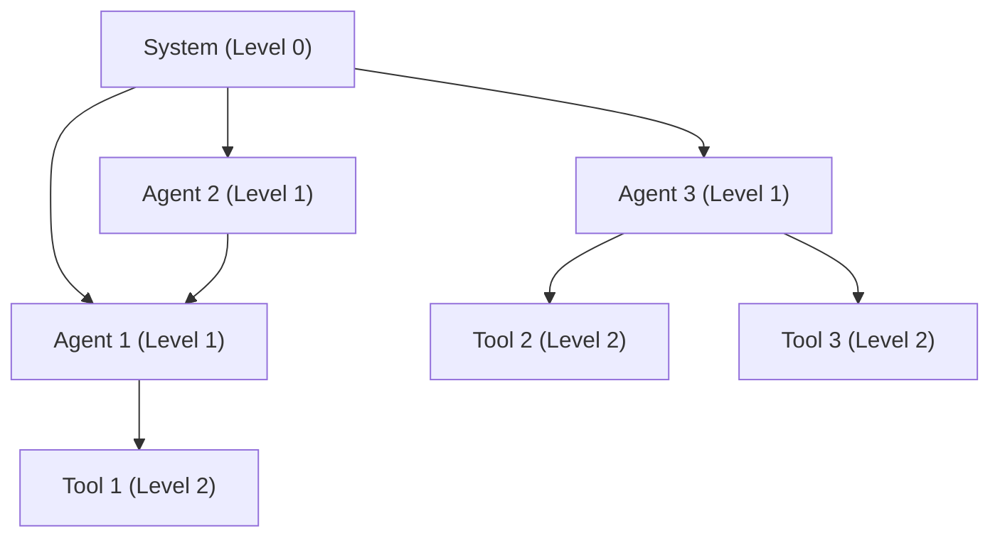

本記事は [AgentTrace: Causal Graph Tracing for Root Cause Analysis in Deployed Multi-Agent Systems](https://arxiv.org/abs/2603.14688) の解説記事です。

この記事は [Zenn記事: マルチエージェント通信のオブザーバビリティ設計：分散トレーシングと障害復旧の実装](https://zenn.dev/0h_n0/articles/b0e2c647f9fc16) の深掘りです。

## 論文概要（Abstract）

マルチエージェントシステム（MAS）の複雑化に伴い、デプロイ後の異常動作に対する根本原因分析（Root Cause Analysis; RCA）の手法が求められている。本論文では、Google DeepMindの研究チームが提案するAgentTraceフレームワークを紹介する。AgentTraceは、システムログから階層的因果グラフを自動構築し、異常な実行パスをトレースしたうえで、LLMベースの推論により根本原因を特定する。著者らが報告する主要な成果として、LLMベースのChain-of-Thoughtアプローチに対してF1スコアで平均12%、グラフベース異常検知に対して18%、ログベースのベースラインに対して27%の改善が得られたとしている。

## 情報源

- **arXiv ID**: 2603.14688
- **URL**: [https://arxiv.org/abs/2603.14688](https://arxiv.org/abs/2603.14688)
- **著者**: Suman Saha, Santhosh Kumar Arumugam, Venkatakrishnan Balasubramanian, Arjun Ramesh Kaushik, Namrata Singh（Google DeepMind）
- **発表年**: 2026年3月
- **分野**: cs.AI, cs.MA

## 背景と動機（Background & Motivation）

マルチエージェントシステムでは、複数の自律エージェントが協調してタスクを遂行する。このとき、エージェント間の複雑な相互作用から創発的な障害が発生し得るが、従来のデバッグ手法では対応が難しい。著者らは既存手法の限界を3つに整理している。

第一に、LangSmithやAgentOpsなどのコードレベルデバッグツールは開発環境に限定されており、デプロイ済みの本番環境では使用できない。第二に、DatadogやJaegerなどのオブザーバビリティツールはテレメトリデータを収集するが、根本原因の自動特定機能を持たない。第三に、LLMベースのログ解析は大規模で複雑なシステムログに対するスケーラビリティに課題がある。

AgentTraceはこれらの課題を「階層的因果グラフトレーシング」で解決することを目指す。特に、因果グラフのトポロジを実行ログから分離し、再利用可能なシステム設計図（blueprint）として活用する点が核心的な設計判断である。

## 主要な貢献（Key Contributions）

著者らは以下の4点を貢献として挙げている。

- **因果グラフトポロジの分離**: 因果グラフのトポロジ（構造）を実行ログから切り離し、一度構築すれば複数のRCAインスタンスで再利用できるようにした
- **階層的因果グラフ**: System（Level 0）/ Agent（Level 1）/ Tool（Level 2）の3層構造で、異なる粒度の依存関係を表現
- **異常パストレーシング**: LLMベースのスコアリングにより、因果グラフ上の疑わしいエージェントやツールを含むパスを特定
- **大規模実証評価**: 5つのベンチマーク（SWE-Bench、AIDE、TravelPlanner、InterCode、AgentBench）、4種類の障害モード、500テストケースで評価

## 技術的詳細（Technical Details）

### 問題定式化

デプロイ済みMASの実行トレース（システムログ）が与えられたとき、エージェント集合 $A = \{A_1, \ldots, A_n\}$、ツール集合 $T = \{T_1, \ldots, T_m\}$、タスク記述 $D$ に対して、観測された異常挙動の根本原因 $RC \in A \cup T \cup \{\emptyset\}$ を特定する。$\emptyset$ は根本原因が特定不能な場合を表す。

### 因果グラフの構築（Component 1）

因果グラフ $CG = (V, E)$ は3層の有向非巡回グラフ（DAG）として定義される。

頂点集合は3つのレベルで構成される。

$$
V = V_{\text{System}} \cup V_{\text{Agent}} \cup V_{\text{Tool}}
$$

ここで、
- $V_{\text{System}}$: 単一のルートノード（Level 0）
- $V_{\text{Agent}} = \{a_1, \ldots, a_n\}$: エージェント頂点（Level 1）
- $V_{\text{Tool}} = \{t_1, \ldots, t_m\}$: ツール頂点（Level 2）

辺集合は3種類で構成される。

$$
E = E_{\text{Sys} \to \text{Agent}} \cup E_{\text{Agent} \to \text{Agent}} \cup E_{\text{Agent} \to \text{Tool}}
$$

エージェント間辺 $E_{\text{Agent} \to \text{Agent}}$ はログ中の通信パターンから抽出される。たとえば、エージェント $A_2$ の出力を $A_1$ が受け取っている場合、因果的依存 $A_2 \to A_1$ が生成される。ツール使用辺 $E_{\text{Agent} \to \text{Tool}}$ は、エージェント $A_3$ がツール $T_2$ を呼び出すパターンから $A_3 \to T_2$ として抽出される。



### 異常パストレーシング（Component 2）

因果グラフと異常トレースログ $L$ が与えられたとき、各エージェント $a_i$ とツール $t_j$ の異常スコアをLLMベースのログフラグメント解析で推定する。

$$
S(a_i) = \text{LLM\_Score}(L(a_i), \text{Desc}(a_i))
$$

$$
S(t_j) = \text{LLM\_Score}(L(t_j), \text{Desc}(t_j))
$$

ここで、$L(a_i)$ はエージェント $a_i$ に関するログフラグメント、$\text{Desc}(a_i)$ はそのエージェントのタスク記述（期待される動作の仕様）である。LLMはログフラグメントとタスク記述を照合し、異常の度合いをスコアとして返す。

パス $P = [V_{\text{System}}, a_i, \ldots, t_j]$ のスコアは、パス上の全頂点のスコア和として計算される。

$$
\text{Score}(P) = \sum_{v \in P} S(v)
$$

スコア降順で上位 $k$ 本の異常パスを選択し、次のコンポーネントに渡す。

### 根本原因特定（Component 3）

上位 $k$ 本の異常パスそれぞれに対して、パス固有コンテキスト $C_P$ を構築する。

$$
C_P = \{P, \bigcup_{v \in P} L(v), \bigcup_{v \in P} \text{Desc}(v)\}
$$

最終的な根本原因はLLMベースのRCA関数で決定される。

$$
RC = \text{LLM\_RCA}(CG, \text{top-}k \text{ paths}, D, \text{top-}k\ C_P)
$$

LLMには因果グラフ構造、上位 $k$ 本の異常パス、タスク記述、各パスのコンテキストが与えられ、根本原因の特定を行う。

### トポロジのデカップリング：スケーラビリティの鍵

AgentTraceの設計上の核心は、因果グラフのトポロジ（構造）を実行ログから分離する点にある。従来のアプローチではRCAインスタンスごとに因果グラフを再構築するが、AgentTraceではトポロジを一度構築して保存し、以降のRCAでは関連ログのみを解析する。

この設計が成立する前提は、「MASのトポロジ（エージェント相互作用の設計図）は同一システムの異なるインスタンス間で安定している」という仮定である。著者らはこのデカップリングにより以下の3つの利点が得られると主張している。

1. **スケーラビリティ**: トポロジの一度の計算で複数のRCAインスタンスに対応
2. **説明可能性**: 明示的な因果グラフにより、システムの動作が解釈可能
3. **柔軟性**: デプロイ後に追加されたエージェントやツールへの対応が可能

## 実装のポイント（Implementation）

AgentTraceを実装する際の主要な検討事項を整理する。

**ログの構造化が前提条件**: AgentTraceは構造化されたシステムログから因果グラフを構築する。OpenTelemetryの分散トレーシングで生成されるspan構造は、エージェント間の因果関係を自然に表現するため、AgentTraceの入力として適している。具体的には、`invoke_agent` spanの親子関係がAgent-to-Agent辺に、`execute_tool` spanがAgent-to-Tool辺に対応する。

**LLMスコアリングのコスト管理**: 異常スコアの計算にLLMを使用するため、エージェント数とツール数に比例してLLM呼び出し回数が増加する。大規模MASでは、まず簡易なヒューリスティックで候補を絞り込んでからLLMスコアリングを適用する2段階アプローチが実用的である。

**トポロジの更新タイミング**: エージェントやツールの追加・削除時には因果グラフの再構築が必要になる。CI/CDパイプラインにトポロジ更新を組み込むことで、デプロイと同期した管理が可能になる。

```python
from dataclasses import dataclass, field
from typing import Any

@dataclass
class CausalGraphNode:
    """因果グラフの頂点"""
    node_id: str
    level: int  # 0: System, 1: Agent, 2: Tool
    description: str
    metadata: dict[str, Any] = field(default_factory=dict)

@dataclass
class CausalGraph:
    """階層的因果グラフ"""
    nodes: dict[str, CausalGraphNode] = field(default_factory=dict)
    edges: list[tuple[str, str]] = field(default_factory=list)

    def add_agent(self, agent_id: str, description: str) -> None:
        self.nodes[agent_id] = CausalGraphNode(
            node_id=agent_id, level=1, description=description
        )
        self.edges.append(("system", agent_id))

    def add_tool(self, tool_id: str, agent_id: str, description: str) -> None:
        self.nodes[tool_id] = CausalGraphNode(
            node_id=tool_id, level=2, description=description
        )
        self.edges.append((agent_id, tool_id))

    def add_agent_dependency(self, from_agent: str, to_agent: str) -> None:
        self.edges.append((from_agent, to_agent))

    def get_paths(self) -> list[list[str]]:
        """システムノードからリーフノードまでの全パスを列挙"""
        paths: list[list[str]] = []
        def dfs(node: str, path: list[str]) -> None:
            children = [e[1] for e in self.edges if e[0] == node]
            if not children:
                paths.append(path[:])
                return
            for child in children:
                path.append(child)
                dfs(child, path)
                path.pop()
        dfs("system", ["system"])
        return paths
```

## Production Deployment Guide

### AWS実装パターン（コスト最適化重視）

AgentTraceのRCAパイプラインをAWS上に構築する場合、トラフィック量（＝RCA実行頻度）に応じて3つの構成が考えられる。

| 規模 | RCA実行頻度 | 推奨構成 | 月額コスト目安 | 主要サービス |
|------|------------|---------|-------------|------------|
| **Small** | ~100件/日 | Serverless | $50-150 | Lambda + Bedrock + DynamoDB |
| **Medium** | ~1,000件/日 | Hybrid | $300-800 | Lambda + ECS Fargate + ElastiCache |
| **Large** | 10,000件+/日 | Container | $2,000-5,000 | EKS + Karpenter + EC2 Spot |

**Small構成の詳細**（月額$50-150）:
- **Lambda**: 1GB RAM, 60秒タイムアウト。因果グラフ構築とパストレーシングを実行（$20/月）
- **Bedrock**: Claude 3.5 Haiku。LLMスコアリングとRCA推論に使用。Prompt Caching有効化で反復的なスコアリングプロンプトのコストを削減（$80/月）
- **DynamoDB**: On-Demand。因果グラフトポロジと過去のRCA結果をキャッシュ（$10/月）
- **CloudWatch**: 基本監視（$5/月）
- **S3**: ログストレージ（$5/月）

**コスト試算の注意事項**: 上記は2026年5月時点のAWS ap-northeast-1（東京）リージョン料金に基づく概算値です。実際のコストはRCA対象のMASの規模（エージェント数・ツール数）、ログ量、LLM呼び出し頻度により変動します。最新料金は [AWS料金計算ツール](https://calculator.aws/) で確認してください。

### Terraformインフラコード

**Small構成（Serverless）: Lambda + Bedrock + DynamoDB**

```hcl
module "vpc" {
  source  = "terraform-aws-modules/vpc/aws"
  version = "~> 5.0"

  name = "agenttrace-vpc"
  cidr = "10.0.0.0/16"
  azs  = ["ap-northeast-1a", "ap-northeast-1c"]
  private_subnets = ["10.0.1.0/24", "10.0.2.0/24"]

  enable_nat_gateway   = false
  enable_dns_hostnames = true
}

resource "aws_iam_role" "lambda_rca" {
  name = "agenttrace-lambda-role"

  assume_role_policy = jsonencode({
    Version = "2012-10-17"
    Statement = [{
      Action = "sts:AssumeRole"
      Effect = "Allow"
      Principal = { Service = "lambda.amazonaws.com" }
    }]
  })
}

resource "aws_iam_role_policy" "bedrock_invoke" {
  role = aws_iam_role.lambda_rca.id
  policy = jsonencode({
    Version = "2012-10-17"
    Statement = [{
      Effect   = "Allow"
      Action   = ["bedrock:InvokeModel", "bedrock:InvokeModelWithResponseStream"]
      Resource = "arn:aws:bedrock:ap-northeast-1::foundation-model/anthropic.claude-3-5-haiku*"
    }]
  })
}

resource "aws_lambda_function" "rca_handler" {
  filename      = "rca_lambda.zip"
  function_name = "agenttrace-rca"
  role          = aws_iam_role.lambda_rca.arn
  handler       = "handler.main"
  runtime       = "python3.12"
  timeout       = 120
  memory_size   = 1024

  environment {
    variables = {
      BEDROCK_MODEL_ID    = "anthropic.claude-3-5-haiku-20241022-v1:0"
      DYNAMODB_TABLE      = aws_dynamodb_table.cg_cache.name
      ENABLE_PROMPT_CACHE = "true"
    }
  }
}

resource "aws_dynamodb_table" "cg_cache" {
  name         = "agenttrace-cg-topology"
  billing_mode = "PAY_PER_REQUEST"
  hash_key     = "system_id"

  attribute {
    name = "system_id"
    type = "S"
  }

  ttl {
    attribute_name = "expire_at"
    enabled        = true
  }
}

resource "aws_cloudwatch_metric_alarm" "rca_cost" {
  alarm_name          = "agenttrace-cost-spike"
  comparison_operator = "GreaterThanThreshold"
  evaluation_periods  = 1
  metric_name         = "Duration"
  namespace           = "AWS/Lambda"
  period              = 3600
  statistic           = "Sum"
  threshold           = 100000
  alarm_description   = "RCA Lambda実行時間異常"

  dimensions = {
    FunctionName = aws_lambda_function.rca_handler.function_name
  }
}
```

### セキュリティベストプラクティス

- **ネットワーク**: Lambda VPC内配置、パブリックサブネット不使用
- **IAM**: 最小権限原則。Bedrockモデル指定でワイルドカード回避
- **シークレット**: Secrets Manager使用、環境変数ハードコード禁止
- **暗号化**: S3/DynamoDB全てKMS暗号化、転送中はTLS 1.2以上
- **監査**: CloudTrail全リージョン有効化

### 運用・監視設定

```sql
-- CloudWatch Logs Insights: RCA実行時間の分析
fields @timestamp, system_id, rca_duration_ms, num_agents, num_paths_scored
| stats avg(rca_duration_ms) as avg_ms, pct(rca_duration_ms, 95) as p95_ms by bin(1h)
| filter rca_duration_ms > 10000
```

```python
import boto3

cloudwatch = boto3.client('cloudwatch')

cloudwatch.put_metric_alarm(
    AlarmName='agenttrace-bedrock-tokens',
    ComparisonOperator='GreaterThanThreshold',
    EvaluationPeriods=1,
    MetricName='TokenUsage',
    Namespace='Custom/AgentTrace',
    Period=3600,
    Statistic='Sum',
    Threshold=500000,
    ActionsEnabled=True,
    AlarmActions=['arn:aws:sns:ap-northeast-1:123456789:cost-alerts'],
    AlarmDescription='AgentTrace Bedrockトークン使用量異常'
)
```

### コスト最適化チェックリスト

- [ ] ~100 RCA/日 → Lambda + Bedrock（Serverless）$50-150/月
- [ ] ~1,000 RCA/日 → ECS Fargate + Bedrock（Hybrid）$300-800/月
- [ ] 10,000+ RCA/日 → EKS + Spot（Container）$2,000-5,000/月
- [ ] Spot Instances優先（最大90%削減、Karpenter自動管理）
- [ ] Bedrock Batch API使用（非リアルタイムRCA処理で50%削減）
- [ ] Prompt Caching有効化（因果グラフ構造プロンプトの再利用で30-90%削減）
- [ ] DynamoDB TTL設定（古いRCA結果を自動削除）
- [ ] AWS Budgets月額予算設定（80%で警告、100%でアラート）
- [ ] Cost Anomaly Detection有効化
- [ ] CloudWatchアラーム設定（トークンスパイク検知）

## 実験結果（Results）

### ベンチマーク比較（論文Table 1より）

著者らは5つのマルチエージェントベンチマークシステムで評価を行い、以下の結果を報告している。

| ベンチマーク | LogRCA | GraphRCA | LLMRCA | AgentTrace |
|-------------|--------|----------|--------|------------|
| SWE-Bench（コード生成） | 0.59 | 0.64 | 0.68 | **0.78** |
| AIDE（データ分析） | 0.61 | 0.65 | 0.70 | **0.79** |
| TravelPlanner（旅行計画） | 0.58 | 0.63 | 0.68 | **0.77** |
| InterCode（サイバーセキュリティ） | 0.65 | 0.70 | 0.74 | **0.82** |
| AgentBench（汎用） | 0.64 | 0.71 | 0.74 | **0.80** |
| **平均** | 0.62 | 0.67 | 0.71 | **0.79** |

障害モード別では、カスケード障害（平均F1: 0.76 vs ベストベースライン0.62、+14ポイント）と通信障害（平均F1: 0.78 vs ベストベースライン0.66、+12ポイント）で最大の改善が見られたと報告されている。これらはまさにマルチエージェント固有の障害パターンであり、階層的因果グラフの構造がエージェント間の依存関係を捉えることで、従来手法では追跡困難だった障害伝播の経路を特定できたと著者らは分析している。

### アブレーション実験（論文Table 2より）

| 構成 | 平均F1 | 備考 |
|------|--------|------|
| Full AgentTrace | **0.79** | ベースライン |
| 階層グラフなし（フラットグラフ） | 0.73 | -6pt |
| 異常パストレーシングなし（ランダムパス） | 0.68 | -11pt |
| LLMスコアリングなし（ヒューリスティック） | 0.70 | -9pt |
| トポロジデカップリングなし（毎回再計算） | 0.79 | F1同等だが計算コスト3倍 |

アブレーション結果から、異常パストレーシングが最も大きな寄与（-11pt）を持つことがわかる。階層グラフの構造も+6ptの貢献があり、フラットグラフでは捉えきれないシステム/エージェント/ツール間の多層的な依存関係が重要であることを示している。トポロジのデカップリングはF1への影響はないが、計算コストを1/3に削減する効果がある。

## 実運用への応用（Practical Applications）

AgentTraceは、Zenn記事で解説したOpenTelemetryベースのオブザーバビリティスタックと組み合わせることで、より強力な障害分析基盤を構築できる。

**OpenTelemetryとの統合**: AgentTraceの因果グラフは、OpenTelemetry GenAI Semantic Conventionsのspan階層（`invoke_agent` → `chat` → `execute_tool`）と自然に対応する。OTel Collectorが収集したトレースデータをAgentTraceの入力として利用し、異常発生時に自動でRCAを起動する構成が考えられる。

**Circuit Breakerとの併用**: Zenn記事で解説したCircuit Breakerパターンは障害の「封じ込め」を担い、AgentTraceは障害の「原因特定」を担う。Circuit BreakerがOpen状態に遷移した際にAgentTraceのRCAを自動トリガーすることで、障害検知から原因特定までのMTTRを短縮できる。

**制約と限界**: 著者ら自身が認めているように、ログの完全性に依存する点、LLMのハルシネーションリスク、大規模アーキテクチャ変更時のトポロジ再構築の必要性は、実運用で考慮すべき課題である。

## 関連研究（Related Work）

- **CIRCA（Chen et al., NeurIPS Workshop 2021）**: 因果推論ベースのRCA。事前アノテーション済み因果グラフが必要であり、MASへの適用は困難。AgentTraceはログから因果グラフを自動構築する点で異なる
- **SWE-Agent（NeurIPS 2024）**: LLMエージェントによる自動デバッグ。ソースコードへの直接アクセスが必要。AgentTraceはログのみで動作する
- **GraphRCA（Wang et al., ISSRE 2023）**: グラフベースのサービス障害診断。フラットグラフを使用し異常検知に特化。AgentTraceは階層グラフとパストレーシングで根本原因まで特定する

## まとめと今後の展望

AgentTraceは、デプロイ済みマルチエージェントシステムのRCAに対して、階層的因果グラフのトポロジ分離という構造的なアプローチを提案した。著者らの実験では、5つのベンチマーク・500テストケースにおいて既存ベースラインを上回るF1スコアが報告されている。特にカスケード障害と通信障害での改善幅が大きく、マルチエージェント固有の障害パターンへの有効性が示唆される。

今後の課題として、著者らはLLMへの依存（ハルシネーションリスク）、ログの完全性への依存、動的なトポロジ変更への対応を挙げている。また、論文中で使用されたLLMの具体的なモデルやtop-kのk値は明示されておらず、再現性に関しては追加情報が必要である。

## 参考文献

- **arXiv**: [https://arxiv.org/abs/2603.14688](https://arxiv.org/abs/2603.14688)
- **Related Zenn article**: [https://zenn.dev/0h_n0/articles/b0e2c647f9fc16](https://zenn.dev/0h_n0/articles/b0e2c647f9fc16)
- **CIRCA (NeurIPS Workshop 2021)**: Y. Chen et al., "Causal Inference for Root Cause Analysis"
- **SWE-Agent (NeurIPS 2024)**: Agent-Computer Interfaces Enable Automated Software Engineering
- **OpenTelemetry**: [https://opentelemetry.io/](https://opentelemetry.io/)

---

:::message
この記事はAI（Claude Code）により自動生成されました。論文の主張や実験結果は著者らの報告に基づいています。実際の利用時は原論文もご確認ください。
:::
