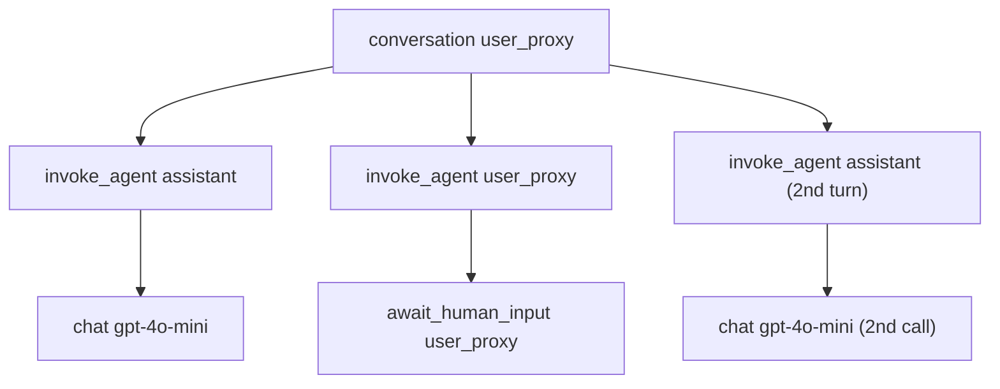

本記事は [AG2 OpenTelemetry Tracing: Full Observability for Multi-Agent Systems](https://docs.ag2.ai/latest/docs/blog/2026/02/08/AG2-OpenTelemetry-Tracing/) の解説記事です。

この記事は [Zenn記事: マルチエージェント通信のオブザーバビリティ設計：分散トレーシングと障害復旧の実装](https://zenn.dev/0h_n0/articles/b0e2c647f9fc16) の深掘りです。

## ブログ概要（Summary）

AG2（AutoGenの後継フレームワーク）は、2026年2月にOpenTelemetryトレーシング機能の公式サポートを発表した。この機能により、マルチエージェントシステム内の全ての会話、エージェントターン、LLM呼び出し、ツール実行、スピーカー選択が構造化されたspanとして記録され、共有トレースIDで接続される。本記事では、AG2公式ブログの技術的詳細を深掘りし、セットアップから分散トレーシング、バックエンド統合までを解説する。

## 情報源

- **種別**: 企業テックブログ（AG2.ai公式）
- **URL**: [https://docs.ag2.ai/latest/docs/blog/2026/02/08/AG2-OpenTelemetry-Tracing/](https://docs.ag2.ai/latest/docs/blog/2026/02/08/AG2-OpenTelemetry-Tracing/)
- **組織**: AG2.ai（AutoGen後継プロジェクト）
- **著者**: Mark Sze（Software Engineer）、Nikita Pastukhov（AG2 Maintainer、FastStream Author）
- **発表日**: 2026年2月8日

## 技術的背景（Technical Background）

### なぜマルチエージェントシステムにOTelが必要か

マルチエージェントシステムの通信は非決定的である。同じ入力でもエージェントの判断によりツール呼び出しの順序や回数が変わるため、従来のログベース監視では障害の原因を追跡できない。AG2の公式ブログでは、この課題に対してOpenTelemetryの分散トレーシングを統合することで、エージェントの全動作を「トレース」として構造化し、Jaeger・Grafana・Datadog・Langfuseなどの既存オブザーバビリティバックエンドで可視化できるようにした経緯が解説されている。

### OpenTelemetry GenAI Semantic Conventionsとの関係

AG2のトレーシング実装は、OpenTelemetry GenAI Semantic Conventions（2026年5月時点でDevelopmentステータス）に準拠している。ブログによれば、span属性には `gen_ai.request.model`（使用モデル名）、`gen_ai.usage.input_tokens`/`gen_ai.usage.output_tokens`（トークン使用量）、`gen_ai.response.finish_reasons`（生成停止理由）などの標準属性が付与される。

AG2はこの標準に加えて、`ag2.span.type` というカスタム属性で7種類のspanを分類している。

| `ag2.span.type` | Span Name | トリガー |
|-----------------|-----------|---------|
| `conversation` | `conversation {agent}` | `run`, `initiate_chat` |
| `agent` | `invoke_agent {agent}` | `generate_reply` |
| `llm` | `chat {model}` | `OpenAIWrapper.create()` |
| `tool` | `execute_tool {func}` | `execute_function` |
| `code_execution` | `execute_code {agent}` | コード実行ハンドラ |
| `human_input` | `await_human_input {agent}` | `get_human_input` |
| `speaker_selection` | `speaker_selection` | グループチャットスピーカー選択 |

この分類により、トレースツリーのどのspanがLLM呼び出しで、どのspanがツール実行で、どのspanがエージェント間の会話なのかを一目で識別できる。

## 実装アーキテクチャ（Architecture）

### 計装APIの設計

AG2は `autogen.opentelemetry` モジュールに4つの計装関数を提供している。ブログで紹介されている各関数の役割を整理する。

**`instrument_llm_wrapper(tracer_provider)`**: 全LLM呼び出しをグローバルに計装する。`OpenAIWrapper.create()` が呼ばれるたびに `chat {model}` spanが生成され、モデル名・プロバイダー・トークン使用量・コスト・リクエストパラメータが属性として記録される。

```python
from autogen.opentelemetry import instrument_llm_wrapper

instrument_llm_wrapper(tracer_provider=tracer_provider)
```

**`instrument_agent(agent, tracer_provider)`**: 個別のConversableAgentを計装する。会話、エージェントターン、ツール実行、コード実行、ヒューマン入力のspanが生成される。

```python
from autogen.opentelemetry import instrument_agent

instrument_agent(researcher_agent, tracer_provider=tracer_provider)
instrument_agent(writer_agent, tracer_provider=tracer_provider)
```

**`instrument_pattern(pattern, tracer_provider)`**: グループチャットパターンを一括計装する。パターンに含まれる全エージェント、GroupChatManager、スピーカー選択を自動で計装する。

```python
from autogen.opentelemetry import instrument_pattern

instrument_pattern(pattern, tracer_provider=tracer_provider)
```

**`instrument_a2a_server(server, tracer_provider)`**: A2A（Agent-to-Agent）プロトコルサーバーを計装する。W3C Trace Contextヘッダーを自動抽出し、分散トレーシングを実現する。

### トレース構造の階層

ブログで示されている2エージェントチャットのトレース構造を以下に示す。



この階層構造が重要なのは、障害発生時にトレースツリーを辿ることで「どのエージェントの、どのLLM呼び出しが、何秒かかったか」を即座に特定できるためである。

### 分散トレーシング（A2Aプロトコル統合）

AG2のA2A統合は、W3C Trace Contextヘッダーを使用して、異なるプロセス間でトレースを接続する。ブログでは以下の構成が紹介されている。

**サーバー側（リモートエージェント）**:

```python
from autogen import ConversableAgent, LLMConfig
from autogen.a2a import A2aAgentServer
from autogen.opentelemetry import instrument_a2a_server, instrument_llm_wrapper

llm_config = LLMConfig({"model": "gpt-4o-mini"})

tech_agent = ConversableAgent(
    name="tech_agent",
    system_message="You solve technical problems.",
    llm_config=llm_config,
)

server = A2aAgentServer(tech_agent, url="http://localhost:18123/")
instrument_llm_wrapper(tracer_provider=tracer_provider)
instrument_a2a_server(server, tracer_provider=tracer_provider)

app = server.build()
```

**クライアント側（オーケストレーター）**:

```python
from autogen.a2a import A2aRemoteAgent
from autogen.opentelemetry import instrument_agent, instrument_llm_wrapper

tech_agent = A2aRemoteAgent(
    "http://localhost:18123/",
    name="tech_agent",
)

instrument_llm_wrapper(tracer_provider=tracer_provider)
instrument_agent(user_proxy, tracer_provider=tracer_provider)
instrument_agent(tech_agent, tracer_provider=tracer_provider)
```

`instrument_a2a_server` は内部でW3C Trace Contextヘッダー（`traceparent`、`tracestate`）をHTTPリクエストから抽出し、親コンテキストとして設定する。これにより、クライアントとサーバーのspanが同一トレースに統合される。

### グループチャット計装

複数エージェントのグループチャットでは、`instrument_pattern` を使うことで全エージェントとスピーカー選択を一括で計装できる。ブログのコード例を示す。

```python
from autogen.agentchat import run_group_chat
from autogen.agentchat.group.patterns import AutoPattern
from autogen.opentelemetry import instrument_llm_wrapper, instrument_pattern

pattern = AutoPattern(
    initial_agent=researcher,
    agents=[researcher, writer],
    user_agent=user,
    group_manager_args={"llm_config": llm_config},
)

instrument_llm_wrapper(tracer_provider=tracer_provider)
instrument_pattern(pattern, tracer_provider=tracer_provider)

result = run_group_chat(
    pattern=pattern,
    messages="Explain quantum computing in simple terms.",
    max_rounds=5,
)
result.process()
```

グループチャットのトレースには `speaker_selection` spanが追加され、GroupChatManagerがどのエージェントを次のスピーカーとして選択したかの意思決定過程が記録される。

## Production Deployment Guide

### AWS実装パターン（コスト最適化重視）

AG2のOTelトレーシングをAWS上で運用する場合のアーキテクチャを示す。

| 規模 | エージェント数 | 推奨構成 | 月額コスト目安 | 主要サービス |
|------|------------|---------|-------------|------------|
| **Small** | 2-5 agents | Serverless | $50-150 | Lambda + Bedrock + X-Ray |
| **Medium** | 5-20 agents | Hybrid | $300-800 | ECS Fargate + Managed Grafana + Prometheus |
| **Large** | 20+ agents | Container | $2,000-5,000 | EKS + OTel Collector + Jaeger/Tempo |

**Small構成の詳細**（月額$50-150）:
- **Lambda**: AG2エージェントワークフロー実行（$20/月）
- **Bedrock**: LLM呼び出し（$80/月）
- **X-Ray**: トレース収集・可視化。OTLPエクスポーターからX-Rayへの送信（$10/月）
- **CloudWatch**: ログ・メトリクス（$5/月）

**Medium構成の詳細**（月額$300-800）:
- **ECS Fargate**: AG2エージェントサーバー（A2A）× 2-4タスク（$150/月）
- **Amazon Managed Grafana**: ダッシュボード（$9/月/editor）
- **Amazon Managed Prometheus**: メトリクス収集（$30/月）
- **OTel Collector（Fargate）**: トレース中継（$20/月）
- **Bedrock**: LLM呼び出し（$400/月）

**コスト試算の注意事項**: 上記は2026年5月時点のAWS ap-northeast-1料金に基づく概算値です。トレースのサンプリングレート、エージェント数、会話の長さにより大幅に変動します。

### Terraformインフラコード

**Small構成: Lambda + X-Ray**

```hcl
module "vpc" {
  source  = "terraform-aws-modules/vpc/aws"
  version = "~> 5.0"

  name = "ag2-otel-vpc"
  cidr = "10.0.0.0/16"
  azs  = ["ap-northeast-1a", "ap-northeast-1c"]
  private_subnets = ["10.0.1.0/24", "10.0.2.0/24"]

  enable_nat_gateway   = false
  enable_dns_hostnames = true
}

resource "aws_iam_role" "lambda_ag2" {
  name = "ag2-agent-lambda-role"
  assume_role_policy = jsonencode({
    Version = "2012-10-17"
    Statement = [{
      Action    = "sts:AssumeRole"
      Effect    = "Allow"
      Principal = { Service = "lambda.amazonaws.com" }
    }]
  })
}

resource "aws_iam_role_policy" "xray_write" {
  role = aws_iam_role.lambda_ag2.id
  policy = jsonencode({
    Version = "2012-10-17"
    Statement = [
      {
        Effect   = "Allow"
        Action   = ["xray:PutTraceSegments", "xray:PutTelemetryRecords"]
        Resource = "*"
      },
      {
        Effect   = "Allow"
        Action   = ["bedrock:InvokeModel"]
        Resource = "arn:aws:bedrock:ap-northeast-1::foundation-model/anthropic.claude-*"
      }
    ]
  })
}

resource "aws_lambda_function" "ag2_agent" {
  filename      = "ag2_agent.zip"
  function_name = "ag2-multi-agent"
  role          = aws_iam_role.lambda_ag2.arn
  handler       = "handler.main"
  runtime       = "python3.12"
  timeout       = 300
  memory_size   = 1024

  tracing_config {
    mode = "Active"
  }

  environment {
    variables = {
      OTEL_SERVICE_NAME           = "ag2-multi-agent"
      OTEL_EXPORTER_OTLP_ENDPOINT = "https://xray.ap-northeast-1.amazonaws.com"
    }
  }
}
```

### セキュリティベストプラクティス

- **トレースデータのPII保護**: `instrument_llm_wrapper(capture_messages=False)` をデフォルトに設定し、プロンプト/レスポンス内容をトレースに含めない
- **IAM最小権限**: X-Ray書き込み権限とBedrock呼び出し権限を分離
- **ネットワーク**: OTel Collectorへの通信はVPCエンドポイント経由
- **暗号化**: トレースデータのS3保存時はKMS暗号化

### 運用・監視設定

```sql
-- CloudWatch Logs Insights: エージェント別レイテンシ分析
fields @timestamp, agent_name, duration_ms, token_count
| stats avg(duration_ms) as avg_ms, pct(duration_ms, 95) as p95_ms by agent_name
| sort p95_ms desc
```

```python
import boto3

cloudwatch = boto3.client('cloudwatch')

cloudwatch.put_metric_alarm(
    AlarmName='ag2-agent-latency-p99',
    ComparisonOperator='GreaterThanThreshold',
    EvaluationPeriods=2,
    MetricName='Duration',
    Namespace='AWS/Lambda',
    Period=300,
    ExtendedStatistic='p99',
    Threshold=60000,
    AlarmDescription='AG2エージェントレイテンシP99が60秒超過'
)
```

### コスト最適化チェックリスト

- [ ] トレースサンプリングレート設定（開発: 100%、本番: 10-25%）
- [ ] `capture_messages=False` でプロンプト内容をトレースから除外（ストレージ削減）
- [ ] X-Ray vs Jaeger: Small規模はX-Ray（マネージド、$0.50/100万トレース）
- [ ] BatchSpanProcessor使用（SimpleSpanProcessorは開発のみ）
- [ ] Bedrock Prompt Caching有効化（システムプロンプト固定で30-90%削減）
- [ ] Lambda Powertools for AWS Lambda活用（OTel統合済み）
- [ ] 古いトレースの自動削除（S3ライフサイクルポリシー30日）
- [ ] AWS Budgets月額予算設定
- [ ] Cost Anomaly Detection有効化
- [ ] タグ戦略（環境別: dev/staging/prod）

## パフォーマンス最適化（Performance）

ブログでは、AG2のOTelトレーシングのパフォーマンスオーバーヘッドについて、以下の設計判断が言及されている。

**SimpleSpanProcessor vs BatchSpanProcessor**: ブログのクイックスタート例では `SimpleSpanProcessor` が使われているが、本番環境では `BatchSpanProcessor` を使用すべきである。`BatchSpanProcessor` はspanをバッファリングし、バッチでエクスポーターに送信するため、レイテンシへの影響が最小化される。

```python
from opentelemetry.sdk.trace.export import BatchSpanProcessor

tracer_provider.add_span_processor(
    BatchSpanProcessor(
        OTLPSpanExporter(endpoint="http://otel-collector:4317"),
        max_queue_size=2048,
        max_export_batch_size=512,
        schedule_delay_millis=5000,
    )
)
```

**`capture_messages` パラメータ**: `instrument_llm_wrapper(capture_messages=True)` を設定するとプロンプトとレスポンスの全文がspanイベントとして記録されるが、トレースデータのサイズが大幅に増加する。ブログでは、デフォルトで `False` に設定されており、機密データ保護とストレージコスト削減の両方を考慮した設計であると説明されている。

## 運用での学び（Production Lessons）

### バックエンド選定の指針

ブログでは複数のバックエンド統合が紹介されている。実運用での選定基準を整理する。

**Jaeger**: オープンソース。トレースの可視化に特化。自前運用が必要だが、コスト効率が高い。AG2のOTLP gRPCエクスポーターから直接接続可能。

**Grafana Tempo + Grafana**: Tempoはトレースストレージ、GrafanaはダッシュボードUI。Prometheusと組み合わせてメトリクスとトレースの横断分析が可能。

**Langfuse**: LLMオブザーバビリティに特化したSaaS。OTLPエンドポイントとして直接接続可能。トークンコスト追跡とメッセージレンダリングが特徴。セルフホスト版（OSS）とクラウド版の両方が利用可能。

**Datadog/Honeycomb**: エンタープライズSaaS。既存のAPMインフラがある場合は統合が容易。

### 計装のベストプラクティス

1. **グループチャットでは `instrument_pattern` を使う**: 個別に `instrument_agent` を呼ぶよりも漏れがない
2. **A2Aサーバーでは `instrument_a2a_server` を忘れない**: これがないと分散トレースが途切れる
3. **`service.name` を適切に設定する**: マイクロサービスアーキテクチャでエージェントサービスを識別するために必須

## 学術研究との関連（Academic Connection）

AG2のOTelトレーシング実装は、以下の学術的背景に基づいている。

**OpenTelemetry GenAI Semantic Conventions**: エージェントシステム向けのspan構造の標準化。AG2はこの仕様に準拠しつつ、`ag2.span.type` でフレームワーク固有の分類を追加している。

**A2Aプロトコル**: Google主導で策定され、Linux Foundationに移管されたAgent-to-Agentプロトコル。W3C Trace Contextを公式採用しており、AG2の `instrument_a2a_server` はこの仕様に基づいてトレースコンテキストの自動伝搬を実現している。

**分散トレーシングの理論**: Dapper（Google, 2010）に始まる分散トレーシングの概念を、LLMエージェントシステムに適用したもの。従来のマイクロサービストレーシングとの違いは、LLM呼び出しの非決定性とトークンベースのコスト追跡が加わる点にある。

## まとめと実践への示唆

AG2のOpenTelemetryトレーシング統合は、マルチエージェントシステムのオブザーバビリティを「アプリケーション開発者が数行のコードで実現できる」レベルまで簡素化した。4つの計装関数（`instrument_llm_wrapper`、`instrument_agent`、`instrument_pattern`、`instrument_a2a_server`）を呼ぶだけで、会話・LLM呼び出し・ツール実行・スピーカー選択の全てがspan階層として記録される。

実務への示唆として、既にOpenTelemetryベースのオブザーバビリティスタックを運用している組織では、AG2のトレースを既存のJaeger/GrafanaダッシュボードにそのままExportできる点が大きな利点である。一方で、`capture_messages=True` を有効にする場合はPII保護とストレージコストへの配慮が必要である。

## 参考文献

- **Blog URL**: [https://docs.ag2.ai/latest/docs/blog/2026/02/08/AG2-OpenTelemetry-Tracing/](https://docs.ag2.ai/latest/docs/blog/2026/02/08/AG2-OpenTelemetry-Tracing/)
- **OpenTelemetry GenAI Semantic Conventions**: [https://opentelemetry.io/docs/specs/semconv/gen-ai/](https://opentelemetry.io/docs/specs/semconv/gen-ai/)
- **A2A Protocol**: Google Agent-to-Agent Protocol (Linux Foundation)
- **Related Zenn article**: [https://zenn.dev/0h_n0/articles/b0e2c647f9fc16](https://zenn.dev/0h_n0/articles/b0e2c647f9fc16)

---

:::message
この記事はAI（Claude Code）により自動生成されました。AG2ブログの内容に基づいていますが、実際の利用時は公式ドキュメントもご確認ください。
:::
