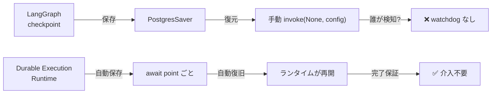

本記事は [Checkpoints Are Not Durable Execution: Why LangGraph, CrewAI, Google ADK, and Others Fall Short for Production Agent Workflows](https://www.diagrid.io/blog/checkpoints-are-not-durable-execution-why-langgraph-crewai-google-adk-and-others-fall-short-for-production-agent-workflows) の解説記事です。

この記事は [Zenn記事: マルチエージェント通信のオブザーバビリティ設計：分散トレーシングと障害復旧の実装](https://zenn.dev/0h_n0/articles/b0e2c647f9fc16) の深掘りです。

## ブログ概要（Summary）

Diagrid CTOのYaron Schneiderが2026年2月に公開したこの記事は、主要なAIエージェントフレームワーク（LangGraph、CrewAI、Google ADK）の永続化機能を詳細に分析し、それらが提供する「チェックポイント」と本番環境で必要な「Durable Execution（耐久実行）」の間に根本的な差異があることを指摘している。この差異は段階的な改善では埋められず、ランタイムの完全な再設計が必要であるという主張は、マルチエージェントシステムの本番運用を検討するエンジニアにとって重要な示唆を含んでいる。

## 情報源

- **種別**: 企業テックブログ（Diagrid公式）
- **URL**: [https://www.diagrid.io/blog/checkpoints-are-not-durable-execution-...](https://www.diagrid.io/blog/checkpoints-are-not-durable-execution-why-langgraph-crewai-google-adk-and-others-fall-short-for-production-agent-workflows)
- **組織**: Diagrid（Dapr商用サポート企業）
- **著者**: Yaron Schneider（CTO & Co-Founder）
- **発表日**: 2026年2月25日

## 技術的背景（Technical Background）

### Checkpointとは何か

エージェントフレームワークにおけるチェックポイントとは、ワークフローの実行状態をある時点でストレージに永続化する機能である。ワークフローが中断された場合、チェックポイントから状態を復元して処理を再開できる。ブログでは、この機能を「セーブポイント」と表現している。

### Durable Executionとは何か

Durable Execution（耐久実行）は、チェックポイントよりも広い概念である。ブログの定義によれば、Durable Executionは「エージェントワークフローが完了まで実行されることをランタイムが保証する」仕組みであり、以下の5つの要件を満たす必要がある。

1. **自動永続化**: 全てのawaitポイントで明示的なsave呼び出しなしに状態が保存される
2. **自動障害復旧**: 無制限リトライと組み込みリマインダーによる自動回復
3. **リプレイベース再開**: 完了済みアクティビティのキャッシュ結果を返す
4. **分散実行**: クラスタノード間でのアクター配置による分散処理
5. **復旧コードの排除**: 線形なワークフローコードがすべての永続化を透過的に処理

ブログはこの差異を一言で要約している。

> **Checkpointing**: 「状態を保存した。あとは自分で対処して。」
>
> **Durable Execution**: 「ワークフローは完了まで実行される。全て私が処理する。」

## 実装アーキテクチャ（Architecture）

### フレームワーク別の分析

ブログでは3つの主要フレームワークについて、永続化機能の実装と限界を詳細に分析している。

#### LangGraph

**提供される機能**:
- `PostgresSaver`/`SqliteSaver` によるグラフsuperstepごとの状態スナップショット
- `thread_id` スコーピングによる手動再開（`graph.invoke(None, config=config)`）
- `RetryPolicy`（指数バックオフ、`max_attempts`、`backoff_factor` パラメータ）

**ブログが指摘する限界**:

1. **自動障害検知なし**: ワークフローがクラッシュしても、誰にも通知されない。外部のwatchdog機構が必要
2. **手動再開が必要**: スケール時に全てのスタックしたワークフローを手動で検出・再開する運用は現実的でない
3. **重複実行のリスク**: 分散環境で2つのプロセスが同じ `thread_id` を同時に再開した場合、組み込みの排他制御がない
4. **単一プロセス実行**: 分散実行、タスクキュー、ワーカープールなし。プロセスが死ねば全てが失われる
5. **ノード内部の中間状態**: チェックポインタはノード間の状態のみを保存。ノード内部のループ途中で失敗した場合、中間作業は全て失われる

#### CrewAI

**提供される機能**:
- `Task Replay`: 直近の `crew.kickoff()` からタスクを再実行
- `@persist` デコレータ: SQLiteへのメソッド実行後の状態保存
- `from_pending()`/`resume()` パターン: Human-in-the-Loopシナリオ

**ブログが指摘する限界**:

1. **直近のkickoffのみ保持**: タスクリプレイは最新の実行のみ対象。履歴レコードなし
2. **`@persist` は自動再開しない**: 各メソッドに手動の検出・スキップロジックが必要
3. **単一プロセス実行**: LangGraphと同様
4. **並行復旧時の重複排除なし**: 複数プロセスが同時に復旧を試みた場合の制御がない

#### Google ADK

**提供される機能**:
- イベントソーシングアーキテクチャ: 不変のEventをセッション履歴に追記
- `ResumabilityConfig`（v1.14.0+）: `invocation_id` による再開可能性
- `ReflectAndRetryToolPlugin`（v1.16.0+）: ツール失敗時のLLMベースリトライ

**ブログが指摘する限界**:

1. **呼び出し元が中断を検知する必要**: 組み込みのwatchdogなし
2. **ツール失敗がマルチエージェントワークフロー全体をクラッシュ**: 障害の封じ込め不足
3. **分散オーケストレーションなし**: フレームワークレベルでの分散実行サポートが不在

### 3フレームワーク比較

| 機能 | LangGraph | CrewAI | Google ADK | Durable Execution |
|------|-----------|--------|-----------|-------------------|
| 状態保存 | ✅ チェックポインタ | ✅ @persist | ✅ イベントソーシング | ✅ 自動 |
| 障害検知 | ❌ なし | ❌ なし | ❌ なし | ✅ 自動 |
| 自動復旧 | ❌ 手動再開 | ❌ 手動再開 | ❌ 手動再開 | ✅ ランタイム保証 |
| 重複防止 | ❌ 分散ロックなし | ❌ なし | ❌ なし | ✅ 排他制御 |
| 分散実行 | ❌ 単一プロセス | ❌ 単一プロセス | ❌ 単一プロセス | ✅ クラスタ |

## パフォーマンス最適化（Performance）

ブログでは直接のベンチマークデータは示されていないが、各フレームワークの永続化コストについて以下の示唆がある。

**LangGraphのチェックポイントオーバーヘッド**: `PostgresSaver` はグラフの各superstepで状態全体をシリアライズしてDBに書き込む。LangGraphは `sync` durabilityモードを提供しており、次のステップに進む前にチェックポイントの書き込みが完了することを保証するが、パフォーマンスコストが伴う。

**Durable Executionのリプレイコスト**: リプレイベース再開では、完了済みアクティビティの結果をキャッシュから返すため、復旧時のLLM再呼び出しコストを削減できる。これは特にLLM呼び出しのコスト（$0.25〜$15/MTok）を考えると重要な最適化である。

## 運用での学び（Production Lessons）

### Zenn記事との関連: watchdog・heartbeatの必要性

ブログの分析は、Zenn記事で実装例を示したwatchdog・heartbeatパターンの必要性を裏付けている。LangGraphのcheckpointは状態保存であり自動復旧ではないため、以下の追加実装が本番運用には必須となる。

1. **外部watchdog**: ワークフローのheartbeatを監視し、タイムアウト時にアラートを発生
2. **自動再開メカニズム**: スタックしたワークフローを検出し、checkpointから自動で`invoke(None, config)` を実行
3. **分散ロック**: 複数プロセスが同一ワークフローを同時に再開しないための排他制御（Redis等）

### 構造的ギャップの意味

ブログの主張で特に重要なのは、「このギャップは段階的な改善では埋められず、ランタイムの完全な再設計が必要」という指摘である。チェックポインタの改善やRetryPolicyの追加では、「状態保存」と「完了保証」の間のギャップは構造的に解消できないという分析は、フレームワーク選定時に認識すべきトレードオフを明確にしている。

### 実務での対処パターン

ブログの分析を踏まえた現実的な対処方法を整理する。

**パターン1: LangGraph + 外部watchdog**: LangGraphのcheckpointに加えて、Zenn記事で解説した `WorkflowWatchdog` + `AgentHeartbeat` パターンを実装する。最もシンプルだが、分散ロックとリプレイベース再開は自前実装が必要。

**パターン2: LangGraph + Temporal/Dapr**: LangGraphのグラフ実行をTemporal WorkflowやDapr Workflowのアクティビティとして実行する。Durable Executionランタイムが障害検知・復旧・分散実行を担い、LangGraphはエージェントロジックに集中する。

**パターン3: フレームワーク非依存のDurable Runtime**: エージェントロジックをDapr/Temporalのワークフローとして直接実装する。LangGraphのグラフ抽象化を放棄する代わりに、完全なDurable Executionを得る。

## 学術研究との関連（Academic Connection）

チェックポイントとDurable Executionの区別は、分散システムの理論的な文脈で以下の概念に対応する。

**Chandy-Lamportスナップショット**: 分散システムの一貫したスナップショット取得アルゴリズム。LangGraphのcheckpointは単一プロセス内の状態保存であり、分散スナップショットとは異なる。

**Saga パターン**: 分散トランザクションの補償メカニズム。Zenn記事で解説したAgentSagaは、Durable Executionランタイムなしでも適用できる障害復旧パターンだが、ランタイム保証がないため補償トランザクション自体の信頼性は自前で担保する必要がある。

**Event Sourcing**: Google ADKが採用するアーキテクチャパターン。全ての状態変更をイベントとして記録し、イベントのリプレイで状態を再構築する。理論的にはDurable Executionと相性が良いが、ADKの実装ではリプレイベース再開が自動化されていない。

## まとめと実践への示唆

Diagridのブログは、AIエージェントフレームワークのチェックポイント機能がDurable Executionと同義ではないことを明確に示した。LangGraph、CrewAI、Google ADKのいずれも、状態保存は提供するが、障害検知・自動復旧・重複防止・分散実行は提供しない。

実務上の示唆として、本番運用でマルチエージェントワークフローを使う場合は、チェックポイントに加えて以下の層を自前実装するか、Durable Executionランタイム（Temporal、Dapr等）と組み合わせる必要がある。

1. **障害検知層**: watchdog + heartbeat
2. **自動復旧層**: スタックワークフローの検出と再開
3. **排他制御層**: 分散ロック
4. **監視層**: Circuit Breakerの状態監視

なお、ブログの著者はDiaGrid（Daprの商用サポート企業）のCTOであり、記事中でDapr WorkflowsとDapr Agentsを解決策として提案している点は、利益相反の可能性として読者が認識しておくべきである。

## 参考文献

- **Blog URL**: [https://www.diagrid.io/blog/checkpoints-are-not-durable-execution-...](https://www.diagrid.io/blog/checkpoints-are-not-durable-execution-why-langgraph-crewai-google-adk-and-others-fall-short-for-production-agent-workflows)
- **LangGraph Persistence Documentation**: [https://docs.langchain.com/oss/python/langgraph/durable-execution](https://docs.langchain.com/oss/python/langgraph/durable-execution)
- **AWS: Build durable AI agents with LangGraph and DynamoDB**: [https://aws.amazon.com/blogs/database/build-durable-ai-agents-with-langgraph-and-amazon-dynamodb/](https://aws.amazon.com/blogs/database/build-durable-ai-agents-with-langgraph-and-amazon-dynamodb/)
- **Related Zenn article**: [https://zenn.dev/0h_n0/articles/b0e2c647f9fc16](https://zenn.dev/0h_n0/articles/b0e2c647f9fc16)

---

:::message
この記事はAI（Claude Code）により自動生成されました。ブログの主張は著者の分析に基づいています。フレームワーク選定時は複数の情報源を参照してください。
:::
