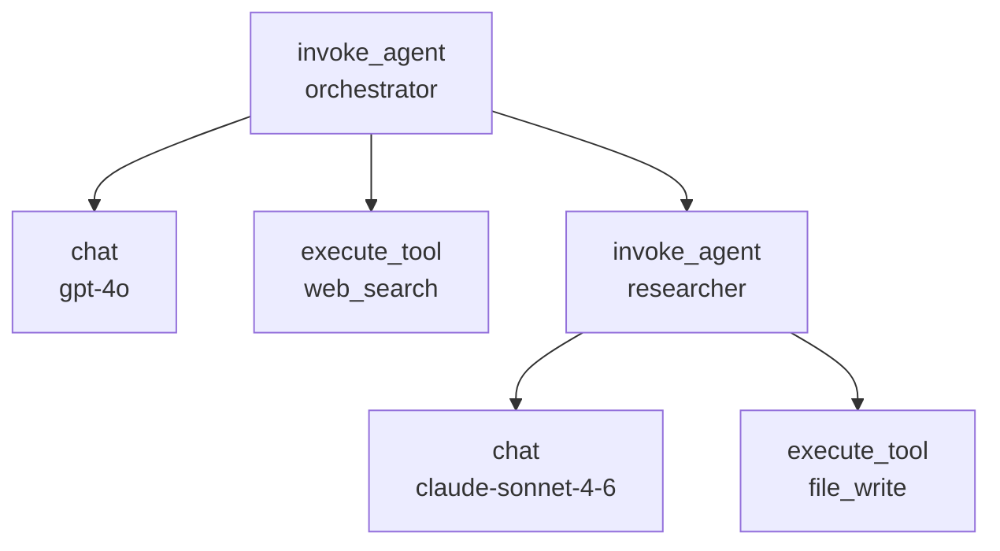

本記事は [Inside the LLM Call: GenAI Observability with OpenTelemetry](https://opentelemetry.io/blog/2026/genai-observability/) の解説記事です。

この記事は [Zenn記事: マルチエージェント通信のオブザーバビリティ設計：分散トレーシングと障害復旧の実装](https://zenn.dev/0h_n0/articles/b0e2c647f9fc16) の深掘りです。

## ブログ概要（Summary）

OpenTelemetry公式ブログのこの記事は、GenAI Semantic Conventionsを使ってLLMアプリケーションの内部動作を可視化する方法を解説している。「AIエージェントが単純な質問に45秒かかった。モデルの問題か？遅いツール呼び出しか？リトライループか？」という問題提起から始まり、OpenTelemetryの標準化されたテレメトリ収集によってこの問題を解決するアプローチを示している。VS Code Copilot、OpenAI Codex、Claude Codeなど主要なAI開発ツールでの統合例も紹介されている。

## 情報源

- **種別**: 公式テックブログ（OpenTelemetry Project）
- **URL**: [https://opentelemetry.io/blog/2026/genai-observability/](https://opentelemetry.io/blog/2026/genai-observability/)
- **組織**: OpenTelemetry Project（CNCF Graduated Project）
- **発表日**: 2026年（具体的な日付は記事に明示なし）

## 技術的背景（Technical Background）

### OpenTelemetry GenAI Semantic Conventionsとは

OpenTelemetryは、CNCF（Cloud Native Computing Foundation）のGraduatedプロジェクトとして、分散システムのテレメトリ（トレース・メトリクス・ログ）を標準化するフレームワークである。GenAI Semantic Conventionsは、このフレームワークをLLMアプリケーションに拡張するための仕様であり、2026年5月時点でDevelopmentステータスにある。

この仕様が解決する根本的な課題は、LLMアプリケーションの動作が非決定的であることにある。従来のWebアプリケーションでは、リクエストのレイテンシやエラー率をHTTPステータスコードで追跡できた。しかしLLMアプリケーションでは、同じプロンプトに対して異なるレスポンスが返り、ツール呼び出しの有無や回数も実行ごとに変わる。GenAI Semantic Conventionsは、この非決定性を「構造化されたspan属性」として捕捉するための共通語彙を提供する。

### なぜ標準化が重要か

標準化以前は、各LLMフレームワーク（LangChain、AG2、CrewAI等）がそれぞれ独自のテレメトリ形式を使っていた。これはベンダーロックインとデータ統合の困難さをもたらす。GenAI Semantic Conventionsにより、フレームワーク間で統一されたspan属性が使用され、Jaeger・Grafana・Datadog・Honeycombなど任意のバックエンドで可視化できるようになる。

## 実装アーキテクチャ（Architecture）

### GenAI Semantic Conventionsの属性体系

ブログで紹介されている主要なspan属性を体系的に整理する。

#### リクエスト属性

| 属性名 | 型 | 説明 | 例 |
|--------|---|------|-----|
| `gen_ai.request.model` | string | 使用モデルの識別子 | `gpt-4o` |
| `gen_ai.system_instructions` | string | システムプロンプト（オプトイン） | `"You are a helpful..."` |
| `gen_ai.input.messages` | string | ユーザー入力（オプトイン） | プロンプト全文 |

#### レスポンス属性

| 属性名 | 型 | 説明 | 例 |
|--------|---|------|-----|
| `gen_ai.usage.input_tokens` | int | 入力トークン数 | `1523` |
| `gen_ai.usage.output_tokens` | int | 出力トークン数 | `847` |
| `gen_ai.response.finish_reasons` | string[] | 生成停止理由 | `["stop"]`, `["tool_calls"]` |
| `gen_ai.output.messages` | string | モデルレスポンス（オプトイン） | レスポンス全文 |

#### メトリクス

| メトリクス名 | 種別 | 説明 |
|-------------|------|------|
| `gen_ai.client.operation.duration` | Histogram | LLM呼び出しのレイテンシ分布 |
| `gen_ai.client.token.usage` | Histogram | トークン消費量の分布 |

`gen_ai.system_instructions`、`gen_ai.input.messages`、`gen_ai.output.messages` はオプトイン属性である。プライバシーとストレージコストの観点から、デフォルトでは記録されない。開発環境では有効化してデバッグに活用し、本番環境では無効化するのが推奨される。

### Span階層とエージェント通信の可視化

ブログでは、エージェントシステムのトレースが以下のようなspan階層として表現されることが示されている。



この階層構造により、以下の問いに答えられる。

- **レイテンシの内訳**: 45秒のうち、LLM呼び出しに何秒、ツール実行に何秒かかったか？
- **コストの帰属**: どのエージェントが最もトークンを消費しているか？
- **障害の伝播**: どのエージェントのどのツール呼び出しが失敗し、それが全体の結果にどう影響したか？

### 主要ツールでの統合状況

ブログでは、3つの主要AI開発ツールでのOTel統合が紹介されている。

#### VS Code Copilot

3つの設定でOTelテレメトリを有効化できる。

| 設定 | 機能 |
|------|------|
| `github.copilot.chat.otel.enabled` | OTelエミッション有効化 |
| `github.copilot.chat.otel.captureContent` | プロンプト/レスポンス全文の記録 |
| `github.copilot.chat.otel.otlpEndpoint` | コレクターエンドポイント指定 |

#### OpenAI Codex

構造化ログとOTelメトリクスをエクスポートする。

#### Claude Code

メトリクスとログイベントをOTel経由でエクスポートし、トレースサポートはベータ段階にある。

### 可視化ツール: Aspire Dashboard

ブログでは、ローカル開発環境での可視化ツールとしてAspire Dashboard（無料・OSS）が紹介されている。このダッシュボードはOTLP互換のレシーバーとして動作し、以下の機能を提供する。

- **トレースビューア**: span階層を時系列で表示。`invoke_agent` → `chat` → `execute_tool` の親子関係が視覚化される
- **メトリクスエクスプローラー**: `gen_ai.client.operation.duration` のヒストグラムをモデル別にフィルタリング
- **GenAIテレメトリビジュアライザー**: チャットスタイルのインターフェースで、プロンプト・レスポンス・ツール呼び出しをメッセージングアプリのように表示

Dockerコンテナとして提供されており、クラウドアカウント不要でローカルに起動できる。

## Production Deployment Guide

### AWS実装パターン（コスト最適化重視）

OTelベースのGenAIオブザーバビリティスタックをAWS上に構築する場合の構成を示す。

| 規模 | エージェント規模 | 推奨構成 | 月額コスト目安 | 主要サービス |
|------|------------|---------|-------------|------------|
| **Small** | 1-3 agents | Managed | $30-100 | X-Ray + CloudWatch |
| **Medium** | 3-10 agents | Semi-Managed | $200-600 | Managed Grafana + Managed Prometheus + OTel Collector |
| **Large** | 10+ agents | Self-Hosted | $1,000-3,000 | EKS + OTel Collector + Jaeger/Tempo + Grafana |

**Small構成の詳細**（月額$30-100）:
- **AWS X-Ray**: トレース収集・可視化。$0.50/100万トレース（$10/月）
- **CloudWatch Metrics**: `gen_ai.client.operation.duration` と `gen_ai.client.token.usage` を記録（$10/月）
- **CloudWatch Logs**: 構造化ログ（$5/月）
- **AWS Distro for OpenTelemetry (ADOT)**: OTel Collector のAWSマネージド版（追加コストなし）

**Medium構成の詳細**（月額$200-600）:
- **Amazon Managed Grafana**: ダッシュボード（$9/月/editor）
- **Amazon Managed Prometheus**: メトリクス収集（$30/月）
- **OTel Collector（ECS Fargate）**: トレース・メトリクス中継（$30/月）
- **S3**: トレースアーカイブ（$5/月）

**コスト試算の注意事項**: 上記は2026年5月時点のAWS ap-northeast-1料金に基づく概算値です。トレースのサンプリングレートとメトリクスのカーディナリティにより変動します。

### Terraformインフラコード

**Small構成: ADOT + X-Ray + CloudWatch**

```hcl
module "vpc" {
  source  = "terraform-aws-modules/vpc/aws"
  version = "~> 5.0"

  name = "otel-genai-vpc"
  cidr = "10.0.0.0/16"
  azs  = ["ap-northeast-1a", "ap-northeast-1c"]
  private_subnets = ["10.0.1.0/24", "10.0.2.0/24"]

  enable_nat_gateway   = false
  enable_dns_hostnames = true
}

resource "aws_iam_role" "adot_collector" {
  name = "adot-collector-role"
  assume_role_policy = jsonencode({
    Version = "2012-10-17"
    Statement = [{
      Action    = "sts:AssumeRole"
      Effect    = "Allow"
      Principal = { Service = "ecs-tasks.amazonaws.com" }
    }]
  })
}

resource "aws_iam_role_policy" "adot_xray" {
  role = aws_iam_role.adot_collector.id
  policy = jsonencode({
    Version = "2012-10-17"
    Statement = [
      {
        Effect = "Allow"
        Action = [
          "xray:PutTraceSegments",
          "xray:PutTelemetryRecords",
          "xray:GetSamplingRules",
          "xray:GetSamplingTargets"
        ]
        Resource = "*"
      },
      {
        Effect = "Allow"
        Action = [
          "cloudwatch:PutMetricData",
          "logs:CreateLogGroup",
          "logs:CreateLogStream",
          "logs:PutLogEvents"
        ]
        Resource = "*"
      }
    ]
  })
}

resource "aws_cloudwatch_metric_alarm" "genai_latency" {
  alarm_name          = "genai-operation-latency-p99"
  comparison_operator = "GreaterThanThreshold"
  evaluation_periods  = 2
  metric_name         = "gen_ai_client_operation_duration_p99"
  namespace           = "Custom/GenAI"
  period              = 300
  statistic           = "Average"
  threshold           = 10000
  alarm_description   = "GenAI LLM呼び出しP99レイテンシが10秒超過"

  alarm_actions = ["arn:aws:sns:ap-northeast-1:123456789:ops-alerts"]
}
```

### セキュリティベストプラクティス

- **コンテンツキャプチャの制御**: 本番環境では `captureContent = false` を必須とし、プロンプト/レスポンスのPIIがテレメトリに含まれないようにする
- **IAM最小権限**: ADOT CollectorにはX-Ray書き込み権限のみ付与
- **ネットワーク**: OTel CollectorへのOTLP通信はVPC内部に限定
- **データ保持**: トレースデータの保持期間を設定し、コンプライアンス要件に準拠

### 運用・監視設定

```sql
-- CloudWatch Logs Insights: モデル別レイテンシ分析
fields @timestamp, gen_ai_request_model, gen_ai_client_operation_duration_ms
| stats avg(gen_ai_client_operation_duration_ms) as avg_ms,
        pct(gen_ai_client_operation_duration_ms, 95) as p95_ms,
        pct(gen_ai_client_operation_duration_ms, 99) as p99_ms
  by gen_ai_request_model
| sort p99_ms desc
```

```python
import boto3

cloudwatch = boto3.client('cloudwatch')

cloudwatch.put_metric_alarm(
    AlarmName='genai-token-usage-spike',
    ComparisonOperator='GreaterThanThreshold',
    EvaluationPeriods=1,
    MetricName='gen_ai_client_token_usage_total',
    Namespace='Custom/GenAI',
    Period=3600,
    Statistic='Sum',
    Threshold=1000000,
    AlarmDescription='GenAI トークン使用量が100万/時間超過（コスト急増の可能性）'
)
```

### コスト最適化チェックリスト

- [ ] トレースサンプリングレート設定（開発: 100%、本番: 5-10%）
- [ ] `captureContent = false`（ストレージコスト削減 + PII保護）
- [ ] X-Ray vs Jaeger: ~10 agents以下はX-Rayマネージド（$0.50/100万トレース）
- [ ] メトリクスカーディナリティ制御（モデル名以外のラベルは最小限に）
- [ ] ADOT Collector使用（OTel CollectorのAWSマネージド版、追加コストなし）
- [ ] S3トレースアーカイブのライフサイクルポリシー（30日で自動削除）
- [ ] AWS Budgets月額予算設定
- [ ] Cost Anomaly Detection有効化
- [ ] CloudWatch Metrics Insightsで未使用メトリクスを特定・削除
- [ ] 開発環境ではAspire Dashboard（無料OSS）を使用しSaaS費用を回避

## パフォーマンス最適化（Performance）

### テレメトリ収集のオーバーヘッド

OTelの計装はアプリケーションにオーバーヘッドを追加する。ブログでは具体的なベンチマーク数値は示されていないが、以下の最適化指針が導ける。

**BatchSpanProcessor**: spanをバッファリングしてバッチでエクスポートする。`schedule_delay_millis`（バッチ間隔）を5000ms程度に設定することで、エクスポーターへのネットワーク呼び出し回数を削減できる。

**サンプリング**: 全トレースを記録する必要がない場合、`ParentBasedSampler` と `TraceIdRatioBased` サンプラーを組み合わせて、一定割合のトレースのみ記録する。エラーが発生したトレースは常に記録する設定が推奨される。

**属性の選択**: `gen_ai.system_instructions` や `gen_ai.input.messages` はオプトイン属性であり、有効化するとspanサイズが大幅に増加する。本番環境ではデフォルトで無効にし、デバッグ時のみ一時的に有効化する運用が適切である。

## 運用での学び（Production Lessons）

### GenAI Semantic Conventionsの成熟度

2026年5月時点で、GenAI Semantic ConventionsはDevelopmentステータスにある。これはAPIが安定版ではなく、破壊的変更の可能性があることを意味する。ただし、ブログによれば、agent spansを含む仕様は急速に整備されており、2026年Q1を通じて実用的に安定していた。

新規プロジェクトでGenAI Semantic Conventionsを採用する場合は、仕様の更新に追従するための抽象化層を設けることが推奨される。具体的には、span属性名を直接ハードコードするのではなく、ラッパー関数やEnum経由で参照する設計にしておくと、仕様変更時の影響範囲を限定できる。

### 業界の収束

ブログでは、業界がOpenTelemetryをAIエージェントシステムの標準テレメトリ層として収束しつつあることが示されている。Datadog、Honeycomb、New Relicといった主要ベンダーがGenAI Semantic Conventionsをサポートし、LangChain、CrewAI、AutoGen/AG2といったフレームワークがOTel準拠のspanをネイティブまたは計装パッケージ経由でエミットするようになっている。

この収束は、マルチフレームワーク環境（たとえばAG2のエージェントがLangChainのRetrieverを呼び出すような構成）でも統一されたトレースビューが得られることを意味する。

## 学術研究との関連（Academic Connection）

**Dapper（Google, 2010）**: Googleが開発した分散トレーシングシステム。OpenTelemetryのトレーシングモデル（span、trace、context propagation）はDapperの概念を継承している。GenAI Semantic Conventionsは、このモデルをLLMの非決定的な動作に適用するための拡張として位置づけられる。

**MLOpsとの統合**: MLflowやWeights & Biasesなどの実験追跡ツールとの違いは、GenAI Semantic Conventionsがモデルの学習・評価ではなく「推論時の動作」に焦点を当てている点にある。学習時のメトリクス（loss、accuracy等）はMLOpsツールで、推論時のテレメトリ（レイテンシ、トークン使用量、ツール呼び出し等）はOTelで追跡するという役割分担が明確になりつつある。

## まとめと実践への示唆

OpenTelemetry GenAI Semantic Conventionsは、LLMアプリケーションのオブザーバビリティに対する業界標準として確立しつつある。ブログで示されたspan属性（`gen_ai.request.model`、`gen_ai.usage.input_tokens` 等）とメトリクス（`gen_ai.client.operation.duration`、`gen_ai.client.token.usage`）は、エージェントシステムの「何が遅いのか」「何がコストを消費しているのか」「何が失敗しているのか」という基本的な問いに答えるための共通語彙を提供する。

実務への示唆として、新規プロジェクトではGenAI Semantic Conventionsを前提とした計装を最初から組み込むことが推奨される。既存プロジェクトでは、まず `gen_ai.client.operation.duration` メトリクスのみから始め、段階的にspan属性を追加していくアプローチが現実的である。

## 参考文献

- **Blog URL**: [https://opentelemetry.io/blog/2026/genai-observability/](https://opentelemetry.io/blog/2026/genai-observability/)
- **OpenTelemetry GenAI Semantic Conventions**: [https://opentelemetry.io/docs/specs/semconv/gen-ai/](https://opentelemetry.io/docs/specs/semconv/gen-ai/)
- **AI Agent Observability (OTel Blog 2025)**: [https://opentelemetry.io/blog/2025/ai-agent-observability/](https://opentelemetry.io/blog/2025/ai-agent-observability/)
- **Aspire Dashboard**: [https://learn.microsoft.com/en-us/dotnet/aspire/fundamentals/dashboard/](https://learn.microsoft.com/en-us/dotnet/aspire/fundamentals/dashboard/)
- **Related Zenn article**: [https://zenn.dev/0h_n0/articles/b0e2c647f9fc16](https://zenn.dev/0h_n0/articles/b0e2c647f9fc16)

---

:::message
この記事はAI（Claude Code）により自動生成されました。ブログの内容に基づいていますが、実際の利用時はOpenTelemetry公式ドキュメントもご確認ください。
:::
