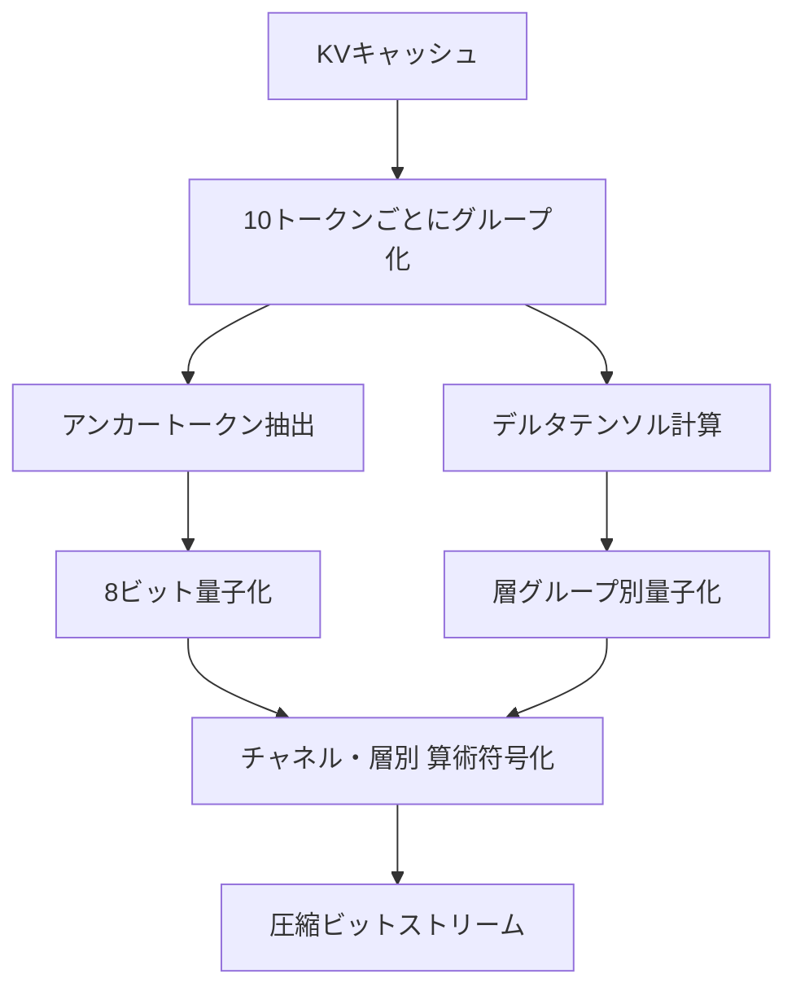

## 論文概要（Abstract）

CacheGenは、LLMの長いコンテキストを処理する際のKVキャッシュ転送を高速化するシステムである。KVキャッシュの再利用によりコンテキスト処理遅延を削減できるが、大きなKVテンソルをネットワーク越しにフェッチすると高い転送遅延が発生する。CacheGenは、KVキャッシュのチャネル・層ごとの分布特性を活用したカスタムテンソルエンコーダにより、KVキャッシュを3.5-4.3倍圧縮し、TTFT（Time-to-First-Token）を3.2-3.7倍削減する。さらに、帯域幅変動に応じて圧縮レベルを適応的に調整するストリーミング機構を備える。

この記事は [Zenn記事: プロンプトキャッシュ実装術：Claude・GPT・Geminiのコスト90%削減パターン](https://zenn.dev/0h_n0/articles/10efd4d3683138) の深掘りです。

## 情報源

- **会議名**: ACM SIGCOMM 2024
- **年**: 2024（Sydney, Australia, August 4-8）
- **URL**: [https://dl.acm.org/doi/10.1145/3651890.3672274](https://dl.acm.org/doi/10.1145/3651890.3672274)
- **著者**: Yuhan Liu, Hanchen Li, Yihua Cheng, Siddhant Ray, Yuyang Huang, Qizheng Zhang, Kuntai Du, Jiayi Yao, Shan Lu, Ganesh Ananthanarayanan, Michael Maire, Henry Hoffmann, Ari Holtzman, Junchen Jiang
- **コード**: [https://github.com/UChi-JCL/CacheGen](https://github.com/UChi-JCL/CacheGen)

## カンファレンス情報

ACM SIGCOMM（Special Interest Group on Data Communication）は、コンピュータネットワーキング分野の最高峰国際会議である。通常の採択率は10-15%程度と非常に競争率が高い。CacheGenがSIGCOMMに採択された点は注目に値する。LLMサービングの課題を「ネットワーク転送の最適化」という視点で捉え、システム・ネットワーク研究コミュニティにおけるLLMインフラ研究の広がりを示している。

## 技術的詳細（Technical Details）

### 課題: KVキャッシュ転送のボトルネック

LLMが長いコンテキストを処理する際、同一コンテキストを繰り返し処理するのは計算の無駄である。KVキャッシュを事前計算してストレージに保存し、必要時にGPUへフェッチする方式が有効だが、KVキャッシュのサイズが問題となる。

著者らは論文中で以下の具体例を示している。LLaMA-7Bモデルで9,000トークンのコンテキストを処理する場合、KVキャッシュサイズは約2.1GBに達する（論文Section 2より）。これをネットワーク越しに転送すると、帯域幅がボトルネックとなりTTFTが増大する。

### アンカー・デルタ分解

CacheGenのエンコーダは、コンテキストのトークン列を10トークンごとのグループに分割する。各グループ内で、最初のトークン（アンカートークン）のKVテンソルをそのまま保持し、残りの9トークンはアンカーとの差分（デルタテンソル）として記録する。

$$
\mathbf{D}_{i} = \mathbf{K}_{i} - \mathbf{K}_{\text{anchor}}, \quad i = 2, 3, \ldots, 10
$$

ここで、
- $\mathbf{K}_{i}$: グループ内$i$番目トークンのKeyテンソル
- $\mathbf{K}_{\text{anchor}}$: アンカートークンのKeyテンソル
- $\mathbf{D}_{i}$: デルタテンソル

デルタテンソルはアンカーテンソルに比べてエントロピーが低くなるため、後段の算術符号化で効率的に圧縮できる。アンカートークンは全トークンの10%に過ぎないが、デルタテンソルの分布に影響するため、著者らは8ビット精度を維持している。

### チャネル・層ごとの分布プロファイリング

CacheGenの圧縮効率の鍵は、KVキャッシュの統計的性質を活用した算術符号化（Arithmetic Coding）にある。著者らは、KVキャッシュの値をチャネルと層の組み合わせごとにグルーピングすると、トークン位置ごとにグルーピングした場合と比較してエントロピーが大幅に低下することを発見した（論文Section 3.1より）。



この分布プロファイリングはオフラインで実行される。具体的には、各モデルについて代表的なコンテキストを処理し、デルタテンソルとアンカーテンソルそれぞれの各チャネル・層の組み合わせに対して確率分布を事前計算する。同一モデルから生成されるすべてのKVキャッシュに対して同じ分布を使用できるため、実行時のオーバーヘッドはない。

算術符号化の実装にはCUDAカーネルが用いられ、各CUDAスレッドが1トークン分のKVキャッシュのエンコード・デコードを担当する。これにより、GPU上で並列にエンコード・デコードが実行される。

### 層グループ別量子化

Transformerの各層はKVキャッシュの量子化誤差に対する感度が異なる。著者らは、初期の層ほど量子化誤差に対して敏感であることを実験的に確認している（論文Section 3.2より）。この知見に基づき、CacheGenはTransformerの層を3つのグループに分割し、それぞれ異なる量子化ビット幅を適用する。

| 層グループ | 対象 | 量子化レベル | 根拠 |
|-----------|------|------------|------|
| 前方1/3 | 初期層 | 保守的（8ビット） | 出力品質への影響大 |
| 中間1/3 | 中間層 | 中程度（4-6ビット） | 中程度の感度 |
| 後方1/3 | 深層 | 積極的（2-4ビット） | 出力品質への影響小 |

### 適応的帯域幅対応ストリーミング

CacheGenは、コンテキスト全体を約1,500トークンごとのチャンクに分割してストリーミング転送する。各チャンクには複数のストリーミング構成が用意されている。

1. **複数の符号化レベル**: チャンクごとに異なる圧縮レベル（ビット幅）を選択可能
2. **テキスト再送モード**: KVキャッシュの代わりに生のテキストを送信し、受信側でLLMに再計算させる

帯域幅の推定は、直前のチャンク転送のスループットを測定し、残りのチャンクの転送にも同じスループットが維持されると仮定する方式を採用している。システムは、SLO（Service Level Objective）の遅延制約を満たしつつ、圧縮損失が最小となる構成を選択する。

$$
\min \sum_{j=1}^{C} \ell(c_j) \quad \text{s.t.} \quad \sum_{j=1}^{C} \frac{s(c_j)}{B} + t_{\text{decode}}(c_j) \leq T_{\text{SLO}}
$$

ここで、
- $C$: 総チャンク数
- $c_j$: チャンク$j$のストリーミング構成（符号化レベルまたはテキスト再送）
- $\ell(c_j)$: 構成$c_j$における圧縮損失
- $s(c_j)$: 構成$c_j$でのチャンクサイズ（バイト）
- $B$: 推定帯域幅
- $t_{\text{decode}}(c_j)$: デコード時間
- $T_{\text{SLO}}$: 遅延制約

### パイプライン実行

転送とデコードをパイプライン化することで、さらなる遅延削減を実現している。チャンク$i$の転送とチャンク$i-1$のデコードを重複実行する。

```mermaid
gantt
    title CacheGen パイプライン実行
    dateFormat X
    axisFormat %s

    section ネットワーク転送
    チャンク1転送 :a1, 0, 3
    チャンク2転送 :a2, 3, 6
    チャンク3転送 :a3, 6, 9

    section デコード
    チャンク1デコード :b1, 3, 5
    チャンク2デコード :b2, 6, 8
    チャンク3デコード :b3, 9, 11

    section Prefill
    Prefill開始 :milestone, 5, 5
```



## 実装のポイント

CacheGenの実装は約2,000行のPythonコードと約1,000行のCUDAカーネルコードで構成されている（PyTorch v2.0, CUDA 12.0ベース）。以下に、KVキャッシュのアンカー・デルタ分解と層グループ別量子化の概念的な実装を示す。

```python
import torch
from dataclasses import dataclass


@dataclass
class CompressionConfig:
    """層グループごとの量子化設定

    Attributes:
        early_bits: 前方1/3層の量子化ビット幅
        mid_bits: 中間1/3層の量子化ビット幅
        late_bits: 後方1/3層の量子化ビット幅
        group_size: アンカー・デルタ分解のグループサイズ
    """
    early_bits: int = 8
    mid_bits: int = 4
    late_bits: int = 2
    group_size: int = 10


def decompose_anchor_delta(
    kv_cache: torch.Tensor,
    group_size: int = 10,
) -> tuple[torch.Tensor, torch.Tensor]:
    """KVキャッシュをアンカーテンソルとデルタテンソルに分解

    Args:
        kv_cache: KVキャッシュテンソル (num_tokens, num_channels)
        group_size: グループサイズ（デフォルト: 10トークン）

    Returns:
        anchors: アンカートークンのテンソル
        deltas: デルタテンソル（アンカーとの差分）
    """
    num_tokens = kv_cache.shape[0]
    num_groups = (num_tokens + group_size - 1) // group_size

    anchors = []
    deltas = []

    for g in range(num_groups):
        start = g * group_size
        end = min(start + group_size, num_tokens)
        group = kv_cache[start:end]

        anchor = group[0:1]  # 先頭トークンがアンカー
        delta = group[1:] - anchor  # 残りはアンカーとの差分

        anchors.append(anchor)
        deltas.append(delta)

    return torch.cat(anchors, dim=0), torch.cat(deltas, dim=0)


def get_quant_bits_for_layer(
    layer_idx: int,
    num_layers: int,
    config: CompressionConfig,
) -> int:
    """層インデックスに応じた量子化ビット幅を返す

    Args:
        layer_idx: 現在の層インデックス（0始まり）
        num_layers: 総層数
        config: 圧縮設定

    Returns:
        該当層の量子化ビット幅
    """
    third = num_layers // 3
    if layer_idx < third:
        return config.early_bits
    elif layer_idx < 2 * third:
        return config.mid_bits
    else:
        return config.late_bits
```

実装上の注意点として、算術符号化のCUDAカーネルは`torchac_cuda`として提供されており、conda環境のセットアップ後に別途ビルドが必要である。また、分布プロファイリングは各モデルごとに1回だけ実行すればよいが、モデルのファインチューニングを行った場合は再プロファイリングが推奨される。

## Production Deployment Guide

CacheGenのKVキャッシュ圧縮技術をAWS上の分散LLMサービングで運用する場合のガイドを示す。なお、CacheGenの後継プロジェクトであるLMCacheはvLLMとの統合が進んでおり、プロダクション利用ではLMCacheの利用も検討すべきである。

### AWS実装パターン（コスト最適化重視）

KVキャッシュの圧縮・ストリーミングを活用した分散LLMサービングにおいて、トラフィック量別の推奨構成を以下に示す。コスト試算は2026年5月時点のAWS us-east-1リージョンの料金に基づく概算値であり、実際のコストはトラフィックパターン、リージョン、バースト使用量により変動する。最新料金はAWS料金計算ツールで確認を推奨する。

| 構成 | トラフィック | インフラ | GPU | 月額概算 |
|------|------------|---------|-----|---------|
| Small | ~100 req/日 | ECS Fargate + S3 | g5.xlarge x1 | $800-1,200 |
| Medium | ~1,000 req/日 | ECS + ElastiCache | g5.2xlarge x2 | $2,500-4,000 |
| Large | 10,000+ req/日 | EKS + Karpenter + Spot | g5.12xlarge x4+ | $8,000-15,000 |

**Small構成（~100 req/日）**:
- GPU: g5.xlarge（1x A10G, 24GB VRAM）$1.006/hr = 約$724/月
- S3: 圧縮KVキャッシュストレージ = 約$5/月
- ECS Fargate（コントロール）= 約$30/月
- CloudWatch = 約$10/月
- 合計: 約$770/月（Spot利用時は約$400/月）

**Medium構成（~1,000 req/日）**:
- GPU: g5.2xlarge x2（各1x A10G, 24GB VRAM）$1.212/hr x2 = 約$1,745/月
- ElastiCache（Redis）: KVキャッシュのインメモリキャッシュ = 約$200/月
- S3 + CloudFront: 圧縮ビットストリーム配信 = 約$50/月
- ECS: コンテナオーケストレーション = 約$100/月
- 合計: 約$2,100/月（Spot + Reserved併用時は約$1,200/月）

**Large構成（10,000+ req/日）**:
- GPU: g5.12xlarge x4（各4x A10G, 96GB VRAM）$5.672/hr x4 = 約$16,335/月
- EKS: クラスタ管理 = $74/月
- ElastiCache（Redis Cluster）= 約$800/月
- S3 + CloudFront = 約$100/月
- Karpenter: Spot優先オートスケーリングで60-70%削減
- 合計: 約$17,300/月（Spot優先時は約$8,000/月）

**コスト削減テクニック**:
- Spot Instances: g5インスタンスでOn-Demand比60-70%削減
- Reserved Instances: 1年コミットで最大40%削減
- CacheGen圧縮によるネットワーク転送量削減: 3.5-4.3倍の帯域幅削減
- ElastiCacheでの圧縮KVキャッシュ保持: GPU再計算コストの削減

### Terraformインフラコード

**Small構成（ECS + GPU）**:

```hcl
# CacheGen Small構成: ECS + g5.xlarge
# 2026年5月時点の設定

terraform {
  required_version = ">= 1.8"
  required_providers {
    aws = {
      source  = "hashicorp/aws"
      version = "~> 5.50"
    }
  }
}

provider "aws" {
  region = "us-east-1"
}

# --- VPC基盤 ---
module "vpc" {
  source  = "terraform-aws-modules/vpc/aws"
  version = "5.8.0"

  name = "cachegen-vpc"
  cidr = "10.0.0.0/16"

  azs             = ["us-east-1a", "us-east-1b"]
  private_subnets = ["10.0.1.0/24", "10.0.2.0/24"]
  public_subnets  = ["10.0.101.0/24", "10.0.102.0/24"]

  enable_nat_gateway = true
  single_nat_gateway = true  # コスト削減: NAT Gateway 1台
}

# --- S3: 圧縮KVキャッシュストレージ ---
resource "aws_s3_bucket" "kv_cache" {
  bucket = "cachegen-kv-cache-${data.aws_caller_identity.current.account_id}"

  tags = {
    Project = "cachegen"
    Purpose = "compressed-kv-cache-storage"
  }
}

resource "aws_s3_bucket_server_side_encryption_configuration" "kv_cache" {
  bucket = aws_s3_bucket.kv_cache.id

  rule {
    apply_server_side_encryption_by_default {
      sse_algorithm = "aws:kms"
    }
  }
}

resource "aws_s3_bucket_lifecycle_configuration" "kv_cache" {
  bucket = aws_s3_bucket.kv_cache.id

  rule {
    id     = "expire-old-cache"
    status = "Enabled"
    expiration {
      days = 7  # 7日で自動削除（コスト最適化）
    }
  }
}

# --- IAMロール（最小権限） ---
resource "aws_iam_role" "ecs_task" {
  name = "cachegen-ecs-task"

  assume_role_policy = jsonencode({
    Version = "2012-10-17"
    Statement = [{
      Action = "sts:AssumeRole"
      Effect = "Allow"
      Principal = { Service = "ecs-tasks.amazonaws.com" }
    }]
  })
}

resource "aws_iam_role_policy" "ecs_s3_access" {
  name = "cachegen-s3-access"
  role = aws_iam_role.ecs_task.id

  policy = jsonencode({
    Version = "2012-10-17"
    Statement = [{
      Effect   = "Allow"
      Action   = ["s3:GetObject", "s3:PutObject", "s3:ListBucket"]
      Resource = [
        aws_s3_bucket.kv_cache.arn,
        "${aws_s3_bucket.kv_cache.arn}/*"
      ]
    }]
  })
}

# --- CloudWatch アラーム（コスト監視） ---
resource "aws_cloudwatch_metric_alarm" "gpu_utilization" {
  alarm_name          = "cachegen-gpu-low-utilization"
  comparison_operator = "LessThanThreshold"
  evaluation_periods  = 3
  metric_name         = "GPUUtilization"
  namespace           = "CacheGen"
  period              = 300
  statistic           = "Average"
  threshold           = 10
  alarm_description   = "GPU utilization below 10% for 15min - consider scaling down"
}

data "aws_caller_identity" "current" {}
```

**Large構成（EKS + Karpenter + Spot）**:

```hcl
# CacheGen Large構成: EKS + Karpenter (Spot優先)

module "eks" {
  source  = "terraform-aws-modules/eks/aws"
  version = "20.14.0"

  cluster_name    = "cachegen-cluster"
  cluster_version = "1.30"

  vpc_id     = module.vpc.vpc_id
  subnet_ids = module.vpc.private_subnets

  # コスト最適化: Fargateでコントロールプレーンのみ
  cluster_endpoint_public_access = false
}

# --- Karpenter Provisioner（Spot優先） ---
resource "kubectl_manifest" "karpenter_nodepool" {
  yaml_body = yamlencode({
    apiVersion = "karpenter.sh/v1beta1"
    kind       = "NodePool"
    metadata   = { name = "cachegen-gpu" }
    spec = {
      template = {
        spec = {
          requirements = [
            { key = "karpenter.sh/capacity-type", operator = "In", values = ["spot", "on-demand"] },
            { key = "node.kubernetes.io/instance-type", operator = "In", values = ["g5.xlarge", "g5.2xlarge", "g5.4xlarge", "g5.12xlarge"] },
          ]
          nodeClassRef = { name = "default" }
        }
      }
      limits   = { cpu = "256", memory = "1024Gi" }
      disruption = {
        consolidationPolicy = "WhenUnderutilized"
        expireAfter         = "720h"
      }
    }
  })
}

# --- AWS Budgets（予算アラート） ---
resource "aws_budgets_budget" "monthly" {
  name         = "cachegen-monthly"
  budget_type  = "COST"
  limit_amount = "10000"
  limit_unit   = "USD"
  time_unit    = "MONTHLY"

  notification {
    comparison_operator       = "GREATER_THAN"
    threshold                 = 80
    threshold_type            = "PERCENTAGE"
    notification_type         = "ACTUAL"
    subscriber_email_addresses = ["ops@example.com"]
  }
}

# --- Secrets Manager ---
resource "aws_secretsmanager_secret" "model_config" {
  name        = "cachegen/model-config"
  description = "CacheGen model configuration and compression profiles"
  kms_key_id  = aws_kms_key.cachegen.arn
}

resource "aws_kms_key" "cachegen" {
  description = "KMS key for CacheGen secrets encryption"
  enable_key_rotation = true
}
```

### 運用・監視設定

**CloudWatch Logs Insights クエリ**:

```
# KVキャッシュ圧縮率の監視（1時間ごとの平均）
fields @timestamp, compression_ratio, cache_size_bytes, encoded_size_bytes
| stats avg(compression_ratio) as avg_ratio,
        max(cache_size_bytes) as max_original,
        avg(encoded_size_bytes) as avg_encoded
  by bin(1h)
| sort @timestamp desc

# TTFT異常検知（P95が閾値超過）
fields @timestamp, ttft_ms, model_name
| stats percentile(ttft_ms, 95) as p95_ttft,
        percentile(ttft_ms, 99) as p99_ttft
  by bin(5m), model_name
| filter p95_ttft > 2000
```

**CloudWatch アラーム設定（Python）**:

```python
import boto3


def create_cachegen_alarms(
    region: str = "us-east-1",
    sns_topic_arn: str = "",
) -> list[str]:
    """CacheGen用CloudWatchアラームを作成

    Args:
        region: AWSリージョン
        sns_topic_arn: 通知先SNSトピックARN

    Returns:
        作成したアラームのARNリスト
    """
    cw = boto3.client("cloudwatch", region_name=region)
    alarm_arns: list[str] = []

    # TTFT異常検知アラーム
    cw.put_metric_alarm(
        AlarmName="cachegen-ttft-spike",
        MetricName="TTFT",
        Namespace="CacheGen",
        Statistic="p95",
        Period=300,
        EvaluationPeriods=2,
        Threshold=3000,  # 3秒超過で発報
        ComparisonOperator="GreaterThanThreshold",
        AlarmActions=[sns_topic_arn],
    )

    # GPU VRAM使用量アラーム
    cw.put_metric_alarm(
        AlarmName="cachegen-vram-high",
        MetricName="GPUMemoryUtilization",
        Namespace="CacheGen",
        Statistic="Average",
        Period=300,
        EvaluationPeriods=3,
        Threshold=90,
        ComparisonOperator="GreaterThanThreshold",
        AlarmActions=[sns_topic_arn],
    )

    return alarm_arns
```

**X-Ray トレーシング設定（Python）**:

```python
from aws_xray_sdk.core import xray_recorder, patch_all


def setup_xray_tracing() -> None:
    """CacheGen用X-Rayトレーシングを設定"""
    xray_recorder.configure(
        service="cachegen-serving",
        sampling=True,
    )
    patch_all()  # boto3, requests等を自動計装


def trace_kv_cache_operation(
    operation: str,
    model_name: str,
    cache_size_bytes: int,
    compressed_size_bytes: int,
) -> None:
    """KVキャッシュ操作をX-Rayトレースに記録

    Args:
        operation: 操作種別（encode/decode/fetch）
        model_name: モデル名
        cache_size_bytes: 元のキャッシュサイズ
        compressed_size_bytes: 圧縮後サイズ
    """
    segment = xray_recorder.current_segment()
    segment.put_annotation("operation", operation)
    segment.put_annotation("model", model_name)
    segment.put_metadata("cache_size_bytes", cache_size_bytes)
    segment.put_metadata("compressed_size_bytes", compressed_size_bytes)
    segment.put_metadata(
        "compression_ratio",
        round(cache_size_bytes / compressed_size_bytes, 2),
    )
```

**Cost Explorer自動レポート（Python）**:

```python
import boto3
from datetime import datetime, timedelta


def get_daily_cachegen_cost(
    region: str = "us-east-1",
    sns_topic_arn: str = "",
    cost_threshold: float = 500.0,
) -> dict[str, float]:
    """CacheGen関連の日次コストを取得し、閾値超過時に通知

    Args:
        region: AWSリージョン
        sns_topic_arn: 通知先SNSトピックARN
        cost_threshold: 日次コスト閾値（USD）

    Returns:
        サービスごとのコスト辞書
    """
    ce = boto3.client("ce", region_name=region)
    today = datetime.utcnow().strftime("%Y-%m-%d")
    yesterday = (datetime.utcnow() - timedelta(days=1)).strftime("%Y-%m-%d")

    response = ce.get_cost_and_usage(
        TimePeriod={"Start": yesterday, "End": today},
        Granularity="DAILY",
        Metrics=["UnblendedCost"],
        Filter={
            "Tags": {
                "Key": "Project",
                "Values": ["cachegen"],
            }
        },
        GroupBy=[{"Type": "DIMENSION", "Key": "SERVICE"}],
    )

    costs: dict[str, float] = {}
    total = 0.0
    for group in response["ResultsByTime"][0]["Groups"]:
        service = group["Keys"][0]
        amount = float(group["Metrics"]["UnblendedCost"]["Amount"])
        costs[service] = amount
        total += amount

    if total > cost_threshold and sns_topic_arn:
        sns = boto3.client("sns", region_name=region)
        sns.publish(
            TopicArn=sns_topic_arn,
            Subject=f"CacheGen cost alert: ${total:.2f}/day",
            Message=f"Daily cost ${total:.2f} exceeds ${cost_threshold}. Breakdown: {costs}",
        )

    return costs
```

### コスト最適化チェックリスト

**アーキテクチャ選択**:
- [ ] トラフィック量に応じた構成選択（Small/Medium/Large）
- [ ] CacheGen圧縮による帯域幅削減効果をネットワークコストに反映
- [ ] ElastiCacheのヒット率に基づくGPU再計算コスト試算

**リソース最適化**:
- [ ] EC2 GPUインスタンス: Spot Instances優先（g5系で60-70%削減）
- [ ] Reserved Instances: 1年コミット検討（安定ワークロード向け）
- [ ] Savings Plans: Compute Savings Plans適用
- [ ] ElastiCache: ノードタイプの適正化（圧縮KVキャッシュサイズに合わせる）
- [ ] S3: Intelligent-Tieringでアクセス頻度に応じた自動階層化

**LLMサービングコスト削減**:
- [ ] CacheGen圧縮で転送量3.5-4.3倍削減
- [ ] H2O等のトークン削減手法との併用でさらに3.5-4倍削減
- [ ] バッチ処理可能なリクエストのバッチ化
- [ ] モデルサイズ選択ロジック（7B/13Bの動的切替）

**監視・アラート**:
- [ ] AWS Budgets: 月次予算設定
- [ ] CloudWatch: TTFT, 圧縮率, GPU使用率アラーム
- [ ] Cost Anomaly Detection: 異常コスト自動検知
- [ ] 日次コストレポート: Cost Explorer API + SNS

**リソース管理**:
- [ ] 未使用GPUインスタンスの自動停止（CloudWatch + Lambda）
- [ ] タグ戦略: Project/Environment/Owner タグ必須
- [ ] S3ライフサイクルポリシー: 古いKVキャッシュの自動削除
- [ ] 開発環境の夜間・週末停止スケジュール
- [ ] Karpenter consolidation: 低使用率ノードの自動統合

## 実験結果

著者らは、Mistral-7BおよびLongChatモデルを用いて、LongChat、TriviaQA、NarrativeQA、WikiTextの4データセットで評価を行っている。

| 手法 | キャッシュサイズ | 精度 | 備考 |
|------|---------------|------|------|
| 8ビット量子化（ベースライン） | 622 MB | 1.00 | 圧縮なし |
| CacheGen | 176 MB | 0.98 | **3.5倍圧縮** |
| H2O単独 | 282 MB | 0.97 | トークン削減のみ |
| CacheGen + H2O | 71 MB | 0.97 | **8.8倍圧縮** |

遅延に関しては、0.5秒のSLO制約下で、8ビット量子化ベースラインのSLO違反率が81%であるのに対し、CacheGenでは8%に低減されたと著者らは報告している。1秒のSLO制約下では、CacheGenはベースラインと同等の品質を維持しつつ60%低いSLO違反率を達成している。

評価データセットの中央値トークン数は、LongChatが9,400トークン、TriviaQAが9,300トークン、NarrativeQAが14,000トークン、WikiTextが5,900トークンである。これらの長文コンテキストにおいて、CacheGenの圧縮効果が一貫して得られている点が注目される。

## 実運用への応用

CacheGenの技術は、以下の実運用シナリオで特に有効である。

**マルチテナントLLMサービング**: 複数ユーザーが同じシステムプロンプトやRAGコンテキストを共有する場合、KVキャッシュを圧縮してストレージに保存し、リクエストごとに高速にロードできる。Zenn記事で紹介されているClaudeやGPTのプロンプトキャッシュ機構と組み合わせることで、API層のキャッシュとインフラ層のKVキャッシュ圧縮を二重に適用し、コストとレイテンシの両面で最適化が可能となる。

**エッジ・クラウド分散推論**: 帯域幅が制限されるエッジ環境からクラウドのGPUにKVキャッシュを転送する場合、CacheGenの適応的圧縮が帯域幅変動に対応する。

**後継プロジェクトLMCache**: CacheGenの技術はLMCacheプロジェクトに統合されており、vLLMやSGLangとの連携が可能である。LMCacheはCacheGenの圧縮エンコーダに加え、CacheBlend（EuroSys 2025）による複数KVキャッシュの合成機能も備えており、プロダクション環境ではLMCacheの利用が推奨される。

## 関連研究

- **KVQuant**（arXiv 2401.18079）: KVキャッシュの量子化に特化した手法。1000万トークン級のコンテキスト長を目指す。CacheGenがネットワーク転送を主眼とするのに対し、KVQuantはGPUメモリ削減に焦点を当てている。
- **H2O**（Heavy-Hitter Oracle）: 重要トークンのみを保持することでKVキャッシュサイズを削減する。CacheGenと直交する手法であり、併用により8.8倍の圧縮が得られることが論文で示されている。
- **LLMLingua**: プロンプト圧縮によりトークン数自体を削減する手法。CacheGenとの併用で3.3-4.2倍のさらなる削減が報告されている。

## まとめと今後の展望

CacheGenは、KVキャッシュのチャネル・層ごとの分布特性を活用した算術符号化と、帯域幅適応的なストリーミングにより、LLMサービングのTTFTを3.2-3.7倍削減する手法である。SIGCOMMという ネットワーク分野のトップ会議で採択された点は、LLMインフラ研究がシステム・ネットワークコミュニティに広がっていることを示している。

後継プロジェクトであるLMCacheはvLLM/SGLangとの統合が進んでおり、プロダクション環境でのKVキャッシュ最適化はより実用的なフェーズに入っている。Zenn記事で紹介したAPI層のプロンプトキャッシュと、CacheGen/LMCacheによるインフラ層のKVキャッシュ圧縮を組み合わせることで、LLMサービングのコストとレイテンシの両面での最適化が期待できる。

## 参考文献

- **Conference URL**: [https://dl.acm.org/doi/10.1145/3651890.3672274](https://dl.acm.org/doi/10.1145/3651890.3672274)
- **arXiv**: [https://arxiv.org/abs/2310.07240](https://arxiv.org/abs/2310.07240)
- **Code**: [https://github.com/UChi-JCL/CacheGen](https://github.com/UChi-JCL/CacheGen)
- **LMCache（後継プロジェクト）**: [https://github.com/LMCache/LMCache](https://github.com/LMCache/LMCache)
- **Related Zenn article**: [https://zenn.dev/0h_n0/articles/10efd4d3683138](https://zenn.dev/0h_n0/articles/10efd4d3683138)
