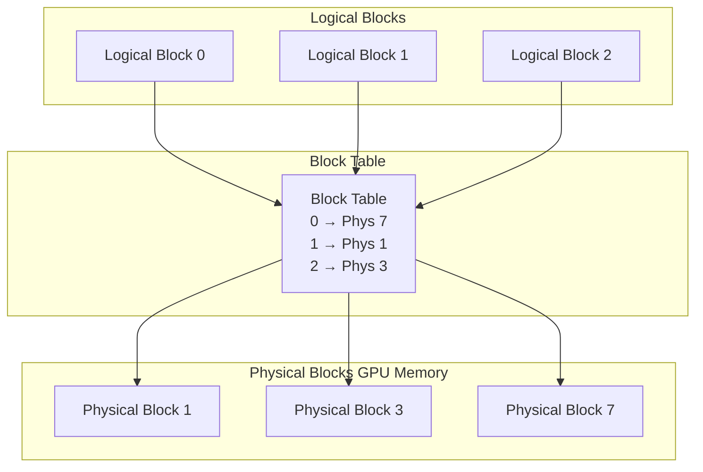
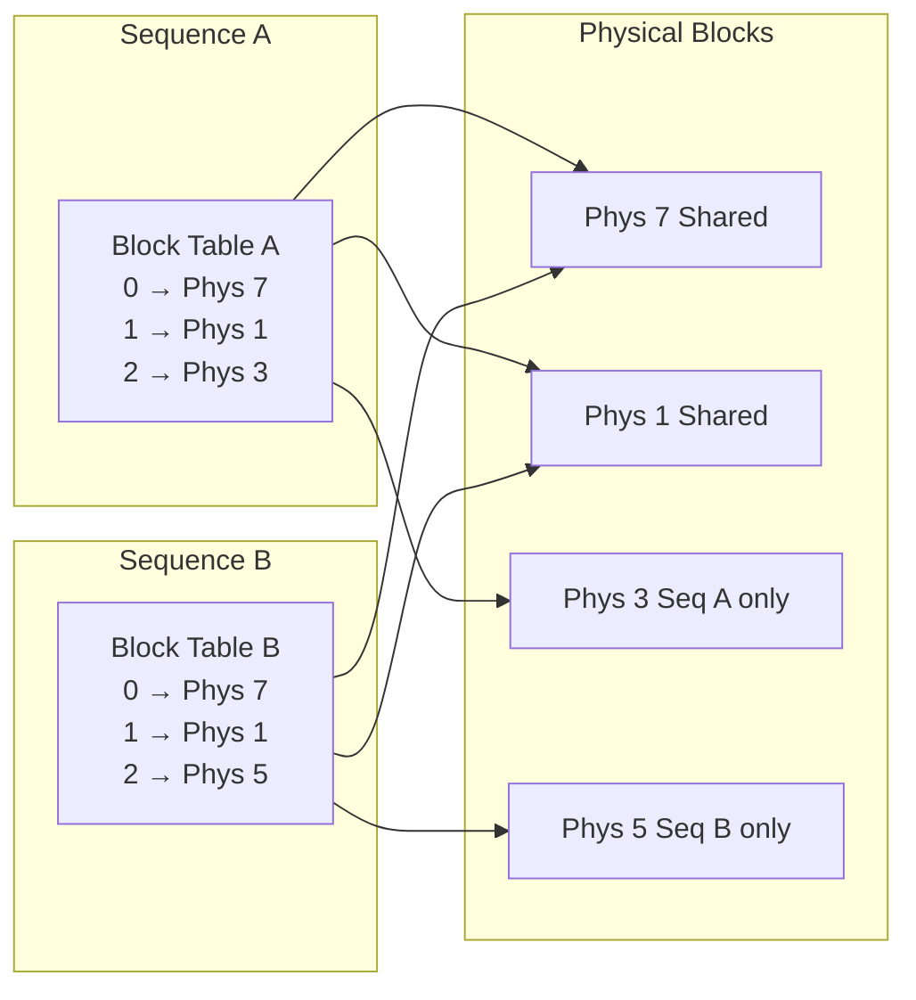

## 論文概要

本記事は [Efficient Memory Management for Large Language Model Serving with PagedAttention](https://arxiv.org/abs/2309.06180)（SOSP 2023）の解説記事です。

LLMの推論サービングでは、リクエストごとに巨大なKVキャッシュが必要となり、そのサイズは動的に変化する。従来のシステムではメモリの断片化や重複確保により、バッチサイズが制限されスループットが低下していた。著者らは、OSの仮想メモリとページングの仕組みに着想を得た「PagedAttention」を提案し、KVキャッシュをほぼ無駄なく管理する手法を示している。この手法を実装したvLLMは、既存システムと比較して2--24倍のスループット向上を達成したと報告されている。

この記事は [Zenn記事: プロンプトキャッシュ実装術：Claude・GPT・Geminiのコスト90%削減パターン](https://zenn.dev/0h_n0/articles/10efd4d3683138) の深掘りです。

## 情報源

- **会議名**: SOSP 2023（ACM Symposium on Operating Systems Principles）
- **年**: 2023（2023年10月23--26日、ドイツ・コブレンツ）
- **URL**: [https://arxiv.org/abs/2309.06180](https://arxiv.org/abs/2309.06180)
- **ACM DL**: [https://dl.acm.org/doi/10.1145/3600006.3613165](https://dl.acm.org/doi/10.1145/3600006.3613165)
- **著者**: Woosuk Kwon, Zhuohan Li, Siyuan Zhuang, Ying Sheng, Lianmin Zheng, Cody Hao Yu, Joseph E. Gonzalez, Hao Zhang, Ion Stoica（UC Berkeley, Stanford University, UC San Diego）
- **採択率**: 43/232件（約19%）

## カンファレンス情報

**SOSPについて**: SOSP（ACM Symposium on Operating Systems Principles）は、オペレーティングシステム分野における最高峰の国際会議であり、1967年の初回開催以来、2年に1度開催されている。採択率は通常15--20%程度と競争率が高く、OSだけでなく分散システム、ストレージ、ネットワーキングなど広くシステム研究を扱う。本論文はSOSP 2023で採択され、LLM推論のメモリ管理というシステム寄りの課題に対してOSの古典的手法を適用した点が評価された。

## 技術的詳細

### 背景: KVキャッシュのメモリ問題

Transformerベースの自己回帰LLMでは、推論時に各レイヤーで過去のトークンのKey-Valueベクトルを保持する「KVキャッシュ」が必要となる。例えば、LLaMA-13Bでは1リクエストあたり最大1.7GBのKVキャッシュが必要になると著者らは報告している。

従来のシステムではKVキャッシュを連続メモリ領域に事前確保していた。しかし、リクエストごとに出力長が異なるため、以下の問題が生じていた。

- **内部断片化**: 最大出力長分をあらかじめ確保するが、実際の出力が短い場合にメモリが無駄になる
- **外部断片化**: 異なるサイズのリクエストが完了・到着するたびにメモリ空間に隙間が生じる
- **重複確保**: beam searchやparallel samplingで同一プレフィックスのKVを各シーケンスが独立に保持する

著者らの分析によれば、既存システムでは実際に使われるKVキャッシュメモリの60--80%が断片化や予約による無駄であったと報告されている。

### PagedAttentionアルゴリズム

PagedAttentionはOSの仮想メモリ管理を模倣し、KVキャッシュを固定サイズの**ブロック**（ページ）に分割する。各ブロックにはデフォルトで$B = 16$トークン分のKey-Valueベクトルが格納される。

標準的なAttentionの計算式は以下の通りである。

$$
\text{Attention}(Q, K, V) = \text{softmax}\left(\frac{QK^T}{\sqrt{d_k}}\right) V
$$

ここで、
- $Q \in \mathbb{R}^{1 \times d_k}$: 現在のトークンのQueryベクトル
- $K \in \mathbb{R}^{n \times d_k}$: 過去$n$トークンのKeyベクトル
- $V \in \mathbb{R}^{n \times d_v}$: 過去$n$トークンのValueベクトル
- $d_k$: Keyの次元数

PagedAttentionでは、$K$と$V$がブロック単位で非連続なメモリ上に分散配置される。ブロック数を$N = \lceil n / B \rceil$とすると、PagedAttentionは以下のように計算される。

$$
A_j = \frac{\exp(q K_j^T / \sqrt{d_k})}{\sum_{i=1}^{N} \sum_{k=1}^{B} \exp(q k_{i,k}^T / \sqrt{d_k})}, \quad o = \sum_{j=1}^{N} A_j V_j
$$

ここで、
- $K_j \in \mathbb{R}^{B \times d_k}$: $j$番目のブロック内のKeyベクトル
- $V_j \in \mathbb{R}^{B \times d_v}$: $j$番目のブロック内のValueベクトル
- $A_j$: $j$番目のブロックに対するAttention重み行列
- $q$: 現在のQueryベクトル
- $k_{i,k}$: $i$番目のブロックの$k$番目のKeyベクトル

### ブロックテーブルによるメモリ管理

OSのページテーブルと同様に、各シーケンスは**ブロックテーブル**（論理ブロック→物理ブロックの対応表）を持つ。



新しいトークンが生成されるたびに、現在の物理ブロックに空きがあればそこに追記し、満杯であれば新しい物理ブロックを動的に割り当てる。シーケンス完了時にはブロックを即座にフリーリストへ返却する。この仕組みにより、内部断片化はシーケンスごとに最大$B-1$トークン分、すなわち最終ブロックの未使用スロットのみに抑えられる。

### Copy-on-Writeによるメモリ共有

beam searchやparallel samplingでは、同一プレフィックスから複数の出力候補を生成する。PagedAttentionでは、共有プレフィックスのブロックを各シーケンスのブロックテーブルから同一の物理ブロックを指すことで、メモリを共有する。



各物理ブロックには参照カウントが付与されている。参照カウントが2以上のブロックに書き込みが発生した場合のみ、そのブロックをコピーしてから書き込む（Copy-on-Write）。著者らは、この機構によりbeam search時のメモリ使用量を最大55%削減できたと報告している。

### Prefix Caching

同一のシステムプロンプトやFew-shot例を含むリクエスト群では、プレフィックス部分のKVキャッシュを共有できる。PagedAttentionのブロック単位管理により、prefix cachingはブロックテーブルのポインタ共有として自然に実現される。これは、関連Zenn記事で解説しているClaude・GPT・Geminiのプロンプトキャッシュ機構と同じ着想に基づいている。

## 実装のポイント

vLLMはPagedAttentionを専用のCUDAカーネルとして実装している。物理ブロックが非連続なメモリ上に散在するため、標準的なAttentionカーネルはそのままでは使えない。vLLMのカーネルはブロックテーブルを参照してKey/Valueを間接アクセスし、ブロックごとにAttentionスコアを計算した後に集約する。

Flash Attentionとの組み合わせも可能である。Flash Attentionはtile単位で計算する設計であるため、PagedAttentionのブロック単位アクセスと相性が良い。vLLM v0.21.0（2026年5月時点の最新版）ではFlash Attentionバックエンドを選択可能で、FlexAttention APIを通じた統合も進んでいる。

ブロックサイズ$B$の選択はトレードオフである。$B$が小さいと断片化は減るがブロックテーブルのオーバーヘッドが増え、$B$が大きいとカーネル効率は上がるが内部断片化が増える。著者らはデフォルト値として$B = 16$を採用し、実験によりこの値が良好なバランスを示すことを確認している。

## Production Deployment Guide

vLLMはApache 2.0ライセンスでオープンソース公開されており、本番環境への導入が進んでいる。以下では、AWS上でvLLMを用いたLLM推論サービスを構築する際のガイドを示す。

### AWS実装パターン（コスト最適化重視）

以下のコスト試算は2026年5月時点のAWS ap-northeast-1（東京）リージョンのオンデマンド料金に基づく概算値である。実際のコストはトラフィックパターン、リージョン、バースト使用量により変動するため、最新料金は[AWS料金計算ツール](https://calculator.aws/)で確認を推奨する。

**トラフィック量別の推奨構成**:

| 構成 | トラフィック | GPU | インスタンス | 月額概算 |
|------|------------|-----|-------------|---------|
| Small | ~100 req/日 | A10G x4 | g5.12xlarge | $1,500--2,500 |
| Medium | ~1,000 req/日 | A10G x4 x2台 | g5.12xlarge x2 | $4,000--7,000 |
| Large | 10,000+ req/日 | A100 x8 | p4d.24xlarge | $15,000--25,000 |

**Small構成（~100 req/日）**: g5.12xlarge（A10G x4、96GB VRAM合計）をSpot Instanceで運用する。オンデマンド$8.23/hのところ、Spot利用で60--70%削減が見込める。7Bクラスのモデルを単一GPUに載せ、vLLMの`--tensor-parallel-size 1`で起動する。月額概算: Spot $8.23 x 0.35 x 730h = 約$2,100（Spot割引後）。

**Medium構成（~1,000 req/日）**: g5.12xlarge x2台をECS/EKSで管理し、ALBでルーティングする。vLLMの`--tensor-parallel-size 4`でA10G 4枚を使い、13Bクラスのモデルを提供する。Karpenterによるオートスケーリングでピーク時のみ2台目を起動する。

**Large構成（10,000+ req/日）**: p4d.24xlarge（A100 x8、320GB VRAM合計）でEKSクラスタを構成する。70B以上のモデルを`--tensor-parallel-size 8`で分散推論する。オンデマンド$30.10/hだが、Reserved Instance（1年全前払い）で約40%削減、月額約$13,100に抑えられる。

**コスト削減テクニック**:
- Spot Instances活用: g5系で60--70%、p4d系で50--60%の削減（中断リスクあり）
- Reserved Instances（1年）: 約36--40%削減
- Savings Plans（3年）: 最大72%削減
- vLLMのprefix caching有効化: 共通プレフィックスが多い場合にスループット向上、結果としてインスタンス台数削減

### Terraformインフラコード

**Small構成（ECS + Spot）**:

```hcl
# vLLM Small構成: ECS Fargate Spot + g5.12xlarge
# 2026年5月時点の設定

terraform {
  required_version = ">= 1.12"
  required_providers {
    aws = {
      source  = "hashicorp/aws"
      version = "~> 6.46"
    }
  }
}

provider "aws" {
  region = "ap-northeast-1"
}

# --- VPC（コスト削減: NAT Gateway 1つのみ） ---
module "vpc" {
  source  = "terraform-aws-modules/vpc/aws"
  version = "~> 5.16"

  name = "vllm-small-vpc"
  cidr = "10.0.0.0/16"

  azs             = ["ap-northeast-1a", "ap-northeast-1c"]
  private_subnets = ["10.0.1.0/24", "10.0.2.0/24"]
  public_subnets  = ["10.0.101.0/24", "10.0.102.0/24"]

  enable_nat_gateway = true
  single_nat_gateway = true  # コスト削減: 1つのNAT Gatewayで十分

  tags = {
    Environment = "production"
    Project     = "vllm-serving"
  }
}

# --- ECS Cluster + Capacity Provider (GPU Spot) ---
resource "aws_ecs_cluster" "vllm" {
  name = "vllm-serving"

  setting {
    name  = "containerInsights"
    value = "enabled"  # CloudWatch Container Insights
  }
}

resource "aws_launch_template" "vllm_gpu" {
  name_prefix   = "vllm-gpu-"
  image_id      = data.aws_ssm_parameter.ecs_gpu_ami.value
  instance_type = "g5.12xlarge"

  # Spot Instance設定
  instance_market_options {
    market_type = "spot"
    spot_options {
      max_price          = "4.00"  # オンデマンドの約49%
      spot_instance_type = "persistent"
    }
  }

  user_data = base64encode(<<-EOF
    #!/bin/bash
    echo ECS_CLUSTER=vllm-serving >> /etc/ecs/ecs.config
    echo ECS_ENABLE_GPU_SUPPORT=true >> /etc/ecs/ecs.config
    EOF
  )

  tag_specifications {
    resource_type = "instance"
    tags = {
      Name = "vllm-gpu-spot"
    }
  }
}

data "aws_ssm_parameter" "ecs_gpu_ami" {
  name = "/aws/service/ecs/optimized-ami/amazon-linux-2023/gpu/recommended/image_id"
}

# --- CloudWatch アラーム（コスト監視） ---
resource "aws_cloudwatch_metric_alarm" "cost_alert" {
  alarm_name          = "vllm-daily-cost-alert"
  comparison_operator = "GreaterThanThreshold"
  evaluation_periods  = 1
  metric_name         = "EstimatedCharges"
  namespace           = "AWS/Billing"
  period              = 86400
  statistic           = "Maximum"
  threshold           = 150  # $150/日を超えたらアラート
  alarm_actions       = [aws_sns_topic.alerts.arn]

  dimensions = {
    Currency = "USD"
  }
}

resource "aws_sns_topic" "alerts" {
  name = "vllm-cost-alerts"
}
```

**Large構成（EKS + Karpenter + GPU Nodes）**:

```hcl
# vLLM Large構成: EKS + Karpenter + p4d Spot/On-Demand
# Kubernetes 1.35 / EKS module 21.20

module "eks" {
  source  = "terraform-aws-modules/eks/aws"
  version = "~> 21.20"

  cluster_name    = "vllm-large"
  cluster_version = "1.35"

  vpc_id     = module.vpc.vpc_id
  subnet_ids = module.vpc.private_subnets

  # コントロールプレーンのみ（ノードはKarpenterが管理）
  cluster_endpoint_public_access = false

  # EKS Addons
  cluster_addons = {
    coredns    = { most_recent = true }
    kube-proxy = { most_recent = true }
    vpc-cni    = { most_recent = true }
  }

  tags = {
    Environment = "production"
    Project     = "vllm-serving"
    "karpenter.sh/discovery" = "vllm-large"
  }
}

# --- Karpenter NodePool（Spot優先、GPU） ---
resource "kubectl_manifest" "karpenter_nodepool" {
  yaml_body = <<-YAML
    apiVersion: karpenter.sh/v1
    kind: NodePool
    metadata:
      name: gpu-inference
    spec:
      template:
        spec:
          requirements:
            - key: "node.kubernetes.io/instance-type"
              operator: In
              values: ["p4d.24xlarge", "g5.48xlarge"]
            - key: "karpenter.sh/capacity-type"
              operator: In
              values: ["spot", "on-demand"]  # Spot優先
          taints:
            - key: nvidia.com/gpu
              effect: NoSchedule
      limits:
        cpu: "384"
        memory: "3072Gi"
        nvidia.com/gpu: "16"
      disruption:
        consolidationPolicy: WhenEmptyOrUnderutilized
        consolidateAfter: 60s
  YAML
}

# --- Secrets Manager（モデル設定） ---
resource "aws_secretsmanager_secret" "vllm_config" {
  name                    = "vllm/model-config"
  recovery_window_in_days = 7
}

resource "aws_secretsmanager_secret_version" "vllm_config" {
  secret_id = aws_secretsmanager_secret.vllm_config.id
  secret_string = jsonencode({
    model_name       = "meta-llama/Llama-3.3-70B-Instruct"
    tensor_parallel  = 8
    gpu_memory_util  = 0.90
    max_model_len    = 8192
    enable_prefix_caching = true
  })
}

# --- AWS Budgets（月次予算アラート） ---
resource "aws_budgets_budget" "vllm_monthly" {
  name         = "vllm-monthly-budget"
  budget_type  = "COST"
  limit_amount = "20000"
  limit_unit   = "USD"
  time_unit    = "MONTHLY"

  notification {
    comparison_operator       = "GREATER_THAN"
    threshold                 = 80
    threshold_type            = "PERCENTAGE"
    notification_type         = "ACTUAL"
    subscriber_email_addresses = ["ops-team@example.com"]
  }

  notification {
    comparison_operator       = "GREATER_THAN"
    threshold                 = 100
    threshold_type            = "PERCENTAGE"
    notification_type         = "FORECASTED"
    subscriber_email_addresses = ["ops-team@example.com"]
  }
}
```

### 運用・監視設定

**CloudWatch Logs Insights クエリ（リクエストレイテンシ分析）**:

```
# vLLMのP95/P99レイテンシを1時間ごとに集計
fields @timestamp, @message
| filter @message like /latency/
| stats percentile(latency_ms, 95) as p95,
        percentile(latency_ms, 99) as p99,
        avg(latency_ms) as avg_latency,
        count() as request_count
  by bin(1h)
| sort @timestamp desc
```

**CloudWatch アラーム設定（Python）**:

```python
import boto3
from typing import Any


def create_vllm_alarms(
    sns_topic_arn: str,
    cluster_name: str = "vllm-serving",
) -> list[dict[str, Any]]:
    """vLLM推論クラスタのCloudWatchアラームを作成する。

    Args:
        sns_topic_arn: 通知先のSNSトピックARN
        cluster_name: ECS/EKSクラスタ名

    Returns:
        作成したアラームのリスト
    """
    cw = boto3.client("cloudwatch", region_name="ap-northeast-1")
    alarms: list[dict[str, Any]] = []

    # GPU使用率アラーム
    response = cw.put_metric_alarm(
        AlarmName=f"{cluster_name}-gpu-utilization-high",
        MetricName="GPUUtilization",
        Namespace="ECS/ContainerInsights",
        Statistic="Average",
        Period=300,
        EvaluationPeriods=3,
        Threshold=95.0,
        ComparisonOperator="GreaterThanThreshold",
        AlarmActions=[sns_topic_arn],
        Dimensions=[
            {"Name": "ClusterName", "Value": cluster_name},
        ],
    )
    alarms.append(response)

    # KVキャッシュ使用率アラーム（vLLMカスタムメトリクス）
    response = cw.put_metric_alarm(
        AlarmName=f"{cluster_name}-kv-cache-utilization-high",
        MetricName="KVCacheUtilization",
        Namespace="vLLM/Inference",
        Statistic="Average",
        Period=60,
        EvaluationPeriods=5,
        Threshold=90.0,
        ComparisonOperator="GreaterThanThreshold",
        AlarmActions=[sns_topic_arn],
    )
    alarms.append(response)

    return alarms
```

**X-Ray トレーシング設定（Python）**:

```python
from aws_xray_sdk.core import xray_recorder, patch_all
from aws_xray_sdk.ext.flask.middleware import XRayMiddleware


def setup_xray_tracing(app: Any, service_name: str = "vllm-proxy") -> None:
    """X-Rayトレーシングを設定する。

    Args:
        app: FlaskまたはFastAPIアプリケーション
        service_name: X-Rayサービス名
    """
    xray_recorder.configure(service=service_name)
    patch_all()  # boto3, requests等を自動計装
    XRayMiddleware(app, xray_recorder)
```

**Cost Explorer 日次レポート（Python）**:

```python
import boto3
from datetime import datetime, timedelta
from typing import Any


def get_daily_vllm_cost(days: int = 1) -> dict[str, Any]:
    """vLLM関連の日次AWSコストを取得する。

    Args:
        days: 取得する日数

    Returns:
        サービス別コスト内訳
    """
    ce = boto3.client("ce", region_name="ap-northeast-1")
    end = datetime.utcnow().strftime("%Y-%m-%d")
    start = (datetime.utcnow() - timedelta(days=days)).strftime("%Y-%m-%d")

    response = ce.get_cost_and_usage(
        TimePeriod={"Start": start, "End": end},
        Granularity="DAILY",
        Filter={
            "Tags": {
                "Key": "Project",
                "Values": ["vllm-serving"],
            }
        },
        Metrics=["UnblendedCost"],
        GroupBy=[
            {"Type": "DIMENSION", "Key": "SERVICE"},
        ],
    )

    costs: dict[str, float] = {}
    for result in response["ResultsByTime"]:
        for group in result["Groups"]:
            service = group["Keys"][0]
            amount = float(group["Metrics"]["UnblendedCost"]["Amount"])
            costs[service] = costs.get(service, 0.0) + amount

    # $100/日超過でSNS通知
    total = sum(costs.values())
    if total > 100.0:
        sns = boto3.client("sns", region_name="ap-northeast-1")
        sns.publish(
            TopicArn="arn:aws:sns:ap-northeast-1:ACCOUNT_ID:vllm-cost-alerts",
            Subject=f"vLLM日次コスト超過: ${total:.2f}",
            Message=f"日次コスト合計: ${total:.2f}\n内訳: {costs}",
        )

    return {"total": total, "by_service": costs}
```

### コスト最適化チェックリスト

**アーキテクチャ選択**:
- [ ] トラフィック量に応じた構成を選択（Small: g5 Spot / Medium: g5 x2 / Large: p4d EKS）
- [ ] GPUメモリに対してモデルサイズが適切か確認（7B→A10G 1枚、13B→A10G 4枚、70B→A100 8枚）

**リソース最適化**:
- [ ] Spot Instances優先（g5: 60--70%削減、p4d: 50--60%削減）
- [ ] Reserved Instances: 安定トラフィックなら1年コミットで36--40%削減
- [ ] Savings Plans: 3年コミットで最大72%削減
- [ ] `--gpu-memory-utilization 0.90`で設定（A100の場合）
- [ ] 開発環境は夜間・週末に自動停止（Karpenter consolidation）

**vLLMチューニング**:
- [ ] prefix caching有効化（`--enable-prefix-caching`）
- [ ] chunked prefill有効化（長いプロンプトのprefillとdecodeを並列化）
- [ ] `--max-model-len`を実際の最大入力長に合わせて制限
- [ ] continuous batchingの`--max-num-seqs`を適切に設定

**監視・アラート**:
- [ ] AWS Budgets: 月次予算アラート設定
- [ ] CloudWatch: GPU使用率、KVキャッシュ使用率、レイテンシP99
- [ ] Cost Anomaly Detection有効化
- [ ] 日次コストレポートをSNSで通知

**リソース管理**:
- [ ] 未使用のEBSボリューム・スナップショット定期削除
- [ ] タグ戦略: `Project=vllm-serving`でコスト追跡
- [ ] ECRイメージのライフサイクルポリシー（古いイメージを自動削除）
- [ ] CloudWatch Logs保持期間を90日に設定

## 実験結果

著者らはA100 GPU（80GB）上でOPT-13B、OPT-175B、LLaMA-13Bを用いて評価を行っている。ワークロードにはShareGPT（実際のChatGPT対話ログ、平均出力長が長い）とAlpaca（短い指示応答）の2種類を使用している。

| モデル | データセット | 比較対象 | スループット比 |
|--------|------------|----------|--------------|
| OPT-13B | ShareGPT | FasterTransformer | 最大24倍（論文Table 3より） |
| OPT-13B | ShareGPT | HuggingFace TGI | 最大3.5倍（論文Table 3より） |
| OPT-175B | ShareGPT | FasterTransformer | 最大2.2倍（論文Table 3より） |
| LLaMA-13B | Alpaca | FasterTransformer | 最大22倍（論文Table 3より） |

著者らは、スループット向上の主要因はメモリ効率化によるバッチサイズの増大であると分析している。PagedAttentionのブロック管理によるCUDAカーネルのオーバーヘッドは平均20--26%と報告されているが、バッチサイズ増大による並列処理の効果がそれを大きく上回るとしている。ShareGPTのように出力長の分散が大きいワークロードほど、従来システムとの差が顕著になる。

## 実運用への応用

PagedAttentionの設計思想は、関連Zenn記事で解説しているAPI経由のプロンプトキャッシュと共通点が多い。Claude、GPT、Geminiのプロンプトキャッシュ機能は、APIレベルで同一プレフィックスのKVキャッシュを再利用する仕組みであり、PagedAttentionのprefix cachingと本質的に同じ発想に基づいている。

実務上の使い分けとしては、マネージドAPIを利用する場合はAPI側のプロンプトキャッシュ機能（Zenn記事参照）を活用し、自社GPUでモデルをセルフホスティングする場合はvLLM + PagedAttentionが有力な選択肢となる。

vLLMは2026年5月時点でv0.21.0がリリースされており、gRPCサービング、speculative decoding（GPUベース）、FlexKV（KVキャッシュオフロード）、Automatic Prefix Caching、chunked prefillなど、PagedAttentionを基盤とした多数の最適化が本番利用可能である。Stripeが自社のLLM推論基盤をvLLMに移行し、推論コストを73%削減した事例も報告されている。

## 関連研究

- **Flash Attention**（Dao et al., 2022）: HBMとSRAM間のデータ移動を最小化するI/O-aware Attentionアルゴリズム。PagedAttentionとは直交する最適化であり、組み合わせて利用可能。
- **Orca**（Yu et al., OSDI 2022）: continuous batching（iteration-level scheduling）を提案し、LLM推論のスループットを改善。vLLMはOrcaのcontinuous batchingとPagedAttentionを統合している。
- **FlexGen**（Sheng et al., ICML 2023）: CPU/ディスクへのKVキャッシュオフロードにより、限られたGPUメモリで大規模モデルを動作させる手法。PagedAttentionとは異なりスループットよりもアクセシビリティを重視する。

## まとめと今後の展望

PagedAttentionはOSの仮想メモリ管理という古典的な手法をGPU上のKVキャッシュ管理に適用し、LLM推論のメモリ効率を根本的に改善した。ブロック単位の動的割り当て、Copy-on-Write、prefix cachingという3つの仕組みにより、メモリの無駄をほぼゼロに抑えつつ、スループットを最大24倍向上させた。vLLMとして広く実用化され、LLM推論サービングのデファクトスタンダードとなりつつある。

今後の方向性としては、KVキャッシュのCPU/ディスクオフロードとの統合（FlexKVとして既に開発中）、マルチノード分散推論でのブロック共有、speculative decodingとの組み合わせ最適化などが進んでおり、LLM推論のコスト効率はさらに改善が見込まれる。

## 参考文献

- **Conference URL**: [https://dl.acm.org/doi/10.1145/3600006.3613165](https://dl.acm.org/doi/10.1145/3600006.3613165)
- **arXiv**: [https://arxiv.org/abs/2309.06180](https://arxiv.org/abs/2309.06180)
- **Code**: [https://github.com/vllm-project/vllm](https://github.com/vllm-project/vllm)（Apache 2.0）
- **Related Zenn article**: [https://zenn.dev/0h_n0/articles/10efd4d3683138](https://zenn.dev/0h_n0/articles/10efd4d3683138)
- **SOSP 2023 Accepted Papers**: [https://sosp2023.mpi-sws.org/accepted.html](https://sosp2023.mpi-sws.org/accepted.html)
- **vLLM Documentation**: [https://docs.vllm.ai/](https://docs.vllm.ai/)
