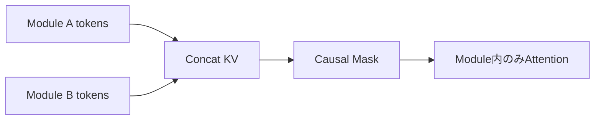

## 論文概要

本記事は [Prompt Cache: Modular Attention Reuse for Low-Latency Inference](https://arxiv.org/abs/2311.04934)（MLSys 2024）の解説記事です。

著者らは、LLMの推論においてプロンプト間で共通するテキストセグメント（システムメッセージ、プロンプトテンプレート、コンテキスト文書など）のAttentionステート（KVキャッシュ）を事前計算・保存し、リクエスト時に再利用することでTime-to-First-Token（TTFT）を削減する手法「Prompt Cache」を提案している。GPU推論で最大8倍、CPU推論で最大60倍のTTFT削減を、モデルパラメータの変更なしに達成したと報告している。

この記事は [Zenn記事: プロンプトキャッシュ実装術：Claude・GPT・Geminiのコスト90%削減パターン](https://zenn.dev/0h_n0/articles/10efd4d3683138) の深掘りです。

## 情報源

- **会議名**: MLSys 2024（The 7th Conference on Machine Learning and Systems）
- **URL**: <https://arxiv.org/abs/2311.04934>
- **著者**: In Gim, Guojun Chen, Seung-seob Lee, Nikhil Sarda, Anurag Khandelwal, Lin Zhong（Yale University, Google）
- **初版投稿**: 2023年11月（arXiv v1）、2024年4月改訂（v2）
- **発表形式**: Poster

## カンファレンス情報

MLSys（Conference on Machine Learning and Systems）は、機械学習とシステム設計の交差領域を対象としたトップカンファレンスである。NeurIPSやICMLが主にアルゴリズム・理論に焦点を当てるのに対し、MLSysは推論効率、分散学習、ハードウェア最適化など、実システムの設計・実装に重点を置いている。MLSys 2024はワシントン州で開催された。

## 技術的詳細

### 背景: Prefillの計算コスト

Transformerベースの LLM はAutoregressive推論において、プロンプトの全トークンに対してAttention計算（Prefill）を実行してからトークン生成を開始する。Prefillの計算量は以下の通りである。

$$
\text{FLOPs}_{\text{prefill}} = 6nd^2 + 4n^2d
$$

ここで、$n$ はプロンプトのトークン数、$d$ はモデルの隠れ次元数を表す。第1項がLinear Projectionの計算量、第2項がAttentionスコア計算の計算量に対応する。$n$ が大きいとき $O(n^2)$ で増大するため、長いプロンプトではPrefillがTTFTのボトルネックとなる。

一方、KVキャッシュが利用可能な場合、新規トークンのみの計算量は以下となる。

$$
\text{FLOPs}_{\text{cached}} = 6d^2 + 4nd
$$

これは1トークンあたりの計算量であり、$n$ に対して線形である。Prompt Cacheの核心は、プロンプトの大部分をキャッシュ済みにすることで、Prefill計算を $O(n^2)$ から実質的に排除する点にある。

### Prompt Markup Language（PML）

Prompt Cacheの中核をなすのが、再利用可能なテキストセグメントを宣言的に定義するためのスキーマ言語「Prompt Markup Language（PML）」である。PMLはXML風の構文を用い、以下の要素で構成される。

```xml
<schema name="travel-assistant">
  <module name="system-prompt">
    You are a helpful travel assistant...
  </module>
  <module name="trip-plan">
    Plan a trip to Miami for
    <param name="duration" len="10"/> days.
  </module>
  <union>
    <module name="budget-style">Budget-friendly options...</module>
    <module name="luxury-style">Luxury options...</module>
  </union>
</schema>
```

```xml
<prompt schema="travel-assistant">
  <system-prompt/>
  <trip-plan duration="3"/>
  <budget-style/>
  What restaurants do you recommend?
</prompt>
```

重要な設計要素は以下の3つである。

- **module**: 再利用可能なテキストセグメント。system prompt、few-shot examples、ドキュメントコンテキストなどを定義する
- **param**: モジュール内の可変部分。スキーマ登録時には `<unk>` トークンでプレースホルダとし、推論時に実際の値で置換する。`len` 属性で最大トークン長を指定する
- **union**: 排他的なモジュールグループ。同じ位置IDを共有し、いずれか1つのみが選択される

### 位置エンコーディングの管理

Transformerでは位置エンコーディングがトークンの位置情報を担うため、KVキャッシュの再利用には位置IDの正確な管理が不可欠である。Prompt Cacheでは以下のルールで位置IDを割り当てる。

あるモジュール $m_i$ の開始位置IDは、スキーマ内での絶対位置に基づき決定される。先行するモジュール $m_1, m_2, \ldots, m_{i-1}$ のトークン数をそれぞれ $l_1, l_2, \ldots, l_{i-1}$ とすると、

$$
\text{pos\_start}(m_i) = \sum_{j=1}^{i-1} l_j
$$

と定義される。例えば、先行する2つのモジュールが50トークンと60トークンの場合、3番目のモジュールの開始位置IDは110となる。

著者らの実験によると、位置IDが不連続であってもトークン間の相対位置が保存されていればモデルの出力品質に影響しないことが確認されている。この性質により、スキーマ内のモジュールを任意に選択・組み合わせてKVキャッシュをアセンブルできる。

### KVキャッシュのアセンブリ

推論時のKVキャッシュ結合は、モジュール $A$ と $B$ のKV状態に対して以下のように行われる。

$$
(\mathbf{k}_C, \mathbf{v}_C) = (\text{concat}(\mathbf{k}_A, \mathbf{k}_B),\ \text{concat}(\mathbf{v}_A, \mathbf{v}_B))
$$

Transformerの Attention は Key-Value 対の順序に対して置換不変（permutation invariant）であるため、結合順序は出力に影響しない。ただし、位置IDはスキーマ定義に従って正確に割り当てる必要がある。

### Attention因果マスクの扱い

モジュール間のAttention計算において、著者らは各モジュールの内部でのみAttentionスコアを計算し、モジュール間のAttentionをマスクする手法を採用している。



この局所的マスキングにより、各モジュールは意味的に独立していることが前提となる。モジュール間に依存関係がある場合（例: ドキュメントの前半と後半）、「scaffolding」と呼ばれる手法で複数モジュールをまとめてエンコードできるが、メモリ効率は低下する。

## 実装のポイント

Prompt CacheのプロトタイプはHugging Face Transformersをベースに実装されている。実装上の主な課題は以下の通りである。

**位置IDの再割り当て**: Hugging Face Transformersの標準APIでは位置IDは連続を前提としている。Prompt Cacheではモジュール選択に応じて不連続な位置IDを渡す必要があり、`position_ids` 引数を明示的に制御する改修が必要となる。

**KVキャッシュのメモリ管理**: キャッシュのメモリ消費はモデルサイズに比例する。論文Table 2によると、1トークンあたりのメモリ消費は LLaMA 7Bで0.50 MB、LLaMA 13Bで0.78 MB、LLaMA 70Bで2.5 MBである。大規模モデルではCPUメモリへの退避とGPUへの転送が必要となる。

**PMLスキーマの設計**: アプリケーション開発者がスキーマを設計する必要がある。効果的なスキーマ設計の指針として、(1) 意味的に独立したモジュール分割、(2) 高頻度で再利用されるセグメントの特定、(3) パラメータ長の適切な見積もりが挙げられる。

```python
from dataclasses import dataclass
from typing import Optional

import torch


@dataclass
class PromptModule:
    """Prompt Cacheにおける再利用可能なモジュール定義

    Attributes:
        name: モジュール名（スキーマ内で一意）
        tokens: トークンID列
        position_ids: 各トークンの位置ID
        kv_cache: 事前計算済みKVキャッシュ（layerごと）
    """
    name: str
    tokens: torch.Tensor
    position_ids: torch.Tensor
    kv_cache: Optional[list[tuple[torch.Tensor, torch.Tensor]]] = None

    def encode(self, model: "PreTrainedModel") -> None:
        """モジュールのKVキャッシュを事前計算する

        Args:
            model: Hugging Face Transformersモデル
        """
        with torch.no_grad():
            outputs = model(
                input_ids=self.tokens.unsqueeze(0),
                position_ids=self.position_ids.unsqueeze(0),
                use_cache=True,
            )
        self.kv_cache = outputs.past_key_values


def assemble_kv_cache(
    modules: list[PromptModule],
) -> list[tuple[torch.Tensor, torch.Tensor]]:
    """複数モジュールのKVキャッシュを結合する

    Args:
        modules: 結合するPromptModuleのリスト

    Returns:
        結合済みKVキャッシュ（layer数分のタプルリスト）
    """
    num_layers = len(modules[0].kv_cache)
    assembled: list[tuple[torch.Tensor, torch.Tensor]] = []

    for layer_idx in range(num_layers):
        keys = torch.cat(
            [m.kv_cache[layer_idx][0] for m in modules], dim=2
        )
        values = torch.cat(
            [m.kv_cache[layer_idx][1] for m in modules], dim=2
        )
        assembled.append((keys, values))

    return assembled
```

## Production Deployment Guide

本セクションでは、Prompt Cacheの手法をAWS上で本番運用する場合の設計パターンを解説する。Prompt Cacheの本質は「KVキャッシュの事前計算・共有による Prefill 省略」であり、AWS のマネージドサービスと組み合わせることで効率的な推論基盤を構築できる。

> **注意**: 以下のコスト試算は2026年5月時点のAWS ap-northeast-1（東京）リージョンの料金に基づく概算値です。実際のコストはトラフィックパターン、リージョン、バースト使用量により変動します。最新料金は [AWS料金計算ツール](https://calculator.aws/) で確認してください。

### AWS実装パターン

#### Small構成（~100 req/日）: Lambda + Bedrock + DynamoDB

| サービス | 用途 | 月額概算 |
|---------|------|---------|
| Lambda | リクエスト処理 | ~$5 |
| Bedrock (Claude Haiku) | LLM推論 | ~$30-80 |
| DynamoDB | プロンプトモジュール管理 | ~$5 |
| CloudWatch | ログ・監視 | ~$10 |
| **合計** | | **$50-100** |

Bedrock のプロンプトキャッシュ機能を利用すれば、キャッシュ読み取りトークンのコストが最大90%削減される。system promptやfew-shot examplesなど固定セグメントをキャッシュ対象とすることで、論文のPrompt Cacheと同等の効果を得られる。

#### Medium構成（~1,000 req/日）: ECS Fargate + Bedrock

| サービス | 用途 | 月額概算 |
|---------|------|---------|
| ECS Fargate (2 vCPU, 4GB) | アプリケーション | ~$120 |
| Bedrock (Claude Sonnet) | LLM推論 | ~$200-500 |
| ElastiCache (Redis) | KVキャッシュストア | ~$50 |
| DynamoDB | メタデータ管理 | ~$10 |
| CloudWatch + X-Ray | 監視・トレーシング | ~$20 |
| **合計** | | **$400-700** |

ElastiCacheをKVキャッシュのメタデータストアとして使用し、頻出プロンプトモジュールのキャッシュヒット率を管理する。

#### Large構成（10,000+ req/日）: EKS + Karpenter + Self-hosted推論

| サービス | 用途 | 月額概算 |
|---------|------|---------|
| EKS コントロールプレーン | クラスタ管理 | ~$73 |
| g5.xlarge Spot (x2) | GPU推論ノード | ~$500 |
| Karpenter | 自動スケーリング | (EKS料金に含む) |
| ElastiCache (Redis Cluster) | KVキャッシュ共有 | ~$200 |
| S3 | キャッシュ永続化 | ~$30 |
| CloudWatch + X-Ray | 監視 | ~$50 |
| **合計** | | **$850-2,500** |

self-hosted推論（vLLM/SGLang）を使用し、Prompt Cache論文の手法を直接実装する。Spot Instances（g5.xlarge: オンデマンド $1.006/hr、Spot で最大70%削減）を Karpenter で管理し、コストを抑制する。

### Terraformインフラコード

#### Small構成（Serverless）

```hcl
# --- Small構成: Lambda + Bedrock + DynamoDB ---
# Prompt Cacheのモジュール管理をDynamoDB、推論をBedrockで実現

terraform {
  required_version = ">= 1.9"
  required_providers {
    aws = {
      source  = "hashicorp/aws"
      version = "~> 5.80"
    }
  }
}

provider "aws" {
  region = "ap-northeast-1"
}

# --- IAMロール（最小権限） ---
resource "aws_iam_role" "lambda_role" {
  name = "prompt-cache-lambda-role"

  assume_role_policy = jsonencode({
    Version = "2012-10-17"
    Statement = [{
      Action = "sts:AssumeRole"
      Effect = "Allow"
      Principal = { Service = "lambda.amazonaws.com" }
    }]
  })
}

resource "aws_iam_role_policy" "lambda_policy" {
  name = "prompt-cache-lambda-policy"
  role = aws_iam_role.lambda_role.id

  policy = jsonencode({
    Version = "2012-10-17"
    Statement = [
      {
        Effect = "Allow"
        Action = [
          "bedrock:InvokeModel",
          "bedrock:InvokeModelWithResponseStream"
        ]
        Resource = "arn:aws:bedrock:ap-northeast-1::foundation-model/*"
      },
      {
        Effect = "Allow"
        Action = [
          "dynamodb:GetItem",
          "dynamodb:PutItem",
          "dynamodb:Query",
          "dynamodb:UpdateItem"
        ]
        Resource = aws_dynamodb_table.prompt_modules.arn
      },
      {
        Effect = "Allow"
        Action = [
          "logs:CreateLogGroup",
          "logs:CreateLogStream",
          "logs:PutLogEvents"
        ]
        Resource = "arn:aws:logs:ap-northeast-1:*:*"
      }
    ]
  })
}

# --- DynamoDB（プロンプトモジュール管理） ---
resource "aws_dynamodb_table" "prompt_modules" {
  name         = "prompt-cache-modules"
  billing_mode = "PAY_PER_REQUEST" # On-Demand: コスト最適化
  hash_key     = "schema_name"
  range_key    = "module_name"

  attribute {
    name = "schema_name"
    type = "S"
  }

  attribute {
    name = "module_name"
    type = "S"
  }

  # KMS暗号化（セキュリティベストプラクティス）
  server_side_encryption {
    enabled = true
  }

  point_in_time_recovery {
    enabled = true
  }

  tags = {
    Project     = "prompt-cache"
    Environment = "production"
    CostCenter  = "llm-inference"
  }
}

# --- Lambda関数 ---
resource "aws_lambda_function" "inference" {
  function_name = "prompt-cache-inference"
  role          = aws_iam_role.lambda_role.arn
  handler       = "handler.lambda_handler"
  runtime       = "python3.12"
  timeout       = 120
  memory_size   = 512 # Bedrock呼び出しのみなら512MBで十分

  filename         = "lambda_package.zip"
  source_code_hash = filebase64sha256("lambda_package.zip")

  environment {
    variables = {
      DYNAMODB_TABLE    = aws_dynamodb_table.prompt_modules.name
      BEDROCK_MODEL_ID  = "anthropic.claude-haiku-4-5-20260514"
      ENABLE_CACHE      = "true"
      LOG_LEVEL         = "INFO"
    }
  }

  tracing_config {
    mode = "Active" # X-Ray トレーシング有効化
  }

  tags = {
    Project = "prompt-cache"
  }
}

# --- CloudWatch アラーム（コスト監視） ---
resource "aws_cloudwatch_metric_alarm" "lambda_duration" {
  alarm_name          = "prompt-cache-lambda-high-duration"
  comparison_operator = "GreaterThanThreshold"
  evaluation_periods  = 3
  metric_name         = "Duration"
  namespace           = "AWS/Lambda"
  period              = 300
  statistic           = "Average"
  threshold           = 30000 # 30秒
  alarm_description   = "Lambda実行時間が30秒を超過"

  dimensions = {
    FunctionName = aws_lambda_function.inference.function_name
  }
}
```

#### Large構成（Container）

```hcl
# --- Large構成: EKS + Karpenter + Spot Instances ---
# Prompt Cacheを直接実装するself-hosted推論基盤

module "eks" {
  source  = "terraform-aws-modules/eks/aws"
  version = "~> 20.31"

  cluster_name    = "prompt-cache-cluster"
  cluster_version = "1.31"

  vpc_id     = module.vpc.vpc_id
  subnet_ids = module.vpc.private_subnets

  # Karpenter用のIRSA設定
  enable_cluster_creator_admin_permissions = true

  cluster_addons = {
    coredns    = { most_recent = true }
    kube-proxy = { most_recent = true }
    vpc-cni    = { most_recent = true }
  }

  tags = {
    Project     = "prompt-cache"
    Environment = "production"
    "karpenter.sh/discovery" = "prompt-cache-cluster"
  }
}

# --- Karpenter NodePool（Spot優先、GPU対応） ---
resource "kubectl_manifest" "karpenter_nodepool" {
  yaml_body = yamlencode({
    apiVersion = "karpenter.sh/v1"
    kind       = "NodePool"
    metadata   = { name = "gpu-inference" }
    spec = {
      template = {
        spec = {
          requirements = [
            {
              key      = "karpenter.sh/capacity-type"
              operator = "In"
              values   = ["spot", "on-demand"] # Spot優先
            },
            {
              key      = "node.kubernetes.io/instance-type"
              operator = "In"
              values   = ["g5.xlarge", "g5.2xlarge"]
            }
          ]
          nodeClassRef = {
            group = "karpenter.k8s.aws"
            kind  = "EC2NodeClass"
            name  = "gpu-nodes"
          }
        }
      }
      disruption = {
        consolidationPolicy = "WhenEmptyOrUnderutilized"
        consolidateAfter    = "60s"
      }
      limits = {
        cpu    = "32"
        memory = "128Gi"
        "nvidia.com/gpu" = "4"
      }
    }
  })
}

# --- Secrets Manager（モデル設定） ---
resource "aws_secretsmanager_secret" "model_config" {
  name        = "prompt-cache/model-config"
  description = "Prompt Cache推論サーバ設定"

  tags = {
    Project = "prompt-cache"
  }
}

# --- AWS Budgets（予算アラート） ---
resource "aws_budgets_budget" "monthly" {
  name         = "prompt-cache-monthly"
  budget_type  = "COST"
  limit_amount = "3000"
  limit_unit   = "USD"
  time_unit    = "MONTHLY"

  notification {
    comparison_operator       = "GREATER_THAN"
    threshold                 = 80
    threshold_type            = "PERCENTAGE"
    notification_type         = "ACTUAL"
    subscriber_email_addresses = ["ops-team@example.com"]
  }

  notification {
    comparison_operator       = "GREATER_THAN"
    threshold                 = 100
    threshold_type            = "PERCENTAGE"
    notification_type         = "FORECASTED"
    subscriber_email_addresses = ["ops-team@example.com"]
  }
}
```

### 運用・監視設定

#### CloudWatch Logs Insights クエリ

```
# 1時間あたりのBedrockトークン使用量（コスト異常検知）
fields @timestamp, @message
| filter @message like /input_tokens/
| stats sum(input_tokens) as total_input,
        sum(output_tokens) as total_output,
        sum(cache_read_tokens) as total_cache_hits
  by bin(1h) as hour
| sort hour desc

# レイテンシ分析（P95, P99）
fields @timestamp, duration_ms
| filter event = "inference_complete"
| stats percentile(duration_ms, 95) as p95,
        percentile(duration_ms, 99) as p99,
        avg(duration_ms) as avg_latency
  by bin(5m)
```

#### CloudWatch アラーム設定

```python
import boto3


def create_cost_alarm(
    function_name: str,
    sns_topic_arn: str,
) -> dict:
    """Bedrockトークン使用量スパイク検知アラームを作成する

    Args:
        function_name: Lambda関数名
        sns_topic_arn: 通知先SNSトピックARN

    Returns:
        CloudWatch put_metric_alarm レスポンス
    """
    cloudwatch = boto3.client("cloudwatch", region_name="ap-northeast-1")

    return cloudwatch.put_metric_alarm(
        AlarmName=f"{function_name}-token-spike",
        MetricName="InputTokenCount",
        Namespace="AWS/Bedrock",
        Statistic="Sum",
        Period=3600,
        EvaluationPeriods=1,
        Threshold=500000,  # 1時間あたり50万トークン
        ComparisonOperator="GreaterThanThreshold",
        AlarmActions=[sns_topic_arn],
        AlarmDescription="Bedrockトークン使用量が閾値を超過",
    )
```

#### X-Ray トレーシング設定

```python
from aws_xray_sdk.core import xray_recorder, patch_all

# boto3への自動計装
patch_all()


@xray_recorder.capture("prompt_cache_inference")
def invoke_with_cache(
    prompt_modules: list[str],
    user_input: str,
) -> str:
    """Prompt Cacheを活用した推論呼び出し

    Args:
        prompt_modules: 使用するプロンプトモジュール名リスト
        user_input: ユーザー入力テキスト

    Returns:
        LLMの生成テキスト
    """
    subsegment = xray_recorder.current_subsegment()
    subsegment.put_annotation("module_count", len(prompt_modules))
    subsegment.put_metadata("modules", prompt_modules)

    # Bedrock呼び出し（キャッシュ有効）
    # ... 推論ロジック ...
    return result
```

#### Cost Explorer 日次レポート

```python
import datetime

import boto3


def get_daily_cost_report() -> dict:
    """日次コストレポートを取得しSNS通知する

    Returns:
        サービス別コスト辞書
    """
    ce = boto3.client("ce", region_name="ap-northeast-1")
    today = datetime.date.today()
    yesterday = today - datetime.timedelta(days=1)

    response = ce.get_cost_and_usage(
        TimePeriod={
            "Start": yesterday.isoformat(),
            "End": today.isoformat(),
        },
        Granularity="DAILY",
        Metrics=["UnblendedCost"],
        Filter={
            "Tags": {
                "Key": "Project",
                "Values": ["prompt-cache"],
            }
        },
        GroupBy=[{"Type": "DIMENSION", "Key": "SERVICE"}],
    )

    costs: dict[str, float] = {}
    for group in response["ResultsByTime"][0]["Groups"]:
        service = group["Keys"][0]
        amount = float(group["Metrics"]["UnblendedCost"]["Amount"])
        costs[service] = amount

    total = sum(costs.values())
    if total > 100.0:
        sns = boto3.client("sns", region_name="ap-northeast-1")
        sns.publish(
            TopicArn="arn:aws:sns:ap-northeast-1:123456789012:cost-alert",
            Subject="Prompt Cache: 日次コスト$100超過",
            Message=f"合計: ${total:.2f}\n内訳: {costs}",
        )

    return costs
```

### コスト最適化チェックリスト

#### アーキテクチャ選択

- [ ] トラフィック量に応じた構成を選択（~100 req/日: Serverless、~1,000: Hybrid、10,000+: Container）
- [ ] Bedrock vs Self-hosted の損益分岐点を計算（月間100万トークン以上ならself-hosted検討）

#### リソース最適化

- [ ] EC2/EKS: Spot Instances を優先（g5.xlarge で最大70%削減）
- [ ] Reserved Instances: 安定ワークロードに1年コミット（最大72%削減）
- [ ] Savings Plans: Compute Savings Plans 検討
- [ ] Lambda: メモリサイズ最適化（Power Tuning で最適値を探索）
- [ ] ECS/EKS: 夜間・休日にスケールダウン設定
- [ ] ElastiCache: Reserved Nodes で最大55%削減

#### LLMコスト削減

- [ ] Bedrock Prompt Caching 有効化（キャッシュ読み取りで最大90%削減）
- [ ] Batch API 使用（非リアルタイム処理で50%削減）
- [ ] モデル選択ロジック（簡単な質問は Haiku、複雑な質問は Sonnet に振り分け）
- [ ] 入力トークン数制限（不要なコンテキストの削除）
- [ ] PMLスキーマ設計の最適化（キャッシュヒット率を監視・改善）

#### 監視・アラート

- [ ] AWS Budgets: 月次予算アラート設定（80%/100%閾値）
- [ ] CloudWatch アラーム: トークン使用量スパイク検知
- [ ] Cost Anomaly Detection: 自動異常検知有効化
- [ ] 日次コストレポート: Cost Explorer API + SNS通知
- [ ] キャッシュヒット率ダッシュボード: CloudWatch カスタムメトリクス

#### リソース管理

- [ ] 未使用リソース削除: 月次で Trusted Advisor 確認
- [ ] タグ戦略: `Project`, `Environment`, `CostCenter` タグ必須
- [ ] ログライフサイクル: CloudWatch Logs の保持期間設定（30日推奨）
- [ ] 開発環境: 夜間・休日の自動停止スケジュール
- [ ] KVキャッシュ: TTL設定による自動パージ（メモリ肥大化防止）

## 実験結果

著者らは OPT-6.7B、LLaMA-2-7B、LLaMA-2-13B、CodeLlama-7B、Falcon-7B、MPT-7B をLongBenchベンチマーク（21データセット、4K-10Kトークンのコンテキスト長）で評価している。

**TTFT削減効果**（論文 Figure 5, 6 より）:

| 環境 | 推論ハードウェア | TTFT改善倍率 |
|-----|----------------|-------------|
| GPU（キャッシュをGPUメモリに保持） | RTX 4090 / A40 / A100 | 5-10倍 |
| GPU（キャッシュをCPUメモリに保持） | RTX 4090 / A40 / A100 | 1.5-3倍 |
| CPU（DDR5） | Intel i9-13900K | 最大70倍 |
| CPU（DDR4） | AMD Ryzen 9 7950X | 最大20倍 |

CPU推論での改善幅が大きい理由は、CPUではPrefill計算のコストがGPU対比で圧倒的に大きく、キャッシュ再利用によるスキップ効果が顕著に現れるためである。DDR5とDDR4の差は、メモリ帯域幅（5600 MT/s vs 3600 MT/s）に起因する。

**出力品質への影響**（論文 Table 1 より）: NarrativeQA、WikiMultiHopQA、MuSiQue、GovReport、QMSum、MultiNews、TriviaQA、PassageRetrieval の各データセットにおいて、Prompt Cacheの使用有無でF1スコア/ROUGE-Lスコアに有意な差は確認されていない。

**メモリオーバーヘッド**（論文 Table 2 より）: 1トークンあたりのKVキャッシュメモリ消費量は、LLaMA 7Bで0.50 MB、LLaMA 13Bで0.78 MB、LLaMA 70Bで2.5 MBである。5,000トークンのプロンプトモジュールをキャッシュする場合、LLaMA 7Bで2.5 GB、LLaMA 70Bで12.5 GBのメモリが必要となる。

## 実運用への応用

Prompt Cacheの手法は、現在のクラウドLLMサービスが提供するプロンプトキャッシュ機能の学術的基盤に位置付けられる。関連するZenn記事「[プロンプトキャッシュ実装術：Claude・GPT・Geminiのコスト90%削減パターン](https://zenn.dev/0h_n0/articles/10efd4d3683138)」で解説されているAnthropicやOpenAIのキャッシュ機能は、Prompt Cacheと同様の「共通プロンプトセグメントのKV状態再利用」を内部で実装していると考えられる。

実務での適用が効果的なユースケースは以下の通りである。

- **RAG（検索拡張生成）**: 検索結果のドキュメントは変動するが、system promptやfew-shot examplesは固定であるため、PMLモジュールとしてキャッシュ対象にできる
- **マルチターン対話**: system promptとconversation historyの前半部分をモジュール化することで、ターンが深くなるほど削減効果が大きくなる
- **バッチ処理**: 同一テンプレートで大量のリクエストを処理する場合、テンプレート部分のKVキャッシュを全リクエストで共有できる

ただし、論文の手法をそのまま適用するにはPMLスキーマの設計が必要であり、Anthropic/OpenAIのAPIが提供する自動キャッシュ（共通prefix検出による自動適用）と比較すると、運用コストが高い点に留意する必要がある。

## 関連研究

- **PagedAttention（vLLM）**: KVキャッシュを仮想メモリのようにページ単位で管理し、メモリ断片化を削減する手法。メモリ効率の改善が主目的であり、Prompt Cacheのようなリクエスト間のKV再利用は主眼としていない
- **RadixAttention（SGLang）**: Radixツリーでリクエスト間の共通prefixを自動検出し、KVキャッシュを再利用する手法。Prompt CacheのPMLスキーマに相当する機能をシステム側で自動化している点が異なる。prefix-heavyなワークロードで vLLM 対比 6.4 倍のスループットを達成したとの報告がある
- **KVLink（2025）**: 複数のKVキャッシュセグメントを効率的に結合するための新しいAttention機構を提案しており、Prompt Cacheの「モジュール間Attentionマスク」による品質低下の課題に対処している

## まとめと今後の展望

Prompt Cacheは、プロンプトの構造化（PML）とKVキャッシュの事前計算・再利用により、モデルパラメータの変更なしにTTFTを削減する手法である。著者らの実験では、GPU推論で5-10倍、CPU推論で最大70倍の改善が報告されている。

今後の研究方向としては、(1) GPUメモリ上でのキャッシュ置換・プリフェッチ戦略、(2) KVキャッシュの圧縮技術（メモリ効率改善）、(3) Grouped Query Attention（GQA）への最適化、(4) モジュール間の依存関係がある場合の品質維持手法が著者らにより挙げられている。商用LLMサービスにおけるプロンプトキャッシュの普及により、本研究の着想は実用レベルで広く応用されている。

## 参考文献

- **arXiv**: <https://arxiv.org/abs/2311.04934>
- **MLSys 2024 Proceedings**: <https://proceedings.mlsys.org/paper_files/paper/2024/hash/a66caa1703fe34705a4368c3014c1966-Abstract-Conference.html>
- **Related Zenn article**: <https://zenn.dev/0h_n0/articles/10efd4d3683138>
- Kwon, W. et al. "Efficient Memory Management for Large Language Model Serving with PagedAttention." SOSP 2023.
- Zheng, L. et al. "SGLang: Efficient Execution of Structured Language Model Programs." arXiv:2312.07104.
- Gim, I. et al. "Prompt Cache: Modular Attention Reuse for Low-Latency Inference." MLSys 2024.
